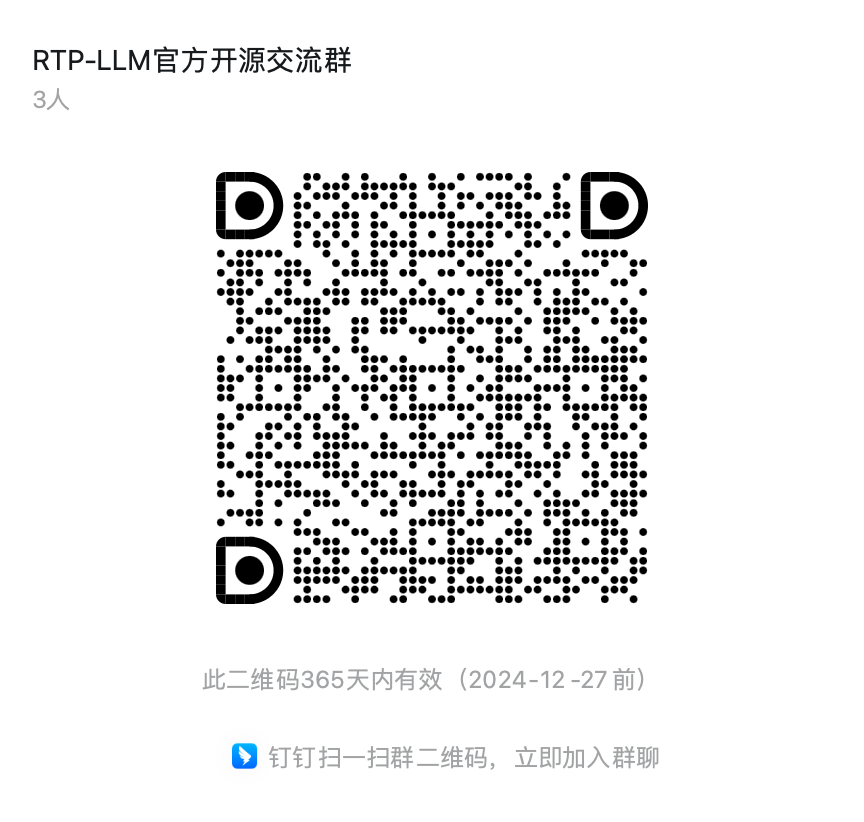

<div align="center" id="rtpllmtop">
</img>

[](https://github.com/alibaba/rtp-llm/tree/main/LICENSE)
[](https://github.com/alibaba/rtp-llm/issues)
[](https://github.com/alibaba/rtp-llm/issues)
</div>

--------------------------------------------------------------------------------

| [**Documentation**](https://rtp-llm.ai/)
| [**Contact Us**](#contact-us) |

## News
- [2025/09] 🔥 RTP-LLM 0.2.0 release with enhanced performance and new features
- [2025/01] 🚀 RTP-LLM now supports Prefill/Decode separation with detailed technical report
- [2025/01] 🌟 Qwen series model and bert embedding model now supported on Yitian ARM CPU
- [2024/06] 🔄 Major refactor: Scheduling and batching framework rewritten in C++, complete GPU memory management, and new Device backend
- [2024/06] 🏗️ Multi-hardware support in development: AMD ROCm, Intel CPU and ARM CPU support coming soon

<details>
<summary>More</summary>

- [大模型推理新突破：分布式推理技术探索与实践](https://mp.weixin.qq.com/s/Zs61CDerMwI7JKbFyD001Q)
- [为异构推理做好准备：次世代 RTP-LLM 推理引擎设计分享](https://mp.weixin.qq.com/s/bsB2QImcOZKHpmHMHd0P9w)
- [LLM推理加速：decode阶段的Attention在GPU上的优化](https://zhuanlan.zhihu.com/p/715348837)
- [LLM推理加速：decode阶段的Attention在GPU上的优化（二）](https://zhuanlan.zhihu.com/p/719068931)

</details>

## About
RTP-LLM is a Large Language Model (LLM) inference acceleration engine developed by Alibaba's Foundation Model Inference Team. It is widely used within Alibaba Group, supporting LLM service across multiple business units including Taobao, Tmall, Idlefish, Cainiao, Amap, Ele.me, AE, and Lazada.

RTP-LLM is a sub-project of the [havenask](https://github.com/alibaba/havenask) project.

## Key Features

### 🏢 Production Proven
Trusted and deployed across numerous LLM scenarios:
* Taobao Wenwen
* Alibaba's international AI platform, [Aidge](https://aidc-ai.com/)
* [OpenSearch LLM Smart Q&A Edition](https://www.aliyun.com/activity/bigdata/opensearch/llmsearch)
* [Large Language Model based Long-tail Query Rewriting in Taobao Search](https://arxiv.org/abs/2311.03758)

### ⚡ High Performance
* Utilizes high-performance CUDA kernels, including PagedAttention, FlashAttention, FlashDecoding, etc.
* Implements WeightOnly INT8 Quantization with automatic quantization at load time
* Support WeightOnly INT4 Quantization with [GPTQ](https://github.com/AutoGPTQ/AutoGPTQ) and [AWQ](https://github.com/casper-hansen/AutoAWQ)
* Adaptive KVCache Quantization
* Detailed optimization of dynamic batching overhead at the framework level
* Specially optimized for the V100 GPU

### 🔧 Flexibility and Ease of Use
* Seamless integration with the HuggingFace models, supporting multiple weight formats such as SafeTensors, Pytorch, and Megatron
* Deploys multiple LoRA services with a single model instance
* Handles multimodal inputs (combining images and text)
* Enables multi-machine/multi-GPU tensor parallelism
* Supports P-tuning models

### 🚀 Advanced Acceleration Techniques
* Loads pruned irregular models
* Contextual Prefix Cache for multi-turn dialogues
* System Prompt Cache
* Speculative Decoding

## Getting Started
- [Install RTP-LLM](https://rtp-llm.ai/build/en/start/install.html)
- [Quick Start](https://rtp-llm.ai/build/en/backend/send_request.html)
- [Backend Tutorial](https://rtp-llm.ai/build/en/references/deepseek/index.html)
- [Contribution Guide](https://rtp-llm.ai/build/en/references/Contributing.html)

## Benchmark and Performance
Learn more about RTP-LLM's performance in our benchmark reports:
- [Performance Benchmark Tool](https://rtp-llm.ai/build/en/benchmark/benchmark.html)

## Acknowledgments
Our project is mainly based on [FasterTransformer](https://github.com/NVIDIA/FasterTransformer), and on this basis, we have integrated some kernel implementations from [TensorRT-LLM](https://github.com/NVIDIA/TensorRT-LLM). We also draw inspiration from [vllm](https://github.com/vllm-project/vllm), [transformers](https://github.com/huggingface/transformers), [llava](https://github.com/haotian-liu/LLaVA), and [qwen-vl](https://github.com/QwenLM/Qwen-VL). We thank these projects for their inspiration and help.

## Citation
If you find RTP-LLM useful in your research or project, please consider citing:

```bibtex
@Misc{rtp-llm,
  author       = {Alibaba},
  title        = {RTP-LLM: A High-Performance LLM Inference Engine},
  howpublished = {\url{https://github.com/alibaba/rtp-llm}},
  year         = {2025},
}
```

## Contact Us

### DingTalk Group


### WeChat Group
