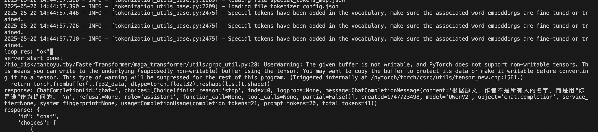

# 从零开始编译运行RTP-LLM
* 操作系统: Linux
* Python: 3.10
* NVIDIA GPU: Compute Capability 7.0 或者更高 (例如V100, T4, RTX20xx, A100, L4, H100等)

## 一. 环境搭建
在这篇文章我们将为大家介绍完整的RTP-LLM推理引擎系统的部署和使用路径。本文以一台单机4卡A10的机器为例子进行介绍。首先是我们的机器配置，我们给出GPU配置情况如下:
```shell
$nvidia-smi
Fri May 16 14:52:19 2025
+-----------------------------------------------------------------------------+
| NVIDIA-SMI 470.82.01    Driver Version: 470.82.01    CUDA Version: 12.6     |
|-------------------------------+----------------------+----------------------+
| GPU  Name        Persistence-M| Bus-Id        Disp.A | Volatile Uncorr. ECC |
| Fan  Temp  Perf  Pwr:Usage/Cap|         Memory-Usage | GPU-Util  Compute M. |
|                               |                      |               MIG M. |
|===============================+======================+======================|
|   0  NVIDIA A10          Off  | 00000000:00:09.0 Off |                 Off* |
|  0%   26C    P8    19W / 150W |      2MiB / 24258MiB |      0%      Default |
|                               |                      |                  N/A |
+-------------------------------+----------------------+----------------------+
|   1  NVIDIA A10          Off  | 00000000:00:0A.0 Off |                 Off* |
|  0%   27C    P8    20W / 150W |      2MiB / 24258MiB |      0%      Default |
|                               |                      |                  N/A |
+-------------------------------+----------------------+----------------------+
|   2  NVIDIA A10          Off  | 00000000:00:0B.0 Off |                 Off* |
|  0%   28C    P8    20W / 150W |      2MiB / 24258MiB |      0%      Default |
|                               |                      |                  N/A |
+-------------------------------+----------------------+----------------------+
|   3  NVIDIA A10          Off  | 00000000:00:0C.0 Off |                 Off* |
|  0%   30C    P8    21W / 150W |      2MiB / 24258MiB |      0%      Default |
|                               |                      |                  N/A |
+-------------------------------+----------------------+----------------------+

+-----------------------------------------------------------------------------+
| Processes:                                                                  |
|  GPU   GI   CI        PID   Type   Process name                  GPU Memory |
|        ID   ID                                                   Usage      |
|=============================================================================|
|  No running processes found                                                 |
+-----------------------------------------------------------------------------+
```
接下来我们需要拉取容器环境用于配置安装RTP-LLM。我们准备的容器如下:
registry.cn-hangzhou.aliyuncs.com/havenask/rtp_llm:2025_06_03_10_12_c02cc34

镜像名: registry.cn-hangzhou.aliyuncs.com/havenask/rtp_llm
版本号: 2025_06_03_10_12_c02cc34

### 1.1 拉取容器
```shell
docker pull registry.cn-hangzhou.aliyuncs.com/havenask/rtp_llm:2025_06_03_10_12_c02cc34
```

### 1.2 创建 Docker 容器，具体表现挂载盘根据自己本地机器存储来进行
```shell
## 1.下面-v是将自己的存储和外部宿主机的存储进行挂载连接，用户可以根据自己本地
## 存储进行灵活调整
## 2. --cap-add SYS_ADMIN 是针对高级用户，比如有源码级别开发需求的用户
## 3. --device <host_path>:<container_path>，保证将设备和宿主机容器进行正确映射
## 4. --volume 将 Docker 卷挂载到容器的 /usr/local/nvidia 目录中，并设为只读模式
## 5. -runtime=nvidia 指定容器使用 NVIDIA 运行时来支持 GPU 加速计算
## 6. --gpus all 保证容器与主机共享gpu
## 7. --net=host 可以让主机与容器进行网络共享，这对于高级用户而言进行ssh远程连接开发有用
docker run \
  --cap-add SYS_ADMIN --device /dev/fuse \
  -v /mnt/:/mnt/ \
  -v /ssd/1:/ssd/1 \
  -v /ssd/2:/ssd/2 \
  -v /data0:/data0 \
  -v /data1:/data1 \
  -v /dev/shm:/dev/shm \
  -v /hio_disk:/hio_disk \
  --device /dev/nvidia0:/dev/nvidia0 --device /dev/nvidiactl:/dev/nvidiactl \
  --volume=nvidia_driver_volume:/usr/local/nvidia:ro \
  --runtime=nvidia --gpus all \
  --name user_gpu \
  --net=host -dit \
  registry.cn-hangzhou.aliyuncs.com/havenask/rtp_llm:2025_06_03_10_12_c02cc34 \
  /bin/bash
```

### 1.3 在容器中创建用户（可选项，默认进去是root，对于高级开发者，可以选择创建自己的用户，不建议root用户进行源码开发）
```shell
## 创建个人开发用户
docker exec -i user_gpu /usr/sbin/useradd -MU -u <your_UID> <your_username>
## 将个人用户赋予root用户组, 放入到/etc/sudoers
your_username ALL=(ALL) NOPASSWD:ALL
```

### 1.4 进入容器
```shell
## 1.对于普通用户而言
docker exec -it container_name /bin/bash
## 2.针对高级用户而言，需要进入到自己的个人用户账号下面
## 获取容器 PID
docker inspect --format="{{ .State.Pid }}" user_gpu
## 使用 nsenter 进入容器, 如果在容器创建后直接使用docker exec -it进入容器，会出现pam_session相关的权限问题, 本文案例使用的<your_username>为tanboyu.tby
sudo nsenter --target PID --mount --uts --ipc --net --pid /usr/bin/su <your_username>
```
## 二. 编译运行
在上一步当中我们已经完成了环境搭建，接下来我们开始正式的进行RTP-LLM的编译运行。
### 2.1 代码拉取
```shell
git clone https://github.com/alibaba/rtp-llm.git FastTransformer
```
### 2.2 依赖安装相关问题说明
```shell
## nsightsystem（可选项，针对高级用户，有源码性能调试开发需求）
容器里面的nsys是放在/usr/local/cuda-12.6/bin/nsys，如果有需求需要将该路径加入到执行路径当中
```
另外如果在编译过程可能会遇到网络问题，建议换源
```shell
[global]
index-url = http://mirrors.aliyun.com/pypi/simple
trusted-host = mirrors.aliyun.com
```
### 2.3 编译启动服务
为了方便演示，我们采用的是Qwen2-0.5B小模型
```python
from transformers import AutoTokenizer, AutoModel

# 加载 tokenizer
tokenizer = AutoTokenizer.from_pretrained("Qwen/Qwen2-0.5B")

# 加载模型
model = AutoModel.from_pretrained("Qwen/Qwen2-0.5B")

# 使用模型进行推理
inputs = tokenizer("这是一个测试句子", return_tensors="pt")
outputs = model(**inputs)

# 输出一些结果来验证
print(outputs)
```
接下来准备服务启动脚本:
```python
### /hio_disk/tanboyu.tby/local_runner.py
import os
for key, value in os.environ.items():
    print(f"start env {key}={value}")

import sys
import signal
from threading import Thread
import requests
import time
import pathlib
import logging
import socket
from transformers import PreTrainedTokenizer

from typing import List, Dict, Optional

current_file_path = pathlib.Path(__file__).parent.absolute()
sys.path.append(str(current_file_path.parent.parent.absolute()))

from maga_transformer.start_server import main as server_main
from maga_transformer.distribute.gang_info import members_from_test_env

tokenizer: Optional[PreTrainedTokenizer] = None
next_random_seed = int(os.environ.get("RANDOM_SEED", 114514))
max_seq_len = int(os.environ["MAX_SEQ_LEN"])

def wait_server_start(server_thread: Optional[Thread], port: int):
    start_time = time.time()
    while True:
        time.sleep(1)
        try:
            if server_thread and not server_thread.is_alive():
                raise SystemExit("Server thread dead!")
            res = requests.get(f"http://127.0.0.1:{port}/status")
            print(f"loop res: {res.text}")
            break
        except Exception as e:
            print(f"Waiting server on {port}, used {time.time() - start_time}s: {e}")
            continue

def wait_master_done(env_dict: Dict[str, str] = {}) -> None:
    dist_config_str = env_dict.get("GANG_CONFIG_STRING", os.environ.get("GANG_CONFIG_STRING"))
    if (not dist_config_str):
        raise RuntimeError("no gang config string, unexpected!")
    dist_members = members_from_test_env(dist_config_str)
    master_member = dist_members[0]
    master_host = master_member.ip
    master_port = master_member.server_port
    world_rank = int(os.environ.get("WORLD_RANK", 0))
    while True:
        logging.info(f"rank [{world_rank}] waiting for master {master_host}:{master_port} done")
        time.sleep(10)
        try:
            sock = socket.create_connection((master_host, master_port), timeout=1000)
            sock.close()
        except (socket.error, ConnectionRefusedError):
            break
    logging.info(f"rank [{world_rank}] master {master_host}:{master_port} done, this worker exit!")
    return

def script_exit(pgrp_set: bool = False):
    sys.stdout.flush()
    if pgrp_set:
        os.killpg(0, signal.SIGKILL)
        os._exit(0)
    else:
        os._exit(0)

if __name__ == '__main__':
    port = int(os.environ["START_PORT"])
    world_rank = int(os.environ.get("WORLD_RANK", 0))

    pgrp_set = False
    try:
        os.setpgrp()
        pgrp_set = True
    except Exception as e:
        logging.info(f"setpgrp error: {e}")

    server_thread = Thread(target=server_main)
    server_thread.start()
    print(f"server thread started, waiting...")
    wait_server_start(None, port)
    print(f"server start done!")

    import openai # you want `pip install openai==1.3.9`
    from openai.types.chat import ChatCompletionMessageParam, ChatCompletionUserMessageParam
    openai.base_url = f"http://127.0.0.1:{int(os.environ['START_PORT'])}/"
    openai.api_key = "none"

    typed_messages: List[ChatCompletionMessageParam] = [
        ChatCompletionUserMessageParam(content="你是谁", role="user")
    ]

    response1 = openai.chat.completions.create(
        model="whatever",
        messages=typed_messages
    )
    print(f"response: {response1}")
    script_exit(pgrp_set)
```
然后开始进行编译运行
```shell
#!/bin/bash
set -x;
## 设定python的执行命令路径
export PYTHON_BIN=/opt/conda310/bin/python;
## 指定用户工作目录
export USER_HOME=/hio_disk/tanboyu.tby;
## 可以保证执行时立即打印日志
export PYTHONUNBUFFERED=TRUE;

## 项目导包使用的python路径
export PYTHONPATH=${USER_HOME}/FasterTransformer/:${PYTHONPATH}
## 指定日志路径
export PY_LOG_PATH=${USER_HOME}/FasterTransformer/logs

cd ${USER_HOME}/FasterTransformer

## 代码编译
bazelisk build //maga_transformer:maga_transformer --verbose_failures --config=cuda12_6 --keep_going || {
    echo "bazel build failed";
    exit 1;
};

## 创建软连接，因为这两个文件是编译生成的
ln -s ${USER_HOME}/bazel-bin/maga_transformer/cpp/proto/model_rpc_service_pb2_grpc.py maga_transformer/cpp/proto/;
ln -s ${USER_HOME}/bazel-bin/maga_transformer/cpp/proto/model_rpc_service_pb2.py maga_transformer/cpp/proto/;

## 用户需自行下载 https://huggingface.co/Qwen/Qwen2-0.5B
export CHECKPOINT_PATH="/mnt/nas1/hf/Qwen2-0.5B";
export TOKENIZER_PATH=${CHECKPOINT_PATH}

export MODEL_TYPE="qwen_2";
echo $MODEL_TYPE
export LD_LIBRARY_PATH=/opt/conda310/lib/:/usr/local/nvidia/lib64:/usr/lib64:/usr/local/cuda/lib64:/usr/local/cuda-12.6/extras/CUPTI/lib64/

# export FT_SERVER_TEST=1
## 设置TP并行度
export TP_SIZE=1
## 设置DP并行度
export DP_SIZE=1
## 设置EP并行度
export EP_SIZE=$((TP_SIZE * DP_SIZE))
## 参见docs/MultiGPU.md
export WORLD_SIZE=$EP_SIZE
## 参见docs/MultiGPU.md
export LOCAL_WORLD_SIZE=$EP_SIZE
## 用户请求的最大文本token数量
export MAX_SEQ_LEN=8192
## 模型一次性处理的最大上下文大小
export MAX_CONTEXT_BATCH_SIZE=1
## 并发限制
export CONCURRENCY_LIMIT=8

## RUNTIME内存容量限制
export RESERVER_RUNTIME_MEM_MB=4096
## 用于GPU内存分区为两份,一份用于KV-Cache,一份用于计算
export WARM_UP=1
## 服务启动端口号
export START_PORT=61348
## 是否开启性能打样
export NSIGHT_PERF=0
## 是否开启CUDA ASAN, 用于内存检测
export CUDA_ASAN=0

echo "" > logs/engine.log;

export DEVICE_RESERVE_MEMORY_BYTES=-2048000000;

if [ $NSIGHT_PERF -eq 1 ]; then
    ## 选择开启NSIGHT性能打样
    NSIGHT_CMD="$PYTHON_BIN ${USER_HOME}/local_runner.py";
    rm -rf report*.nsys-rep;
    /usr/local/bin/nsys profile \
    -c cudaProfilerApi \
    -b none \
    --wait=primary \
    --cpuctxsw=none \
    --sample=none \
    --trace='cuda,nvtx' \
    --trace-fork-before-exec=true $NSIGHT_CMD;
elif [ $CUDA_ASAN -eq 1 ]; then
    ## 需要进行CUDA ASAN内存检测
    /usr/local/cuda/compute-sanitizer/compute-sanitizer --print-limit 100000 --target-processes all \
    $PYTHON_BIN ${USER_HOME}/local_runner.py;
else
    ## 最朴素的服务启动方案
    $PYTHON_BIN ${USER_HOME}/local_runner.py;
fi

## 执行完脚本杀死进程
ps xauww  | grep rtp_llm | awk '{print $2}' | xargs kill -9;
```
### 2.4 运行结果
可以看到下面类似的相应返回即可视为成功

