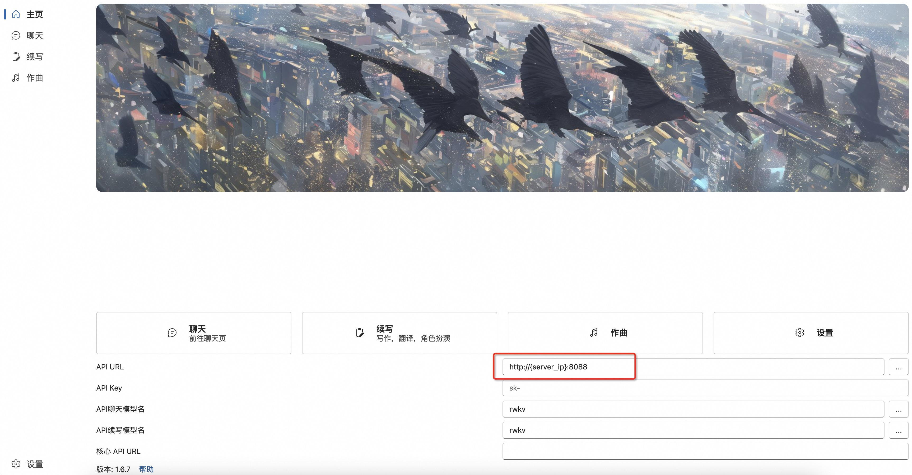
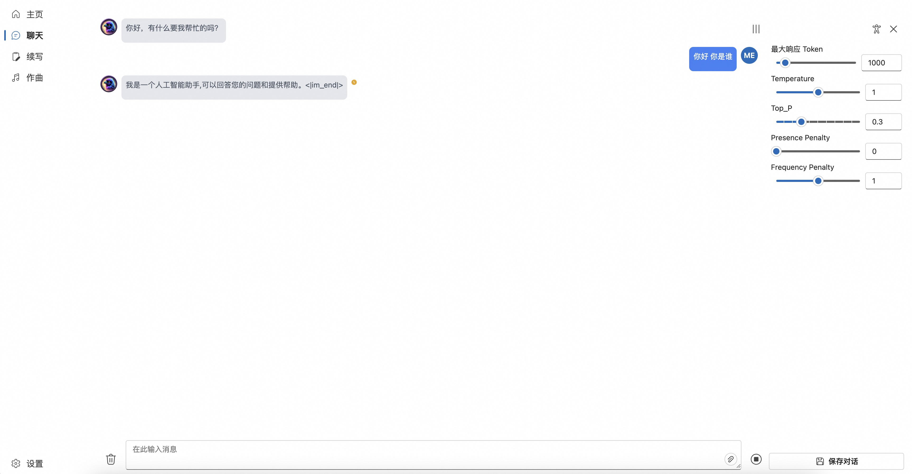

# RWKV-Runner

``` bash
export MODEL_TYPE=model_type
export TOKENIZER_PATH=/path/to/tokenizer
export CHECKPOINT_PATH=/path/to/model
export START_PORT=port

python3 -m maga_transformer.start_server
```

在客户端对应位置填写API URL：`{server_ip}:{port}`即可


* 在API URL填写服务ip和端口(默认8088)


* 之后可以直接使用chat功能，其本质上是调用`/v1/chat/completion`接口


* 其余接口(续写、作曲等)尚未适配，无法使用
