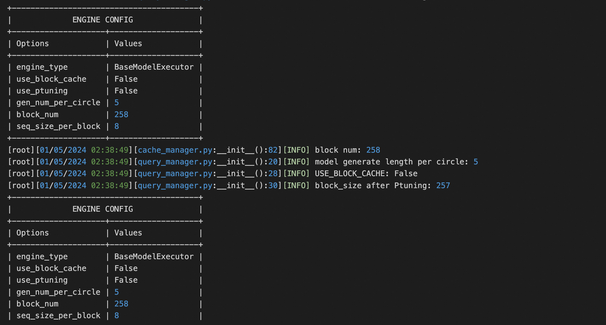

# 背景
rtp-llm框架目前集成草稿模型投机采样模式, 接下来是它的使用方式
## Speculative Decoding
使用草稿模型进行投机采样，需要指定大小模型，具体例子如下:

**注意：投机采样由于q和kv长度不一致，目前无法使用flash attention，需要在运行代码前配置环境变量`export ENABLE_FMHA=OFF`**
``` python
from maga_transformer.pipeline import Pipeline
from maga_transformer.model_factory import ModelFactory, ModelConfig

# gen_num_per_circle控制投机采样时每轮的最大token数
model_config = ModelConfig(
    model_type = "MODEL_TYPE",
    ckpt_path = "/path/to/ckpt",
    tokenizer_path = "/path/to/tokenizer",
    weight_type = "WEIGHT_TYPE"    
    gen_num_per_circle = 5
)

# 小模型的tokenizer理论上需要和大模型一致
sp_model_config = ModelConfig(
    model_type = "SP_MODEL_TYPE",
    ckpt_path = "/path/to/sp_ckpt",
    tokenizer_path = "/path/to/tokenizer",
    weight_type = "SP_WEIGHT_TYPE"
)

model = ModelFactory.from_model_config(model_config, sp_model_config)
pipeline = Pipeline(model, model.tokenizer)

generate_config = {
    "top_k": 1,
    "max_new_tokens": 100
}

for res in pipeline("hello, what's your name", generate_config =
generate_config):
    print(res.batch_response)
pipeline.stop()
```
草稿模型启动的log类似如下，能够看到构建了2个executor：



### 服务
在起服务时，草稿模型需要添加如下几个环境变量，具体可以参考`maga_transformer/model_factory.py:create_from_env()`:
- SP_CHECKPOINT_PATH: 草稿模型的checkpoint路径
- GEN_NUM_PER_CIRCLE： 每轮最大生成token数
- SP_WEIGHT_TYPE：草稿模型的量化类型
