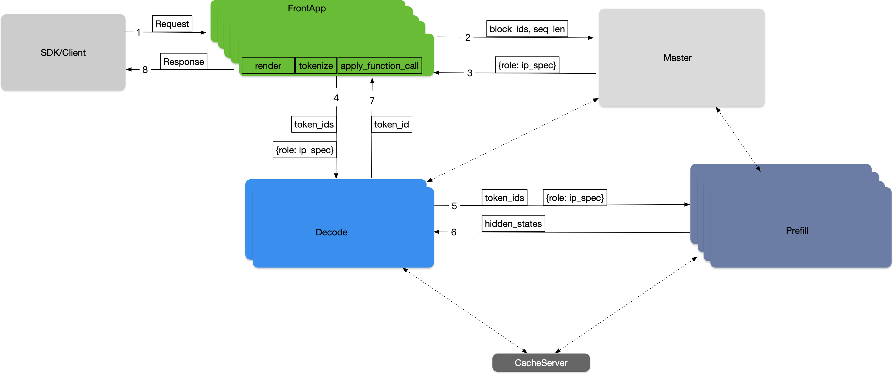

# FlexLB (Flexible Load Balancer) - Master Role

## Background

FlexLB (Flexible Load Balancer) is the Master role in RTP-LLM's distributed inference framework. It implements a multi-dimensional Quality of Service (QoS) Load Balance strategy for large model inference, coordinating between inference workers, cache servers, and other components.

The Master role was designed to address the limitations of random load balancing that caused uneven load distribution across machines, improving resource utilization for inference worker clusters scaled between 100-1000 nodes.

## System Architecture


### Key Components

1. **SDK/Client**: Core traffic entry point for large models
   - Request protocol parsing and traffic monitoring
   - Policy-based cluster selection using Weighted Round Robin

2. **Load Balance Scheduler (Master Role)**:
   - Distributed load balancer with Master-Slave Architecture
   - Real-time scheduling decisions with high availability
   - Dynamic load balancing based on node metrics (GPU utilization, memory usage, queue length)
   - State-aware routing with Prometheus/Grafana monitoring integration

3. **FrontApp Cluster**:
   - Independent deployment of Prefill Cluster's frontend functionality
   - Handles request rendering and tokenization

4. **Prefill Cluster**:
   - Handles initial input sequence parallel computing tasks

5. **Decoder Cluster**:
   - Handles subsequent generation step parallel inference tasks

6. **Cache Server**:
   - Distributed KV storage system for prefix-aware routing

## Load Balancing Strategies

The Master role implements different load balancing strategies for Prefill and Decode operations to optimize resource utilization and request latency:

### Prefill Strategy

For Prefill requests, the Master selects the optimal node based on:
- KV cache hit rate across different machines
- Estimated execution time for the request
- Waiting time in the queue
- The strategy aims to minimize the overall request completion time by choosing the node that can process the request most efficiently

### Decode Strategy

For Decode requests, the Master uses a different approach:
- Selects the node with the least KV cache usage
- This strategy helps distribute the Decode load evenly across available nodes
- Prevents any single node from becoming a bottleneck due to excessive KV cache consumption

These strategies work together to ensure optimal resource utilization and reduced latency across the entire inference pipeline.

## Usage

To use the FlexLB Master role in your RTP-LLM deployment:

1. Configure the Master node with appropriate cluster settings
2. Set up monitoring integration with Prometheus/Grafana for state-aware routing
3. Deploy FrontApp, Prefill, and Decoder clusters
4. Configure SDK/Client to use Weighted Round Robin for cluster selection

The Master role automatically handles load distribution, prefix-aware routing, and failover scenarios to optimize resource utilization and reduce request latency.


```bash


```