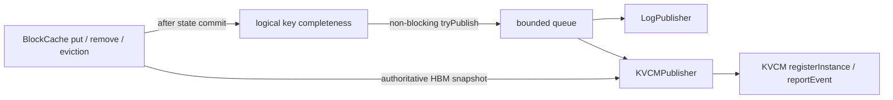

# KV cache event publisher

RTP-LLM can publish its local HBM prefix-cache state from the engine process. The feature is disabled by default and
supports three modes:

- `none`: no worker thread, queue, network connection, or event construction.
- `log`: asynchronously logs bounded event batches for rollout validation.
- `kvcm`: registers the instance and node with KVCM, then reports incremental changes and authoritative snapshots.



The implementation is isolated from the cache core under `rtp_llm/cpp/cache/events/`:

```text
events/
  KVCacheEvent.h                       # transport-neutral event and snapshot model
  KVCacheEventPublisher.h              # interface consumed by BlockCache
  KVCacheEventPublisherConfig.h        # construction-time configuration and identity
  KVCacheEventPublisherFactory.h/.cc   # the only concrete-publisher selection point
  KVCacheEventQueue.h/.cc              # bounded non-blocking ingress shared by async publishers
  NullPublisher.h/.cc                  # disabled implementation
  LogPublisher.h/.cc                   # rollout-validation implementation
  KVCMPublisher.h/.cc                  # KVCM protocol and synchronization implementation
  test/                                # Publisher factory, lifecycle, fault, and concurrency tests
```

`BlockCache` depends only on `KVCacheEventPublisher`; it does not include a concrete publisher, queue, HTTP, or KVCM
protocol type. `KVCacheManager` constructs the selected implementation through the factory.

## Event semantics

Events describe reusable logical cache keys, not physical block indices.

- A single-group cache emits `BLOCK_ADD` after a new key is committed.
- A hybrid cache emits `BLOCK_ADD` only after all required groups for the key exist.
- Removing or evicting one group from a complete hybrid key emits one `BLOCK_DELETE`.
- Duplicate inserts and LRU touches do not emit events.
- `put`, `pop`, `remove`, and `selectAndEvict` call the non-blocking publisher while holding the `BlockCache` mutex so
  event order matches cache state transitions. Network I/O remains exclusively on the publisher worker thread.

Only `tp_rank=0` is an event owner. Each DP replica has an independent owner and must use a distinct
`KV_CACHE_EVENT_HOST_IP_PORT`; the same identity must not be concurrently owned by two live replicas. Other TP ranks
use `NullPublisher`.
The HBM location spec is named `rtp_llm_hbm_<block_size_tokens>` and uses an
`rtp-llm://<host_ip_port>/hbm` URI. It represents the complete DP-replica location; its registered size is the sum of
all cache groups across all TP shards, while only the owner rank emits state transitions.

## KVCM synchronization

`KVCMPublisher` uses the KVCM Meta HTTP APIs:

1. `POST /api/registerInstance`
2. `EVENT_NODE_REGISTER` for the `hbm` medium
3. `EVENT_BLOCK_SNAPSHOT` from the current `BlockCache`
4. batched `EVENT_BLOCK_ADD` and `EVENT_BLOCK_DELETE`
5. periodic `EVENT_HEARTBEAT`
6. `EVENT_HOST_DOWN` only when the engine actually shuts down

`EVENT_HOST_DOWN` is a terminal lifecycle event, not a reconnect reset. Startup and recovery use an authoritative
snapshot to replace stale metadata. Within one mutation request, repeated transitions for the same block key are
coalesced to the last state because KVCM applies aggregated ADDs before aggregated DELETEs.

The queue is a bounded lock-free MPMC ring. Inference threads never wait for queue space, a consumer mutex, or network
I/O; enqueue fails only when the configured capacity is actually exhausted or shutdown has started. A
queue overflow, request failure, heartbeat failure, or periodic reconciliation marks the publisher dirty. After KVCM
is reachable, it registers the node and commits a new complete snapshot. Reporting is fail-open and never changes
cache allocation, reuse, eviction, engine readiness, or inference responses.

A snapshot is one authoritative replacement for a host and medium, so it is not split into independently committed
pages. It uses a separate, longer request timeout from control and incremental traffic. Choose the snapshot interval
and timeout from the deployment's maximum logical-key count and KVCM capacity; keep the KVCM heartbeat expiry longer
than the maximum accepted snapshot processing time. The KVCM endpoint must support `EVENT_BLOCK_SNAPSHOT` with
per-scope in-flight fencing and crash-safe commit semantics.

The first implementation publishes the device `BlockCache` as the `hbm` medium. DRAM cache events are not included.

## Configuration

The following server arguments also have equivalent upper-case environment variables.

| Argument | Default | Meaning |
|---|---:|---|
| `--kv_cache_event_publisher_type` | `none` | `none`, `log`, or `kvcm` |
| `--kv_cache_event_manager_endpoint` | empty | KVCM Meta HTTP endpoint, for example `http://127.0.0.1:56020` |
| `--kv_cache_event_instance_group` | empty | KVCM instance group; falls back to `reco_instance_group` |
| `--kv_cache_event_instance_id` | empty | Stable deployment-level instance ID |
| `--kv_cache_event_host_ip_port` | empty | Stable cache endpoint for this DP replica's TP owner |
| `--kv_cache_event_queue_capacity` | `100000` | Maximum queued mutations |
| `--kv_cache_event_report_batch_size` | `1000` | Maximum mutations per `ReportEvent` request |
| `--kv_cache_event_flush_interval_ms` | `20` | Maximum batch wait |
| `--kv_cache_event_heartbeat_interval_ms` | `1000` | Node heartbeat period |
| `--kv_cache_event_request_timeout_ms` | `1500` | Registration, heartbeat, and incremental request timeout |
| `--kv_cache_event_snapshot_timeout_ms` | `30000` | Full snapshot request timeout |
| `--kv_cache_event_retry_interval_ms` | `500` | Retry interval after registration or report failure |
| `--kv_cache_event_snapshot_interval_ms` | `300000` | Periodic authoritative reconciliation interval |
| `--kv_cache_event_log_max_keys` | `8` | Maximum key samples in each log batch |

`kvcm` mode requires the manager endpoint, instance group, instance ID, and host endpoint. Invalid configuration
disables the publisher while leaving inference available. `log` mode does not require KVCM settings.
The manager endpoint must be a resolved HTTP endpoint; this version does not perform KVCM service discovery or
leader switching inside RTP-LLM.

Publisher state, queue depth, accepted events, and dropped events are exported as
`rtp_llm_kv_cache_event_publisher_state`, `rtp_llm_kv_cache_event_queue_size`,
`rtp_llm_kv_cache_event_accepted_count`, and `rtp_llm_kv_cache_event_dropped_count`. A non-zero dropped count means an
authoritative resync is required; alert on sustained non-`READY` state in `kvcm` mode and on queue growth or drops.
State values are `DISABLED=0`, `STARTING=1`, `LOGGING=2`, `REGISTERING=3`, `RESYNCING=4`, `READY=5`, `DEGRADED=6`, and
`STOPPED=7`.

Example validation rollout:

```bash
KV_CACHE_EVENT_PUBLISHER_TYPE=log \
KV_CACHE_EVENT_INSTANCE_ID=my-model-v1 \
KV_CACHE_EVENT_HOST_IP_PORT=10.0.0.8:18000 \
python -m rtp_llm.start_server ...
```

Example KVCM rollout:

```bash
KV_CACHE_EVENT_PUBLISHER_TYPE=kvcm \
KV_CACHE_EVENT_MANAGER_ENDPOINT=http://kvcm-meta:56020 \
KV_CACHE_EVENT_INSTANCE_GROUP=production \
KV_CACHE_EVENT_INSTANCE_ID=my-model-v1 \
KV_CACHE_EVENT_HOST_IP_PORT=10.0.0.8:18000 \
python -m rtp_llm.start_server ...
```
