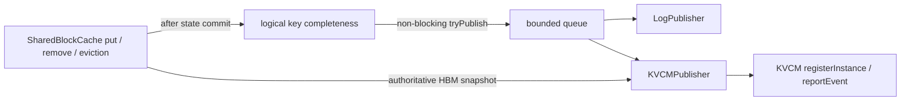

# KV cache event publisher

RTP-LLM can publish its local HBM prefix-cache state from the engine process. The feature is disabled by default and
supports three modes:

- `none`: no worker thread, queue, network connection, or event construction.
- `log`: asynchronously logs bounded event batches for rollout validation.
- `kvcm`: registers the instance and node with KVCM, then reports incremental changes and authoritative snapshots.


```mermaid
flowchart LR
    Cache["SharedBlockCache put / remove / eviction"] -->|"after state commit"| Logical["logical key completeness"]
    Logical -->|"non-blocking tryPublish"| Queue["bounded queue"]
    Queue --> Log["LogPublisher"]
    Queue --> KVCM["KVCMPublisher"]
    KVCM --> API["KVCM registerInstance / reportEvent"]
    Cache -->|"authoritative HBM snapshot"| KVCM
```

The implementation is isolated from the cache core under `rtp_llm/cpp/cache/events/`:

```text
events/
  KVCacheEvent.h                       # transport-neutral event and snapshot model
  KVCacheEventPublisher.h              # interface consumed by SharedBlockCache
  KVCacheEventPublisherConfig.h        # construction-time configuration and identity
  KVCacheEventPublisherFactory.h/.cc   # the only concrete-publisher selection point
  KVCacheEventQueue.h/.cc              # bounded non-blocking ingress shared by async publishers
  NullPublisher.h/.cc                  # disabled implementation
  LogPublisher.h/.cc                   # rollout-validation implementation
  KVCMPublisher.h/.cc                  # KVCM protocol and synchronization implementation
  test/                                # Publisher factory, lifecycle, fault, and concurrency tests
```

`SharedBlockCache` depends only on `KVCacheEventPublisher`; it does not include a concrete publisher, queue, HTTP, or
KVCM protocol type. `KVCacheManager` constructs the selected implementation through the factory.

## Event semantics

Events describe reusable logical cache keys, not physical block indices.

- A single-group cache emits `BLOCK_ADD` after a new key is committed.
- A hybrid cache emits `BLOCK_ADD` only after all required groups for the key exist.
- Removing or evicting one group from a complete hybrid key emits one `BLOCK_DELETE`.
- Duplicate inserts and LRU touches do not emit events.
- `put`, `remove`, `selectAndEvict`, and `selectAndEvictForGroup` call the non-blocking publisher while holding the
  `SharedBlockCache` mutex so event order matches cache state transitions. Network I/O remains exclusively on the
  publisher worker thread.

Only `tp_rank=0` is an event owner when `pp_size=1`. Each DP replica has an independent owner and must use a distinct
`KV_CACHE_EVENT_HOST_IP_PORT`; the same identity must not be concurrently owned by two live replicas. Other TP ranks
use `NullPublisher`. Pipeline parallelism is not supported yet because RTP-LLM does not expose a stable PP-stage rank
to this component; when `pp_size>1`, the publisher is disabled with a warning to prevent multiple stages from using
the same KVCM identity.
CP sharded KV cache (`prefill_cp_config.kv_cache_sharded` with `tp_size>1`) is also unsupported: per-rank cache keys
use the CP virtual block granularity (`seq_size_per_block * cp_size` tokens), which differs from the block size the
publisher would register. When CP sharding is enabled the publisher is disabled with a warning.
The HBM location spec is named `rtp_llm_hbm_<block_size_tokens>` and uses an
`rtp-llm://<host_ip_port>/hbm` URI. It represents the complete DP-replica location; its registered size is the sum of
all cache groups across all TP shards, while only the owner rank emits state transitions.

## KVCM synchronization

`KVCMPublisher` uses the KVCM Meta HTTP APIs:

1. `POST /api/registerInstance`
2. `EVENT_NODE_REGISTER` for the `hbm` medium
3. `EVENT_BLOCK_SNAPSHOT` from the current `SharedBlockCache`
4. batched `EVENT_BLOCK_ADD` and `EVENT_BLOCK_DELETE`
5. periodic `EVENT_HEARTBEAT`
6. `EVENT_HOST_DOWN` only when the engine actually shuts down

`EVENT_HOST_DOWN` is a terminal lifecycle event, not a reconnect reset. Startup and recovery use an authoritative
snapshot to replace stale metadata. Within one mutation request, repeated transitions for the same block key are
coalesced to the last state because KVCM applies aggregated ADDs before aggregated DELETEs.
Publisher instances are one-shot: repeated `start()` calls are idempotent while running, but `start()` returns false
after `stop()`. Recreate the publisher to start a new lifecycle.

The queue is a bounded lock-free MPMC ring and assigns event sequence numbers from the committed queue order, so
concurrent producers cannot publish a sequence inversion. Inference threads never wait for queue space, a consumer
mutex, or network I/O; enqueue fails only when the configured capacity is actually exhausted or shutdown has started. A
queue overflow, request failure, heartbeat failure, or periodic reconciliation marks the publisher dirty. After KVCM
is reachable, it registers the node and commits a new complete snapshot. Reporting is fail-open and never changes
cache allocation, reuse, eviction, engine readiness, or inference responses.

A snapshot is one authoritative replacement for a host and medium, so it is not split into independently committed
pages. It uses a separate, longer request timeout from control and incremental traffic. Choose the snapshot interval
and timeout from the deployment's maximum logical-key count and KVCM capacity; keep the KVCM heartbeat expiry longer
than the maximum accepted snapshot processing time. The KVCM endpoint must support `EVENT_BLOCK_SNAPSHOT` with
per-scope in-flight fencing and crash-safe commit semantics.
If a snapshot upload fails, the worker retries the same captured and serialized payload with exponential backoff
(starting at `kv_cache_event_retry_interval_ms` and growing up to 30 seconds, or retaining a larger configured base)
instead of copying the cache again. If new dirty generations keep arriving while snapshots succeed, reconciliations
are separated by at least the base retry interval; due heartbeats are sent before the next reconciliation.
During shutdown, the built-in HTTP reporter cancels an in-flight snapshot transfer before joining the worker. A
control or incremental request already in flight remains bounded by `kv_cache_event_request_timeout_ms`; a best-effort
`EVENT_HOST_DOWN` is sent only when the worker still has a registered session.

The first implementation publishes the device `SharedBlockCache` as the `hbm` medium. DRAM cache events are not
included.

## Configuration

The following server arguments also have equivalent upper-case environment variables.

| Argument | Default | Meaning |
|---|---:|---|
| `--kv_cache_event_publisher_type` | `none` | `none`, `log`, or `kvcm` |
| `--kv_cache_event_manager_endpoint` | empty | KVCM Meta HTTP endpoint, for example `http://127.0.0.1:56020` |
| `--kv_cache_event_instance_group` | empty | KVCM instance group; falls back to `reco_instance_group` |
| `--kv_cache_event_instance_id` | empty | Stable deployment-level instance ID |
| `--kv_cache_event_host_ip_port` | empty | Stable cache endpoint for this DP replica's TP owner |
| `--kv_cache_event_queue_capacity` | `100000` | Maximum queued mutations |
| `--kv_cache_event_report_batch_size` | `1000` | Maximum mutations per `ReportEvent` request |
| `--kv_cache_event_flush_interval_ms` | `20` | Maximum batch wait |
| `--kv_cache_event_heartbeat_interval_ms` | `1000` | Node heartbeat period |
| `--kv_cache_event_request_timeout_ms` | `1500` | Registration, heartbeat, and incremental request timeout |
| `--kv_cache_event_snapshot_timeout_ms` | `30000` | Full snapshot request timeout |
| `--kv_cache_event_retry_interval_ms` | `500` | Base failure-backoff and continuous-resync throttle interval |
| `--kv_cache_event_snapshot_interval_ms` | `300000` | Periodic authoritative reconciliation interval |
| `--kv_cache_event_log_max_keys` | `8` | Maximum key samples in each log batch |

`kvcm` mode requires the manager endpoint, instance group, instance ID, and host endpoint. Invalid configuration
disables the publisher while leaving inference available. `log` mode does not require KVCM settings.
The manager endpoint must be a resolved HTTP endpoint; this version does not perform KVCM service discovery or
leader switching inside RTP-LLM.
Publisher type values are case-sensitive for both CLI arguments and environment variables; invalid values are rejected
during argument parsing. In mixed CLI + environment mode, this strict `choices` validation applies only to the new
`--kv_cache_event_publisher_type` argument; pre-existing arguments with `choices` (PDFusion scheduler mode, cache-store
RDMA mode, KV-cache dtype, MoE backend selectors) keep their legacy tolerance for stale invalid env values and surface
them via an ERROR log instead of failing startup. Empty environment values are treated as "unset" (on both the pure-env
and the mixed path) only for the 14 `kv_cache_event_*` environment variables introduced by this feature; every other
argument keeps the legacy semantics where an empty value is bound as-is, so existing deployments that set an env
variable to an empty string as an explicit "disable" switch are unaffected. Environment values rejected by an explicit
converter such as `str2bool` (e.g. a misspelled boolean) abort startup with an argparse error, matching the pure
environment-variable mode. Only plain numeric conversion failures (`ValueError`/`TypeError`) retain the legacy
fallback-to-default behavior and emit a warning naming the ignored variable.

`KVCacheConfig` pickle state supports the legacy 43- and 54-element layouts plus the current 68-element layout. The
current layout cannot be deserialized by an older binary, so processes that exchange pickled configuration during
spawn or restart must be upgraded together. Roll back those components as one version as well; do not run an older
consumer while a newer process can emit the 68-element state.

Publisher state, queue depth, accepted events, and dropped events are exported as
`rtp_llm_kv_cache_event_publisher_state`, `rtp_llm_kv_cache_event_queue_size`,
`rtp_llm_kv_cache_event_accepted_count`, and `rtp_llm_kv_cache_event_dropped_count`. The two count metrics are
publisher-instance cumulative gauges and reset when the publisher or process is recreated. Dashboards and alerts
should use reset-aware deltas or rates rather than their absolute values. An increase in dropped count means an
authoritative resync is required; alert on sustained non-`READY` state in `kvcm` mode and on queue growth or new drops.
Only the `tp_rank=0`, `pp_size=1` owner can become `READY`; non-owner TP ranks intentionally export `DISABLED`. Scope
alerts to the owner rank. If a dashboard cannot filter by rank before aggregating a running DP replica, use the maximum
publisher state rather than a minimum or average so the expected non-owner `DISABLED=0` series does not trigger a
false failure.
State values are `DISABLED=0`, `STARTING=1`, `LOGGING=2`, `REGISTERING=3`, `RESYNCING=4`, `READY=5`, `DEGRADED=6`, and
`STOPPED=7`.

Example validation rollout:

```bash
KV_CACHE_EVENT_PUBLISHER_TYPE=log \
KV_CACHE_EVENT_INSTANCE_ID=my-model-v1 \
KV_CACHE_EVENT_HOST_IP_PORT=10.0.0.8:18000 \
python -m rtp_llm.start_server ...
```

Example KVCM rollout:

```bash
KV_CACHE_EVENT_PUBLISHER_TYPE=kvcm \
KV_CACHE_EVENT_MANAGER_ENDPOINT=http://kvcm-meta:56020 \
KV_CACHE_EVENT_INSTANCE_GROUP=production \
KV_CACHE_EVENT_INSTANCE_ID=my-model-v1 \
KV_CACHE_EVENT_HOST_IP_PORT=10.0.0.8:18000 \
python -m rtp_llm.start_server ...
```
