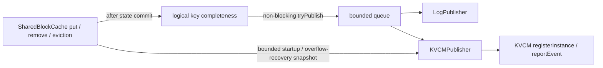

# KV cache event publisher

RTP-LLM can publish its local HBM prefix-cache state from the engine process. The feature is disabled by default and
supports three modes:

- `none`: no worker thread, queue, network connection, or event construction.
- `log`: asynchronously logs bounded event batches for rollout validation.
- `kvcm`: registers the instance and node with KVCM, then reports incremental changes and authoritative snapshots.


```mermaid
flowchart LR
    Cache["SharedBlockCache put / remove / eviction"] -->|"after state commit"| Logical["logical key completeness"]
    Logical -->|"non-blocking tryPublish"| Queue["bounded queue"]
    Queue --> Log["LogPublisher"]
    Queue --> KVCM["KVCMPublisher"]
    KVCM --> API["KVCM registerInstance / reportEvent"]
    Cache -->|"bounded startup / overflow-recovery snapshot"| KVCM
```

The implementation is isolated from the cache core under `rtp_llm/cpp/cache/events/`:

```text
events/
  KVCacheEvent.h                       # transport-neutral event and snapshot model
  KVCacheEventPublisher.h              # interface consumed by SharedBlockCache
  KVCacheEventPublisherConfig.h        # construction-time configuration and identity
  KVCacheEventPublisherFactory.h/.cc   # the only concrete-publisher selection point
  KVCacheEventAdmissionGate.h          # lifetime and reusable recovery fences for producers
  KVCacheEventQueue.h/.cc              # bounded non-blocking ingress shared by async publishers
  KVCacheEventMetrics.h/.cc            # isolated publisher health metrics
  KVCacheEventReporter.h               # transport seam used by the KVCM state machine
  CurlKVCacheEventReporter.h/.cc       # bounded, cancellable production HTTP transport
  KVCMRequestBuilder.h/.cc             # size-limited protocol serialization and coalescing
  KVCMPublisherUtils.h/.cc              # response parsing and endpoint validation
  KVCMLogicalMirror.h/.cc              # bounded final-state mirror and streaming set diff
  NullPublisher.h/.cc                  # disabled implementation
  LogPublisher.h/.cc                   # rollout-validation implementation
  KVCMPublisher.h/.cc                  # KVCM protocol and synchronization implementation
  test/                                # Publisher factory, lifecycle, fault, and concurrency tests
```

`SharedBlockCache` depends only on `KVCacheEventPublisher`; it does not include a concrete publisher, queue, HTTP, or
KVCM protocol type. `KVCacheManager` constructs the selected implementation through the factory.

## Event semantics

Events describe reusable logical cache keys, not physical block indices.

- A single-group cache emits `BLOCK_ADD` after a new key is committed.
- A hybrid cache emits `BLOCK_ADD` only after all required groups for the key exist.
- Removing or evicting any required group from a complete hybrid key emits one `BLOCK_DELETE`. Required groups are
  densely materialized groups that participate in prefix reuse; removing a non-required LINEAR/SWA group does not
  change the published logical key and emits no event.
- Duplicate inserts and LRU touches do not emit events.
- Full-key removal and eviction advance `SharedBlockCache::version()` as well as changing the key map, so downstream
  `CacheStatusPB.version` freshness checks cannot retain a pre-eviction cache view.
- The production cache capacity is intentionally much larger than the block pool, so normal pressure is handled by
  `selectAndEvict*`, whose caller also owns offload and eviction metrics. Reaching the defensive metadata bound directly
  rejects the new optional reusable index entry instead of letting the underlying LRU silently discard a referenced
  item: `SharedBlockCache::put` returns `false`, increments
  `rtp_llm_kv_cache_event_cache_insert_rejected_count`, and leaves the existing cache, event stream, and
  request-owned blocks unchanged. This cache-core safety contract is identical with event publication on or off.
- `put`, `remove`, `selectAndEvict`, and `selectAndEvictForGroup` call the non-blocking publisher while holding the
  `SharedBlockCache` mutex so event order matches cache state transitions. Network I/O remains exclusively on the
  publisher worker thread. A new key's cache-owned block references are established before its `BLOCK_ADD` is
  enqueued, while `BLOCK_DELETE` is enqueued before the removed references are released by the caller.

Only `tp_rank=0` is an event owner when `pp_size=1`. Each DP replica has an independent owner and must use a distinct
`KV_CACHE_EVENT_HOST_IP_PORT`. DP replicas may share one KVCM `instance_id`; KVCM isolates each reporter, snapshot,
heartbeat, and host lifecycle by the `(instance_id, host_ip_port)` pair. That exact pair must not be concurrently owned
by two live replicas. Other TP ranks use `NullPublisher`. Pipeline parallelism is not supported yet because RTP-LLM
does not expose a stable PP-stage rank to this component; when `pp_size>1`, the publisher is disabled with a warning to
prevent multiple stages from using the same KVCM reporter identity.
Because one process cannot inspect another DP process's environment, `dp_size>1` also emits a startup warning with the
current `(instance_id, host_ip_port, dp_rank)` rather than guessing uniqueness or rewriting a routable address.
CP sharded KV cache (`prefill_cp_config.kv_cache_sharded` with `tp_size>1`) is also unsupported: per-rank cache keys
use the CP virtual block granularity (`seq_size_per_block * cp_size` tokens), which differs from the block size the
publisher would register. When CP sharding is enabled the publisher is disabled with a warning.
The HBM location spec is named `rtp_llm_hbm_<block_size_tokens>` and uses an
`rtp-llm://<host_ip_port>/hbm?size=<bytes>` URI. It represents the complete DP-replica location; both the registered
size and the URI `size` parameter are the sum of all densely materialized, reuse-participating cache groups across all
TP shards, while only the owner rank emits state transitions. KVCM reads the URI parameter when accounting storage
usage for reported events.

## KVCM synchronization

`KVCMPublisher` uses the KVCM Meta HTTP APIs:

1. `POST /api/registerInstance`
2. `EVENT_NODE_REGISTER` for the `hbm` medium
3. `EVENT_BLOCK_SNAPSHOT` from the current `SharedBlockCache`
4. batched `EVENT_BLOCK_ADD` and `EVENT_BLOCK_DELETE`
5. periodic `EVENT_HEARTBEAT`
6. `EVENT_HOST_DOWN` when the engine shuts down or the publisher opens a terminal circuit

`EVENT_HOST_DOWN` is a terminal lifecycle event, not a reconnect reset. Startup and recovery use an authoritative
snapshot to replace stale metadata. Within one mutation request, repeated transitions for the same block key are
coalesced to the last state. This bounds payload size and preserves ordering with both current KVCM and older servers
that grouped ADD and DELETE writes within one request.
Publisher instances are one-shot: repeated `start()` calls are idempotent while running, but `start()` returns false
after `stop()`. Recreate the publisher to start a new lifecycle.

The queue is a bounded lock-free MPSC ring and assigns event sequence numbers from the committed queue order, so
concurrent producers cannot publish a sequence inversion. Inference threads never block on queue space, a consumer
mutex, or network I/O. A producer may retry briefly under contention, but it never waits for space or consumer progress;
enqueue fails only when the configured capacity is actually exhausted or shutdown has started.
Cache mutation semantics never depend on the publish result: allocation, reuse, eviction, and removal commit first,
while exporter failure only disables later publication attempts.
The worker maintains its own logical-key mirror after one bounded startup snapshot, and it keeps draining queued
mutations into that mirror while network retries are backing off. Transient request, heartbeat, registration, and
snapshot failures therefore reconcile without rescanning or locking the live cache.
Full snapshot serialization and upload also run independently of mirror ingestion: while the immutable payload is
being built or is in flight, the worker continues draining the bounded queue into the next logical generation without
sending concurrent deltas. On commit it diffs the captured, sorted key set against the current mirror and serially
replays only the final ADD/DELETE state in normal batches. The sorted diff is generated directly into one bounded
batch at a time; it never materializes a second source-plus-target mutation journal. If more events arrive during that
replay, the committed target becomes the next exact remote baseline and another final-state diff catches up without
issuing a new full snapshot. Repeated transitions fold away, so this needs no unbounded event journal and sustained
traffic does not turn into a loop of full snapshots. A KVCM `snapshot_required` (either the response field or
`SNAPSHOT_REQUIRED` code) is deliberately different from a lost
registration: the reporter identity remains valid, while the remembered remote baseline is discarded and the worker
sends a new authoritative snapshot without re-registering. Heartbeats keep their own deadline and are still sent while
the snapshot request is in flight; KVCM data events do not refresh node
liveness. A slow but healthy snapshot therefore cannot fill the producer queue or make the reporter invisible merely
by occupying its longer HTTP timeout. If an in-flight heartbeat requested a snapshot, one post-commit heartbeat verifies
that the just-committed generation is visible before the worker acknowledges the advisory.

A queue overflow means at least one incremental transition was lost, but it does not affect the committed cache
mutation. `LogPublisher`, which has no authoritative state source, permanently opens only its own exporter circuit.
`KVCMPublisher` instead returns `DROPPED_RECOVERABLE` and closes a reusable admission epoch using producer-side atomics
only; it performs no transport call, cancellation, logging, cache scan, or wait on an inference thread. Its worker then:

1. waits for every producer already admitted to that epoch to leave;
2. discards the unordered queue backlog and any obsolete retry payload;
3. reopens admission before acquiring the cache snapshot lock;
4. replaces its logical mirror from a bounded authoritative `SharedBlockCache` snapshot; and
5. reconciles that state to KVCM with a full snapshot.

Mutations made while admission is paused are necessarily included in the later cache snapshot. Mutations admitted
around the snapshot lock may appear in both the snapshot and the new queue epoch, which is safe because the mirror and
protocol operations are idempotent final-state updates. If the fresh epoch overflows while the snapshot is being
captured, the worker repeats the handoff before sending an older baseline. The retained snapshot provider holds only a
`weak_ptr` to `SharedBlockCache`, so recovery introduces no ownership cycle. A snapshot-provider exception or resource
limit is terminal for the exporter, but cache allocation, reuse, eviction, engine readiness, and inference responses
still continue unchanged.

Deterministic protocol/configuration errors and batch, mirror, or JSON payload resource limits use fail-closed exporter
behavior. Queue and logical-mirror ceilings bound resident memory; independent incremental and snapshot byte ceilings
bound transient serialization. Every KVCM response is rejected above 1 MiB
before JSON parsing, including responses supplied by an injected or future transport. Raw NUL bytes and JSON nesting
deeper than 64 containers are also rejected before DOM construction, preventing a small hostile response from
exhausting the worker stack. A rejected response is an unsuccessful protocol attempt and follows the same bounded
backoff as a malformed response; exceeding a local mirror, batch, or request-payload limit opens only the exporter
circuit and sends a best-effort `HOST_DOWN` when registered. Neither path rolls back or fails a cache mutation.
`INSTANCE_NOT_EXIST` from `ReportEvent` is recoverable: the worker reruns idempotent instance and node registration,
rebuilds its pending snapshot from the latest mirror, and resumes. The same error from `RegisterInstance` means
registration cannot create the configured instance and is terminal for the exporter. Cache allocation, reuse,
eviction, engine readiness, and inference responses continue unchanged. Recreate or restart the process after
correcting a terminal capacity, instance/storage configuration, or protocol error; a recoverable KVCM queue overflow
does not require process recreation or emit `HOST_DOWN`.

A snapshot is one authoritative replacement for a host and medium, so it is not split into independently committed
pages. It uses a separate, longer request timeout from control and incremental traffic. Choose the snapshot interval
and timeout from the deployment's maximum logical-key count and KVCM capacity. The KVCM endpoint must support
`EVENT_BLOCK_SNAPSHOT` with per-scope in-flight fencing and crash-safe commit semantics.
If a snapshot upload fails, the worker retries the same captured and serialized payload with an independent exponential
backoff (starting at `kv_cache_event_retry_interval_ms` and growing up to 30 seconds, or retaining a larger configured
base); successful heartbeats do not reset this snapshot backoff or cause another cache copy. KVCM `retry_after_ms`,
partial item failures, registration-loss codes, and successful `snapshot_required` advisories are interpreted from the
structured response. Every item in a batch participates in classification, so an earlier transient failure cannot hide
a later registration loss, snapshot advisory, or deterministic protocol error. If new dirty generations arrive while
a snapshot payload is in flight, they remain in the worker
mirror and are reconciled through the post-commit final-state diff rather than mutating the payload whose generation
KVCM is committing. A structurally valid response carrying a newer, unknown error code remains a parsed failure:
retry and snapshot advisories are preserved, while the failed operation is never acknowledged as successful.
Periodic deadlines are rescheduled from a successful authoritative commit, so a snapshot that takes longer than its
configured interval does not immediately trigger another snapshot.
An ambiguous incremental failure deliberately escalates to an authoritative full snapshot: the server might have
committed the request even when the client did not receive its response, and correctness takes priority over assuming a
remote baseline. This recovery is bounded by `snapshot_max_keys`, `snapshot_max_bytes`, and `snapshot_timeout_ms`.
Separate snapshot-attempt and snapshot-commit counters expose any control-plane amplification caused by retries or
transient mutation failures.
During shutdown, the built-in HTTP reporters cancel in-flight registration, control, incremental, and snapshot
transfers before joining the worker. A separate reporter gives a registered session at most 500 ms to send the
best-effort `EVENT_HOST_DOWN`; KVCM lease cleanup remains the fallback.

The first implementation publishes the device `SharedBlockCache` as the `hbm` medium. DRAM cache events are not
included. If a densely materialized prefix-reuse group is explicitly placed in `HOST` or `HOST_PINNED` memory, the
publisher is gated off with a warning: silently counting host bytes in the HBM spec or publishing only part of a
logical cache would both make routing metadata incorrect.

## Configuration

The following server arguments also have equivalent upper-case environment variables.

| Argument | Default | Meaning |
|---|---:|---|
| `--kv_cache_event_publisher_type` | `none` | `none`, `log`, or `kvcm` |
| `--kv_cache_event_manager_endpoint` | empty | KVCM Meta HTTP endpoint, for example `http://127.0.0.1:56020` |
| `--kv_cache_event_instance_group` | empty | KVCM instance group; falls back to `reco_instance_group` |
| `--kv_cache_event_instance_id` | empty | Stable deployment-level instance ID |
| `--kv_cache_event_host_ip_port` | empty | Stable IPv4/hostname, optionally with port, for this DP replica's TP owner; IPv6 is not supported by KVCM location URIs |
| `--kv_cache_event_queue_capacity` | `100000` | Maximum queued mutations; range `1..1048576` |
| `--kv_cache_event_report_batch_size` | `1000` | Maximum mutations per `ReportEvent` request; range `1..16384` |
| `--kv_cache_event_flush_interval_ms` | `20` | Maximum batch wait |
| `--kv_cache_event_heartbeat_interval_ms` | `1000` | Node heartbeat period |
| `--kv_cache_event_request_timeout_ms` | `1500` | Registration, heartbeat, and incremental request timeout |
| `--kv_cache_event_snapshot_timeout_ms` | `30000` | Full snapshot request timeout |
| `--kv_cache_event_retry_interval_ms` | `500` | Base failure-backoff and continuous-resync throttle interval |
| `--kv_cache_event_snapshot_interval_ms` | `300000` | Periodic authoritative reconciliation interval |
| `--kv_cache_event_log_max_keys` | `8` | Maximum key samples in each log batch |
| `--kv_cache_event_snapshot_max_keys` | `1000000` | Maximum logical keys retained by the worker mirror and startup snapshot; range `1..1000000` |
| `--kv_cache_event_snapshot_max_bytes` | `268435456` | Maximum serialized authoritative snapshot payload; range `1..268435456` |

`kvcm` mode requires the manager endpoint, instance ID, and host endpoint. The event instance group inherits the
effective `reco_instance_group` when its dedicated setting is empty. Falling all the way back to the shipped
placeholder `default` remains compatible but emits a startup warning: deployments should set one of the two group
variables explicitly so unrelated instances cannot be grouped accidentally. The argument parser rejects missing
required fields before engine startup;
the C++ publisher still validates defensively and falls back without affecting inference if configuration arrives
through a non-CLI construction path. `log` mode does not require KVCM settings.
The manager endpoint must be a resolved `http://` or `https://` endpoint with a non-empty authority and no query,
fragment, credentials, whitespace, or invalid port. Bracketed authorities must contain a syntactically valid IPv6
literal. Malformed endpoints disable the publisher before its worker starts. This version does not perform KVCM service
discovery or leader switching inside RTP-LLM. Event instance/group identities must be non-empty printable ASCII without
whitespace. The event instance ID must either be new or already have exactly the same immutable KVCM registration; a
conflicting pre-existing instance causes KVCM to return `DUPLICATE_ENTITY` and permanently disables only the exporter.
The same configured endpoint is used for independent control/incremental and snapshot HTTP clients, so a KVCM
deployment that relies on redirects or a proxy must preserve reporter ordering and route both channels to the same
authoritative service.
The production reporter uses the repository's pinned libcurl target because this worker needs synchronous bounded
requests, independent control/snapshot timeouts, HTTPS, response-size limiting, and cooperative cancellation during
shutdown. The existing API-server `SimpleHttpClient` is asynchronous, has no per-request timeout or cancellation
contract, and would introduce a reverse dependency from cache code into the API-server layer. libcurl process-wide
initialization is guarded by `call_once`; it is intentionally not cleaned up while other process components may still
use the library. A deployment can immediately roll back network publication with
`KV_CACHE_EVENT_PUBLISHER_TYPE=none` (or use `log` to validate event construction without KVCM traffic). Updating the
repository-wide curl pin remains independent dependency-maintenance work rather than being hidden inside this feature.
Publisher type values are case-sensitive for both CLI arguments and environment variables; invalid values are rejected
during argument parsing. This strict `choices` validation applies only to the new
`--kv_cache_event_publisher_type` argument; pre-existing arguments with `choices` (PDFusion scheduler mode, cache-store
RDMA mode, KV-cache dtype, MoE backend selectors) keep their legacy tolerance for stale invalid env values and surface
them via an ERROR log instead of failing startup in both pure-env and mixed CLI + environment modes. Empty environment
values are treated as "unset" (on both parser paths) only for the 16 `kv_cache_event_*` environment variables
introduced by this feature; every other argument keeps the legacy semantics where an empty value is bound as-is, so
existing deployments that set an env
variable to an empty string as an explicit "disable" switch are unaffected. Environment values rejected by an explicit
converter such as `str2bool` (e.g. a misspelled boolean) abort startup with an argparse error, matching the pure
environment-variable mode. All KV-cache event numeric arguments use explicit bounded converters, so invalid,
non-positive where prohibited, or out-of-range values fail fast in both modes. Plain numeric converters used by legacy
arguments retain the fallback-to-default behavior for `ValueError`/`TypeError` in both modes and emit a warning naming
the ignored variable. Only the 16 new event declarations make config-binding failures fatal; other existing bindings
retain their historical warning-and-continue policy. The C++ construction path validates the same endpoint and host
corpus defensively and logs the exact rejected field before disabling only the optional publisher.
The legacy `generate_args_from_env_clean.py` hand-off emits a whitespace-delimited shell fragment rather than a
structured argv payload. Its opt-in event string arguments therefore reject whitespace, a leading `-`, and shell
metacharacters instead of emitting an ambiguous or executable fragment. Values such as a bracketed IPv6 manager
authority that cannot be represented safely by that legacy hand-off remain available through direct environment or
CLI parsing.

`KVCacheConfig` pickle state supports the legacy 43- and 54-element layouts plus the current 70-element layout. The
current layout cannot be deserialized by an older binary, so processes that exchange pickled configuration during
spawn or restart must be upgraded together. Roll back those components as one version as well; do not run an older
consumer while a newer process can emit the 70-element state.

The following ten kmonitor gauges are exported:

| Metric | Semantics |
|---|---|
| `rtp_llm_kv_cache_event_publisher_state` | Current categorical publisher state |
| `rtp_llm_kv_cache_event_queue_size` | One-second instantaneous queue depth |
| `rtp_llm_kv_cache_event_queue_high_watermark` | Lifetime maximum reserved queue occupancy |
| `rtp_llm_kv_cache_event_accepted_count` | Cumulative accepted mutations |
| `rtp_llm_kv_cache_event_dropped_count` | Cumulative mutations lost at an ingress overflow |
| `rtp_llm_kv_cache_event_request_failure_count` | Cumulative unsuccessful KVCM transport/protocol attempts |
| `rtp_llm_kv_cache_event_overflow_recovery_count` | Cumulative authoritative local handoffs after KVCM overflow |
| `rtp_llm_kv_cache_event_snapshot_attempt_count` | Cumulative full-snapshot HTTP attempts |
| `rtp_llm_kv_cache_event_snapshot_commit_count` | Cumulative acknowledged full-snapshot commits |
| `rtp_llm_kv_cache_event_cache_insert_rejected_count` | Cumulative reusable-index insertions rejected at the metadata bound |

Cumulative gauges reset when the publisher or process is recreated, so dashboards must use reset-aware deltas or
rates. For `LogPublisher`, any increase in dropped count is a terminal exporter failure. For `KVCMPublisher`, a drop
starts recoverable resynchronization; alert when a dropped-count increase is not followed by an overflow-recovery and
snapshot-commit increase, or when `RESYNCING` persists beyond the configured snapshot timeout and expected backoff.
Concurrent producers can contribute several drops to one recovery epoch, so the two counters need not be numerically
equal. A growing `snapshot_attempt_count - snapshot_commit_count` gap quantifies retry/full-snapshot amplification;
`request_failure_count` independently captures failed control, mutation, and snapshot attempts that may recover between
one-second state samples.

After `STOPPED` or `CIRCUIT_OPEN`, queue depth is reported as zero immediately because no backlog is actionable; the
lifetime high-water mark and cumulative counters preserve diagnostic evidence. The high-water mark is monotonic for one
publisher instance, captures bursts between samples, and should be compared with the configured queue capacity;
preserve its maximum when aggregating over time. Capacity-rejected insertion count is reported even when the publisher
is currently `DISABLED`, so a prior optional-cache degradation is not hidden by exporter teardown.

These ten metrics are emitted only by each DP replica's `tp_rank=0` process (tagged by `dp_rank`); non-owner TP ranks
skip this metric group even if they share a process-level metrics reporter, and therefore do not export a duplicate
`DISABLED` series. A `tp_rank=0` process exports publisher state plus the cache-insert rejection counter when the
feature is intentionally `DISABLED`, suppressing the other eight inactive zero-valued series. It exports all ten series
for every other state, including `GATED` when a requested publisher is rejected by
topology/configuration/resource gates. Aggregate or alert per
`dp_rank`; the state is a categorical code, so use the latest value per series and never average or numerically order it
across time or replicas.
State values are `DISABLED=0`, `STARTING=1`, `LOGGING=2`, `REGISTERING=3`, `RESYNCING=4`, `READY=5`, `DEGRADED=6`,
`STOPPED=7`, `CIRCUIT_OPEN=8`, and `GATED=9`. `DISABLED` means the feature was intentionally inactive; `GATED` means
it was requested but could not start. `DEGRADED` is a transient/retryable transport or control-plane failure;
`CIRCUIT_OPEN` is terminal for that publisher instance and requires recreation after the root cause is corrected.
If initialization fails, the manager detaches the publisher and installs a no-op publisher on the cache hot path while
retaining `CIRCUIT_OPEN`, cumulative counts, and the lifetime high-water mark for diagnosis. Its current queue depth is
reported as zero because that queue is no longer active; publishing failures therefore do not disable inference.

Example validation rollout:

```bash
KV_CACHE_EVENT_PUBLISHER_TYPE=log \
KV_CACHE_EVENT_INSTANCE_ID=my-model-v1 \
KV_CACHE_EVENT_HOST_IP_PORT=10.0.0.8:18000 \
python -m rtp_llm.start_server ...
```

Example KVCM rollout:

```bash
KV_CACHE_EVENT_PUBLISHER_TYPE=kvcm \
KV_CACHE_EVENT_MANAGER_ENDPOINT=http://kvcm-meta:56020 \
KV_CACHE_EVENT_INSTANCE_GROUP=production \
KV_CACHE_EVENT_INSTANCE_ID=my-model-v1 \
KV_CACHE_EVENT_HOST_IP_PORT=10.0.0.8:18000 \
python -m rtp_llm.start_server ...
```
