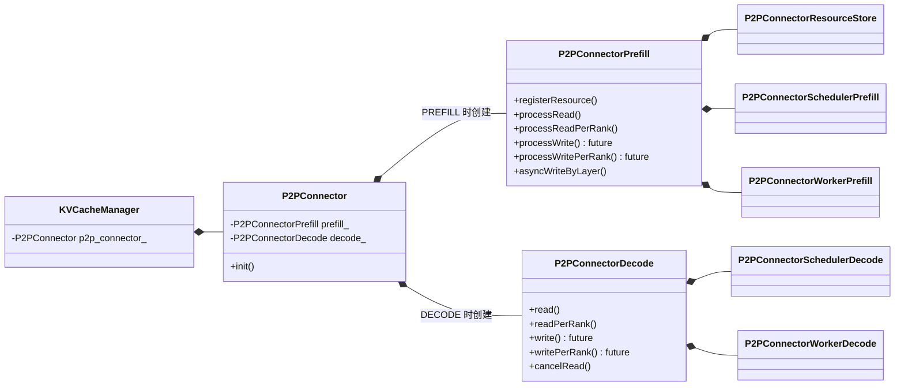

# P2PConnector Prefill/Decode API 拆分

## 1. 背景

当前 `P2PConnector` 同时暴露 Prefill 和 Decode 两侧 API，并在类内根据 `role_type` 选择执行路径。随着接口增加，单个 connector 的角色边界不再清晰。

本次只做对外 API 和对象组合关系的重构：保留 `P2PConnector` 作为统一包装类，将 Prefill/Decode API 实现拆到两个角色类。现有实现逻辑原样迁移，不改变任何运行时行为。

## 2. 目标

保留顶层 `P2PConnector`，内部按角色只创建一个实现类：

```cpp
class P2PConnector {
public:
    bool init();

private:
    std::unique_ptr<P2PConnectorPrefill> prefill_;
    std::unique_ptr<P2PConnectorDecode>  decode_;
};

class P2PConnectorPrefill {
public:
    void processRead(...);        // 当前 handleRead()
    bool processReadPerRank(...); // 当前 executeHandleRead()

    void processWrite(...);        // 预留
    bool processWritePerRank(...); // 预留
};

class P2PConnectorDecode {
public:
    std::shared_ptr<AsyncContext> read(...); // 当前 asyncRead() 的 Decode 分支
    bool readPerRank(...);                  // 当前 executeRead()

    std::shared_ptr<AsyncContext> write(...); // 预留
    bool writePerRank(...);                  // 预留
};
```

其中，未来 Decode 向 Prefill 回传 KV cache 时：

- Decode 通过 `write()`/`writePerRank()` 发起写回。
- Prefill 通过 `processWrite()`/`processWritePerRank()` 处理写回。

目标类图：



`KVCacheManager` 继续只持有一个 `P2PConnector`。`P2PConnector::init()` 根据 `role_type` 只创建 `P2PConnectorPrefill` 或 `P2PConnectorDecode` 之一。角色实现类分别直接组合对应 Scheduler 和 Worker，不再经过统一包装层。

按仓库 C++ 命名规范，类名使用 PascalCase，方法名使用 camelCase。

## 3. 重构原则

### 3.1 仅调整 API 归属

所有现有方法实现原样迁移到对应角色类，不改变：

- 调用时序与并发关系。
- `TransferPlan` 与 route 生成逻辑。
- TCP/RDMA 传输逻辑。
- deadline、超时和取消语义。
- KV cache 资源持有与释放时机。
- side-channel、first-token 和 reuse 信息处理。
- protobuf、RPC service 及 wire enum。
- 日志、指标和错误码语义。

本 spec 不重新定义各 API 的实现内容；新 API 的行为以对应旧方法的当前实现为准。

### 3.2 保留 `P2PConnector` 包装类

`P2PConnector` 作为 `KVCacheManager` 的统一入口保留，但不再承载 Prefill/Decode 业务实现。

- 构造时保存 `role_type` 和创建角色对象所需的依赖。
- `init()` 在 `PREFILL` 角色下只创建 `P2PConnectorPrefill`，在 `DECODE` 角色下只创建 `P2PConnectorDecode`。
- `prefill_` 和 `decode_` 不得同时非空。
- 对外入口只做角色校验和转发，具体实现位于对应角色类。
- `executeFunction()` 保留为统一 RPC 分发入口，按 request type 转发到已创建的角色对象。
- 调用了与当前角色不匹配的 API 时，按现有错误处理方式返回失败，不引入新业务语义。

该结构使 `KVCacheManager` 无需感知两个角色类的构造和生命周期，同时避免像当前实现一样始终创建两侧对象。

### 3.3 不保留 `P2PConnectorScheduler` 包装层

当前 `P2PConnectorScheduler` 不是继承体系中的基类，而是同时持有 `P2PConnectorSchedulerPrefill` 和 `P2PConnectorSchedulerDecode` 的统一包装层。

拆分后不再需要该层：

```cpp
class P2PConnectorPrefill {
private:
    std::unique_ptr<P2PConnectorSchedulerPrefill> scheduler_;
};

class P2PConnectorDecode {
private:
    std::unique_ptr<P2PConnectorSchedulerDecode> scheduler_;
};
```

- Prefill connector 直接调用 `P2PConnectorSchedulerPrefill` 的现有 API。
- Decode connector 直接调用 `P2PConnectorSchedulerDecode` 的现有 API。
- 不新增共同 Scheduler 接口，也不将 `P2PConnectorScheduler` 保留为基类。
- 两个角色 Scheduler 的现有实现不变。

### 3.4 不保留 `P2PConnectorWorker` 包装层

`P2PConnectorWorker` 与 Scheduler 包装层的性质相同，不需要作为独立对象同时管理两个角色 Worker。

- `P2PConnectorPrefill` 直接持有并调用 `P2PConnectorWorkerPrefill`。
- `P2PConnectorDecode` 直接持有并调用 `P2PConnectorWorkerDecode`。
- 传输后端创建和 buffer 注册保留为内部共享初始化辅助逻辑。
- 两个角色 Worker 及传输后端的现有实现不变。

## 4. API 映射

| 当前入口 | 新归属 | 新入口 |
| --- | --- | --- |
| `P2PConnector::asyncRead()` Prefill 分支 | Prefill | `registerResource()` |
| `P2PConnector::handleRead()` | Prefill | `processRead()` |
| `P2PConnector::executeHandleRead()` | Prefill | `processReadPerRank()` |
| `P2PConnector::asyncWriteByLayer()` | Prefill | `asyncWriteByLayer()` |
| `P2PConnector::writeByLayerTag()` | Prefill | `writeByLayerTag()` |
| `P2PConnector::executeCancelHandleRead()` | Prefill | Prefill 取消辅助 API |
| `P2PConnector::asyncRead()` Decode 分支 | Decode | `read()` |
| `P2PConnector::executeRead()` | Decode | `readPerRank()` |
| `P2PConnector::cancelRead()` | Decode | `cancelRead()` |
| `P2PConnector::executeCancelRead()` | Decode | Decode 取消辅助 API |
| `P2PConnector::executeQueryLeaseStatus()` | Decode | Decode lease 辅助 API |

`processWrite()`/`processWritePerRank()` 和 `write()`/`writePerRank()` 目前仅作为后续扩展的命名与归属预留，本次不增加对应实现、proto 或 wire type。

## 5. `KVCacheManager` 集成

`KVCacheManager` 继续只持有统一包装对象：

```cpp
std::shared_ptr<P2PConnector> p2p_connector_;
```

- `KVCacheManager::initP2PConnector()` 仍只构造和初始化一个 `P2PConnector`。
- 具体角色对象由 `P2PConnector::init()` 内部选择和创建。
- `KVCacheManager` 无需增加 Prefill/Decode 两个 connector 成员，也不负责管理它们的生命周期。
- `KVCacheManager` 现有调用继续进入 `P2PConnector`，由包装类转发到对应角色 API。
- `executeFunction()` 只改变包装类内的本地分发目标，请求解析和执行逻辑不变。

## 6. 文件与迁移

新增：

```text
rtp_llm/cpp/cache/connector/p2p/
  P2PConnectorPrefill.h
  P2PConnectorPrefill.cc
  P2PConnectorDecode.h
  P2PConnectorDecode.cc
  P2PConnectorBackend.h
  P2PConnectorBackend.cc
```

`P2PConnector.h/.cc` 只保留角色对象创建、生命周期管和 API 转发。Prefill/Decode 实现分别放在对应 `.cc` 中，共享的传输后端初始化放在内部 Backend 辅助文件中。

迁移顺序：

1. 将 `P2PConnector` 中的方法按映射原样移到两个角色类。
2. 将两个角色类分别直接连接现有 Prefill/Decode Scheduler 和 Worker 实现类。
3. 将 `P2PConnector` 收敛为按角色创建单一实现对象的包装类，并转发现有对外调用。
4. 迁移测试，确认 `KVCacheManager` 的单 connector 持有关系不变。
5. 删除 `P2PConnectorScheduler` 和 `P2PConnectorWorker` 统一包装层。

## 7. 测试与验收

本次不新增业务行为，测试以现有用例迁移和回归为主。

验收标准：

1. `KVCacheManager` 仍只持有一个 `P2PConnector`。
2. `P2PConnector::init()` 根据角色只创建 Prefill/Decode 实现对象之一。
3. Prefill/Decode 角色类分别只暴露自身 API，`P2PConnector` 只负责转发。
4. `P2PConnectorScheduler` 统一包装层已移除，两侧直接调用对应 Scheduler 实现类。
5. `P2PConnectorWorker` 统一包装层已移除，两侧直接调用对应 Worker 实现类。
6. 现有 protobuf、RPC、wire enum、调用时序和运行时语义无变化。
7. 原 `P2PConnectorTest`、Scheduler/Worker 测试和相关集成测试在迁移后保持通过。
8. `processWrite()`/`processWritePerRank()` 与 `write()`/`writePerRank()` 只作为预留边界，不引入新实现。
