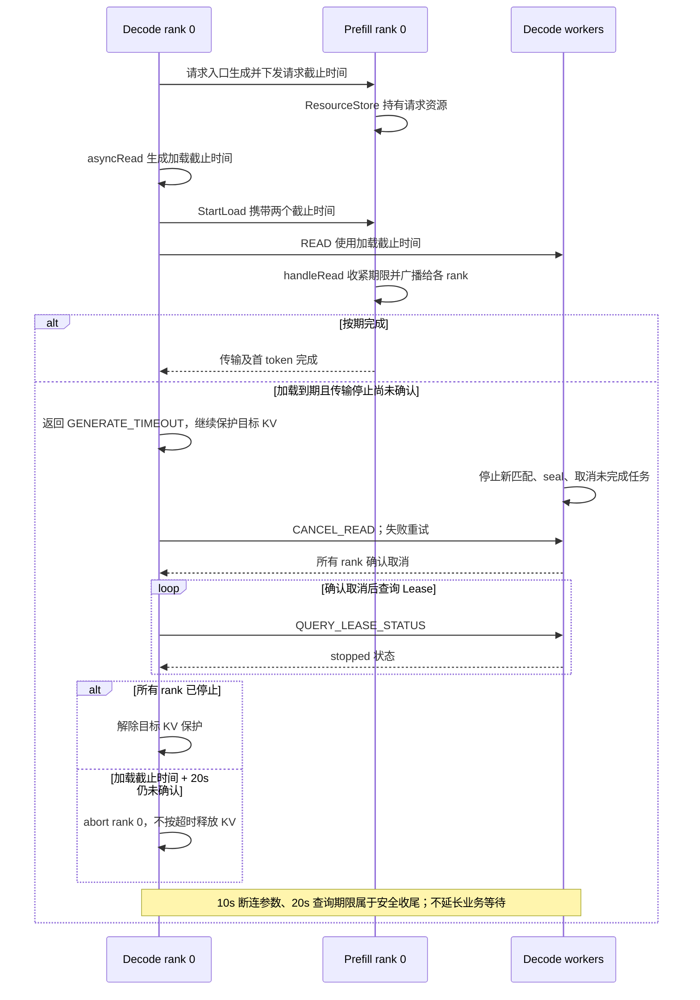
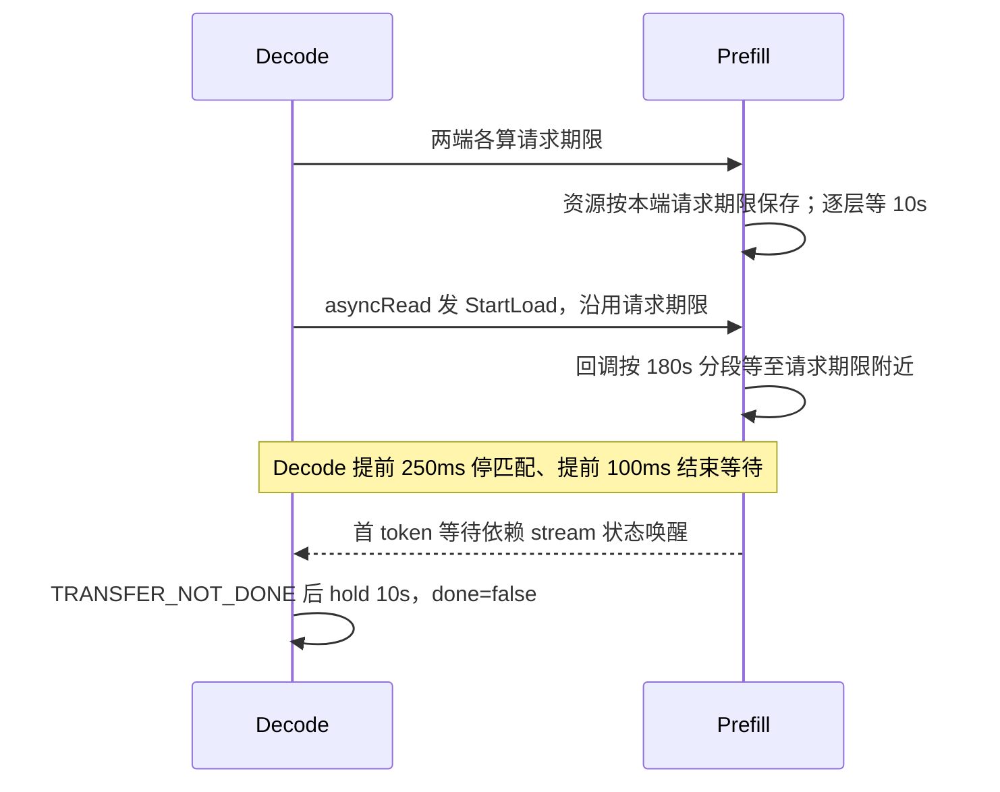

# P2P Timeout 统一修改方案

## 目标与范围

- 仅保留请求超时、加载超时两个业务配置；绝对截止时间由 Decode 生成，Prefill 采用，不重新计时。
- 加载从 Decode `asyncRead()` 开始，包含异步排队、等 Prefill 资源、逐层就绪、传输及首 token。
- 资源释放遵守[独立 Lease 方案](p2p_decode_deadline_cancel_design.md)。不默认新增兼容 API。
- 基于 `5f26bfed02`（Prefill rank 0 集中持有资源）、`3b7c9cead3`（Decode Lease 保护）更新；下文区分已实现机制与待修改项。

## 修改后的时序

## 最新 Lease 修复对本方案的影响

两个业务 timeout 的设计不变；加载到期结束业务等待，物理传输停止确认继续按 Lease 机制执行。

| 部分 | 本次方案如何处理 |
| --- | --- |
| 请求与加载期限 | 继续修改：由 Decode 统一生成，贯穿各阶段，删除重复计时和延期。 |
| Prefill 资源所有权 | 沿用 rank 0 集中持有；各 worker 接收期限，维护本地逐层状态。见第 3、4 节。 |
| 提前返回与 Lease 淘汰 | 最新提交已删除提前 250ms/100ms 和固定 10min 淘汰，不再作为待实施项。 |
| 超时后的取消与查询 | 保留“所有 rank 确认取消 → 查询全部停止 → 解除保护”，不能因 RPC 返回就释放。见第 6 节。 |
| 10s、20s 安全期限 | 保留断连参数和查询期限，均从加载截止时间计算；不计入业务预算，也不重新计时。 |
| 取消记录 TTL | 保留防迟到 READ 的记录；删除业务回退预算时不能连带删除它。 |

实施时重点检查：新的加载截止时间是否同时传入 READ、HANDLE_READ 和 AsyncReadContext。否则业务等待已收紧，Lease 收尾却仍按旧期限执行。

## 1. 请求入口与 Stream

**关键 API**

- `DecodeRpcServerNew2::GenerateStreamCall()`
- `PrefillServerCaller::callPrefill()`
- `PrefillRpcServerNew2::GenerateStreamCall()`
- `GenerateStream::deadlineMs()`、`checkTimeout()`
- `Meta::p2pRouting()` 的具体实现

1. Decode 计算“入口时间＋请求超时”，生成唯一请求期限；后续生成仍用它。
2. `callPrefill()` 传递绝对期限，生成 RPC 只用剩余预算。
3. Prefill 将期限传入 stream；`deadlineMs()`、超时检查和 Meta 路由读取同一值。
4. 同步调整 P2P 请求协议及转换链路。下游期限缺失、非法或过期直接失败，不生成回退预算。

## 2. Decode Scheduler 与 StartLoad

**关键 API**

- `P2PConnectorSchedulerDecode::asyncRead()`、`startAsyncReadCalls()`
- `DecodeLoadHelper::load()`、`buildAndStartAsyncRpc()`
- `P2PBroadcastClient::broadcastPerRank()`、`broadcastRequests()`

1. `asyncRead()` 在异步任务排队前计算：加载截止时间＝请求截止时间与“当前时间＋`load_cache_timeout_ms`”中的较早值。
2. 替代 `p2p_max_transfer_deadline_ms`；排队后过期直接失败。
3. StartLoad 携带两个期限，READ、HANDLE_READ 使用加载期限。RPC 只用剩余预算，删除 30s 回退。
4. 全命中 `no_transfer` 虽不传 KV，仍按加载期限等待必要 side-channel。

顺序：Decode `asyncRead()` → StartLoad。Prefill `asyncRead()` 注册资源，可早于或晚于 StartLoad。

## 3. Prefill 入口与 ResourceStore

**关键 API**

- `PrefillRpcServerNew2::StartLoad()` → `P2PConnector::handleRead()` → `P2PConnectorPrefill::processRead()`
- Prefill：`registerResource()`、`waitForResourceEntry()`、`processReadPerRank()`
- `P2PConnectorResourceStore`：`addResource()`、`waitAndStealResource()`、`checkTimeout()`

1. `processRead()` 校验并采用加载期限，等待尚未注册的资源也消耗加载预算。
2. 删除独立 5min hold 及额外资源寿命上限：交接前使用请求期限，交接后使用加载期限。
3. 沿用最新所有权：仅 Prefill rank 0 的 ResourceStore 持有请求资源，取出后由 `processRead()` 持有至交接结束。各 rank 的逐层链路只持有描述，不新增请求 KV 引用。
4. 资源取走后仍可查询阶段状态；重复激活不续期，终态拒绝资源重新入库。
5. 无 StartLoad 且无取消时，资源可保留至请求期限，例如 1h；取消或明确失败立即清理可释放资源。

## 4. 逐层 Buffer 与 GPU Event

**关键 API**

- `P2PConnectorWorkerPrefill::writeByLayer()`、`writeByLayerTag()`、`scheduleLayerCacheBuffers()`
- `ComputedLayerCacheBufferStore::registerRequestHorizon()`、`activateRequestHorizon()`、`requestHorizon()`、`addBuffer()`、`checkTimeout()`
- `ComputedLayerCacheBuffer::addBuffer()`
- `StoreWaitContextChecker::checkOnce()`

1. 逐层发布只登记数据及请求归属，不再生成“当前时间＋timeout”。删除 worker 独立 10s 回退。
2. 每个 worker 按 request_id 保存阶段期限；通过 HANDLE_READ、取消广播同步，不能直接访问 rank 0 的 Store。horizon 删除 max 延期；`addBuffer()` 不续期。
3. buffer 和 GPU event 读取阶段期限，加载开始后统一收紧。
4. 各层与 StartLoad 共用状态；终态后的 event 回调不能重建 buffer。

## 5. 传输等待与 Side-channel

**关键 API**

- `P2PConnectorWorkerPrefill`：`sendKVCache()`、`dispatchPendingLayerTransfers()`、`waitForAsyncSendSlot()`、`waitSendCallbacksWithTimeout()`
- `P2PConnectorWorkerDecode`：`buildRecvTasks()`、`read()`
- `P2PConnectorSchedulerPrefill::waitForBroadcastCompletion()`
- Prefill：`waitAndFillResponse()`
- ResourceStore：`notifySideChannelReady()`、`waitSideChannelReady()`

1. 分发、队列等待、发送回调和接收任务统一使用加载期限；删除 P2P 的独立 180s 回调预算。
2. side-channel 读取阶段期限，删除独立映射及 update；资源取走后不能退回请求期限。
3. 首 token、回调及广播等待在加载到期或取消时结束。
4. 最新提交已取消提前 250ms 停匹配、提前 100ms 返回。沿用准确加载期限，不再设计提前量；到期退出业务等待不代表 KV 可释放。

## 6. 超时收尾与 Lease 保护

**关键 API**

- `P2PConnectorAsyncReadContext`：`expireTransferDeadlineIfNeeded()`、`beginLeaseHold()`、`cancel()`、`checkCancelDone()`、`pollLeaseIfNeeded()`、`failStopIfLeaseUnconfirmed()`
- `P2PConnectorWorkerDecode`：`waitRecvTasksWithReadDeadlinePolicy()`、`cancelRead()`、`updateLeaseProgress()`、`queryLeaseStatus()`
- ResourceStore：`markTerminal()`、`markCancelled()`；worker Prefill：`cancelRequest()`

前五项沿用最新修复，第六项限定终态 TTL 的清理范围：

1. 加载到期返回 `GENERATE_TIMEOUT`，已发起且停止不明确的传输继续持有 Lease；尚未启动的排队任务和 `no_transfer` 不需要目标写保护。
2. 所有 rank 确认 CANCEL_READ 后才能查询 Lease，取消失败重试。READ RPC 已返回也不能跳过确认，否则尚未注册的迟到 READ 可能被误判为已停止。
3. 安全收尾以同一加载截止时间为基准。`p2p_lease_query_timeout_ms` 默认 20s；到期未确认全部停止，Decode rank 0 abort，不能释放 KV，也不能从发现错误时重新计时。
4. 原 `p2p_transfer_not_done_resource_hold_ms` 默认 10s，现在接到 `rdma_disconnect_after_deadline_ms`，不再表示到时释放资源。RDMA 模式要求查询期限大于断连期限。本仓库仅能确认参数接线，断连实现需在内部 RDMA 后端验证。
5. 固定 10min Lease 淘汰已删除；本地每 10ms 推进完成计数，仅 stopped 后移除。查询不负责推进完成计数，注册中的 READ 不能视为 stopped。
6. 普通业务终态记录按请求期限回收；**不能统一删除取消记录的 TTL**。`cancelRead()` 未找到任务时保留至 max(请求期限，取消时间＋取消 TTL)，默认 TTL 为 1h，用于阻止过期后的迟到 READ。保留这一安全用途，不作为业务等待预算。

## 7. 配置清理与验证

**关键 API**：`P2PConnectorSchedulerConfig::create()`、`P2PConnectorWorkerConfig::create()`、`P2PConnectorDecode::init()`。

- 删除独立交接上限、Prefill hold、100s buffer 配置及 P2P 180s 回调预算，同步清理绑定和命令行。其他路径共享字段、安全取消 TTL、断连及 Lease 查询参数保留。
- 共享 `load_cache_timeout_ms` 默认保持 5s；部署显式设置为 900000ms（15min），不新增 P2P 专用配置。
- 实施顺序：入口传播 → 加载期限接线 → rank 0 资源及各 rank 逐层等待 → 配置清理。安全收尾始终引用同一加载期限。
- 验证不续期、排队消耗预算、请求期限截断加载、注册与 StartLoad 竞争、迟到 event、全命中及加载后继续生成。
- 沿用 Lease 回归：取消先到/请求已过期、注册中查询、取消失败重试、READ 已返回仍须取消确认、20s 未确认 abort；长加载不能按旧 10min TTL 判停。
- 远端运行 `components_test`、`p2p_connector_test`，使用 `--config=sm9x --config=cuda12_9`。本轮按用户要求不编译、不运行测试；已更新回归用例并做静态检查。

## 8. 落地与静态 Review

| 设计章节 | 当前实现 |
| --- | --- |
| 请求入口 | `GenerateInputPB.request_deadline_ms` 经 QueryConverter 传入 Stream；Prefill RPC 使用同一绝对期限，重置 Stream 开始时间不续期。 |
| 加载入口 | Scheduler 读取共享 `load_cache_timeout_ms`，排队前截断到请求剩余预算；StartLoad、READ、HANDLE_READ、AsyncReadContext 接同一期限。 |
| 资源与首 token | ResourceStore 用 `RequestState` 合并阶段期限、终态和 side-channel；资源取走后状态仍可查询，不保留额外 KV 引用。 |
| 逐层等待 | worker 收紧 horizon；GPU event 回调重新读取阶段，入库时在同一锁下再次检查；终态不接受迟到层。 |
| 等待与取消 | 删除 P2P 180s 回调上限和 Prefill 取消 RPC 的附加业务等待；Decode Lease 的取消确认、查询及 fail-stop 不变。 |
| 配置 | 删除三项旧业务配置并同步 CLI、绑定及序列化；共享默认 5s，部署显式配置 15min。安全 TTL 与 10s/20s 参数保留。 |

静态 review 修正了“状态已收紧、发送仍用较晚入参”的问题。已补充预算截断、两种到达顺序、重复激活、迟到资源/event、非法期限等用例；未执行用例，不代表编译或运行验证通过。

`git diff --check`、修改的 Python 源码语法及配置序列化字段顺序检查通过。生成的 `.pyi` 存在基线已有的 `None` 枚举语法问题，本次仅删除对应旧配置声明，未扩展修改。

## 附录：历史对照

核对玉景提交 `db39bd2c41`（3 月）、`9fa336265b`（4 月），未运行历史代码。没有独立加载期限；180s 是分段等待。下图为历史行为。

