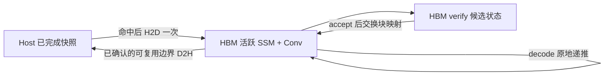

# Decode Host KV Cache：GLM5 实现与 GLM53-Flash 适配方案

调查日期：2026-09-15；实现与验证更新：2026-09-17。当前工作树已经加入可选的 MLA host 扩容实现；第 12 节记录实际改动、验证结果和未完成的验收项。**功能与精度测试已取得结果，但尚不满足“端到端性能不下降”的验收条件。**

- 参考工作树：`/data0/yangchengjun.ycj/work/RTP-LLM/feat-glm5_cu13_rebase`，HEAD `ae03e77c4fb522bcaf983c3c9edd79d16d6dd317`。
- 当前工作树：`feat-glm53_flash`，HEAD `a05e23d7573aa431ebd5fc2c8e904b2e967bcd18`。
- 参考工作树有未跟踪实验文件；本文对机制的判断以实际读取的生产源码为主，不把启动报告或测试代码当成 steady-state 性能结果。
- 当前 HEAD 与昨天 [KDA 缓存详解](glm53_flash_kda_kv_cache.md) 的基线不同，已新增可选的 whole-request Linear cache。下面的容量建议以本次 HEAD 为准。

## 1. 结论与建议

参考仓库确实实现了 decode 的 host 扩容，但它不是把所有 attention 都放到 host 上执行。它将 MLA 主缓存分成 **HBM 完整块、host 溢出块、HBM token working set**，indexer 留在 HBM。每轮 GPU 先算稀疏 top-k，只有被选中且不在 working set 中的 host token 才被拉入 HBM，attention 最终仍读取 HBM。

这有传输和管理开销。性能影响小依赖于命中率、稀疏选择量、预取重叠窗口、互连带宽和并发，不能从“注册过 host memory”推导出零性能损失。

GLM53-Flash 应按数据类型分别适配：

| 数据 | 建议驻留方式 | 原因 |
|---|---|---|
| MLA 主 KV | HBM 完整块 + host 历史块 + HBM working set | 读取稀疏，可按选中的原始 token 拉回 |
| 压缩 indexer KV | 第一版留在 HBM | 先有 indexer 才能知道该拉哪些 MLA KV；扩容也要为 indexer 增配 HBM |
| Indexer compressor state | 第一版留在 HBM | 属于另一种可变状态，不是 MLA token 行 |
| 活跃 KDA SSM + Conv | HBM | 每轮必读写，整份 FP32 矩阵较大；没有 top-k 稀疏拉取优势 |
| 可复用 KDA 检查点 | host memory connector | 在请求结束/可缓存边界保存，复用时恢复一次 |
| KDA MTP 候选状态 | HBM | 每个候选要有独立完整快照，接受后交换映射 |

**推荐先验证当前已有的 KDA request cache + memory connector，再单独移植 MLA tiered cache。** 如果目标只是降低 KDA 对长上下文缓存池的放大，当前分支已有更直接的实现；如果目标是让活跃请求的 MLA 历史超过 HBM 容量，则仍需要第二部分。

## 2. 三种“host cache”必须区分

参考和当前仓库都有多个名字相近的路径：

| 路径 | 作用 | 是否每轮 decode 按需取历史 |
|---|---|---|
| `RTP_LLM_DSA_MLA_HOST_CACHE_MB` | 参考仓库 DSA MLA 活跃逻辑容量扩展 | 是，按 top-k 的 miss 拉 token |
| `ENABLE_MEMORY_CACHE` / `MEMORY_CACHE_SIZE_MB` | 请求/前缀复用的 memory connector | 通常在复用/恢复阶段搬回所需内容 |
| `dsv4_fixed_pool_use_memory` | 将特定 fixed regions 分配在 pinned CPU | 另一条 region 专用路径，不自动等于 KDA host 支持 |

此外 `kv_cache_block_id_host` 只是 CPU 上的块表，并不表示 KV 数据在 host。

## 3. 参考仓库怎么分配 host KV

主要入口：[参考 CacheConfigCreator.cc](../../feat-glm5_cu13_rebase/rtp_llm/cpp/cache/CacheConfigCreator.cc)，`configurePinnedMla`。

开启 `RTP_LLM_DSA_MLA_HOST_CACHE_MB` 后，它要求：

```text
use_mla && is_sparse
只有一个 cache group
没有 independent block pools
indexer topk > 0
```

不满足就报 `pinned MLA working set requires a non-hybrid DSA MLA model`。因此不能直接把这个函数的限制删掉就用于 GLM53-Flash。

容量计算先从 HBM 预算中扣除：

1. 足够容纳最大 decode/verify selection 的 working set；
2. 全部逻辑 token 对应的 indexer 存储；
3. GPU mapping、owner、tag、version、protection 等元数据；
4. 可选的 generation snapshot。

剩余预算用于完整 HBM MLA blocks。Host 容量是“可配置上限”，还受每新增逻辑块所需 indexer/元数据 HBM 限制，因此实际注册字节数不一定等于配置的 MiB。

设完整 HBM block 数为 `Nh`、物理 block 大小为 `B`、resident token 数为 `R`：

```text
逻辑 token ID: [ 0 ... Nh*B-1 ][ Nh*B ... logical_end ]
归属:          完整 HBM KV       host backing

HBM attention tensor:
[ 完整 HBM KV: Nh*B 行 ][ working set: R 行 ]

host tensor:
[ 仅保存 host 归属的 KV 行，不给完整 HBM 块再建镜像 ]
```

同一层的 host 行 `t-Nh*B` 与逻辑 token `t` 对应；若被缓存进 resident slot `s`，attention 使用的物理行是 `Nh*B+s`。位于完整 HBM 区域的 token 直接使用原 ID。

分配器还有 `RTP_LLM_DSA_MLA_HBM_SHARE_DENOMINATOR`，默认 3：根据请求完整长度与剩余 HBM 比例决定是否优先放 host，后续增长跟随已分配的 tier。因此 host 并不只在 HBM 完全耗尽后才使用。见 [参考 BlockPool.cc](../../feat-glm5_cu13_rebase/rtp_llm/cpp/cache/BlockPool.cc) 的 `initFreeBlocks` / `malloc`。

## 4. “注册 host memory”具体做了什么

[参考 BlockPool.cc](../../feat-glm5_cu13_rebase/rtp_llm/cpp/cache/BlockPool.cc) 中的链路是：

```text
BlockPool::initializeCacheBuffer
  → mla_tiered_cache 分支
  → allocateRegisteredCpuTensor
      → mmap 匿名 CPU 内存
      → 设置允许 NUMA nodes 上的 interleave policy
      → 可选 HostArenaPrefaulter 并发触页
      → cudaHostRegister(ptr, bytes, cudaHostRegisterDefault)
      → torch::from_blob，包装为 CPU uint8 tensor
```

注册没有把数据搬到 HBM。它使该 host 存储满足后续 GPU 访问路径的要求；实际 tensor 仍在 CPU，代码要求它为 contiguous pinned backing。销毁时执行 `cudaHostUnregister` 和 `munmap`。

Decode tiered 分支直接注册精确大小 arena；普通 HOST pool 的 pin-mode/fallback 逻辑不是这个分支的行为。tiered 注册失败会失败退出，不能悄悄换成 pageable memory 继续交给 GPU kernel。

这里还要区分两次不同用途的注册：

- `cudaHostRegister`：使 host arena 可用于 CUDA 的 pinned-memory 访问路径。
- `BlockPool::regUserMr`：向 CacheStore 的 memory util 注册通信 MR，为 P/D 传输提供地址区域。tiered 路径还单独注册 HBM KV 区域。

二者用途不同。P/D 传来的缓存应通过 layout 的真实 backing 地址进入 host 或 HBM，不能把所有 logical block ID 都当成一个 CUDA tensor 的下标。

NUMA/interleave/prefault 是启动和内存放置策略。它们没有消除运行期 host↔GPU 传输。参考目录中关于数百 GiB host 注册耗时的报告，不能用来证明每 token 延迟无变化。

## 5. 怎么从 host 拉回 GPU

核心实现：[参考 pinned_mla_cache.py](../../feat-glm5_cu13_rebase/rtp_llm/models_py/modules/factory/attention/cuda_mla_impl/pinned_mla_cache.py)，`PinnedMlaWorkingSet`。

### 5.1 一轮 decode 的执行链

```text
HBM indexer 产生 top-k
  → 将请求内 token ID 通过 block table 转成 backing-store 全局 token ID
  → working.begin(ids)
       transfer stream:
         _protect: 保护本轮会使用的已驻留 slot，检查 generation
         _admit:   去重、选择未受保护 victim、更新 token→slot
         _fetch:   只读取 miss token 的 host 字节并写入 HBM
         每层 record ready event
  → compute stream 同时做 Q expansion / KV norm / input BMM
  → layer_cache(layer) 等待该层 ready event
  → write 当前 token KV
  → attention 使用 HBM resident + physical_indices
```

早发起点见 [参考 mla_attention.py](../../feat-glm5_cu13_rebase/rtp_llm/models_py/modules/hybrid/mla_attention.py) 的 `early_prefetch` 分支；接入见 [参考 flashmla_sparse_impl.py](../../feat-glm5_cu13_rebase/rtp_llm/models_py/modules/factory/attention/cuda_mla_impl/flashmla_sparse_impl.py) 的 `prefetch_kv` / `forward`。

### 5.2 数据搬运是 GPU kernel，不是 CPU 逐 token memcpy

`_fetch` 的关键操作可概括为：

```text
GPU tl.load(host + (logical_token - hbm_tokens) * row_bytes)
GPU tl.store(resident + (resident_slot + hbm_tokens) * row_bytes)
```

这是 GPU kernel 从已注册 host 内存读取，再写到 HBM；该 fetch 路径没有每 token 调用 CPU `cudaMemcpyAsync`，也没有将 top-k 拷回 CPU 再做 cache admission。

`_fetch_tiled` 可将多行一起传输，使用 int32 搬运原始字节，提高并行 host 读的数量。`RTP_LLM_DSA_MLA_FETCH_ROWS` 控制这个选择，默认 0；不能假设所有部署都已经启用 tiled fetch。这里使用 SM 执行 load/store，会消耗 GPU 执行和内存资源，不能等同于“免费 copy engine”。

### 5.3 新 token 如何放到 host

attention 前先在小型 GPU scratch 中按原格式生成当前 token KV，再调用 `working.write`：

- logical token 属于完整 HBM 区域：只写 HBM；
- 属于 host 区域：写穿到 host；若 working set 已有这个 token，再同步刷新 resident 行。

因此 host 是溢出历史的 backing store；淘汰 resident 历史行时一般无需再 D2H 回写。新 token 每轮写穿的量只是一行 MLA KV，而不是整条序列。

同一 selection group 的所有层共享映射，但每层有独立 KV bytes。`begin` 为各层预取，`layer_cache` 逐层等待；只有确实共享 top-k 的层才能这样成组。

### 5.4 复用一致性

每次 allocator 重用 block 都增加 generation；resident 保存 version。generation 不同，即使 ID 仍命中，也会重新拉取。`invalidate` 用于显式外部改写后的失效。

CPU 或网络写 host backing 仍需正确的生产者完成信号和 stream 排序；generation 不是 RDMA completion，也不能让 GPU 在数据尚未写完时就消费。CUDA Graph 下地址和映射存储应稳定，复用同一 working-set 对象；参考实现也禁止 layer micro-batch 模式下使用此组件。

## 6. 为什么性能影响可能小，以及何时会变慢

性能收益主要来自以下机制：

| 机制 | 减少了什么 |
|---|---|
| 完整 HBM 块直接命中 | 无 host 数据读取 |
| 稀疏 top-k | 只取选中的行，不扫描/搬回全部 MLA 历史 |
| 跨轮 resident reuse | 不重复传输已驻留的 token |
| GPU 去重与 admission | 避免重复 selection 传输和 CPU 往返 |
| 独立 transfer stream | 可与 Q expansion 等计算重叠 |
| shared-index group | 一次选择可提前安排多个层的 KV |
| 原始 KV 格式不变 | HBM attention 后端仍可沿用原 kernel |

但 hot hit 仍执行 metadata kernel，默认 generation 还可能来自 pinned host；wait event 只隐藏已经重叠的时间，不会让未完成的传输消失。

粗略估算每组一次 fetch：

```text
T_fetch ≳ N_unique_host_miss × bytes_per_row × layers_in_group / effective_bandwidth
暴露延迟 ≈ max(0, T_fetch - 可重叠计算窗口) + 管理开销 + 资源争用
```

冷启动、top-k 每步剧烈变化、resident 太小、batch/verify 增大、多个 rank 共用 host 带宽、跨 NUMA 访问都会增加暴露延迟。小 batch 下额外 kernel/event 开销也可能更显眼。扩容提升总吞吐，并不一定意味着单请求 TPOT 不变；应同时报告两者。

参考单测 [pinned_mla_cache_test.py](../../feat-glm5_cu13_rebase/rtp_llm/models_py/modules/factory/attention/cuda_mla_impl/test/pinned_mla_cache_test.py) 包含 hot/cold、graph、串行/重叠 projection、group stream cost 测量方法，以及 registered arena 读写和 attention 对齐测试。本次没有复跑这些测试，也没有得到可用于承诺“无性能损失”的同条件端到端 A/B 结果。

## 7. 当前 GLM53-Flash 已有哪些 KDA 基础

### 7.1 已有按并发量定大小的 KDA 池

[当前 HybridPoolConfigCreator.cc](../rtp_llm/cpp/cache/HybridPoolConfigCreator.cc) 读取 `ENABLE_LINEAR_ATTN_REQUEST_CACHE=1`。默认没有设置时仍走旧模式。

开启后，[当前 CacheConfig.h](../rtp_llm/cpp/cache/CacheConfig.h) 的 `finalizeBlockNums` 对 LINEAR group 单独计算池容量：

```text
C = max(1, max_generate_batch_size)
R = max(linear_speculative_reserve_step - 1, 0)

Decode 自动块数 = C × (2 + R)
Prefill 自动块数 = C × (2 + 1)       # 不计 decode speculative reserve
PDFUSION 自动块数 = C × (2 + R + 1)
```

显式 `LINEAR_ATTN_REQUEST_CACHE_POOL_BLOCKS` 可以给池更多容量，代码至少保住 live block 预算。`linear_speculative_reserve_step` 在有投机时由 `gen_num_per_cycle + 1` 设置。

这次实现还将 LINEAR 池字节从逐 token 的 paged 预算拆出，单独纳入 fixed reserve。这与昨天版本“普通 LINEAR 池跟随 global block count”的行为不同：**本次开启 request-cache 模式后，KDA 池可以真正按并发而非上下文容量定大小。**

[当前 LinearKVCacheGroup.cc](../rtp_llm/cpp/cache/LinearKVCacheGroup.cc) 保留工作尾部、speculative reserves 和最近的可复用对齐候选；CP 对齐时候选可能在尾部两个 slot 之前。池预算与瞬时保留状态、入队并发、reserved block 约定仍应由 allocator 测试和运行日志确认，不能只凭上式宣称任意调度都不缺块。

### 7.2 已有 whole-request host cache

[当前 KVCacheMemoryConnector.cc](../rtp_llm/cpp/cache/connector/memory/KVCacheMemoryConnector.cc) 已有：

- `wholeStateRequestCache`：识别 request-cache 模式；
- `initBlockPool`：将页式 MLA/indexer 与状态类数据拆成两类 host pool；
- `wholeStateSlotMask`：要求 LINEAR 层状态完整；
- `matchWholeRequest`：页链必须连续命中，并在有完整 KDA 状态的位置决定恢复长度；
- `asyncWrite` / `asyncRead`：构造 D2H/H2D copy plan；
- `startCopyAsync` / `sendCopyPlan`：在线程池提交带方向、slot mask 和块信息的异步内存操作。

[当前 KVCacheConnectorCoordinator.cc](../rtp_llm/cpp/cache/connector/KVCacheConnectorCoordinator.cc) 在 host 命中后先调用 allocator 的 `materializeRequestCacheState` 分配恢复目标，再读回数据。不能只命中 host key 而不给 KDA 状态分配 device block。

“whole-request”表示保存整份可恢复的递推状态，不代表能在任意 token 精确恢复：当前仍遵循完整块、对齐候选和 key 匹配规则，不可直接缓存一个尚未确认可复用的部分块状态。

这条路是请求复用/恢复缓存，不是参考 MLA 那种让活跃 attention 每轮直接从 host 历史按需取行的扩容。当前还存在明确限制：whole-request memory read 在 `cp_size > 1` 时会跳过；legacy prefix-only remote cache 在该模式下被禁用，memory/P2P 仍保留。不能把“CP 元数据存在”理解为 whole-request CP host restore 已完成。

可用于小规模验证的现有参数组合如下，容量需按测试机器设定：

```bash
export ENABLE_LINEAR_ATTN_REQUEST_CACHE=1
export LINEAR_ATTN_REQUEST_CACHE_POOL_BLOCKS=0
export ENABLE_MEMORY_CACHE=1
# 同时启用 reuse_cache，设置 MEMORY_CACHE_SIZE_MB，并检查请求级 memory-cache 开关
```

这些参数不会自动获得 MLA 的活跃 host spill 功能，也不是本次已执行的启动命令。

## 8. KDA 为什么不能直接套用 PinnedMlaWorkingSet

KDA 单层状态的物理字节布局保持：

```text
SSM:  [H, D, D] FP32
Conv: [W-1, Q|K|V] 模型计算 dtype

bytes = 4*H*D*D + sizeof(conv_dtype)*(W-1)*3*H*D
```

参考 MLA 的单位是一个 token KV row；KDA 的单位是一份完整历史状态。`seq_size_per_block` 在 KDA 中是检查点位置粒度，不是每个块里有多少份状态。不能给它套 `[blocks, page_size, row_width]` 后按 token 切行。

以仓库测试尺寸 `H=64,D=128,W=4,Conv=BF16` 为例，单层单快照为 4.140625 MiB；34 个 KDA 层合计 140.78125 MiB（attention TP=1）。如果每 token 都把这些状态读回再写回，每请求每步约 **281.5625 MiB** host↔GPU 字节流量；batch=16 约 **4.4 GiB/step**。这是布局推算，尚未加入其他开销，也不是性能实测。head TP=8 时每 rank 相应除以 8，但多 rank 仍会竞争主机资源。

MLA write-through 每轮只写新增 token 行；KDA 每轮更新整个矩阵。因此不能照搬“host 是每步立即更新的 backing、GPU resident 随时无写回淘汰”的协议：KDA 活跃状态会是 dirty 的，host 副本可能落后。

## 9. 建议的 KDA 生命周期与传输协议

### 9.1 活跃状态保持 GPU 权威



第一阶段复用当前 memory connector 的存取语义：

1. **入场/复用**：确认 MLA 页、indexer 所需数据和 KDA state 对应同一前缀长度；分配 HBM 目标，恢复完整状态，完成后允许执行。
2. **普通 decode**：只在 HBM 更新 SSM/Conv，不要求每步同步 host。
3. **MTP verify**：候选状态全部留在 HBM。只有 accept、两次块交换和对应 event 完成后的已提交状态可以被发布为 host 检查点。
4. **请求结束或现有缓存写出时机**：保存已有合法对齐快照；异步 D2H 持有源块引用直到传输完成。
5. **未来若支持抢占换出**：另加 suspend/resume 生命周期钩子，先完整写回再释放 GPU；恢复时重新入场。当前 whole-request prefix cache 不应被称为已经实现任意活跃请求抢占换出。

若在请求继续执行时后台保存快照，源状态必须是之后不再更新的边界块，或先复制到专用 staging 快照。仅增加引用计数只能防止内存被释放，不能防止另一个 kernel 原地改写它。

### 9.2 保存与恢复的原子单位

一份有效 KDA snapshot 至少需要：

```text
request/prefix key + model/layout identity
committed token length / 对齐边界
每层 SSM FP32 字节
每层 Conv history 字节
各 LINEAR 层的完整性 mask
拷贝完成状态，必要的版本或 generation
```

本地同 TP 可以按每层整块字节复制。异构 TP/CP 的 P/D 传输应复用 [LinearCacheConverter](../rtp_llm/models_py/utils/typed_storage_view.py) 的 segment contract 与 [MemoryLayoutStrategy.cc](../rtp_llm/cpp/cache/MemoryLayoutStrategy.cc) 的 `createLinearPartitionedBlockInfo`：

```text
SSM 按 head 对应的连续字节切分
Conv 逐 history，分别取 Q/K/V 的对应 head 子段
```

不能把混合精度块整体转换为 BF16，也不能把整个块前半段当作 TP 的一半。host 恢复后仍由 typed view 用原 offset/stride 解释；SSM 的 canonical 状态方向保持不变。

## 10. MLA tiered cache 移植到当前分支的具体改动

下面是适配边界；当前实现状态及已验证范围见第 12 节。表中的 CacheStore/P2P 生命周期要求仍需端到端验证。

| 位置 | 需要做的事 | 不能直接照搬的部分 |
|---|---|---|
| `CacheConfig` / `HybridPoolConfigCreator` | 给 MLA DEFAULT group 单独定义 host blocks、完整 HBM blocks、resident tokens 与预算 | 原函数只有一个非 hybrid group；不能给所有 groups 共用一个 tier 边界 |
| `HybridPoolKVCacheAllocator` | 为选中的 MLA group 创建双层存储，维持 group 独立 ID | KDA、INDEXER_KV、INDEXER_STATE 的 ID 空间不能混用 |
| `BlockPool` / `MemoryLayoutStrategy` | 复用精确 host 注册、按 tier 的真实地址解析及 MR 注册 | `where()` 不能代表所有地址；physical/kernel block 比例要分别处理 |
| `KVCacheLayout` / Python binding | 暴露 group 对应的 host/HBM views、容量、generation | 原实现从 layer0 / 全模型容量推断布局不适用于混合模型 |
| working-set 构造 | 只枚举 MLA 层；先一层一个 set，确认共享索引后再合并 | 原 `build_working_sets` 枚举所有层，会将 KDA 状态误当 MLA 行 |
| MLA prefetch 接入 | 展开 indexer 选择后再映射 backing IDs，提前发起 fetch | GLM53 的 top-k 是 pooled group，不能直接作为原始 token ID |
| attention 后端 | 接受 resident physical indices，并保留现有 MLA byte format | 当前 compressed-indexer 展开、尾 token 和多 query verify 都要接入 |
| CacheStore / P2P | 按 group、region、tier 返回真实传输地址，管理外部写入失效 | 保持现有 KDA segmented copy；防止 host 新数据对应旧 resident version |
| 调度 / CUDA Graph | 地址稳定，动态映射更新，跨轮/跨 batch event 正确 | 不应在 decode 热路径读回 top-k 或重新注册 host |

### 10.1 GLM53 resident 容量不能使用 pooled top-k

当前 [glm5_3_flash.py](../rtp_llm/models/glm5_3_flash.py) 将原始 `index_topk` 除以压缩率 4；attention 的最终选择宽度则是 `raw_topk + 3`。

例如 `raw_topk=2048`：

```text
indexer 选择 512 个压缩 group
→ 展开最多 2048 个原始 token
→ 加未满压缩组的 tail
→ attention 固定选择宽度 2051（无效位置用 padding）
```

展开代码在 [当前 flashmla_sparse_impl.py](../rtp_llm/models_py/modules/factory/attention/cuda_mla_impl/flashmla_sparse_impl.py)。应复用实际输出 selection，保留 padding、顺序和重复值，只在 admission/搬运内部去重。

若沿用参考组件的保守容量检查，至少预留：

```text
resident_tokens >= 最大 batch × 最大 verify query 数 × 2051
```

再按相应 page size 对齐，而不是 `batch × query × 512`。如果共享多个不同 selection，必须覆盖同时保护的并集或显式串行；第一版一层一个 set 可以简化这个约束。

### 10.2 预算必须联合计算

```text
HBM 总缓存预算
= KDA request state pool
+ indexer KV（随全部逻辑上下文容量增长）
+ indexer compressor state pool
+ MLA 完整 HBM blocks
+ MLA resident working sets
+ 映射/generation/临时写入区等元数据
+ MTP 独立 groups 对应预算
```

Host MLA backing 只保存属于 host 的历史块，不应按全部逻辑容量重复镜像完整 HBM 块。KDA host snapshots 可以由 memory connector 按自己的状态缓存容量管理，不与 MLA 的 token 容量强制 1:1 对齐。

这也是为什么单纯把 `block_num` 调大、KV tensor 改为 CPU 会出问题：其他 pools 的 HBM、allocator 的容量检查、kernel block views 和搬运寻址都会一起受到影响。

## 11. 落地顺序与验收

建议分三步，每一步有独立可验证结果：

1. **验证当前 KDA request cache**：与关闭模式比较池容量和数值；检查两条不同长度请求共享前缀、结束写出、host 命中恢复、池耗尽和 MTP 边界。先采用 unsharded memory keys；CP read 的现有限制需保留并单独开发。
2. **移植 MLA tiered 最小路径**：decode、单 group 内 MLA、每层独立 working set，indexer/KDA 留 HBM；把强制 host 的长请求跑通，覆盖当前 token write-through、冷 miss、热 hit、释放复用和 P/D 接收。
3. **扩展与调优**：MTP/CUDA Graph/dynamic batch、共享 top-k 分组、prefetch 提前量和 fetch rows、异构 TP/CP，逐项证明正确后再做性能 A/B。

最重要的正确性测试包括：

- KDA 混合 dtype 块往返后逐字节一致，且下一 token 输出与纯 HBM 路径对齐；
- SSM/Conv 的同一 token 边界一致性，不发布未接受 speculative 状态；
- `B-1/B/B+1` 长度、物理 block 大于 kernel page、同 ID 不同 group；
- generation 重用、外部 P/D 写入、异步写回时源块引用及不可变性；
- 部分 copy 失败时不发布完整 prefix，恢复失败时不调度消费；
- graph replay 切 batch / top-k / accept 数后地址和内容仍正确。

性能 A/B 要分别观察：

| 场景 | 能回答的问题 |
|---|---|
| 完整 HBM、不开 host | 基准 TPOT 和吞吐 |
| 开 host、请求仍在完整 HBM | 纯 metadata/stream 接入开销 |
| host 首次全冷、每步随机 top-k | 传输最差路径与带宽瓶颈 |
| host 固定/逐步变化 top-k | resident 命中与预取重叠收益 |
| 不同 batch/MTP query 数、多个 rank | 共享带宽和容量压力 |
| KDA 首次 host restore 与后续稳定 decode | 一次性恢复延迟和稳态性能分开 |

记录 TPOT p50/p95/p99、总 tokens/s、host miss 唯一行数、实际 H2D/D2H 字节、ready-event 等待时间、indexer/attention 耗时、GPU/host 池有效与预分配容量。启动注册时间另列。这样才能判断是“容量提高但单步变慢”，还是在目标 workload 上确实把传输隐藏了。

本轮实现只扩展 MLA 活跃历史容量。KDA 继续使用原 SSM/Conv 布局与 request-cache 策略；没有把 KDA 状态转换成 MLA token 行，也没有增加每轮 KDA host 往返。

## 12. 当前工作树实现与验证记录（2026-09-17）

### 12.1 实际调用链

1. `CacheConfigCreator::configureMlaHostCache` 仅在 DECODE 且 `RTP_LLM_DSA_MLA_HOST_CACHE_MB>0` 时生效。`MlaHostCachePlan.h` 同时预算主模型/MTP MLA、全部逻辑 indexer 页、resident 元数据；固定 KDA 池仍按原方式单独预留。
2. `BlockPoolConfigHelper` 只给 FULL + DEFAULT + MLA spec 添加 tier。`BlockPool` 注册 host 溢出 arena，另分配完整 HBM 块和 resident；`MemoryLayoutStrategy::createBasicBlockInfo` 按逻辑块所在 tier 返回真实地址及 `is_cuda`。
3. `MlaHostCacheInfo` 经 allocator、`KVCacheManager`、`PyWrappedModel` 和 binding 传到 Python。`build_working_sets` 只读带该 metadata 的 MLA 层，跳过 KDA；每个 MLA 层有独立映射，不能假设各层 top-k 相同。
4. `MLAAttention` 提前算 indexer：512 个 pooled group → 最多 2048 个原始 token + 3 个 tail → 逻辑 KV 地址。`prefetch_kv` 在 transfer stream 上保护命中项、准入 miss 并读取 host，随后可与 Q 展开重叠。
5. `SparseMlaImpl.forward` 使用原生 quantizer 把当前 token 写到小块 GPU scratch，再 write-through 到真实 backing，并刷新 resident 中的同一行。等待 ready event 后，现有 gather/FlashMLA 只读取 HBM resident；attention/output BMM 的数值算法不变。
6. 分配块复用时递增 generation；外部 block copy 覆盖已有块后也递增 generation。该计数只负责失效，不能替代 copy/RDMA 完成事件。生产者与下一轮 forward 仍须有原有的执行顺序保证。

关键实现：[容量规划](../rtp_llm/cpp/cache/MlaHostCachePlan.h)、[物理布局](../rtp_llm/cpp/cache/MemoryLayoutStrategy.cc)、[working set](../rtp_llm/models_py/modules/factory/attention/cuda_mla_impl/pinned_mla_cache.py)、[SparseMLA 接入](../rtp_llm/models_py/modules/factory/attention/cuda_mla_impl/flashmla_sparse_impl.py)。

例如 physical block=256、kernel page=128、单 query、raw top-k=2051：resident 对 kernel 暴露 2176 行；底层每层分配将 resident 向上补到 2304 行，以保证 RDMA 注册按完整物理块切分。补齐行不参与 attention，也不增加可用 resident slot 数；容量规划计入这部分 padding。

MTP 的保守容量下限为 `max_batch × (gen_num_per_cycle+1) × 2051`，再对 kernel page 向上对齐。decode worker 遇到超过此容量的 draft prefill，会按 query 分块执行，保留完整选择结果；这一退化路径保证功能，不能保证与一次完成的 HBM prefill 同速。

### 12.2 验证过程中修正的布局与初始化问题

- GLM53 已有独立 `INDEXER_KV`，旧 MLA spec 却仍分配 uncompressed indexer 的 `kv_scale` 区。现在 typed KPool 的 MLA spec 不再分配这份重复区域；普通 GLM5 未压缩 indexer 不变。**FP8 MLA 行内的 4 个 FP32 scale 仍完整保留**，每 token 仍是 `512+16=528` bytes。此修复在 host 开关关闭时也生效，减少重复预算，容量统计测试已相应更新。
- KPool 自己按压缩页生成 DeepGEMM schedule。公共 SparseMLA 初始化现在跳过旧 uncompressed schedule，避免把 MLA 的 128-token page 误传给只接受对应压缩 KV page 的接口。
- Host/HBM 混合 block copy 根据每个源/目的地址选择实际传输方向，复制完整物理块；`where()` 不能作为整个 tiered pool 的统一内存类型。

### 12.3 已执行的验证

[GPU 测试](../rtp_llm/models_py/modules/factory/attention/cuda_mla_impl/test/glm53_pinned_mla_cache_test.py) 共 11 项通过（10 项整组执行，加 1 项随后新增的原生 binding 测试），包括：真实 `cudaHostRegister` arena、528/1024-byte 行、重复/无效选择、冷 miss/换入换出、当前 token write-through、generation 复用、CUDA Graph、混合模型跳过 KDA、BF16 FlashMLA，以及 FP8 原生写入/gather/attention。完整 `SparseMlaImpl` 的 decode、超容量分块 prefill 和 graph replay 输出与全 HBM 基线使用 `rtol=0, atol=0` 比较通过。binding 测试另验证 physical=256 → kernel=128 的 host view、HBM metadata 指针和 KDA raw view 保持一致。

原生测试 4 个目标、58 项全部通过：`block_pool_test` 20 项、`memory_layout_strategy_test` 16 项、`glm53_cache_test` 18 项、`mla_host_cache_plan_test` 4 项。覆盖容量上限/溢出/2051 对齐、实际 pinned host 与 HBM 地址、physical/kernel 分块、KDA/indexer 布局、主模型/MTP 的容量与层映射。原生测试使用 CUDA13/SM10x 编译；本机有以下构建环境差异，不能将结果表述为未经调整的 stock build：

- 锁定的 CUDA12 cublas/cufft 下载源失败，使用同 SHA-256 wheel 的本地 Bazel repository override。
- 共享 internal RDMA 文件引用当前分支缺少的指标宏，仅对此文件使用 `--per_file_copt` 将宏映射到现有等签名报告宏；未改共享 internal source。
- 容器禁止 NUMA mempolicy 系统调用，原生 host 地址测试用已有配置 `RTP_LLM_HOST_BLOCK_POOL_NUMA_POLICY=none`。真实 CUDA host registration 保持启用，没有退化成 pageable memory。

完整引擎 `//:th_transformer --config=cuda13 --config=sm10x` 编译、链接通过（412.047 s），使用上述 RDMA 单文件指标宏兼容参数；产物为 `bazel-bin/libth_transformer.so`。这验证了 allocator、`PyWrappedModel`、NormalEngine、MTP executor 和 RPC 侧的编译接线，不等于已运行完整 P/D 请求。引擎构建日志：`/tmp/glm53_host_cache_engine_build.log`；原生测试日志：`/tmp/glm53_host_cache_native_final_test.log`。

GPU 测试重跑命令（仓库根目录，选择空闲 GPU）：

```bash
CUDA_VISIBLE_DEVICES=2 PYTHONPATH=. /opt/conda310/bin/python \
  rtp_llm/models_py/modules/factory/attention/cuda_mla_impl/test/glm53_pinned_mla_cache_test.py
```

### 12.4 实测性能与限制

诊断设备：PyTorch 报告 NVIDIA L20D，torch `2.11.0+cu130`。使用 CUDA Graph，每个 graph 20 次完整 SparseMLA 调用，预热后计 25 组，报告每次调用 GPU 时间中位数。随机 BF16 Q/权重、FP8 KV、64 heads、rank=512、NoPE=256、page=128、raw top-k=2051；计时包括当前 KV 写入、input BMM、gather/attention、output BMM，**不包含 indexer、上游 Q 展开、KDA、MoE、通信与调度**，所以不是端到端 TPOT。

| 条件 | HBM 基线 μs | Host μs | 说明 |
|---|---:|---:|---|
| 单 query，固定选择，默认 fetch | 60.99 | 64.34 | 热命中仍有映射/stream/write-through 开销 |
| 单 query，两组不重叠选择交替，默认 fetch | 60.98 | 101.43 | 工作集容不下两组，持续发生换入 |
| 单 query，固定选择，fetch rows=8 | 61.01 | 64.47 | 未见热命中收益 |
| 单 query，两组选择交替，fetch rows=8 | 60.98 | 95.17 | 搬运粒度改善部分 miss 开销，仍明显慢于基线 |
| 三 query，配足 6272 resident 行，固定选择，fetch rows=8 | 63.65 | 67.08 | 按生产容量规则分配；三 query 使用相同选择 |

三 query 的交替选择在这个短上下文中可同时留在 resident，预热后也是热命中，不能当作冷 miss 结果。刻意只配 2176 行时三 query 会拆成三次 attention，约 175 μs；这是超容量功能测试，不是正常 MTP 容量配置的性能。

[诊断 benchmark](../rtp_llm/models_py/modules/factory/attention/cuda_mla_impl/test/benchmark_glm53_pinned_mla_cache.py) 复用已验证的测试输入，先执行精度比较，再计时：

```bash
CUDA_VISIBLE_DEVICES=2 PYTHONPATH=. RTP_LLM_DSA_MLA_FETCH_ROWS=8 \
  /opt/conda310/bin/python \
  rtp_llm/models_py/modules/factory/attention/cuda_mla_impl/test/benchmark_glm53_pinned_mla_cache.py \
  --output /tmp/glm53_host_benchmark.json
```

这些结果明确说明：注册 host 内存不等于没有性能成本。提前 prefetch 可隐藏一部分传输，但是否全部隐藏要看真实 Q 展开窗口、命中率、并发和带宽。当前实现仍为默认关闭的实验能力，**尚未验证完整模型/P-D 请求的最终 token 精度、TPOT 与吞吐持平；不能按“性能不下降已验收”使用**。

试验入口为 DECODE 上设置 `RTP_LLM_DSA_MLA_HOST_CACHE_MB`，并关闭 layer micro-batch（`enable_layer_micro_batch=0`）；可同时启用 `ENABLE_LINEAR_ATTN_REQUEST_CACHE=1` 限制 KDA 活跃状态池。`RTP_LLM_DSA_MLA_RESIDENT_TOKENS=0` 表示按最大 decode/verify 选择自动规划；手工值低于安全下限会报错。NUMA policy 与 fetch rows 应按实机验证选择，本文没有修改它们的默认值。
