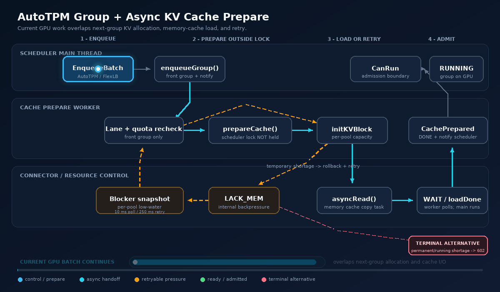
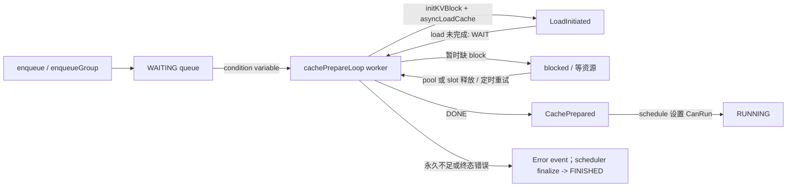

# Memory KV Cache 拷贝优化与异步 Group 调度说明

本文总结分支 `feat/memory-kv-cache-optimizations` 上的三组改动：

| Commit | 改动 |
|---|---|
| `fccebca148` | Memory KV cache 的批量、staged H2D/D2H 拷贝优化 |
| `924bed778a` | `RTP_LLM_ASYNC_PREPARE_CACHE`：把 admission 前的 KV 分配和 cache load 移到后台 worker |
| `4842f5a091` | 为 AutoTPM 的显式 group 调度补齐 async cache prepare、资源不足重试和 normal/group 边界 |

先给出结论：

1. 这里的“异步”不是只把 `cudaMemcpy` 换成带 `Async` 后缀的 API，而是把 KV 分配、memory-cache load 发起和完成轮询从 scheduler 主线程移到了独立 worker；耗时的 `prepareCache()` 执行期间不持有 scheduler 锁。
2. admission 前的**暂时性** KV 不足会转换成 scheduler 内部的 `CachePrepareResult::LACK_MEM`，进入等待和重试，不会立即作为用户错误返回。
3. 不能承诺任何情况下都不会看到 `LACK MEM`。单请求永久超过某个 KV pool 容量，或者已经 RUNNING 的 decode 流后续扩容时真正耗尽 block，仍会返回 `MALLOC_FAILED(602)`。此外，当前部分 allocator 内部错误也可能被对外标成 `LACK MEM`；这属于错误分类需要继续改进，不能算成“正确的物理内存不足”。C++ 异常则由 worker 捕获为 `UNKNOWN_ERROR`。
4. 当前实现防住了已识别的错误超配、group 抢占、部分 multi-pool 分配、取消释放和 lost wakeup；但默认 5% reserve 是启发式保护，不是对任意并发和任意生成长度的形式化容量证明。

## 整体流程动图



动图沿着一次可重试的资源不足场景展开：group 从 AutoTPM/FlexLB 进入调度器，后台 worker 在不持有 scheduler 锁的情况下执行 KV 分配和 memory-cache load；暂时不足时记录 blocker 并重试，资源满足后再跨过 admission boundary 进入 `RUNNING`。右下角红色的 602 是永久不足或运行中真实扩容失败的另一条终止分支，并不是该成功路径上的必经节点。

需要缩放或逐节点检查时，可打开[可缩放 SVG 源图](pics/memory_kv_cache_async_group_flow.svg)。

## 1. AutoTPM 到 Group Scheduler 的调用路径

当前 AutoTPM batch/group 的主要链路是：

```text
FlexlbServiceImpl
  -> RouteService
  -> FlexlbBatchScheduler
  -> PriorityAdmissionScheduler / PlanCommitter
  -> WorkerBatcher
  -> DefaultBatchDispatcher::buildBatchRequest
  -> EngineGrpcClient::batchEnqueueAsync (EnqueueBatch)
  -> PrefillBatchRpcServer::EnqueueBatch
  -> PrefillBatchRpcServer::EnqueueGroup
  -> PrefillBatchRpcServer::admitGroup
  -> PrefillBatchRpcServer::acceptGroup
  -> PrefillBatchRpcServer::prepareGroup
  -> PrefillBatchRpcServer::enqueueGroupStreams
  -> EngineBase::enqueueMultiple
     (virtual dispatch to NormalEngine::enqueueMultiple)
  -> FIFOScheduler::enqueueGroup
```

相关入口：

- [`DefaultBatchDispatcher.java`](../rtp_llm/flexlb/flexlb-sync/src/main/java/org/flexlb/balance/scheduler/DefaultBatchDispatcher.java)
- [`EngineGrpcClient.java`](../rtp_llm/flexlb/flexlb-grpc/src/main/java/org/flexlb/engine/grpc/EngineGrpcClient.java)
- [`PrefillBatchRpcServer.cc`](../rtp_llm/cpp/model_rpc/PrefillBatchRpcServer.cc)
- [`NormalEngine.cc`](../rtp_llm/cpp/normal_engine/NormalEngine.cc)
- [`FIFOScheduler.cc`](../rtp_llm/cpp/engine_base/schedulers/FIFOScheduler.cc)

`PrefillBatchRpcServer::EnqueueBatch()` 当前是 single-DP 的 `EnqueueGroup` adapter。它把同一个 batch 的多个请求转换为 `GenerateStream`，再通过 `enqueueMultiple()` 进入 FIFO 的显式 group queue。当前支持范围是 **single-DP + FIFO scheduler**；Gather/BatchDecode scheduler 的 group 限制没有改变。

## 2. Memory KV Cache 拷贝优化

### 2.1 三种拷贝模式

[`KVCacheMemoryConnector.cc`](../rtp_llm/cpp/cache/connector/memory/KVCacheMemoryConnector.cc) 增加了进程级模式选择。真实实现用函数内 `static const` 缓存第一次读取结果，因此修改环境变量后需要重启进程，不是 hot switch：

```cpp
enum class MemoryCacheCopyMode {
    AUTO,
    LEGACY,
    BATCH,
};

MemoryCacheCopyMode memoryCacheCopyMode() {
    const char* value = std::getenv("RTP_LLM_MEMORY_CACHE_COPY_MODE");
    if (value == nullptr || std::string(value) == "auto") {
        return MemoryCacheCopyMode::AUTO;
    }
    if (std::string(value) == "legacy") {
        return MemoryCacheCopyMode::LEGACY;
    }
    if (std::string(value) == "batch") {
        return MemoryCacheCopyMode::BATCH;
    }
    return MemoryCacheCopyMode::LEGACY;
}
```

- `auto`：untyped D2H 走 batch-first；untyped H2D 走 staged；typed layout 走 staged-first、batch fallback。
- `batch`：D2H（typed/untyped）走 batch-first；H2D 仍走 staged，而不是所有方向都直接调用 `cudaMemcpyBatchAsync`。
- `legacy`：untyped layout 回到 generic copy；typed layout 仍会尝试 staged-first 和 batch fallback，所以它不是所有新 copy 路径的全局关闭开关。

### 2.2 Batch 与 staged 路径

拷贝选择保留了完整 fallback：

```cpp
if (try_batch_first
    && tryCopyCacheWithBatchedMemoryCopy(request, copy_direction, slots)) {
    return true;
}
if (try_staged
    && tryCopyCacheWithStagedMemoryCopy(request, copy_direction, slots)) {
    return true;
}
if (can_try_batch_fallback
    && tryCopyCacheWithBatchedMemoryCopy(request, copy_direction, slots)) {
    return true;
}
return copyMemoryItemsGeneric(request, copy_direction, slots);
```

主要优化点：

- 相邻且连续的 tile 会先合并，减少拷贝描述符数量。
- CUDA 12.8+ 使用 `cudaMemcpyBatchAsync` 一次提交多个 H2D/D2H tile。
- untyped H2D 可把 pinned memory block 送入持久化 device staging，再用 scatter kernel 写入各层 KV block。
- typed/DSV4 layout 使用 compact staging 和 gather/scatter kernel，减少大量小 memcpy。
- scratch buffer 按 device 复用，避免每个请求重复分配 host/device staging 和元数据。
- 任一优化路径不可用或校验失败时，回退原有 generic copy，保证兼容性优先于性能。

需要区分两个概念：`cudaMemcpyBatchAsync` 在专用 CUDA stream 上异步提交，但 `execBatchedMemoryCopy()` 和 `execStagedMemoryCopy()` 在返回前仍会 `cudaStreamSynchronize()`。因此它们优化的是一次 connector copy task 内的 launch、packing 和搬运效率，不是让调用者在数据未 ready 时直接使用 KV。

connector 对上层真正异步，是因为 copy plan 被提交到线程池：

```cpp
auto code = wait_done_thread_pool_->pushTask(
    [this, context, task_copy_plan]() mutable {
        auto send_result = sendCopyPlan(task_copy_plan);
        context->setBroadcastResult(send_result);
        task_copy_plan.reset();
        context->waitDone();
    });
```

`asyncRead()`/`asyncWrite()` 返回 `AsyncContext`，完成回调在 copy task 结束后发布。scheduler worker 只观察 `loadCacheDone()`，不在主调度线程等待数据搬运。

## 3. Async Cache Prepare 为什么能与 GPU 执行重叠

### 3.1 开关与适用范围

worker 只在以下条件同时成立时启动：

```cpp
if (asyncCachePrepareEnabled()
    && pd_sep_config_.role_type != RoleType::DECODE
    && parallelism_config.tp_rank == 0) {
    async_cache_prepare_enabled_ = true;
    cache_prepare_thread_ = std::thread([this]() { cachePrepareLoop(); });
}
```

- `RTP_LLM_ASYNC_PREPARE_CACHE=1`
- 角色不是纯 DECODE
- `tp_rank == 0`
- worker 创建失败时自动保留同步 scheduler 行为

纯 DECODE 和其他 scheduler 仍使用原有路径，不受该开关影响。

### 3.2 状态流转



`CachePrepareResult` 明确区分三类结果：

```cpp
enum class CachePrepareResult {
    DONE,
    WAIT,
    LACK_MEM,
};
```

- `DONE`：prepare 阶段已经结束；通常表示 KV/load 已完成，但 stream 已有终态 Error 时也会用 `DONE + CachePrepared` 表示“不再需要 prepare”。
- `WAIT`：connector I/O 已发起但还未完成。
- `LACK_MEM`：设计意图是表示当前资源不足、可以重试；它是 scheduler 内部背压，不等于立即返回用户的 602。初始分配的 typed `MallocStatus` 能准确区分该状态，但 incremental allocation 目前还存在字符串折叠，极少数内部错误也可能进入此分支。

### 3.3 真正的异步边界

最关键的设计是：锁内只做队列、lane 和 quota 校验，耗时工作在锁外执行。

```cpp
// Pseudocode: 压缩展示并发边界，不可直接编译。
{
    std::lock_guard<std::mutex> lock(lock_);

    // 再次确认 stream 仍在队列、仍拥有当前 lane、没有超过 initialized-KV quota。
    const auto lane = cachePrepareLane();
    if (!freshPrepareAllowed(stream, lane)) {
        continue;
    }
    cache_prepare_inflight_stream_ = stream;
}

// 此处不持有 FIFOScheduler::lock_。
const CachePrepareResult result = stream->prepareCache();

{
    std::lock_guard<std::mutex> lock(lock_);
    cache_prepare_inflight_stream_.reset();
    if (result == CachePrepareResult::LACK_MEM) {
        markCachePrepareBlocked(stream);
        schedule_trigger_ = true;
    }
    if (result == CachePrepareResult::DONE) {
        schedule_trigger_ = true;
    }
}
cond_.notify_all();
```

上面的 `freshPrepareAllowed()` 是为说明意图而压缩的伪函数；实际检查位于 `cachePrepareLoop()` 内，包括队列成员、lane ownership、静态 admission 和 `max_inited_kv_cache_streams`。

因此：

1. enqueue 只写队列并 `notify_all()`，不执行 allocator 或 cache I/O。
2. scheduler 主线程可以继续推进当前 `running_streams_`。
3. worker 同时为下一个执行边界分配 KV、查 memory cache、发起 connector read。
4. `prepareCache()` 返回 `WAIT` 后，后续轮询也只发生在 worker。
5. worker 置 `CachePrepared` 后，scheduler 在真正 admission 时置 `CanRun`；状态机看到 `CanRun + CachePrepared`，直接从 WAITING 进入 RUNNING，不再重复分配或 load。

这使“当前 batch 在 GPU 上执行”和“下一批请求准备 KV/cache”能够时间重叠。

## 4. Group 调度适配

原始 async prepare 主要处理 `waiting_streams_`。AutoTPM 通过 `enqueueGroup()` 进入独立 `waiting_group_queue_`，如果不补适配，group 会等待同步 admission，无法获得相同的提前分配和 memory-cache load 能力。

本次增加了以下约束。

### 4.1 只准备队首 group

```cpp
if (!waiting_group_queue_.empty()) {
    const auto& group = waiting_group_queue_.front();
    for (const auto& stream : group) {
        // prepare only the front group
    }
}
```

后续 group 不允许越过队首提前占 KV，避免 group 间资源顺序被后台 worker 改写。

### 4.2 normal/group lane 与执行边界一致

`cachePrepareLane()` 镜像 `schedule()` 的边界选择：

- normal batch 正在运行时，可以提前准备下一组 group。
- group 正在运行或 loading 时，normal 可以准备下一边界。
- group 到达后会形成 barrier，当前 normal lane 先 drain；下一执行边界不混入 normal tail。
- 默认 normal-first；双方持续有可执行请求时，通过 `prefer_group_next_` 和 active lane 的边界偏好倾向交替，以降低饥饿风险。loading、shortage 或 static reject 时允许 yield/fallback，因此不是机械的一来一回，也没有严格的最大等待时间保证。
- worker 每次真正分配前重新计算 lane，防止它拿着过期快照在另一 lane 新入队后继续抢 block。

### 4.3 Group 内 stable-greedy

普通 FIFO 在队首发生动态缺内存后停止新分配，保持严格顺序。显式 group 保留已有的 stable-greedy 语义：

```cpp
if (result == CachePrepareResult::LACK_MEM) {
    if (is_normal_waiter && fresh_prepare_allowed) {
        break;      // normal: strict FIFO
    }
    continue;       // group: 后面的较小成员仍可尝试
}
```

例如 group 成员需要的 block 数为 `[10, 30, 4]`，当前只剩 8 个 block：

- 第一个成员不足，记录 blocker。
- 第二个成员也不足。
- 第三个成员可以成功 prepare。
- 已准备成员可以组成 prepared subset，并在继续满足 batch-token/quota admission 后先运行；未准备成员作为 residual group 保留在队首，等待资源释放后继续。

这不会把 shortage 直接变成错误，但可能让较大的 residual 成员等待更久；它属于显式 group 的吞吐优先策略，不是严格的 group 内原子 admission。

group 大小本身超过 `max_generate_batch_size` 或 `max_inited_kv_cache_streams` 时，会在 `enqueueGroup()` 回退为普通 individual streams，避免一个永远不可能整体满足 scheduler 静态限制的 group 卡住队列。

## 5. KV 不足如何分类和重试

### 5.1 初始分配先区分“永久不足”和“暂时不足”

allocator 的初始分配使用 `MallocStatus`：

```cpp
// Pseudocode: 对应 KVCacheAllocator::initMalloc() 的压缩流程。
const auto capacity_status =
    evaluateInitCapacity(malloc_info, reserveBlockNum(), InitCapacityMode::TOTAL_ONLY);
if (capacity_status != MallocStatus::NONE) {
    return {false, 0, 0, capacity_status};
}

auto result = initMallocForCommonLen(malloc_info);
if (!result.success) {
    // 必须在 rollback 前按失败时快照分类。
    if (result.status == MallocStatus::NONE
        || result.status == MallocStatus::INTERNAL_ERROR) {
        const auto status = evaluateInitCapacity(
            malloc_info,
            reserveBlockNum(),
            InitCapacityMode::TOTAL_AND_AVAILABLE);
        result.status = status == MallocStatus::NONE
                            ? MallocStatus::INTERNAL_ERROR
                            : status;
    }
    free({malloc_info.batch_kv_cache_resource,
          malloc_info.complete_token_ids});
    return result;
}

// 后续 incrMalloc() 失败也进入同一个 finalize/rollback 流程。
auto incr_result = incrMalloc(malloc_info);
if (!incr_result.success) {
    return finalizeInitFailure(incr_result);
}
```

| allocator 结果 | 含义 | async worker 行为 | 是否返回请求错误 |
|---|---|---|---|
| `NONE/success` | 分配成功 | `DONE` 或继续 cache load | 否 |
| `RETRYABLE_RESOURCE_EXHAUSTED` | 请求理论上能放下，但当前 block 被其他 request/connector ref 占用，或者在 reserve 约束下暂时不能 admission；普通可驱逐 block cache 仍计入 available | 转成内部 `LACK_MEM`，等待并重试 | 否 |
| `PERMANENT_RESOURCE_EXHAUSTED` | 请求在某个 pool 中永久放不下，包含 reserve 后仍超容量 | 标记 `MALLOC_FAILED / LACK MEM` | 是 |
| `INTERNAL_ERROR` | 不是容量竞争能解释的 allocator 异常 | 标记 `MALLOC_FAILED / LACK MEM` | 是 |

HybridPool 会按每个 pool 独立计算 `need_blocks`、total、available 和 reserve share。不能用所有 pool 的 block 总和判断，因为某个小 pool 已耗尽时，另一个 pool 再多 block 也不能替代它。

### 5.2 Blocker 与唤醒

暂时不足后，worker 记录失败时的资源快照：

```cpp
// Pseudocode: 真实代码还会合并多个 blocker 的 per-pool low-water mark。
cache_prepare_blocked_available_blocks_ =
    cache_manager_->availableBlocksNumPerPool();
cache_prepare_blocked_inited_streams_ = countInitedKVCacheStreams();
cache_prepare_retry_at_ = now + 250ms;
```

满足任一条件就重新尝试：

```cpp
bool cache_availability_increased =
    anyPoolAvailableBlocksIncreased();
bool released_inited_slot =
    countInitedKVCacheStreams() < cache_prepare_blocked_inited_streams_;

return cache_availability_increased || released_inited_slot;
```

这里还增加了两层 lost-wakeup 保护：

- blocker 存在时每 10ms 轮询一次资源变化。
- 即使资源释放发生在失败快照之前，最晚 250ms 也会做一次 bounded fallback retry。

group 稳定扫描里可能有多个 blocker，中间又有较小成员成功。实现记录每个 pool 的 low-water mark，而不是只记第一个失败时的总可用量，避免后续成员释放后资源已经增加，却因为快照口径错误没有唤醒。

### 5.3 部分分配必须 rollback

multi-pool 或 batch allocation 可能出现“前几个 pool/sequence 成功，后一个失败”。allocator 会恢复每个 block table 的原始大小，并释放本次新拿到的 block：

```cpp
// Pseudocode: 展示 rollback 不变量，不可直接编译。
for (int b = 0; b <= failed_batch; ++b) {
    for (int gid = 0; gid < group_nums; ++gid) {
        auto& block_ids = kv_resource->mutableBlockIds(b, gid);
        freeBlocksNotPresentInOriginalSnapshot(block_ids, original_blocks[b][gid]);
        block_ids.assign(original_blocks[b][gid]);
    }
}
```

rollback 后的 per-pool availability 应与调用前一致。这样既不会泄漏 block，也不会让 scheduler 把“本请求自己的 rollback”误认为“外部请求释放了资源”而进入无效快速重试。

## 6. 是否会因为提前分配不当出现 `LACK MEM`

### 6.1 已经处理的风险

| 风险 | 防护 |
|---|---|
| 后来的 normal 请求抢过 FIFO head | normal 动态 shortage 后停止 fresh allocation，只允许清理后续 error/timeout |
| 后续 group 抢过队首 group | worker 只扫描 `waiting_group_queue_.front()` |
| normal/group 快照过期 | 每次设置 inflight 前重新校验队列成员和 `cachePrepareLane()` |
| worker 释放锁后 quota 被超配 | `cache_prepare_inflight_stream_` 计入 initialized-KV stream 数 |
| 太多 prepared-but-not-running 请求占 block | `max_inited_kv_cache_streams` 可限制 initialized stream 数；group 超限时回退 individual |
| HybridPool 某个 pool 被错误地用总量掩盖 | 使用 `availableBlocksNumPerPool()` 和 per-group capacity check |
| 部分 multi-pool allocation 失败泄漏 block | 完整 rollback 到调用前 block table |
| blocker 的资源释放通知丢失 | 10ms resource poll + 250ms fallback retry |
| timeout/cancel 与锁外 prepare 同时发生 | cleanup 跳过 inflight stream，worker 发布完成后再推进和释放；真实 in-flight barrier 测试仍待补 |
| stop 期间 prepared 请求被错误 dispatch | `stop()` 先通知并 join worker；`schedule()` 看到 stop 后直接返回，不发布新 batch |
| group 一个成员失败导致全组死锁 | stable scan、prepared subset 和 residual group |

这些防护的目标是：**暂时资源竞争只形成背压，不因后台分配顺序错误而直接向用户报 602。**

### 6.2 仍然可能出现的终态 `LACK MEM / 602`

以下情况仍然会进入终态错误；前两类和第 4 类是资源策略或真实容量不足，第 3 类应该报内部错误，但当前可能被展示为 `LACK MEM`：

1. 单请求即使独占某个 KV pool 也放不下。
2. 配置的 reserve、block topology、CP/HybridPool 映射使请求永久不可满足。
3. allocator 返回非资源竞争型内部错误；它应该保留 internal 语义，但部分路径当前会折叠成 `LACK MEM`。
4. 流已经进入 RUNNING，decode 长度增长跨越 block 边界，`incrKVBlock()` 真正拿不到新 block。

第 4 点是最重要的运行期边界。初始 admission 使用 `RESERVE_BLOCK_RATIO`，默认值为 5%，要求初始分配在当时的容量快照上留下相应余量。但 reserve 是 admission threshold，不是物理隔离出来、只允许 RUNNING 流使用的 block 分区：

- 多个 running stream 同时持续生成时，实际增长需求可能超过 reserve。
- prepared-but-not-running 的请求仍然会提前持有 KV；fresh initial allocation 会在其 capacity snapshot 上检查 reserve threshold，但 check 与后续 multi-pool allocation 不是跨所有 pool 的全局原子事务，失败时依赖 rollback/reclassification 收敛。
- running incremental allocation 不受同一 reserve threshold 约束，也没有运行流优先级，可以与 worker 并发并消耗这部分 headroom。
- Hybrid fixed region 的 reserve share 为 0；普通小 pool 的比例取整也可能得到 0，不能假设所有 pool 都有相同的 5% 保护。
- `RESERVE_BLOCK_RATIO` 可以显式配置为 0。
- `max_inited_kv_cache_streams=0` 表示不按 stream 数额外限流。

因此当前实现不能给出“任意 workload 下 running decode 一定能扩容成功”的数学保证。要进一步收紧，可以根据 running stream 数、各自 `reserve_step` 和剩余生成长度动态计算 headroom，而不是只依赖固定百分比。

还有一个实现层面的已知限制：`StreamCacheResource::incrKVBlock()` 目前把增量分配失败折叠成 `InternalError("malloc failed")`，async prepare 再通过字符串把它识别为可重试 `LACK_MEM`。这能避免临时压力下误报，但类型不够稳健；非容量型内部错误理论上可能被当成可重试，直到请求 timeout。建议后续让 incremental allocation 也完整透传 `MallocStatus`。

所以，对“会不会因为分配不当出现 LACK MEM”的准确回答是：

- admission 前的常见竞争路径已经做了顺序、quota、per-pool 检查和 rollback；在已覆盖的测试与 E2E 场景内，没有发现错误超配导致的请求报错。
- 暂时 shortage 本身仍会在内部产生 `CachePrepareResult::LACK_MEM`，这是正常背压信号，但不会直接返回用户。
- 永久不足和运行期真实耗尽仍可能返回 `MALLOC_FAILED(602)`；部分内部错误当前也可能被同样展示，需要结合日志区分。
- 目前不能声称覆盖了所有可能的线程交错和容量组合。

## 7. 场景覆盖

`FIFOSchedulerAsyncCacheTest` 当前共 58 个 case，主要覆盖：

| 分类 | 已覆盖行为 |
|---|---|
| 开关与角色 | flag off 保留同步路径；DECODE 不启动 worker |
| normal 基本路径 | enqueue 即 prepare；cache hit/no-load；remote load WAIT；load 完成；同步兼容路径的 load error |
| 严格 FIFO | shortage 时 tail 不越过 blocker；只发布连续 ready prefix；完成顺序不会改写 admission 顺序 |
| 异步重叠 | 当前 GPU round 执行时准备下一请求 |
| group | enqueue 即准备；等待 group 成员；prepared subset；residual；只推进队首 group |
| normal/group 公平 | normal-first、边界偏好、I/O yield、barrier、执行边界不混批 |
| quota | loading/inflight 算入 initialized-KV quota；slot 释放触发重试 |
| shortage | 无 busy-spin；low-water；10ms poll；250ms fallback；PD ref 延迟释放 |
| cancel/timeout | queued/prepared 请求取消后释放 KV；取消队首 group 后继续；手工设置 inflight 状态验证 quota 计数 |
| stop | stop/join 窗口不再 dispatch |
| static reject | token/静态限制失败的请求不提前占 KV，也不阻塞可运行 survivor |

HybridPool 相关测试覆盖：

- per-pool availability。
- 每个 pool 的永久/暂时 capacity classification。
- reserve 在多个 pool 间的分摊。
- initial preflight 不改变 pool。
- incremental multi-pool allocation 失败后的完整 rollback。

仍需补强的测试组合：

1. FIFO worker 与真实 HybridPool 的集成 shortage/wakeup 测试。
2. 用 latch 把 worker 固定在锁外 `prepareCache()` 时，再执行 cancel、timeout、stop。
3. 把 worker 固定在 pass snapshot 与 lane revalidation 之间，确定性验证 stale permit。
4. 长时间持续注入 normal/group 的 starvation stress 和 TSAN。
5. `PREFILL + CP + group + HybridPool` 组合测试。
6. async worker 下 normal/group member memory-cache read failure、survivor 和资源释放的专项测试。
7. HybridPool 永久超容量贯通到 scheduler 602 的集成测试。
8. incremental allocation 的 typed `MallocStatus` 测试。

因此更准确的质量结论是：**已覆盖主要资源竞争路径，未发现错误超配；仍有少量组合与竞态需要补充确定性测试。**

## 8. 验证结果

### 8.1 构建与单测

```bash
sh build.sh
```

构建成功。以下目标通过：

```bash
bazel test \
  //rtp_llm/cpp/engine_base/schedulers/test:fifo_scheduler_async_cache_test \
  //rtp_llm/cpp/engine_base/schedulers/test:fifo_scheduler_test \
  //rtp_llm/cpp/model_rpc/test:prefill_batch_rpc_server_test \
  //rtp_llm/cpp/cache/connector/memory/test:memory_connector_batch_copy_test
```

- async scheduler suite：58/58 通过。

HybridPool suite 单独执行：

```bash
bazel test \
  //rtp_llm/cpp/cache/test:hybrid_pool_kv_cache_allocator_test
```

结果为 45/46；失败的 `DSV4CPShardedInsertThenReuseSamePrefix` 在本分支基线已经存在，属于 CP reuse-length 旧问题，与本次 async/group/per-pool availability 改动无关。因此不能把 HybridPool 全套描述为完全绿色。

### 8.2 AutoTPM Group E2E

通过 `EnqueueBatch` 向 Prefill 发送同一 `batch_id` 下两个请求：

```text
request count: 2
input length:  300 + 300
model input:   combo_tokens.shape = [600]
input_lengths: [300, 300]
result:        both success, both terminal
```

结合 `EnqueueBatch` 固定适配到 `EnqueueGroup` 的代码路径、相同 `batch_id` 以及同一 model input 中的 `[300, 300]`，可以验证请求经过 `enqueueMultiple -> enqueueGroup`，而不是仅凭 `combo_tokens=[600]` 推断普通动态合批。

### 8.3 Memory Cache E2E

用 `curl.py` 连续两次发送同一个长 prompt：

```text
prompt_tokens                  = 9244
second_request.cached_tokens   = 9216
prefill_total_reuse_len        = 9216
decode_total_reuse_len         = 9216
decode_memory_reuse_len        = 9216
memory cache read_blocks       = 36
```

这验证了命中的数据实际从 memory cache 读回 decode KV，而不只是 device prefix cache 命中。

## 9. 配置建议

```bash
# 开启 admission 前异步 KV/cache prepare
export RTP_LLM_ASYNC_PREPARE_CACHE=1

# 默认 auto；legacy 可回滚 untyped 优化路径，typed 仍保留 staged/batch fallback
export RTP_LLM_MEMORY_CACHE_COPY_MODE=auto

# untyped H2D scatter grid，0 表示按 tile；默认 16
export RTP_LLM_MEMORY_CACHE_H2D_SCATTER_BLOCKS=16

# 给 RUNNING 流增量扩容保留的初始分配余量，默认 5
export RESERVE_BLOCK_RATIO=5

# 可选：限制 prepared/loading/running 等已初始化 KV 的 stream 数
# --max_inited_kv_cache_streams <N>
# export MAX_INITED_KV_CACHE_STREAMS=<N>

# AutoTPM 当前 group 路径
export AUTO_TPM_ENABLED=true
export DEFAULT_SCHEDULE_MODE=BATCH
```

上线时建议至少观察：

- `MALLOC_FAILED(602)`，先按错误消息和发生阶段区分 initial capacity、running incremental、静态 token limit、block-table update 和 internal failure；不能仅凭 602 判断为真实 KV 容量耗尽。
- KV pool 的 per-pool available/total，而不只看聚合值。
- initialized-but-not-running stream 数和 `max_inited_kv_cache_streams`。
- blocker 重试次数和等待时长，尤其是否频繁走到 250ms fallback。
- `cached_tokens`、`decode_memory_reuse_len`、memory cache read success/failure。
- normal/group 的最长等待时间，检查持续流量下是否存在 starvation。

## 10. 后续建议

按优先级建议继续补充：

1. 让 `incrKVBlock()` 透传 `MallocStatus`，移除 `"malloc failed"` 字符串判断。
2. 为 RUNNING 流引入动态 KV headroom，结合并发流数量、`reserve_step` 和剩余生成长度计算，不只依赖固定 `RESERVE_BLOCK_RATIO`。
3. 增加 Scheduler + HybridPool 的真实集成 shortage/wakeup 测试。
4. 用可控 barrier 补齐真实 in-flight cancel/stop 和 stale-lane-permit 竞态测试。
5. 增加 normal/group 长时间压力与 TSAN 验证。
