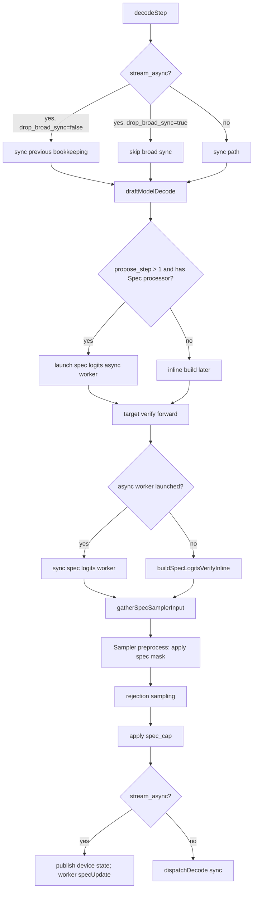
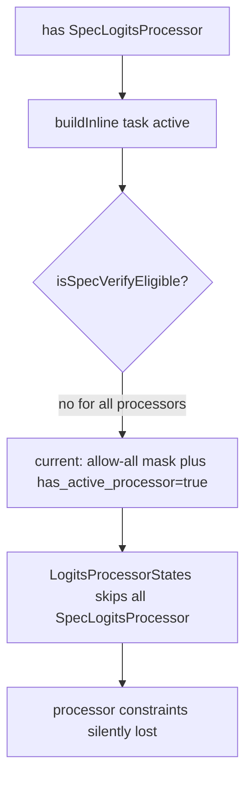
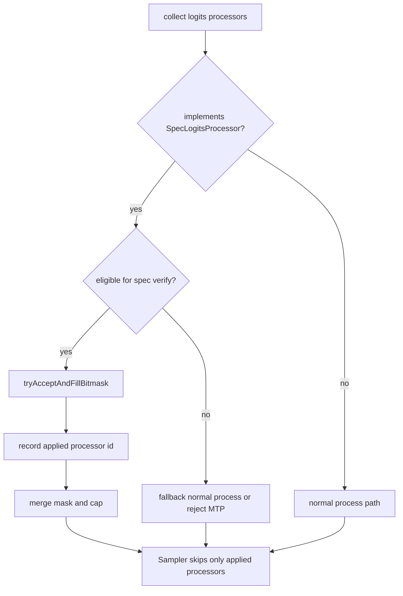
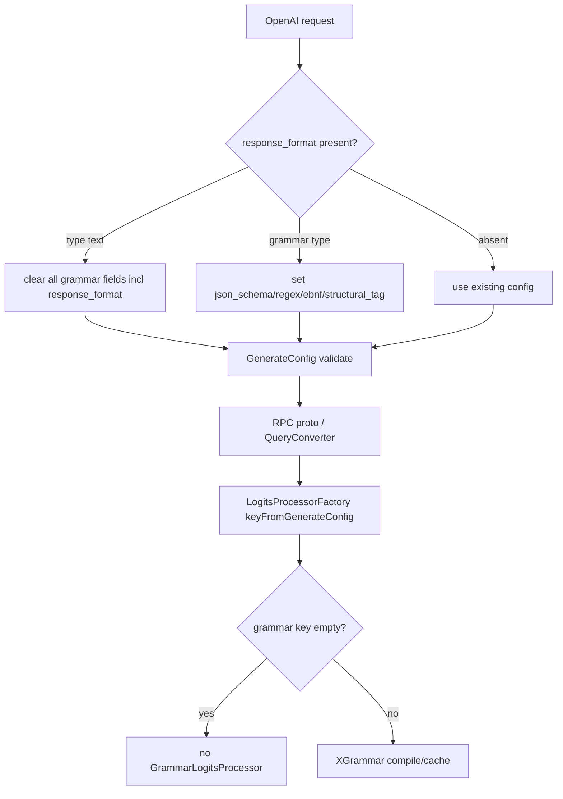

# MTP Async Logits Processor Cross Review

Review range: `git diff c88fc1a6f4dbdca68e5b6bb09b24d062373f4ba1` to current working tree.

Date: 2026-05-25

## Summary

The current changes are not yet sufficient to claim reliable asynchronous logits processor support for `mtp + async`.

The main correctness invariants are:

1. A spec logits mask/cap tensor must not be reused until the consumer stream has finished reading it.
2. A processor may be skipped in sampler preprocessing only if it was actually covered by the precomputed spec mask.
3. Any processor whose committed state depends on accepted tokens must be updated after MTP `specUpdate()`.
4. Grammar state and xgrammar compiler state must be protected against concurrent mutation.

## Issue Matrix

| # | Conclusion | Priority | Required Action |
|---|---|---|---|
| 1 | `SpecLogitsVerifyRunner` returns narrow views into reusable member buffers (`spec_vocab_mask_gpu_`, `spec_cap_gpu_`). `ready_event` only proves H2D completion, not that the main stream has consumed the tensors. | P0/P1 | Use per-launch owned tensors, or ring/pool buffers with a consumer-done event before reuse. Also protect pinned CPU source buffers from reuse before DMA completion. |
| 2 | `ThinkModeLogitsProcessor` updates DFA/snapshot state but does not override `isStateful()`. MTP `specUpdate(... stateful_only=true)` can skip it. | P1 | Do not just set `isStateful=true`; also implement `acceptedTokenLen()` or split the interface into `needsCommitUpdate()` and state-length validation. |
| 3 | Grammar MTP bitmask does not mask `[grammar_vocab, model_vocab)`, while normal decode does. | P1 | In `tryAcceptAndFillBitmask()`, clear all token bits from `matcher_->vocabSize()` to `request.vocab_size` for every row. |
| 4 | `has_active_processor` means “a Spec processor exists”, not “a processor was actually applied”. Ineligible processors can produce allow-all masks and still be skipped later. | P1 | Replace with `has_applied_processor` or `applied_processor_indices`; sampler should skip only processors covered by precomputed mask. |
| 5 | `GrammarLogitsProcessor::tryAcceptAndFillBitmask()` mutates/rolls back the shared matcher without `state_mutex_`. | P1/P2 | Hold `state_mutex_` for the whole speculative accept/fill/rollback block, or use a matcher clone/snapshot transaction. |
| 6 | MTP score/verify skips stateful processors in score batch while the spec runner only handles `SpecLogitsProcessor`. Future stateful non-Spec processors can be silently ignored. | P1/P2 | If `stateful && !SpecLogitsProcessor` appears in MTP, reject, disable MTP, or provide an explicit fallback. |
| 7 | `XGrammarBackendCpp::compileNow()` and `compiler_.ClearCache()` are not protected by a compiler mutex. Cache locks do not protect `compiler_`. | P1 | Add a compiler mutex or use one lock covering compile/cache/clear operations. |
| 8 | `response_format: {"type":"text"}` clears legacy grammar fields but not `GenerateConfig.response_format`. Old grammar envelopes can remain active. | P2 | Set `config.response_format = None` at the start of `_apply_response_format()`. Optionally make C++ `response_format.type == "text"` an explicit override. |
| 9 | `FakeSampler::forward()` in MTP tests does not call `Sampler::preprocessLogits()`, so tests do not prove spec masks affect logits. | P2 | Have FakeSampler call `logits_processor_states_ptr->batchProcess(inputs)` before assertions, or use a controllable real sampler path. |
| 10 | `grammar_logits_processor_test` is marked CPU but still uses CUDA deps via shared `test_deps`. | P2/P3 | Split CPU-only deps for grammar tests and verify with `bazel query deps(...)` that CUDA deps are absent. |

## MTP Async Flow



Important bad branch:



## Correct Spec Processor Semantics



Recommended interface split:

- `needsCommitUpdate()`: token commit must call `updateStatus()`.
- `acceptedTokenLen()`: only meaningful for processors that need commit update.
- `tryBuildSpecVerifyMask() -> Applied | Noop | Unavailable | Error`.
- `UpdateContext`: include phase (`NORMAL`, `MTP_VERIFY_COMMIT`), committed token count, source batch indices, and token layout.

## Grammar Flow

Normal decode:

```text
process()
  no matcher / finished row -> return
  batch != 1 -> report error
  finished_mask true -> return
  getDeviceMaskState()
    pending async token > accepted -> wait
    finished -> no-op
    terminated -> force EOS
    passthrough -> mask EOS only
    fillBitmask false -> no-op
    fillBitmask true -> mask disallowed + mask logits tail beyond grammar vocab
```

MTP verify:

```text
buildSpecLogitsVerifyInline()
  active empty -> no mask
  active non-empty:
    init merged allow-all, cap=P
    for each active processor:
      !eligible -> current code continues, but should fallback/reject
      tryAcceptAndFillBitmask()
        finished -> allow-all row
        terminated -> force EOS row
        passthrough -> allow-all minus EOS
        normal -> xgrammar fill bitmask
        draft disallowed / accept false -> cap=offset
        accepted draft tokens -> rollback accepted_prefix
      clear [grammar_vocab, model_vocab)
      AND processor rows into merged rows
      cap=min(cap)
    unpack merged bitmask -> bool vocab mask [B * (P + 1), model_vocab]
    set has_applied_processor only if at least one processor applied
```

## Config Flow



C++ grammar priority:

```text
json_schema > regex > ebnf > structural_tag > response_format
```

## Minimum Regression Matrix

- `SpecLogitsVerifyRunner`: continuous two-round MTP decode reusing runner buffers; vary batch size, vocab size, and propose step.
- `ThinkModeLogitsProcessor`: MTP `accepted_len > 1` crossing `max_thinking_tokens` or `end_think_token_ids`; verify snapshot advances.
- `GrammarLogitsProcessor`: grammar vocab smaller than model vocab; vocab not divisible by 32; MTP bitmask rows mask `[grammar_vocab, model_vocab)`.
- `GrammarLogitsProcessor`: interleave `tryAcceptAndFillBitmask()` with `updateStatus()` under concurrency/TSAN.
- `SpecLogitsVerifyRunner`: all Spec processors ineligible; assert no allow-all applied mask causes processor skip.
- MTP verify: stateful non-Spec processor appears; assert reject, MTP disabled, or explicit fallback.
- `XGrammarBackendCpp`: multithreaded `compileNow()` same/different grammar plus `clear()` under TSAN.
- OpenAI config: `extra_configs.response_format=<grammar>` plus top-level `response_format={"type":"text"}` clears all grammar sources.
- `MtpExecutorTest`: FakeSampler executes `batchProcess()` or uses real sampler; assert masked token logits are `-inf`.
- Bazel: CPU grammar test deps contain no `cuda_impl`, `@local_config_cuda//cuda:*`, or GPU-only device test utilities.
