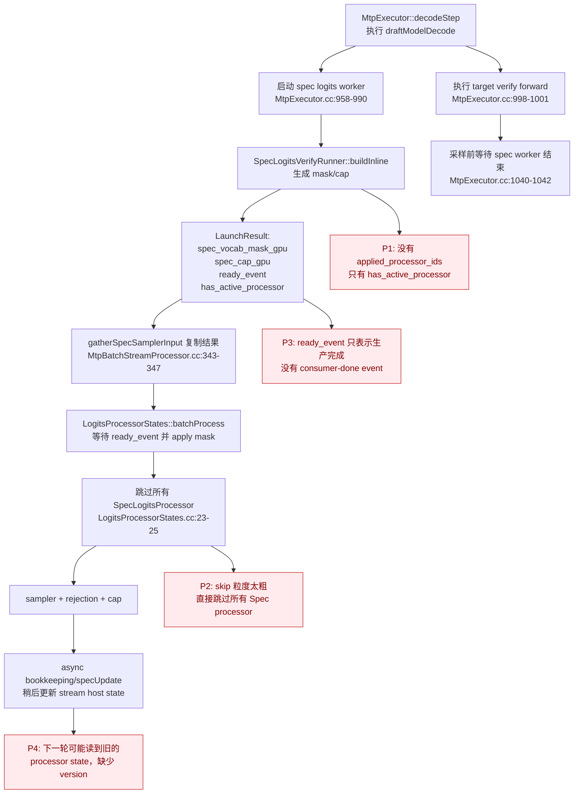
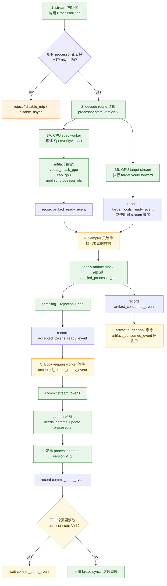
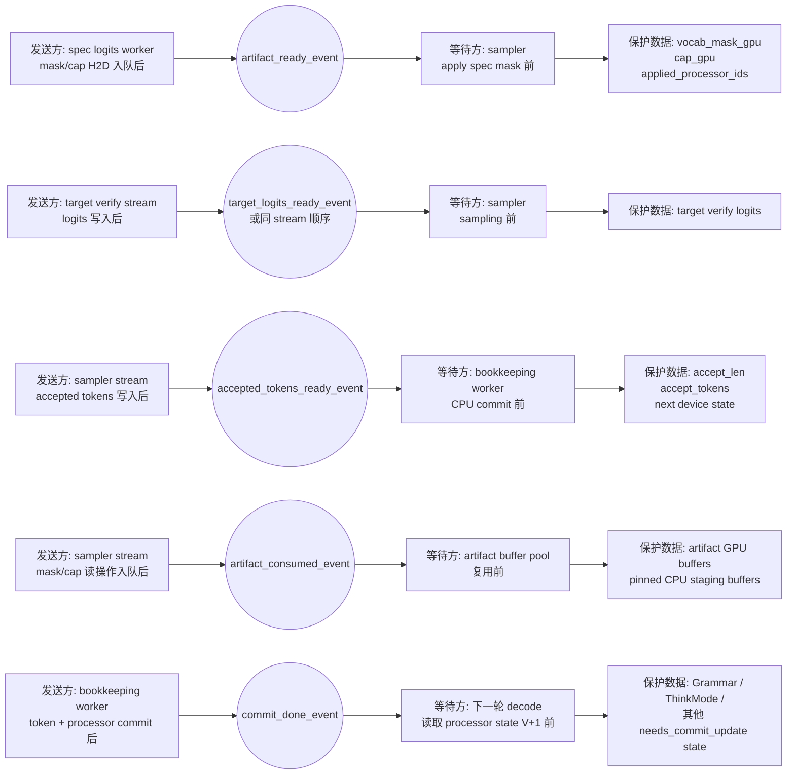
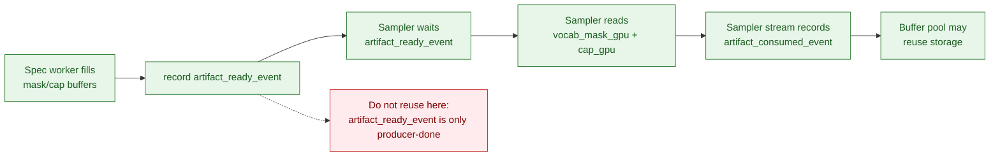
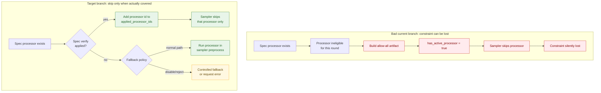
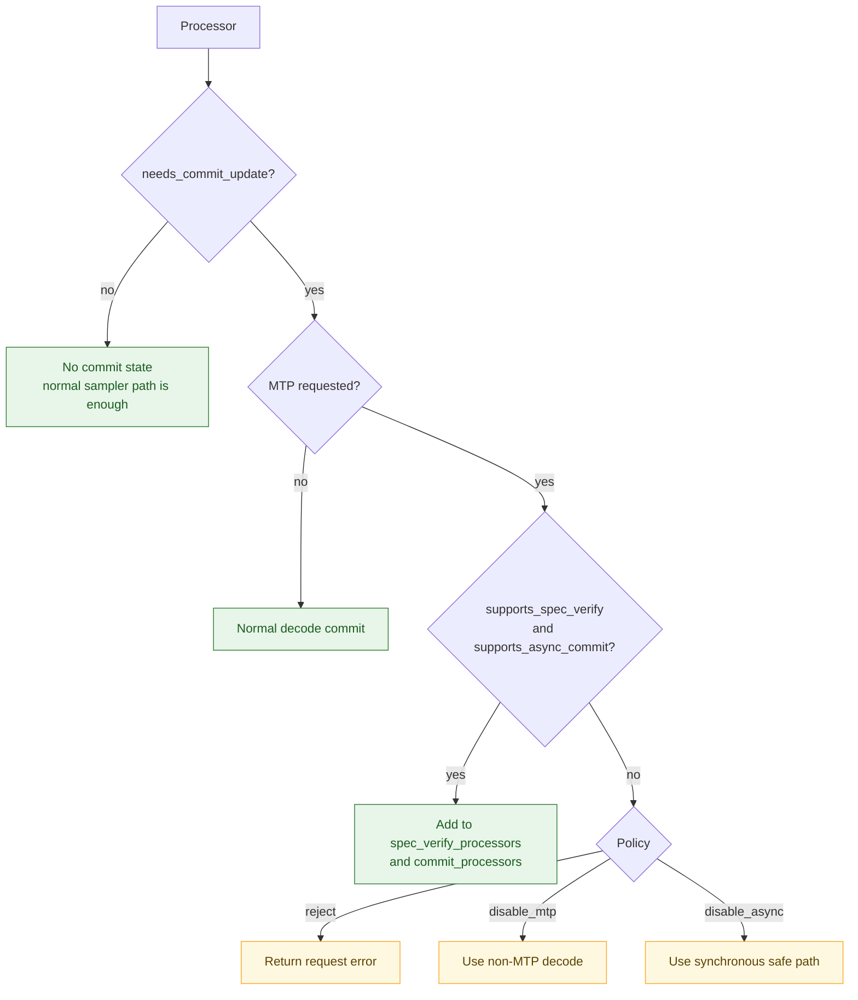
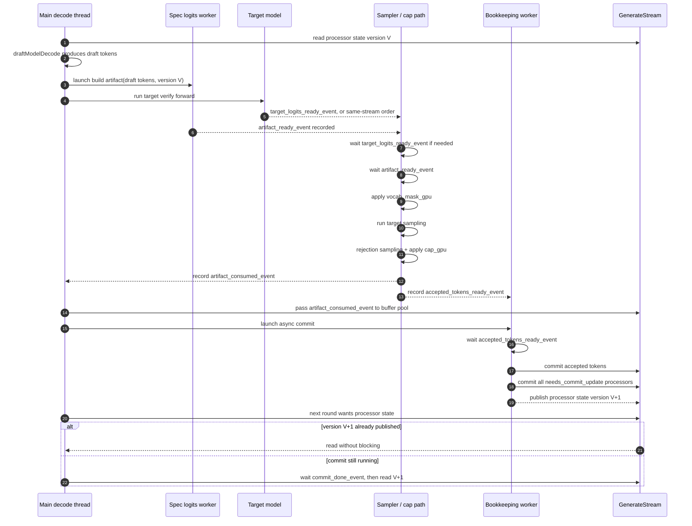
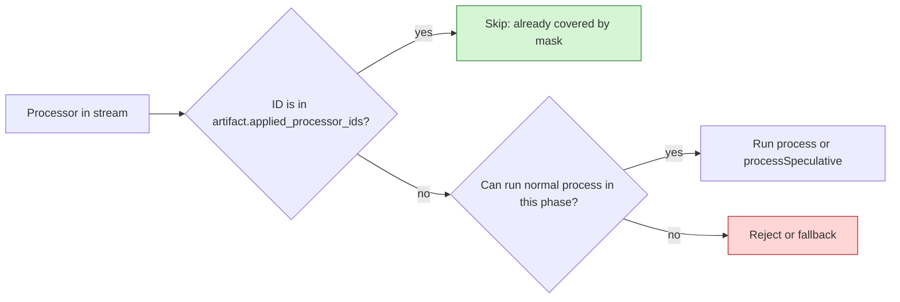

# MTP Async Logits Processor Global Solution

Date: 2026-05-25

Related review doc: `docs/mtp_async_logits_processor_cross_review.md`

## Goal

Make `mtp + async` logits processor behavior correct by construction, instead of relying on scattered sync points and processor-specific fixes.

The target design introduces a shared protocol for:

1. request constraint normalization,
2. logits processor capability declaration,
3. MTP spec verify artifact ownership,
4. token commit and processor state versioning,
5. explicit fallback/reject decisions when a processor cannot be safely handled.

## Non-Goals

- Do not add another one-off grammar-only path.
- Do not silently skip unsupported stateful processors.
- Do not use `isStateful()` as a catch-all for commit update, score-batch filtering, and length validation.
- Do not rely on CUDA event readiness as proof that a reusable tensor has already been consumed.

## 现状问题与目标改造

这一节只回答三个问题：

1. 当前代码链路怎么走；
2. 问题具体发生在哪个文件和函数；
3. 最终需要改成什么链路。

### 现状链路：当前代码怎么走



### 问题定位：当前错在哪里

| 问题 | 当前位置 | 为什么错 | 全局改法 |
|---|---|---|---|
| Spec mask 只能表达“存在某个 spec processor” | `SpecLogitsVerifyRunner::LaunchResult::has_active_processor`，在 `SpecLogitsVerifyRunner.cc:176-179` 设置 | sampler 不知道到底哪个 processor 被真正应用。如果 processor 不 eligible 或者实际是 allow-all，后续仍可能被跳过。 | 改成 `SpecVerifyArtifact.applied_processor_ids`。只有 processor id 在集合里，sampler 才能跳过它。 |
| sampler 看到 spec mask 后跳过所有 spec processor | `LogitsProcessorStates.cc:23-25` | 判断条件是 processor 类型，不是 artifact 覆盖范围，会丢 Grammar/ThinkMode 等约束。 | `batchProcess()` 改成逐 processor 检查 `artifact.applied_processor_ids.contains(processor_id)`。 |
| artifact 只有 producer-ready event，没有 consumer-done event | 当前 `LaunchResult` 只有 `ready_event`，没有 consumed event | `ready_event` 只保护 H2D 完成，不能证明 `masked_fill_` 和 cap 逻辑已经读完 tensor。 | 新增 `artifact_consumed_event`；artifact buffer 只能在该 event 后复用。 |
| async commit 晚于下一轮调度 | `MtpExecutor.cc:2035-2041` 已经说明下一轮可能早于 worker-side `specUpdate` 提交 host state | Grammar/ThinkMode 可能基于旧状态生成下一轮 spec mask。 | 增加 processor state epoch：spec verify 读取版本 `V`，commit 发布 `V+1`，下一轮只有读 `V+1` 时才等待。 |
| unsupported / ineligible processor 没有明确策略 | `SpecLogitsVerifyRunner.cc:127-130` 遇到 ineligible processor 直接 `return {}` | 空结果同时可能表示无 processor、不支持、错误，语义混在一起。 | 增加 `ProcessorPlan` 和 `SpecVerifyStatus`: `Applied`, `Noop`, `Unavailable`, `Error`；由 policy 决定 reject / disable MTP / disable async。 |

## 目标链路：最终需要怎么改

最终目标不是把 async 关掉，而是保留 CPU/GPU overlap，同时把每个异步交接点都变成明确的 event 依赖，并把“跳过 processor”的依据改成 artifact 里的 `applied_processor_ids`。



### Event 等待总图

这一张图只表达 event 关系：谁发送 event，谁同步等待，等待保护哪份数据。



### 最终代码改造清单

| 改造区域 | 最终改法 |
|---|---|
| `SpecLogitsVerifyRunner::LaunchResult` | 替换为 `SpecVerifyArtifact`: `vocab_mask_gpu`, `cap_gpu`, `applied_processor_ids`, `artifact_ready_event`, `artifact_consumed_event`, owned/pool buffer handle。 |
| `SpecLogitsVerifyRunner::buildInline()` | 每个 processor 返回明确 `SpecVerifyStatus`。只有 processor 真实贡献了 mask/cap 语义时，才把 id 放入 `applied_processor_ids`。 |
| `MtpBatchStreamProcessor::gatherSpecSamplerInput()` | 传完整 artifact 给 sampler inputs，不再只传 `has_active_processor` 和 mask tensor。 |
| `LogitsProcessorStates::batchProcess()` | 把“跳过所有 `SpecLogitsProcessor`”改成“只有 `processor_id` 在 `applied_processor_ids` 内才跳过”；否则走正常 `process()`，或者 fallback/reject。 |
| `MtpExecutor::decodeStep()` | 保留 target forward 和 spec worker overlap，但不再把 spec worker 完成当成语义正确。sampler 等 `artifact_ready_event`；commit worker 等 `accepted_tokens_ready_event`；下一轮只有读 processor state 时等 `commit_done_event`。 |
| `GenerateStream` / processor state | 增加 processor state epoch。先 commit accepted tokens 和所有 `needs_commit_update` processor，再发布 version `V+1`。 |

## Core Invariants

### Invariant 1: Spec artifact ownership

`SpecVerifyArtifact` owns or leases the tensors it returns. The runner must not reuse any backing storage until the consumer stream records completion.

Required fields:

```cpp
struct SpecVerifyArtifact {
    torch::Tensor vocab_mask_gpu;
    torch::Tensor cap_gpu;
    std::vector<ProcessorId> applied_processor_ids;
    std::shared_ptr<torch::Event> artifact_ready_event;
    std::shared_ptr<torch::Event> artifact_consumed_event;
};
```

Rules:

- producer records `artifact_ready_event` after mask/cap H2D copies are queued;
- sampler/cap path waits on `artifact_ready_event`;
- after `masked_fill_` and cap application are queued, sampler stream records `artifact_consumed_event`;
- buffer pool can reuse artifact storage only after waiting on `artifact_consumed_event`;
- pinned CPU staging buffers follow the same lifetime rule.

Lifecycle:



### Invariant 2: Applied processor semantics

Sampler preprocessing can skip a processor only if that exact processor was applied into the spec verify artifact.

Wrong semantic:

```text
has_active_processor == true
```

Correct semantic:

```text
applied_processor_ids contains processor.id()
```

Why this matters:



If a processor implements spec verify but is unavailable or ineligible for this round, the system must either:

- run its normal processor path,
- disable/fallback MTP for the request,
- or reject the request.

It must not generate an allow-all artifact and then skip the processor.

### Invariant 3: Commit update is explicit

Any processor whose state depends on committed tokens must be updated after token commit.

Do not use `isStateful()` for this. Introduce capability flags:

```cpp
struct ProcessorCapabilities {
    bool needs_commit_update = false;
    bool supports_spec_verify = false;
    bool supports_async_commit = false;
    bool validates_commit_length = false;
};
```

Examples:

| Processor | needs_commit_update | supports_spec_verify | validates_commit_length |
|---|---:|---:|---:|
| Grammar | yes | yes | yes |
| ThinkMode | yes | yes | yes or explicit no, but not default no-op |
| Tree | depends on behavior | no unless implemented | depends |
| MultiSeq | depends on behavior | no unless implemented | depends |

### Invariant 4: Processor state has a version

Each stream owns a processor state epoch:

```cpp
struct ProcessorStateEpoch {
    uint64_t version = 0;
    std::shared_ptr<torch::Event> commit_done_event;
};
```

Round N:

1. build spec artifact from processor state version `V`;
2. sample accepted tokens;
3. async worker commits stream tokens and all `needs_commit_update` processors;
4. processor state becomes version `V + 1`;
5. next round only waits when it needs to read processor state.

This keeps async overlap while preventing stale Grammar/ThinkMode snapshots.

## API Design

### Base processor interface

Add explicit capability methods:

```cpp
class BaseLogitsProcessor {
public:
    virtual ProcessorCapabilities capabilities() const;
    virtual void process(const SamplerInputs& inputs, size_t start_idx, size_t finish_idx) = 0;
    virtual void commit(const CommitContext& ctx) = 0;
    virtual int64_t acceptedTokenLen() const;
};
```

`commit()` replaces ambiguous update paths:

```cpp
struct CommitContext {
    enum class Phase {
        NormalDecode,
        MtpSpecCommit,
    };

    Phase phase;
    torch::Tensor committed_tokens;
    int32_t committed_token_count;
    torch::Tensor src_batch_indices;
    int64_t stream_output_len_after_commit;
};
```

### Spec verify interface

Replace the current `tryAcceptAndFillBitmask()` return contract with an explicit status:

```cpp
enum class SpecVerifyStatus {
    Applied,
    Noop,
    Unavailable,
    Error,
};

struct SpecVerifyResult {
    SpecVerifyStatus status;
    int cap;
};
```

Rules:

- `Applied`: mask/cap is valid and processor id is added to `applied_processor_ids`;
- `Noop`: processor has no constraint for this round and can be safely skipped only if it says so explicitly;
- `Unavailable`: fallback/reject path must be chosen;
- `Error`: request enters error state.

## ProcessorPlan

Create `ProcessorPlan` when a stream is created.

```cpp
struct ProcessorPlan {
    std::vector<BaseLogitsProcessorPtr> processors;
    std::vector<BaseLogitsProcessorPtr> commit_processors;
    std::vector<BaseLogitsProcessorPtr> spec_verify_processors;
    bool can_use_mtp = true;
    bool can_use_mtp_async = true;
};
```

Validation:

Compatibility is decided once when building the stream. The plan only asks three questions per processor:

1. Does this processor change state after committed tokens?
2. Is MTP requested for this stream?
3. If yes, can the processor be represented safely in spec verify and async commit?



Default policy should be correctness-first:

- production default: disable MTP async or reject unsupported constrained decoding;
- debug/perf experiments can opt into fallback via environment flag;
- every fallback emits metric and log.

## Constraint Normalization

Normalize all request grammar inputs into one canonical object before reaching C++ factory logic.

```cpp
struct ConstraintConfig {
    enum class Type {
        None,
        JsonSchema,
        Regex,
        Ebnf,
        StructuralTag,
    };

    Type type = Type::None;
    std::string payload;
};
```

Rules:

- `response_format: {"type":"text"}` produces `Type::None`;
- `json_format=true` produces JSON object schema only if no stronger grammar field exists;
- legacy fields are accepted only as input to normalization;
- `LogitsProcessorFactory` consumes `ConstraintConfig`, not raw field priority.

Current effective priority should be preserved during migration:

```text
json_schema > regex > ebnf > structural_tag > response_format
```

## MTP Async Decode Flow

This is the main runtime sequence. The important ownership rule is that `SpecVerifyArtifact` is produced by the spec worker, consumed by the sampler/cap path, and only reusable after the sampler stream records `artifact_consumed_event`.



Sampler preprocessing:



## Grammar and XGrammar Requirements

Grammar processor:

- `process()`, `commit()`, and spec verify all use the same `state_mutex_`, unless spec verify uses an immutable matcher snapshot;
- spec verify accept/rollback must be a transaction;
- each bitmask row must clear `[grammar_vocab, model_vocab)`;
- `terminated`, `finished`, and `passthrough` modes must be represented explicitly in spec verify results.

XGrammar backend:

- protect `compiler_.Compile*()` and `compiler_.ClearCache()` with compiler mutex;
- consider per-key in-flight compile futures to avoid stampede;
- distinguish invalid-cache miss from invalid-cache hit with empty error string.

## Migration Plan

### Phase 0: Guardrails

- Add logs/metrics for unsupported processor capability combinations.
- Add runtime assertion: if spec artifact exists, every skipped processor id must be in `applied_processor_ids`.
- Add assertion that artifact tensors are not reused before `artifact_consumed_event`.

### Phase 1: Processor capability layer

- Add `ProcessorCapabilities`.
- Implement capabilities for Grammar and ThinkMode.
- Add `needs_commit_update` path in `GenerateStream::update()` and `GenerateStream::specUpdate()`.
- Keep old APIs as compatibility wrappers.

### Phase 2: SpecVerifyArtifact ownership

- Replace raw `LaunchResult` tensors with `SpecVerifyArtifact`.
- Use owned tensors first for simplicity.
- Optionally optimize to ring/pool after correctness tests pass.

### Phase 3: Applied processor tracking

- Add stable processor ids or indices per stream.
- `SpecLogitsVerifyRunner` returns `applied_processor_ids`.
- `LogitsProcessorStates` skips only applied processors.

### Phase 4: Commit state version

- Add processor state epoch per stream.
- Async commit worker records commit done event.
- Next round waits only on processor-state reads.

### Phase 5: Constraint normalization

- Add canonical `ConstraintConfig`.
- Update OpenAI, DashSC/RPC, and C++ factory path.
- Preserve legacy field parsing during migration.

### Phase 6: XGrammar and tests

- Add compiler mutex.
- Add full regression matrix.
- Split CPU-only grammar test deps.

## Regression Matrix

| Area | Required Case |
|---|---|
| Artifact lifetime | two consecutive MTP decode rounds reuse runner buffers; vary batch/propose/vocab |
| Applied semantics | all Spec processors ineligible; assert no processor skip occurs |
| ThinkMode commit | `accepted_len > 1` crosses think budget/end token; snapshot advances |
| Grammar vocab | grammar vocab smaller than model vocab; tail token logits are masked |
| Grammar concurrency | `tryAcceptAndFillBitmask()` interleaves with `commit()` under TSAN |
| Stateful non-Spec | MTP request rejects/fallbacks instead of silent skip |
| XGrammar backend | concurrent compile same/different grammar plus clear under TSAN |
| Config none | `response_format: text` clears all grammar sources including stale `response_format` |
| FakeSampler | test sampler calls preprocess or real sampler is used |
| BUILD | CPU grammar test has no CUDA deps |

## Rollout and Safety

Recommended rollout flags:

```text
RTP_LLM_MTP_ASYNC_LOGITS_PROCESSOR=0/1
RTP_LLM_MTP_UNSUPPORTED_PROCESSOR_POLICY=reject|disable_mtp|disable_async
RTP_LLM_MTP_SPEC_ARTIFACT_POOL=owned|ring
```

Default policy before full coverage:

```text
RTP_LLM_MTP_ASYNC_LOGITS_PROCESSOR=0
RTP_LLM_MTP_UNSUPPORTED_PROCESSOR_POLICY=reject
RTP_LLM_MTP_SPEC_ARTIFACT_POOL=owned
```

Promotion criteria:

- all P0/P1 regression cases pass;
- no silent skip metrics in canary;
- no processor state length mismatch;
- no grammar invalid-token commit errors under MTP async canary;
- no TSAN failures for grammar matcher/backend tests.

## Acceptance Checklist

- [ ] `SpecVerifyArtifact` has explicit ownership and consumed event.
- [ ] `LogitsProcessorStates` skips only applied processor ids.
- [ ] Grammar and ThinkMode declare commit/update capabilities.
- [ ] MTP commit updates all `needs_commit_update` processors.
- [ ] Processor state epoch prevents stale snapshot reads.
- [ ] Stateful non-Spec processor policy is explicit.
- [ ] Grammar spec bitmask masks `[grammar_vocab, model_vocab)`.
- [ ] XGrammar compiler operations are mutex-protected.
- [ ] `response_format: text` normalizes to no constraint.
- [ ] FakeSampler or real sampler tests cover preprocess.
- [ ] CPU grammar test has CPU-only deps.
