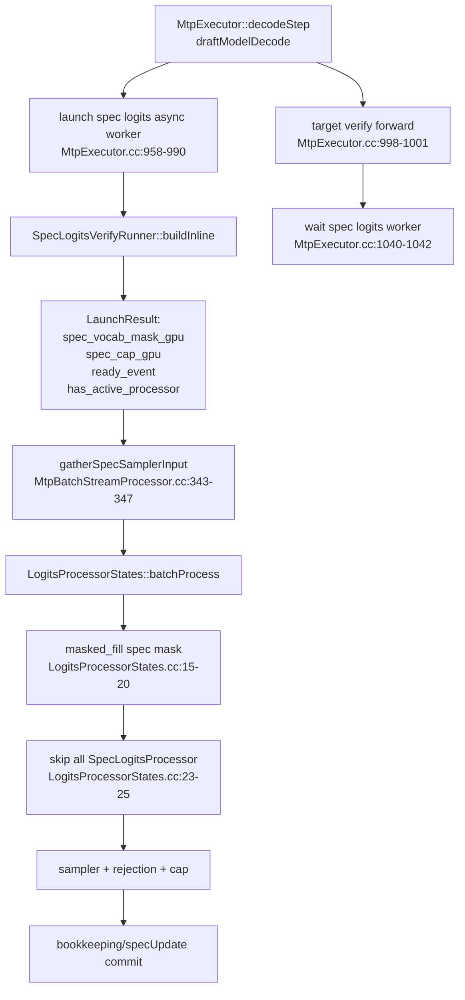
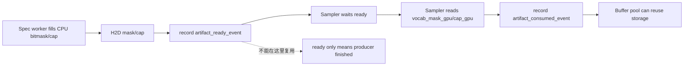
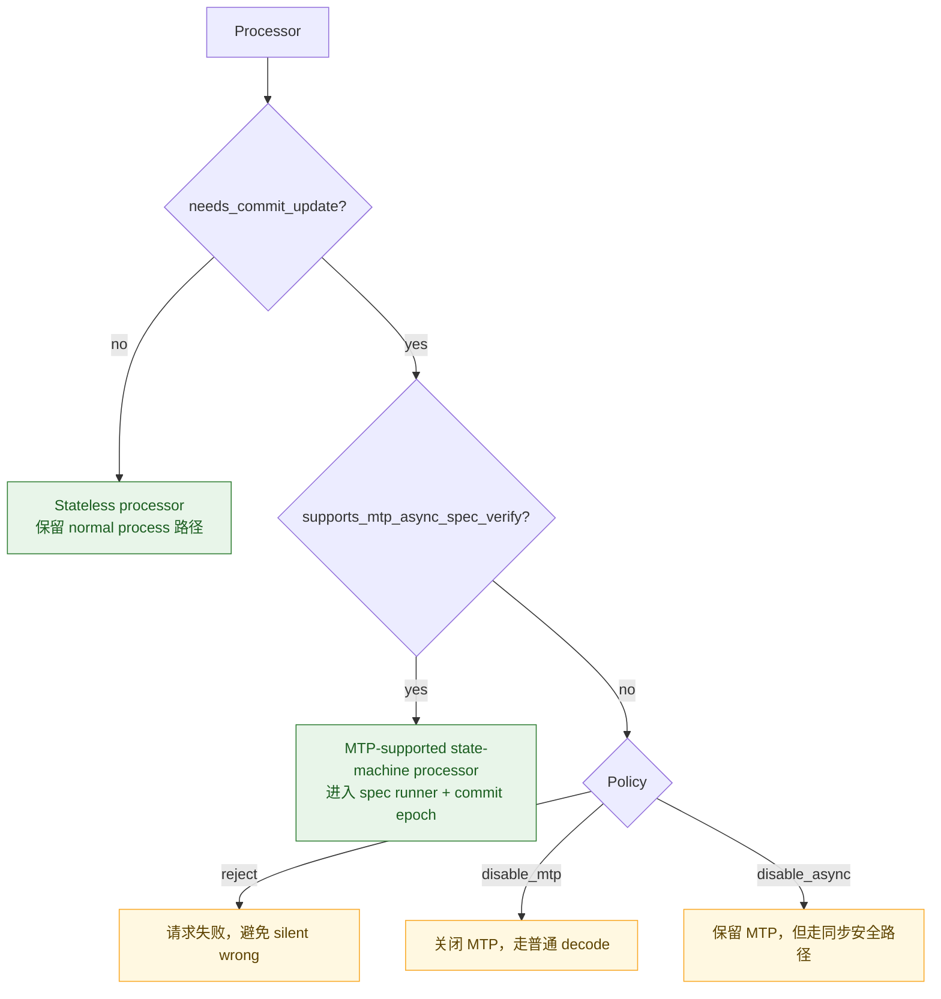
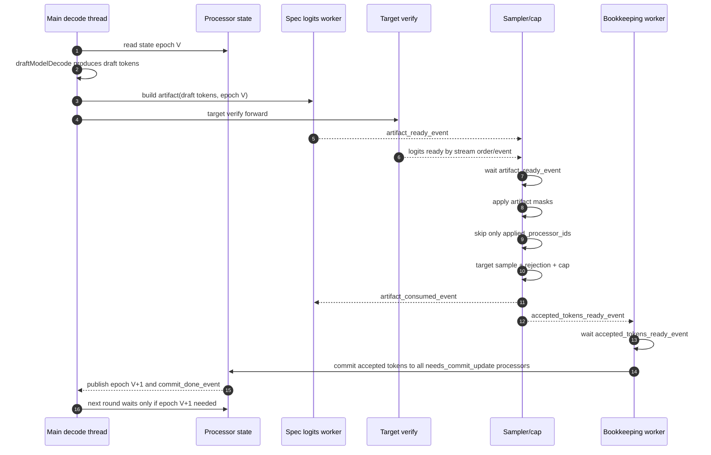

# MTP Async Logits Processor 全局方案评审

Date: 2026-05-25

Related:

- `docs/mtp_async_logits_processor_cross_review.md`
- `docs/dsv4_mtp_async_logits_processor_design.md`
- Current implementation branch: `codex/dsv4-json-format-mtp-clean-20260524`
- Current verified commit: `1d9f3d25c2 fix: harden async MTP logits verify`

## 0. 结论

这份全局方案方向是对的，而且有必要继续做。当前分支已经用局部补丁修掉了一批真实 bug：runner buffer 复用、grammar vocab tail、ThinkMode commit、ineligible processor allow-all 跳过等；并且本地服务验证已经显示：

- 17 个 fixture case 全部通过；
- 其中 16 个 JSON object / JSON schema case 全部可解析并满足校验；
- timeline 中 `spec_logits_verify_async_worker` 与 `target_model_verify` 有重叠，异步链路实际生效。

但是当前代码仍然是“修了这次的漏洞”，还不是“结构上不可能再犯”。全局方案的价值在于把 MTP async logits processor 抽象成统一协议，尤其是 ThinkMode 和 XGrammar/Grammar 这类有状态机的 processor 必须按同一套状态、artifact、commit、epoch 规则处理。

回答三个关键问题：

1. **方案合理吗？**  
   合理。`applied_processor_ids`、artifact ownership、显式 commit capability、processor state epoch 是 P0 级别的结构性改造。

2. **需要改动吗？**  
   需要。当前 `has_active_processor`、跳过所有 `SpecLogitsProcessor`、`isStateful()` 多义复用、缺少 state epoch / capability policy，这些都是下一次 bug 的入口。

3. **改完就能修复当前 bug 吗？**  
   能覆盖当前这类 bug 的根因：silent skip、旧状态构造 mask、buffer 被下一轮覆盖、unsupported processor 被误当 no-op。但它不能单独保证模型能力、搜索插件输出质量、xgrammar 编译性能、所有 PD replay corner case；这些要靠测试矩阵和指标继续兜住。

## 1. 当前验证状态

远端验证目录：

```text
/home/luoli.hn/work/rtp_llm_3/timeline_runs/dsv4_xgrammar_mtp_async_fix4_20260525_002331
```

关键文件：

```text
manual_json_requests/summary_reparsed_sse_lines.json
manual_json_requests/timeline_analysis.json
profiler/codex_json17_mtp_async_1779640377_case*.json
```

验证结果：

```json
{
  "total": 17,
  "json_cases": 16,
  "passed": 17,
  "failed": [],
  "json_failed": []
}
```

timeline 聚合：

```json
{
  "files": 19,
  "spec_count": 240,
  "target_count": 66,
  "wait_count": 48,
  "spec_dur_us": 74393.701,
  "target_dur_us": 11774420.342,
  "overlap_us": 71698.41796875,
  "overlap_pairs": 96
}
```

这说明当前实现对已有 fixture 已经可用，但不能替代全局设计。尤其是 stream + thinking case 一开始被错误脚本误判，正确的 SSE `data:` 行解析后才确认 JSON content 是有效的。后续测试必须把 SSE 解析作为标准校验逻辑。

## 2. 当前代码链路

当前 MTP async spec logits 大致链路如下：



当前相关接口：

| 模块 | 当前接口/行为 | 问题 |
|---|---|---|
| `BaseLogitsProcessor` | `process/updateStatus/isStateful/acceptedTokenLen` | `isStateful()` 同时承担 commit、长度校验、异步状态含义，语义过载 |
| `SpecLogitsProcessor` | `isSpecVerifyEligible()` + `tryAcceptAndFillBitmask()` | 返回值只有 cap，没有 Applied/Noop/Unavailable/Error |
| `SpecLogitsVerifyRunner::LaunchResult` | mask/cap/event/`has_active_processor` | 只能表达“有 active processor”，不能表达“哪些 processor 被覆盖” |
| `LogitsProcessorStates::batchProcess` | 看到 spec mask 后跳过所有 `SpecLogitsProcessor` | skip 粒度过粗 |
| `MtpExecutor::decodeStep` | worker 和 target verify overlap 后，采样前 sync worker | 异步生效，但状态正确性仍依赖若干散落 sync |
| `GenerateStream` commit | 通过 `isStateful()` 过滤 processor | 无法表达 state-machine processor 的精确 capability |

## 3. 当前补丁已经修复的局部问题

当前 commit `1d9f3d25c2` 已经把下面几类 bug 修掉：

| 问题 | 当前修复 | 仍然不足 |
|---|---|---|
| runner 返回可复用 GPU buffer view | `SpecLogitsVerifyRunner` 改成每轮 result-owned GPU/CPU tensor，并携带 consumed event | 还没有 buffer pool 协议，后续做 ring/pool 时必须等待 consumed event 后复用 |
| `draft_token_ids_t` shape 包含 pre-target column | runner 根据列数跳过 offset 0 | 需要把 token layout 写入接口契约 |
| Grammar MTP bitmask 放行 model vocab tail | `tryAcceptAndFillBitmask()` 清 `[grammar_vocab, model_vocab)` | 需要测试覆盖 grammar vocab smaller than model vocab |
| ThinkMode commit 不推进 | `ThinkModeLogitsProcessor` 实现 `isStateful()/acceptedTokenLen()` | `isStateful()` 语义仍然不干净 |
| ineligible processor allow-all 后被跳过 | runner 遇到 ineligible 返回 inactive | 仍没有 per-processor skip 精确语义 |
| cap 后 token replacement 错 | `applySpecLogitsAcceptLenCap()` 在 cap 位置替换 target sampler token | 需要专门测试 `cap < P` 且 target 接受 bonus row |

这些修复是必要的，但不是最终形态。

## 4. ThinkMode 和 XGrammar 必须统一建模

ThinkMode 和 XGrammar/Grammar 的共同点是：它们都不是普通的 stateless logits mask，而是 **state-machine logits processor**。

它们都需要满足同一组语义：

1. 用当前 committed state 或 snapshot 预测 draft tokens 的每一步 mask；
2. 如果 draft token 不被状态机接受，返回 cap，让 target row 替换该 token；
3. target/rejection 最终接受 tokens 后，按 accepted tokens 提交状态；
4. 下一轮 spec verify 必须读取 commit 后的新状态；
5. PD 分离时，状态必须能由 replay tokens 或显式 state blob 恢复，不能只依赖 decode 本地内存。

推荐抽象：

```cpp
struct StateMachineProcessorCapabilities {
    bool needs_commit_update = true;
    bool supports_mtp_spec_verify = true;
    bool supports_async_spec_verify = true;
    bool supports_snapshot_read = true;
    bool requires_commit_epoch = true;
    bool validates_commit_length = true;
};
```

ThinkMode 的当前实现已经向这个方向靠近：

- `publishSpecSnapshotLocked()` 发布 immutable snapshot；
- `tryAcceptAndFillBitmask()` 在 snapshot copy 上模拟状态推进；
- `updateStatus()` 在真实 accepted tokens 上推进 DFA；
- `acceptedTokenLen()` 暴露当前 output length。

Grammar/XGrammar 当前实现则更接近事务模式：

- `tryAcceptAndFillBitmask()` 在 matcher 上 `acceptToken()` 后 `rollback()`；
- `updateStatus()` 在真实 accepted tokens 上推进 matcher；
- `state_mutex_` 保护 commit path。

这两种实现可以并存，但接口必须统一：

| Processor | spec verify state source | commit state source | 风险 |
|---|---|---|---|
| ThinkMode | immutable snapshot copy | `updateStatus(new_tokens)` | snapshot epoch 需要和 commit epoch 对齐 |
| Grammar/XGrammar | matcher transaction 或 matcher snapshot | `updateStatus(new_tokens)` | spec verify 与 commit 并发时必须锁或 clone |

### 推荐统一接口

```cpp
enum class SpecVerifyStatus {
    Applied,
    Noop,
    Unavailable,
    Error,
};

struct SpecVerifyContext {
    ProcessorId processor_id;
    uint64_t stream_id;
    uint64_t round_id;
    uint64_t base_state_epoch;
    int64_t base_seq_len;
    int64_t base_output_len;
    const int32_t* draft_tokens;
    int propose_step;
    size_t vocab_size;
    int32_t* bitmask_cpu_out;
    size_t bitmask_words;
};

struct SpecVerifyResult {
    SpecVerifyStatus status = SpecVerifyStatus::Unavailable;
    int cap = 0;
    uint64_t state_epoch = 0;
    std::string error_message;
};
```

语义：

- `Applied`：processor 的约束已被写入 artifact，可以跳过该 processor 的 normal process；
- `Noop`：processor 明确声明本轮无约束，是否跳过由 processor 自己负责；
- `Unavailable`：不能安全 spec verify，必须 fallback/reject；
- `Error`：请求进入 error state。

不要再用“返回 cap=P”表达所有情况，因为 cap=P 同时可能表示：

- 全部 draft token 被接受；
- processor 没有约束；
- processor 不 eligible；
- processor 出错但被吞了。

这些语义必须拆开。

## 5. 全局方案的 P0 改造

### P0.1 `applied_processor_ids`

当前 `has_active_processor` 只能说明“runner 生成过 mask”，不能说明每个 processor 是否被应用。

目标：

```cpp
struct ProcessorId {
    uint64_t stream_id;
    uint32_t processor_index;
};

struct SpecVerifyArtifact {
    torch::Tensor vocab_mask_gpu;
    torch::Tensor cap_gpu;
    std::vector<ProcessorId> applied_processor_ids;
    std::shared_ptr<torch::Event> artifact_ready_event;
    std::shared_ptr<torch::Event> artifact_consumed_event;
};
```

`LogitsProcessorStates::batchProcess()` 必须改成：

```text
if processor_id in artifact.applied_processor_ids:
    skip
else:
    run normal process/processSpeculative or fallback
```

不能再写：

```cpp
if (has_spec_mask && dynamic_pointer_cast<SpecLogitsProcessor>(processor)) {
    continue;
}
```

### P0.2 artifact lifecycle

当前 result-owned tensor 已经规避了最危险的复用问题，并且 artifact 已携带 consumed event；但这还不是最终性能方案。后续如果做 ring/pool，buffer pool 必须把 consumed event 作为复用前置条件。

正确生命周期：



注意：`artifact_ready_event` 不能证明 sampler 已经读完 mask/cap；它只证明 producer 写完了。

### P0.3 processor capability

必须拆掉 `isStateful()` 的多义复用。

推荐：

```cpp
struct ProcessorCapabilities {
    bool needs_commit_update = false;
    bool supports_spec_verify = false;
    bool supports_async_spec_verify = false;
    bool can_run_normal_mtp_process = true;
    bool validates_commit_length = false;
};
```

映射：

| Processor | needs_commit_update | supports_spec_verify | supports_async_spec_verify | 说明 |
|---|---:|---:|---:|---|
| Grammar/XGrammar | yes | yes | yes, if locked/snapshot | 有 parser state |
| ThinkMode | yes | yes | yes, via immutable snapshot | 有 DFA state |
| Tree | depends | no until designed | no | 不能默认跳过 |
| MultiSeq | depends | no until designed | no | 不能默认跳过 |
| Stateless mask | no | optional | yes if pure | 无 commit state |

### P0.4 commit epoch

当前代码通过 `spec_bookkeeping_runner_.sync()` 等待上一轮 bookkeeping，保证 state commit 后再读。但这仍是 broad sync 风格，和 async 初衷冲突。

目标是每个 stream 维护 processor state epoch：

```cpp
struct ProcessorStateEpoch {
    uint64_t version = 0;
    std::shared_ptr<torch::Event> commit_done_event;
};
```

规则：

1. round N spec verify 读取 version `V`；
2. worker 提交 accepted tokens；
3. 所有 `needs_commit_update` processor commit；
4. 发布 version `V+1`；
5. 下一轮只有需要读取 state-machine processor state 时才等 `commit_done_event`。

这能避免“下一轮拿旧状态构造 mask”，也避免不必要的 broad sync。

#### event 能否替代 epoch

不能。event 只能回答：

```text
某个 producer 在某条 stream 上排队的工作是否已经完成
```

它不能回答：

```text
当前读到的 processor state 到底对应第几轮 accepted tokens
```

所以正确模型应该是 **epoch + event**，不是二选一：

```cpp
struct ProcessorStateEpoch {
    uint64_t version = 0;
    std::shared_ptr<torch::Event> commit_done_event;
};
```

使用规则：

1. spec verify 读取 state 前记录自己需要的 `expected_epoch`；
2. 如果 `current_epoch >= expected_epoch`，直接读 snapshot/matcher；
3. 如果 `current_epoch < expected_epoch`，等待 `commit_done_event`；
4. wait 返回后必须再次检查 `current_epoch`，防止 event 被复用或等待错版本；
5. commit worker 必须先提交 tokens 和 processor state，再发布 `version = V + 1`。

对不同 processor 的含义：

| Processor | epoch 的作用 | event 的作用 |
|---|---|---|
| ThinkMode | snapshot 对应哪个 output length / DFA version | 等 commit worker 发布新 snapshot |
| Grammar/XGrammar | matcher committed state 对应哪个 accepted-token prefix | 等 commit worker 完成 matcher accept |
| 普通 stateless processor | 不需要 epoch | 不需要 event |

注意：CPU 状态机本身不能靠 CUDA event 保证线程安全。Grammar/XGrammar 的 matcher 仍然需要 `state_mutex_` 或 immutable snapshot；event 只保证 commit 与下一轮读取的顺序。

#### MTP verify row 状态和 event 边界

以 `gen_num_per_cycle = 3` 为例，target verify 会产生 `P + 1 = 4` 行 logits。它们不是同一个 grammar/think 状态的重复 mask，而是同一个 committed state 沿 draft token 虚拟推进得到的 offset-specific mask：

| verify row | logits 语义 | processor 状态 |
|---:|---|---|
| 0 | 校验/重采样第 0 个 draft token | `S0 = 上一轮 committed state` |
| 1 | 校验/重采样第 1 个 draft token | `S1 = Accept(S0, draft[0])` |
| 2 | 校验/重采样第 2 个 draft token | `S2 = Accept(S1, draft[1])` |
| 3 | bonus target token | `S3 = Accept(S2, draft[2])` |

spec runner 生产的是一个整体 artifact，而不是每行一个独立异步任务：

```text
draft tokens ready
  -> CPU state-machine walk: S0/S1/S2/S3
  -> mask rows + grammar_cap
  -> H2D(mask/cap)
  -> artifact_ready_event
```

所以 event 边界应该按“异步数据交接点”划分，而不是按 row 划分：

| Event | Producer | Consumer | 保护的数据/语义 |
|---|---|---|---|
| `draft_tokens_ready_event` | draft model sample stream | spec runner copy stream | runner 读取的是本轮 draft tokens，不是上一轮 propose tokens |
| `artifact_ready_event` | spec runner copy stream | sampler stream | 4 行 offset mask 和 `grammar_cap` 已经 H2D 完成 |
| `transfer_done_event` / `accepted_tokens_ready_event` | sampler/rejection stream | bookkeeping worker | cap 后的 `accept_len_cpu` 和 replacement 后的 `accept_tokens_cpu` 可读 |
| `commit_done_event` | bookkeeping worker | 下一轮 spec verify | state-machine processor 已按本轮 accepted tokens 提交 |

当前保守实现里，最后一个边界暂时由 `spec_bookkeeping_runner_.sync()` 承担：本轮 spec verify 读取 processor state 前，会等上一轮 bookkeeping 完成。因此当前正确性不依赖还未落地的 epoch；epoch+event 的目标是把这个等待从 broad runner sync 收窄到“只在需要读 state-machine processor 且版本没到时等待”。

accept/commit 的对应关系必须保持：

```text
final_accept_len = min(rejection_accept_len, grammar_cap + 1)
```

- 如果 `grammar_cap = j < P`，说明 `draft[j]` 对状态 `Sj` 非法；最终最多提交 `j + 1` 个 token，并且第 `j` 个 token 必须替换成 target row `j` 的采样 token。
- 如果 `final_accept_len = k`，真实 stream processor 只在 bookkeeping commit 阶段按 `accept_tokens[0:k]` 顺序推进一次。
- spec verify 阶段的 `Accept/rollback` 或 snapshot walk 不能留下 committed state mutation。

这就是“接受 accept_len 个 token，就把 processor 状态推进到 accept_len 对应的新状态”的闭环：verify rows 用 `S0..SP` 约束 target logits，cap/rejection 选择真实提交前缀，`updateStatus()` 再把真实前缀提交成下一轮的 `S0`。

### P0.5 fallback policy

空 artifact 不能同时表示：

- 没有 spec processor；
- processor no-op；
- processor 不 eligible；
- processor 出错。

必须加策略：

```text
reject | disable_mtp | disable_async | normal_process
```

建议默认：

```text
production default: reject or disable_mtp_async
debug default: normal_process with metric
```

绝对不能 silent allow-all 后跳过 processor。

## 5.5 MTP 支持与不支持 processor 的边界

这条边界必须非常清楚，不能靠 `dynamic_pointer_cast<SpecLogitsProcessor>` 加 `has_active_processor` 猜。

建议保持原有设计尽量稳定：

- `BaseLogitsProcessor` 继续保留现有 `process/updateStatus` 主接口；
- MTP async 能力通过小的 capability/mixin 扩展表达；
- 默认 processor 一律视为 **不支持 MTP async spec verify**；
- 只有显式声明并实现 spec verify 的 processor 才进入 runner；
- 不支持但有状态的 processor 不能被静默跳过。

推荐最小接口：

```cpp
struct ProcessorCapabilities {
    bool needs_commit_update = false;
    bool supports_mtp_spec_verify = false;
    bool supports_mtp_async_spec_verify = false;
    bool can_run_mtp_normal_process = true;
};

class BaseLogitsProcessor {
public:
    virtual ProcessorCapabilities capabilities() const {
        return {};
    }
};
```

MTP 规划时按 capability 分类：



当前已知边界：

| Processor | MTP async support | 处理策略 |
|---|---|---|
| ThinkMode | yes, state-machine processor | snapshot spec verify + commit epoch |
| Grammar/XGrammar | yes, state-machine processor | matcher transaction/snapshot + commit epoch |
| Tree | no, unless单独实现 spec verify | reject/disable MTP/disable async |
| MultiSeq | no, unless单独实现 spec verify | reject/disable MTP/disable async |
| Stateless mask 类 processor | optional | 可继续 normal process，不需要 commit epoch |

这样做不会破坏原有非 MTP 路径：不支持 MTP async 的 processor 仍然按 `process/updateStatus` 运行；只有当请求打开 MTP async 且 processor 会影响 committed state 时，才强制要求它声明支持或走明确 fallback。

## 6. 目标主流程



## 7. 主要挑战

### P0: processor id 和 batch interval 对齐

`LogitsProcessorStates` 当前只保存 processor 指针和 interval。MTP verify score batch 中，一个 stream 会展开成 `P+1` 行，processor id 需要包含：

- stream id；
- processor index；
- score-batch row interval；
- possibly sequence slot for beam/multiseq。

否则 `applied_processor_ids` 无法和 sampler preprocess 的 processor entry 精确匹配。

建议先只支持当前已验证约束：

```text
maxBatchSize == 1
one stream slot
no beam/multiseq for MTP async state-machine processor
```

并用 runtime check fail closed。

### P0: commit epoch 与异步 worker 的发布顺序

ThinkMode 和 XGrammar 都依赖 accepted tokens 推进状态。如果下一轮 spec worker 在 commit worker 前读 state，就会基于旧状态构造 mask。

当前补丁通过 `spec_bookkeeping_runner_.sync()` 降风险，但长期目标是精确等待 `commit_done_event`。

挑战：

- CPU processor state 没有天然 CUDA event；
- commit worker 同时处理 stream output、processor state、KV swaps；
- PD 分离下 prefill/decode replay 也要和 epoch 语义一致。

建议拆成两步：

1. 先保留当前 sync，但记录 state epoch 和 metric；
2. epoch 验证稳定后，逐步把 broad sync 替换成 per-stream/per-state event wait。

### P0: XGrammar spec verify 的事务安全

当前 Grammar `tryAcceptAndFillBitmask()` 直接在 matcher 上 accept/rollback。长期必须保证它和 commit 不并发破坏状态。

可选方案：

1. **锁住 matcher transaction**：简单可靠，CPU worker 时间可能上升；
2. **matcher clone/snapshot**：更适合 async，但依赖后端支持；
3. **GPU authoritative state**：长期最优，但需要 xgrammar automaton lowering。

V1 建议：

```text
Grammar/XGrammar spec verify 与 commit 共享 state_mutex_ 或使用 immutable matcher snapshot。
不能假设 commit worker 和 spec worker 永远不会并发。
```

### P1: artifact pool 性能

当前 result-owned tensor correctness 简单，但每轮 alloc GPU/CPU tensor 有成本。后续要优化成 ring/pool 时，必须引入 `artifact_consumed_event`。

建议先保留 owned 模式作为默认：

```text
RTP_LLM_MTP_SPEC_ARTIFACT_POOL=owned
```

等 P0 regression 全绿后再做：

```text
RTP_LLM_MTP_SPEC_ARTIFACT_POOL=ring
```

### P1: fallback 行为和指标

fallback 不只是工程细节，它决定线上行为：

| 场景 | 推荐策略 |
|---|---|
| state-machine processor 不支持 spec verify | reject or disable MTP async |
| processor 本轮 explicit Noop | skip only this processor |
| processor temporary Unavailable | disable async or normal process |
| processor Error | request error |

必须有 metrics：

```text
mtp_spec_processor_applied_total
mtp_spec_processor_noop_total
mtp_spec_processor_unavailable_total
mtp_spec_processor_error_total
mtp_spec_processor_silent_skip_assert_total
mtp_processor_state_epoch_wait_total
mtp_artifact_pool_wait_consumed_total
```

### P1: PD state 同步

PD 分离不是“不需要传状态”，而是当前可以用 replay tokens 作为 canonical state source。

要求：

1. prefill export replay tokens 或 state blob；当前 `GenerateRequestPB` 至少会把 `first_generate_token_id`、`propose_token_ids`、`propose_probs`、`propose_hidden` 传给 decode。
2. decode 端创建 stream 时，先用 `GenerateInputPB` 的 prompt/config 构造 processor 初始状态；如果请求携带 replay tokens，就先 replay 到 prefill committed state。
3. replay 不应包含 `first_generate_token_id`。decode 在 `localGenerate()` 中收到 first token 后调用 `generate_stream->update(first_token)`，这一步手动把 Grammar/ThinkMode 推进到 decode 第一轮应该读取的状态。
4. MTP 相关的 `propose_token_ids/propose_probs/propose_hidden` 只恢复 draft/propose buffer，不等价于 processor state；processor state 仍以 prompt replay + first token update 为准。
5. tokenizer/schema/cache key fingerprint 一致；如果 decode 本地 grammar 编译结果和 prefill 不一致，必须 fail closed。
6. processor state epoch 从 restore + first token update 后的 committed state 开始。

换句话说，PD 下 event 没有跨进程意义，decode 第一次状态可以也应该由 token id 手动创建/恢复：

```text
GenerateInputPB(prompt/config)
  -> create Grammar/ThinkMode initial state
  -> replay prefill accepted tokens, excluding first_generate_token_id
  -> update(first_generate_token_id)
  -> decode MTP round reads this as S0
```

这个链路要防的不是“没传 event”，而是：

- replay tokens 少了，decode 的 `S0` 落后；
- replay tokens 多了，把 `first_generate_token_id` double accept；
- prefill/decode tokenizer 或 grammar schema 不一致，同样 token id 对应不同状态；
- MTP propose buffer 恢复了，但 processor state 没恢复，导致 verify rows 用旧状态。

如果未来为了性能传 XGrammar state blob，必须和 replay tokens 一样有 version/fingerprint。

### P2: constraint normalization

这不是当前 MTP async bug 的直接根因，但会影响长期可维护性。

建议把所有入口统一成：

```cpp
struct ConstraintConfig {
    enum class Type {
        None,
        JsonObject,
        JsonSchema,
        Regex,
        Ebnf,
        StructuralTag,
    };

    Type type = Type::None;
    std::string payload;
    bool strict = false;
};
```

迁移期间保留优先级：

```text
json_schema > regex > ebnf > structural_tag > response_format/json_format
```

## 8. 是否能修复当前 bug

| 当前/潜在 bug | 当前补丁 | 全局方案 |
|---|---|---|
| JSON schema 非 stream 输出非法 | 已验证通过 | 能继续防止 processor 被跳过 |
| stream + thinking JSON 被误判为空 | 校验脚本修正 SSE 后通过 | 方案不直接影响 SSE 解析，但要求 smoke 支持 SSE content 聚合 |
| spec mask buffer 被下一轮覆盖 | result-owned tensor 已修 | artifact consumed event + pool 规则可长期保证 |
| ThinkMode accepted tokens 后状态不推进 | 当前用 `isStateful()` 修 | capability + commit epoch 是结构性修复 |
| XGrammar/Grammar mask 放行 vocab tail | 当前已修 | regression 固化 |
| ineligible processor allow-all 后被跳过 | 当前返回 inactive | `applied_processor_ids` 是结构性修复 |
| 下一轮读旧 processor state | 当前靠 sync 降风险 | state epoch + commit_done_event 是最终修复 |
| unsupported stateful processor silent skip | 当前仍有架构风险 | ProcessorPlan + fallback policy 修复 |

结论：全局方案能修当前 bug 的根因，但必须按 P0 项完整落地；只加其中一两个字段，不足以保证正确性。

## 9. 落地顺序

### Phase 0: guardrails

先加断言和指标，不改变主行为：

- 如果 spec artifact 存在，被跳过的 processor 必须在 `applied_processor_ids` 中；
- 如果 processor `needs_commit_update && MTP async` 但不支持 spec verify，必须 fallback/reject；
- 如果 state epoch 不匹配，记录 metric 并走同步 fallback；
- smoke 中 SSE content 必须按 `data:` 行聚合。

### Phase 1: capability layer

新增 `ProcessorCapabilities`，保留旧 API wrapper：

```cpp
virtual ProcessorCapabilities capabilities() const;
virtual void commit(const CommitContext& ctx);
```

映射现有：

- `updateStatus()` 包一层 `commit(NormalDecode/MtpSpecCommit)`；
- `isStateful()` 暂时由 `capabilities().needs_commit_update` 兼容；
- `acceptedTokenLen()` 只用于 validation，不再控制是否 commit。

### Phase 2: artifact v1

把 `LaunchResult` 改名并扩展成 `SpecVerifyArtifact`：

- 继续使用 owned tensor；
- 加 `applied_processor_ids`；
- 加 `artifact_ready_event`；
- 加 optional `artifact_consumed_event`，即使 owned 模式暂时不复用，也先建立协议。

### Phase 3: sampler skip semantics

改 `LogitsProcessorStates::batchProcess()`：

```text
for each processor:
  if artifact.appliesTo(processor_id):
    skip
  else:
    process/processSpeculative/fallback
```

这是防 silent skip 的核心。

### Phase 4: state epoch

为每个 stream 的 state-machine processor 集合发布 epoch：

- spec worker 读取 epoch；
- commit worker 发布 epoch；
- 下一轮只在 epoch 未发布时等 commit event。

先不急着删除现有 sync，等 metric 证明 epoch path 稳定。

### Phase 5: XGrammar/ThinkMode 统一实现

ThinkMode：

- snapshot 带 epoch；
- `tryAcceptAndFillBitmask()` 返回 `Applied/Noop/Unavailable/Error`；
- commit 后发布新 snapshot epoch。

Grammar/XGrammar：

- matcher transaction 加锁或改 snapshot；
- 返回显式 status；
- terminated/finished/passthrough 都要有明确 status；
- PD restore 后发布初始 epoch。

### Phase 6: optimization

在 P0/P1 regression 全绿后：

- artifact ring/pool；
- xgrammar batch matcher；
- GPU authoritative xgrammar state。

## 10. 必测矩阵

| Area | Case | 目的 |
|---|---|---|
| Applied semantics | 两个 Spec processor，一个 Applied，一个 Unavailable | 验证只跳过 Applied，不 silent skip |
| ThinkMode state | `accepted_len > 1` 跨 think budget / end token | 验证 DFA snapshot 和 commit epoch |
| Grammar state | draft 第 0/1/2 步 invalid，`P=3` | 验证 cap 与 target replacement |
| Grammar vocab tail | grammar vocab < model vocab | 验证 tail logits 被 mask |
| Artifact lifetime | 连续两轮复用 pool buffer | 验证 consumed event |
| Epoch | commit worker 故意延迟，下一轮立即 spec verify | 验证等待 V+1，不读旧状态 |
| PD restore | prefill replay + decode first token update | 验证状态不 double accept |
| SSE smoke | stream + thinking + json_object/json_schema | 验证 content 聚合和 schema |
| Unsupported processor | stateful non-Spec + MTP async | 验证 reject/disable/fallback |
| Metrics | 触发 Applied/Noop/Unavailable/Error | 验证无 silent skip |

## 11. 推荐默认开关

上线前建议：

```text
RTP_LLM_MTP_ASYNC_LOGITS_PROCESSOR=0
RTP_LLM_MTP_UNSUPPORTED_PROCESSOR_POLICY=reject
RTP_LLM_MTP_SPEC_ARTIFACT_POOL=owned
RTP_LLM_MTP_PROCESSOR_EPOCH_CHECK=1
```

灰度时：

```text
RTP_LLM_MTP_ASYNC_LOGITS_PROCESSOR=1
RTP_LLM_MTP_UNSUPPORTED_PROCESSOR_POLICY=disable_async
RTP_LLM_MTP_SPEC_ARTIFACT_POOL=owned
RTP_LLM_MTP_PROCESSOR_EPOCH_CHECK=1
```

等所有 P0/P1 测试和 canary 指标稳定后，再考虑：

```text
RTP_LLM_MTP_SPEC_ARTIFACT_POOL=ring
```

## 12. 最小下一步

不要一口气重写所有 processor。建议下一步只做四件事：

1. 加 `ProcessorCapabilities`，让 Grammar/XGrammar 和 ThinkMode 都声明为 state-machine processor；
2. 把 `LaunchResult` 扩成 `SpecVerifyArtifact`，增加 `applied_processor_ids`；
3. 改 `LogitsProcessorStates` 的 skip 逻辑，只跳过 artifact 覆盖的 processor；
4. 加 processor state epoch guard，先保留当前 sync 作为 fallback。

这四件事做完，当前补丁就从“case-by-case 修复”升级成“不会 silent skip / 不会读旧 state / 不会提前复用 artifact”的正确性框架。
