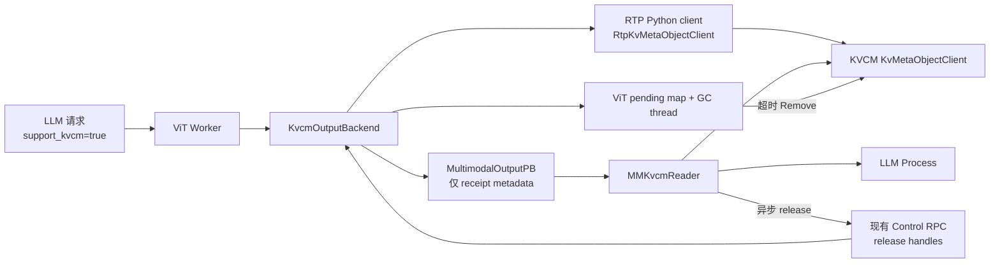
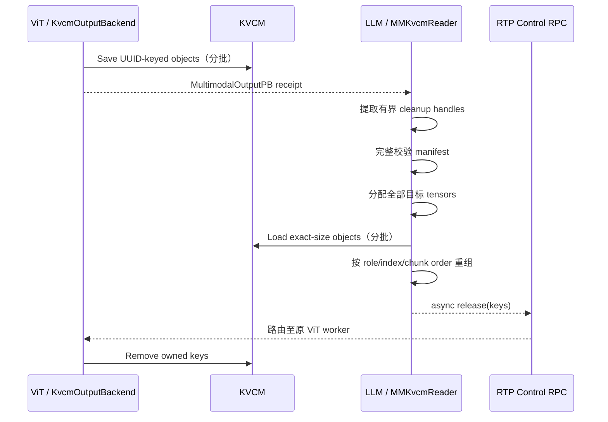

# RTP-LLM KVCM EMB 分离存储设计

## 1. 文档定位

本文描述 RTP-LLM 在 ViT/LLM 分离部署中，如何使用 KVCM KVMeta exact-size 对象 API 传输多模态
embedding、position id 和 extra input。

KVCM 的 metadata 状态机、HA、动态容量和数据面安全语义，以 KVCM 仓库
`docs/design/kv_meta_object_storage.md` 为准。本文只描述 RTP 的 tensor/receipt、生产与消费、release/GC 以及
配置接入。

当前实现使用 KVMeta V1：跨 batch 回滚和对象生命周期仍由 RTP receipt、pending map 与 KVCM V1 session 共同
管理。KVCM 总体设计中的 generation/cleanup ledger、可续约 read/write lease、异构批量 allocation 和
server-side object-set lease 是后续方案；在 client/server capability 明确协商前，RTP 不会推断或启用这些语义。

RTP 的 ViT producer 使用仓库内的 `RtpKvMetaObjectClient`，由它把 RTP 启动配置映射到 KVCM wheel 的通用
Python `KvMetaObjectClient`；LLM consumer 使用 C++ `MMKvcmReader`/`MMKvcmClient`。两端共享同一
KVMeta object 契约，RTP 生产链路不依赖 v6d。

## 2. 背景、目标与非目标

默认 gRPC multimodal transport 会把 tensor bytes 放在 RPC 中；RDMA transport 使用 ViT 进程持有的临时 slot。
KVCM 模式则把 tensor bytes 写成独立、可跨进程寻址的 KVMeta 对象，RPC receipt 只携带重建 tensor 所需的
metadata 和对象 key。

设计目标：

- 支持同一多模态结果中不同大小、不同角色的 tensor；
- 大 tensor 按第 0 维切片，并在 LLM 端无损重建；
- 写入、receipt 校验、读取和回收都有明确上限；
- 失败时不回退到 inline 或 RDMA，避免同一请求出现混合数据面；
- release 丢失时由 ViT 进程 GC 兜底；
- 默认构建和默认运行模式保持原 gRPC 行为，不加载 KVCM client、不启动 KVCM I/O 或对象 GC 线程。

非目标：

- 不把 KVCM 用作 RTP 的 KV cache connector；
- 不提供永久对象存储或跨 ViT 进程的持久 ownership registry；
- 不保证 worker 进程崩溃后仍能由本地 retry queue 回收对象；
- 不支持运行时从 KVCM 自动降级到其他 multimodal transport。

## 3. 总体架构



数据面和控制面职责：

- KVCM 保存 tensor bytes 和 exact size；
- `MultimodalOutputPB` 保存 key、shape、dtype、role、logical index、chunk 顺序和 `split_size`；
- 现有 RTP control RPC 把消费完成的 key 路由回原 ViT worker；
- ViT 侧 `_pending` ownership map 决定哪些 key 可以被该 worker release，并驱动 deadline GC。

### 3.1 组件职责

| 组件 | 职责 |
|---|---|
| `MMTransportConfig` / server args | 解析模式和大小上限，并从现有 `RECO_*` KVCM 配置派生 KVMeta client 配置，默认保持 `grpc` |
| `KvcmOutputBackend` | 校验 ViT 输出、拼接逻辑 tensor、切片、生成 UUID key、构造 receipt、维护 release/GC |
| RTP Python `RtpKvMetaObjectClient` | 接收一份 RTP `kvcm_config`，映射通用 client 参数，并负责 client 注册与生命周期 |
| KVCM Python `KvMetaObjectClient` | 将连续 torch tensor 转为 caller-owned pointer descriptor，并按 64 keys/4 GiB 分批 Save/Remove |
| `MMKvcmClientImpl` | LLM 侧 native object client，执行 Load/Remove 及对象边界校验 |
| `MMKvcmReader` | 广告 capability、完整校验 receipt、分配 tensor、Load、重组并触发 release |
| `GrpcMMControlClient` / `MMOutputProxyRouter` | 异步发送 release；经过多 worker proxy 时按原 ViT endpoint 路由，并施加共享 control deadline |
| KVCM `KvMetaObjectClient` | 编排 metadata transaction 与 exact-size storage I/O |

### 3.2 代码落点

| 层次 | 主要实现 |
|---|---|
| 配置模型与参数入口 | `rtp_llm/config/mm_kvcm_config.py`、`rtp_llm/cpp/config/MMKvcmConfig.h`、`rtp_llm/config/py_config_modules.py`、`server/server_args/vit_group_args.py` |
| receipt 协议 | `rtp_llm/cpp/model_rpc/proto/model_rpc_service.proto` |
| ViT producer 与回收 | `rtp_llm/multimodal/transport/kvcm/backend.py` |
| RTP Python client | `rtp_llm/multimodal/transport/kvcm/client.py` |
| transport 选择与 proxy 路由 | `rtp_llm/multimodal/transport/factory.py`、`transport/proxy_router.py` |
| 通用 Python object client | KVCM wheel：`kv_cache_manager/client/kv_meta_object_client.py` |
| LLM native client/reader | `rtp_llm/cpp/multimodal_processor/transport/kvcm/MMKvcmClient*`、`MMKvcmReader*` |
| 可选构建依赖 | `rtp_llm/cpp/multimodal_processor/transport/kvcm/BUILD`、`3rdparty/remote_kv_cache_manager/BUILD` |

Python producer、C++ reader 和 KVCM object client 各自重复校验自己信任边界内的数据；这些校验不是互相替代关系。

## 4. 双重显式启用与主链路隔离

KVCM 模式要求 LLM native reader 在构建时显式启用，并要求部署在运行时显式选择：

```text
build:   --define=use_kvcm_emb_storage=true
runtime: MM_TRANSPORT_MODE=kvcm
```

### 4.1 构建隔离

`rtp_llm/cpp/multimodal_processor/transport/kvcm/BUILD` 使用 Bazel `select`：

- 打开 flag 时为 LLM reader 编译 `MMKvcmClientKvcm.cc`，链接 KVCM client RPM 和 object-client headers；
- 默认编译 `MMKvcmClientStub.cc`，没有 KVCM 链接依赖；
- ViT Python 进程只在构造 `RtpKvMetaObjectClient` 时延迟导入 KVCM wheel，不再要求 RTP writer pybind。

因此普通 RTP build、KV cache connector 和默认 multimodal gRPC transport 不导入或初始化 KVCM Python client。

### 4.2 运行时隔离

- `MM_TRANSPORT_MODE` 默认是 `grpc`；
- ViT 选择 `kvcm` 但没有安装带 object API 的 KVCM wheel 时，创建 backend 立即报错；
- LLM build 未包含真实 KVCM reader 时不会广告 `support_kvcm`；
- LLM reader 只有在 object client 可用时才设置请求的 `support_kvcm=true`；
- ViT 在强制 `kvcm` 模式下收到未声明该 capability 的请求会失败；
- KVCM 写入或读取失败不尝试 inline/RDMA fallback。

## 5. Receipt 数据模型

KVCM 模式使用 `MultimodalOutputPB.output_kvcm_objects`。每个 `MMKvcmObjectPB` 表示一个物理 chunk：

| 字段 | 含义与约束 |
|---|---|
| `key` | 随机生成的 exact KVMeta key，也是 release handle；非空、唯一、最多 512 bytes |
| `value_size` | 物理对象真实字节数 |
| `tensor.shape` | chunk shape，1..16 维且每维为正 |
| `tensor.data_type` | `float32`、`int32`、`float16` 或 `bfloat16` |
| `tensor.offset` | KVCM 对象必须为 `0`，一个对象只描述一个完整 chunk |
| `tensor.nbytes` | 必须等于 `shape × dtype_width`，也必须等于 `value_size` |
| `role` | `EMBEDDING`、`POS_ID` 或 `EXTRA_INPUT` |
| `logical_index` | embedding/position 固定为 0；extra input 使用原图像下标 |

`split_size` 仍内联在 receipt 中，记录每个原始 embedding 的第 0 维行数。物理 chunk 按
`(role, logical_index)` 分组，并按 repeated-field 顺序拼接。

producer 按 `EMBEDDING -> POS_ID -> EXTRA_INPUT` 排列 role；extra input 的 `logical_index` 单调递增。每个
`split_size` 都是正 `int32`，其数量和 embedding 逻辑项数量均不超过 16384。

KVCM receipt 不能同时携带 inline tensor、RDMA slot 或其他数据面 payload；reader 会拒绝混合 receipt。

## 6. ViT 生产流程

backend 只需把启动阶段已经派生、校验并写入 `MMTransportConfig` 的配置交给 RTP client：

```python
from rtp_llm.multimodal.transport.kvcm import RtpKvMetaObjectClient

with RtpKvMetaObjectClient(transport_config.kvcm) as client:
    client.save(keys, tensors)
    client.remove(keys)
```

构造 client 时即完成通用配置校验和带 `kve_` 前缀 instance 的注册。业务调用方不再解析 `RECO_*`，
也不直接拼装 KVCM 通用 client 的连接、SDK 或超时参数；生产 backend 负责在异常路径和关闭路径回收 client。

### 6.1 写入前校验和布局

`KvcmOutputBackend` 在任何 KVCM mutation 前完成：

1. snapshot embeddings、position_ids 和 extra_input，防止调用方并发修改 list；
2. 要求至少一个 embedding，embedding 设备为 CPU/CUDA，所有 tensor 的 shape 维数和每维合法；
3. embeddings 之间必须具有相同 rank、trailing shape 和 device；position_ids 若存在，也必须在自身列表中满足
   相同条件，并与对应 embedding 的第 0 维行数一致；
4. position 数量与 embedding 数量一致；extra input 若存在，必须每个图像恰好一个非空一维 tensor；
5. 验证输入 dtype 及 concat 后的 promoted dtype、总 byte、预计 chunk 数和 receipt 上限；
6. 拼接所有 embeddings；position_ids 若存在也拼接；position_ids 和 extra input 都移动到 embedding device，
   extra input 仍保持每图一项；
7. 将 tensor 变为 contiguous，再按 `max_object_bytes` 切片。

大 tensor 只沿第 0 维切片。若单行 byte 数已经超过 `max_object_bytes`，请求在 storage mutation 前失败。

### 6.2 CUDA 同步

KVCM 接收裸 CUDA pointer，不继承 PyTorch stream dependency。backend 在第一次 metadata/data-plane 调用前，
对所有参与的 CUDA device 执行同步，保证 producer work 对 KVCM 可见。

### 6.3 写对象与构造 receipt

每个物理 chunk 使用新 UUID key。KVCM Python client 先完整校验逻辑调用，再按 service 上限分批：每批最多
64 个对象且总计不超过 4 GiB。一个 receipt 可以跨多个 KVCM 写事务。

通用 Python client 不会自动重试或回滚 mutation，因为通用 key 可能已经存在，且 transport failure 的结果可能
不确定。若后续 batch 失败，它向调用方报告 batch 位置；RTP backend 随即删除此前 batch 和当前不确定 batch 的
全部 key。因为这些 key 均为本 receipt 新生成，该回滚不会删除已有业务对象；删除失败会进入统一 cleanup/retry
流程，避免 KVMeta V1 无 TTL 时形成永久 metadata。

全部写入成功后构造 receipt，并把 key 以 monotonic deadline 登记到 `_pending`。如果 receipt 构造或登记失败，
同样进入删除重试流程，不向调用方发布不可回收结果。

## 7. LLM 消费流程



### 7.1 先验证、后 allocation/I/O

reader 在分配 tensor 或调用 KVCM 前验证整个 receipt：

- object 数、key 唯一性和顺序；
- role 与 logical index；
- shape、dtype、乘法溢出、`nbytes/value_size` 一致性；
- 每个对象和整个 receipt 的 byte 上限；
- embedding/position 总行数与 `split_size`；
- extra-input 下标连续且覆盖全部逻辑图像；
- receipt 没有混用其他数据面。

只有验证全部通过后才一次性分配目标 tensor。等待共享 object-client mutex 使用请求 deadline；每个 KVCM batch
开始前和返回后都检查剩余 budget，过期后不再准入下一批。已经准入的 batch 仍使用配置的 metadata/get timeout，
不可取消的 backend I/O 还会在返回前 drain，因此一次 batch 可以越过端到端 deadline，但不会写入已释放内存。

### 7.2 重组

- 所有 embedding chunks 拼接后按 `split_size` 重新 split；
- position chunks 拼接、转 CPU，并按相同 `split_size` split；
- extra-input chunks 按 `logical_index` 拼接，还原每个图像的一项输入。

成功后 reader 异步 release。无论 receipt 无效、超时、Load 失败或重组失败，`ObjectLease` 都会尝试释放已提取的
有界 handle；无法提取的恶意超长 tail 由 ViT deadline GC 兜底。

## 8. Release、GC 与关闭

### 8.1 Ownership

ViT backend 只删除仍存在于自身 `_pending` map 的 key。空值、超长、重复、非字符串或不属于当前 worker 的
release handle 会被过滤，不能借 control RPC 删除任意 KVCM 对象。

### 8.2 正常 release 与失败重试

LLM 通过既有 control RPC 将 handles 路由到产生 receipt 的 ViT endpoint。ViT 在 Remove 成功前始终让 owned key
留在 `_pending` 计账中，并用 in-flight 标记阻止 release/GC 重复删除；Remove 失败则清除 in-flight 标记并把 deadline
改为固定 1 秒后的重试时间。这样清理尚未确认成功的容量不会被新 transfer 抢占。retry cadence 与 object GC timeout
解耦，避免错误配置的短 GC timeout 形成忙循环。receipt key 是本次 transfer 新生成且不会复用的 UUID key，因此
同一 exact key 的 cleanup 重放不会命中新一代业务对象。失败日志只记录内部 reason、object count 和异常类型，
不输出 handle、endpoint 或 native provider 错误原文。

producer 在第一次 KVCM mutation 前，把本 receipt 的全部 key/size 原子加入本地 pending 账本；正在 Save 的对象也
计入总量。`MM_KVCM_MAX_PENDING_OBJECTS` 和 `MM_KVCM_MAX_PENDING_BYTES` 任一达到上限时，新 transfer 在写存储
前快速失败，不等待 GC，也不影响默认 gRPC transport。Save、receipt 构造或 Remove 失败都沿用同一份预建账本，
避免异常路径再分配 cleanup metadata 后失败。

`GrpcMMControlClient` 的异步 release 队列按 `(endpoint, handle)` 去重，进程级最多保留 1024 个待发送 handle；
单个合法 receipt 因此能装入一个原本为空的队列，但多个并发 receipt 仍可能让队列满。队列拒绝、RPC 失败或进程
退出都不会重放数据读取，遗留对象由 ViT deadline GC 回收。

请求经过多 worker ViT proxy 时，`MMOutputProxyRouter` 保存 `handle -> worker` 路由，TTL 为对应 object GC
时间再加 5 秒安全余量。相同 handle 若被不同 worker 同时声明，路由会 fail closed，不会把 release 发给任一方。
单次 release 最多处理 1024 个 handle，超出部分保留原 route 并由重试或 worker GC 收敛；unknown/expired/collision
按原因聚合计数和脱敏告警，避免恶意输入造成全量复制、逐 key 日志放大或泄露 endpoint/handle。

### 8.3 Deadline GC

`MM_KVCM_OBJECT_GC_TIMEOUT_MS` 从对象成功提交并登记 `_pending` 时开始计时。它必须覆盖 receipt 传递、LLM
完整校验/分配以及所有 KVCM Load batches。默认值为 180 秒，比默认 120 秒 multimodal request budget 多 60 秒。
增大请求 timeout 时必须同步增大 GC timeout，否则 ViT 可能在 LLM 仍读取时删除对象。

### 8.4 Shutdown

`close()`：

1. 关闭新 transfer/release 准入；
2. 等待正在执行的 transfer、release 和 GC remove；
3. 停止并 join GC thread；
4. 对剩余 `_pending` key 做一次 best-effort Remove；
5. 关闭由 factory 创建并持有的 KVCM Python client；测试或调用方显式注入的 writer 仍由注入方管理；
6. 标记 backend closed 并唤醒并发 close caller。

shutdown Remove 失败不会阻止 backend 进入 closed，也不会把 key 或 provider 原文写入日志；日志明确提示需要后续
namespace/backend orphan cleanup。完全 closed 后到达的内部 retry 会直接丢弃，不再调用 KVCM client，也不会
重新向已清空的 `_pending` 注入对象。

进程 crash 会丢失内存中的 pending/retry queue。生产环境仍需 namespace 轮换、KVCM Trim 或 backend orphan
reclaimer 等运维兜底，不能只依赖进程内 GC。

## 9. 限制与配置

### 9.1 固定协议上限

| 项目 | 上限 |
|---|---:|
| KVCM 单 batch | 64 objects / 4 GiB |
| 单 object | 1 GiB；可通过配置降低，不能提高 |
| 每 receipt 物理 objects | 1024 |
| 每 receipt 逻辑图像/`split_size` 项 | 16384 |
| tensor dimensions | 1..16 |
| object key | 512 bytes |
| instance id / group | 各 512 bytes |
| KVCM endpoints | 1..64 个唯一地址，每个 1024 bytes |
| KVCM `user_data` | 64 KiB |
| write timeout | 最大 1800 秒 |
| metadata call timeout | 最大 600000 ms |
| producer 全局 pending objects | 默认 65536，按部署容量配置为正整数 |
| producer 全局 pending bytes | 默认 64 GiB，按部署容量配置为正整数 |

1024 object 上限与共享 control client 的 pending-release capacity 对齐，使一个合法 receipt 在空队列中一定能够
进入异步 release。

### 9.2 运行配置

固定 block Meta client 与 EMB KVMeta client 连接同一 KVCM 主端口。RTP 优先读取已有的
`RECO_CLIENT_CONFIG`；该字段为空时，直接复用线上固定 block 路径已经使用的分字段 `RECO_*` 配置。
EMB 不再有第二套 endpoint、identity、SDK 或 timeout 环境变量：

| 环境变量 | 默认值 | 说明 |
|---|---:|---|
| `MM_TRANSPORT_MODE` | `grpc` | 启用时设为 `kvcm` |
| `RECO_CLIENT_CONFIG` | 空 | 可选的 KVCM client config map；非空时固定 block 与 EMB 都优先使用它 |
| `MM_KVCM_OBJECT_GC_TIMEOUT_MS` | `180000` | ViT 未收到 release 的兜底回收时间 |
| `MM_KVCM_MAX_OBJECT_BYTES` | `1 GiB` | 单物理 object 上限 |
| `MM_KVCM_MAX_RECEIPT_BYTES` | `8 GiB` | 单 receipt 总 tensor bytes 上限 |
| `MM_KVCM_MAX_PENDING_OBJECTS` | `65536` | ViT 进程未确认回收的 object 总数上限 |
| `MM_KVCM_MAX_PENDING_BYTES` | `64 GiB` | ViT 进程未确认回收的 object 总字节上限 |
| `MM_RDMA_RELEASE_TIMEOUT_MS` | `1000` | 历史命名；实际是所有 external transport 共用的 release RPC deadline |

分字段模式按以下关系复用现有配置：

| KVMeta 配置 | 现有 RTP 配置来源 |
|---|---|
| 服务发现 | `RECO_ENABLE_VIPSERVER` + `RECO_VIPSERVER_DOMAIN`，或 `RECO_SERVER_ADDRESS` |
| instance group | `kve_<RECO_INSTANCE_GROUP>` |
| instance id | `kve_<RECO_INSTANCE_ID_SALT>`；salt 为空时稳定回退为 `kve_<RECO_INSTANCE_GROUP>` |
| metadata timeout/retry | `RECO_META_CHANNEL_{RETRY_TIME,CONNECTION_TIMEOUT,CALL_TIMEOUT}` |
| SDK worker/queue | `RECO_STORAGE_THREAD_NUM`、`RECO_STORAGE_QUEUE_SIZE` |
| data timeout | `RECO_PUT_TIMEOUT_MS`、`RECO_GET_TIMEOUT_MS` |
| backend SDK | `RECO_MODEL_SDK_CONFIG` |
| registration user data | `RECO_MODEL_USER_DATA` |

固定 block 自动配置模式的最终 instance id 要到 C++ 初始化阶段才结合模型和 cache 拓扑生成。KVMeta 不重算、
不回写该值，避免让 EMB 启动影响主链路；它只使用上表中已经存在且能保证 E/P/D 一致的稳定身份输入。
`TAIR_MEMPOOL_KMONITOR_SINK_ADDRESS`、`KVCM_LOG_LEVEL` 等 SDK/进程级环境变量由原 KVCM 组件直接读取，
RTP 不复制也不改写。

当 `RECO_CLIENT_CONFIG` 非空时，它是一个 client config map。KVMeta 选择规则与旧 data-plane client 保持
可验证的一致性：

- map 有空 key 时选择空 key 对应项；旧 C++ `std::map::begin()` 也必然选择该项；
- 没有空 key 时只允许 map 中恰好有一项；多个非空 key 会拒绝启动，避免 Python 与 C++ 选择不同实例；

RTP 从显式 map 或分字段配置构造独立的内部 transfer JSON，不修改或回写固定 block 配置：

| 字段 | KVMeta 派生值 |
|---|---|
| `instance_group` | 显式 map 为 `kve_<原 instance_group>`；分字段模式见上表 |
| `instance_id` | 显式 map 为 `kve_<原 instance_id>`；分字段模式见上表 |
| `address` | 原静态 endpoints；VIPServer 模式在启动时解析为同一服务的静态 endpoint snapshot |
| `sdk_config` | 原样复用；分字段模式由现有 thread/queue/timeout/backend 字段构造 |
| `model_deployment` | 显式 map 原样复用；分字段模式使用 KVCM KVMeta 的固定 opaque-object 描述 |
| `block_size` | `1`，仅为 exact-object schema marker |
| `location_spec_infos` | `{"value": 1}` |
| `location_spec_groups` | `{}` |

生成后的 transfer JSON 保证：

- `instance_id`/`instance_group` 与 metadata 配置一致；
- `block_size=1`；
- 只有 `location_spec_infos={"value": 1}`，没有 location spec groups；
- `sdk_config.queue_size >= 64`；
- 满足
  `write_timeout_seconds * 1000 > put_timeout_ms + 3 * call_timeout_ms`。

`call_timeout_ms` 取对应的 metadata call timeout。`write_timeout_seconds` 没有第二个环境变量，
按上述严格不等式自动取最小整数秒，并保证至少 30 秒、最多 1800 秒；无法满足时启动失败。

旧的 `MM_KVCM_ADDRESSES`、`MM_KVCM_INSTANCE_ID`、`MM_KVCM_INSTANCE_GROUP`、`MM_KVCM_USER_DATA`、
`MM_KVCM_TRANSFER_CLIENT_CONFIG`、`MM_KVCM_CALL_TIMEOUT_MS` 和 `MM_KVCM_WRITE_TIMEOUT_SECONDS` 已移除。
在 `kvcm` 模式下残留这些环境变量会显式报错，防止误以为覆盖生效；默认 grpc/rdma 模式不读取或校验它们。

marker `1` 不表示实际对象长度，真实 byte 数来自 receipt 和每次 KVCM request。

`MM_KVCM_MAX_RECEIPT_BYTES` 必须不小于 `MM_KVCM_MAX_OBJECT_BYTES`；两端还必须把相同的 KVCM 配置传入
ViT writer 和 LLM reader，否则可能在一端写入后被另一端按不同上限拒绝。

## 10. Backend 与部署约束

- ViT Python 环境必须安装包含 `kv_cache_manager.client.KvMetaObjectClient` 与 native binding 的
  `kvcm_py_client` wheel；
- LLM 必须使用导出 `KvMetaObjectClient` 和 `kv_meta_{client,object_client,transfer_client}.h` 的 KVCM client RPM；
- 启用 build flag 时，RTP 依赖解析所选的 KVCM RPM 必须包含上述 headers 和 client library；缺失时应在构建期
  失败。未启用 flag 的普通 LLM 构建始终选择无依赖 stub；
- KVCM server 必须设置 `kvcm.kv_meta.enabled=true`；KVMeta 与固定 block MetaService 共用
  `kvcm.service.rpc_port`，通过 protobuf service 全名区分路由；
- 遗留非零 `kvcm.kv_meta.rpc_port` 会被新版 KVCM fail closed；升级时必须迁移服务端 flag，并让现有
  `RECO_VIPSERVER_DOMAIN` / `RECO_SERVER_ADDRESS`（或显式 `RECO_CLIENT_CONFIG.address`）指向主 RPC 端口；
- KVCM 中必须同时存在旧 Meta 使用的 `<原 instance_group>` 和 KVMeta 使用的
  `kve_<原 instance_group>`；两种 proto 共用端口但不能混用 Instance Group；
- Python/C++ object client 在创建时先校验 transfer config，再调用 KVMeta `RegisterInstance`；关闭 client
  只释放本地资源，不显式注销 KVCM 中可复用的 instance registry；
- KVMeta V1 不会在 native data-plane drain 期间自动续约 write/read lease；backend 的硬 I/O 上限必须小于配置的
  write lease，ViT GC timeout 也必须覆盖最慢 LLM Load；
- RTP 当前没有向 KVCM object client 提供 registered memory span，因此 transfer JSON 不能选择要求该 registration
  的 Mooncake 配置；
- KVMeta V1 删除 metadata 后调用 backend Delete，但实际物理回收遵循 backend 行为。例如当前开源 NFS Delete
  为幂等 no-op，需要独立 orphan 清理。

### 10.1 推荐部署顺序

1. 在 KVCM 配置中设置 `kvcm.kv_meta.enabled=true`，让现有 VIPServer domain / server address 指向
   `kvcm.service.rpc_port`；已有 group 为 `<group>` 时，预先创建只包含 KVMeta instance 的 `kve_<group>`；
2. 准备与 KVCM server 协议匹配、包含 object API 的 client RPM 和 `kvcm_py_client` wheel；
3. 在 ViT Python 环境安装 wheel，并用 `--define=use_kvcm_emb_storage=true` 构建包含 native reader 的 LLM；
4. 保持 ViT 和 LLM 两端现有 `RECO_*` KVCM 配置一致，按容量按需覆盖 `MM_KVCM_*` policy 上限，再设置
   `MM_TRANSPORT_MODE=kvcm`；不需要新增 EMB 专用 KVCM client 变量；
5. 先用 CPU 小对象验证 write -> receipt -> load -> release，再验证目标 CUDA/backend 配置；
6. 观察 ViT pending/GC 与 KVCM capacity，确认正常 release 后 metadata 收敛，并配置进程 crash 后的 orphan
   运维策略。

若线上已经使用分字段配置，最小增量只有 transport 开关，例如：

```text
RECO_ENABLE_VIPSERVER=1
RECO_VIPSERVER_DOMAIN=kvcm-na130-m3-bailian-grpc-2.vipserver
RECO_INSTANCE_GROUP=pace_group_m3
RECO_PUT_TIMEOUT_MS=100000
RECO_GET_TIMEOUT_MS=100000
RECO_MODEL_SDK_CONFIG=[{"type":"pace","sdk_log_file_path":"logs/pace_client.log","sdk_log_level":"INFO"}]
MM_TRANSPORT_MODE=kvcm
```

这会派生 `instance_group=kve_pace_group_m3`、`instance_id=kve_pace_group_m3`；SDK thread/queue 和 metadata
timeout 使用 RTP 既有默认值。显式配置了 `RECO_INSTANCE_ID_SALT` 时，instance id 改为
`kve_<RECO_INSTANCE_ID_SALT>`。

需要完整覆盖时仍可使用下面的 `RECO_CLIENT_CONFIG` 骨架。这里填写固定 block 的原始 group/id；RTP 会派生
`kve_epd`/`kve_epd-model` 和 exact-object marker。空 `sdk_backend_configs` 会保留 KVCM client 的编译时默认值，
需要 mountpoint、凭据或其他 backend 参数时必须显式覆盖：

```json
{
  "": {
    "enable_vipserver": false,
    "vipserver_domain": "",
    "address": ["127.0.0.1:19001"],
    "instance_group": "epd",
    "instance_id": "epd-model",
    "block_size": 128,
    "location_spec_infos": {"tp0": 4096},
    "location_spec_groups": {},
    "meta_channel_config": {
      "retry_time": 3,
      "connection_timeout": 6000,
      "call_timeout": 3000
    },
    "sdk_config": {
      "thread_num": 8,
      "queue_size": 64,
      "sdk_backend_configs": [],
      "timeout_config": {
        "get_timeout_ms": 10000,
        "put_timeout_ms": 10000
      }
    },
    "model_deployment": {
      "model_name": "model",
      "dtype": "fp16",
      "use_mla": false,
      "tp_size": 1,
      "dp_size": 1,
      "pp_size": 1,
      "extra": "",
      "user_data": ""
    }
  }
}
```

上例按 `put_timeout_ms=10000` 和 `call_timeout=3000` 自动得到 30 秒 write lease。若共享 timeout 超出
KVMeta 上限或无法在 1800 秒内满足预算，RTP 在注册 instance 之前拒绝启动。

## 11. 测试分层

| 测试 | 覆盖范围 |
|---|---|
| `mm_kvcm_config_test.py` | 显式 map 优先级、线上分字段 RECO 配置复用、`kve_` 身份派生、严格 JSON/UTF-8/地址/VIPServer/timeout 校验、旧变量拒绝、失败原子性和 grpc 主链路隔离 |
| `mm_output_transport_test.py` | 使用 fake writer 覆盖 Python producer 的 receipt、切片、rollback、release、GC、shutdown races、in-flight/全局 pending 容量、post-close retry、日志脱敏和输入上限；另覆盖 factory → packaged-client contract → output metrics → release/close 组合链路，以及默认 gRPC 不导入 KVCM/RDMA 可选模块的主链路隔离 |
| `MMKvcmTransportTest` / `MMKvcmNativeClientTest` | C++ reader、manifest/reassembly、真实分片字节与 receipt 顺序、deadline/release 失败、client 配置、对象和分批边界，以及首个 provider mutation 前完整预构建所有 service batches |
| `mm_kvcm_cross_repo_integration_test.py` | 分字段 RECO/PACE config → `kve_` 派生 → RTP transport factory/`MMOutputTransport` → KVCM wheel object client 注册；同时用旧 Meta proto 在同一 KVCM 主端口注册固定块实例，再验证 EMB write/load/release/GC 和变长 payload 字节，并检查全部 listener/recovery/停机状态及 ERROR/FATAL/Sanitizer 日志 |

跨仓测试执行生产 factory、`KvcmOutputBackend.create`、`MMOutputTransport`、proxy release router 和 KVCM Python
client，但不执行 C++ reader；reader 的同一 receipt/object 契约由内容级 C++ UT 覆盖。完整 RTP 进程、GPU tensor
和内部 TairMempool/PACE 仍必须在 KVCM-enabled RTP build image 及仓库标准 CI 环境验证。

跨仓 target 带 `manual` tag，不进入默认 wildcard 测试。执行 Bazel target 时必须遵循 RTP 仓库要求，通过
`/test-execution` skill 运行，并显式提供：

```text
RTP_KVCM_RUN_INTEGRATION=1
RTP_KVCM_SOURCE_ROOT=/path/to/KVCacheManager/github-opensource
PYTHONPATH=<已安装或解包 kvcm_py_client wheel 的目录>:...
```
