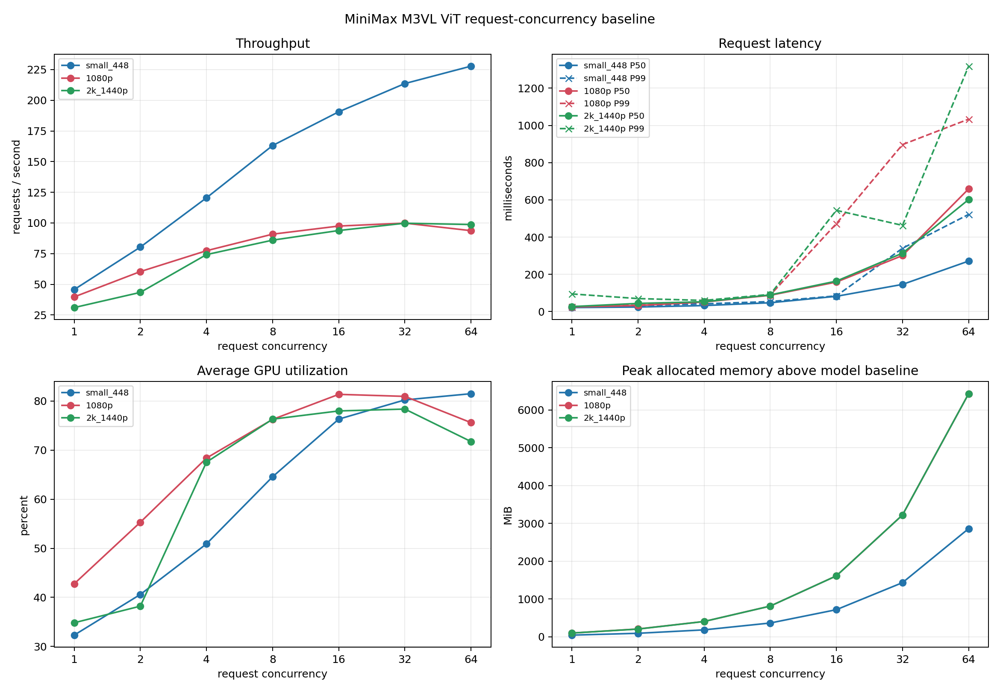
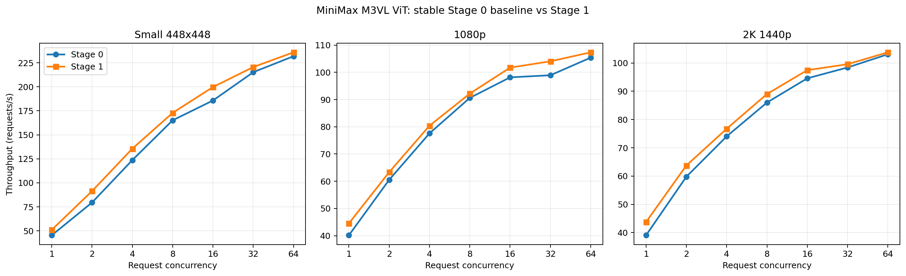
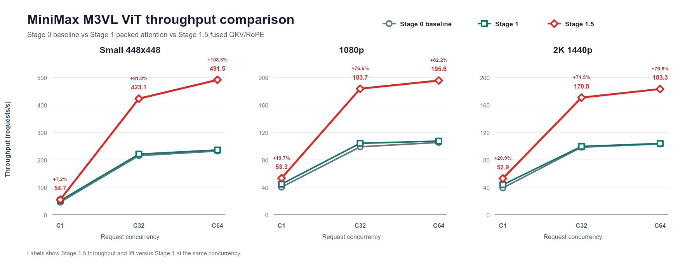
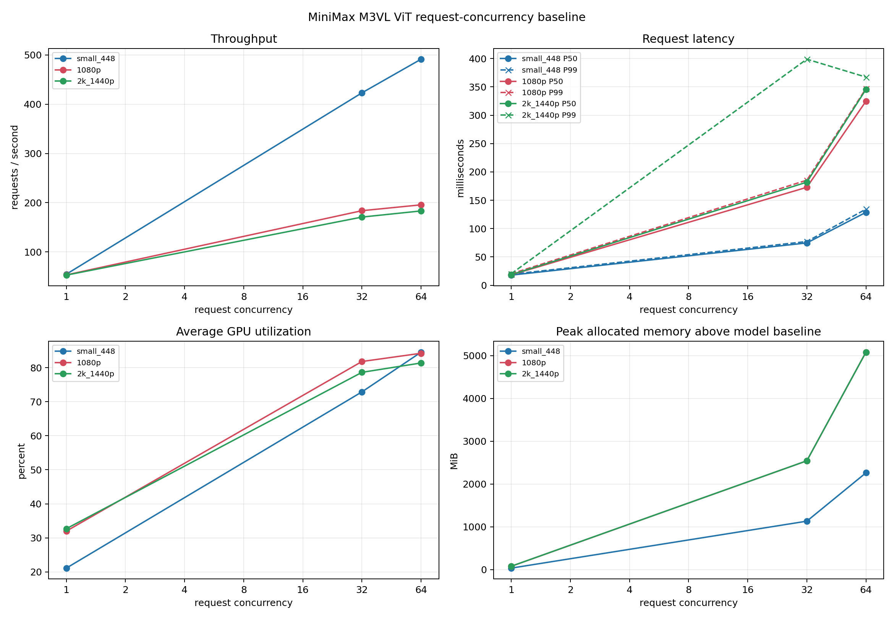
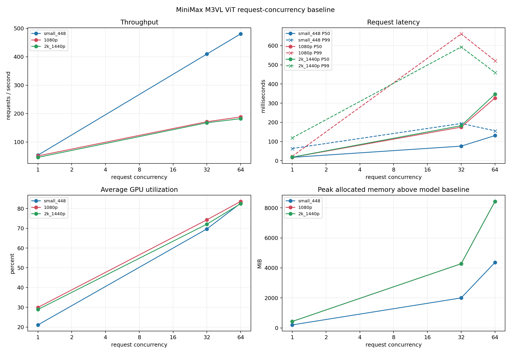
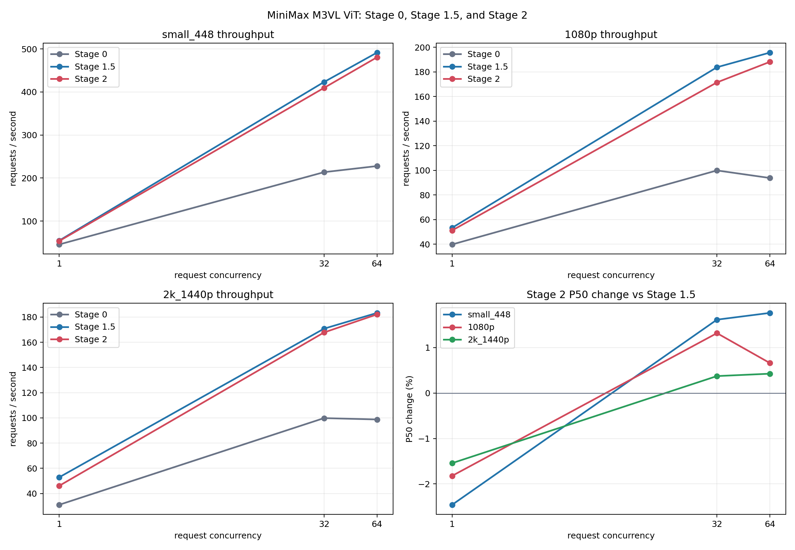

# Multimodal ViT Optimization and Refactor Plan

Date: 2026-07-16

[中文版](multimodal_vit_optimization_refactor_plan_zh.md)

Maintenance note: keep the English and Chinese versions synchronized whenever
the plan, implementation status, benchmark data, or conclusions change.

Research baseline:

- RTP-LLM: `feat/minimax_m3_0707` at `e7906add5a5120017449cf78f5b13c98ecf5b5b4`
- SGLang: main at `a798a2aeea9b3e4267c91246bfc9fe9024d1a5e5`
- vLLM: main at `dc9f845`

This document records the current RTP-LLM multimodal ViT pipeline, the relevant
SGLang and vLLM designs, and a staged refactor plan. It is intended to be used
as a reference during implementation and review rather than as a claim that all
listed changes must land together.

## 1. Goals

The primary target is MiniMax M3VL under large-image and high-concurrency
workloads, while keeping the design reusable by other multimodal models.

The refactor should:

1. increase ViT throughput and reduce P95/P99 queueing latency;
2. avoid OOM and head-of-line blocking when media costs vary substantially;
3. overlap media loading, CPU preprocessing, GPU transforms, ViT execution, and
   remote transfer where dependencies permit;
4. preserve independent ViT deployment, gRPC fallback, and RDMA transport;
5. keep model-specific formulas and kernels behind generic interfaces;
6. avoid adding external configuration unless automatic derivation is not
   reliable;
7. maintain output ordering, cache correctness, cancellation, and timeout
   semantics.

## 2. Non-Goals

- Do not redesign the OpenAI or DashScope request protocol.
- Do not change image or video validation limits as part of this work.
- Do not require all multimodal models to implement optimized batching at once.
- Do not replace the existing RDMA path before measurements show a transport
  bottleneck.
- Do not introduce a universal pixel-to-token formula. Tokenization and patch
  compression are model-specific.
- Do not combine kernel, scheduler, pipeline, cache, and routing changes in one
  commit.

## 3. Current RTP-LLM Pipeline

Relevant modules:

| Area | Main files |
| --- | --- |
| ViT process and startup | `rtp_llm/multimodal/vit_start_server.py` |
| Preprocessing and embedding | `rtp_llm/multimodal/mm_process_engine.py` |
| GPU batching | `rtp_llm/multimodal/mm_scheduler.py` |
| ViT RPC server/proxy | `rtp_llm/server/vit_rpc_server.py`, `rtp_llm/server/vit_proxy_server.py` |
| ViT deployment arguments | `rtp_llm/server/server_args/vit_group_args.py` |
| M3VL integration | `rtp_llm/multimodal/multimodal_mixins/minimax_m3_vl/` |
| C++ multimodal bridge | `rtp_llm/cpp/multimodal_processor/` |

Current high-level flow:


### 3.1 Existing strengths

- `VIT_SEPARATION` supports local, role-based, and remote ViT execution.
- The remote path supports gRPC and GPUDirect RDMA with fallback behavior.
- M3VL provides a real cross-request GPU batch override instead of the generic
  one-item-at-a-time fallback.
- In-flight cache misses are deduplicated by key.
- Multi-worker routing and FlexLB integration provide a deployment foundation
  for independent ViT scaling.

### 3.2 Current bottlenecks

#### Scheduling and batching

- The scheduler uses a fixed wait window plus request-count and media-count
  limits. A 224x224 image and a large multi-frame video consume the same one-item
  quota despite very different compute and memory costs.
- One background scheduler queue serializes GPU batch construction and forward
  execution.
- There is no patch/token budget, shape bucket, deadline-aware packing, or OOM
  batch split/retry.
- An oversized single request is rejected instead of being split into bounded
  sub-batches.

#### Pipeline concurrency

- `mm_embedding_impl` submits preprocessing work, waits for all preprocessing
  results, and only then submits GPU work. A slow download or decode blocks media
  that are already ready.
- Async cache misses can create one daemon thread per item, so admission is not
  bounded by a shared in-flight budget.
- Download/decode, CPU transforms, result sending, and GPU submission are not
  modeled as explicit pipeline stages with independent limits.
- Error handling may invoke `torch.cuda.empty_cache()` and `gc.collect()` in a
  request path, which can amplify tail latency under repeated failures.

#### M3VL kernels

- M3VL ViT attention uses separate Q, K, and V projections.
- Segment boundaries are converted to host lists and processed in a Python loop.
- Each image or video segment invokes SDPA separately instead of one packed
  variable-length attention operation.
- GPU resize, normalization, temporal padding, and folding are performed per
  media item before concatenation, producing avoidable launches and allocations.
- Mean and standard-deviation tensors are recreated rather than retained as
  device buffers.

#### Cache, hash, and routing

- The local embedding cache is primarily item-count based rather than byte- or
  token-budget based.
- Cache identity is URL-oriented and does not fully encode raw content, model
  revision, and weight epoch.
- Prefix feature hashing copies the complete embedding to CPU before computing
  one hash per `1 x hidden` row.
- `least_connections` routing measures active RPC count, not queued patches,
  predicted work, cache affinity, or available GPU memory.
- Proxy status/cache reporting is not yet a complete scheduling signal.

## 4. External Implementations

### 4.1 SGLang

SGLang has a complete Encoder-Prefill-Decode deployment model. Encoder-only and
language-only instances can be scaled independently. Encoder output transfer can
use ZMQ or Mooncake, and Mooncake can also provide a cross-instance multimodal
embedding cache.

Useful implementation points:

- dynamic encoder discovery and health handling;
- separate media loading, preprocessing, and result-sending executors;
- independent encoder service and multiple transfer backends;
- cross-request encoder batching;
- encoder data parallelism that replicates ViT weights and shards media inputs;
- MiniMax M3VL fused QKV and packed variable-length vision attention;
- FA3/FA4, Triton, FlashInfer cuDNN, and SDPA backend selection;
- compiled M3VL RoPE application;
- Triton GPU tensor hashing that avoids a complete tensor D2H copy;
- local byte-budget cache and optional global embedding cache.

Limitations relevant to this plan:

- multi-encoder distribution is not consistently patch/FLOP and cache aware;
- encoder batching still has request/item-count limits in important paths;
- video cross-request batching has more constraints than image batching.

References:

- [EPD disaggregation](https://github.com/sgl-project/sglang/blob/main/docs_new/docs/advanced_features/epd_disaggregation.mdx)
- [Multimodal encoder data parallelism](https://github.com/sgl-project/sglang/blob/main/docs_new/docs/advanced_features/dp_for_multi_modal_encoder.mdx)
- [MiniMax M3VL vision implementation](https://github.com/sgl-project/sglang/blob/main/python/sglang/srt/models/minimax_vl_common.py)
- [Vision attention backends](https://github.com/sgl-project/sglang/blob/main/python/sglang/srt/layers/attention/vision.py)
- [GPU tensor hash](https://github.com/sgl-project/sglang/blob/main/python/sglang/kernels/ops/memory/gpu_tensor_hash.py)

### 4.2 vLLM

vLLM integrates multimodal encoder scheduling into its main request scheduler.
The scheduler tracks encoder compute budget, encoder-output cache capacity, and
the position at which each multimodal placeholder is needed. It schedules an
encoder item only when required by the current token window and when both compute
and cache capacity are available.

Useful implementation points:

- model-aware maximum encoder-token calculation with dummy-input fallback;
- encoder cache management at individual media-item granularity;
- cross-request media collection grouped by modality before encoder execution;
- batch-level ViT DP with patch-count-aware load balancing;
- selectable ViT attention backend and optional FP8 cuDNN attention;
- multimodal processor cache and shared-memory IPC cache;
- ViT CUDA Graph capture at multiple token budgets;
- greedy runtime packing into the smallest fitting graph budget;
- eager fallback when an item cannot fit a captured graph;
- image and video CUDA Graph support for opted-in models.

The independent encoder design exists, but its official documentation currently
describes `ExampleConnector` as the reference pathway. RTP-LLM should therefore
reuse its scheduling ideas without replacing the existing remote ViT transport
with that reference implementation.

References:

- [Disaggregated encoder](https://github.com/vllm-project/vllm/blob/main/docs/features/disagg_encoder.md)
- [Encoder budget](https://github.com/vllm-project/vllm/blob/main/vllm/multimodal/encoder_budget.py)
- [Encoder cache manager](https://github.com/vllm-project/vllm/blob/main/vllm/v1/core/encoder_cache_manager.py)
- [Multimodal optimization](https://github.com/vllm-project/vllm/blob/main/docs/configuration/optimization.md)
- [Vision encoder CUDA Graphs](https://github.com/vllm-project/vllm/blob/main/docs/design/cuda_graphs_multimodal.md)

## 5. Target Architecture

```mermaid
flowchart LR
  A[Request media] --> B[Bounded load/decode stage]
  B --> C[Bounded CPU preprocess stage]
  C --> D[Ready-item completion queue]
  D --> E[Model cost estimation]
  E --> F[Cost-aware GPU scheduler]
  F --> G[Shape/cost bucket and batch packing]
  G --> H[Packed GPU transform]
  H --> I[Fused QKV and varlen ViT]
  I --> J[GPU row hash]
  I --> K[Embedding cache or RDMA/gRPC]
  J --> L[Compact token hash D2H]
  K --> M[Request result aggregation]
  L --> M
  M --> N[Restore original request/media order]
```



Core invariants:

1. Media results are returned in original request order regardless of internal
   completion or packing order.
2. A cache key identifies content, preprocessing semantics, model revision, and
   output layout, not only a URL.
3. Every queue has an explicit item or cost bound.
4. Cancellation and timeout remove queued work and release owned buffers.
5. Batch failure is isolated or retried at a smaller granularity when possible.
6. A model that does not implement optimized batching continues to use the
   existing generic fallback.
7. Local, gRPC, and RDMA modes produce equivalent embeddings and metadata.

## 6. Generic Cost Interface

There is no formula that can infer encoder cost for every model from image width
and height alone. Dynamic tiling, temporal patching, token compression, spatial
merge, and learned pruning all change the relationship.

The generic scheduler should consume a model-provided description:

```python
@dataclass(frozen=True)
class MultimodalWorkEstimate:
    encoder_input_tokens: int
    encoder_output_tokens: int
    estimated_workspace_bytes: int
    modality: str
    shape_bucket: tuple[int, ...]

class MultimodalModelInterface:
    def estimate_work(self, preprocess_result) -> MultimodalWorkEstimate:
        ...
```

For M3VL, the post-preprocess estimate can be exact using target height/width,
frame count, spatial patch size, temporal patch size, and merge size. Before
preprocessing, only a conservative estimate should be used for CPU admission.
The exact estimate should control GPU batching.

Budget selection should be automatic:

1. profile representative model-generated dummy media during startup;
2. derive a safe patch/token and workspace budget from available ViT memory;
3. retain existing request/media limits as safety caps;
4. expose a new override only if production evidence shows auto-profiling is
   insufficient.

## 7. Staged Implementation

Each stage should be independently reviewable, benchmarkable, and revertible.

### Stage 0: Observability and baseline

Scope:

- add timings for download, decode, CPU preprocessing, queue wait, H2D, GPU
  transform, ViT forward, hashing, and transport;
- record request count, media count, input patches, output tokens, estimated
  workspace, and actual batch composition;
- record queue depth in both item and patch/token units;
- add cache hit/miss, scheduler split, eager fallback, OOM retry, and RDMA
  fallback counters.

Likely files:

- `rtp_llm/multimodal/mm_process_engine.py`
- `rtp_llm/multimodal/mm_scheduler.py`
- `rtp_llm/server/vit_rpc_server.py`
- `rtp_llm/server/vit_proxy_server.py`

Acceptance:

- no embedding or response behavior change;
- per-stage metrics reconcile with end-to-end ViT latency;
- metrics identify queueing versus preprocessing, forward, and transport costs.

#### Standard MiniMax M3VL ViT baseline protocol

The Stage 0 performance baseline uses
`benchmark/multimodal_m3_vit_concurrency.py`. It isolates the ViT service core
path:

```text
decoded CPU RGB -> MMScheduler -> H2D -> GPU transform -> batched ViT
-> image-token assembly -> CUDA completion
```

Download, image decode, RPC transport, cache hits, and LLM prefill are excluded.
This makes the result suitable for comparing scheduler, GPU preprocessing, and
ViT kernel changes. A separate service-level benchmark is still required for
end-to-end latency.

The standard matrix and controls are:

- image inputs: 448x448, 1920x1080, and 2560x1440;
- one image per request;
- request concurrency: 1, 2, 4, 8, 16, 32, and 64;
- fixed high-concurrency comparison point: C32;
- maximum throughput: highest selected result in the C1-C64 sweep with request
  and media batch caps both set to 64;
- at least 128 requests, four scheduling waves, and 10 seconds per repetition;
- three repetitions per point, selecting the complete run with median
  throughput while retaining all repetitions in JSON;
- three warmup batches before every repetition and CUDA synchronization at
  request completion;
- five seconds of idle time before each repetition;
- at startup, every GPU must use at most 4 GiB; during measurement, every
  non-target GPU must stay below 4 GiB and 50% utilization;
- a repetition is discarded and retried when another GPU violates the
  utilization or memory gate.

RT is measured from scheduler submission until the embedding is CUDA-complete.
GPU utilization comes from 50 ms NVML sampling. Memory is reported as both the
PyTorch peak allocated-memory increase above the loaded-model baseline and the
absolute/delta NVML device-memory watermark.

With one image per request, request concurrency equals candidate image
concurrency when neither batch cap truncates it. It does not guarantee that the
scheduler forms a batch of that size: arrival skew and the 10 ms batch window
can produce smaller batches. A single request containing multiple images is a
different workload because request admission, preprocessing, cache, timeout,
and result aggregation are shared.

#### Baseline result: stable rerun on 2026-07-28

Environment:

- RTP-LLM isolated detached worktree pinned to commit
  `94e6274409edbc5d811944ff463d1fa251eb2211`;
- the baseline used a uniquely named Bazel target so shared Bazel output
  runfiles could not resolve to the Stage 1 working tree;
- host `e01-cn-cf04s46t801`, target GPU 7, NVIDIA L20D;
- PyTorch `2.11.0+cu130`, CUDA `13.0`;
- checkpoint `/data2/xieshui.yyx/MiniMax-M3-MXFP8`, with real visual weights
  loaded;
- segmented SDPA, matching the Stage 0 implementation;
- 63 valid repetitions and 13 automatically discarded repetitions; every
  retained repetition has zero external-busy samples.

M3VL preprocessing maps the three raw inputs as follows:

| Case | Raw input | ViT input | Input patches | Output tokens |
| --- | ---: | ---: | ---: | ---: |
| Small | 448x448 | 448x448 | 1,024 | 258 |
| 1080p | 1920x1080 | 896x504 | 2,304 | 578 |
| 2K | 2560x1440 | 896x504 | 2,304 | 578 |

Performance results use the selected median-throughput repetition:

| Case | C1 RT P50 / P99 | C32 RT P50 / P99 | C32 throughput | Sweep maximum |
| --- | ---: | ---: | ---: | ---: |
| Small | 21.5 / 23.7 ms | 145.9 / 339.9 ms | 213.7 req/s | 227.8 req/s at C64 |
| 1080p | 24.6 / 26.9 ms | 300.9 / 896.8 ms | 99.9 req/s | 99.9 req/s at C32 |
| 2K | 26.8 / 94.8 ms | 313.7 / 463.0 ms | 99.8 req/s | 99.8 req/s at C32 |

Resource results report PyTorch peak allocated-memory growth above the loaded
model and the absolute NVML peak:

| Case | C32 GPU avg | C32 memory delta / NVML peak | C64 GPU avg | C64 memory delta / NVML peak |
| --- | ---: | ---: | ---: | ---: |
| Small | 80.2% | 1.40 / 6.31 GiB | 81.5% | 2.79 / 9.18 GiB |
| 1080p | 81.0% | 3.15 / 9.95 GiB | 75.6% | 6.28 / 16.34 GiB |
| 2K | 78.4% | 3.15 / 9.95 GiB | 71.7% | 6.28 / 16.36 GiB |



Artifacts:

- [selected baseline CSV](assets/multimodal_vit_baseline/m3_vit_baseline_94e627440.csv)
- [metadata and all repetitions](assets/multimodal_vit_baseline/m3_vit_baseline_94e627440.json)
- [four-panel line chart](assets/multimodal_vit_baseline/m3_vit_baseline_94e627440.png)

Observations:

- Throughput is close to its configured-cap plateau by C32. Moving to C64
  changes selected throughput by +6.6% for Small, -6.1% for 1080p, and -1.1%
  for 2K, while approximately doubling P50 RT.
- 1080p and 2K have the same ViT patch/token load after resize and therefore
  similar throughput. The remaining difference comes from the larger raw RGB
  transfer and resize work in the measured path.
- Actual average batch size reached 32 images at C32 for all cases. At C64 it
  reached 64 for Small and 2K and 61.7 for 1080p. Candidate image concurrency
  still equals request concurrency in this one-image-per-request workload.
- Peak memory grows approximately linearly with image concurrency. This
  supports replacing item-count-only admission with an explicit patch/token and
  workspace budget.
- Throughput repetitions are stable, while high-concurrency P99 remains
  sensitive to host/runtime stalls even with zero external-busy samples. Future
  comparisons must use the same repetition-selection rule and inspect all
  repetitions in JSON rather than comparing one short run.

### Stage 1: M3VL packed variable-length attention

Scope:

- replace separate Q/K/V projections with a fused QKV projection;
- update checkpoint loading to merge existing Q/K/V weights without changing
  checkpoint format;
- execute all packed segments using one variable-length attention call per
  layer;
- compute `max_seqlen` once per encoder forward;
- compile or fuse the M3VL RoPE application where numerically safe;
- benchmark FA4 and FlashInfer cuDNN on B300, with SDPA retained as fallback;
- keep backend selection internal unless an existing generic backend option can
  be reused.

Likely files:

- `rtp_llm/multimodal/multimodal_mixins/minimax_m3_vl/minimax_m3_vl_vit.py`
- M3VL vision weight-loading code in the same module tree
- shared vision-attention utilities if the implementation is reusable

Acceptance:

- image, video, and mixed batches match the current implementation within the
  agreed BF16/FP16 tolerance;
- segment isolation remains correct for variable sequence lengths;
- the existing M3VL smoke test passes in local and separated ViT modes;
- profiling shows removal of per-segment SDPA launches and per-layer boundary
  D2H synchronization.

#### Stage 1 implementation result: 2026-07-27

Implemented:

- fused each layer's Q/K/V projections into one `qkv_proj`;
- added an M3VL deploy-weight loader that concatenates the published Q/K/V
  tensors without changing the checkpoint;
- computes segment offsets, `cu_seqlens`, and `max_seqlen` once per vision
  forward and reuses one packed-attention plan for all 32 layers;
- uses FA4 on supported SM90/SM100/SM110 devices, FlashAttention on supported
  SM8x/SM9x devices, FlashInfer ragged attention where available, and segmented
  SDPA as the fallback;
- retains one 128 MiB FlashInfer workspace per vision model and uses the
  `cute-dsl` backend because the automatic backend produced invalid values for
  M3VL head dimension 80 in this CUDA13 environment;
- completes the CUDA13 dependency lock with the fixed FlashAttention 4 wheel
  required by the FA4 import path;
- keeps `grid_thw` on CPU until the one-time attention metadata construction,
  removing the prior per-layer boundary D2H synchronization;
- added a CUDA13 Bazel benchmark entry so performance runs use the same locked
  Torch, FlashInfer, and Cutlass versions as tests and production binaries.

Validation:

- focused CUDA13 Bazel tests pass, including fused/unfused equivalence, segment
  isolation, metadata construction, checkpoint mapping, deploy-time
  concatenation, packed-versus-SDPA BF16 tolerance, and a representative
  2,204-token sequence reused across 32 layers;
- the separated-ViT M3VL smoke served all four image, video, multi-image, and
  mixed requests without a ViT runtime error;
- the smoke target still reports failure because its stored golden responses
  are stale: all four actual responses are non-empty and valid, while three
  golden entries are empty and the first has different token counts/text;
- the LLM context path on this host requires
  `RTP_LLM_CP_PREFILL_FA4=0` because its separate FA4 code path rejects the
  host's reported SM capability. This is unrelated to M3VL vision attention.

The Stage 1 performance matrix used the same three image sizes, C1-C64 sweep,
128-request minimum, three repetitions, and median-throughput selection as the
Stage 0 baseline. The selected comparisons are:

| Case | C1 throughput / delta | C32 throughput / delta | C64 throughput / delta | C32 P50 delta |
| --- | ---: | ---: | ---: | ---: |
| Small | 50.1 req/s / +10.5% | 220.1 req/s / +2.3% | 227.8 req/s / -1.8% | -1.2% |
| 1080p | 44.0 req/s / +9.5% | 103.8 req/s / +5.0% | 106.4 req/s / +0.9% | -0.0% |
| 2K | 43.7 req/s / +12.0% | 100.9 req/s / +2.5% | 103.3 req/s / +0.2% | -0.4% |

PyTorch peak allocated-memory growth is effectively unchanged: the difference
from Stage 0 is within 2 MiB at every selected C1/C8/C16/C32/C64 point. This
indicates the throughput gain comes from projection/attention execution rather
than increased batch memory.

This run is directional rather than a clean acceptance result. GPU 7 was the
target and had no visible competing process, but the host reported 1,502
external-busy samples on other GPUs and stale absolute NVML memory accounting.
P50 and throughput trends are consistent across repetitions; P99 is not used as
an acceptance signal for this run. A later idle-gated rerun is recorded below.

##### Idle-gated Stage 1 rerun: 2026-07-27

The Stage 1 rerun kept the Stage 0 request matrix and selection rule and did not
use `--allow-busy-gpu`. Each accepted repetition started after a five-second
idle window, and a repetition would be discarded if a non-target GPU exceeded
50% utilization. The comparison below uses the isolated, strict 4 GiB Stage 0
baseline recorded above.

Twenty of the 21 matrix points completed all three repetitions before another
distributed workload occupied all eight GPUs. The final 2K C64 point has one
clean repetition and is marked provisional.

| Case | C1 Stage 0 -> Stage 1 | C32 Stage 0 -> Stage 1 | C64 Stage 0 -> Stage 1 | C32 P50 |
| --- | ---: | ---: | ---: | ---: |
| Small | 45.34 -> 51.01 req/s (+12.5%) | 215.18 -> 220.55 req/s (+2.5%) | 231.84 -> 235.89 req/s (+1.7%) | 145.4 -> 142.8 ms (-1.8%) |
| 1080p | 40.15 -> 44.52 req/s (+10.9%) | 98.94 -> 104.05 req/s (+5.2%) | 105.40 -> 107.35 req/s (+1.8%) | 301.5 -> 300.0 ms (-0.5%) |
| 2K | 39.04 -> 43.72 req/s (+12.0%) | 98.40 -> 99.56 req/s (+1.2%) | 103.07 -> 103.76 req/s (+0.7%, one repetition) | 313.9 -> 313.6 ms (-0.1%) |

The clean comparison shows a 10.9%-12.5% gain at C1 and a 1.2%-5.2% gain at
C32. The maximum-throughput point improves by 1.7%-1.8% for the two fully
repeated C64 cases. Peak allocated-memory growth remains on the same curve as
Stage 0: approximately 1.4 GiB for Small C32, 3.1 GiB for 1080p/2K C32, and
2.8/6.3 GiB at C64. The optimization therefore improves compute throughput
without materially increasing the concurrency-dependent memory footprint.

P99 is still not an acceptance metric. Some accepted high-concurrency
repetitions contain host/runtime long tails even though external GPU
utilization remained zero. C32 P50 is stable or modestly lower in all three
image cases.



Artifacts:

- [selected Stage 1 CSV](assets/multimodal_vit_stage1/m3_vit_baseline_94e627440.csv)
- [Stage 1 metadata and all repetitions](assets/multimodal_vit_stage1/m3_vit_baseline_94e627440.json)
- [Stage 1 four-panel line chart](assets/multimodal_vit_stage1/m3_vit_baseline_94e627440.png)
- [Stage 0 versus Stage 1 chart](assets/multimodal_vit_stage1/m3_vit_stage1_vs_baseline_94e627440.png)

#### Stage 1.5: fused QKV unpack and RoPE

The fused linear produces `[sequence, 3, heads, head_dim]`. Its Q/K/V views
have a token stride of `3 * hidden_size`, while FlashInfer requires dense NHD
inputs. The eager RoPE path happens to make Q and K dense, but V still requires
a D2D `contiguous()` copy. It also launches separate cast, rotate, multiply,
add, concatenate, and copy kernels in every vision layer.

Stage 1.5 adds one Triton kernel that:

- reads the strided fused-QKV output directly;
- applies the M3VL half-rotation RoPE to Q and K in FP32;
- copies the non-rotary Q/K channels and V;
- writes one allocation laid out as `[3, sequence, heads, head_dim]`, whose
  three views are dense NHD tensors accepted directly by FlashInfer;
- falls back to the previous eager implementation when Triton or the target
  device is unavailable.

The CUDA13 test covers the real M3VL `head_dim=80`, `rot_dim=78` shape, checks
BF16 numerical agreement with eager RoPE, requires exact V agreement, verifies
that Q/K/V are contiguous, and runs packed attention across a representative
2,204-token sequence.

Kernel-only CUDA-event measurements on one idle L20D are:

| Total input patches | Eager RoPE + V copy | Fused kernel | Speedup |
| ---: | ---: | ---: | ---: |
| 1,024 | 0.108 ms | 0.028 ms | 3.9x |
| 2,304 | 0.178 ms | 0.027 ms | 6.5x |
| 32,768 | 1.972 ms | 0.194 ms | 10.2x |
| 73,728 | 4.332 ms | 0.429 ms | 10.1x |

An initial C1/C32/C64 matrix selected segmented SDPA instead of the Stage 1
FlashInfer backend. The added fallback diagnostics traced this to a mixed
environment: Bazel supplied FlashInfer 0.6.12 while the host user site injected
`flashinfer-cubin` 0.6.11. The acceptance run therefore used
`PYTHONNOUSERSITE=1`. Its metadata reports `attention_backends=["flashinfer"]`
and no backend errors.

The formal run used the same host, GPU, model, 128-request minimum, 10-second
minimum point duration, three repetitions, 10 ms batch window, and
median-throughput selection as the Stage 1 rerun. All 27 repetitions completed,
with zero discarded repetitions and zero external-busy samples.

| Case | C1 Stage 1 -> Stage 1.5 | C32 Stage 1 -> Stage 1.5 | C64 Stage 1 -> Stage 1.5 | C32 P50 |
| --- | ---: | ---: | ---: | ---: |
| Small | 51.01 -> 54.69 req/s (+7.2%) | 220.55 -> 423.12 req/s (+91.8%) | 235.89 -> 491.47 req/s (+108.3%) | 142.8 -> 74.7 ms (-47.7%) |
| 1080p | 44.52 -> 53.29 req/s (+19.7%) | 104.05 -> 183.73 req/s (+76.6%) | 107.35 -> 195.64 req/s (+82.2%) | 300.0 -> 172.9 ms (-42.4%) |
| 2K | 43.72 -> 52.85 req/s (+20.9%) | 99.56 -> 170.76 req/s (+71.5%) | 103.76 -> 183.26 req/s (+76.6%) | 313.6 -> 181.9 ms (-42.0%) |

Selected resource measurements are:

| Case | C32 GPU avg | C32 allocated delta / NVML peak | C64 GPU avg | C64 allocated delta / NVML peak |
| --- | ---: | ---: | ---: | ---: |
| Small | 72.9% | 1.10 / 6.13 GiB | 84.5% | 2.21 / 8.59 GiB |
| 1080p | 81.8% | 2.48 / 9.26 GiB | 84.2% | 4.96 / 14.79 GiB |
| 2K | 78.6% | 2.48 / 9.12 GiB | 81.4% | 4.96 / 14.84 GiB |

The gain grows with packed sequence length because the eager RoPE/copy cost is
paid in every one of the 32 vision layers. At C32, the fused kernel removes
approximately 57 ms of kernel work for Small and 124 ms for 1080p/2K, matching
the observed P50 reductions. Peak allocated-memory growth is about 21% lower at
C32 and C64 because the eager Q/K transformations and V materialization no
longer coexist as separate temporaries.

The larger raw 2K RGB input remains slower than 1080p even though both resize to
the same 2,304-patch ViT input; raw transfer and resize are included in this
benchmark. Two selected repetitions contain isolated P99 host/runtime stalls,
but throughput and P50 are stable and no repetition met the external-busy
discard condition.





Artifacts:

- [selected Stage 1.5 CSV](assets/multimodal_vit_stage15/m3_vit_baseline_ce519225d.csv)
- [Stage 1.5 metadata and all repetitions](assets/multimodal_vit_stage15/m3_vit_baseline_ce519225d.json)
- [baseline versus Stage 1 and Stage 1.5 chart](assets/multimodal_vit_stage15/m3_vit_stage15_vs_baseline_ce519225d.png)
- [Stage 1.5 four-panel line chart](assets/multimodal_vit_stage15/m3_vit_baseline_ce519225d.png)

### Stage 2: Cost-aware batching

Scope:

- add the internal work-estimate interface;
- implement exact post-preprocess M3VL patch/token estimation;
- replace media-count-only admission with patch/token and workspace budgets;
- retain request/media limits as hard safety caps;
- group compatible modality and shape buckets without violating FIFO fairness;
- split an oversized request into bounded sub-batches;
- on OOM, retry by bisecting the batch and report a terminal failure only when
  a single item cannot execute;
- preserve result ordering across sub-batches.

Likely files:

- `rtp_llm/multimodal/mm_scheduler.py`
- `rtp_llm/multimodal/mm_process_engine.py`
- `rtp_llm/multimodal/multimodal_mixins/minimax_m3_vl/minimax_m3_vl_mixin.py`
- generic multimodal interfaces

Acceptance:

- mixed small/large media do not exceed the profiled budget;
- a large request can make progress through sub-batches;
- no starvation under a continuous stream of small requests;
- batch composition metrics explain every admission or split decision;
- P99 does not regress at low concurrency while high-concurrency throughput
  improves relative to fixed item-count batching.

#### Pre-embedding work estimation

The exact M3VL estimate is available after CPU preprocessing and before
`embedding()` or `batched_embedding()`. The current preprocess result already
contains `(raw, target_hw, timestamp_token_ids)`, so estimation does not need
GPU resize/fold, patch embedding, ViT, projector, or output embeddings.

For `F` decoded/sampled frames:

```text
grid_t = ceil(F / temporal_patch_size)
grid_h = target_h / patch_size
grid_w = target_w / patch_size
input_patches = grid_t * grid_h * grid_w
vit_tokens = input_patches / spatial_merge_size^2
```

The final assembled length is exact as well:

```text
image_output_tokens = vit_tokens + 2
video_output_tokens =
    vit_tokens + sum(timestamp_token_lengths) + 2 * grid_t
```

The two extra image tokens are the start/end image embeddings. Video adds one
start/end pair per temporal group. `target_hw` is already aligned by
`smart_resize` or `get_hw_multiple_of`, sampled frame count is `raw.shape[0]`,
and timestamp token IDs are already materialized by video preprocessing.

`grid_thw` therefore has two distinct length meanings:

- before spatial merge, `sum(grid_t * grid_h * grid_w)` is the exact number of
  ViT input rows;
- after `patch_merge_mlp`, the exact ViT feature-row count is that value divided
  by `spatial_merge_size**2`.

For an image, grid plus `spatial_merge_size` is sufficient to determine the
final embedding length by adding the two image boundary embeddings. For a
video, grid alone is not sufficient: the final result also contains the actual
tokenized timestamp prefix for every temporal group. The estimate must use
`sum(len(ids) for ids in timestamp_token_ids)` rather than assume a constant
timestamp length. `vision_segment_max_frames` only splits a grid into attention
segments and preserves the sum of `grid_t`, so it does not change either token
count.

The current implementation creates `grid_thw` inside `_gpu_fold()`, which is
called by `embedding()`. Stage 2 should not call `_gpu_fold()` early. It can
reproduce the same grid exactly on CPU from the already available `target_hw`,
sampled-frame count, `patch_size`, and `temporal_patch_size`, then attach that
estimate before scheduler submission.

The generic interface should carry model-specific estimates rather than impose
a universal pixel formula:

```text
MMWorkEstimate(
    input_patches,
    output_tokens,
    max_attention_segment,
    attention_work,
    estimated_workspace_bytes,
)
```

M3VL computes these fields from the formulas above. The scheduler only consumes
the fields and remains model-independent. Initially, admission can use
`input_patches` and `output_tokens`; workspace coefficients should come from
the existing benchmark data rather than new environment variables.

For remote URLs, an exact estimate is impossible before reading dimensions and,
for video, sampling metadata. The intended pipeline is therefore two-stage:

1. apply file/media-count safety limits before download and decode;
2. compute the exact model-specific estimate after preprocessing, attach it to
   `MMWorkItem`, then submit it to the GPU scheduler.

#### Implementation status: 2026-07-28

The current worktree, based on `feat/minimax_m3_0718` at `0dabfdf0a`,
implements the core Stage 2 scheduling path:

- The generic layer defines an immutable `MMWorkEstimate` carrying input
  patches, output tokens, estimated workspace, maximum attention segment, and
  attention work. Addition sums aggregate fields and takes the maximum segment;
  the scheduler contains no M3VL-specific formula.
- The generic multimodal interface adds `estimate_work()` and
  `get_batch_work_budget()`. Both return `None` by default, so models that have
  not opted in retain media-count batching, the whole-request limit, and
  whole-batch OOM failure behavior.
- `MMProcessEngine` attaches an estimate after CPU preprocessing and before GPU
  scheduler submission. Cache hits are neither re-estimated nor re-executed.
- M3VL derives exact image/video patch and token counts from
  `(raw, target_hw, timestamp_token_ids)` and validates patch/merge alignment
  and timestamp-group count. Workspace currently uses a conservative
  activation model equivalent to 40 KiB per BF16 patch.
- M3VL derives its work budget from the existing `gpu_max_batch_images` and a
  672x672 reference image. No environment variable or server argument was
  added. Serial mode continues without a cost budget.
- Opted-in models pack against both media count and work budget. Oversized
  multi-work-item requests split at work-item boundaries. After each chunk,
  the next chunk goes to the queue tail, allowing waiting small requests to
  progress while preserving original result order.
- CUDA OOM handling first bisects request chunks and then bisects work items
  inside a single request chunk. A request fails only when an indivisible item
  still OOMs. Successful forwards log media, patch, token, workspace, and
  latency composition; proactive splits and OOM retries log their reason.
- Work items created directly by the benchmark also carry estimates, and the
  benchmark now runs a real-weight mixed-resolution batch correctness check by
  default.
- The homogeneous one-work-item hot path constructs its chunk directly,
  compares budget fields without temporary estimate objects, and skips
  recomputing batch composition when INFO logging is disabled. This recovered
  full C32/C64 batches in the formal acceptance run without changing admission
  behavior.

Compatibility boundaries:

- Cost-aware scheduling activates only when the model returns a non-null
  budget. Models other than M3VL retain their previous behavior.
- The generic scheduler can split only at work-item boundaries. A single long
  video is not a generic splittable unit; it runs alone and preserves a real
  OOM if it cannot fit.
- M3VL packed variable-length attention is verified with mixed grids, so no
  shape bucket was added for this path. A generic compatibility/shape key,
  startup memory profiling, and a budget derived from live free memory remain
  future work.

Validation results:

| Validation | Result |
| --- | --- |
| `//rtp_llm/multimodal/test:mm_scheduler_test` | Passed; covers legacy fallback, cost admission, fair large-request chunking, and cross-request/in-request OOM bisection |
| `//rtp_llm/multimodal/test:multimodal_process_engine_test` | Passed |
| `//rtp_llm/multimodal/test:minimax_m3_vl_vit_test` | Passed; covers exact image/video estimates, budget derivation, and CUDA ViT |
| Three-resolution quick run | 448 produced 1,024 patches/258 tokens; 1080p and 2K each produced 2,304 patches/578 tokens; every C8 point formed actual batches of eight |
| Mixed-batch correctness | 448, 1080p, and 2K ran in one packed batch; each embedding matched its standalone BF16 reference, with exact position IDs and original order |
| Independent-ViT M3VL smoke | Generated content exactly matched the golden; the test failed only because current usage reports 553 image tokens while the old golden expects 551. Stage 2 reads this length and does not modify embeddings or usage |

The quick run used one repetition while an independent baseline job occupied
GPU 7, so it remains a functional check only.

#### Stage 2 performance acceptance: 2026-07-28

The formal run used the same host, physical GPU 7, real checkpoint, workload,
timing, and median-selection rules as Stage 1.5. Because earlier CUDA jobs left
inactive driver memory accounting above 4 GiB, the non-target idle-memory gate
was 16 GiB; the 50% utilization gate and automatic retry remained enabled. It
tested C1/C32/C64 for all three image sizes with three repetitions per point.
Twenty-seven retained repetitions completed with zero external-busy samples.
One additional 2K C64 repetition was automatically discarded after recording
78 external-busy samples while an independent smoke test started.

Stage 2 throughput against the stable Stage 0 rerun and Stage 1.5 is:

| Case | C1 Stage 0 -> Stage 2 | C32 Stage 0 -> Stage 2 | C64 Stage 0 -> Stage 2 | Stage 2 vs Stage 1.5 at C1 / C32 / C64 |
| --- | ---: | ---: | ---: | ---: |
| Small | 45.71 -> 53.66 req/s (+17.4%) | 213.65 -> 409.49 req/s (+91.7%) | 227.83 -> 480.56 req/s (+110.9%) | -1.9% / -3.2% / -2.2% |
| 1080p | 39.74 -> 51.12 req/s (+28.6%) | 99.87 -> 171.41 req/s (+71.6%) | 93.73 -> 188.12 req/s (+100.7%) | -4.1% / -6.7% / -3.8% |
| 2K | 31.04 -> 46.08 req/s (+48.5%) | 99.80 -> 167.75 req/s (+68.1%) | 98.72 -> 182.09 req/s (+84.4%) | -12.8% / -1.8% / -0.6% |

Selected Stage 2 latency and scheduler composition are:

| Case | C1 P50 / P99 | C32 P50 / P99 | C64 P50 / P99 | C32 / C64 average batch |
| --- | ---: | ---: | ---: | ---: |
| Small | 17.5 / 63.7 ms | 75.9 / 194.1 ms | 131.0 / 155.9 ms | 32.0 / 63.7 |
| 1080p | 18.1 / 22.8 ms | 175.1 / 661.7 ms | 326.9 / 521.7 ms | 32.0 / 64.0 |
| 2K | 18.5 / 118.9 ms | 182.6 / 593.3 ms | 347.0 / 460.0 ms | 32.0 / 64.0 |

Stage 2 P50 differs from Stage 1.5 by only -2.5% to +1.8% across all nine
points. The 2K C1 throughput delta is caused by isolated host/runtime stalls:
its selected P50 is 18.5 ms versus 18.8 ms in Stage 1.5, while all
repetitions remain available in JSON. Full C32/C64 batches confirm that the
M3VL work budget does not unnecessarily split these homogeneous workloads.

Selected resource measurements are:

| Case | C32 GPU avg | C32 allocated delta / NVML peak | C64 GPU avg | C64 allocated delta / NVML peak |
| --- | ---: | ---: | ---: | ---: |
| Small | 69.7% | 1.95 / 6.13 GiB | 82.7% | 4.26 / 9.22 GiB |
| 1080p | 74.3% | 4.18 / 18.64 GiB | 83.6% | 8.23 / 15.58 GiB |
| 2K | 72.1% | 4.18 / 9.22 GiB | 82.5% | 8.23 / 14.79 GiB |

The PyTorch allocated peaks are stable across repetitions. The selected 1080p
C32 NVML watermark is a driver-accounting outlier: the other two repetitions
peaked near 9.2 GiB while allocated memory stayed between 3.91 and 4.24 GiB.
The Stage 2 scheduler estimate itself is CPU metadata and allocates no GPU
memory. This branch also contains post-Stage-1.5 M3VL QKV packing changes, so
its higher allocated peak versus Stage 1.5 must not be attributed to
cost-aware admission without a kernel-level A/B.





Artifacts:

- [selected Stage 2 CSV](assets/multimodal_vit_stage2/m3_vit_baseline_0dabfdf0a.csv)
- [Stage 2 metadata and all repetitions](assets/multimodal_vit_stage2/m3_vit_baseline_0dabfdf0a.json)
- [Stage 2 four-panel line chart](assets/multimodal_vit_stage2/m3_vit_baseline_0dabfdf0a.png)
- [Stage 0 / Stage 1.5 / Stage 2 comparison CSV](assets/multimodal_vit_stage2/m3_vit_stage2_vs_baseline_0dabfdf0a.csv)
- [Stage 0 / Stage 1.5 / Stage 2 comparison chart](assets/multimodal_vit_stage2/m3_vit_stage2_vs_baseline_0dabfdf0a.png)

### Stage 3: Streaming preprocess-to-GPU pipeline

Status on 2026-07-29: skipped. The current request contract still waits for all
media embeddings, and the measured workload does not justify the orchestration
complexity. Revisit only if production data shows cross-request head-of-line
blocking or material CPU/decode-to-GPU overlap that Stage 2 cannot exploit.

Scope:

- submit each completed preprocess result to the GPU scheduler immediately;
- separate loading/decode from CPU transforms with bounded executors;
- replace per-miss daemon threads with shared bounded task execution;
- use a completion queue and request-level result aggregator;
- propagate timeout and cancellation through all stages;
- add patch/token backpressure between preprocessing and GPU queues;
- remove unconditional global CUDA cache clearing and GC from common error
  paths; reserve it for classified OOM recovery if measurements justify it.

Likely files:

- `rtp_llm/multimodal/mm_process_engine.py`
- `rtp_llm/multimodal/mm_scheduler.py`
- async request/cache support utilities

Acceptance:

- a slow media download does not block ready media from other requests;
- queue sizes remain bounded at sustained concurrency;
- request order and per-request media order remain correct;
- cancellation releases queue entries, futures, and GPU/RDMA buffers;
- no result mixing under concurrent repeated and unique images.

### Stage 4: GPU row-wise embedding hash

Scope:

- implement one deterministic 64-bit hash per contiguous `1 x hidden` row;
- perform hashing on GPU with Triton or CUDA;
- transfer only the compact hash vector to CPU;
- use an explicit CUDA event or stream dependency;
- preserve the current CPU implementation as fallback and comparison oracle;
- document whether hashes are required to match across processes or machines.

RTP-LLM currently only requires stable hashes within the relevant prefix-cache
domain. Cross-machine equality should not be imposed unless a distributed cache
contract later requires it.

Likely files:

- `rtp_llm/cpp/multimodal_processor/MultimodalProcessor.cc`
- `rtp_llm/cpp/multimodal_processor/MultimodalProcessor.h`
- a new CUDA/Triton hash implementation and tests

Acceptance:

- exactly one hash is produced per multimodal output row;
- identical rows hash identically and changed rows are detected by tests;
- prefix-cache behavior remains correct;
- profiling confirms removal of the full embedding D2H copy.

#### Stage 4 implementation result: 2026-07-29

The CUDA path is implemented in
`rtp_llm/cpp/multimodal_processor/FeatureHashKernel.cu` with shared
CPU/GPU hash primitives in `FeatureHash.h`:

- one CUDA block hashes one contiguous embedding row;
- the row fingerprint is 64-bit internally and is folded on GPU to the existing
  `int32` expanded-token contract;
- the kernel, compact D2H copy, and synchronization all use the current PyTorch
  CUDA stream;
- CUDA transfers only one 4-byte key per row; CPU and non-CUDA tensors use the
  matching deterministic CPU fallback;
- the new hash intentionally replaces the old implementation-defined
  `std::hash<string_view>` value. During a rolling binary upgrade this can only
  cause prefix-cache misses between versions, not incorrect cache hits.

Correctness coverage in `MultimodalProcessorTest.cc` verifies identical and
changed rows, CPU/GPU equality, non-contiguous input, a 13-byte tail row, and a
realistic `553 x 4096` BF16 tensor. The CUDA13/SM10x test target passes, and the
independent-ViT M3VL smoke passes in 406.5 seconds.

Nsight Systems on the realistic tensor reports:

| Metric | Result |
|---|---:|
| Full BF16 embedding size | 4,530,176 bytes |
| New D2H hash-vector size | 2,212 bytes |
| D2H reduction | 2,048x / 99.95% |
| GPU hash kernel time | 5.6 us |

The profile therefore confirms that the CUDA path no longer copies the full
embedding to CPU for prefix-cache token generation.

### Stage 5: Cache and multi-worker routing

Scope:

- change local embedding-cache capacity from item count to bytes or output
  tokens;
- include raw content identity, complete preprocessing configuration, model
  revision, and weight epoch in cache identity;
- retain in-flight miss deduplication;
- report queued patches/tokens, estimated completion debt, available memory, and
  cache summary from each ViT worker;
- route by predicted completion time with cache affinity, not only active RPCs;
- make AsyncSubmit/Get/Release routing sticky for the lifetime of a work item;
- evaluate a distributed embedding cache only for workloads with measured media
  reuse across workers.

Acceptance:

- cache eviction is proportional to actual memory usage;
- model reload invalidates stale embeddings;
- no lookup is sent to a different worker from the worker that owns submitted
  state;
- load tests show balanced patch debt and no cache-affinity routing loops.

### Stage 6: CUDA Graph and GPU preprocessing follow-ups

Scope:

- retain mean/std as registered device buffers;
- preallocate packed pixel buffers where shape information permits;
- batch or fuse resize/normalize/pad/fold only after profiling identifies those
  operations as material;
- capture ViT graphs at automatically generated token budgets;
- greedily pack runtime items into the smallest fitting graph budget;
- use eager execution for unsupported shapes or data-dependent pruning;
- track graph hit/miss and padding overhead.

This stage should follow the attention and scheduler work. Capturing the current
per-segment implementation would preserve avoidable launch and synchronization
overhead and make later refactoring harder.

#### Stage 6 implementation result: 2026-08-04

The first implementation is deliberately conservative. It is enabled by
default, but captures only workloads that showed a benefit without changing
packed-attention isolation semantics:

- mean/std are registered FP32 device buffers reused across requests;
- `batched_embedding` allocates one exact-size packed BF16 pixel buffer from
  `estimate_work`, and resize/normalize/fold writes directly into its slices;
- the bounded CUDA Graph cache keys on the complete grid, shape, dtype, and
  device, captures the second occurrence, keeps at most four entries, and
  supports FA4, FlashAttention, and FlashInfer;
- FlashInfer graph wrappers, indptr buffers, and plans are prepared outside
  capture; unsupported backends and capture failures fall back to eager;
- graph execution is limited to one segment and at most 4096 input patches.
  Dynamic packed batches remain eager because profiling showed graph I/O copies
  offsetting launch savings, and padding across grids cannot yet preserve media
  segment isolation safely;
- hit, miss, capture, fallback, and padding-ratio metrics were added. Exact-grid
  entries have a padding ratio of zero. The benchmark supports
  `--enable-cuda-graph` and `--no-enable-cuda-graph` and records graph counters
  per point.

Correctness coverage includes old/new fold-layout equivalence, direct packed
slice writes, normalization-buffer reuse, graph-safe attention context versus
eager, cross-stream replay isolation, and the packed-batch eager guard. The
complete CUDA13 / SM10x `minimax_m3_vl_vit_test` passed in 54.1 seconds.

The final comparison uses five repetitions per point and selects the coherent
median-RPS repetition. All selected repetitions report
`external_busy_samples=0`. GPU utilization is the sampled average and memory is
PyTorch peak allocated memory, which excludes unrelated resident allocations:

| Image | C | Stage 2 P50 | Stage 6 P50 | Stage 2 RPS | Stage 6 RPS | GPU util S2 -> S6 | Peak MiB S2 -> S6 | Graph behavior |
|---|---:|---:|---:|---:|---:|---:|---:|---|
| 448x448 | 1 | 18.11 ms | 14.67 ms | 48.70 | 65.26 | 23.5% -> 27.3% | 2019 -> 2003 | exact-shape hits |
| 448x448 | 32 | 89.71 ms | 87.90 ms | 344.75 | 353.12 | 77.2% -> 78.7% | 3986 -> 3835 | packed eager; single-item tails hit |
| 448x448 | 64 | 161.32 ms | 158.93 ms | 380.66 | 391.45 | 82.6% -> 84.9% | 6650 -> 6208 | packed eager; single-item tails hit |
| 1080p | 1 | 19.47 ms | 16.73 ms | 46.81 | 57.88 | 35.9% -> 33.0% | 2246 -> 2257 | exact-shape hits |
| 1080p | 32 | 206.00 ms | 174.50 ms | 148.66 | 179.17 | 81.7% -> 78.7% | 6337 -> 6010 | packed eager |
| 1080p | 64 | 400.06 ms | 328.59 ms | 152.39 | 187.79 | 80.7% -> 82.6% | 10501 -> 10367 | packed eager |
| 2K | 1 | 19.71 ms | 17.18 ms | 43.42 | 56.89 | 34.0% -> 33.4% | 2244 -> 2301 | exact-shape hits |
| 2K | 32 | 224.98 ms | 186.63 ms | 129.58 | 166.53 | 68.9% -> 74.4% | 6318 -> 5983 | packed eager |
| 2K | 64 | 415.95 ms | 350.35 ms | 144.87 | 175.88 | 77.6% -> 77.0% | 10596 -> 9914 | packed eager |

Exact-shape single-image graphs improve throughput by 23.66%-34.01% and reduce
P50 by 12.85%-18.98%. For 1080p and 2K packed batches, direct writes into one
BF16 destination improve throughput by 20.52%-28.51%, reduce P50 by
15.29%-17.87%, and reduce peak memory at concurrency 32/64. The 448x448 packed
path is already compute-bound and improves by 2.43%-2.83%. Automatic token-
budget padding remains deferred: padding only by total token count would change
per-media attention boundaries and could mix image features.

## 8. Multi-GPU and Multi-Worker Strategy

Two forms of parallelism must remain distinct:

1. Service-level horizontal scaling: one independent ViT worker per GPU, routed
   by the frontend/proxy.
2. Batch-level encoder DP: one ViT service spans multiple GPUs, each rank holds
   full ViT weights and processes a subset of media.

For the existing independent-worker deployment, improve service routing first.
Batch-level encoder DP is useful when one ViT instance is intentionally bound to
multiple GPUs or must align with an LLM TP group. Its assignment should use
patch/token cost and greedy load balancing rather than media count. It should
not be introduced where the required all-gather costs more than independent
worker routing.

## 9. Transport Plan

The current RDMA implementation is an asset and should be optimized
incrementally:

1. measure registration, allocation, serialization, transfer, and release time;
2. retain inline gRPC bytes as a correctness and failure fallback;
3. introduce persistent registered send and landing-buffer pools if request-level
   registration or allocation is material;
4. suballocate slots and reuse them only after explicit consumer completion;
5. preserve inflight limits, slot GC, timeout, and release idempotency;
6. avoid copying or splitting received tensors when a safe zero-copy view is
   possible.

## 10. Test and Benchmark Matrix

### Correctness

- image-only, video-only, and mixed image/video requests;
- one and many media items per request;
- repeated URL/content, unique content, and concurrent duplicate cache misses;
- variable image resolutions and aspect ratios;
- variable video frame counts;
- local ViT, separated ViT with gRPC, and separated ViT with RDMA;
- one and multiple ViT workers;
- timeout, cancellation, worker failure, RDMA fallback, and OOM retry;
- comparison of embeddings, position IDs, token hashes, and final model output;
- concurrent requests specifically checking that images are never mixed across
  requests.

### Performance

Use concurrency levels `1`, `8`, `32`, and `64`, with at least these workloads:

| Workload | Purpose |
| --- | --- |
| Uniform small images | Launch overhead and low-latency regression |
| Uniform large images | ViT compute throughput |
| Mixed small/large images | Scheduler fairness and tail latency |
| Multi-image requests | Cross-request and within-request packing |
| Large videos | Patch/token budget and memory pressure |
| Mixed image/video | Modality grouping and ordering |
| Repeated media | Cache and hash behavior |

Required metrics:

- end-to-end TTFT P50/P95/P99;
- media preprocessing and ViT completion P50/P95/P99;
- images/s, frames/s, input patches/s, and output tokens/s;
- scheduler queue time and batch-fill efficiency;
- GPU SM utilization, memory bandwidth, kernel count, and memory peak;
- cache hit rate and bytes retained;
- gRPC/RDMA bytes, transfer latency, and fallback count;
- CPU utilization and executor queue depth.

Run each optimization as an ablation:

1. baseline;
2. packed varlen attention only;
3. cost-aware scheduler only;
4. streaming preprocessing pipeline only;
5. GPU row hash only;
6. combined stages.

Do not accept a throughput gain that introduces unexplained numerical drift,
result mixing, unbounded queues, or a material low-concurrency P99 regression.

## 11. Validation Commands

The exact build flags depend on the target image, but validation should include:

```bash
# Focused Python/unit tests for the changed multimodal modules.
bazelisk test //rtp_llm/multimodal/... --config=cuda13 --config=sm10x

# Existing MiniMax M3VL production-style smoke coverage when internal sources
# and model data are available.
bazelisk test \
  //internal_source/rtp_llm/test/smoke:minimax_m3_deepep_tp4_ep4 \
  --config=cuda13 \
  --config=sm10x
```

Add focused tests rather than creating a separate M3-only multimodal workflow:

- generic scheduler cost, split, fairness, cancellation, and ordering tests;
- generic multimodal concurrency and no-result-mixing tests;
- M3VL-specific attention, cost-estimation, and embedding-alignment tests;
- CPU/GPU row-hash equivalence and layout tests;
- remote transport fallback and sticky-routing tests.

## 12. Commit and Review Structure

Recommended independent commits:

1. `multimodal: add ViT stage and batch-cost metrics`
2. `m3vl: use fused QKV and packed varlen vision attention`
3. `multimodal: add model-aware cost-based GPU batching`
4. `multimodal: pipeline preprocessing into GPU scheduling`
5. `multimodal: compute per-token embedding hashes on GPU`
6. `multimodal: make embedding cache capacity and identity robust`
7. `multimodal: route ViT work using queue cost and cache affinity`
8. `multimodal: add token-budgeted ViT CUDA Graph execution`

Every behavior-changing commit should contain its focused tests and a benchmark
comparison against the immediately preceding stage. Avoid combining benchmark
scripts or unrelated frontend/renderer changes with these commits.

## 13. Open Decisions

These should be resolved with measurements or a short design review before the
corresponding stage starts:

1. Which B300 attention backend provides the best M3VL latency across small and
   large packed batches: FA4 or FlashInfer cuDNN?
2. Can startup profiling derive a stable workspace budget across all supported
   M3VL media sizes, or is one generic override required?
3. Should fairness be strict FIFO with bounded reordering, or deficit-based by
   patch cost?
4. Does production media reuse justify a distributed embedding cache?
5. Is service-level worker scaling sufficient, or is there a real deployment
   requiring intra-instance encoder DP?
6. Are row hashes process-local prefix identifiers, or will a future distributed
   cache require a cross-machine stable algorithm?
7. Which GPU preprocessing operations remain material after packed attention is
   implemented?

## 14. Recommended Execution Order

The recommended critical path is:

```text
observability
  -> M3VL packed varlen attention
  -> cost-aware batching
  -> streaming preprocessing pipeline
  -> GPU row hash
  -> cache and routing
  -> CUDA Graph and preprocessing kernel follow-ups
```

The first three behavior-changing stages address the largest confirmed gaps in
the current M3VL path. Cache, routing, and CUDA Graph work should follow once
the new cost model and packed execution path provide stable measurements and
interfaces.
