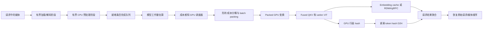

# 多模态 ViT 优化与重构方案

日期：2026-07-16

[English version](multimodal_vit_optimization_refactor_plan.md)

维护约定：方案、实现状态、性能数据或结论发生变化时，中英文版本必须同步
更新。

调研基线：

- RTP-LLM：`feat/minimax_m3_0707`，提交
  `e7906add5a5120017449cf78f5b13c98ecf5b5b4`
- SGLang：main，提交 `a798a2aeea9b3e4267c91246bfc9fe9024d1a5e5`
- vLLM：main，提交 `dc9f845`

本文记录 RTP-LLM 当前的多模态 ViT 流程、SGLang 和 vLLM 中值得参考的
设计，以及分阶段重构方案。本文用于后续实现和评审时对照，并不表示所有改动
必须一次性合入。

## 1. 目标

主要优化对象是大图、高并发场景下的 MiniMax M3VL，同时保证整体设计可以被
其他多模态模型复用。

重构需要达到以下目标：

1. 提升 ViT 吞吐，降低 P95/P99 排队延迟；
2. 在不同媒体开销差异很大时避免 OOM 和队首阻塞；
3. 在依赖允许的情况下，让媒体加载、CPU 预处理、GPU 变换、ViT 执行和远程
   传输并行；
4. 保留 ViT 独立部署、gRPC fallback 和 RDMA 传输能力；
5. 将模型专用公式和 kernel 隔离在通用接口之后；
6. 除非自动推导不可靠，否则不增加外部配置；
7. 保证输出顺序、缓存正确性、取消和超时语义不变。

## 2. 非目标

- 本次不重新设计 OpenAI 或 DashScope 请求协议。
- 本次不修改图片或视频的校验限制。
- 不要求所有多模态模型一次性实现优化后的 batching。
- 在测量确认传输成为瓶颈之前，不替换现有 RDMA 路径。
- 不引入通用的像素到 token 公式。token 化和 patch 压缩逻辑与模型相关。
- 不把 kernel、调度器、流水线、缓存和路由改动放进同一个提交。

## 3. RTP-LLM 当前流程

相关模块：

| 模块 | 主要文件 |
| --- | --- |
| ViT 进程与启动 | `rtp_llm/multimodal/vit_start_server.py` |
| 预处理与 embedding | `rtp_llm/multimodal/mm_process_engine.py` |
| GPU batching | `rtp_llm/multimodal/mm_scheduler.py` |
| ViT RPC server/proxy | `rtp_llm/server/vit_rpc_server.py`、`rtp_llm/server/vit_proxy_server.py` |
| ViT 部署参数 | `rtp_llm/server/server_args/vit_group_args.py` |
| M3VL 集成 | `rtp_llm/multimodal/multimodal_mixins/minimax_m3_vl/` |
| C++ 多模态桥接 | `rtp_llm/cpp/multimodal_processor/` |

当前高层流程：


### 3.1 现有优势

- `VIT_SEPARATION` 支持本地、基于 role 和远程 ViT 执行。
- 远程路径支持 gRPC 和 GPUDirect RDMA，并提供 fallback。
- M3VL 已经实现真实的跨请求 GPU batching，不走通用的逐条 fallback。
- 相同 key 的并发 cache miss 会进行 in-flight 去重。
- 多 worker 路由和 FlexLB 集成为 ViT 独立扩缩容提供了部署基础。

### 3.2 当前瓶颈

#### 调度与凑批

- 调度器使用固定等待窗口、请求数量限制和媒体数量限制。224x224 图片和大型
  多帧视频都占用一个媒体配额，但二者计算量和显存开销相差很大。
- 一个后台调度队列串行执行 GPU batch 构造和 forward。
- 没有 patch/token budget、shape bucket、deadline-aware packing 或 OOM 后的
  batch 拆分重试。
- 单个超大请求会被拒绝，不能拆分为有界的子 batch。

#### 流水线并发

- `mm_embedding_impl` 会先提交所有预处理任务，等待全部完成后才提交 GPU
  工作。一个慢下载或慢解码会阻塞其他已经就绪的媒体。
- 异步 cache miss 可能为每个媒体创建一个 daemon thread，没有共享的
  in-flight budget。
- 下载/解码、CPU 变换、结果发送和 GPU 提交没有被建模成具有独立限制的
  流水线阶段。
- 错误处理可能在请求路径调用 `torch.cuda.empty_cache()` 和
  `gc.collect()`，连续失败时会放大尾延迟。

#### M3VL kernel

- M3VL ViT attention 分别执行 Q、K、V projection。
- segment 边界会转换为 host list，并在 Python 循环中处理。
- 每个图片或视频 segment 都单独调用一次 SDPA，没有使用一次 packed
  variable-length attention。
- GPU resize、normalize、时间维 padding 和 fold 在拼接前按媒体逐条执行，
  带来额外 kernel launch 和 allocation。
- mean/std tensor 每次重新创建，没有保留为 device buffer。

#### 缓存、哈希与路由

- 本地 embedding cache 主要按条目数限制，而不是按字节数或 token 数限制。
- cache identity 偏向 URL，没有完整包含原始内容、模型 revision 和权重 epoch。
- prefix feature hash 会先把完整 embedding 拷贝到 CPU，再为每个
  `1 x hidden` 行计算一个 hash。
- `least_connections` 只看活跃 RPC 数，不考虑排队 patch、预测工作量、缓存
  亲和性和可用 GPU 显存。
- proxy 的状态和缓存报告还不足以作为完整调度信号。

## 4. 外部实现

### 4.1 SGLang

SGLang 已经实现完整的 Encoder-Prefill-Decode 部署模式。Encoder-only 和
language-only 实例可以独立扩缩容。Encoder 输出可以通过 ZMQ 或 Mooncake
传输，Mooncake 还可以提供跨实例的多模态 embedding cache。

值得参考的实现：

- 动态 encoder 发现和健康状态处理；
- 独立的媒体加载、预处理和结果发送 executor；
- 独立 encoder service 和多种传输后端；
- 跨请求 encoder batching；
- 复制 ViT 权重并切分媒体输入的 encoder data parallel；
- MiniMax M3VL fused QKV 和 packed variable-length vision attention；
- FA3/FA4、Triton、FlashInfer cuDNN 和 SDPA 后端选择；
- 编译后的 M3VL RoPE；
- 避免完整 tensor D2H 的 Triton GPU tensor hash；
- 本地按字节限制的 cache 和可选全局 embedding cache。

与本方案相关的局限：

- 多 encoder 分发没有统一考虑 patch/FLOP 和缓存亲和性；
- 重要路径中的 encoder batching 仍然存在请求数或条目数限制；
- 视频跨请求 batching 比图片 batching 受到更多限制。

参考：

- [EPD 解耦](https://github.com/sgl-project/sglang/blob/main/docs_new/docs/advanced_features/epd_disaggregation.mdx)
- [多模态 encoder data parallel](https://github.com/sgl-project/sglang/blob/main/docs_new/docs/advanced_features/dp_for_multi_modal_encoder.mdx)
- [MiniMax M3VL vision 实现](https://github.com/sgl-project/sglang/blob/main/python/sglang/srt/models/minimax_vl_common.py)
- [Vision attention 后端](https://github.com/sgl-project/sglang/blob/main/python/sglang/srt/layers/attention/vision.py)
- [GPU tensor hash](https://github.com/sgl-project/sglang/blob/main/python/sglang/kernels/ops/memory/gpu_tensor_hash.py)

### 4.2 vLLM

vLLM 将多模态 encoder 调度集成到主请求调度器中。调度器跟踪 encoder 计算
预算、encoder 输出缓存容量，以及每个多模态 placeholder 被使用的位置。只有
当前 token window 即将使用某个 encoder 条目，并且计算和 cache 容量都足够
时，才会调度该条目。

值得参考的实现：

- 模型感知的 encoder token 上限计算，并提供 dummy input fallback；
- 以单个媒体条目为粒度的 encoder cache 管理；
- 执行 encoder 前，按 modality 对跨请求媒体进行归组；
- batch 级 ViT DP 和 patch 数感知的负载均衡；
- 可选择的 ViT attention 后端和可选 FP8 cuDNN attention；
- 多模态 processor cache 和共享内存 IPC cache；
- 在多个 token budget 上捕获 ViT CUDA Graph；
- 运行时贪心放入能够容纳请求的最小 graph budget；
- 条目无法匹配 graph 时走 eager fallback；
- 为已适配模型提供图片和视频 CUDA Graph。

vLLM 已经存在独立 encoder 设计，但官方文档目前仍将 `ExampleConnector`
描述为参考路径。因此 RTP-LLM 应复用其调度思想，而不是用参考实现替换现有
远程 ViT 传输。

参考：

- [独立 encoder](https://github.com/vllm-project/vllm/blob/main/docs/features/disagg_encoder.md)
- [Encoder budget](https://github.com/vllm-project/vllm/blob/main/vllm/multimodal/encoder_budget.py)
- [Encoder cache manager](https://github.com/vllm-project/vllm/blob/main/vllm/v1/core/encoder_cache_manager.py)
- [多模态优化](https://github.com/vllm-project/vllm/blob/main/docs/configuration/optimization.md)
- [Vision encoder CUDA Graph](https://github.com/vllm-project/vllm/blob/main/docs/design/cuda_graphs_multimodal.md)

## 5. 目标架构



核心不变量：

1. 无论内部完成和 packing 顺序如何，媒体结果必须按原始请求顺序返回。
2. cache key 必须标识内容、预处理语义、模型 revision 和输出布局，而不只是
   URL。
3. 每个队列都必须有明确的条目数或成本上限。
4. 取消和超时必须移除排队任务并释放其拥有的 buffer。
5. batch 失败时，应尽可能隔离失败条目或以更小粒度重试。
6. 未实现优化 batching 的模型继续使用现有通用 fallback。
7. 本地、gRPC 和 RDMA 模式必须产生等价的 embedding 和 metadata。

## 6. 通用成本接口

不存在只根据图片宽高就能推断所有模型 encoder 成本的公式。动态切图、时间
patch、token 压缩、空间 merge 和学习式 pruning 都会改变像素与成本的关系。

通用调度器应消费模型提供的描述：

```python
@dataclass(frozen=True)
class MultimodalWorkEstimate:
    encoder_input_tokens: int
    encoder_output_tokens: int
    estimated_workspace_bytes: int
    modality: str
    shape_bucket: tuple[int, ...]

class MultimodalModelInterface:
    def estimate_work(self, preprocess_result) -> MultimodalWorkEstimate:
        ...
```

对 M3VL，可在预处理完成后，根据目标高宽、帧数、空间 patch 大小、时间 patch
大小和 merge size 得到精确估算。预处理前只用保守估算控制 CPU admission，
精确估算用于 GPU batching。

budget 应自动选择：

1. 启动时使用模型生成的代表性 dummy media 做 profile；
2. 根据可用 ViT 显存推导安全的 patch/token 和 workspace budget；
3. 保留现有请求数和媒体数限制作为硬安全上限；
4. 只有生产数据证明自动 profile 不足时，才增加新的 override。

## 7. 分阶段实现

每个阶段都应能够独立评审、测试性能和回退。

### Stage 0：可观测性与 baseline

范围：

- 增加 download、decode、CPU preprocess、queue wait、H2D、GPU transform、
  ViT forward、hash 和 transport 耗时；
- 记录请求数、媒体数、输入 patch、输出 token、估算 workspace 和实际 batch
  组成；
- 同时按条目和 patch/token 记录队列深度；
- 增加 cache hit/miss、scheduler split、eager fallback、OOM retry 和 RDMA
  fallback 计数器。

可能涉及：

- `rtp_llm/multimodal/mm_process_engine.py`
- `rtp_llm/multimodal/mm_scheduler.py`
- `rtp_llm/server/vit_rpc_server.py`
- `rtp_llm/server/vit_proxy_server.py`

验收：

- embedding 和响应行为不发生变化；
- 各阶段指标能够与 ViT 端到端延迟对齐；
- 指标能够区分排队、预处理、forward 和 transport 开销。

#### MiniMax M3VL ViT 标准 baseline 测试协议

Stage 0 性能 baseline 使用
`benchmark/multimodal_m3_vit_concurrency.py`，隔离 ViT service 核心路径：

```text
解码后的 CPU RGB -> MMScheduler -> H2D -> GPU transform -> batched ViT
-> 图片 token 拼装 -> CUDA 完成
```

测试不包含下载、图片解码、RPC 传输、cache hit 和 LLM prefill。因此该结果适合
比较调度器、GPU 预处理和 ViT kernel 改动；端到端延迟仍需单独进行 service
级测试。

标准矩阵和控制条件：

- 图片输入：448x448、1920x1080 和 2560x1440；
- 每个请求一张图片；
- 请求并发：1、2、4、8、16、32、64；
- 固定高并发比较点：C32；
- 最大吞吐：请求和媒体 batch 上限均为 64 时，C1-C64 扫描中的最高选中结果；
- 每个重复至少 128 个请求、四个调度 wave，并持续至少 10 秒；
- 每个点重复三次，选择吞吐中位数对应的完整运行，同时在 JSON 中保留所有
  重复；
- 每次重复前执行三个 warmup batch，请求完成处执行 CUDA synchronize；
- 每次重复前等待五秒 GPU idle；
- 启动时所有 GPU 显存占用必须不超过 4 GiB；测量期间非目标 GPU 必须低于
  4 GiB 和 50% 利用率；
- 其他 GPU 超过利用率或显存阈值时，丢弃并重跑该重复。

RT 从提交 scheduler 开始，到 embedding CUDA 完成为止。GPU 利用率来自
50 ms 一次的 NVML 采样。显存同时报告相对已加载模型 baseline 的 PyTorch
allocated-memory 峰值增量，以及 NVML 设备显存的绝对峰值和增量。

每请求一图时，如果两个 batch cap 都未截断，请求并发等于候选图片并发。但这
不保证 scheduler 一定组成相同大小的 batch：到达抖动和 10 ms batch window
可能形成更小 batch。单请求多图属于不同 workload，因为 request admission、
预处理、cache、timeout 和结果聚合是共享的。

#### Baseline 结果：2026-07-28 稳定重跑

环境：

- RTP-LLM 使用隔离 detached worktree，固定在提交
  `94e6274409edbc5d811944ff463d1fa251eb2211`；
- baseline 使用唯一命名的 Bazel target，避免共享 Bazel output runfiles
  解析到 Stage 1 worktree；
- 主机 `e01-cn-cf04s46t801`，目标 GPU 7，NVIDIA L20D；
- PyTorch `2.11.0+cu130`，CUDA `13.0`；
- checkpoint `/data2/xieshui.yyx/MiniMax-M3-MXFP8`，加载真实 visual 权重；
- segmented SDPA，与 Stage 0 实现一致；
- 63 个有效重复、13 个因外部负载自动丢弃的重复；所有保留重复的
  external-busy sample 均为 0。

M3VL 对三种输入的预处理映射：

| 场景 | 原始输入 | ViT 输入 | 输入 patch | 输出 token |
| --- | ---: | ---: | ---: | ---: |
| 小图 | 448x448 | 448x448 | 1,024 | 258 |
| 1080p | 1920x1080 | 896x504 | 2,304 | 578 |
| 2K | 2560x1440 | 896x504 | 2,304 | 578 |

性能结果使用吞吐中位数对应的重复：

| 场景 | C1 RT P50/P99 | C32 RT P50/P99 | C32 吞吐 | 扫描最大值 |
| --- | ---: | ---: | ---: | ---: |
| 小图 | 21.5/23.7 ms | 145.9/339.9 ms | 213.7 req/s | C64 227.8 req/s |
| 1080p | 24.6/26.9 ms | 300.9/896.8 ms | 99.9 req/s | C32 99.9 req/s |
| 2K | 26.8/94.8 ms | 313.7/463.0 ms | 99.8 req/s | C32 99.8 req/s |

资源结果中的显存增量是相对已加载模型 baseline 的 PyTorch peak allocated
增长，NVML peak 是设备绝对峰值：

| 场景 | C32 GPU 平均利用率 | C32 显存增量/NVML 峰值 | C64 GPU 平均利用率 | C64 显存增量/NVML 峰值 |
| --- | ---: | ---: | ---: | ---: |
| 小图 | 80.2% | 1.40/6.31 GiB | 81.5% | 2.79/9.18 GiB |
| 1080p | 81.0% | 3.15/9.95 GiB | 75.6% | 6.28/16.34 GiB |
| 2K | 78.4% | 3.15/9.95 GiB | 71.7% | 6.28/16.36 GiB |


产物：

- [选中的 baseline CSV](assets/multimodal_vit_baseline/m3_vit_baseline_94e627440.csv)
- [metadata 与全部重复](assets/multimodal_vit_baseline/m3_vit_baseline_94e627440.json)
- [四面板折线图](assets/multimodal_vit_baseline/m3_vit_baseline_94e627440.png)

结论：

- C32 已接近配置上限下的吞吐平台。C32 提升到 C64 时，小图、1080p 和 2K
  吞吐分别变化 +6.6%、-6.1% 和 -1.1%，P50 RT 却接近翻倍。
- 1080p 和 2K resize 后具有相同的 ViT patch/token 负载，因此吞吐接近。剩余
  差异来自测试路径中更大的原始 RGB 传输和 resize 工作。
- 三种场景在 C32 上的实际平均 batch size 都达到 32；C64 下小图和 2K
  达到 64，1080p 为 61.7。每请求一图时，候选图片并发与请求并发相同。
- peak memory 近似随图片并发线性增长，因此 admission 应从只看条目数改为
  显式 patch/token 和 workspace budget。
- 吞吐重复结果稳定，但即使 external-busy sample 为零，高并发 P99 仍对
  host/runtime stall 敏感。后续比较必须使用相同的重复选择规则并检查 JSON
  中所有重复，不能只比较一次短跑。

### Stage 1：M3VL packed variable-length attention

范围：

- 将独立 Q/K/V projection 替换为 fused QKV projection；
- 修改 checkpoint 加载，在不改变 checkpoint 格式的情况下合并现有 Q/K/V
  权重；
- 每层使用一次 variable-length attention 处理所有 packed segment；
- 每个 encoder forward 只计算一次 `max_seqlen`；
- 在数值安全的前提下 compile 或 fuse M3VL RoPE；
- 在 B300 上测试 FA4 和 FlashInfer cuDNN，保留 SDPA fallback；
- 除非能复用现有通用后端选项，否则后端选择保持内部实现。

可能涉及：

- `rtp_llm/multimodal/multimodal_mixins/minimax_m3_vl/minimax_m3_vl_vit.py`
- 同一模块目录中的 M3VL vision 权重加载代码
- 如果实现可以复用，则涉及共享 vision-attention utility

验收：

- 图片、视频和混合 batch 在约定的 BF16/FP16 容差内与当前实现一致；
- variable sequence length 下的 segment isolation 正确；
- 现有 M3VL smoke 在本地和独立 ViT 模式都通过；
- profile 确认移除逐 segment SDPA launch 和逐层边界 D2H synchronize。

#### Stage 1 实现结果：2026-07-27

已实现：

- 将每层 Q/K/V projection 合并为一个 `qkv_proj`；
- 新增 M3VL deploy-weight loader，在不改变 checkpoint 的情况下拼接发布的
  Q/K/V tensor；
- 每次 vision forward 只计算一次 segment offset、`cu_seqlens` 和
  `max_seqlen`，32 层复用同一个 packed-attention plan；
- 支持设备上 SM90/SM100/SM110 使用 FA4，受支持的 SM8x/SM9x 使用
  FlashAttention，可用时使用 FlashInfer ragged attention，最后 fallback 到
  segmented SDPA；
- 每个 vision model 保留一个 128 MiB FlashInfer workspace；使用 `cute-dsl`
  后端，因为 CUDA13 环境中 automatic 后端在 M3VL head dimension 80 上产生
  非法值；
- CUDA13 依赖锁定补充 FA4 import 路径所需的修复版 FlashAttention 4 wheel；
- `grid_thw` 保留在 CPU，直到一次性构造 attention metadata，移除原有逐层
  边界 D2H synchronize；
- 新增 CUDA13 Bazel benchmark entry，使性能测试与单测和生产 binary 使用
  相同的 Torch、FlashInfer 和 Cutlass 锁定版本。

验证：

- CUDA13 Bazel 专项测试通过，覆盖 fused/unfused 等价、segment isolation、
  metadata 构造、checkpoint mapping、部署时拼接、packed 对 SDPA 的 BF16
  容差，以及一个在 32 层中复用的 2,204-token 代表序列；
- 独立 ViT M3VL smoke 的图片、视频、多图和混合四类请求都得到响应，没有
  ViT runtime error；
- smoke target 仍报告失败，原因是保存的 golden response 已过期：四个实际
  响应都非空且有效，但三个 golden 为空，第一个的 token 数和文本不同；
- 本机 LLM context 路径需要设置 `RTP_LLM_CP_PREFILL_FA4=0`，因为其独立
  FA4 路径拒绝主机报告的 SM capability；此问题与 M3VL vision attention
  无关。

Stage 1 使用与 Stage 0 baseline 相同的三档图片、C1-C64 扫描、最少 128 个
请求、三次重复和吞吐中位数选择规则。选中结果对比：

| 场景 | C1 吞吐/增幅 | C32 吞吐/增幅 | C64 吞吐/增幅 | C32 P50 变化 |
| --- | ---: | ---: | ---: | ---: |
| 小图 | 50.1 req/s/+10.5% | 220.1 req/s/+2.3% | 227.8 req/s/-1.8% | -1.2% |
| 1080p | 44.0 req/s/+9.5% | 103.8 req/s/+5.0% | 106.4 req/s/+0.9% | -0.0% |
| 2K | 43.7 req/s/+12.0% | 100.9 req/s/+2.5% | 103.3 req/s/+0.2% | -0.4% |

PyTorch peak allocated-memory 增长基本不变：每个选中的
C1/C8/C16/C32/C64 点与 Stage 0 的差值都在 2 MiB 内，说明吞吐提升来自
projection/attention 执行，而不是增加 batch memory。

这次运行只能作为方向性结果，不能作为干净验收结果。目标是 GPU 7，未看到
竞争进程，但主机在其他 GPU 上报告了 1,502 个 external-busy sample，绝对
NVML 显存记账也存在陈旧值。各次重复的 P50 和吞吐趋势一致，本次不以 P99
作为验收信号。后续 idle-gated 重跑记录如下。

##### Idle-gated Stage 1 重跑：2026-07-27

Stage 1 重跑保持 Stage 0 的请求矩阵和选择规则，不使用
`--allow-busy-gpu`。每个有效重复在五秒 idle window 后开始；如果非目标 GPU
利用率超过 50%，则丢弃该重复。下方比较使用前面记录的隔离、严格 4 GiB
Stage 0 baseline。

在另一个分布式 workload 占满八张 GPU 前，21 个矩阵点中的 20 个完成了三次
重复。最后一个 2K C64 点只有一次干净重复，标记为 provisional。

| 场景 | C1 Stage 0 -> Stage 1 | C32 Stage 0 -> Stage 1 | C64 Stage 0 -> Stage 1 | C32 P50 |
| --- | ---: | ---: | ---: | ---: |
| 小图 | 45.34 -> 51.01 req/s（+12.5%） | 215.18 -> 220.55 req/s（+2.5%） | 231.84 -> 235.89 req/s（+1.7%） | 145.4 -> 142.8 ms（-1.8%） |
| 1080p | 40.15 -> 44.52 req/s（+10.9%） | 98.94 -> 104.05 req/s（+5.2%） | 105.40 -> 107.35 req/s（+1.8%） | 301.5 -> 300.0 ms（-0.5%） |
| 2K | 39.04 -> 43.72 req/s（+12.0%） | 98.40 -> 99.56 req/s（+1.2%） | 103.07 -> 103.76 req/s（+0.7%，一次重复） | 313.9 -> 313.6 ms（-0.1%） |

干净对比表明 C1 提升 10.9%-12.5%，C32 提升 1.2%-5.2%。两个完成三次重复的
C64 场景在最大吞吐点提升 1.7%-1.8%。peak allocated-memory 增长仍与 Stage 0
处于同一条曲线：小图 C32 约 1.4 GiB，1080p/2K C32 约 3.1 GiB，C64 约为
2.8/6.3 GiB。因此该优化提高计算吞吐，没有明显增加随并发变化的显存占用。

P99 仍不作为验收指标。虽然外部 GPU 利用率为零，部分有效高并发重复仍有
host/runtime 长尾。三个图片场景的 C32 P50 都稳定或小幅下降。


产物：

- [选中的 Stage 1 CSV](assets/multimodal_vit_stage1/m3_vit_baseline_94e627440.csv)
- [Stage 1 metadata 与全部重复](assets/multimodal_vit_stage1/m3_vit_baseline_94e627440.json)
- [Stage 1 四面板折线图](assets/multimodal_vit_stage1/m3_vit_baseline_94e627440.png)
- [Stage 0 与 Stage 1 对比图](assets/multimodal_vit_stage1/m3_vit_stage1_vs_baseline_94e627440.png)

#### Stage 1.5：融合 QKV unpack 和 RoPE

fused linear 输出 `[sequence, 3, heads, head_dim]`。其中 Q/K/V view 的 token
stride 是 `3 * hidden_size`，而 FlashInfer 要求 dense NHD 输入。eager RoPE
路径会让 Q/K 变为 dense，但 V 仍需要一次 D2D `contiguous()` copy。此外，每
个 vision layer 都会分别 launch cast、rotate、multiply、add、concatenate 和
copy kernel。

Stage 1.5 增加一个 Triton kernel：

- 直接读取带 stride 的 fused-QKV 输出；
- 以 FP32 对 Q/K 应用 M3VL half-rotation RoPE；
- 复制 Q/K 的非 rotary channel 和 V；
- 写入一个布局为 `[3, sequence, heads, head_dim]` 的 allocation，三个 view
  都是 FlashInfer 可以直接接收的 dense NHD tensor；
- Triton 或目标设备不可用时 fallback 到原有 eager 实现。

CUDA13 测试覆盖实际 M3VL `head_dim=80`、`rot_dim=78` 形状，检查 BF16 与
eager RoPE 的数值一致性、V 精确一致、Q/K/V contiguous，并在代表性的
2,204-token 序列上执行 packed attention。

一张空闲 L20D 上的纯 kernel CUDA-event 测量：

| 输入 patch 总数 | Eager RoPE + V copy | Fused kernel | 加速比 |
| ---: | ---: | ---: | ---: |
| 1,024 | 0.108 ms | 0.028 ms | 3.9x |
| 2,304 | 0.178 ms | 0.027 ms | 6.5x |
| 32,768 | 1.972 ms | 0.194 ms | 10.2x |
| 73,728 | 4.332 ms | 0.429 ms | 10.1x |

首次 C1/C32/C64 矩阵选择了 segmented SDPA，而不是 Stage 1 的 FlashInfer。
新增 fallback 诊断后，确认原因是混合环境：Bazel 提供 FlashInfer 0.6.12，
host user site 注入了 `flashinfer-cubin` 0.6.11。因此正式验收运行设置
`PYTHONNOUSERSITE=1`。metadata 中记录
`attention_backends=["flashinfer"]`，且无 backend error。

正式运行使用与 Stage 1 重跑相同的主机、GPU、模型、最少 128 个请求、每点
至少 10 秒、三次重复、10 ms batch window 和吞吐中位数选择规则。27 个重复
全部完成，0 个丢弃重复，0 个 external-busy sample。

| 场景 | C1 Stage 1 -> Stage 1.5 | C32 Stage 1 -> Stage 1.5 | C64 Stage 1 -> Stage 1.5 | C32 P50 |
| --- | ---: | ---: | ---: | ---: |
| 小图 | 51.01 -> 54.69 req/s（+7.2%） | 220.55 -> 423.12 req/s（+91.8%） | 235.89 -> 491.47 req/s（+108.3%） | 142.8 -> 74.7 ms（-47.7%） |
| 1080p | 44.52 -> 53.29 req/s（+19.7%） | 104.05 -> 183.73 req/s（+76.6%） | 107.35 -> 195.64 req/s（+82.2%） | 300.0 -> 172.9 ms（-42.4%） |
| 2K | 43.72 -> 52.85 req/s（+20.9%） | 99.56 -> 170.76 req/s（+71.5%） | 103.76 -> 183.26 req/s（+76.6%） | 313.6 -> 181.9 ms（-42.0%） |

选中的资源测量：

| 场景 | C32 GPU 平均利用率 | C32 allocated 增量/NVML 峰值 | C64 GPU 平均利用率 | C64 allocated 增量/NVML 峰值 |
| --- | ---: | ---: | ---: | ---: |
| 小图 | 72.9% | 1.10/6.13 GiB | 84.5% | 2.21/8.59 GiB |
| 1080p | 81.8% | 2.48/9.26 GiB | 84.2% | 4.96/14.79 GiB |
| 2K | 78.6% | 2.48/9.12 GiB | 81.4% | 4.96/14.84 GiB |

随着 packed sequence length 增大，收益也会增加，因为 eager RoPE/copy 成本
需要在 32 个 vision layer 中重复支付。在 C32 下，fused kernel 对小图减少约
57 ms kernel 工作，对 1080p/2K 减少约 124 ms，与观察到的 P50 降幅一致。
C32 和 C64 的 peak allocated-memory 增长约降低 21%，原因是 eager Q/K
变换和 V materialization 不再作为独立 temporary 同时存在。

尽管 2K 和 1080p 都 resize 为 2,304-patch ViT 输入，2K 仍略慢，因为本测试
包含原始 RGB 传输和 resize。两个选中重复出现孤立的 P99 host/runtime stall，
但吞吐和 P50 稳定，没有重复满足 external-busy 丢弃条件。


产物：

- [选中的 Stage 1.5 CSV](assets/multimodal_vit_stage15/m3_vit_baseline_ce519225d.csv)
- [Stage 1.5 metadata 与全部重复](assets/multimodal_vit_stage15/m3_vit_baseline_ce519225d.json)
- [baseline、Stage 1 与 Stage 1.5 对比图](assets/multimodal_vit_stage15/m3_vit_stage15_vs_baseline_ce519225d.png)
- [Stage 1.5 四面板折线图](assets/multimodal_vit_stage15/m3_vit_baseline_ce519225d.png)

### Stage 2：成本感知 batching

范围：

- 增加内部 work-estimate 接口；
- 实现 M3VL 预处理后的精确 patch/token 估算；
- 将只按媒体数 admission 改为 patch/token 和 workspace budget；
- 保留请求数和媒体数限制作为硬安全上限；
- 在不破坏 FIFO fairness 的前提下，对兼容的 modality 和 shape bucket 分组；
- 将超大请求拆分为有界子 batch；
- OOM 时二分 batch 重试，只有单条仍无法执行时才报告终止失败；
- 保持子 batch 之间的结果顺序。

可能涉及：

- `rtp_llm/multimodal/mm_scheduler.py`
- `rtp_llm/multimodal/mm_process_engine.py`
- `rtp_llm/multimodal/multimodal_mixins/minimax_m3_vl/minimax_m3_vl_mixin.py`
- 通用多模态接口

验收：

- 混合小媒体和大媒体时不超过 profile 得到的 budget；
- 大请求能够通过子 batch 持续向前执行；
- 连续小请求流下不发生 starvation；
- batch composition 指标能够解释每次 admission 或 split；
- 低并发 P99 不回退，同时高并发吞吐相对固定条目数 batching 提升。

#### embedding 前的工作量估算

M3VL 的精确估算可以在 CPU 预处理后、`embedding()` 或
`batched_embedding()` 前得到。当前预处理结果已经包含
`(raw, target_hw, timestamp_token_ids)`，因此无需执行 GPU resize/fold、
patch embedding、ViT、projector 或输出 embedding。

对于 `F` 个已解码或采样帧：

```text
grid_t = ceil(F / temporal_patch_size)
grid_h = target_h / patch_size
grid_w = target_w / patch_size
input_patches = grid_t * grid_h * grid_w
vit_tokens = input_patches / spatial_merge_size^2
```

最终拼装长度也能精确计算：

```text
image_output_tokens = vit_tokens + 2
video_output_tokens =
    vit_tokens + sum(timestamp_token_lengths) + 2 * grid_t
```

图片多出的两个 token 是 start/end image embedding。视频每个时间组增加一对
start/end。`target_hw` 已经由 `smart_resize` 或 `get_hw_multiple_of` 对齐，
采样帧数是 `raw.shape[0]`，timestamp token ID 已由视频预处理生成。

因此 `grid_thw` 对应两种不同的长度：

- spatial merge 前，`sum(grid_t * grid_h * grid_w)` 是精确的 ViT 输入行数；
- 经过 `patch_merge_mlp` 后，精确的 ViT feature 行数是上述结果除以
  `spatial_merge_size**2`。

对于图片，grid 加上 `spatial_merge_size` 后可以精确确定最终 embedding
长度，再加两个图片边界 embedding 即可。对于视频，grid 本身不足以确定最终
长度，因为每个时间组前还会拼入实际 tokenizer 生成的 timestamp token。估算
必须使用 `sum(len(ids) for ids in timestamp_token_ids)`，不能假设 timestamp
长度固定。`vision_segment_max_frames` 只会把一个 grid 拆成多个 attention
segment，`grid_t` 总和不变，因此不会改变上述两种 token 数。

当前实现是在 `embedding()` 调用的 `_gpu_fold()` 内创建 `grid_thw`。Stage 2
不应为了估算提前调用 `_gpu_fold()`；可以直接使用 CPU 预处理后已经存在的
`target_hw`、采样帧数、`patch_size` 和 `temporal_patch_size`，在 CPU 上精确
复算同一个 grid，并在提交 scheduler 前挂载估算结果。

通用接口应携带模型专用估算结果，而不是强制使用通用像素公式：

```text
MMWorkEstimate(
    input_patches,
    output_tokens,
    max_attention_segment,
    attention_work,
    estimated_workspace_bytes,
)
```

M3VL 使用上述公式计算这些字段。scheduler 只消费字段，保持模型无关。初期
admission 可以使用 `input_patches` 和 `output_tokens`；workspace 系数应从
现有 benchmark 数据推导，而不是增加新的环境变量。

远程 URL 在读取尺寸前无法精确估算，视频还需要得到采样 metadata。因此采用
两阶段流程：

1. 下载和解码前应用文件大小、媒体数等安全限制；
2. 预处理后计算精确的模型专用估算，挂到 `MMWorkItem`，再提交 GPU
   scheduler。

#### 实现状态：2026-07-28

当前工作树基于 `feat/minimax_m3_0718` 的 `0dabfdf0a` 实现了 Stage 2
核心调度能力：

- 通用层新增不可变的 `MMWorkEstimate`，包含输入 patch、输出 token、估算
  workspace、最大 attention segment 和 attention work。加法会累加总量并对
  segment 取最大值，scheduler 不包含 M3VL 专用公式。
- 通用多模态接口新增 `estimate_work()` 和 `get_batch_work_budget()`。默认
  都返回 `None`，因此未适配模型继续使用原来的媒体数凑批、整请求上限和整批
  OOM 失败行为。
- `MMProcessEngine` 在 CPU preprocess 完成后、提交 GPU scheduler 前挂载
  estimate；cache hit 不重复估算或执行。
- M3VL 根据 `(raw, target_hw, timestamp_token_ids)` 精确计算图片和视频的
  patch/token 数，并校验 patch/merge 对齐及 timestamp group 数。workspace
  当前按 BF16 下每 patch 40 KiB 的保守 activation 模型估算。
- M3VL 使用现有 `gpu_max_batch_images` 对应的 672x672 参考图片自动推导
  work budget，没有增加环境变量或服务参数。关闭 GPU batching 的串行路径
  继续保持不设成本预算。
- opt-in 模型按媒体数和 work budget 同时 packing。超大多 work-item 请求按
  work-item 边界拆分；每完成一个 chunk，下一 chunk 放到队尾，避免大请求
  阻塞已经排队的小请求，并保持原始结果顺序。
- CUDA OOM 会先按请求 chunk 二分，再在单请求 chunk 内按 work item 二分。
  单个不可拆 work item 仍 OOM 时才终止该请求。每次正常 forward 记录图片数、
  patch、token、workspace 和耗时，主动分片及 OOM 重试记录原因。
- benchmark 直接构造的 work item 也会挂载 estimate，并默认执行一次真实
  权重的混合分辨率 batch 正确性检查。
- 单 work-item 同质请求使用直接构造 chunk 的热路径；budget 比较不再创建
  临时 estimate 对象，INFO 日志关闭时也不再重算整批 composition。正式
  验收中 C32/C64 恢复为满批，admission 语义不变。

兼容边界：

- 成本调度只在模型返回非空 budget 时启用。除 M3VL 外的模型行为不变。
- 通用 scheduler 只能在 work-item 边界拆分；单个长视频不是通用可拆单元，
  会单独执行并保留真实 OOM。
- M3VL packed varlen attention 已验证可以混合不同 grid，因此当前没有为它
  增加 shape bucket。通用 compatibility/shape key、启动时显存 profile 和
  根据实时可用显存自动推导 budget 仍待后续实现。

验证结果：

| 验证 | 结果 |
| --- | --- |
| `//rtp_llm/multimodal/test:mm_scheduler_test` | 通过；覆盖旧模型 fallback、成本 admission、大请求公平分片、跨请求和请求内 OOM 二分 |
| `//rtp_llm/multimodal/test:multimodal_process_engine_test` | 通过 |
| `//rtp_llm/multimodal/test:minimax_m3_vl_vit_test` | 通过；覆盖图片/视频精确估算、budget 和 CUDA ViT |
| 三分辨率快速运行 | 448 为 1,024 patch/258 token；1080p 和 2K 均为 2,304 patch/578 token；C8 都实际组成 batch 8 |
| 混合 batch 正确性 | 448、1080p、2K 在同一个 packed batch 中执行；逐项 embedding 与单独执行 BF16 一致，position ID 和顺序一致 |
| M3VL 独立 ViT smoke | 推理内容与 golden 完全一致；测试仅因现分支 usage 统计为 553 image token、旧 golden 为 551 而失败。Stage 2 只读取该长度，不修改 embedding 或 usage |

快速运行只有一次重复，而且 GPU 7 同时有独立 baseline 任务，因此只作为功能
检查，不能用于 Stage 1.5 的性能对比。

#### Stage 2 性能验收：2026-07-28

正式运行使用与 Stage 1.5 相同的主机、物理 GPU 7、真实 checkpoint、
workload、时长和中位数选择规则。由于先前 CUDA 任务退出后驱动显存计数仍
高于 4 GiB，非目标卡 idle-memory gate 调整为 16 GiB；50% 利用率 gate 和
自动重试保持开启。三档图片都测试 C1/C32/C64，每点重复三次。最终保留
27 个重复，全部 external-busy sample 为 0。另有一个 2K C64 重复在独立
smoke 启动时检测到 78 个 external-busy sample，已自动丢弃。

Stage 2 相对稳定 Stage 0 重跑和 Stage 1.5 的吞吐如下：

| 场景 | C1 Stage 0 -> Stage 2 | C32 Stage 0 -> Stage 2 | C64 Stage 0 -> Stage 2 | Stage 2 相对 Stage 1.5 的 C1/C32/C64 |
| --- | ---: | ---: | ---: | ---: |
| 小图 | 45.71 -> 53.66 req/s（+17.4%） | 213.65 -> 409.49 req/s（+91.7%） | 227.83 -> 480.56 req/s（+110.9%） | -1.9%/-3.2%/-2.2% |
| 1080p | 39.74 -> 51.12 req/s（+28.6%） | 99.87 -> 171.41 req/s（+71.6%） | 93.73 -> 188.12 req/s（+100.7%） | -4.1%/-6.7%/-3.8% |
| 2K | 31.04 -> 46.08 req/s（+48.5%） | 99.80 -> 167.75 req/s（+68.1%） | 98.72 -> 182.09 req/s（+84.4%） | -12.8%/-1.8%/-0.6% |

选中的 Stage 2 延迟和调度组成：

| 场景 | C1 P50/P99 | C32 P50/P99 | C64 P50/P99 | C32/C64 平均 batch |
| --- | ---: | ---: | ---: | ---: |
| 小图 | 17.5/63.7 ms | 75.9/194.1 ms | 131.0/155.9 ms | 32.0/63.7 |
| 1080p | 18.1/22.8 ms | 175.1/661.7 ms | 326.9/521.7 ms | 32.0/64.0 |
| 2K | 18.5/118.9 ms | 182.6/593.3 ms | 347.0/460.0 ms | 32.0/64.0 |

九个点的 P50 相对 Stage 1.5 只变化 -2.5% 到 +1.8%。2K C1 的吞吐差异来自
孤立的 host/runtime stall：其选中 P50 为 18.5 ms，Stage 1.5 为 18.8 ms，
所有重复都保存在 JSON 中。C32/C64 形成完整 batch，说明 M3VL work budget
不会无意义地拆分这些同质 workload。

选中的资源测量：

| 场景 | C32 GPU 平均利用率 | C32 allocated 增量/NVML 峰值 | C64 GPU 平均利用率 | C64 allocated 增量/NVML 峰值 |
| --- | ---: | ---: | ---: | ---: |
| 小图 | 69.7% | 1.95/6.13 GiB | 82.7% | 4.26/9.22 GiB |
| 1080p | 74.3% | 4.18/18.64 GiB | 83.6% | 8.23/15.58 GiB |
| 2K | 72.1% | 4.18/9.22 GiB | 82.5% | 8.23/14.79 GiB |

PyTorch allocated 峰值在重复之间稳定。选中的 1080p C32 NVML 水位是驱动
计数异常：另两个重复的峰值约为 9.2 GiB，而 allocated 始终在
3.91–4.24 GiB。Stage 2 scheduler 的 estimate 是 CPU metadata，不分配 GPU
显存。当前分支还包含 Stage 1.5 之后的 M3VL QKV packing 改动，因此在没有
kernel 级 A/B 前，不能把 allocated 峰值上升归因于成本 admission。


产物：

- [选中的 Stage 2 CSV](assets/multimodal_vit_stage2/m3_vit_baseline_0dabfdf0a.csv)
- [Stage 2 metadata 与全部重复](assets/multimodal_vit_stage2/m3_vit_baseline_0dabfdf0a.json)
- [Stage 2 四面板折线图](assets/multimodal_vit_stage2/m3_vit_baseline_0dabfdf0a.png)
- [Stage 0/Stage 1.5/Stage 2 对比 CSV](assets/multimodal_vit_stage2/m3_vit_stage2_vs_baseline_0dabfdf0a.csv)
- [Stage 0/Stage 1.5/Stage 2 对比图](assets/multimodal_vit_stage2/m3_vit_stage2_vs_baseline_0dabfdf0a.png)

### Stage 3：流式 preprocess-to-GPU 流水线

2026-07-29 状态：跳过。当前请求契约仍需等待全部媒体 embedding，现有 workload
数据不足以支撑额外的流水线编排复杂度。只有线上数据证明存在明显的跨请求队头
阻塞，或存在 Stage 2 无法利用的 CPU/decode 与 GPU 重叠区间时再重新评估。

范围：

- 每个预处理结果一完成就立即提交 GPU scheduler；
- 使用有界 executor 分离加载/解码和 CPU 变换；
- 用共享有界任务执行替换每个 cache miss 一个 daemon thread；
- 使用 completion queue 和请求级结果聚合器；
- 在所有阶段传播 timeout 和 cancellation；
- 在预处理队列与 GPU 队列之间增加 patch/token backpressure；
- 从常规错误路径移除无条件的全局 CUDA cache 清理和 GC；只有测量证明有必要
  时，才在已分类 OOM 恢复中执行。

可能涉及：

- `rtp_llm/multimodal/mm_process_engine.py`
- `rtp_llm/multimodal/mm_scheduler.py`
- 异步请求/cache 支持 utility

验收：

- 一个慢媒体下载不会阻塞其他请求中已经就绪的媒体；
- 持续并发下队列大小保持有界；
- 请求顺序和请求内媒体顺序正确；
- cancellation 会释放队列条目、future 和 GPU/RDMA buffer；
- 重复图片和唯一图片并发时不会串结果。

### Stage 4：GPU 行级 embedding hash

范围：

- 为每个连续 `1 x hidden` 行实现一个确定性的 64-bit hash；
- 使用 Triton 或 CUDA 在 GPU 上计算 hash；
- 只把紧凑 hash vector 传到 CPU；
- 使用显式 CUDA event 或 stream dependency；
- 保留当前 CPU 实现作为 fallback 和对比 oracle；
- 明确 hash 是否要求跨进程或跨机器一致。

RTP-LLM 当前只要求 hash 在相关 prefix-cache domain 内稳定。除非后续分布式
cache contract 要求，否则不应强制跨机器一致。

可能涉及：

- `rtp_llm/cpp/multimodal_processor/MultimodalProcessor.cc`
- `rtp_llm/cpp/multimodal_processor/MultimodalProcessor.h`
- 新的 CUDA/Triton hash 实现和测试

验收：

- 每个多模态输出行恰好生成一个 hash；
- 相同行生成相同 hash，测试能检测变化后的行；
- prefix-cache 行为保持正确；
- profile 确认完整 embedding D2H copy 已移除。

#### Stage 4 实现结果：2026-07-29

CUDA 路径实现在
`rtp_llm/cpp/multimodal_processor/FeatureHashKernel.cu`，CPU/GPU 共用的 hash
基础算法位于 `FeatureHash.h`：

- 一个 CUDA block 处理一个连续 embedding 行；
- 行指纹内部使用 64-bit，在 GPU 上折叠为现有 `int32` expanded-token 契约；
- kernel、紧凑 D2H copy 和同步均使用当前 PyTorch CUDA stream；
- CUDA 路径每行只回传一个 4-byte key；CPU 和非 CUDA tensor 使用相同的确定性
  CPU fallback；
- 新算法有意替换原来依赖实现的 `std::hash<string_view>` 数值。滚动升级期间，
  不同版本之间最多产生 prefix-cache miss，不会产生错误 cache hit。

`MultimodalProcessorTest.cc` 已覆盖相同/变化行、CPU/GPU 一致性、非连续输入、
13-byte tail 行和真实量级的 `553 x 4096` BF16 tensor。CUDA13/SM10x 测试
通过，独立 ViT 的 M3VL smoke 通过，耗时 406.5 秒。

真实量级 tensor 的 Nsight Systems 结果：

| 指标 | 结果 |
|---|---:|
| 完整 BF16 embedding 大小 | 4,530,176 bytes |
| 新 D2H hash vector 大小 | 2,212 bytes |
| D2H 缩减 | 2,048 倍 / 99.95% |
| GPU hash kernel 时间 | 5.6 us |

因此 profile 已确认 CUDA 路径不再为 prefix-cache token 生成而把完整 embedding
复制到 CPU。

### Stage 5：缓存与多 worker 路由

范围：

- 本地 embedding cache 容量从条目数改为字节数或输出 token 数；
- cache identity 包含原始内容 identity、完整预处理配置、模型 revision 和
  weight epoch；
- 保留 in-flight miss 去重；
- 每个 ViT worker 上报排队 patch/token、预计完成债务、可用显存和 cache
  摘要；
- 按预测完成时间和 cache affinity 路由，而不只按活跃 RPC 数；
- 让 AsyncSubmit/Get/Release 在 work item 生命周期内保持 sticky routing；
- 只有实际 workload 测量显示跨 worker 媒体复用时，才评估分布式 embedding
  cache。

验收：

- cache 淘汰与实际显存/内存占用成比例；
- 模型 reload 会使旧 embedding 失效；
- lookup 不会被发送到另一个不持有已提交状态的 worker；
- 压测显示 patch debt 均衡，且没有 cache-affinity 路由环。

### Stage 6：CUDA Graph 与 GPU 预处理后续优化

范围：

- 将 mean/std 保留为注册的 device buffer；
- 在形状信息允许时预分配 packed pixel buffer；
- 只有 profile 证明 resize/normalize/pad/fold 成为主要开销后，才对其 batching
  或融合；
- 在自动生成的 token budget 上捕获 ViT graph；
- 运行时将条目贪心放入能够容纳它的最小 graph budget；
- 不支持的形状或 data-dependent pruning 使用 eager；
- 记录 graph hit/miss 和 padding 开销。

该阶段应在 attention 和 scheduler 优化之后进行。直接捕获当前逐 segment
实现会保留不必要的 launch 和 synchronize，并增加后续重构难度。

#### Stage 6 实现结果：2026-08-04

当前完成的是保守的第一版，默认启用，但只捕获已验证有收益且不会改变 packed
attention 隔离语义的 workload：

- mean/std 改为 FP32 registered buffer，首次使用时随 ViT 移到目标 device，
  后续请求复用；
- `batched_embedding` 根据 `estimate_work` 一次性分配精确大小的 packed BF16
  pixel buffer，resize/normalize/fold 直接写入对应 slice，移除逐媒体 BF16
  临时 tensor 和最终 `torch.cat`；
- CUDA Graph cache 使用完整 grid、shape、dtype 和 device 作为 identity，第二次
  出现时 capture，最多保留 4 个 entry；支持 FA4、FlashAttention 和 FlashInfer；
- FlashInfer 的 graph wrapper、indptr 和 plan 在 capture 外准备，capture 失败或
  backend 不支持时自动走 eager；
- graph 只用于单 segment、patch 数不超过 4096 的输入。动态 packed batch 的
  segment 数量会变化，且实测 graph I/O copy 抵消 launch 收益，因此继续走
  eager；在有严格 segment-isolation 证明之前不做跨 grid padding；
- 新增 hit、miss、capture、fallback 和 padding ratio 指标；当前为 exact-grid，
  padding ratio 恒为 0；benchmark 可用 `--enable-cuda-graph` /
  `--no-enable-cuda-graph` 做同版本 A/B，并记录每个测试点的 graph 统计。

正确性覆盖包括：新旧 fold layout 等价、直接写 packed slice、mean/std buffer
复用、graph-safe attention context 与 eager 等价、第二次 capture/后续 replay、
跨 CUDA stream replay 不串结果，以及多 segment packed batch 保持 eager。
CUDA13/SM10x 下完整 `minimax_m3_vl_vit_test` 通过，耗时 54.1 秒。

最终对比每个测试点执行 5 轮，选择 RPS 中位数所在的完整轮次，所有入选轮次
均为 `external_busy_samples=0`。GPU Util 使用采样平均值，显存使用 PyTorch
peak allocated，避免其他驻留任务影响 NVML 总显存：

| 图片 | 并发 | Stage 2 P50 | Stage 6 P50 | Stage 2 RPS | Stage 6 RPS | GPU Util S2 -> S6 | 峰值 MiB S2 -> S6 | graph 行为 |
|---|---:|---:|---:|---:|---:|---:|---:|---|
| 448x448 | 1 | 18.11 ms | 14.67 ms | 48.70 | 65.26 | 23.5% -> 27.3% | 2019 -> 2003 | 精确 shape 稳定命中 |
| 448x448 | 32 | 89.71 ms | 87.90 ms | 344.75 | 353.12 | 77.2% -> 78.7% | 3986 -> 3835 | packed eager，单条尾批命中 |
| 448x448 | 64 | 161.32 ms | 158.93 ms | 380.66 | 391.45 | 82.6% -> 84.9% | 6650 -> 6208 | packed eager，单条尾批命中 |
| 1080p | 1 | 19.47 ms | 16.73 ms | 46.81 | 57.88 | 35.9% -> 33.0% | 2246 -> 2257 | 精确 shape 稳定命中 |
| 1080p | 32 | 206.00 ms | 174.50 ms | 148.66 | 179.17 | 81.7% -> 78.7% | 6337 -> 6010 | packed eager |
| 1080p | 64 | 400.06 ms | 328.59 ms | 152.39 | 187.79 | 80.7% -> 82.6% | 10501 -> 10367 | packed eager |
| 2K | 1 | 19.71 ms | 17.18 ms | 43.42 | 56.89 | 34.0% -> 33.4% | 2244 -> 2301 | 精确 shape 稳定命中 |
| 2K | 32 | 224.98 ms | 186.63 ms | 129.58 | 166.53 | 68.9% -> 74.4% | 6318 -> 5983 | packed eager |
| 2K | 64 | 415.95 ms | 350.35 ms | 144.87 | 175.88 | 77.6% -> 77.0% | 10596 -> 9914 | packed eager |

结论：精确 shape 单图片 graph 的吞吐提升 23.66%-34.01%，P50 降低
12.85%-18.98%；1080p/2K packed batch 通过直接写入整块 BF16 buffer，吞吐
提升 20.52%-28.51%，P50 降低 15.29%-17.87%，并降低并发 32/64 的峰值
显存。448x448 packed 路径已经接近算力瓶颈，吞吐提升 2.43%-2.83%。自动
token-budget padding 暂不实现，因为仅按总 token padding 会改变不同媒体
segment 的 attention 边界，存在串图风险。

## 8. 多 GPU 与多 worker 策略

必须区分两类并行：

1. service 级水平扩展：每张 GPU 一个独立 ViT worker，由 frontend/proxy
   路由；
2. batch 级 encoder DP：一个 ViT service 跨多张 GPU，每个 rank 持有完整
   ViT 权重并处理一部分媒体。

对现有独立 worker 部署，应先优化 service 路由。只有一个 ViT 实例有意绑定
多张 GPU，或必须与 LLM TP group 对齐时，batch 级 encoder DP 才有价值。
任务分配应按 patch/token 成本做贪心负载均衡，而不是按媒体数。如果所需
all-gather 的成本高于独立 worker 路由，则不应引入 encoder DP。

## 9. 传输方案

现有 RDMA 实现是可复用资产，应渐进优化：

1. 测量 registration、allocation、serialization、transfer 和 release 时间；
2. 保留 inline gRPC bytes 作为正确性和失败 fallback；
3. 如果请求级 registration 或 allocation 成本显著，引入持久注册的 send 和
   landing-buffer pool；
4. 对 slot 做 suballocation，只有 consumer 明确完成后才能复用；
5. 保留 inflight limit、slot GC、timeout 和 release 幂等；
6. 能安全建立 zero-copy view 时，不复制或拆分收到的 tensor。

## 10. 测试与性能矩阵

### 正确性

- 纯图片、纯视频和图片/视频混合请求；
- 每请求一个和多个媒体；
- 重复 URL/内容、唯一内容和并发重复 cache miss；
- 不同图片分辨率和宽高比；
- 不同视频帧数；
- 本地 ViT、gRPC 独立 ViT、RDMA 独立 ViT；
- 单个和多个 ViT worker；
- timeout、cancellation、worker failure、RDMA fallback 和 OOM retry；
- 对比 embedding、position ID、token hash 和最终模型输出；
- 专门验证并发请求绝不串图。

### 性能

使用并发 `1`、`8`、`32`、`64`，至少包含以下 workload：

| Workload | 目的 |
| --- | --- |
| 统一小图 | launch 开销和低延迟回退 |
| 统一大图 | ViT 计算吞吐 |
| 混合小图/大图 | scheduler fairness 和尾延迟 |
| 单请求多图 | 跨请求和请求内 packing |
| 大视频 | patch/token budget 和显存压力 |
| 图片/视频混合 | modality grouping 和顺序 |
| 重复媒体 | cache 和 hash 行为 |

必须记录：

- 端到端 TTFT P50/P95/P99；
- 媒体预处理和 ViT 完成 P50/P95/P99；
- images/s、frames/s、input patches/s、output tokens/s；
- scheduler queue time 和 batch-fill efficiency；
- GPU SM 利用率、显存带宽、kernel 数和显存峰值；
- cache hit rate 和保留字节数；
- gRPC/RDMA 字节数、传输延迟和 fallback 次数；
- CPU 利用率和 executor queue depth。

每个优化按 ablation 单独运行：

1. baseline；
2. 只启用 packed varlen attention；
3. 只启用成本感知 scheduler；
4. 只启用流式预处理流水线；
5. 只启用 GPU row hash；
6. 组合所有阶段。

如果吞吐提升同时引入无法解释的数值漂移、串结果、无界队列或明显的低并发
P99 回退，则不能验收。

## 11. 验证命令

具体构建参数取决于目标镜像，但至少应执行：

```bash
# 修改过的多模态模块专项 Python/unit 测试。
bazelisk test //rtp_llm/multimodal/... --config=cuda13 --config=sm10x

# 内源和模型数据可用时，执行现有 MiniMax M3VL 生产风格 smoke。
bazelisk test \
  //internal_source/rtp_llm/test/smoke:minimax_m3_deepep_tp4_ep4 \
  --config=cuda13 \
  --config=sm10x
```

应在现有通用多模态流程中增加专项测试，不创建单独的 M3-only 工作流：

- 通用 scheduler cost、split、fairness、cancellation 和 ordering 测试；
- 通用多模态并发和不串结果测试；
- M3VL 专用 attention、cost estimation 和 embedding alignment 测试；
- CPU/GPU row-hash 等价性和 layout 测试；
- 远程 transport fallback 和 sticky routing 测试。

## 12. 提交与评审结构

建议拆分为独立提交：

1. `multimodal: add ViT stage and batch-cost metrics`
2. `m3vl: use fused QKV and packed varlen vision attention`
3. `multimodal: add model-aware cost-based GPU batching`
4. `multimodal: pipeline preprocessing into GPU scheduling`
5. `multimodal: compute per-token embedding hashes on GPU`
6. `multimodal: make embedding cache capacity and identity robust`
7. `multimodal: route ViT work using queue cost and cache affinity`
8. `multimodal: add token-budgeted ViT CUDA Graph execution`

每个改变行为的提交都应包含专项测试，以及相对上一阶段的 benchmark 对比。
不要把 benchmark script 或无关 frontend/renderer 改动混入这些提交。

## 13. 待决策问题

对应阶段开始前，应通过测量或简短设计评审解决：

1. B300 上哪种 attention 后端在 M3VL 小 packed batch 和大 packed batch 上
   延迟最好：FA4 还是 FlashInfer cuDNN？
2. 启动 profile 能否在所有支持的 M3VL 媒体尺寸上推导稳定 workspace
   budget，还是需要一个通用 override？
3. fairness 应采用带有限重排的严格 FIFO，还是按 patch 成本做 deficit-based
   调度？
4. 生产媒体复用率是否值得引入分布式 embedding cache？
5. service 级 worker 扩展是否足够，还是确实存在需要实例内 encoder DP 的
   部署？
6. row hash 只是进程内 prefix identifier，还是未来分布式 cache 需要跨机器
   稳定算法？
7. packed attention 实现后，哪些 GPU 预处理操作仍然是主要开销？

## 14. 推荐执行顺序

推荐关键路径：

```text
可观测性
  -> M3VL packed varlen attention
  -> 成本感知 batching
  -> 流式预处理流水线
  -> GPU row hash
  -> cache 与路由
  -> CUDA Graph 和预处理 kernel 后续优化
```

前三个改变行为的阶段解决当前 M3VL 路径中已经确认的最大问题。cache、路由和
CUDA Graph 应在新成本模型和 packed 执行路径提供稳定测量结果与接口后再进行。
