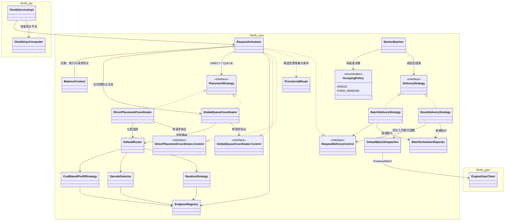
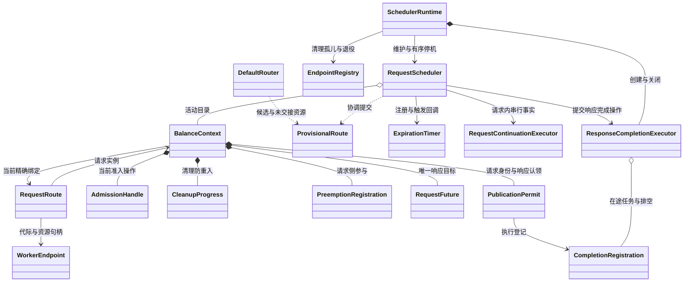
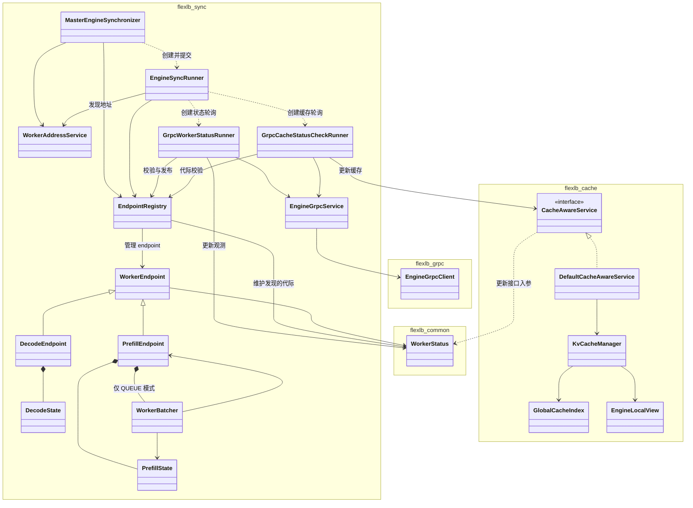
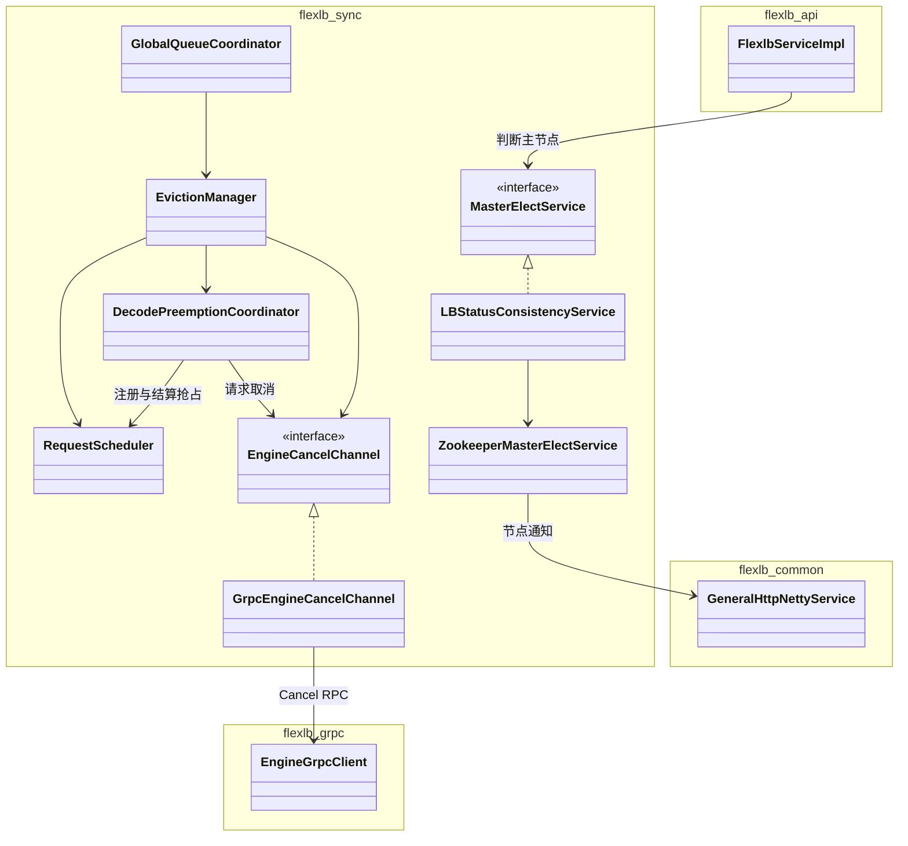
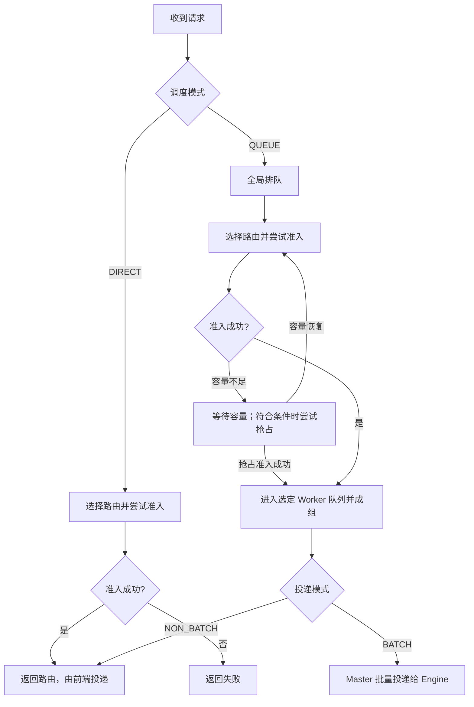
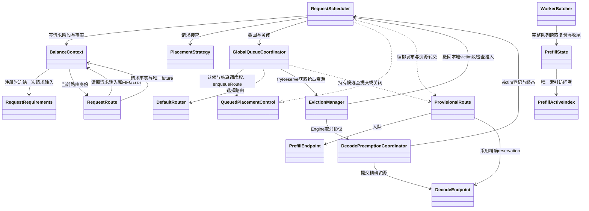

# FlexLB 当前核心类图

当前源码的结构审查与优先改造项见 [当前结构审查](scheduler-design/structure-current-review.md)。
历轮实施记录见 [从所有权看调度类结构](scheduler-design/ownership-class-diagram.md)。

本轮重新核对了请求输入与 DecodeBinding 混合职责、QUEUE Route 的两次资源交接，以及抢占三方所有权。最新结论与改造验收见 [当前结构审查第 5 节](scheduler-design/structure-current-review.md#5-再从类图检查输入资源执行是否放对位置)；此前的 [调度类结构审查](scheduler-design/class-structure-review.md) 作为历史记录。

本文更新至 2026-10-02 的源码结构。请求生命周期由 `BalanceContext` 的行为方法维护；`RequestScheduler` 管理目录及跨对象编排；发现与选路目录由 `EndpointRegistry` 统一管理。图使用 Mermaid `classDiagram`，分组对应 Maven module（将名称中的连字符换为下划线），不是 Java package。

范围：请求入口、调度、请求状态、worker 状态、同步、缓存、抢占和主节点协调。为保持可读性，省略多数配置、指标、DTO、内部类和测试类；未标出的依赖不代表不存在。以下为源码静态关系，不表示运行时调用顺序。

## UML 关系图例

| Mermaid 表示 | UML 含义 | 本文用法 |
| --- | --- | --- |
| `A --> B` | 有向关联 | A 持有 B 的引用 |
| `A ..> B` | 依赖 | A 创建、使用 B，或通过注入函数间接调用 B |
| `A *-- B` | 组合 | A 创建并拥有 B 的实例 |
| `A <\|-- B` | 泛化 | B 继承 A |
| `A <\|.. B` | 实现 | B 实现接口 A |

## 1. 请求入口、调度与投递

职责说明：

- `BalanceContext` 是唯一请求状态拥有者，私有维护阶段、绑定、admission、清理、期限及抢占参与；`RequestScheduler` 负责入口、目录和锁外副作用。
- 路由 publication 在请求锁外，投递资格、期限检查与本地交接在同一请求锁内；响应选择与资源终态独立。
- `DirectPlacementCoordinator` 对已注册请求执行一次立即选路和提交，通过 Scheduler 的请求协议取得准入、提交资源并发布结果。
- `GlobalQueueCoordinator` 管理全局排队与 placement，取得规划资格后才选择路由。
- `WorkerBatcher` 统一消费 `GroupingPolicy` 的 EMPTY/WAIT/READY，保留队列快照复验、容量预留、条件等待和投递事务。路由预测使用快照中同一个策略，组选择与窗口规则不再分叉。
- 两个 Placement Control 是各协调器的嵌套接口；`RouteDelivery` 归 DIRECT 协议。`PlacementConfiguration` 完成装配和队列启动，Scheduler 不再依赖 Router。
- `BatchDeliveryStrategy` 的提交函数由 `DeliveryBindingConfiguration` 绑定到 `DefaultBatchDispatcher`，不是直接持有 dispatcher 字段。

请求内状态与执行设施的关系：

`AdmissionHandle`、`CleanupProgress`、`RequestFuture` 及投递句柄 `DeliveryClaim` 是 Context 的静态嵌套类型；批次和跨 victim 事务仍由原有组件负责。Timer 经 `RequestAccess` 获取关闭门槛、精确目录快照和触发回调，不持有具体 Scheduler。维护每轮读取一次动态 TTL，先清终态记录再清孤儿。整体关闭仍只有 SchedulerRuntime 一个 owner。

## 2. Worker 状态、同步与缓存

当前边界特点：

- `WorkerStatus` 位于 `flexlb-common`，实际包含 generation、锁和生命周期状态，并非普通 DTO。
- `EndpointRegistry` 统一管理发现的 WorkerStatus 代际、可路由 endpoint 的发布与退休，并直接向选路提供快照与 pin。
- `PrefillEndpoint` 与 `WorkerBatcher` 双向关联，状态对象 `PrefillState` 由二者共享引用。
- cache 更新接口接收整个 `WorkerStatus`。缓存索引按地址管理，调用方承担已有的 generation fencing 责任。
- `MasterEngineSynchronizer` 通过 `EngineSyncRunner` 创建具体轮询任务，图中保留这一中间层。

## 3. 抢占取消与主节点协调

`EngineCancelChannel` 返回取消 RPC 的结果；取消确认不等价于资源已释放。请求状态与资源结算仍由调度侧结合终态证据处理。

## 4. 当前 package 对照

以下 package 均以 `org.flexlb` 为前缀。

| Module | 当前 package | 图中主要类 |
| --- | --- | --- |
| flexlb-api | `httpserver` | FlexlbServiceImpl、FlexlbGrpcForwarder |
| flexlb-sync | `balance.scheduler` | RequestScheduler、BalanceContext、GlobalQueueCoordinator、DefaultRouter、WorkerBatcher、BatchDeliveryStrategy、RouteDeliveryStrategy、DefaultBatchDispatcher |
| flexlb-sync | `balance.strategy` | CostBasedPrefillStrategy、DecodeSelector、RandomStrategy |
| flexlb-sync | `balance.endpoint` | EndpointRegistry、WorkerEndpoint、PrefillEndpoint、DecodeEndpoint、PrefillState、DecodeState |
| flexlb-sync | `balance.delivery` | DeliveryStrategy |
| flexlb-sync | `balance.eviction` | EvictionManager、DecodePreemptionCoordinator、EngineCancelChannel、GrpcEngineCancelChannel |
| flexlb-sync | `sync.synchronizer` | MasterEngineSynchronizer |
| flexlb-sync | `sync.runner` | EngineSyncRunner、GrpcWorkerStatusRunner、GrpcCacheStatusCheckRunner |
| flexlb-sync | `service.address` / `service.grpc` | WorkerAddressService / EngineGrpcService |
| flexlb-sync | `consistency` | MasterElectService、LBStatusConsistencyService、ZookeeperMasterElectService |
| flexlb-common | `dao.master` / `transport` | WorkerStatus / GeneralHttpNettyService |
| flexlb-cache | `cache.service` / `cache.service.impl` | CacheAwareService / DefaultCacheAwareService |
| flexlb-cache | `cache.core` | KvCacheManager、GlobalCacheIndex、EngineLocalView |
| flexlb-grpc | `engine.grpc` | EngineGrpcClient |

## 5. 源码入口

- [RequestScheduler](../flexlb-sync/src/main/java/org/flexlb/balance/scheduler/RequestScheduler.java)
- [BalanceContext](../flexlb-sync/src/main/java/org/flexlb/balance/scheduler/BalanceContext.java)
- [EndpointRegistry](../flexlb-sync/src/main/java/org/flexlb/balance/endpoint/EndpointRegistry.java)
- [DeliveryBindingConfiguration](../flexlb-sync/src/main/java/org/flexlb/balance/composition/DeliveryBindingConfiguration.java)
- [PrefillEndpoint](../flexlb-sync/src/main/java/org/flexlb/balance/endpoint/PrefillEndpoint.java)
- [EngineSyncRunner](../flexlb-sync/src/main/java/org/flexlb/sync/runner/EngineSyncRunner.java)
- [CacheAwareService](../flexlb-cache/src/main/java/org/flexlb/cache/service/CacheAwareService.java)
- [EngineCancelChannel](../flexlb-sync/src/main/java/org/flexlb/balance/eviction/EngineCancelChannel.java)
- [LBStatusConsistencyService](../flexlb-sync/src/main/java/org/flexlb/consistency/LBStatusConsistencyService.java)

## 6. 调度决策流程（关键节点）

- 路由选择：按模型所需角色选择 Prefill、Decode 等节点。
- 等待和抢占仅概括 QUEUE 的容量处理；抢占需要满足优先级及资源条件，成功时继续原先选定的路由。
- 图中省略取消、超时、异常和资源清理分支；成组后仍需等待实际投递容量。

## 7. 调度与抢占的所有权收敛（2026-09-25）

以下关系已实施，包含普通路径和抢占恢复路径。

### 已删除的重复流程

- EvictionManager 不再持有 ProvisionalRoute、AdmissionHandle 或投递指标 reporter，
  不执行新请求路由安装、前端失败响应与路由关闭。
- GlobalQueueCoordinator 从选路开始持有同一 AdmissionHandle；抢占异步执行时，
  把它与 ProvisionalRoute 一起转移给 completion，结束时通过 try-with-resources 关闭。
- 普通提交与抢占后提交共用 submitRoute，路由提交指标只在这里记录。
- tryReserve 返回 null 表示未接管（包括本地 victim 冲突），继续原容量等待；
  非 null Future 表示接管，结果提供精确 reservation 或抢占失败详情。
  Engine UNKNOWN 等非成功结果不得被当作未接管重新排队。
- 抢占方案选出后必须检查 isAdmissionOpen。ROUTING 期间已接受取消但 Future 尚未完成时，
  该检查防止继续撤走 victim；也检查 Scheduler 关停。
- completion 挂接前先从 Plan 转移资源，确保立即完成的 Future 不会触发 Plan 二次关闭。
- Prefill 预留句柄直接引用原始请求 owner，不再重复保存请求 ID；批次 ID 唯一性在预留边界检查，
  提交时删除重复全表扫描。最后成员结束之前仍阻止同批次 ID 重用。
- RequestRoute 已删除独立 future 字段，统一读取其精确 Context；注册后 future 不可替换。
- GlobalQueueEntry 也已删除重复 future 字段；全局 `trySubmitRegistered` 从已注册 Context 取得同一 Future。
  Batch 发送优先级使用 RequestRoute 的冻结值，与队列排序和 Decode 准入保持一致。
- 已进一步删除 CommittedAdmissionOwner；事务直接持有 generation handoff 与原成员列表，
  Member 负责精确 Decode permit 的一次转交。finally 先关闭未转交成员，再关闭 handoff；
  Batch 保留原下标和精确请求对象校验，Route/DIRECT 直接使用绑定的 Member。
- Scheduler 已删除五个针对具体 Batch/Route 的准备和认领转发方法，复用现有原子边界。

统一路由提交后为 27,589 行；进一步收敛账本、资源所有权、请求事实与维护入口后，当前 sync 生产 Java 共 25,890 行（最近一轮推迟 NON_BATCH 事务交接，确保准备失败仍可通过 abort 回收；删除 ClaimedRoute 重复请求引用；未通过性能验证的二分查找已撤回）。
行数不代表功能或性能达标；回归与远端结果记录在 scheduler-design/evidence 中。

### 状态归属

| 对象 | 应持有的事实 / 职责 | 不应承担 |
| --- | --- | --- |
| BalanceContext | 输入、七阶段、响应事实、当前路由身份 | 执行抢占、发送、资源释放 |
| RequestScheduler | 事件仲裁、合法迁移、终态与清理 | 具体投递事务内部操作 |
| GlobalQueueCoordinator | 优先级/FIFO、容量等待、选路与提交次序 | Engine Cancel 协议 |
| ProvisionalRoute | 提交前的所选路由与精确资源，关闭时释放未转出的资源 | 请求生命周期事实 |
| RequestRoute | 一次路由的身份、冻结值与资源能力 | 初始化或推进请求阶段 |
| WorkerBatcher | Worker 成组窗口与投递时机 | 全局排队和终态裁决 |
| PrefillState / DecodeState | 资源归属、Engine 观测与容量账本 | 前端响应结果 |
| DecodePreemptionCoordinator | 取消协议及终态证据等待 | 新请求路由安装 |

### 下一处结构候选

1. 已由 RequestScheduler 在原路由创建时点初始化首次 Worker FIFO；RequestRoute 构造器只读取。
   后续检查输入冻结边界，不能提前 FIFO 到全局注册。
2. Decode 账本已合并创建、Engine 观察和终态留存时间，终态由无请求/协议归属推导；
   入队/出队阶段和计数统一更新。继续检查其他账本中的重复状态，核对其全部写入者。
3. Scheduler 按事件收敛重复控制流；不按类长度机械拆出新协调器。

已合并 PrefillState 两个 ACTIVE 终结入口：显式传入 Route lease 时校验并关闭，
无 Route lease 时保留 Batch 准备事务的 lease。已删除仅测试使用的 WorkerBatcher.QueueSnapshot
与 endpoint 转发入口，测试直接读取现有 PrefillActiveIndex.Capture。

DefaultRouter 已移除 ConfigService 依赖与失效的配置回退；请求 Context 的非空配置是
选路输入，PinnedRouting 继续通过 try-with-resources 逆序释放未交出的节点 pin。

SchedulerRuntime 仅保留注入真实 dispatcher 的构造，删除测试专用 no-op 排空入口与
Runnable 适配；Prefill/Decode 指标共用遍历方法，快照和各指标叶子的失败仍独立隔离。

保留以下真实边界：Context 与某次路由的双向身份关联；WorkerBatcher 与资源账本；
优先级队列与容量等待队列；取消 ACK 与资源终态。它们分别回答不同问题，不能用一个阶段替代。

### 选择提交边界复核

WorkerBatcher 保留锁内提交编排；PrefillState 提供精确成员校验和终态边界移除。
删除 Worker 的重复提交标记，事务自身阶段决定是否 abort；异常先解锁再清理。
没有引入 State 调用投递事务的反向依赖或新的 Service 层。
