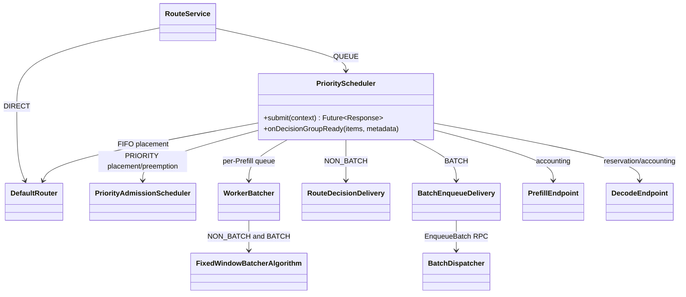
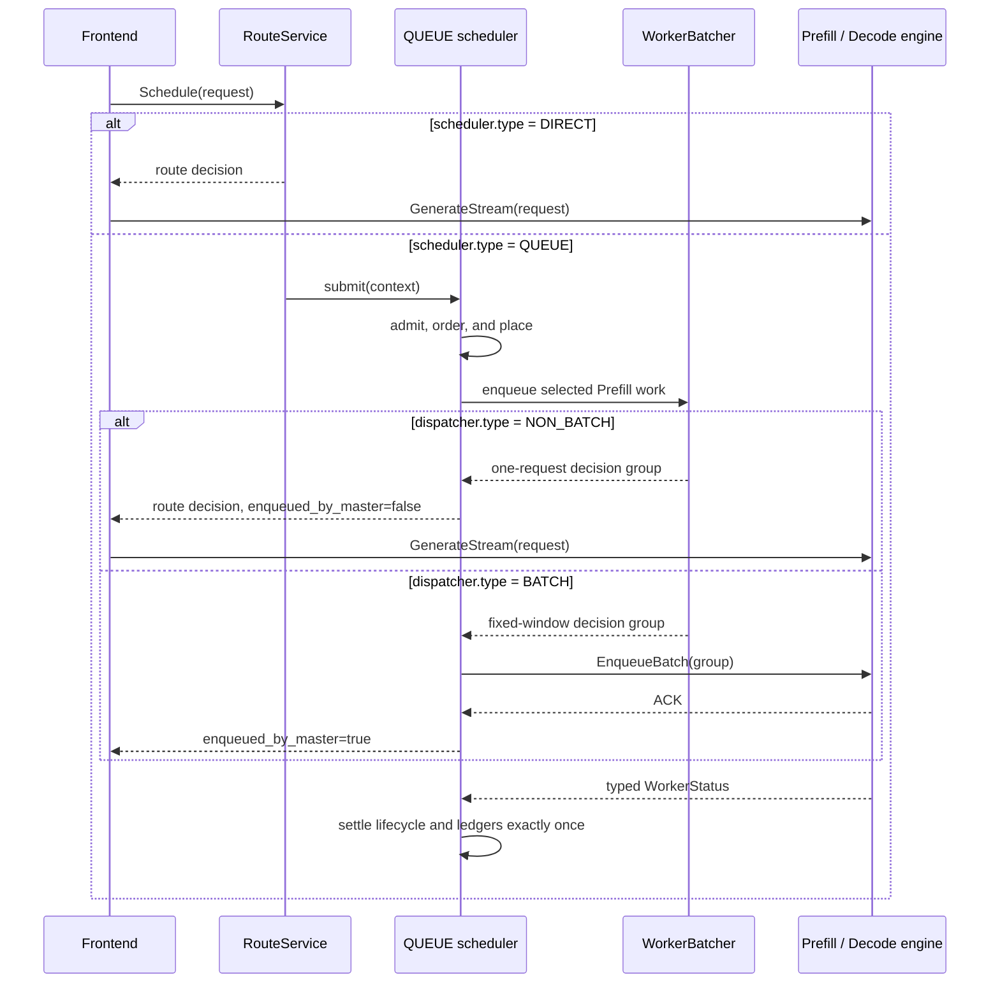

# QUEUE ordering and dispatcher modes

## Purpose

FlexLB exposes three separate configuration decisions in one strict
`FLEXLB_CONFIG` JSON document:

1. `scheduler.type` chooses immediate routing (`DIRECT`) or scheduler-owned
   request lifecycle (`QUEUE`).
2. `scheduler.ordering.type`, present only for `QUEUE`, chooses arrival order
   (`FIFO`) or priority order (`PRIORITY`).
3. `dispatcher.type` chooses one-request route decisions (`NON_BATCH`) or
   Master-side batch enqueue (`BATCH`).

These names are not interchangeable. In particular, `FIFO` is the peer of
`PRIORITY`, `DIRECT` is the peer of `QUEUE`, and `NON_BATCH` is the peer of
`BATCH`. `DIRECT` requires `NON_BATCH`; all four ordering/dispatcher
combinations are valid under `QUEUE`.

The Java class is still named `PriorityScheduler`, but it is the common QUEUE
implementation for both FIFO and PRIORITY. That class name is an implementation
detail, not another public mode.

## Class model



`DIRECT` skips QUEUE admission and `WorkerBatcher`, but it uses the same
`router.groupSelector` and `router.roles` worker-selection configuration as
QUEUE. PDFUSION follows the prefill role configuration.

## Request flow



The two dispatchers differ only in who delivers the request — the frontend calls
`GenerateStream` itself, or the master calls `EnqueueBatch` — and both run the
same decision algorithm on the selected worker queue. `NON_BATCH` decides one
request at a time, so its group is complete on arrival; a request the worker
cannot take yet, because of KV pressure or engine backpressure, waits in the
queue. `BATCH` grows a group up to `dispatcher.maxRequests` and, when configured,
keeps its predicted execution time below
`dispatcher.earlyDispatchPredictedExecutionMs`; it dispatches once either bound
stops growth, or once the picked group's longest-waiting member reaches
`dispatcher.maxCollectionWaitMs`. A single-request group is never incomplete, so
`NON_BATCH` has no window to spend. There is no SLO-budget batching policy.

## Ordering and expiration

FIFO orders by enqueue sequence. PRIORITY orders by normalized priority
(1–100, higher first) and then by enqueue sequence. `defaultPriority` is used
only when the caller did not supply a priority.

PRIORITY does not create a separate request TTL. QUEUE resolves one absolute
scheduling expiration from the public configuration:

```text
expires_at_ms = flexlb_admission_time_ms + scheduler.queueTimeoutMs
```

The deadline covers queueing, routing, and delivery acknowledgement. Prompt
length, priority, queue movement, retries, and preemption never extend or
multiply it. DIRECT does not queue and therefore does not apply a scheduling
timeout. The caller's protobuf `generate_timeout` remains a transport/engine
field and does not control FlexLB scheduling. Consequently there are no SLO
length buckets, SLO budgets, or priority TTL multipliers to configure.

## Configuration reference

Only `FLEXLB_CONFIG` controls these behaviors. The parser rejects unknown and
inactive-variant fields, so fields listed for one tagged type cannot be placed
on another type. Optional fields are disabled by omission; JSON `null` is not
accepted.

### Scheduler

| JSON path | Applies to | Default | Meaning |
| --- | --- | ---: | --- |
| `scheduler.type` | all | `QUEUE` | `DIRECT` or `QUEUE` |
| `scheduler.queueTimeoutMs` | `QUEUE` | `3600000` ms | Total scheduling lifetime from FlexLB admission through delivery acknowledgement |
| `scheduler.ordering.type` | `QUEUE` | `FIFO` | `FIFO` or `PRIORITY` |
| `scheduler.ordering.defaultPriority` | `QUEUE + PRIORITY` | `50` | Fallback priority in `[1, 100]` |
| `scheduler.capacity.maxOutstandingRequestsGlobal` | `QUEUE` | `100000` | Exact cluster-wide cap on requests owned by QUEUE |
| `scheduler.lifecycle.staleInflightTimeoutMs` | `QUEUE` | `300000` ms | Stale inflight reconciliation bound |
| `scheduler.lifecycle.deliveredNotAcceptedTimeoutMs` | `QUEUE` | `30000` ms | Bound before reconciling work delivered but not accepted by Decode |
| `scheduler.lifecycle.maxDeliveredNotAcceptedRequestsGlobal` | `QUEUE` | `200` | Global post-delivery ownership guard |

FIFO has no additional fields. PRIORITY can optionally contain
`scheduler.ordering.preemption`:

| JSON path | Default | Meaning |
| --- | ---: | --- |
| `allowedVictimStages` | omitted | Non-empty subset of `PREFILL_QUEUED`, `DECODE_RESERVED`, and `DECODE_ENGINE_OWNED` |
| `engineCancellation.ackTimeoutMs` | `50` ms | Cancel RPC acknowledgement bound |
| `engineCancellation.completionTimeoutMs` | `1000` ms | Typed cancellation completion bound |

`engineCancellation` is required when `DECODE_ENGINE_OWNED` is allowed and is
rejected otherwise. Omit the whole `preemption` object to disable preemption.

### Dispatcher

| JSON path | Applies to | Default | Meaning |
| --- | --- | ---: | --- |
| `dispatcher.type` | all | `BATCH` | `BATCH` or `NON_BATCH`; DIRECT requires `NON_BATCH` |
| `dispatcher.maxRequests` | `BATCH` | `8` | Maximum requests in one decision group |
| `dispatcher.maxCollectionWaitMs` | `BATCH` | `300` ms | Maximum fixed-window collection wait; zero is allowed |
| `dispatcher.maxWaitingRequestsPerPrefillWorker` | `BATCH` | `1024` | Hard per-Prefill waiting-queue bound |
| `dispatcher.earlyDispatchPredictedExecutionMs` | `BATCH` | omitted | Optional positive predicted-execution budget capping batch growth |
| `dispatcher.maxInflightBatchesPerPrefillWorker` | `BATCH` | omitted | Optional positive per-Prefill EnqueueBatch backpressure cap |
| `dispatcher.enqueueRpcTimeoutMs` | `BATCH` | `5000` ms | EnqueueBatch RPC timeout |
| `dispatcher.maxInflightRequestsPerPrefillWorker` | `QUEUE + NON_BATCH` | omitted | Optional positive per-Prefill route-decision cap |

The two optional inflight limits use omission, not zero, to mean unlimited.

## Valid examples

DIRECT with the default role routing configuration:

```json
{
  "schemaVersion": 1,
  "scheduler": {"type": "DIRECT"},
  "dispatcher": {"type": "NON_BATCH"}
}
```

FIFO QUEUE with one immediate route decision per request:

```json
{
  "schemaVersion": 1,
  "scheduler": {
    "type": "QUEUE",
    "queueTimeoutMs": 3600000,
    "ordering": {"type": "FIFO"},
    "capacity": {"maxOutstandingRequestsGlobal": 100000},
    "lifecycle": {
      "staleInflightTimeoutMs": 300000,
      "deliveredNotAcceptedTimeoutMs": 30000,
      "maxDeliveredNotAcceptedRequestsGlobal": 200
    }
  },
  "dispatcher": {
    "type": "NON_BATCH",
    "maxInflightRequestsPerPrefillWorker": 32
  }
}
```

PRIORITY QUEUE with fixed-window batching:

```json
{
  "schemaVersion": 1,
  "scheduler": {
    "type": "QUEUE",
    "queueTimeoutMs": 3600000,
    "ordering": {
      "type": "PRIORITY",
      "defaultPriority": 50,
      "preemption": {
        "allowedVictimStages": ["PREFILL_QUEUED", "DECODE_RESERVED"]
      }
    },
    "capacity": {"maxOutstandingRequestsGlobal": 100000},
    "lifecycle": {
      "staleInflightTimeoutMs": 300000,
      "deliveredNotAcceptedTimeoutMs": 30000,
      "maxDeliveredNotAcceptedRequestsGlobal": 200
    }
  },
  "dispatcher": {
    "type": "BATCH",
    "maxRequests": 32,
    "maxCollectionWaitMs": 160,
    "maxWaitingRequestsPerPrefillWorker": 1024,
    "earlyDispatchPredictedExecutionMs": 500,
    "maxInflightBatchesPerPrefillWorker": 2,
    "enqueueRpcTimeoutMs": 5000
  }
}
```

The role-local prefill, decode, and VIT selectors shown in the top-level
[README](../README.md) can be added unchanged to any of these valid modes.

## Accounting and concurrency invariants

1. `scheduler.capacity.maxOutstandingRequestsGlobal` is acquired atomically and
   released exactly once across failure, cancellation, timeout, rollback, and
   shutdown.
2. `PrefillEndpoint.inflightBatches` contains only real `EnqueueBatch`
   operations. NON_BATCH route decisions use a request-keyed ledger instead of
   synthetic singleton batches.
3. Decode reservation and accounting remain request-keyed in both dispatcher
   modes.
4. A request captures its delivery mode at admission. An inflight request cannot
   switch ownership protocol.
5. Lifecycle, preemption, and post-delivery claims are mutually exclusive under
   the request-scoped state boundary.
6. Prefill/Decode resources are released only after an authoritative terminal
   status or cancellation proof. Cleanup paths are idempotent.
7. The absolute request expiration remains unchanged through queueing,
   preemption, delivery, and reconciliation.

## Mode matrix

| Scheduler | Ordering | Dispatcher | Scheduling path | Delivery |
| --- | --- | --- | --- | --- |
| `DIRECT` | — | `NON_BATCH` | `DefaultRouter` | Immediate route response; frontend sends |
| `QUEUE` | `FIFO` | `NON_BATCH` | Common QUEUE lifecycle, FIFO placement | One route response; frontend sends |
| `QUEUE` | `PRIORITY` | `NON_BATCH` | Priority admission/preemption | One route response; frontend sends |
| `QUEUE` | `FIFO` | `BATCH` | Common QUEUE lifecycle, FIFO placement | Master `EnqueueBatch` |
| `QUEUE` | `PRIORITY` | `BATCH` | Priority admission/preemption | Master `EnqueueBatch` |

`DIRECT + BATCH` is rejected during configuration validation.
