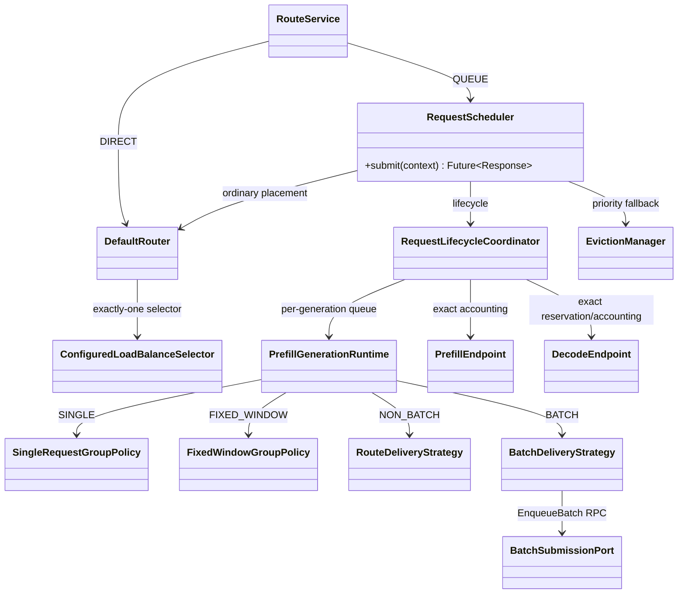
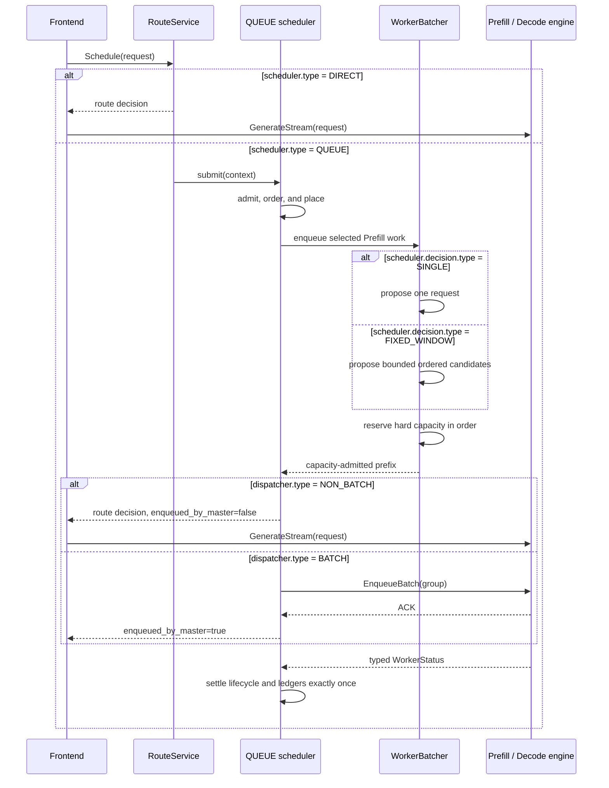

# QUEUE ordering, decision, and dispatcher modes

## Purpose

FlexLB exposes the scheduler plus three independent QUEUE axes in one strict
`FLEXLB_CONFIG` JSON document:

1. `scheduler.type` chooses immediate routing (`DIRECT`) or scheduler-owned
   request lifecycle (`QUEUE`).
2. `scheduler.ordering.type`, present only for `QUEUE`, chooses arrival order
   (`FIFO`) or priority order (`PRIORITY`).
3. `scheduler.decision.type`, present only for `QUEUE`, chooses one request per
   decision (`SINGLE`) or bounded group formation (`FIXED_WINDOW`).
4. `dispatcher.type` chooses frontend delivery (`NON_BATCH`) or Master-side
   `EnqueueBatch` delivery (`BATCH`).

These names are not interchangeable. `FIFO` is the peer of `PRIORITY`, `SINGLE`
is the peer of `FIXED_WINDOW`, and `NON_BATCH` is the peer of `BATCH`. `DIRECT`
requires `NON_BATCH` and cannot configure a decision policy. Every
ordering/decision/dispatcher combination is valid under `QUEUE`.

`RequestScheduler` is the public QUEUE facade for both FIFO and PRIORITY.
`RequestLifecycleCoordinator` owns the exact request lifecycle, while the
ordering-specific admission and preemption ports stay behind that facade. The
Java type names therefore match the configuration model; there is no separate
"priority scheduler" service.

## Class model



`DIRECT` skips QUEUE admission and the per-generation queue runtime, but it uses the same
`router.groupSelector` and `router.roles` worker-selection configuration as
QUEUE. PDFUSION follows the prefill role configuration.

## Request flow



The decision policy and dispatcher answer different questions. `SINGLE`
proposes one request. `FIXED_WINDOW` grows an ordered homogeneous candidate
group up to
`scheduler.decision.maxRequests`, waits at most
`scheduler.decision.maxCollectionWaitMs`, and optionally refuses to add another
request when the resulting group's prediction would exceed the strict
`scheduler.decision.maxPredictedExecutionMs` growth cap. A request is
indivisible, so a singleton whose own prediction exceeds the cap is still a
valid candidate. Reaching the prediction cap stops collection immediately
instead of waiting for the collection window.

Candidates are not a final decision. The worker reserves hard capacity from the
front in order. Only the largest successfully reserved prefix becomes a
committed delivery group; the unreserved suffix remains `ACTIVE` with its
original ordering key. The delivery strategy then chooses who sends the group:
the frontend calls `GenerateStream` for `NON_BATCH`, while the Master calls
`EnqueueBatch` for `BATCH`.

Waiting is event driven. Group policies return the exact resource event,
queue/status/model generation, or absolute collection/expiration deadline that
can change their answer. They do not sleep and retry on a fixed polling interval.

Setting `maxCollectionWaitMs` to zero removes the collection delay, but candidate
selection still includes as many currently available requests as its other
bounds allow. Use `SINGLE` when every decision must contain exactly one request.

A request the worker cannot take yet because of KV pressure or engine
backpressure remains QUEUE-owned. There is no SLO-budget batching policy.

The current online `LEARNING` estimator updates from completed `EnqueueBatch`
groups. NON_BATCH decisions can read its published model, but route-request
terminals do not contribute training samples; use a `FORMULA` estimator when a
stable prediction cap is required for `FIXED_WINDOW + NON_BATCH`.

## Ordering and expiration

FIFO orders by enqueue sequence. PRIORITY orders by normalized priority
(1–100, higher first) and then by enqueue sequence. `defaultPriority` is used
only when the caller did not supply a priority.

Ordering is scoped to one Prefill generation runtime. Its ordered snapshot is the
selection boundary for one decision. A queue insertion that linearizes after
that snapshot belongs to the next decision and does not revoke the captured
group. Removal or expiration of a member that would enter the admitted prefix,
or replacement of the predictor generation, revokes that prefix before
admission. After the reservation scan has fixed a valid prefix, changes limited
to its unreserved suffix do not revoke that prefix. Delivery callbacks
are serialized by the one worker thread; asynchronous Engine ACK/completion
order is not a FIFO or priority guarantee.

For example, suppose the captured order is `[A, B, C]` and exact capacity can be
reserved for `A` and `B`, but not `C`. The final callback receives `[A, B]`; `C`
never leaves `ACTIVE`. If `A` itself cannot reserve capacity, there is no
decision and no callback: the worker waits for `A`'s exact resource event, so
`B` and `C` do not bypass it. An admitted callback already owns its exact hard
capacity and never returns a request to `ACTIVE`.

PRIORITY does not create a separate request TTL. QUEUE resolves one absolute
scheduling expiration from the public configuration:

```text
expires_at_ms = flexlb_admission_time_ms + scheduler.queueTimeoutMs
```

The deadline covers queueing, routing, and delivery acknowledgement. Prompt
length, priority, queue movement, retries, and preemption never extend or
multiply it. DIRECT does not queue and therefore does not apply a scheduling
timeout. The caller's protobuf `generate_timeout` remains a transport/engine
field and does not control FlexLB scheduling. Consequently there are no SLO
length buckets, SLO budgets, or priority TTL multipliers to configure.

## Configuration reference

Only `FLEXLB_CONFIG` controls these behaviors. The parser rejects unknown and
inactive-variant fields, so fields listed for one tagged type cannot be placed
on another type. Optional fields are disabled by omission; JSON `null` is not
accepted.

### Scheduler

| JSON path | Applies to | Default | Meaning |
| --- | --- | ---: | --- |
| `scheduler.type` | all | `QUEUE` | `DIRECT` or `QUEUE` |
| `scheduler.queueTimeoutMs` | `QUEUE` | `3600000` ms | Total scheduling lifetime from FlexLB admission through delivery acknowledgement |
| `scheduler.ordering.type` | `QUEUE` | `FIFO` | `FIFO` or `PRIORITY` |
| `scheduler.ordering.defaultPriority` | `QUEUE + PRIORITY` | `50` | Fallback priority in `[1, 100]` |
| `scheduler.decision.type` | `QUEUE` | `FIXED_WINDOW` | `SINGLE` or `FIXED_WINDOW` |
| `scheduler.decision.maxRequests` | `QUEUE + FIXED_WINDOW` | `8` | Maximum requests in one decision group |
| `scheduler.decision.maxCollectionWaitMs` | `QUEUE + FIXED_WINDOW` | `300` ms | Maximum collection wait; zero is allowed |
| `scheduler.decision.maxPredictedExecutionMs` | `QUEUE + FIXED_WINDOW` | omitted | Optional positive inclusive group-growth cap; reaching it dispatches immediately, and an indivisible singleton may exceed it |
| `scheduler.capacity.maxOutstandingRequestsGlobal` | `QUEUE` | `100000` | Exact cluster-wide cap on requests owned by QUEUE |
| `scheduler.capacity.maxWaitingRequestsPerPrefillWorker` | `QUEUE` | `1024` | Positive hard bound for each Prefill waiting queue |
| `scheduler.lifecycle.staleInflightTimeoutMs` | `QUEUE` | `300000` ms | Stale inflight reconciliation bound |
| `scheduler.lifecycle.deliveredNotAcceptedTimeoutMs` | `QUEUE` | `30000` ms | Bound before reconciling work delivered but not accepted by Decode |
| `scheduler.lifecycle.maxDeliveredNotAcceptedRequestsGlobal` | `QUEUE` | `200` | Global post-delivery ownership guard |

FIFO has no additional fields. PRIORITY can optionally contain
`scheduler.ordering.preemption`:

| JSON path | Default | Meaning |
| --- | ---: | --- |
| `allowedVictimStages` | omitted | Non-empty subset of `PREFILL_QUEUED`, `DECODE_RESERVED`, and `DECODE_ENGINE_OWNED` |
| `engineCancellation.ackTimeoutMs` | `50` ms | Cancel RPC acknowledgement bound |
| `engineCancellation.completionTimeoutMs` | `1000` ms | Typed cancellation completion bound |

`engineCancellation` is required when `DECODE_ENGINE_OWNED` is allowed and is
rejected otherwise. Omit the whole `preemption` object to disable preemption.

Schema v2 gives every setting exactly one owner. `scheduler.decision` owns group
formation and defaults to `FIXED_WINDOW`; it is independent of who delivers the
group. `scheduler.capacity` owns queue bounds. `dispatcher` owns only delivery
and its backpressure limits. Select `SINGLE` explicitly instead of relying on a
dispatcher type to choose a decision policy.

An explicitly declared `schemaVersion: 1` passes through a startup-only migration
before the strict schema-v2 bind. Omitted `schemaVersion` is interpreted as v2;
unsupported explicit versions are rejected. For v1 QUEUE documents, omitted
decision policy maps to `SINGLE` for `NON_BATCH` and `FIXED_WINDOW` for `BATCH`.
The v1 BATCH fields `maxRequests` and `maxCollectionWaitMs` move to
`scheduler.decision`, and `maxWaitingRequestsPerPrefillWorker` moves to
`scheduler.capacity`. If those canonical owners were already explicit in v1,
they keep precedence; shadowed legacy values are still validated before removal.

Neither v1 prediction boundary is automatically migrated. The legacy
`earlyDispatchPredictedExecutionMs` leaves an additional member queued when its
prediction equals the threshold. A v1 explicit `maxPredictedExecutionMs` keeps
that equal member but does not release solely because equality was reached. The
v2 cap keeps the equal member and immediately releases the group. Startup
rejects both lossy cases; the operator must use schema v2 and confirm the
inclusive cap semantics. After migration, only the canonical schema-v2 runtime
model exists.

### Dispatcher

| JSON path | Applies to | Default | Meaning |
| --- | --- | ---: | --- |
| `dispatcher.type` | all | `BATCH` | `BATCH` or `NON_BATCH`; DIRECT requires `NON_BATCH` |
| `dispatcher.maxInflightBatchesPerPrefillWorker` | `BATCH` | omitted | Optional positive per-Prefill EnqueueBatch backpressure cap |
| `dispatcher.enqueueRpcTimeoutMs` | `BATCH` | `5000` ms | EnqueueBatch RPC timeout |
| `dispatcher.maxInflightRequestsPerPrefillWorker` | `QUEUE + NON_BATCH` | omitted | Optional positive per-Prefill route-decision cap |

The two optional inflight limits use omission, not zero, to mean unlimited.
Decision-group and waiting-queue parameters are rejected under `dispatcher`.

## Valid examples

DIRECT with the default role routing configuration:

```json
{
  "schemaVersion": 2,
  "scheduler": {"type": "DIRECT"},
  "dispatcher": {"type": "NON_BATCH"}
}
```

The four minimal FIFO QUEUE combinations make the independent axes explicit.

SINGLE decision, frontend delivery:

```json
{
  "schemaVersion": 2,
  "scheduler": {
    "type": "QUEUE",
    "ordering": {"type": "FIFO"},
    "decision": {"type": "SINGLE"}
  },
  "dispatcher": {"type": "NON_BATCH"}
}
```

SINGLE decision, Master delivery:

```json
{
  "schemaVersion": 2,
  "scheduler": {
    "type": "QUEUE",
    "ordering": {"type": "FIFO"},
    "decision": {"type": "SINGLE"}
  },
  "dispatcher": {"type": "BATCH"}
}
```

FIXED_WINDOW decision, frontend delivery:

```json
{
  "schemaVersion": 2,
  "scheduler": {
    "type": "QUEUE",
    "ordering": {"type": "FIFO"},
    "decision": {
      "type": "FIXED_WINDOW",
      "maxRequests": 8,
      "maxCollectionWaitMs": 300
    }
  },
  "dispatcher": {"type": "NON_BATCH"}
}
```

FIXED_WINDOW decision, Master delivery:

```json
{
  "schemaVersion": 2,
  "scheduler": {
    "type": "QUEUE",
    "ordering": {"type": "FIFO"},
    "decision": {
      "type": "FIXED_WINDOW",
      "maxRequests": 8,
      "maxCollectionWaitMs": 300
    }
  },
  "dispatcher": {"type": "BATCH"}
}
```

A fuller PRIORITY example with explicit FIXED_WINDOW decision and BATCH delivery:

```json
{
  "schemaVersion": 2,
  "scheduler": {
    "type": "QUEUE",
    "queueTimeoutMs": 3600000,
    "ordering": {
      "type": "PRIORITY",
      "defaultPriority": 50,
      "preemption": {
        "allowedVictimStages": ["PREFILL_QUEUED", "DECODE_RESERVED"]
      }
    },
    "decision": {
      "type": "FIXED_WINDOW",
      "maxRequests": 32,
      "maxCollectionWaitMs": 160,
      "maxPredictedExecutionMs": 500
    },
    "capacity": {
      "maxOutstandingRequestsGlobal": 100000,
      "maxWaitingRequestsPerPrefillWorker": 1024
    },
    "lifecycle": {
      "staleInflightTimeoutMs": 300000,
      "deliveredNotAcceptedTimeoutMs": 30000,
      "maxDeliveredNotAcceptedRequestsGlobal": 200
    }
  },
  "dispatcher": {
    "type": "BATCH",
    "maxInflightBatchesPerPrefillWorker": 2,
    "enqueueRpcTimeoutMs": 5000
  }
}
```

The role-local prefill, decode, and VIT selectors shown in the top-level
[README](../README.md) can be added unchanged to any of these valid modes.

## Accounting and concurrency invariants

1. `scheduler.capacity.maxOutstandingRequestsGlobal` is acquired atomically and
   released exactly once across failure, cancellation, timeout, rollback, and
   shutdown.
2. Under QUEUE, `PrefillEndpoint.inflightBatches` contains only real
   `EnqueueBatch` operations. NON_BATCH route decisions use a request-keyed
   ledger instead of synthetic singleton batches.
3. Decode reservation and accounting remain request-keyed in both dispatcher
   modes.
4. A request captures its delivery mode at admission. An inflight request cannot
   switch ownership protocol.
5. Lifecycle, preemption, and post-delivery claims are mutually exclusive under
   the request-scoped state boundary.
6. Prefill/Decode resources are released only after an authoritative terminal
   status or cancellation proof. Cleanup paths are idempotent.
7. The absolute request expiration remains unchanged through queueing,
   preemption, delivery, and reconciliation.
8. The decision policy produces candidates, not a capacity-free intermediate
   state. Capacity admission reserves the largest ordered prefix. A head whose
   hard capacity is unavailable remains `ACTIVE` with its original FIFO/priority
   key; no callback is invoked and no suffix member bypasses it.
9. A request enters the delivery callback only after all of its hard capacity
   is reserved. The typed callback payload transfers that exact reservation to
   endpoint lifecycle ownership without another capacity check. A transferred
   Decode permit never returns to queued ownership.
10. For `QUEUE + BATCH`, admission atomically owns both one captured
    `maxInflightBatchesPerPrefillWorker` slot and one task already accepted by
    the bounded local dispatcher. Before the admitted members leave `ACTIVE`,
    they enter callback-owned Prefill load accounting. Load snapshots remain
    conservative until the callback either transfers that ownership into the
    canonical committed-batch ledger or releases it after a terminal failure. Filling
    the accepted dispatcher task performs no second executor-capacity check.
    The endpoint slot remains owned through transport-unknown and protected
    survivor states, and batch settlement signals the exact blocked resource.
    DIRECT requests remain in the separate request-keyed ledger.
11. A callback exception is terminal for every member it did not transfer. The
    callback is never retried and no member returns to the active queue.
12. Batch-load publication is established before `ACTIVE` removal. A typed
    publication failure terminalizes the reserved prefix exactly once. The first
    unreserved terminal boundary is consumed by the same rule as the normal
    path: `AdmissionFailed` is removed and reported with its own cause,
    `OwnershipLost` is removed without a second terminal callback, and only
    `CapacityUnavailable` remains `ACTIVE`.
13. Collection, worker-shape, and prediction waits are versioned condition
    waits. WorkerStatus changes publish the scheduling-input generation;
    online learning publishes it only when a new predictor generation is
    installed. A signal that arrives before the worker begins waiting changes
    the captured generation, so it cannot be lost.
14. Expiration and permanent token-shape rejection claim one `ACTIVE` item by
    removing it under the queue lock, then invoke one item-scoped terminal
    reducer outside the lock. A terminal observer failure is logged and cannot
    stop or drain unrelated requests on that worker.

## Mode matrix

| Scheduler | Ordering | Decision | Dispatcher | Delivery |
| --- | --- | --- | --- | --- |
| `DIRECT` | — | — | `NON_BATCH` | Immediate route response; frontend sends |
| `QUEUE` | `FIFO` | `SINGLE` | `NON_BATCH` | FIFO singleton route response; frontend sends |
| `QUEUE` | `FIFO` | `SINGLE` | `BATCH` | FIFO singleton `EnqueueBatch`; Master sends |
| `QUEUE` | `FIFO` | `FIXED_WINDOW` | `NON_BATCH` | FIFO grouped decisions; frontend sends each request |
| `QUEUE` | `FIFO` | `FIXED_WINDOW` | `BATCH` | FIFO grouped `EnqueueBatch`; Master sends |
| `QUEUE` | `PRIORITY` | `SINGLE` | `NON_BATCH` | Priority singleton route response; frontend sends |
| `QUEUE` | `PRIORITY` | `SINGLE` | `BATCH` | Priority singleton `EnqueueBatch`; Master sends |
| `QUEUE` | `PRIORITY` | `FIXED_WINDOW` | `NON_BATCH` | Priority grouped decisions; frontend sends each request |
| `QUEUE` | `PRIORITY` | `FIXED_WINDOW` | `BATCH` | Priority grouped `EnqueueBatch`; Master sends |

`DIRECT + BATCH` and `DIRECT + decision` are rejected during strict
configuration parsing/validation.

## na130_online production validation (2026-08-23 to 2026-08-24)

This section records deployment-specific measurements. It is evidence for
choosing a mode on the `na130_online` DeepSeekV4-Flash workload, not a replacement
for the schema-v2 reference above.

The test changed only the two Master replicas of deployment
`6a8550b317a1bf6227c9a464`. Prefill, Decode, and Frontend images and resources
were unchanged. The Master image was:

```text
hub.docker.alibaba-inc.com/isearch/flexlb:0.2.0_0.2.0_2026_08_23_22_08_739a87e57_accelerated
```

The deployment still used the image's schema-v1 compatibility parser. The
current source tree and the examples in this document use schema v2; the exact
recorded v1 payload is accepted only through the startup migration described
above. New configurations should use schema v2 directly. During this test the
legacy `FLEXLB_CONFIG` and `NON_BATCH_FLEXLB_CONFIG` environment variables were
kept identical. A sample was considered stable only after both Master replicas
reported `SVT_AVAILABLE`, `HT_ALIVE`, `WT_READY`, and `更新完成`.

### Results

| Mode and important settings | Sample | Input / success QPS | Prefill QPS | Context token / wall TPS | TTFT mean / p95 | Result |
| --- | ---: | ---: | ---: | ---: | ---: | --- |
| `PRIORITY + SINGLE + NON_BATCH`; Prefill pending bound `64`; Decode `maxEngineRequests=256` | stable 10 min | `195 / 139` | `141` | `123K / 128K` | `1.54s / 2.69s` | Pass; production recommendation |
| `FIFO + SINGLE + NON_BATCH`; Prefill pending bound `64`; Decode `maxEngineRequests=256` | stable 10 min | `196 / 89.7` | `144` | `123K / 128K` | `1.76s / 2.85s` | Fail; `8402_MASTER_NO_PREFILL_WORKER=107 QPS` |
| `FIFO + SINGLE + NON_BATCH`; route bound opened, `queueTimeoutMs=1000` | early stop | `185 / 143` | about `143` | not retained as a stable sample | `4.06s / 5.71s` | Fail; throughput recovered by queueing inside Prefill, but TTFT did not |
| `FIFO + FIXED_WINDOW + BATCH`; `8` requests, `400ms`, `6` inflight batches, `queueTimeoutMs=1000` | 95 s, early stop | `190 / 101` | `104` | `95.8K / 95.4K` | `1.95s / 3.27s` | Fail; Context TPS was 22-25% below the passing baseline |
| `DIRECT + NON_BATCH` | compatibility check only | - | - | - | - | Not supported by the deployed schema-v1 runtime; the first replacement became unhealthy and was rolled back |

The passing PRIORITY sample rejected excess load as
`8431_RESOURCE_EXHAUSTED` at about `52 QPS`; it did not report Master
`NO_PREFILL_WORKER` or Decode placement errors. After all experiments, the
deployment was restored to this mode. A post-rollback one-minute check measured
Prefill streaming QPS `141`, Context token/wall TPS `123K/128K`, running streams
`31.8`, and TTFT mean/p95 `1.64s/2.70s`.

The FIFO ten-minute sample is an important counterexample: healthy Context TPS
does not mean healthy scheduling. Prefill remained full, but about 107 requests
per second were rejected before entering Prefill, so success QPS fell to 89.7.

### Why the FIFO NON_BATCH tuning failed

The deployed ordinary FIFO path selected a Prefill before putting the request
into its worker queue. `router.roles.prefill.availability.maxPendingRequests`
therefore acted as a routing-time hard gate:

1. Bounds `64` and `128` produced roughly the same `8402` rejection rate.
2. Opening the Prefill bound and setting global outstanding capacity to `128`
   changed the failure to about `98 QPS` of `8502_ROUTER_QUEUE_FULL`; TTFT rose
   to `4.00s/6.61s` and success QPS stayed near `94`.
3. Raising that global capacity to `256` produced about `110` success QPS but
   TTFT rose to `4.61s/8.52s`.
4. Opening global capacity and using a one-second scheduling timeout restored
   about `143` success QPS, but already-delivered requests accumulated in the
   Prefill-local queue and TTFT remained `4.06s/5.71s`.

Consequently the legacy runtime cannot provide all three properties under this
sustained overload: FIFO queueing, full Context throughput, and low TTFT. It
needs the schema-v2 queue/capacity design described by this document; changing a
legacy limit alone only moves pressure among routing rejection, Master queueing,
and Prefill-local queueing.

### BATCH tuning boundary

The following values were tried before stopping the BATCH experiment:

| `maxRequests` | Collection window | Prediction cap | Inflight batches / Prefill | Observed result |
| ---: | ---: | ---: | ---: | --- |
| `8` | `20ms` | `500ms` | `2` | TTFT `1.21s/1.72s`, but Prefill QPS only `108` |
| `8` | `20ms` | `500ms` | `3` | TTFT `1.34s/2.06s`, Prefill QPS about `110` |
| `8` | `20ms` | `500ms` | `4` | TTFT `1.55s/2.34s`, Prefill QPS about `112` |
| `8` | `100ms` | omitted | `4` | Context token/wall TPS `96.2K/96.9K` |
| `8` | `100ms` | omitted | `6` | Running streams stayed near `7.25`; Context TPS stayed near `96K` |
| `8` | `400ms` | omitted | `6` | Prefill QPS `104`, Context token/wall TPS `95.8K/95.4K`, TTFT `1.95s/3.27s` |

The 20ms setting could not fill a group after traffic was divided across two
Masters and five Prefill workers. Increasing the window and inflight limit did
not recover Context TPS: physical running streams stayed around 7.5 instead of
the NON_BATCH baseline of about 32. This long, heterogeneous-prompt workload is
therefore a poor fit for rigid Master-created Prefill batches. `SINGLE + BATCH`
was not tested because it adds the same Master delivery protocol without
amortizing multiple requests; it is a transport diagnostic, not a production
mode for this deployment.

### Deployment configuration choices

Use these schema-v2 mode documents as the starting points for this workload.
The worker-selection formulas may be merged from the deployment's existing
`router` block. Keep Decode `maxEngineRequests=256` in every variant. This is a
Master Engine-facing ownership cap, not the Decode Engine's physical running
concurrency: it includes both `KV_ALLOCATED` and `RUNNING` tasks plus the narrow
dispatch handoff. With the Engine running limit at 128, 256 retains about one
additional accepted pipeline window instead of limiting the total to 128.

Recommended production mode:

```json
{
  "schemaVersion": 2,
  "scheduler": {
    "type": "QUEUE",
    "queueTimeoutMs": 60000,
    "ordering": {"type": "PRIORITY", "defaultPriority": 50},
    "decision": {"type": "SINGLE"},
    "capacity": {
      "maxOutstandingRequestsGlobal": 500000,
      "maxWaitingRequestsPerPrefillWorker": 64
    },
    "lifecycle": {
      "staleInflightTimeoutMs": 300000,
      "deliveredNotAcceptedTimeoutMs": 30000,
      "maxDeliveredNotAcceptedRequestsGlobal": 500000
    }
  },
  "dispatcher": {
    "type": "NON_BATCH",
    "maxInflightRequestsPerPrefillWorker": 128
  },
  "router": {
    "roles": {
      "decode": {"availability": {"maxEngineRequests": 256}}
    }
  }
}
```

FIFO queueing with frontend delivery is a valid schema-v2 mode, but it must be
revalidated on a schema-v2 image before production use:

```json
{
  "schemaVersion": 2,
  "scheduler": {
    "type": "QUEUE",
    "queueTimeoutMs": 1000,
    "ordering": {"type": "FIFO"},
    "decision": {"type": "SINGLE"},
    "capacity": {
      "maxOutstandingRequestsGlobal": 500000,
      "maxWaitingRequestsPerPrefillWorker": 64
    }
  },
  "dispatcher": {
    "type": "NON_BATCH",
    "maxInflightRequestsPerPrefillWorker": 128
  },
  "router": {
    "roles": {
      "decode": {"availability": {"maxEngineRequests": 256}}
    }
  }
}
```

The least-bad tested BATCH boundary is retained only as a reproducible
diagnostic. It is not a recommendation for this workload:

```json
{
  "schemaVersion": 2,
  "scheduler": {
    "type": "QUEUE",
    "queueTimeoutMs": 1000,
    "ordering": {"type": "FIFO"},
    "decision": {
      "type": "FIXED_WINDOW",
      "maxRequests": 8,
      "maxCollectionWaitMs": 400
    },
    "capacity": {
      "maxOutstandingRequestsGlobal": 500000,
      "maxWaitingRequestsPerPrefillWorker": 1024
    }
  },
  "dispatcher": {
    "type": "BATCH",
    "maxInflightBatchesPerPrefillWorker": 6,
    "enqueueRpcTimeoutMs": 5000
  },
  "router": {
    "roles": {
      "decode": {"availability": {"maxEngineRequests": 256}}
    }
  }
}
```

The remaining QUEUE combinations in the mode matrix are valid configuration
states, but they did not receive an independent production performance run:

- `SINGLE + BATCH` is useful only to isolate the Master `EnqueueBatch`
  transport from decision grouping.
- `FIXED_WINDOW + NON_BATCH` is useful when grouped placement is required but
  the Frontend must remain the sender. It does not train the current online
  estimator from route-request terminals.
- Changing FIFO to PRIORITY does not remove the physical Prefill BATCH
  throughput limit observed above; test it only when both priority ordering and
  Master delivery are product requirements.
