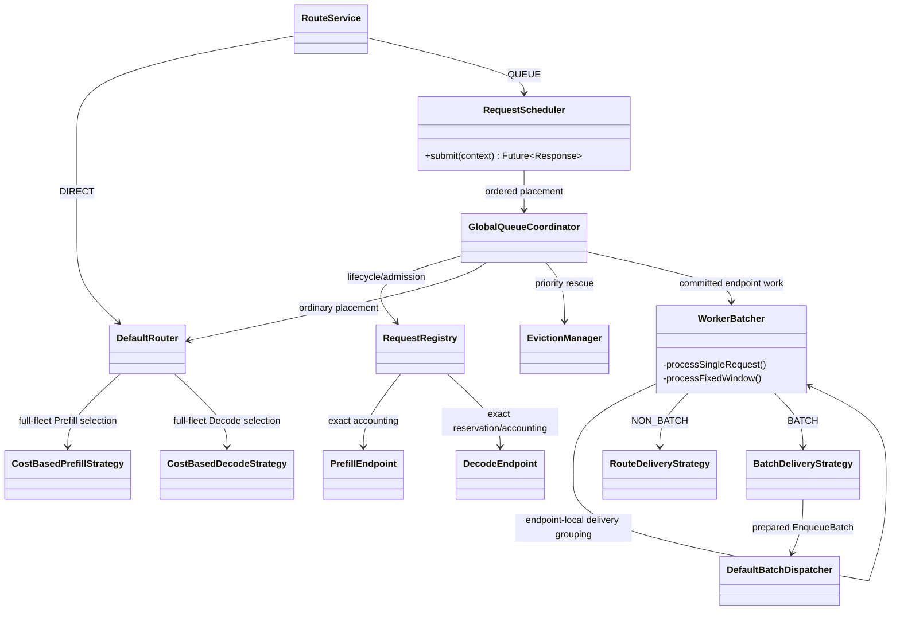
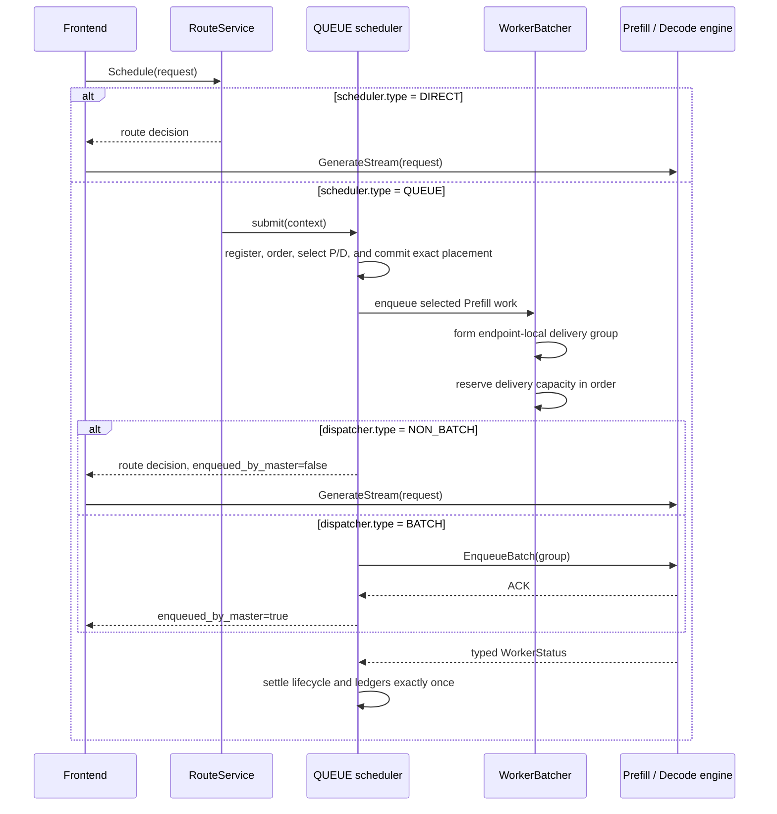

# QUEUE ordering, decision, and dispatcher modes

## Purpose

FlexLB exposes the scheduler plus three independent QUEUE axes in one strict
`FLEXLB_CONFIG` JSON document:

1. `scheduler.type` chooses immediate routing (`DIRECT`) or scheduler-owned
   request lifecycle (`QUEUE`).
2. `scheduler.ordering.type`, present only for `QUEUE`, chooses arrival order
   (`FIFO`) or priority order (`PRIORITY`).
3. `scheduler.decision.type`, present only for `QUEUE`, chooses one request per
   decision (`SINGLE`) or bounded group formation (`FIXED_WINDOW`).
4. `dispatcher.type` chooses frontend delivery (`NON_BATCH`) or Master-side
   `EnqueueBatch` delivery (`BATCH`).

These names are not interchangeable. `FIFO` is the peer of `PRIORITY`, `SINGLE`
is the peer of `FIXED_WINDOW`, and `NON_BATCH` is the peer of `BATCH`. `DIRECT`
requires `NON_BATCH` and cannot configure a decision policy. Every
ordering/decision/dispatcher combination is valid under `QUEUE`.

`RequestScheduler` is the public QUEUE facade for both FIFO and PRIORITY.
`GlobalQueueCoordinator` owns ordered placement and commit, while
`RequestRegistry` owns the exact request lifecycle. The Java type names therefore
match the configuration model; there is no separate "priority scheduler" service.

## Class model



`DIRECT` skips QUEUE admission, the ordered active index, and the endpoint worker thread, but it uses the same
`router.groupSelector` and `router.roles` worker-selection configuration as
QUEUE. PDFUSION follows the prefill role configuration and requires only a
PDFUSION endpoint; a separate Decode endpoint is optional only when explicitly
requested by the model topology.

## Request flow



The decision policy and dispatcher answer different questions. The global queue
owns ordering and one authoritative placement/commit per request. Its planning
frontier is bounded by admitted work and planner concurrency: it does not collect a
logical group and never waits to fill one. After placement, the selected
Prefill endpoint is the sole decision-group owner. `SINGLE` forms a one-request
group. `FIXED_WINDOW` collects up to
`scheduler.decision.maxRequests` locally selected requests and waits at most
`scheduler.decision.maxCollectionWaitMs`; it never reselects a machine. The
decision optionally refuses to add another
request when the resulting group's prediction would exceed the strict
`scheduler.decision.maxPredictedExecutionMs` growth cap. A request is
indivisible, so a singleton whose own prediction exceeds the cap is still a
valid candidate. Reaching the prediction cap stops collection immediately
instead of waiting for the collection window.

For `BATCH`, every request independently selects its Prefill
and Decode generations from the complete live candidate fleet before the
ordered commit. The endpoint runtime then groups committed requests by their
already-selected Prefill endpoint and performs the final exact queue/capacity
check, so one planning frontier may produce several `EnqueueBatch` calls. The
delivery strategy then chooses who sends those endpoint-local groups:
the frontend calls `GenerateStream` for `NON_BATCH`, while the Master calls
`EnqueueBatch` for `BATCH`.

Waiting is event driven. Group policies return the exact resource event,
queue/status/model generation, or absolute collection/expiration deadline that
can change their answer. They do not sleep and retry on a fixed polling interval.

Setting `maxCollectionWaitMs` to zero removes the collection delay, but candidate
selection still includes as many currently available requests as its other
bounds allow. Use `SINGLE` when every decision must contain exactly one request.

A request the worker cannot take yet because of KV pressure or engine
backpressure remains QUEUE-owned. There is no SLO-budget batching policy.

PRIORITY preemption consumes the same exact Prefill and Decode route selected
by ordinary placement. It may replace lower-priority owners on those endpoints,
but it never calls the router or a selector again and never falls back to a
different endpoint.

The current online `LEARNING` estimator updates from completed `EnqueueBatch`
groups. NON_BATCH decisions can read its published model, but route-request
terminals do not contribute training samples; use a `FORMULA` estimator when a
stable prediction cap is required for `FIXED_WINDOW + NON_BATCH`.

## Ordering and expiration

FIFO orders by enqueue sequence. PRIORITY orders by normalized priority
(1–100, higher first) and then by enqueue sequence. `defaultPriority` is used
only when the caller did not supply a priority.

Ordering is global to one model's `GlobalQueueCoordinator`. Its rolling
planning frontier is an implementation pipeline, not a decision group. Before
each commit, PRIORITY revalidates that no newer higher-priority request is
eligible, so planner count cannot change ordering semantics. An exact-capacity
conflict is replanned only when the selected endpoint's placement version proves
that the captured generation is stale; an unchanged capacity miss parks on that
endpoint immediately. Delivery callbacks are
serialized by the endpoint worker thread; asynchronous Engine
ACK/completion order is not a FIFO or priority guarantee.

For example, suppose the global order is `[A, B, C]`. The coordinator commits
each independently selected route in that order. In `BATCH` mode a fixed window
is only a decision boundary: `[A, B]` may become one endpoint-local batch or
two batches if the requests choose different Prefill endpoints. The endpoint
runtime can still split either group if an exact capacity or deadline check
requires it. If `A` is rejected by the local capacity of endpoint `E1`, `B` may
commit first when its independently selected route uses another endpoint. A
later route which also uses `E1` parks behind `A`, preserving order within that
endpoint capacity domain. A selector miss blocks its routing domain: explicit,
different policy groups progress independently; an unbound group overlaps all
groups. The policy group is frozen at ingress and reused for route selection. Once a route is committed, delivery backpressure can delay
the group but cannot trigger a second route selection.

PRIORITY does not create a separate request TTL. QUEUE resolves one absolute
scheduling expiration from the public configuration:

```text
expires_at_ms = flexlb_admission_time_ms + scheduler.queueTimeoutMs
```

The deadline covers queueing, routing, and delivery acknowledgement. Prompt
length, priority, queue movement, generation replanning, and preemption never
extend or
multiply it. DIRECT does not queue and therefore does not apply a scheduling
timeout. The caller's protobuf `generate_timeout` remains a transport/engine
field and does not control FlexLB scheduling. Consequently there are no SLO
length buckets, SLO budgets, or priority TTL multipliers to configure.

## Configuration reference

Only `FLEXLB_CONFIG` controls these behaviors. The parser rejects unknown and
inactive-variant fields, so fields listed for one tagged type cannot be placed
on another type. Optional fields are disabled by omission; JSON `null` is not
accepted.

### Scheduler

| JSON path | Applies to | Default | Meaning |
| --- | --- | ---: | --- |
| `scheduler.type` | all | `QUEUE` | `DIRECT` or `QUEUE` |
| `scheduler.queueTimeoutMs` | `QUEUE` | `3600000` ms | Total scheduling lifetime from FlexLB admission through delivery acknowledgement |
| `scheduler.ordering.type` | `QUEUE` | `FIFO` | `FIFO` or `PRIORITY` |
| `scheduler.ordering.defaultPriority` | `QUEUE + PRIORITY` | `50` | Fallback priority in `[1, 100]` |
| `scheduler.decision.type` | `QUEUE` | `FIXED_WINDOW` | `SINGLE` or `FIXED_WINDOW` |
| `scheduler.decision.maxRequests` | `QUEUE + FIXED_WINDOW` | `8` | Maximum requests in one decision group |
| `scheduler.decision.maxCollectionWaitMs` | `QUEUE + FIXED_WINDOW` | `300` ms | Maximum collection wait; zero is allowed |
| `scheduler.decision.maxPredictedExecutionMs` | `QUEUE + FIXED_WINDOW` | omitted | Optional positive inclusive group-growth cap; reaching it dispatches immediately, and an indivisible singleton may exceed it |
| `scheduler.capacity.maxOutstandingRequestsGlobal` | `QUEUE` | `100000` | Exact cluster-wide cap on requests owned by QUEUE |
| `scheduler.capacity.maxWaitingRequestsPerPrefillWorker` | `QUEUE` | `1024` | Positive hard bound for each Prefill waiting queue |
| `scheduler.lifecycle.staleInflightTimeoutMs` | `QUEUE` | `300000` ms | Stale inflight reconciliation bound |
| `scheduler.lifecycle.deliveredNotAcceptedTimeoutMs` | `QUEUE` | `30000` ms | Bound before reconciling work delivered but not accepted by Decode |
| `scheduler.lifecycle.maxDeliveredNotAcceptedRequestsGlobal` | `QUEUE` | `200` | Global Decode acceptance guard, acquired during delivery preparation |

FIFO has no additional fields. PRIORITY can optionally contain
`scheduler.ordering.preemption`:

| JSON path | Default | Meaning |
| --- | ---: | --- |
| `allowedVictimStages` | omitted | Non-empty subset of `PREFILL_QUEUED`, `DECODE_RESERVED`, and `DECODE_ENGINE_OWNED` |
| `engineCancellation.ackTimeoutMs` | `50` ms | Cancel RPC acknowledgement bound |
| `engineCancellation.completionTimeoutMs` | `1000` ms | Typed cancellation completion bound |

`engineCancellation` is required when `DECODE_ENGINE_OWNED` is allowed and is
rejected otherwise. Omit the whole `preemption` object to disable preemption.

Schema v2 gives every setting exactly one owner. `scheduler.decision` owns group
formation and defaults to `FIXED_WINDOW`; it is independent of who delivers the
group. `scheduler.capacity` owns queue bounds. `dispatcher` owns only delivery
and its backpressure limits. Select `SINGLE` explicitly instead of relying on a
dispatcher type to choose a decision policy.

Omitted `schemaVersion` is interpreted as v2; unsupported explicit versions are
rejected. The online loader has one schema-v2 runtime model.

`org.flexlb.config.FlexlbConfigMigration` provides an explicit offline v1-to-v2
conversion. Its `main` reads v1 JSON from stdin, writes validated v2 JSON to
stdout, and reports behavior changes on stderr. Run it with the built
`flexlb-common` module and its dependencies on the Java classpath. Review the
reported changes before deploying the resulting JSON:

- NON_BATCH receives an explicit `SINGLE` decision. BATCH grouping fields move
  to `scheduler.decision`; its waiting bound moves to `scheduler.capacity`.
- The old Prefill pending bound maps to the canonical NON_BATCH request cap,
  including DIRECT. BATCH queue and batch limits need explicit sizing because
  they use different units.
- Prefill/Decode `RANDOM` policies have no equivalent and fail conversion.
  Availability hysteresis is reported as removed; recovery follows exact
  capacity release. Unknown fields, malformed numbers and conflicting field
  owners fail conversion.

At the global outstanding bound, PRIORITY admission can transfer a lower-priority
queued request's permit directly to the new request. Unplaced requests are eligible;
placed requests also require the existing `PREFILL_QUEUED` victim-stage policy.
Equal/lower priorities and FIFO never displace work. Delivery claims and in-progress
admission mutations cannot yield their permits. Candidate lookup excludes delivered
and terminal generations; endpoint cleanup and completion callbacks run outside the
short admission critical section. Rejected submissions publish no lifecycle object.

### Dispatcher

| JSON path | Applies to | Default | Meaning |
| --- | --- | ---: | --- |
| `dispatcher.type` | all | `BATCH` | `BATCH` or `NON_BATCH`; DIRECT requires `NON_BATCH` |
| `dispatcher.maxInflightBatchesPerPrefillWorker` | `BATCH` | omitted | Optional positive per-Prefill EnqueueBatch backpressure cap |
| `dispatcher.enqueueRpcTimeoutMs` | `BATCH` | `5000` ms | EnqueueBatch RPC timeout |
| `dispatcher.maxInflightRequestsPerPrefillWorker` | `DIRECT/QUEUE + NON_BATCH` | omitted | Optional positive per-Prefill outstanding request cap |

The two optional inflight limits use omission, not zero, to mean unlimited.
Decision-group and waiting-queue parameters are rejected under `dispatcher`.

## Valid examples

DIRECT with the default role routing configuration:

```json
{
  "schemaVersion": 2,
  "scheduler": {"type": "DIRECT"},
  "dispatcher": {"type": "NON_BATCH"}
}
```

The four minimal FIFO QUEUE combinations make the independent axes explicit.

SINGLE decision, frontend delivery:

```json
{
  "schemaVersion": 2,
  "scheduler": {
    "type": "QUEUE",
    "ordering": {"type": "FIFO"},
    "decision": {"type": "SINGLE"}
  },
  "dispatcher": {"type": "NON_BATCH"}
}
```

SINGLE decision, Master delivery:

```json
{
  "schemaVersion": 2,
  "scheduler": {
    "type": "QUEUE",
    "ordering": {"type": "FIFO"},
    "decision": {"type": "SINGLE"}
  },
  "dispatcher": {"type": "BATCH"}
}
```

FIXED_WINDOW decision, frontend delivery:

```json
{
  "schemaVersion": 2,
  "scheduler": {
    "type": "QUEUE",
    "ordering": {"type": "FIFO"},
    "decision": {
      "type": "FIXED_WINDOW",
      "maxRequests": 8,
      "maxCollectionWaitMs": 300
    }
  },
  "dispatcher": {"type": "NON_BATCH"}
}
```

FIXED_WINDOW decision, Master delivery:

```json
{
  "schemaVersion": 2,
  "scheduler": {
    "type": "QUEUE",
    "ordering": {"type": "FIFO"},
    "decision": {
      "type": "FIXED_WINDOW",
      "maxRequests": 8,
      "maxCollectionWaitMs": 300
    }
  },
  "dispatcher": {"type": "BATCH"}
}
```

A fuller PRIORITY example with explicit FIXED_WINDOW decision and BATCH delivery:

```json
{
  "schemaVersion": 2,
  "scheduler": {
    "type": "QUEUE",
    "queueTimeoutMs": 3600000,
    "ordering": {
      "type": "PRIORITY",
      "defaultPriority": 50,
      "preemption": {
        "allowedVictimStages": ["PREFILL_QUEUED", "DECODE_RESERVED"]
      }
    },
    "decision": {
      "type": "FIXED_WINDOW",
      "maxRequests": 32,
      "maxCollectionWaitMs": 160,
      "maxPredictedExecutionMs": 500
    },
    "capacity": {
      "maxOutstandingRequestsGlobal": 100000,
      "maxWaitingRequestsPerPrefillWorker": 1024
    },
    "lifecycle": {
      "staleInflightTimeoutMs": 300000,
      "deliveredNotAcceptedTimeoutMs": 30000,
      "maxDeliveredNotAcceptedRequestsGlobal": 200
    }
  },
  "dispatcher": {
    "type": "BATCH",
    "maxInflightBatchesPerPrefillWorker": 2,
    "enqueueRpcTimeoutMs": 5000
  }
}
```

The role-local capacity, estimator, candidate-choice, and Decode weighting
settings shown in the top-level [README](../README.md) can be added unchanged to
any of these valid modes. Role algorithms themselves are fixed.

## Accounting and concurrency invariants

1. `scheduler.capacity.maxOutstandingRequestsGlobal` is acquired atomically and
   released exactly once across failure, cancellation, timeout, rollback, and
   shutdown. Overload rejection does not register a retained request slot.
2. Under QUEUE, `PrefillEndpoint.inflightBatches` contains only real
   `EnqueueBatch` operations. NON_BATCH route decisions use a request-keyed
   ledger instead of synthetic singleton batches.
3. Decode reservation and accounting remain request-keyed in both dispatcher
   modes when Decode is required. PDFUSION-only uses its own endpoint ledger
   and terminal status without a synthetic Decode reservation.
4. A request captures its delivery mode at admission. An inflight request cannot
   switch ownership protocol.
5. Lifecycle, preemption, and post-delivery claims are mutually exclusive under
   the request-scoped state boundary.
6. Prefill/Decode resources are released only after an authoritative terminal
   status or cancellation proof. Cleanup paths are idempotent.
7. The absolute request expiration remains unchanged through queueing,
   preemption, delivery, and reconciliation.
8. Placement does not produce a capacity-free intermediate state. Publication
   reserves the ordered frontier independently for each
   exact Prefill endpoint and records the selected Decode generation. When
   placement-time capacity is unavailable, the request remains queued with its
   original FIFO/priority key and parks on that endpoint; a suffix member may
   bypass only when its route does not use the parked endpoint.
9. NON_BATCH deliberately acquires the exact Decode engine-facing permit at
   delivery, after Prefill queueing, so a long Prefill backlog cannot consume
   idle Decode execution capacity. The shared acceptance cap is acquired at the
   same delivery boundary and wakes waiters on release. Permit failure waits on that same Decode
   endpoint and never reselects a route. Once transferred to delivery, a Decode
   permit never returns to queued ownership. Preemptive Decode admission instead
   reserves its exact capacity in the placement transaction because a typed
   capacity miss is required to plan victims on that same endpoint.
10. For `QUEUE + BATCH`, admission atomically owns both one captured
    `maxInflightBatchesPerPrefillWorker` slot and one task already accepted by
    the bounded local dispatcher. Before the admitted members leave `ACTIVE`,
    they enter callback-owned Prefill load accounting. Load snapshots remain
    conservative until the callback either transfers that ownership into the
    canonical committed-batch ledger or releases it after a terminal failure. Filling
    the accepted dispatcher task performs no second executor-capacity check.
    The endpoint slot remains owned through transport-unknown and protected
    survivor states, and batch settlement signals the exact blocked resource.
    DIRECT requests remain in the separate request-keyed ledger.
11. A callback exception is terminal for every member it did not transfer. The
    callback is never retried and no member returns to the active queue.
12. Batch-load publication is established before `ACTIVE` removal. A typed
    publication failure terminalizes the reserved prefix exactly once. The first
    unreserved terminal boundary is consumed by the same rule as the normal
    path: `AdmissionFailed` is removed and reported with its own cause,
    `OwnershipLost` is removed without a second terminal callback, and only
    `CapacityUnavailable` remains `ACTIVE`.
13. Collection, worker-shape, and prediction waits are versioned condition
    waits. WorkerStatus changes publish the scheduling-input generation;
    online learning publishes it only when a new predictor generation is
    installed. A signal that arrives before the worker begins waiting changes
    the captured generation, so it cannot be lost.
14. Expiration and permanent token-shape rejection claim one `ACTIVE` item by
    removing it under the queue lock, then invoke one item-scoped terminal
    reducer outside the lock. A terminal observer failure is logged and cannot
    stop or drain unrelated requests on that worker.

## Mode matrix

| Scheduler | Ordering | Decision | Dispatcher | Delivery |
| --- | --- | --- | --- | --- |
| `DIRECT` | — | — | `NON_BATCH` | Immediate route response; frontend sends |
| `QUEUE` | `FIFO` | `SINGLE` | `NON_BATCH` | FIFO singleton route response; frontend sends |
| `QUEUE` | `FIFO` | `SINGLE` | `BATCH` | FIFO singleton `EnqueueBatch`; Master sends |
| `QUEUE` | `FIFO` | `FIXED_WINDOW` | `NON_BATCH` | FIFO-ordered independent route decisions; frontend sends each request |
| `QUEUE` | `FIFO` | `FIXED_WINDOW` | `BATCH` | FIFO-ordered independent route decisions; each selected endpoint batches locally |
| `QUEUE` | `PRIORITY` | `SINGLE` | `NON_BATCH` | Priority singleton route response; frontend sends |
| `QUEUE` | `PRIORITY` | `SINGLE` | `BATCH` | Priority singleton `EnqueueBatch`; Master sends |
| `QUEUE` | `PRIORITY` | `FIXED_WINDOW` | `NON_BATCH` | Priority-ordered independent route decisions; frontend sends each request |
| `QUEUE` | `PRIORITY` | `FIXED_WINDOW` | `BATCH` | Priority-ordered independent route decisions; each selected endpoint batches locally |

`DIRECT + BATCH` and `DIRECT + decision` are rejected during strict
configuration parsing/validation.
