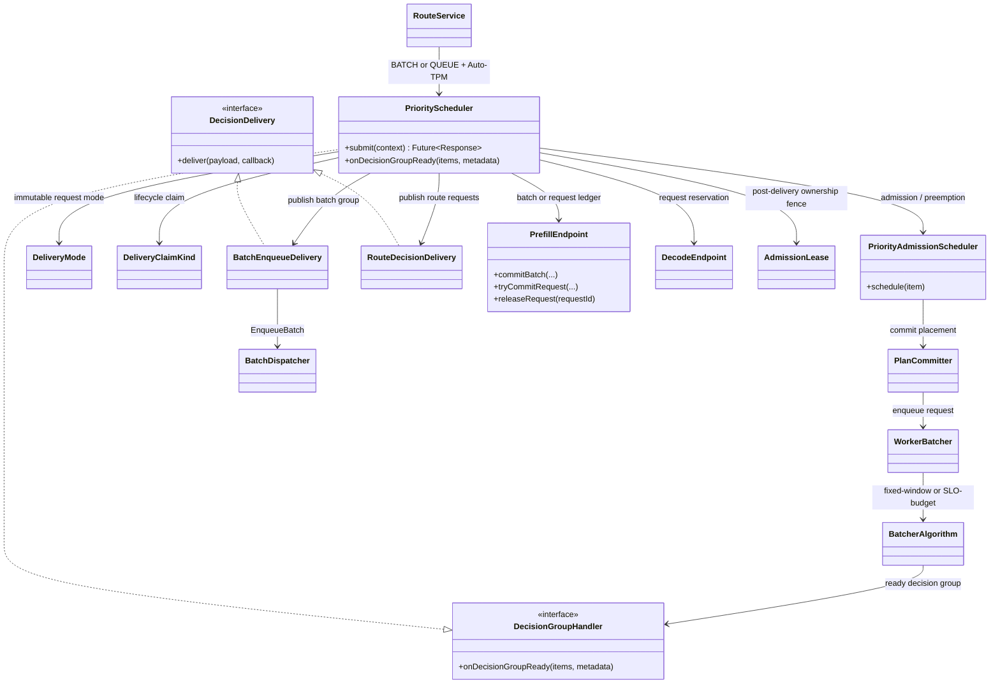
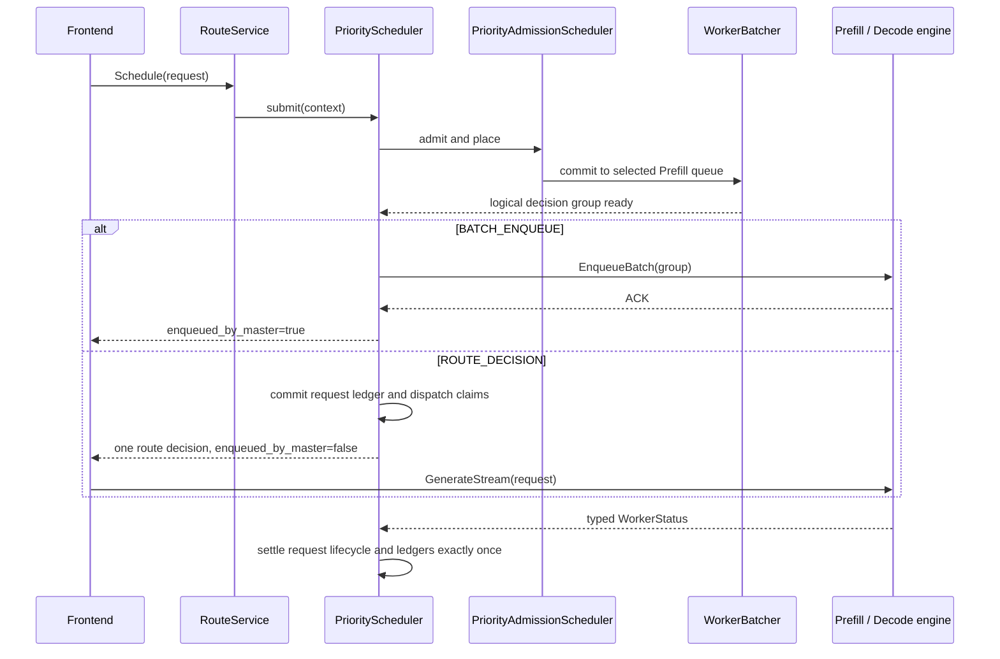

# Priority scheduler delivery modes

## Purpose

`PriorityScheduler` owns Auto-TPM admission, placement, priority ordering,
preemption, and request lifecycle management. It deliberately does not make
the transport choice part of those scheduling policies. A request captures one
of two immutable delivery modes when it enters the scheduler:

- `BATCH_ENQUEUE`: Master sends the ready group through `EnqueueBatch`.
- `ROUTE_DECISION`: Master completes each routing call with
  `enqueued_by_master=false`; the frontend sends the request to the selected
  engine.

Both modes therefore make the same scheduling decision. They differ only at
the delivery boundary and in the unit used for Prefill inflight accounting.

## Class model

`DecisionDelivery<T>` only publishes scheduler-prepared work. Its typed payload
keeps batch-only transport data inside `BatchEnqueueDelivery`; route decisions
use the already prepared request list directly. Delivery never owns scheduler
state and never acquires or releases Prefill or Decode resources. This keeps
transport failures inside one callback boundary and lifecycle transitions in
`PriorityScheduler`, without a generic plan hierarchy or runtime type checks.

## Request flow

The batching policy still decides when the logical group is ready in
`ROUTE_DECISION` mode. The per-worker request cap only limits how many ready
members are handed to frontends concurrently. Members that do not obtain a
slot enter a bounded, per-worker ready backlog. They retain their priority and
original enqueue time, remain removable by timeout/shutdown/preemption, and
are handed off before the worker forms another logical decision group.

## Accounting and concurrency invariants

1. `PrefillEndpoint.inflightBatches` contains only real `EnqueueBatch`
   operations. A route decision is never represented by a singleton or empty
   synthetic batch.
2. Route decisions use a request-keyed ledger and a separate atomic route
   request counter. The per-worker route cap is linearized at
   `tryCommitRequest`; concurrent decision groups cannot oversubscribe it.
3. Decode accounting remains request-keyed in both modes.
4. A request captures its `DeliveryMode` at admission. A live configuration
   change cannot switch the ownership protocol of an inflight request.
5. Lifecycle claims, preemption claims, and post-delivery engine fences are
   mutually exclusive under the request-scoped state boundary. EnqueueBatch
   invocation is linearized inside a short scheduler delivery fence. Callback
   reducers may run or re-enter there, but caller futures are completed only
   after scheduler locks have been released.
6. Prefill/Decode resources are released only after an authoritative terminal
   WorkerStatus or cancellation proof. Timeouts start cancellation and
   reconciliation; they do not assume the engine is idle.
7. Cleanup operations are idempotent. WorkerStatus, cancellation, timeout, and
   delivery-failure races converge on the same terminal transition.
8. Once a logical route group is ready, capacity only delays delivery. It never
   makes those members wait through another fixed-window or SLO decision.

Cancel reconciliation uses a bounded fast-retry chain. Requests with no
authoritative outcome then enter an observable quarantine: no recurring
per-request delayed task remains, accounting stays conservatively charged, and
the periodic cleanup loop performs a fair, rate-limited probe. A tombstone,
typed Prefill `CANCELED`, or Decode terminal settles the quarantine exactly
once. Local endpoint removal is not treated as proof because a previously
published frontend request can still arrive late.

The request ledger stores only compact request accounting data. Hot counters
are striped or atomic; wait-time aggregation avoids scanning all inflight
requests and avoids per-decision allocation on the homogeneous fast path.

## Configuration

| Setting | Unit and scope | Meaning |
| --- | --- | --- |
| `DEFAULT_SCHEDULE_MODE` | mode | `batch`, `queue`, or `direct` |
| `AUTO_TPM_ENABLED` | boolean | Makes `queue` use the priority scheduler |
| `AUTO_TPM_PREFILL_MAX_INFLIGHT_REQUESTS_PER_WORKER` | requests per Prefill worker | Hard cap for Auto-TPM route-decision requests; `0` is unlimited |
| `DECODE_CONCURRENCY_LIMIT` | requests per Decode worker | Hard Decode admission cap shared by both delivery modes; `0` is unlimited |
| `FLEXLB_BATCH_ALGORITHM` | policy | Logical grouping policy: `fixed_window` or `slo_budget` |
| `FLEXLB_BATCH_SIZE_MAX` | requests per logical group | Maximum group size in either delivery mode |
| `FLEXLB_BATCH_FIXED_WAIT_MS` | milliseconds | Maximum collection wait for `fixed_window` |
| `FLEXLB_BATCH_WINDOW_MS` | milliseconds | Remaining-budget collection window for `slo_budget` |
| `FLEXLB_BATCH_FIXED_MAX_INFLIGHT_BATCHES` | batches per Prefill worker | Fixed-window Batch-RPC backpressure only |
| `FLEXLB_BATCH_SLO_MAX_INFLIGHT_BATCHES` | batches per Prefill worker | SLO-budget Batch-RPC backpressure only |
| `FLEXLB_BATCH_MAX_INFLIGHT` | requests in Master scheduler | Global scheduler admission limit |
| `AUTO_TPM_PREFILL_QUEUE_EVICT_ENABLED` | boolean | Allows a higher-priority request to evict a queued Prefill request |
| `AUTO_TPM_DECODE_RESERVED_EVICT_ENABLED` | boolean | Allows preemption of Decode reservations not yet accepted by the engine |
| `AUTO_TPM_DECODE_ACCEPTED_EVICT_ENABLED` | boolean | Allows typed cancellation of Decode engine-owned requests |
| `AUTO_TPM_CANCEL_ACK_TIMEOUT_MS` | milliseconds | Deadline for an Engine Cancel RPC acknowledgement |
| `AUTO_TPM_CANCEL_COMPLETION_TIMEOUT_MS` | milliseconds | Deadline for typed `CANCELED` confirmation after an accepted cancel |
| `AUTO_TPM_POST_SUCCESS_BACKPRESSURE_LIMIT` | active request leases | Global guard for delivered but not Decode-accepted requests |
| `AUTO_TPM_POST_SUCCESS_SOFT_TIMEOUT_MS` | milliseconds | Starts post-delivery cancellation/reconciliation when Decode ownership is still unresolved |

The legacy `POST_SUCCESS` setting names are retained for environment-variable
compatibility. In this scheduler they mean delivery success: an EnqueueBatch
ACK for `BATCH_ENQUEUE`, or publishing the route response for `ROUTE_DECISION`.

The logical grouping controls (`FLEXLB_BATCH_SIZE_MAX`, fixed-window wait, and
SLO-budget parameters) apply to both delivery modes. To deliver a ready group
in one pass, configure the route request cap to be at least the largest logical
group size.

## Mode matrix

| Schedule mode | Auto-TPM | Scheduling path | Delivery and accounting |
| --- | --- | --- | --- |
| `batch` | either | `PriorityScheduler` | Master `EnqueueBatch`; batch inflight cap |
| `queue` | `true` | `PriorityScheduler` | Frontend `GenerateStream`; request inflight cap |
| `queue` | `false` | legacy queue | Existing queue behavior |
| `direct` | either | direct router | Existing direct behavior |
