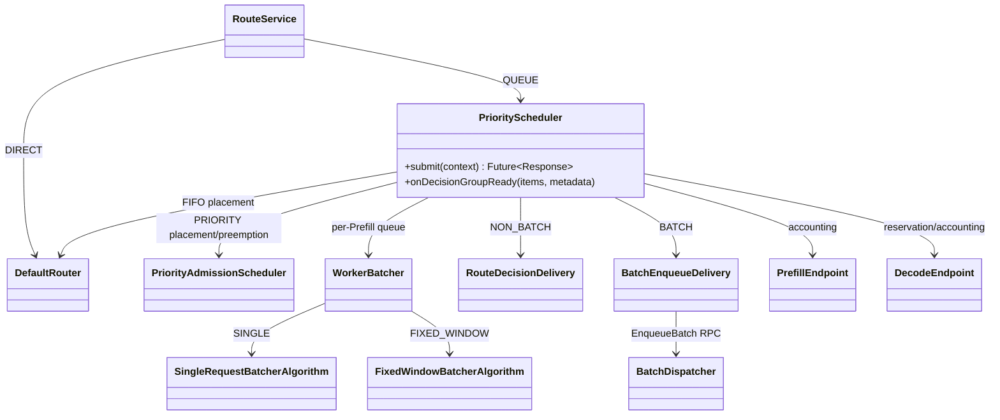
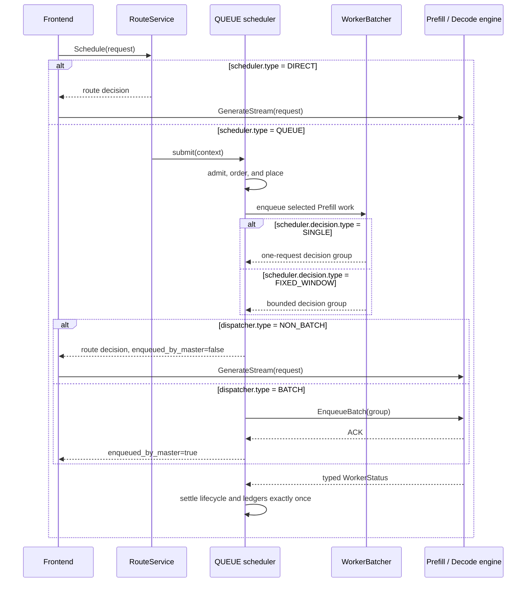

# QUEUE ordering, decision, and dispatcher modes

## Purpose

FlexLB exposes the scheduler plus three independent QUEUE axes in one strict
`FLEXLB_CONFIG` JSON document:

1. `scheduler.type` chooses immediate routing (`DIRECT`) or scheduler-owned
   request lifecycle (`QUEUE`).
2. `scheduler.ordering.type`, present only for `QUEUE`, chooses arrival order
   (`FIFO`) or priority order (`PRIORITY`).
3. `scheduler.decision.type`, present only for `QUEUE`, chooses one request per
   decision (`SINGLE`) or bounded group formation (`FIXED_WINDOW`).
4. `dispatcher.type` chooses frontend delivery (`NON_BATCH`) or Master-side
   `EnqueueBatch` delivery (`BATCH`).

These names are not interchangeable. `FIFO` is the peer of `PRIORITY`, `SINGLE`
is the peer of `FIXED_WINDOW`, and `NON_BATCH` is the peer of `BATCH`. `DIRECT`
requires `NON_BATCH` and cannot configure a decision policy. Every
ordering/decision/dispatcher combination is valid under `QUEUE`.

The Java class is still named `PriorityScheduler`, but it is the common QUEUE
implementation for both FIFO and PRIORITY. That class name is an implementation
detail, not another public mode.

## Class model



`DIRECT` skips QUEUE admission and `WorkerBatcher`, but it uses the same
`router.groupSelector` and `router.roles` worker-selection configuration as
QUEUE. PDFUSION follows the prefill role configuration.

## Request flow



The decision policy and dispatcher answer different questions. `SINGLE` forms a
complete decision group for each request. `FIXED_WINDOW` grows a group up to
`scheduler.decision.maxRequests`, waits at most
`scheduler.decision.maxCollectionWaitMs`, and optionally refuses to add another
request when the resulting group's prediction would exceed the strict
`scheduler.decision.maxPredictedExecutionMs` growth cap. A request is
indivisible, so a singleton whose own prediction exceeds the cap is still a
valid group. The dispatcher then chooses who sends the already-formed group:
the frontend calls `GenerateStream` for `NON_BATCH`, while the Master calls
`EnqueueBatch` for `BATCH`.

A request the worker cannot take yet because of KV pressure or engine
backpressure remains QUEUE-owned. There is no SLO-budget batching policy.

The current online `LEARNING` estimator updates from completed `EnqueueBatch`
groups. NON_BATCH decisions can read its published model, but route-request
terminals do not contribute training samples; use a `FORMULA` estimator when a
stable prediction cap is required for `FIXED_WINDOW + NON_BATCH`.

## Ordering and expiration

FIFO orders by enqueue sequence. PRIORITY orders by normalized priority
(1–100, higher first) and then by enqueue sequence. `defaultPriority` is used
only when the caller did not supply a priority.

PRIORITY does not create a separate request TTL. QUEUE resolves one absolute
scheduling expiration from the public configuration:

```text
expires_at_ms = flexlb_admission_time_ms + scheduler.queueTimeoutMs
```

The deadline covers queueing, routing, and delivery acknowledgement. Prompt
length, priority, queue movement, retries, and preemption never extend or
multiply it. DIRECT does not queue and therefore does not apply a scheduling
timeout. The caller's protobuf `generate_timeout` remains a transport/engine
field and does not control FlexLB scheduling. Consequently there are no SLO
length buckets, SLO budgets, or priority TTL multipliers to configure.

## Configuration reference

Only `FLEXLB_CONFIG` controls these behaviors. The parser rejects unknown and
inactive-variant fields, so fields listed for one tagged type cannot be placed
on another type. Optional fields are disabled by omission; JSON `null` is not
accepted.

### Scheduler

| JSON path | Applies to | Default | Meaning |
| --- | --- | ---: | --- |
| `scheduler.type` | all | `QUEUE` | `DIRECT` or `QUEUE` |
| `scheduler.queueTimeoutMs` | `QUEUE` | `3600000` ms | Total scheduling lifetime from FlexLB admission through delivery acknowledgement |
| `scheduler.ordering.type` | `QUEUE` | `FIFO` | `FIFO` or `PRIORITY` |
| `scheduler.ordering.defaultPriority` | `QUEUE + PRIORITY` | `50` | Fallback priority in `[1, 100]` |
| `scheduler.decision.type` | `QUEUE` | compatibility mapping | `SINGLE` or `FIXED_WINDOW`; see schema-v1 mapping below |
| `scheduler.decision.maxRequests` | `QUEUE + FIXED_WINDOW` | `8` | Maximum requests in one decision group |
| `scheduler.decision.maxCollectionWaitMs` | `QUEUE + FIXED_WINDOW` | `300` ms | Maximum collection wait; zero is allowed |
| `scheduler.decision.maxPredictedExecutionMs` | `QUEUE + FIXED_WINDOW` | omitted | Optional positive strict group-growth cap; an indivisible singleton may exceed it |
| `scheduler.capacity.maxOutstandingRequestsGlobal` | `QUEUE` | `100000` | Exact cluster-wide cap on requests owned by QUEUE |
| `scheduler.capacity.maxWaitingRequestsPerPrefillWorker` | `QUEUE` | compatibility fallback | Optional positive hard bound for each Prefill waiting queue |
| `scheduler.lifecycle.staleInflightTimeoutMs` | `QUEUE` | `300000` ms | Stale inflight reconciliation bound |
| `scheduler.lifecycle.deliveredNotAcceptedTimeoutMs` | `QUEUE` | `30000` ms | Bound before reconciling work delivered but not accepted by Decode |
| `scheduler.lifecycle.maxDeliveredNotAcceptedRequestsGlobal` | `QUEUE` | `200` | Global post-delivery ownership guard |

FIFO has no additional fields. PRIORITY can optionally contain
`scheduler.ordering.preemption`:

| JSON path | Default | Meaning |
| --- | ---: | --- |
| `allowedVictimStages` | omitted | Non-empty subset of `PREFILL_QUEUED`, `DECODE_RESERVED`, and `DECODE_ENGINE_OWNED` |
| `engineCancellation.ackTimeoutMs` | `50` ms | Cancel RPC acknowledgement bound |
| `engineCancellation.completionTimeoutMs` | `1000` ms | Typed cancellation completion bound |

`engineCancellation` is required when `DECODE_ENGINE_OWNED` is allowed and is
rejected otherwise. Omit the whole `preemption` object to disable preemption.

In schema version 1, `scheduler.decision` is optional for rolling compatibility.
When omitted, `dispatcher.type=BATCH` selects the old fixed-window behavior using
`dispatcher.maxRequests` and `dispatcher.maxCollectionWaitMs`; `NON_BATCH`
selects `SINGLE`. An explicit decision always wins. The legacy
`dispatcher.earlyDispatchPredictedExecutionMs` remains an early-dispatch trigger,
not the strict new upper bound. An additional member whose resulting prediction
is greater than or equal to the legacy trigger stays queued; an indivisible head
at the trigger is still released as a singleton. The explicit maximum uses a
strict greater-than boundary, so equality is allowed there.

Compatibility is one-way: the new image accepts an existing schema-v1 document,
but an older strict parser does not recognize the new `scheduler.decision` or
scheduler-capacity fields. Introduce the new fields only after the new image is
healthy. A rollback to an older image must restore the previous configuration
document at the same time.

When `scheduler.capacity.maxWaitingRequestsPerPrefillWorker` is omitted, the
scheduler uses the legacy BATCH dispatcher value or the NON_BATCH runtime
fallback. An explicit scheduler capacity always wins.

### Dispatcher

| JSON path | Applies to | Default | Meaning |
| --- | --- | ---: | --- |
| `dispatcher.type` | all | `BATCH` | `BATCH` or `NON_BATCH`; DIRECT requires `NON_BATCH` |
| `dispatcher.maxRequests` | legacy `BATCH` | `8` | Compatibility decision size when `scheduler.decision` is omitted |
| `dispatcher.maxCollectionWaitMs` | legacy `BATCH` | `300` ms | Compatibility collection wait when `scheduler.decision` is omitted |
| `dispatcher.maxWaitingRequestsPerPrefillWorker` | legacy `BATCH` | `1024` | Compatibility queue bound when the scheduler capacity is omitted |
| `dispatcher.earlyDispatchPredictedExecutionMs` | legacy `BATCH` | omitted | Compatibility `>=` growth boundary; the additional item that reaches it stays queued, while an indivisible head still forms a singleton |
| `dispatcher.maxInflightBatchesPerPrefillWorker` | `BATCH` | omitted | Optional positive per-Prefill EnqueueBatch backpressure cap |
| `dispatcher.enqueueRpcTimeoutMs` | `BATCH` | `5000` ms | EnqueueBatch RPC timeout |
| `dispatcher.maxInflightRequestsPerPrefillWorker` | `QUEUE + NON_BATCH` | omitted | Optional positive per-Prefill route-decision cap |

The two optional inflight limits use omission, not zero, to mean unlimited. The
legacy fields remain accepted so schema version stays at 1, but new
configurations should put decision and waiting-capacity fields under `scheduler`.

## Valid examples

DIRECT with the default role routing configuration:

```json
{
  "schemaVersion": 1,
  "scheduler": {"type": "DIRECT"},
  "dispatcher": {"type": "NON_BATCH"}
}
```

The four minimal FIFO QUEUE combinations make the independent axes explicit.

SINGLE decision, frontend delivery:

```json
{
  "schemaVersion": 1,
  "scheduler": {
    "type": "QUEUE",
    "ordering": {"type": "FIFO"},
    "decision": {"type": "SINGLE"}
  },
  "dispatcher": {"type": "NON_BATCH"}
}
```

SINGLE decision, Master delivery:

```json
{
  "schemaVersion": 1,
  "scheduler": {
    "type": "QUEUE",
    "ordering": {"type": "FIFO"},
    "decision": {"type": "SINGLE"}
  },
  "dispatcher": {"type": "BATCH"}
}
```

FIXED_WINDOW decision, frontend delivery:

```json
{
  "schemaVersion": 1,
  "scheduler": {
    "type": "QUEUE",
    "ordering": {"type": "FIFO"},
    "decision": {
      "type": "FIXED_WINDOW",
      "maxRequests": 8,
      "maxCollectionWaitMs": 300
    }
  },
  "dispatcher": {"type": "NON_BATCH"}
}
```

FIXED_WINDOW decision, Master delivery:

```json
{
  "schemaVersion": 1,
  "scheduler": {
    "type": "QUEUE",
    "ordering": {"type": "FIFO"},
    "decision": {
      "type": "FIXED_WINDOW",
      "maxRequests": 8,
      "maxCollectionWaitMs": 300
    }
  },
  "dispatcher": {"type": "BATCH"}
}
```

A fuller PRIORITY example with explicit FIXED_WINDOW decision and BATCH delivery:

```json
{
  "schemaVersion": 1,
  "scheduler": {
    "type": "QUEUE",
    "queueTimeoutMs": 3600000,
    "ordering": {
      "type": "PRIORITY",
      "defaultPriority": 50,
      "preemption": {
        "allowedVictimStages": ["PREFILL_QUEUED", "DECODE_RESERVED"]
      }
    },
    "decision": {
      "type": "FIXED_WINDOW",
      "maxRequests": 32,
      "maxCollectionWaitMs": 160,
      "maxPredictedExecutionMs": 500
    },
    "capacity": {
      "maxOutstandingRequestsGlobal": 100000,
      "maxWaitingRequestsPerPrefillWorker": 1024
    },
    "lifecycle": {
      "staleInflightTimeoutMs": 300000,
      "deliveredNotAcceptedTimeoutMs": 30000,
      "maxDeliveredNotAcceptedRequestsGlobal": 200
    }
  },
  "dispatcher": {
    "type": "BATCH",
    "maxInflightBatchesPerPrefillWorker": 2,
    "enqueueRpcTimeoutMs": 5000
  }
}
```

The role-local prefill, decode, and VIT selectors shown in the top-level
[README](../README.md) can be added unchanged to any of these valid modes.

## Accounting and concurrency invariants

1. `scheduler.capacity.maxOutstandingRequestsGlobal` is acquired atomically and
   released exactly once across failure, cancellation, timeout, rollback, and
   shutdown.
2. `PrefillEndpoint.inflightBatches` contains only real `EnqueueBatch`
   operations. NON_BATCH route decisions use a request-keyed ledger instead of
   synthetic singleton batches.
3. Decode reservation and accounting remain request-keyed in both dispatcher
   modes.
4. A request captures its delivery mode at admission. An inflight request cannot
   switch ownership protocol.
5. Lifecycle, preemption, and post-delivery claims are mutually exclusive under
   the request-scoped state boundary.
6. Prefill/Decode resources are released only after an authoritative terminal
   status or cancellation proof. Cleanup paths are idempotent.
7. The absolute request expiration remains unchanged through queueing,
   preemption, delivery, and reconciliation.

## Mode matrix

| Scheduler | Ordering | Decision | Dispatcher | Delivery |
| --- | --- | --- | --- | --- |
| `DIRECT` | — | — | `NON_BATCH` | Immediate route response; frontend sends |
| `QUEUE` | `FIFO` | `SINGLE` | `NON_BATCH` | FIFO singleton route response; frontend sends |
| `QUEUE` | `FIFO` | `SINGLE` | `BATCH` | FIFO singleton `EnqueueBatch`; Master sends |
| `QUEUE` | `FIFO` | `FIXED_WINDOW` | `NON_BATCH` | FIFO grouped decisions; frontend sends each request |
| `QUEUE` | `FIFO` | `FIXED_WINDOW` | `BATCH` | FIFO grouped `EnqueueBatch`; Master sends |
| `QUEUE` | `PRIORITY` | `SINGLE` | `NON_BATCH` | Priority singleton route response; frontend sends |
| `QUEUE` | `PRIORITY` | `SINGLE` | `BATCH` | Priority singleton `EnqueueBatch`; Master sends |
| `QUEUE` | `PRIORITY` | `FIXED_WINDOW` | `NON_BATCH` | Priority grouped decisions; frontend sends each request |
| `QUEUE` | `PRIORITY` | `FIXED_WINDOW` | `BATCH` | Priority grouped `EnqueueBatch`; Master sends |

`DIRECT + BATCH` and `DIRECT + decision` are rejected during strict
configuration parsing/validation.
