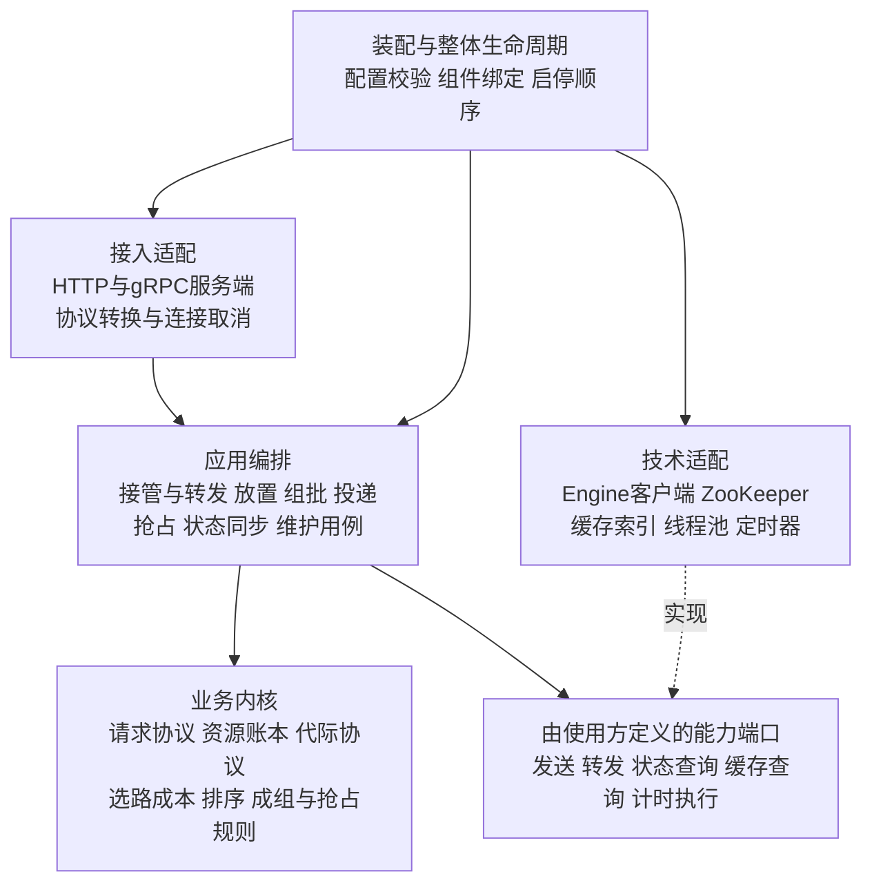

# FlexLB 架构边界与设计约束

本文为整个 FlexLB 提出可审查的逻辑边界，约束后续类设计。它高于单个类的迁移方案，不要求立即拆 Maven 模块或重写现有并发协议。状态为架构提案：接口隔离和依赖检查尚未全部实施；原请求交接文档中的行为约束继续有效。

此前交接主要解决请求对象的职责，不能替代整体架构。`DirectPlacementCoordinator` 可以修复一处模式编排不对称，但不能单独解决接入、领域协议和技术实现的依赖混杂。

## 1 FlexLB 的职责

FlexLB 为推理请求决定处理权归属、资源放置和投递方式，并在异步反馈、不确定通信和节点代际变化下维护可解释的请求及资源状态。推理计算本身由 Engine 执行。

系统必须清楚地区分以下问题：

| 问题 | 决策归属 | 输出 |
| --- | --- | --- |
| 本实例能否接管请求，还是交给 Master | 请求用例中的领导权与转发流程 | 本地接管、已转发结果或有证据的失败 |
| 现在尝试放置，还是排队等待 | 放置编排 | 精确的一次放置尝试 |
| 选择哪些端点 | 路由决策 | 候选端点和代际选择凭证，不是已发送事实 |
| 当前容量是否允许交接 | 资源协议 | 精确预留、交接或拒绝 |
| 何时组成一组，如何交付 | 组批和投递编排 | 路由响应或真实 EnqueueBatch 的发送结果 |
| 哪个响应被选中，还欠哪些资源义务 | 请求协议 | 唯一响应选择、阶段与结算动作 |
| Engine 实际报告了什么 | 状态同步及代际验证 | 经精确代际验证的观察事实 |
| 如何通信、计时、执行和存储 | 技术适配 | 带明确失败语义的机制结果 |

调用先后不是分层依据。一个请求会多次回到请求和资源协议，不应按流程每一步建立一层。

## 2 逻辑边界与依赖方向

使用接入、应用编排、业务内核和技术适配四种职责，加一个装配与整体生命周期边界。业务内核内部区分决策计算和状态协议；二者不是上下级。

箭头表示目标源码依赖，不是响应数据的流向。端口归使用它的业务或用例边界声明，技术实现依赖端口；内核不能导入适配器实现。回调返回事实不意味着允许底层引用整个上层服务。

| 边界 | 允许做 | 不允许做 | 当前代码中的主要落点 |
| --- | --- | --- | --- |
| 接入适配 | PB/HTTP 转换、连接 deadline/cancel 桥接、状态码和序列化 | 选择 worker、决定转发失败后是否可重放、修改容量和请求内部阶段 | FlexlbServiceImpl、HttpLoadBalanceServer、拦截器 |
| 应用编排 | 调用领域协议和能力端口，组织完整用例，明确外部动作时序 | 绕过协议逐字段写状态、独立维护重复容量账本 | RequestScheduler、模式协调器、WorkerBatcher、投递/抢占协调器、同步流程 |
| 决策计算 | 消费所需不可变事实，计算排序、成本、组、victim 方案 | RPC、创建线程、写请求生命周期、执行容量预留 | 成本公式、排序、GroupPlanner、EvictionPlanner 的纯计算部分 |
| 状态协议 | 校验身份、原子修改本地事实、维护所有权、产生精确交接结果 | 发网络请求、遍历服务组件、运行任意用户回调 | BalanceContext、PrefillState、DecodeState、代际 gate、事务状态 |
| 技术适配 | 执行调用，转换 wire 结果，管理线程和存储机制 | 从通信超时自行推导业务回滚或重试、重新决定业务结果 | Engine 客户端、Forwarder 的通信部分、Timer、执行器、缓存索引 |
| 装配与生命周期 | 配置选择、构造组件、按契约启动和排空 | 根据某请求的 ACK/cancel 裁决业务结果 | DeliveryBindingConfiguration、SchedulerRuntime、ApplicationLifecycle |

本地锁和 CAS 不必移出业务内核：它们可以是本地原子协议的一部分。禁止的是网络等待和无约束回调，不能借“纯领域”之名拆开请求资格与 endpoint handoff 的原子区。

## 3 现有类的重新定位

### 接入与请求用例

FlexlbServiceImpl 当前同时执行 PB 转换、Master 判断、转发和安全重放判断。目标将“接管与转发”提取为应用用例，接入层只保留 wire 和连接生命周期处理。转发结果由通信适配器提供，应用用例判定能否本地接管；请求协议防止重复接管。不能只把方法搬到另一 HTTP helper。

用例接口接收稳定请求输入和明确的取消/deadline 信息，返回业务响应或原异步结果；不接收 StreamObserver。opaque trace context 或序列化 payload 可以保留为边界元数据，不将一次去框架依赖改造成全量 DTO 重写。

### 放置编排与路由

RequestScheduler 保留注册、查询和模式分派。DIRECT 完整流程归 DirectPlacementCoordinator；QUEUE 完整流程归 GlobalQueueCoordinator。二者依赖选路及请求/资源操作端口，不依赖接入适配。

DefaultRouter 目前包含多角色选择与 pin 的交接，它整体不是纯函数。它属于放置过程中的选路编排；内部成本计算和候选排序属于决策计算。不要把“整个 Router 无副作用”作为错误约束，也不要在选中一个精确候选后增加另一轮隐式 fallback。

### 请求协议与资源协议

BalanceContext 保护单请求事实。资源 State 保护端点容量。应用编排持有精确能力完成两边交接；请求不得写资源计数，资源不得选择请求响应。

PrefillEndpoint/DecodeEndpoint 当前既包装 State 又向 RequestScheduler 报告事实。目标是让资源侧产生精确事实，或通过本边界定义的窄通知端口报告；去掉对整个 RequestScheduler 的具体类型依赖。执行该报告的时点和线程必须保持现有契约，不要求新增异步消息总线。

端点当前拥有 WorkerBatcher 的运行期，不要求立即改变构造和销毁关系。先限制对外能力和跨层调用；仅有组合关系不意味着下层账本可以驱动任意上层用例。

### 状态同步与发现

发现、选主和定时 poll 是触发源。同步应用流程负责绑定精确代际、应用状态、触发资源协调和请求事实；通信适配器只提供解码观察。一个观察只有经过代际校验才有权更新状态。

WorkerStatus 位于 common/dao，但拥有 generationId、锁、PollLease 和原子快照，它不是普通 DTO。应区分其代际实体、只读观察视图和 wire 转换职责；禁止仅因为 Maven 共享便利就让所有模块取得其全部写权限。本轮不要求盲目拆成三个对象，先收窄使用者视图和修改入口。

### 缓存能力

缓存匹配提供选路依据，不能决定容量预留或请求终止。当前 CacheAwareService 接收完整 WorkerStatus、按地址删除缓存，代际隔离依赖调用方。目标输入应收窄为所需缓存观察及明确代际证据，或者保留并测试调用方的原子 fence；不能只给参数加一个 generationId 就宣称隔离完成。

## 4 三个变化轴

| 变化轴 | 选择 | 应影响的边界 |
| --- | --- | --- |
| 放置方式 | DIRECT / QUEUE | 放置协调，不改变请求终止与容量记账 |
| 组批方式 | SINGLE / FIXED_WINDOW | 队列端点的组选择，不重新选 worker |
| 交付方式 | NON_BATCH / BATCH | 路由响应或批次投递，不改变选路成本规则 |

变化轴可以分别解释，不代表任意组合都合法。当前配置明确要求 DIRECT 使用 NON_BATCH；QUEUE 才有 SINGLE/FIXED_WINDOW 决策。保持启动配置校验，不能为了接口对称允许新的组合。

新增 DirectPlacementCoordinator 的理由是模式编排职责独立，不能因此给 DIRECT 添加队列、工作线程、空实现的 close 或第二份状态机。

## 5 必须执行的架构规则

以下是目标约束。结构规则在对应边界迁移时落成自动化检查；涉及并发和行为的规则必须用契约测试验证。不能声称 package 或 interface 本身已保证全部行为。

| 编号 | 规则 | 验证方式 |
| --- | --- | --- |
| A01 | 接入代码只依赖用例入口、查询视图与边界 DTO，不依赖资源 State、选择策略或队列实现 | 包依赖规则；管理查询也用只读 view，不直接拿可写实体 |
| A02 | 应用用例签名不暴露 StreamObserver、HTTP handler 或具体 gRPC stub | API 签名扫描/架构测试 |
| A03 | 纯决策代码不依赖 RPC、执行器、可写请求状态和容量修改 API | 独立 decision 包的依赖检查与确定性测试 |
| A04 | 状态协议不依赖 RequestScheduler、具体通信客户端、Bean 容器或 Executor | 依赖检查；仅保留明示的本地交接端口 |
| A05 | 每种可变业务事实只有一个写入协议 | 私有字段、行为 API、跨实例及重复事件测试；快照不是第二个可写 owner |
| A06 | 跨边界传递事实、快照和精确能力，不能传完整服务作为万能参数 | API review；每个端口列出调用方实际需要的方法 |
| A07 | wire 结果只提供证据，重试/回滚由用例及领域协议决定 | timeout、断连、ACK、UNKNOWN、NOT_SENT 的区分测试 |
| A08 | 运行设施不能选择业务结果；用户回调在资源和请求临界区外执行 | 发布竞争、线程阻塞、取消和重入测试 |
| A09 | 跨请求事务独立于单请求对象，且不能持有多个请求锁等待外部完成 | batch/preemption 协议及锁路径审查 |
| A10 | 服务实例生命周期、请求结算和端点代际生命周期分别维护 | 退役、迟到 poll、请求 ID 复用、shutdown 测试 |
| A11 | 配置装配选择实现，业务内核不从全局容器查服务 | 禁止 service locator；启动组合校验测试 |
| A12 | common 只放有明确共享契约的内容，不承载为了打破依赖而下沉的业务可变实体 | 新增 common 类型必须说明使用者、写入者和 scope |

A04 的“状态协议”特指收敛后的请求/账本内核，不是要求当前整个 endpoint 包在同一个提交中满足。纯函数部分和运行编排需先分类，避免把原子协议拆碎以迎合 import 规则。

Callback 接口应在需要该能力的边界定义。适配器实现接口可以形成运行时回调，但不能反过来在底层声明 `setScheduler(RequestScheduler)`。不为每个 Java 类建立一个同名接口；只有跨边界的稳定能力才需要端口。

## 6 本地一致性和所有权

| 事实 | 唯一所有者 | 跨边界形式 |
| --- | --- | --- |
| 已注册请求及同 ID 的当前实例 | 请求目录 | 精确 Context/原 Future 身份及只读查询 |
| 阶段、响应胜者、请求侧清理义务 | 单请求协议 | 命令、精确事件和终止 action |
| 全局排队顺序及容量等待 | 全局队列 | entry、唤醒、放置尝试身份 |
| endpoint 预留和 Engine 归属 | 端点资源账本 | reservation、lease、只读容量视图 |
| 一次 batch 的发送责任 | batch 事务 | submission permit 和精确结果 |
| 请求侧抢占参与 / 资源侧 hold | 各自协议 | 相同 attempt/token 关联的事实；二者生命周期不同 |
| 代际的交接和退役 | endpoint generation gate | pin、handoff permit、退役事实 |
| 内部任务和响应发布排空 | 对应执行设施 | 任务身份、publication permit |

业务字段私有化只是必要条件。若调用方仍必须依次读取 stage、item、claimKind，再调用多个无检查方法才能保证正确，说明一致性边界仍在外部，不能认定封装完成。

## 7 当前证据与目标差距

以下是本次只读核查发现的结构事实，不自动等同于功能 bug：

| 现状证据 | 设计差距 |
| --- | --- |
| FlexlbServiceImpl.shouldScheduleLocally 根据 NOT_MASTER、lifecycle、连接错误判定是否接管 | 接入转换与可重放用例策略耦合 |
| RequestScheduler.submitDirect 与 GlobalQueueCoordinator.plan 均调用 Router | 模式编排分布不对称；共用 Router 本身合理 |
| PrefillEndpoint/DecodeEndpoint 持有 RequestScheduler，报告状态和退役 | 底层只需事实通知，却依赖整个上层服务 |
| CacheAwareService.updateEngineBlockCache 接收 WorkerStatus；删除接口按地址 | 共享可变实体暴露和代际 fence 的契约需要明确 |
| WorkerStatus 位于 common/dao，含锁、代际身份和 poll slot | 物理模块名称没有表达真正状态所有者 |
| EngineCancelChannel.isSupported 接收 DecodeEndpoint | 通信能力查询暴露完整资源实体；应只传所需能力/目标信息 |

目前 Maven 依赖大致为 api → sync → cache/grpc → common。这个构建图本身不能证明存在清晰的业务层次；sync 内部仍同时包含内核、编排和适配。不要先重命名 Maven 模块再声称完成分层。

## 8 实施和审查顺序

1. 先将当前类按本文边界分类，标出每个跨界依赖实际使用的方法；区分纯计算、事务状态和运行编排，不能仅按包名分类。
2. 对接管/转发、放置、请求/资源通知、发送通信、计时发布分别确定窄接口和不可改变的契约。复用 EngineCancelChannel、DeliveryStrategy、Timer RequestAccess 等已有边界，修正签名泄漏；不全部重建。
3. 一条用例纵向迁移并通过行为测试，再执行下一条。请求内部封装可延续已有交接，但不能先落成整个系统的新接口再等最后集成。
4. 对已完成边界加入依赖测试；既有越界项显式列清单，精确到来源和目标，禁止新增。迁移完成即删除对应例外，不能全包豁免。
5. 编译期规则证明依赖方向；原有竞态、退役、投递和 API 集成测试证明行为；性能 profile 检查锁热路径和分配变化。三类证据互不替代。

优先在现有模块内形成明确 package 边界，必要时才按稳定职责拆 Maven 模块。状态实体和不可变 contract 从 scheduler 包迁出时，需要整体更新使用者；不能在 common 中留下同名副本作为永久兼容层。

### 用变化场景检验边界

| 场景 | 合理改动范围 | 不应被迫修改 |
| --- | --- | --- |
| 增加一种成本公式或路由排序规则 | 决策计算和配置绑定 | Context 终止、Publisher、gRPC 接入 |
| 更换 Engine 通信实现 | 通信适配及装配 | 请求阶段、资源账本和选路公式 |
| 增加放置方式 | 放置编排及配置选择 | 容量释放证据和响应竞争规则 |
| 修改组批窗口策略 | 成组规则和 Worker 驱动 | Master 转发、端点选择和请求身份 |
| 更换 Timer 实现 | 计时适配及注册契约 | 超时业务语义和响应胜者规则 |
| 节点相同地址重新上线 | 代际/注册与精确事实处理 | 按地址批量修改所有请求的状态 |

场景变化若确实引入新的外部语义，可以跨边界修改；这里检查的是本应独立的实现替换是否被迫触及无关协议，不是要求所有需求永远只改一个类。

本提案未完成全仓逐类迁移或架构测试实施，也未证明新的接口组合可在 Java 中无损替换全部现状。它提供后续设计必须遵守的边界和反例标准，之前的目标类图应依此继续收敛，不能作为完整系统已设计完毕的依据。
