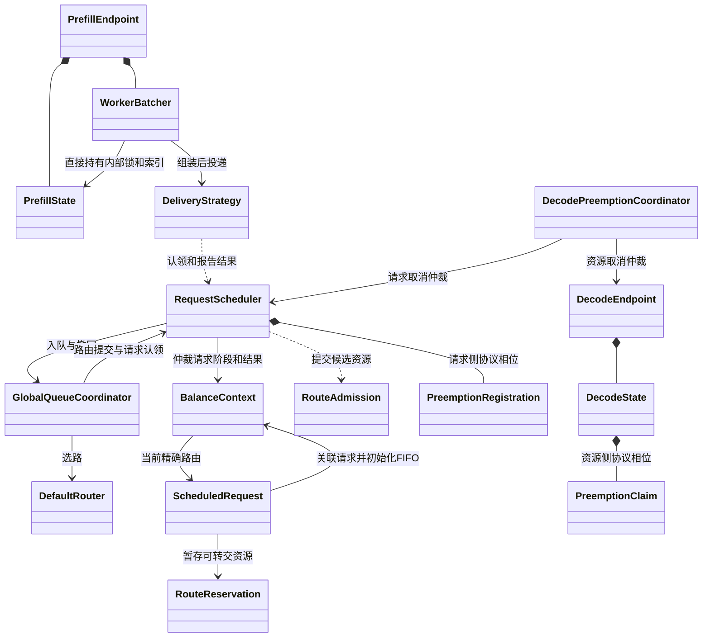
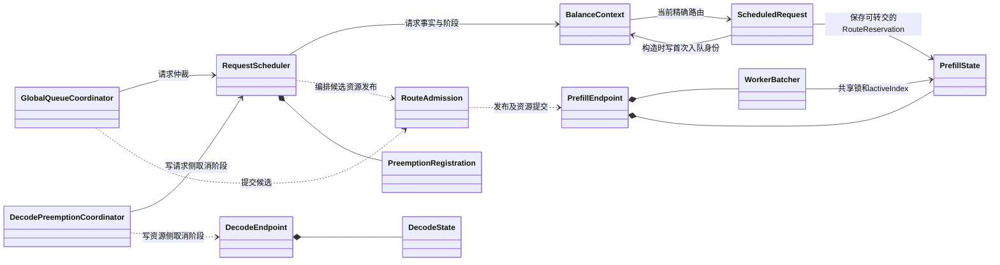
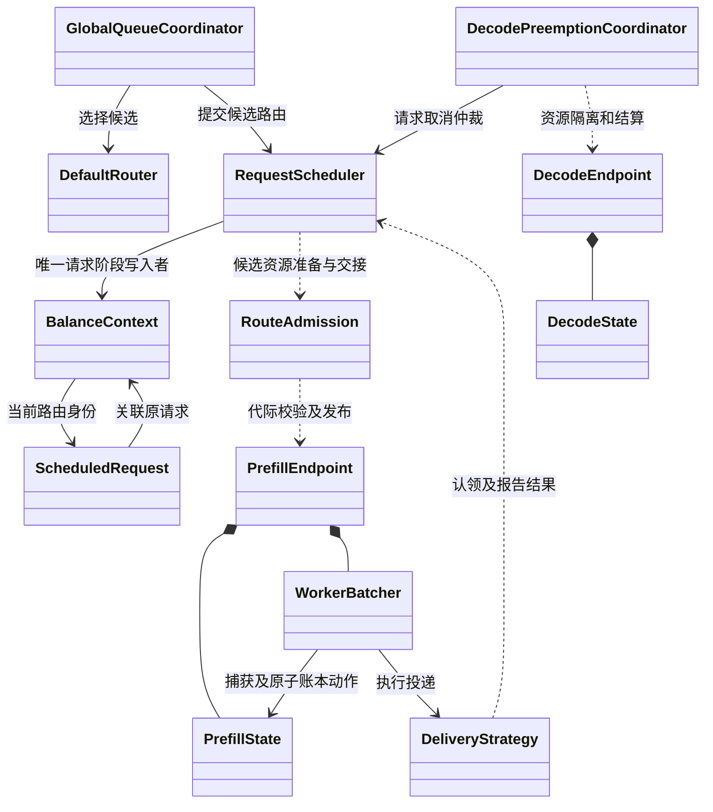
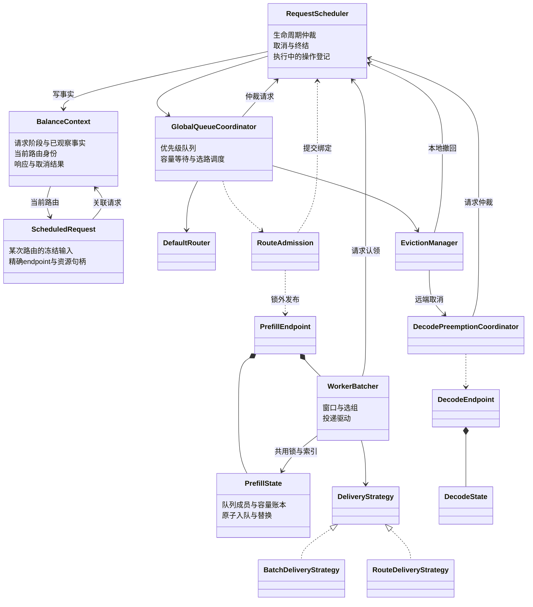
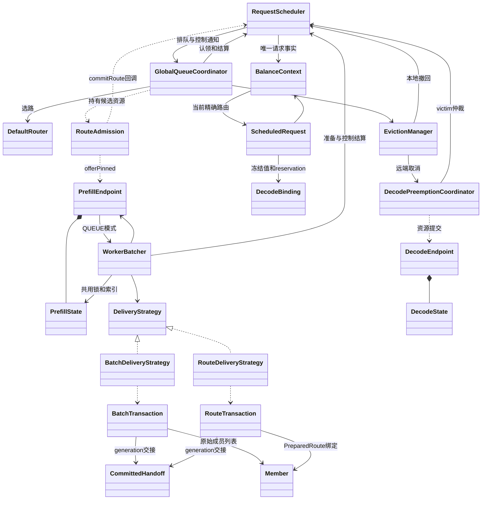
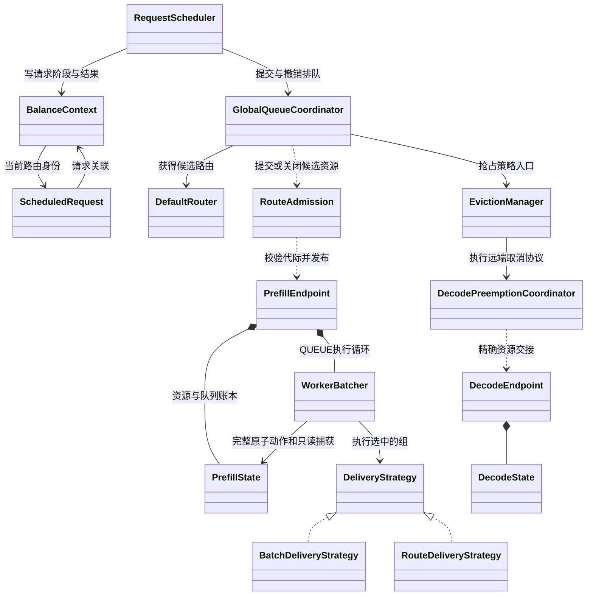

# 调度类结构审查

日期：2026-09-25。审查后已实施 D 的中间所有者删除、B 的重复 ACTIVE 终结合并、测试专用快照删除与原子入队收拢；其余候选尚未实施。

`final-design.md` 仍使用五阶段和 RequestSlot，后续讨论与实现已收敛为唯一
BalanceContext 和七阶段。本文以当前源码为现状，改进项均为建议，不代表已经实施。
完整外围依赖见 [当前类图](../current-class-diagram.md)。

## 已实施：选择提交去除重复所有权标记

生产代码 26,914 → **26,899**，净减 15 行。Worker 保留一次锁内提交编排；
精确成员/过期校验和终态边界移除归 PrefillState。删除 Worker.ownsCommitted 和
postCommitFailure 的暂存分支：事务自身 COMMITTED 阶段是唯一提交事实；失败先解锁再 abort，
未提交及部分取得的准备资源仍由外层 try-with-resources.close 负责。
Route.abort 与 Batch 一致，仅处理 COMMITTED，其余阶段不做操作。

曾尝试 State.commitSelectionUnderLock + SelectionCommit 结果对象，review 发现
State→投递事务→State 职责回环，已完整删除该实验。State 不依赖 DeliveryStrategy，
不增加服务层或提交结果对象。共享锁/Condition 仍保留，不能声称已隐藏整个队列索引。
后文“完整账本提交接口”为实验前推导，当前决策以上述实现为准。

## 类图复核：下一轮应改的是边界（当前源码）

以下优先级覆盖后文历史候选；目标接口是设计建议，尚未实施。

### 核心现状

### 三处值得整体改造的关系

| 优先级 | 结构问题与源码证据 | 改进范围 | 完成标准 |
| --- | --- | --- | --- |
| 1 | WorkerBatcher 构造器直接取得 `PrefillState.ownershipLock()` 与 `activeIndex()`；选择循环穿透账本 | 以一次完整队列决策为边界，收拢捕获、提交前验证、队列修改和唤醒协议 | 提交路径不再由 Batcher 拼装成员校验和边界移除；预测仍在锁外；等待仍可共享锁 |
| 2 | ScheduledRequest 构造器写 Context FIFO，DecodeBinding 同时装请求输入与选中资源；Context 输入仍有公开 setter | 把输入冻结、首次 FIFO 初始化、当前路由创建作为一次完整重构 | 同一请求重试使用约定的稳定输入；只有执行者初始化 FIFO；保留每次路由身份 |
| 保留 | Coordinator 将一次 Cancel 回复分别写到 PreemptionRegistration 与 DecodeState.PreemptionClaim | 已核对：请求终态后资源侧仍可能等待迟到证据，两侧具有独立生命周期 | 保留两侧相位和共享转移规则；不引入跨锁共享可变协议对象 |

**建议先做第 1 项。** 之前已经合并入队、撤队和替换，但决策循环依然读取账本内部结构。
最具体的切入点是 `commitPreparedSelection`：同锁内完成精确成员/过期校验、事务 commit、阻塞边界移除和剩余深度捕获，收拢 `ownsSelectionUnderLock` 与 `removeSelectionBoundaryUnderLock`。第 2 项主要改善模型清晰度；
抢占双侧相位已由专项 review 确认为有独立用途，本轮不列入优先删除项。
这些是收益方向，没有证据可承诺单项减少剩余 1,914 行。

### Worker 目标边界：三个动作，不增加 Service

保留现有三个对象并明确职责：

- `PrefillEndpoint`：代际校验、对外入口与退休。
- `PrefillState`：队列成员、资源归属、容量、版本，以及同锁内原子修改。
- `WorkerBatcher`：成组策略、窗口时间、线程运行与投递驱动。

候选动作（语义名称，不是已存在的 Java API）：

1. **捕获决策输入**：返回有界前缀、必要版本、队首/窗口依据；复用已有冻结对象。
2. **校验并应用选择**：预测完成后，依据精确成员与相关版本重新校验，再完成应有的队列修改；失败返回重试原因。stopped 门槛与事务 commit 仍必须处于同一锁范围，外部通知、abort 和 handoff 在锁外。版本不能只检查 queueVersion 而漏掉 schedulingInputVersion、mutationVersion 或代际变化。
3. **等待变化**：在与修改一致的锁下重查条件，再 await；修改方在同一协议下 signal。
   停止和 controlInbox 也是唤醒来源，必须一起处理，不能让 State 无条件等待导致停止失效。

不能只是把 `activeIndex.first()` 包成 `state.first()`。如果 Batcher 仍需要拼装多个
get/check/remove/rollback 调用，所有权边界没有改善。DIRECT 仍直接使用 State 账本，
因此不应把整个 State 并入 WorkerBatcher。共享锁本身可以保留；要隐藏锁必须连 controlInbox、Condition 和容量订阅的完整等待协议一起迁移，尚无证据证明收益。

### 请求模型：按事实的有效期区分

| 事实 | 唯一归属 | 写入者 / 生命周期 |
| --- | --- | --- |
| 请求输入、请求阶段、选定响应和终态 | BalanceContext | 入口初始化输入；Scheduler 仲裁生命周期 |
| 首次 Worker 排队时间与 FIFO 序号 | BalanceContext | Scheduler 在原首次路由创建时点初始化；跨重新排队保留 |
| 本次 endpoint、generation、路由响应与绑定 | ScheduledRequest | 本次路由构造时固定；旧事件必须校验精确 item |
| 未提交候选的 pin / reservation | RouteAdmission | 选路与提交流程；未转交资源通过 close 释放 |
| ACTIVE 队列成员与 Route lease | 当前 State 账本与 item 的交接协议 | 暂时保留；只有入队、撤回、抢占、投递全部迁移后才可删除 item 的 CAS 句柄 |

因此 Context 与 ScheduledRequest 仍应分开。当前问题是后者兼任输入初始化者和资源交接者，
并不是有两个对象本身。输入冻结优先复用 SchedulingMetadata/DecodeBinding；须先核对配置
是否允许重试间更新，不能将全部配置默认冻结到注册时。

### 抢占模型：双侧 phase 是疑点，还不是冗余结论

`PreemptionRegistration.phase` 决定请求能否解除抢占、如何裁决暂存终态；
`DecodeState.PreemptionClaim.phase` 决定资源 hold 的保留、普通状态协调与精确释放。
二者当前各自受不同锁保护。Coordinator 的 ACCEPTED 分支先写资源侧，再写请求侧，
局部更新失败会转入 UNKNOWN 处理。这些补偿分支正是复杂度来源。

专项 review 已核对：请求侧 phase 用于本地释放、NOT_FOUND 活跃恢复、UNKNOWN 暂存终态和 FENCED 裁决；资源侧用于 KV hold、普通调和和精确结算。请求目录清理后资源 claim 仍可能存在，不能查询请求侧来替代。`cancelAcknowledged` 还保留 REQUESTED→UNKNOWN 的历史确认事实。共享 enum 已复用转移规则；保留双侧存储，优先改造前两项。

### 哪些类暂不合并

- Scheduler 与全局队列：请求仲裁和排队/容量等待生命周期不同；回调关系本身不说明重复。
- Endpoint 与 State：代际生命周期与资源账本的边界仍有作用，优先检查无语义转发函数。
- Batch 与 Route 投递：成组 RPC 与前端路由响应的发送接管边界不同，共同基类容易放大分支。
- 请求响应与资源终结：成功响应之后 Engine 仍可持有资源，不能由同一个 FINISHED 判断替代。

本轮只修正类图和结构方案，没有变更生产代码。生产仍为 26,914 行；性能尚未达标。

## 已实施：RequestScheduler 统一编排路由提交

QUEUE 与 DIRECT 分别进入 RequestScheduler.enqueueRoute/commitDirectRoute。
RouteAdmission 不再接收或调用 RequestScheduler，只保留候选 pin、Decode reservation、
精确阻塞 endpoint 和 DIRECT 资源取得结果。单调用的 commitImmediateRoute 已合并。
共享 commitRoute(BooleanSupplier) 的请求锁/锁外发布边界仍保留，本轮消除了类的反向
依赖，没有声称删除所有 publication 回调。

没有新增状态或类。生产27,052 → 27,039，净减13行；大部分改动为职责归位，
不计作大规模减码。输入冻结、ScheduledRequest 构造副作用及25,000行/性能目标仍待完成。
下文目标接口描述早于本次实施，作为设计推导记录保留。

## 本轮：从类关系追到状态写入者（2026-09-25）

源码口径：sync 生产 Java 共 **26,914 行**。以下为结构分析与待实施方案，
不把目标类图当作已完成重构。前几轮已收拢的入队、替换、撤回不再列为待办。

### 1. 现状：最值得检查的三条关系

图中双向依赖本身不是错误；下面按实际写入和交接说明问题。

| 位置与证据 | 不自然之处 | 建议收敛的边界 |
| --- | --- | --- |
| `RequestScheduler.enqueueRoute/commitDirectRoute` → admission 内的 `offerQueued/markCommitted` | 反向编排已消除；锁外发布仍是独立边界 | 已实施，不能再把旧 `RouteAdmission.tryEnqueue` 列为待改问题 |
| `ScheduledRequest` 构造器写 `firstWorkerEnqueueTime/workerEnqueueSequence`，另有 `publishedRouteReservation` CAS | 它实际兼任冻结输入、请求身份初始化和资源交接，不能再笼统称为“只读快照” | 首次入队身份由 Scheduler 的路由创建入口初始化；ScheduledRequest 保留精确路由及暂时拥有的 lease，直到证明能删除整个交接协议 |
| `WorkerBatcher.activeIndex/queueLock` 与 `PrefillState` 共用；Batcher 自行捕获版本、检查成员、等待唤醒 | 账本内部结构被执行循环直接依赖，修改索引容易影响多个类 | State 提供完整原子动作和决策所需的冻结输入；Batcher 负责预测、窗口和执行。等待条件与同锁检查必须一起设计 |
| `DecodePreemptionCoordinator` 对 `PreemptionRegistration` 与 `DecodeState.PreemptionClaim` 分别更新 `PreemptionCancelPhase` | 同一控制事件跨两把锁投影，失败路径须处理部分更新；协议变化波及请求和账本两侧 | 明确请求侧保存协议事实，账本侧保存精确资源隔离与可释放条件；先核对每个 phase 的实际用途，再决定能否删字段或缩小状态 |

### 2. 目标关系：收拢编排，保留不同生命周期

目标图仅省略辅助关系，不表示消除所有回调。尤其不要求把异步清理塞进 Context，
也不把 Prefill/Decode 两套容量账本合成一个通用 State。

### 3. 下一轮应落实的接口与删除项

**优先：路由提交的编排方向。** 候选接口为
`RequestScheduler.enqueueRoute(BalanceContext, RouteAdmission)`，返回现有
`PlacementResult<ScheduledRequest, PlacementKey>`。全局队列调用这个入口；
Admission 保留准备 Decode、创建路由值、带 pin 发布和 close 的资源能力。
接口名字尚可调整，验收目标是删除 `RouteAdmission.tryEnqueue` 对 Scheduler 的反向调用，
而不是在原方法外加一个同名转发层。

实现前必须同时处理 `tryCommitDirectRoute/commitImmediateRoute`：它们也调用
`commitRoute`，DIRECT 的发布动作是资源预留，QUEUE 的发布动作是 ACTIVE 入队。
只改 QUEUE 就不能声称已经删除整个 publication 协议；不能为了消除函数参数重复一套终结逻辑。

完整时序必须仍是：请求锁内绑定精确 item → 释放请求锁 → 带 generation pin 发布 →
请求锁内推进 READY_TO_DELIVER → 锁外唤醒。发布拒绝或异常只回滚本次绑定；
资源由当前拥有者经 finally/TWR 关闭，保留主异常和 suppressed 清理异常。

**随后：让路由创建只初始化一次请求身份。** 在原创建时点、同一请求仲裁范围内
冻结首次 Worker 入队时间和 FIFO 序号，再交给 ScheduledRequest 构造器。
删除构造器对 Context 的写入以及不再需要的公共 setter；不能提前到 RPC 注册，
否则不同选路耗时会改变 FIFO。此项主要改善职责，不预估大量减行。

**再后：收窄抢占账本依赖。** 为 ACCEPTED、NOT_FOUND、UNKNOWN、REQUEST_FENCED
逐项列出请求仲裁和资源账本的后果，找出真正重复的状态转换。
保留 request/reservation/attempt/generation 的精确身份和资源 hold；Cancel ACK
不能作为 victim 已终结的证明。只有能删除重复分支和补偿流程才实施，
不新增一个跨对象“统一状态管理器”。

Worker 封装与以上并行的设计原则是：一次捕获返回完整判断所需的头部/有界前缀和版本；
原子变更在 State 内完成，预测在锁外完成。不要机械给每个 `activeIndex` getter 加一层转发；
`Condition` 等待仍要在同一锁下重查条件，避免丢唤醒。

### 专项 review 补充：输入冻结与 victim 聚合

**输入冻结也应作为整体改造，而不只修改构造器。** 当前 GQC.offer 冻结队列
priority/policyGroup，DefaultRouter.select 每次重试调用 DecodeBinding.capture(context)，
选路策略仍读取 Context 的 request/config，ScheduledRequest 最后再冻结另一部分字段。
应优先扩展既有 SchedulingMetadata/DecodeBinding 所表达的请求输入，而非并行新增一套 DTO；
队列、Router 和路由对象使用同一份稳定事实，Admission 只补选中的 endpoint 与 reservation。
注册后限制 request/metadata 的替换入口。请求输入和实时 Worker 状态必须分开：
Worker 容量、缓存命中和模型预测快照仍在每次选路时读取；配置中哪些值应跨重试固定，
需先核对既有更新契约，不可一律提前冻结。首次 Worker FIFO 身份仍在原路由创建时点产生。

**抢占有一个更容易验证的聚合调整。** Coordinator 已有 ClaimedVictim，保存
view/target/claim/terminalCompletion/disposition；但 ACK 又单独维护一个平行列表，
handleAcknowledgements 按 index 同时读取 command.victims、claims 和 acknowledgements。
可将 ACK future 纳入既有 ClaimedVictim，删除平行列表及方法参数，处理阶段直接逐 victim
消费 ACK。必须保留“先给所有 victim 安装终态观察，再发送第一个 Cancel”的顺序，
以及 allOf 对所有 ACK 完成的屏障。该调整不需要增加类或改变资源所有权。

并发审查确认路由消环可行，但 QUEUE 的 offer 成功后须在 READY 之前 markCommitted；
BLOCKED 时仍保留 Decode reservation 和 pins，供全局队列尝试优先级抢占，最终由 plan.close
释放。DIRECT 可用现有 typed ReservationResult 代替可变 PrefillReservationAttempt，
但 member、RouteCommitAdmission/handoff 与 claimDelivery 的 finally 次序必须保留。

三项专项审查后已实施 ACK 聚合：ClaimedVictim 直接保存 acknowledgement，
allOf 从完整 claims 建立，handleAcknowledgements 不再接收平行 ACK 列表或按 index
拼接 victim。终态观察器安装顺序与全部 ACK 屏障保持不变。生产净减10行至27,073。
路由提交目标接口、输入冻结及资源侧相位收窄仍未实施。

专项79/79通过；新增双 victim ACK 乱序测试覆盖 FAILED、NOT_FOUND、REQUEST_FENCED，
CoordinatorTest 共8/8通过。前置 targets/victimReservations 列表仍保留：它们确保
全部取消目标先验证，再开始请求 claim 与 endpoint begin，不与发送后的 ACK 聚合等价。

### 4. 用什么判断这次结构重构有效

- 删除反向编排、重复状态转换或跨对象补偿；不以移动文件、改名或新增转发接口计成果。
- 既有取消/退休与发布竞态、旧路由晚到事件、首次 FIFO 稳定性、发送结果未知、清理失败重试均保持。
- 结构变化后跑本地回归；涉及调度热路径的大改同步远端容器跑性能。
- 当前 25,000 行目标还差 1,914 行；最新完整 profile 的远端 burst P99 为 1,182 ms，高于 250 ms 门槛（16 项中 15 项通过）；先前 836 ms 为不同版本的单项运行，不能据此归因。
  类图分析本身不构成减行收益或性能达标证据。

## 当前结构结论（2026-09-25，27,108 行）

本节重新按职责与资源交接审视当前源码；后文保留历轮分析和实施记录。
问题集中在三处：跨对象编排、快照对象承担修改职责、协议与指标混杂。
不能根据双向箭头或类名相似直接合并。下面的行数为生产 Java 物理行数，包含注释和空行。

| 结构簇 | 当前行数 | 不自然之处 | 改进方向 |
| --- | ---: | --- | --- |
| RequestScheduler / BalanceContext / ScheduledRequest | 3,137 / 280 / 252 | Scheduler 同时处理生命周期、资源交接、异步清理；ScheduledRequest 构造器反向修改 Context | 先统一一次动作的执行入口和状态写入者；快照构造不再初始化请求事实；不把 Scheduler 机械拆成多个 Service |
| PrefillEndpoint / WorkerBatcher / PrefillState | 658 / 1,286 / 2,063 | Batcher 持有 State 的锁与索引，Endpoint 又拥有二者，封装边界相互穿透 | State 实现完整原子账本动作；Batcher 负责选择、等待与驱动；Endpoint 负责代际校验与外部入口 |
| RouteAdmission / RequestScheduler | 332 / 3,137 | Admission 调用 Scheduler，Scheduler 又执行 Admission 的 publication 回调 | 在保持锁外发布的前提下审查整个提交/撤销协议；单纯挪 tryEnqueue 会暴露 pin/reservation，暂不采用 |
| BatchDeliveryStrategy / RouteDeliveryStrategy | 766 / 394 | 准备、提交、发送接管、终结存在相似骨架，但资源转移单位不同 | 删除重复准备和资源拥有者；保留各自接管边界，不引入通用事务基类 |
| EvictionManager / DecodePreemptionCoordinator / DecodeState | 280 / 578 / 1,784 | 策略入口混合候选选择、两种执行路径和大量指标；取消协议跨请求仲裁和资源账本 | 先区分选择 victim、本地撤回、远端取消三种动作；逐项清除重复结果记录，保留请求 claim 与资源 claim |

### 类图应表达三种职责，而不只是调用层级

以下是当前主要关系的精简图，省略配置、指标、定时器及内部资源类。

### 改进必须删除什么

1. **Worker 账本操作收拢**：继续检查撤回、停止、投递提交，删除 Batcher 中分段修改索引和容量后再补偿的流程。原子入队与本地排队替换已经收拢；不能把已有 getter 再包一层就算完成。
2. **路由对象恢复快照职责**：ScheduledRequest 的首次排队时间和序号初始化应由创建路由的执行入口负责，同时约束 Context 的写入口。保留跨重排的 FIFO 身份与旧路由隔离；预期主要改善职责，并非大量删行。
3. **投递按资源归属简化**：本轮已合并 Batch 首成员两次 prepareDispatch，删除 prepareAdmission、blocked 工厂和 prefill 字段，共净减 41 行。继续审查失败/关闭分支是否维护同一资源的第二份所有权。
4. **抢占按动作审查**：EvictionManager.tryReserve 的本地分支与远端分支是两种真实操作；不强行合成相同协议。指标方法不能改变协议结果；先核对指标和结果转换是否重复，再决定能否删除整段流程。

衡量标准：一次动作由一个执行流程编排，每类事实只有一个权威写入位置，每项资源有明确的交出时刻。只有同一事实被重复维护才删状态；阶段、远端证据和资源所有权不能互相替代。

### 当前判断与限制

- RequestScheduler 3,137 行值得优先审查，但拆文件本身不能减少复杂度。先核对其路由、抢占、清理三种操作在入口、完成和异常分支上的重复，再决定是否需要抽取。
- Context 记录请求事实；Scheduler 的 routingOperations、preemptions、cleanupOperations 记录在执行的动作。它们不能直接全部移入 Context，形成新的 RequestSlot。
- PrefillState 与 DecodeState 分别记录不同资源。请求 FINISHED 与资源释放、Cancel ACK 与终态证据也不能合为一个状态。
- 当前总量距 25,000 行还差 2,108 行；没有证据支持某个单独合并就能完成目标。最新远端同步27,115行版本，默认256 planner的burst Master P99 889 ms；32/8 planner的定位样本为723/643ms，均未达到250ms。当前完整本地回归1633通过、1跳过；定位实验未重跑完整性能矩阵。

## 1. 现状：请求经过哪些对象

实线表示持有关系，虚线表示调用或临时使用；省略指标、配置、定时器与部分内部类。

双向引用本身不是错误。要检查的是：一次业务动作是否需要多个对象分别认领、记录、
撤销同一件事，以及是否存在多个状态写入者。

## 2. 最值得改的结构

### A. RouteAdmission 既保管资源，又编排请求执行

证据：`RouteAdmission.tryEnqueue:100` 调用 `RequestScheduler.commitRoute:1140`，
后者再执行前者传入的 publication 回调，回调进入 PrefillEndpoint，最后进入 WorkerBatcher。
DIRECT 路径还由 RouteAdmission 执行准备、提交和认领。

问题：阅读正常入队也必须跨对象来回跳转；失败资源归属和请求状态回滚分别藏在两端。
值得追踪整个交接，但不直接证明某一层可以删除。

初步设想是把编排搬回请求执行者。并发复核后，暂不采用：RouteAdmission 唯一拥有
pin、reservation、provisional。向外移动 tryEnqueue 必须公开这些内部能力，可能
增加接口并分散清理责任；DIRECT 与 QUEUE 也不能机械共用全部流程。
只有证明能够共同删除一整套提交/回滚流程后，才考虑合并。当前保留这一事务边界，
不另建 AdmissionService，不把移动 28 行当作减码。

必须保留：当前 commitRoute 先锁内绑定、锁外入队、锁内推进 READY_TO_DELIVER。
AdmissionHandle 在此期间阻止提前结算。不能为了消除回调，把 endpoint 入队移到请求锁内。
候选冻结值、失败回滚和 generation pin 也不能删。

### B. WorkerBatcher 直接操作 PrefillState 的锁、索引和账本

证据：`WorkerBatcher:275` 起直接取 `ownershipLock()`、`activeIndex()`，
PrefillEndpoint 又持有二者。三者不是相互独立的封装层。

建议：保留 PrefillEndpoint 的代际和外部入口；PrefillState 独占队列索引与容量账本的
修改；WorkerBatcher 负责循环、窗口、选组和执行。把跨索引/账本的原子修改收回已有
PrefillState，删除 WorkerBatcher 的对应修改分支和重复校验。

不要逐个 getter 套转发函数，也不要增加 QueueService。每次收敛必须减少一段完整的
跨对象状态更新；纯观察快照、容量唤醒和共享锁的原子性仍需保留。

验证重点：低优先级撤队与新请求占位原子性、取消优先处理、容量释放先于 await、
generation 退休时队列与账本均归零。预测计算不能因此搬入锁内。

已删除外围链 PrefillEndpoint.captureQueueSnapshot → WorkerBatcher.captureQueueSnapshot
→ WorkerBatcher.QueueSnapshot。测试直接读取已有 PrefillActiveIndex 的锁内 capture，
保留冻结身份、快照不变性和版本断言。

已将 PrefillState 的 ACTIVE 与 ACTIVE Route 终结入口合并：共用精确 entry 查找、
索引移除、请求删除与版本更新；Route 分支先校验 exact lease 再关闭，Batch 分支保留
准备事务持有的 OPEN lease。新增错 lease 不得删除任一队列 owner 的回归测试。
停止的 detach→callback→ack 流程仍保留，用于回调失败时的 generation 退休重放。

### C. ScheduledRequest 的构造器改变唯一 Context

证据：`ScheduledRequest:79` 写首次 Worker 入队时间和序号，随后又复制保存这些值。
它同时承担路由快照、队列身份、NON_BATCH 临时 reservation 所有权和 Context 初始化。

建议：先把首次 Worker 入队身份初始化交给执行流程，并限制 Context 对外 setter；
再检查队列年龄与序号能否只保留一个可靠来源。ScheduledRequest 保留精确路由身份、
冻结配置及资源句柄。不能整类并入 Context：旧路由的迟到事件仍需和新路由区分。

验证重点：初始化时点与当前行为一致，不能提前到全局注册；撤回重排不改变 FIFO 身份；
旧 item 不能清理新 reservation。不要把冻结配置改为动态读取 Context。

另已修复 DefaultBatchDispatcher 发 RPC 时从可变 Context.request 读取 priority 的问题，
发送统一使用 item.priority()，与 DecodeBinding 的冻结准入值相同。回归用例构造时冻结
60，再修改原 Request 为 7，断言 Engine payload 仍为 60；无优先级仍为 0。
尚未限制其他输入的全部修改入口。Context 的首次入队值在跨路由重建时仍有作用，
item 中的副本用于冻结热路径读取，不能未经验证直接删除副本。

### D. 投递事务的资源所有权链偏长，需要按实际资源逐项归并

审查时 BatchTransaction / RouteTransaction 持有 CommittedAdmissionOwner，后者持有
Member[]、admissionOwned、closed 和 CommittedHandoff。后者又保管 generation permit。
见 `PrefillAdmissionResources:182`、`PrefillState:152`。

已实施：事务直接持有原成员列表和 generation handoff，Member 的同一 monitor
保护 transfer/close；事务原有阶段防止 abort 与 deliver 同时接管。删除中间所有者、
额外 Member[]、closed 和绑定步骤。共享 closeCommitted 仅执行关闭，不保存第二份状态。
DIRECT、BATCH、NON_BATCH 都先清理未转出的 permit，再关闭 handoff。三个专项审查
及回归结果见实施证据。

必须保留：提交前完成可能失败的分配；取消只影响该成员；已转出的资源不能 rollback；
SUBMITTED 后发送执行者独占后续动作。finally 只能释放本地仍拥有的资源，不能释放
远端可能正在使用的容量。Batch 和 Route 的事务阶段不等于请求阶段。

### E. 抢占应收敛整条协议，而非直接合并两个入口类

EvictionManager 当前 280 行，包含策略检查、victim 选择、两种执行路径与指标；
DecodePreemptionCoordinator 578 行，拥有真实 Cancel 协议。简单合并二者只减少类名。

应重点审查 Coordinator 的 ClaimedVictim / AttemptCapability、Scheduler 的
PreemptionRegistration、DecodeState 的 PreemptionClaim：分别哪些是请求控制事实、
哪些是资源排他权、哪些只是同一个远端结果的重复记录。重复协议结果优先收回协议 owner；
请求取消仲裁与 endpoint 资源 claim 保留各自原子边界。

抢占专项复核目前未证明上述三处状态可以直接合并：Coordinator 的 ClaimDisposition
描述取消是否可能已发出，PreemptionRegistration 描述请求协议状态，DecodeState 的
claim 描述 KV 与资源排他权。它们不能仅按名称相似删除。
进一步核对后，不采用合并 findCancelTarget 与 tryClaim：现有流程先验证所有 victim 的
Cancel target，再产生任何请求 claim；target 缺失与 claim 冲突还有不同失败分类。
逐个查询并认领会改变首个副作用的时点；为了保持语义另加结果包装，也没有形成结构收益。

必须保留：本地未发送 victim 可以撤回重排；远端 victim 等终态证据。
ACK、NOT_FOUND、UNKNOWN 不能都转换为释放成功，两个 incoming 不得抢同一个 victim。

## 3. 状态归属原则

| 问题 | 唯一权威位置 | 执行者 |
| --- | --- | --- |
| 请求走到哪里、取消原因、响应是否选定 | BalanceContext | RequestScheduler |
| 全局排队位置、等待何种容量、planner 是否在途 | GlobalQueueCoordinator 的队列/Plan | GlobalQueueCoordinator |
| Worker 上队列成员和资源占用 | PrefillState | 原子账本方法；WorkerBatcher 驱动 |
| 尚未交出的候选路由资源 | RouteAdmission | 当前提交流程；close 释放 |
| 某次发送是否已接管、哪些成员已转交 | 对应投递事务 | 投递策略/dispatcher |
| Decode 容量与精确 reservation、资源抢占排他权 | DecodeState | Endpoint 的账本操作 |
| Cancel RPC 和等待终态的执行进度 | DecodePreemptionCoordinator | 同一协议执行者 |

Context 可以记录阶段和结果；不能因为某字段“与请求有关”就把执行中的资源和工作进度
都塞进去。当前 Scheduler 的 routingOperations / preemptions / cleanupOperations
也不能仅因有三张 Map 就合成一个新 RequestSlot：它们生命周期不同，合并可能重新造出
已经否决的第二请求上下文。

另有一个待量化候选：routingOperations 与 preemptions 在当前 invariant 中互斥，
理论上可共用一个带类型的执行能力索引；cleanupOperations 可以与其重叠，必须独立。
若合并需要新增大量类型判断，则不采用。不得为减少 Map 数恢复通用 RequestSlot。

## 4. 实施顺序与验收

1. 先细化 B：以入队、撤回、停止三种完整原子动作核对索引/账本写入者；
   有重复更新则合并，没有重复则不新增转发层。一起清理仅供测试的快照链。
2. 做 C：让 ScheduledRequest 构造器恢复为保存快照，保持现有首次 Worker 入队身份。
3. 结合投递竞态测试验证 D 能否真的删掉一个所有者；不先写通用事务框架。
4. 抢占按 E 的事实写入者逐项证明；A 暂保留现有事务边界。

三个专项审查已返回：请求并发/状态归属、抢占协议、Worker/投递与测试边界。
投递审查补充：BatchDeliveryStrategy.prepare 对首成员连续两次 prepareDispatch，
可评估把创建事务与首成员 append 放在同一现有请求认领检查内，尾部从第二成员开始；
需要证明取消/到期期间 submission 只关闭一次，失败码和 blocked boundary 不变。
WorkerBatcher.runtimeState 与 stopped 则暂不直接合并，二者还区分线程退出与停止清理认领。

每轮统计总行数、删掉的生产类/字段/分支，以及新增状态数量。若只搬代码、增加包装
接口、减少行数但新增多处状态维护，不能算结构收敛。

审查时为 27,528 行，两轮收敛后为 27,401 行，25,000 行目标尚未达到。此处不预估未经实现验证的
删行收益。较大结构改动本地回归后，按既定远端容器跑性能；本轮远端 burst Master P99
735 ms，高于 250 ms 门槛，性能仍未验收。

## 5. 下一轮目标类图：按一次完整动作收拢边界

这是待实施结构。箭头只表达主要职责依赖，省略事件回调、指标与关闭通知；
不要求消除所有双向引用，也不引入新 Service、通用事务基类或第二请求上下文。

### 已实施：消除 Worker 入队的资源往返

改动前流程（WorkerBatcher.enqueueUnderLock）：

1. WorkerBatcher 持有 PrefillState 的 ownershipLock。
2. 调用 PrefillState.enqueueActiveUnderLock，写入 ACTIVE。
3. 绕回 PrefillEndpoint.reserveRouteOwnership，再进入资源账本。
4. WorkerBatcher 把 reservation 绑定到 ScheduledRequest。
5. 任一步失败，由 WorkerBatcher 调用 State 撤销刚写入的 ACTIVE。

目标：PrefillState 内完成“加入 ACTIVE + NON_BATCH 资源占位 + 失败撤销”这一完整动作。
WorkerBatcher 只根据成功与否决定唤醒、尝试本地抢占，解锁后通知请求执行者。
Endpoint 保留 generation pin 校验与退休边界。收拢时必须核对 reserveRouteOwnership
中实际执行的代际校验，不能直接绕过。

接口约束：优先扩展已有 enqueueActiveUnderLock 语义；如果还需要 WorkerBatcher
逐步 bind/restore/rollback，说明这一轮并未收拢所有权，不应增加一套转发接口。
ScheduledRequest 的 publishedRouteReservation 当前跨投递策略使用，不能先删掉；
需一起核对入队、抢占替换、发送认领、终结四条路径，决定唯一存储位置。

### 次要改动：让请求数据的写入者与类职责一致

ScheduledRequest 构造器当前初始化 Context.firstWorkerEnqueueTime 和
workerEnqueueSequence。将初始化放回创建当前路由的执行流程，构造器只保存冻结值。
保持当前初始化时点、首次身份跨重排稳定的语义；不要提前到请求注册。
BalanceContext 的输入 setter 也需区分注册前初始化与注册后允许写入的指标。
仅移动几行构造器代码不算完成：必须同步限制旧写入口，避免出现两个初始化者。

### 保留的边界及原因

| 边界 | 独立存在的原因 | 不应进行的简化 |
| --- | --- | --- |
| BalanceContext / ScheduledRequest | 请求生命周期与某次精确路由生命周期不同 | 以 requestId 代替旧路由身份判断 |
| RequestScheduler / GlobalQueueCoordinator | 请求仲裁与全局排队、容量唤醒不同 | 把队列位置复制到 Context 再同步维护 |
| WorkerBatcher / PrefillState | 执行循环与容量/成员账本不同，DIRECT 也使用账本 | 把预测和等待循环放进账本锁内 |
| Batch / Route 投递事务 | 成组 RPC 与单路由提交有不同接管边界 | 用请求阶段代替资源转交进度 |
| 请求抢占登记 / Decode 资源 claim | 请求取消仲裁与资源排他权保护不同对象 | 收到 Cancel ACK 就同时清除全部状态 |

优先验收结构变化：删除 WorkerBatcher 的入队回滚分支和跨层资源编排，让 State 成为
这次原子修改的唯一实现位置；再看净行数。这个方向的收益需要实现验证，暂不承诺能
单独减少 2,301 行。当前 sync 生产代码为 27,301 行，25,000 行目标尚未达到。

### 原子入队实施结果

PrefillState.enqueueForDeliveryUnderLock 已统一 ACTIVE 发布、NON_BATCH 退休检查、
route lease 申请/绑定以及 finally 回滚。WorkerBatcher 删除 rollbackFreshActiveUnderLock
和分段申请代码，只做 stopped 检查、调用和成功唤醒；PrefillEndpoint 删除
reserveRouteOwnership 中转接口。底层 reserveRouteUnderLock 校验精确 ACTIVE 身份，
直接返回 lease，删掉重复加锁和不再需要的 ReservationResult 分配/失败状态分支。

ScheduledRequest.bindPublishedRouteReservation 因跨包调用改为 public；现有 lease 存储与
投递/抢占的精确交接没有改动。退休检查位于 ACTIVE 发布后、占位前，拒绝也经 finally
撤销本次入队。测试增加确定性交错，防止未来把检查移到发布前而漏掉此边界。
此轮净减43行：27,301 → 27,258；没有新增状态字段或中间类。后续仍需收拢抢占替换
中的资源交接，不能把这次入队合并算作整套 Prefill 所有权改造完成。

### 本地排队抢占替换实施结果

PrefillState.replaceQueuedRoutesUnderLock 现在独占同锁内的 victim 选择、item 句柄取出、
新请求入队、旧请求终结和失败恢复。调用 enqueueForDeliveryUnderLock 与
terminalizeActiveUnderLock，删除原本另一套 RequestEntry/lease 构造、索引/请求写入与删除。
WorkerBatcher 删除 replaceQueuedRequestsUnderLock，只保留成功唤醒和锁外 victim 通知。
victim 选择器成为私有方法，其输出由当前锁内索引产生，因而删除外部列表重复/尺寸校验；
item 句柄与精确 entry.reservation 的一致性仍校验。失败 finally 恢复已取得的句柄前缀。

此轮净减36行，当前27,222行。原子替换期间仍存在锁外 advisory 计数的临时超额；
此时原值和最终值都已满额，不改变 canAcceptRequest 的拒绝结果。未知 Engine 工作和
已提交请求仍不在候选范围。未新增状态字段或服务层。

### 路由捕获中的冗余物化

PrefillEndpoint.captureProjectionSourceUnderLock 原来仅为判断是否捕获 admissionBlock，
调用 Snapshot.activeItems().isEmpty()，因此在 ownershipLock 内构造完整 ScheduledRequest
列表。现在直接读取同锁内 activeIndex.isEmpty()；锁外 materialize 继续消费原冻结 Capture。
删除 Snapshot.activeItems 转发入口，测试仍从 active().items() 检查冻结内容。
生产代码27,198 → 27,194行。

保留 Capture.projectedItems 缓存：其输出为 JDK不可变List，QueueSnapshot 中的
List.copyOf 通常直接复用；且 ACTIVE 不变时 Capture 可跨 ownership 版本复用。
不能据两个 copyOf 调用就推断存在两次数组复制。ProjectionSource 和 WorkCapture 的
锁外延迟构造边界也仍保留。

### Batch 首成员准备统一入口

BatchDeliveryStrategy 删除 prepareAdmission、BatchTransaction.blocked 工厂和只在初始化使用
的 prefill 字段。prepare 只建立尚无资源的事务，每个候选各经过一次 RequestScheduler
.prepareDispatch；首个 append 在同一请求锁内获取 submission、batchId、Prefill batch lease
与 Decode member。首成员两次锁仲裁合为一次；后续成员、已接受前缀和投递认领保持原流程。
初始化失败仍先 closeSubmission，原异常为主、关闭异常为 suppressed；外层 finally 幂等回收。
batchId 在首成员初始化一次，并由既有 phase 发布给投递线程。此轮净减41行至27,153。

RouteTransaction.transferredReservations 保留：第二成员句柄取得失败时必须释放已取前缀，
现有测试直接覆盖该情况；迁到State仍需同等补偿，不能仅将前缀状态删掉。

### 排队撤回的账本入口收拢

WorkerBatcher 的取消、准备失败和到期三个调用点统一进入 PrefillState.removeQueuedUnderLock；
删除原 removeTerminalActiveUnderLock 和 restoreRouteReservation。State 在同一 ownershipLock
下取得 item-owned Route lease，执行精确终结，失败时 finally 恢复句柄。Batch 分支仍传 null，
不释放准备事务拥有的 OPEN lease。生产代码 27,153 → 27,140，净减13行；本轮主要改善职责边界，
没有声称消除了新的状态机。

停止流程继续独立：detach 保留 STOP_DETACHED canonical owner，锁外通知成功后才 acknowledge；
通知失败由 generation retirement 重放。不能用普通撤队替代。Route lease 的锁外关闭也不能
直接塞入 detach，因为 releaseOpenLease 明确禁止持有 ownershipLock。

专项回归134/134通过，日志 `/tmp/flexlb-active-removal-tests.log`。

### Decode 退休与请求终态共用执行入口

applyDecodeRetirementLocked 保留 endpoint/reservation 的精确身份验证，然后交给
processRequestEndLocked。删除原有的 cleanup 结算、routing 暂存与无抢占终结三套重复分支。
有抢占的退休事件仍先记录、完成并撤下 claim，再选择退休终态、锁外通知；该分支位于
isFinished 检查之前，保持已完成协议仍能由退休收尾的原语义。

退休事件属于 authoritativeWorker，因此 FINALIZING 但尚有 cleanup 的请求仍能进入
共同 reducer；不能错误增加 active-stage 限制。AdmissionHandle 的暂存事件重放顺序不变。
本轮净减16行，生产27,140 → 27,124；专项263/263通过。

finalizationEffects 的额外 signal 保留：其非空调用先 detach 抢占 claim，随后创建的
TerminalAction.preemption 为空，finishTerminal 不会替它通知。仅看到两处 signalTerminal
调用不足以证明重复。

### 退休暂存只保留事件事实

PendingPrefillRetirement 从 source/item/TerminalOutcome/Response 改为 source/item/detail。
detail 仍在退休入口冻结；只有通过精确身份、routing 和取消优先级检查、真正采用退休
结果时，才生成失败终态与响应。字段净减一个，避免暂存两份由同一事实推导的结果。
该部分生产行数不变，不能计作减行成果。

另删除 Candidate.requiredProjectedTtftMs 与 DecodeRoutingView.engineFacingKvAvailable，
测试与两个基准工具分别使用现有 OptionalLong 和 dispatchUsage 接口。基准工具遇到未知
TTFT 的异常从 IllegalStateException 变为 OptionalLong.orElseThrow 的 NoSuchElementException；
正常基准输入不变，生产调度不使用该入口。净减9行，生产27,115行。

### Worker 决策只冻结一个批次

snapshotActiveQueue(maxRequests) 在 ownershipLock 内按优先级/FIFO顺序复制前
maxRequests个请求及版本，离锁后交给原GroupPlanner。原规划、过期检查、容量前缀
只读取这个范围；小队列的最老年龄扫描仍由captureHead执行。

Capture.items因此退出生产热路径；只读快照观察改为从不可变entries转换，
删除volatile items缓存和同步构建分支。Capture.projectedItems缓存仍供路由投影复用。
净减7行至27,108。专项120/120与三个review通过。

当前远端默认配置burst P99为836ms，仍未达到250ms，单次结果不证明稳定性能提升。
JFR提示投影构造值得优先剖析；整个测试进程样本不能直接等同于测量阶段的耗时比例。
详见远端证据文档最新小节。

### 2026-09-25: DeliveryStrategy prediction interface simplified

Only newGroupPredictor remains as the worker planning entry. Batch removed its unused
projectGroupDurationMs implementation; Route retains the same per-prefix calculation
in the returned callback. No new state or classes. Production total: 27,052 (-21).
Full API reactor: 1,636 passed, 1 skipped. Three reviews found no blockers.

### 已实施：删除第二套 Batch 投影规划器

BatchPlanning 和其 ThreadLocal/null分支已删除。实际生产Predictions总能创建追加会话，
非增量模型由Evaluator默认适配器支持；此前将它们与测试替身的null返回混同，
本次追踪实际入口后修正。Predictions接口不再提供batchPlanningDurationMs，
Boundary的单调用包装也合并。生产净减42行至26,997；132项专项通过。

### 已实施：投影完成时间直接计算所需前缀

RouteTimelineProjector 对每个 ready group 只计算一次完成时间：probe 所在前缀，或
probe 之前整组的末成员。因此删除 GroupService 接口、BatchService 类（plan、predictions、
planning、completionOffsets、computed 字段）、Batch/Route 的 SERVICE ThreadLocal、
service 重载及 Route 服务游标专用的 items 字段。DeliveryProjection 直接提供
completionOffsetMs(items, memberIndex, predictions, planning)。

Batch 仍复用确实计算过的规划前缀，未命中才预测完整所需前缀；Route 按原顺序做
saturatedAdd。规划游标的缓存不变。没有增加状态或类，生产净减83行至26,914。
删除的公开接口不再支持仓外直接创建GroupService；仓内全部调用已迁移。
本地专项139/139，全量1634通过、1跳过，三个review无阻断。

选择提交最终验证：255项专项全部通过；三个review完成。生产26,899行。
中间版本全量1634通过、1跳过；本轮未跑远端性能，性能目标仍未达到。

Route投影规划游标已按单调索引契约删除历史offsets数组及扩容/转发方法。
只保存累计时长与已计算位置；生产26,891行，专项75/75通过。
这是运行状态减少，不改变请求七阶段或资源所有权。

扫描去重检查已核对并保留：OrderedRequestQueue 的eligible回调允许标记重试；
如果first已选中，处理second时重新唤醒first，随后poll可再次返回first。
result.contains保护同次扫描不重复返回，不能仅按稳定游标合并推断为冗余。
