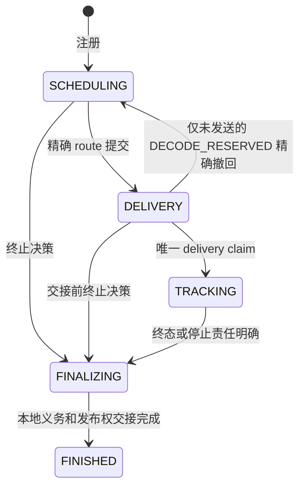
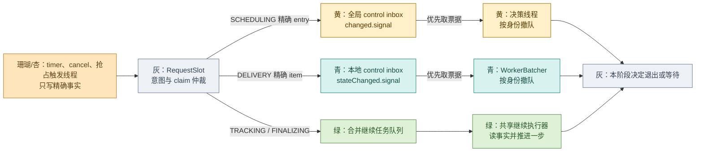

# FlexLB 调度重构最终方案

> **历史目标方案，尚未整体落地，部分内容已被后续设计替代。** 2026 年 10 月 2 日起，本轮请求职责与执行设施重构按[开发交接](request-ownership-handoff.md)实施，保留当前 BalanceContext 和七阶段；本文的 RequestSlot 等旧类名及五阶段方案不作为本轮任务。历史类级交接见[类时序附录](sequence-flows.md)，更早的图见[旧线程链路附录](thread-model-detailed-flows.md)。已有局部改动不代表本文方案已经验收。

## 1. 核心规则

请求只有一个可写内部阶段，由原 `RequestSlot` 在请求锁内推进。阶段表示当前由谁处理下一步，不是线程、队列等待原因、取消原因或 Engine 运行状态。timer、业务 cancel 和抢占只写精确控制事实并通知当前 owner；阶段执行者在工作前核对事实，不能继续时退出。等待请求不占专属线程。

保留现有 `RequestScheduler`、`GlobalQueueCoordinator`、`WorkerBatcher`、`RequestSlot`、Prefill/Decode endpoint、`RouteAdmission`、`BatchTransaction` 和 `ExpirationTimer`。不为每阶段建立 service/线程、第二份可写阶段、通用 `WorkerRuntime`、`DeliveryBatch` 或新 `DeadlineIndex`。对外保持 schema 3、`RequestState.Phase` 八值及其合法边、错误码、批次身份、转发、Cancel 归属和已有观测语义。

## 2. 请求阶段与状态转移

```java
enum RequestStage { SCHEDULING, DELIVERY, TRACKING, FINALIZING, FINISHED }
```



| 阶段 | 只做什么 | 退出边界 |
| --- | --- | --- |
| `SCHEDULING` | 全局等待、选路、准入；DIRECT 在入口调用栈执行 | route、pin/reservation 与本地可领取性精确交接，或撤当前候选并选终态 |
| `DELIVERY` | Prefill 本地等待/成组，取得唯一外部可见交接 | 停止意图、当前绝对期限、placement 和 endpoint 责任在同一 `delivery claim` 仲裁 |
| `TRACKING` | 合并本次投递结果与精确 Engine/worker 事实；可先选一次成功响应 | 不再选路或重发；结束时冻结终态和清理动作 |
| `FINALIZING` | 执行已选 `TerminalAction`，结清本地义务和必要的响应发布权 | 决策不可中断或改判；迟到事实只补账本或推动原清理 |
| `FINISHED` | 保留兼容查询快照并等待安全回收 | 无出边；不要求 Future 回调已执行，也不宣称未知远端工作已停止 |

同阶段等待、容量重算、ACK、Engine 运行和批次进度都不产生阶段转移。`TRACKING→DELIVERY/SCHEDULING`、`FINALIZING/FINISHED→活动阶段` 均非法。唯一回边 `DELIVERY→SCHEDULING` 必须证明没有外部 delivery claim，精确撤旧 Decode reservation，恢复原队列序号和绝对期限，并递增调度尝试身份。`UNKNOWN`、RPC 超时或 ACK 丢失不证明 `NOT_SENT`，不能触发回边或二次发送。

活动阶段结束时，`RequestSlot` 在一次仲裁中冻结结果、认领唯一 `TerminalAction`、决定尚未选出的发布权并进入 `FINALIZING`。清理 runner 锁外执行动作；本地义务和发布权交接完成才进 `FINISHED`。已经选定的成功响应即使还在 Publisher 队列，也不能被终态响应覆盖；`Future.isDone()` 不能充当发布仲裁。

## 3. 枚举的类型、所有者和非法边

分类、事件、单次结果和只读投影没有同一对象内的状态转移。真正跨调用可写的枚举必须有唯一实例 owner、初态、精确身份、合法边和终态；未列出的边一律拒绝或按 stale 忽略，不能靠 ordinal 判断顺序。

| 类型 | 类型和唯一 owner | 合法变化与禁令 |
| --- | --- | --- |
| `RequestStage` | 请求状态；精确 `RequestSlot` | 只走第 2 节各边；不与旧 `Phase/SlotPhase` 长期双写 |
| `RequestState.Phase` | 对外兼容投影；迁移后不再独立写 | 八值和旧 `canTransitionTo` 闭集保持不变，见下表 |
| `CancelReason` | `RequestSlot` 的首次有效停止原因 | 未设置→`CLIENT_CANCELLED`/`DEADLINE_EXCEEDED`，后到原因不能覆盖 |
| `DeliveryOutcome` / 当前 `DeliveryResult.Status` | 本次 transport/Batch 的不可变结果 | `DELIVERED`、`NOT_SENT`、`PREFILL_REJECTED`、`UNKNOWN` 不互转；合并旧值前核对错误码和监控，UNKNOWN 不等于未发送 |
| `RouteAdmission.Ownership`、成员/endpoint lease | 各精确能力自身 | 临时持有→交接或关闭；交接后旧 holder 不再 rollback，关闭后不复活 |
| `BatchTransaction.Phase` | 一次真实 BATCH | 准备→提交→发送责任移交/终止；批次不拥有成员请求阶段或 Engine 终态，不从在途退回准备 |
| `DefaultBatchDispatcher.PermitPhase` | 一个 permit reservation | `PREPARED→SUBMITTED→RELEASED` 或 `PREPARED→RELEASED`；仅释放一次 |
| `PreemptionCancelPhase` | 一个精确 victim 抢占 claim | claim→Cancel 在途→回复/未知；普通 ACK、NOT_FOUND、超时不是释放证据；endpoint 不双写协议状态 |
| `ExpirationTimer.DeadlineState` | 一个精确期限注册 | 安装、触发、取消的原子握手；已消费/取消不能重新 armed |
| endpoint generation、registry、batcher、publisher 生命周期 | 各实例 | open/running→closing/stopping→closed/stopped；不复活 |

`RequestSlot.DecisionStage` 目前保存决策可见性证据，`CleanupProgress.Phase` 防止清理 runner 重入；删除前必须证明事实来源与不丢唤醒。`SlotPhase` 的终止防重入能力应由 `FINALIZING` 和唯一清理 runner 接替。Prefill/Decode 队列 membership、reservation、Engine owner、release 证据仍归精确 endpoint generation。配置模式、排序/成组策略、`VictimStage`、worker wire `TaskPhase`、拒绝原因等是分类或事件，不进入请求阶段。不能为了减少 enum 数量把独立事实改成重复 boolean。

对外八值的当前合法边必须保持：

| 当前值 | 可到达值 |
| --- | --- |
| `QUEUED` | `DISPATCHING`、`CANCEL_REQUESTED`、`TIMED_OUT`、`FAILED` |
| `DISPATCHING` | `ACKNOWLEDGED`、`CANCEL_REQUESTED`、`TIMED_OUT`、`FAILED`、`COMPLETED` |
| `ACKNOWLEDGED` | `CANCEL_REQUESTED`、`TIMED_OUT`、`FAILED`、`COMPLETED` |
| `CANCEL_REQUESTED` | `CANCELLED`、`TIMED_OUT`、`FAILED`、`COMPLETED` |
| `CANCELLED`、`TIMED_OUT`、`FAILED`、`COMPLETED` | 无出边 |

目标查询从 `RequestStage`、活跃 delivery claim、精确 ACK、首次取消意图、已选终态和冻结的历史快照投影旧值：交接前为 `QUEUED`；TRACKING 在 ACK 前/后分别为 `DISPATCHING`/`ACKNOWLEDGED`；接受取消后按旧语义显示 `CANCEL_REQUESTED`；终态可先于 ACK 从 `DISPATCHING` 直达 `COMPLETED`。必须先以旧查询和竞态测试证明全部值可无损重建；缺少事实时补到真正 owner，不能新添第二套生命周期字段。

## 4. 实体所有权

| 对象 | 独占事实或动作 | 不负责 |
| --- | --- | --- |
| `RequestSlot` | 唯一阶段、当前精确队列句柄引用、admission/delivery claim、首次控制意图、一次发布仲裁、已选终态和 `TerminalAction` | 队列排序、Prefill/Decode 容量、Engine 原始任务状态 |
| `GlobalQueueCoordinator` | 全局顺序、容量等待、原始序号/绝对期限、全局 control inbox、按精确 entry 撤队 | 不在 planner 线程提交 route，不判断远端终态 |
| `WorkerBatcher` / Prefill generation | 本地队列/成组、control inbox、按精确 ScheduledRequest 撤队、route/batch lease | 不写请求终态，旧 generation 不动新队列 |
| `DecodeEndpoint` generation | 精确 reservation、Engine/KV owner、释放证据 | 不凭请求取消标记释放资源 |
| `RouteAdmission` / `AdmissionHandle` | 本次尚未交接的 pin/reservation | 交接后不替下游 rollback |
| `BatchTransaction` / dispatcher permit | 真实 BATCH 的成员与一次发送责任 / 一次 permit | 不镜像成员阶段，RPC 完成不是 Engine 终态 |
| 精确 preemption claim | victim 的唯一 Cancel 协议与 incoming 关联 | 不复制 endpoint 资源账本 |
| `ExpirationTimer` | 期限注册和到期身份 | 不撤队、清理、做 Cancel RPC 或完成请求 Future |
| `RequestRegistry` / 共享继续执行器 | 当前请求目录；仅 TRACKING/FINALIZING 无队列 owner 时的合并继续任务及池生命周期 | 不跨全局/本地队列索引撤队，不保存第二份阶段 |
| `RequestTerminalCleanup` / `RequestCompletionPublisher` | 前者执行已选清理；后者锁外完成已选 Future | 不重新选择终态 |

异步事件须匹配 RequestSlot/原始 Future、endpoint generation，以及适用的 admission handle、ScheduledRequest、Decode reservation、delivery claim、batchId 或 preemption claim。只凭裸 requestId、worker address 或后来的同名请求不能结算旧能力。资源账本先提交精确事实，再通知请求 owner。`RequestSlot.claimDelivery` 可能形成 RequestSlot→CommittedAdmissionOwner→DecodeEndpoint 锁链，迁移前要核对反向调用图，保持原子交接并避免死锁。

## 5. 三条主路径

| 模式 | SCHEDULING | DELIVERY | TRACKING |
| --- | --- | --- | --- |
| DIRECT + NON_BATCH | 入口调用栈直接选路/准入 | 同栈 claim、发布 route | 精确外部事实与一次响应 |
| QUEUE + NON_BATCH | 全局决策线程维护顺序，planner 仅算候选 | WorkerBatcher 排队/成组，逐请求发布 route | 各请求独立跟踪 |
| QUEUE + BATCH | 同上 | WorkerBatcher 成组，`BatchTransaction` 一次 EnqueueBatch，成员逐个 claim | 成员独立跟踪 |

FIFO/PRIORITY 只改变排序与抢占许可；SINGLE/FIXED_WINDOW 只改变本地成组条件。九个合法配置组合归入上面三条；DIRECT+BATCH 仍拒绝。NON_BATCH 的规划组不是 BatchTransaction；PDFUSION 不造虚假的 Decode 阶段。逐类交接见[类时序附录](sequence-flows.md)。

## 6. 线程、Future 与唤醒

```mermaid
flowchart LR
    I["蓝：gRPC 入口<br/>注册 RequestSlot + 原始 Future"] --> M{模式}
    M -->|DIRECT，同栈| D["蓝：入口<br/>选路 + delivery claim"]
    M -->|QUEUE，offer| Q["黄：全局决策线程<br/>顺序 + route commit"]
    Q -->|候选计算| P["橙：planner 池"]
    P -->|plan 结果| Q
    Q -->|本地入队 + signal| W["青：WorkerBatcher 虚拟线程<br/>成组 + delivery claim"]
    W -->|BATCH，提交任务| B["紫：dispatch 池<br/>创建 EnqueueBatch RPC Future"]
    B -->|RPC 回调| C["粉：completion 池<br/>记录成员结果"]
    D --> T["灰：TRACKING<br/>等待时不占线程"]
    W --> T
    C --> T
    T -->|精确事实任务| X["绿：共享继续执行器<br/>TRACKING / FINALIZING"]
    T -->|取得发布权| Pub["靛：Publisher<br/>完成原始 Future"]
    X -->|必要的终态发布| Pub
    Pub --> G["非 async gRPC 回写<br/>通常在 Publisher 线程"]
    classDef ingress fill:#DCEBFF,stroke:#3166AA,color:#17365D
    classDef queue fill:#FFF0C9,stroke:#A86800,color:#563700
    classDef planner fill:#FFE2CA,stroke:#B56B32,color:#633A20
    classDef batcher fill:#D8F3EF,stroke:#168477,color:#174C45
    classDef dispatch fill:#EEE1F7,stroke:#8256A5,color:#452F68
    classDef completion fill:#FCE3EA,stroke:#A24A68,color:#6A2940
    classDef continuation fill:#DFF2D8,stroke:#4A8640,color:#285622
    classDef publisher fill:#DDE3FF,stroke:#4F5DB8,color:#303B75
    classDef passive fill:#EDF0F4,stroke:#64748B,color:#334155
    class I,D ingress
    class Q queue
    class P planner
    class W batcher
    class B dispatch
    class C completion
    class X continuation
    class Pub publisher
    class M,T,G passive
```



排队请求的停止不能等待正常 FIFO/PRIORITY 排序：



| 等待者 | 等什么、谁改变条件 | 醒来先做什么 |
| --- | --- | --- |
| 全局决策线程 `changed` | `offer`、plan 结果、容量 listener 或 control inbox 票据，在队列锁下 signal | `awaitIfNoWork` 睡前查 inbox；先精确撤队，后扫正常队列/容量等待集 |
| WorkerBatcher `stateChanged` | 本地入队、调度输入/容量 listener、control inbox；窗口/期限由 `awaitNanos` 到时醒来 | 三处 await 睡前查 inbox；先精确撤队，再成组 |
| 共享继续执行器任务队列 | RPC/worker 事实与 timer/cancel 的合并精确任务 | 重读阶段、身份与意图，推进到下一等待点；不进排队索引 |
| dispatch/completion/Publisher 队列 | WorkerBatcher 提交发送、RPC Future `handleAsync` 提交结果、请求提交发布许可 | 发 RPC、记结果、锁外完成 Future；Publisher 承担非 async 回调 |
| timer 最近期限 | 精确期限到达 | 校验身份，短回调写事实并通知当前 owner |

`BatchDispatcher` permit 只 `tryAcquire()`：失败后 WorkerBatcher 等自己的 Condition，release listener signal 它重检；没有物理线程阻塞在 `Semaphore.acquire()`。控制票据只带精确身份，不复制阶段/原因/结果；入 inbox 和睡前检查用同一队列锁。阶段交接时新 owner 检查未消费意图，必要时给自己补票；旧票据因身份不匹配失效。planner 只持临时 `AdmissionHandle`，停止先赢时决策线程撤索引，晚到 plan 由它关闭临时能力；能力结清前不能宣称 `FINISHED`。route commit 先赢则由新阶段处理停止。

| 线程或组 | 谁创建、何时启动 | 工作时 / 空闲时的等待 | 何时结束 |
| --- | --- | --- | --- |
| gRPC 业务线程 `flexlb-grpc-executor` | `FlexlbGrpcServer.start()` 建有界池，按任务懒启动 | 入口、业务 cancel、DIRECT 准入；空闲等池任务 | gRPC drain 后 server shutdown |
| 全局决策线程 `flexlb-global-decision` | QUEUE 的 `GlobalQueueCoordinator` 构造后启动一条；DIRECT 无 | 处理顺序、plan 结果、控制票据；空闲等 `changed` | 停新提交、控制票据和在途 plan 结算后 |
| planner 池 `flexlb-global-planner-*` | 同一 coordinator 建固定池，首次 plan 时启动 | 只算候选；空闲等 plan 任务 | 已提交 plan 结算后 |
| Prefill `WorkerBatcher` 虚拟线程 | 每个 QUEUE endpoint generation 构造一条，发布前启动；DIRECT 无 | 本地排队、成组、控制票据；空闲等 `stateChanged` 或窗口/期限 | 该 generation 退休且本地请求结算后 |
| BATCH dispatch 发送池 | `DefaultBatchDispatcher` 构造时建固定池，按任务启动 | 发 EnqueueBatch；空闲等发送任务，不等 RPC/Engine 终态 | 已接收发送和 permit 结算后 |
| BATCH completion 池 | 同一 Dispatcher 建固定池，按 RPC 完成任务启动 | 记录成员投递结果；空闲等完成任务 | pending completion 归零后 |
| `request-scheduler-expiration` | `RequestRegistry` 建单线程 ScheduledExecutor，首次期限任务时启动 | 短回调写事实/票据；空闲等最近期限 | 精确期限注册取消或结算后 |
| 目标新增共享继续执行器 | `RequestRegistry` 建服务级池，首次 TRACKING/FINALIZING 任务时启动 | 处理合并的请求步骤；空闲等工作队列，非每请求线程 | 上游不再产任务且继续任务排空后 |
| `request-completion-publisher-*` | `RequestRegistry` 构造时预启动配置数量 | 完成已选 Future；空闲等发布任务，可能运行非 async 回调 | 所有已选发布完成后最后关闭 |
| Engine gRPC / worker 同步 / endpoint 退休 / 转发线程 | 分别由 channel、synchronizer、endpoint 或 forwarder 创建 | 只更新或报告所属事实；空闲等网络、轮询或各自任务 | 随各自 channel、synchronizer、endpoint/JVM 或 forwarder 结束 |

以上“工作/空闲/结束”是执行器的逻辑状态，不是新增请求枚举或必须同名的 Java `Thread.State`。DIRECT 没有全局/本地队列线程，入口进行时的停止意图由 claim 前检查，进入 TRACKING 后由继续执行器处理。

原始 `RequestFuture<Response>` 在本地注册时只创建一次，QUEUE 传同一引用。EnqueueBatch RPC Future 发送时创建，回调交 completion 池，和 Engine 终态不同。Engine Cancel RPC Future 只属于 Engine-owned 抢占协议，ACK 不释放资源。timer 的 `ScheduledFuture` 只代表期限任务。从节点转发的 Future 不创建本地调度 RequestSlot。

**`Future.cancel()` 是同步 Java API 特例。** 调用者线程先在 `RequestSlot` 同一仲裁中检查旧门槛：delivery claim 已赢或结果已选则拒绝；成功则冻结取消结果与发布权，再在锁外同步使原始 Future 呈 cancelled。实际撤队/结算仍由阶段 owner 完成。旧 `future.whenComplete` 若在 cancel 调用者线程运行，最多投精确票据，不能暗中撤队。普通完成由 Publisher 锁外执行；非 async 回调通常在 Publisher 线程，若 Future 在回调注册前已完成则可能在注册线程执行。

关停先停新准入，给未完请求写意图并投精确票据；排空队列 owner、在途 plan、dispatch/completion 和 endpoint 退休事实；timer 停止生产；继续执行器排空 `FINALIZING`；最后排空并关闭 Publisher。现有运行时代码不能假定已满足此顺序。

## 7. 超时、取消和抢占

| 事件 | 触发线程只提交 | 当前阶段接着做 |
| --- | --- | --- |
| 业务 cancel | 按 requestId/expectedBatchId 冻结首次有效原因，可立即查询旧取消请求视图 | 交接前停发；交接后按远端可能可见处理，结果优先级与错误码保持旧语义 |
| 请求期限 timer | 校验期限身份，记录到期并唤醒 | 准入/claim 仍直接核对绝对时间，timer 延迟不能让过期请求越过边界 |
| 决策可见性 timer | 记录需要诊断/确认 | TRACKING 核对事实，不直接终止、Cancel 或释放 |
| inactivity timer | 核对最后活动时间后的精确到期 | 按既有本地跟踪规则收尾，不宣称远端已停止 |
| 抢占发起方 | 唯一认领精确 victim claim，写意图并唤醒 victim | victim 自己撤队、撤未发送 reservation 或推进原 Cancel 协议；incoming 等资源证据后重检准入 |

PREFILL_QUEUED victim 由 DELIVERY 精确撤队并等 Prefill 容量释放证据；DECODE_RESERVED 仅在未外部可见时撤旧 reservation，回 SCHEDULING；DECODE_ENGINE_OWNED 由 TRACKING 沿原 Prefill Cancel 通道推进。普通 ACK、NOT_FOUND、RPC 超时均不证明 Decode 容量可用，incoming 要等 fencing 或匹配终态等既有证据。两个 incoming 不能同时认领同一 victim，旧代际回复不影响新 reservation。

控制入口不调用 `removeQueued`、release、Engine Cancel RPC 或 `Future.complete`。SCHEDULING/DELIVERY 队尾或容量等待项必须由原队列 owner 优先处理精确 control ticket；只 signal 没有票据仍会迟迟无法收敛。FINALIZING 的迟到事件不重选结果，但可补精确账本或唤醒未完成的原清理。

## 8. 测试优先的四步落地

每步先用真实入口写能区分旧行为和目标行为的测试，观察客户端结果、队列/endpoint 账本、执行线程与精确身份；再只改一个 owner 的边界，并删除被替代的旧写入口。每步是可独立合并的稳定状态，不能靠长期双写或后续补丁使当前步勉强可用。用 latch、受控时钟、fake RPC 制造竞态，不用随机 sleep 充当证明。

| 步骤 | 先写的行为测试 | 本步收敛条件 |
| --- | --- | --- |
| **1. 请求阶段与结果仲裁** | 八值投影；cancel 与 claim 竞争；终态先于 ACK、晚到 ACK/UNKNOWN；只响应一次；`Future.cancel()` 门槛和同步可见性 | 原 `RequestSlot` 建唯一阶段、终态/TerminalAction/发布权仲裁；证明查询后关闭旧可写 `Phase/SlotPhase` 入口。保留现有队列副作用位置直到 2/3 步，但不双写请求生命周期。相关 sync/API 套件和资源守恒通过 |
| **2. 全局 SCHEDULING owner** | FIFO/PRIORITY 队尾、容量等待、planner 槽满的取消/到期；signal 早于 await；停止与在途 plan/route commit；旧 requestId/plan | `GlobalQueueCoordinator` 同锁维护 control inbox，决策线程精确撤队，晚到 plan 关闭能力；删除 `future.whenComplete` 在 cancel 调用者线程直接撤队。FINALIZING 等能力结清，相关套件通过 |
| **3. 本地 DELIVERY owner** | 本地队尾、容量/permit 阻塞、batch 窗口中的取消/到期；三处 await 丢信号；claim 竞争；旧 generation；三类 victim 释放证据 | `WorkerBatcher` 同锁维护 control inbox 并优先撤精确项；permit 仅 tryAcquire、release listener 唤醒；迁移旧本地直接清理路径。NON_BATCH/BATCH 一次发送、成员结果、抢占和资源守恒通过 |
| **4. 无队列 owner 的继续与关停** | TRACKING 成功响应先于 Engine 终态、UNKNOWN 不重发、迟到事实；非 async 回调隔离；共享池拒绝/关停、endpoint 退休、全链路 drain | 仅 TRACKING/FINALIZING 使用服务级合并继续任务；Publisher 独立完成 Future；删除旧回调直接清理路径；按第 6 节排空关停。全量 sync/API 功能、九个合法配置及性能对照通过 |

功能测试入口在 `rtp_llm/flexlb`：`./mvnw test -P '!internal,sync-performance-regression' -pl flexlb-sync -am`；API 为 `./mvnw test -P '!internal,api-performance-regression' -pl flexlb-api -am`。性能 profile 与功能测试分开运行；默认测试通过不等于性能已验收。每步记录测试计数、旧失败与新回退，不改门槛掩盖问题。最终同环境对照 DIRECT/QUEUE、BATCH/NON_BATCH、FIFO/PRIORITY、低/高队列深度、多 worker、频繁取消/续期/退休，记录吞吐、server p50/p95/p99、分配、GC、锁等待和队列峰值，并核对到达/完成数及资源守恒。

## 9. 实施前仍需逐项证明

1. 八值能否从阶段、ACK、取消、已选结果和历史快照**完整投影**；不能先删旧字段再用展示补丁猜测。
2. `RequestSlot.claimDelivery` 的嵌套锁与 endpoint 反向调用是否有死锁；停止意图和外部 claim 必须保持同一线性化边界。
3. 控制票据与阶段交接是否丢唤醒；全局/本地等待点、plan 晚到、permit release 先于 await 都要覆盖。
4. `Future.cancel()` 的同步语义、已选响应尚未完成的窗口、非 async 回调线程，以及 executor 拒绝/关停后任务不丢。
5. 抢占意图、Cancel ACK/NOT_FOUND、UNKNOWN 与精确资源释放之间的证据强弱；不能用请求状态替代 endpoint 账本。

旧 15 图里的“共享继续执行器跨队列撤队”“先同步取消 Future 再仲裁 RequestSlot”已经否决。旧图保留供逐边审查，本主文的 owner 和原子边界优先。
