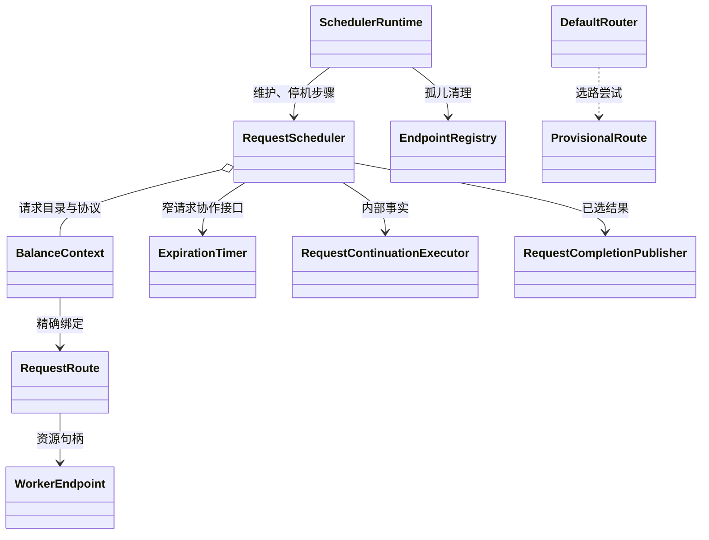
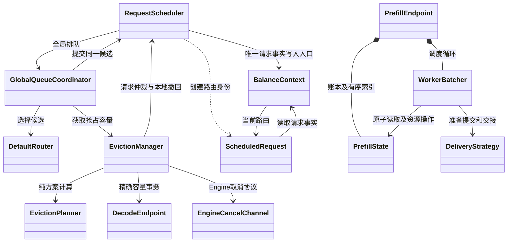

# 从所有权看调度类结构

2026-09-25 起的结构候选和历史实施记录。2026-10-02 请求职责实现以 [请求职责交接](request-ownership-handoff.md) 为准；下文旧类名和候选方向仅作历史记录。
完整现状图见 [current-class-diagram.md](../current-class-diagram.md)。

## 2026-10-02 请求职责现状

Context 私有持有 admission、cleanup 和 preemption 参与状态，Scheduler 不再维护三张单请求 Map。请求状态类型和 Future 归 Context，句柄通过完成回调回到编排方。路由算法、资源账本、批次事务和七阶段转换保持原契约；publication、用户回调及 endpoint 清理仍在请求锁外执行。

### 本轮验证（2026-10-02）

起点保存了 HEAD `2b2338ce9a86fbbee6b77203b1d57950dbea3346` 及当时未提交修改，基线对照使用该完整工作区快照。

- 完整 Maven 功能测试：2099 项，2098 通过、1 跳过，0 失败/错误。覆盖交接文档列出的身份、取消、响应竞争、资源结算、期限与关闭契约。
- Sync 性能 profile：3 项通过。
- API 性能 profile：16 项中 14 通过、2 失败。修改前快照在相同两个场景也失败：真实 gRPC 批次场景 P99 为 697 ms（修改后 954 ms，门槛 50 ms）；1 Prefill / 2 Decode、目标 10000 QPS 场景，基线吞吐 8376.2 QPS 未达 85% 门槛，修改后 P99 为 67 ms 未达 50 ms 门槛。单次对照不足以证明性能等价，API 性能验收仍未通过，未修改阈值。
- 修改的 Java 文件通过 Spotless；全仓检查仍受原有 `ArithmeticFormulaTest.java` import 顺序和 `ServerStatus.java` 空行问题阻断。这两个文件与实施起点一致。
- `git diff --check` 通过。

## 1. 当前最值得关注的关系

```mermaid
classDiagram
    RequestScheduler --> BalanceContext : 写请求事实与阶段
    RequestScheduler --> GlobalQueueCoordinator : 入队与撤回
    GlobalQueueCoordinator --> RequestScheduler : 认领及提交
    GlobalQueueCoordinator --> EvictionManager : 获取抢占资源
    EvictionManager --> DecodePreemptionCoordinator : Engine取消
    EvictionManager --> RequestScheduler : 撤回本地victim
    DecodePreemptionCoordinator --> RequestScheduler : 登记及结算victim
    BalanceContext --> ScheduledRequest : 当前路由身份
    ScheduledRequest --> BalanceContext : 读取请求事实
    PrefillEndpoint *-- WorkerBatcher
    PrefillEndpoint *-- PrefillState
    WorkerBatcher --> PrefillEndpoint : 预测器与容量通知
    WorkerBatcher --> PrefillState : 共享锁及账本操作
    WorkerBatcher --> PrefillActiveIndex : 直接读取账本索引
    PrefillState *-- PrefillActiveIndex
    WorkerBatcher --> DeliveryStrategy : 准备提交和交接
    DeliveryStrategy ..> RequestScheduler : 实现类认领及结算发送
```

图中的环需要逐个解释，不能仅凭双向箭头判断应删除。

## 2. 不自然的地方与改进

| 当前关系 | 源码证据 | 改进与约束 |
| --- | --- | --- |
| 请求调度事实初始化已归执行者 | `RequestScheduler.createScheduledRequest` 初始化 `firstWorkerEnqueueTime / workerEnqueueSequence`；数据构造器只读取 | 已消除构造副作用及两个公开 setter。仍在首次 Worker 路由创建时初始化，重排保留原 FIFO。 |
| Context 的输入约束不完整 | `setFuture` 注册后禁止替换，但 request、schedulingMetadata 仍有公开 setter；请求优先级有 metadata/request 两种来源，路由又冻结部分值 | 先核对所有生产写入者，明确注册前装配、注册后稳定的字段。利用已有 SchedulingMetadata，逐项消除回退；无需再造 RequestInput 包装层。 |
| Worker 依赖账本的存储细节 | 构造器直接取 State 的 lock、activeIndex、capacityAvailableSignal；循环同时读取队列版本和账本版本 | 保留同一把锁。优先收敛一次循环的队首、选择、等待条件读取，减少对 activeIndex 的直接依赖；避免给每个 getter 加转发。当前索引调用主要是读取，不应误称两套独立写入源。 |
| 请求结束协议跨多个操作重复处理 | `processRequestEndLocked` 依次检查 cleanupOperations、routingOperations、preemptions；AdmissionHandle 和 PreemptionRegistration 各自暂存终态证据 | 先列完整事件优先级表，将“接收事实、等待当前操作交权、决定结束、执行清理”收敛到现有 Scheduler 的共同路径。保留独立操作句柄；不可直接把三张表合并成互斥 operation 字段。 |
| 抢占的一次业务流程跨两个执行类 | EvictionManager 处理本地撤回并调用 DecodePreemptionCoordinator；两者都依赖 Scheduler，Manager 还持有 CancelChannel 供规划使用 | 候选：将 Decode 抢占执行集中到现有 EvictionManager，Coordinator 的异步 attempt 成为内部实现，Planner 继续纯规划。只有能同时删除生命周期、结果适配和转发时才实施；纯粹拼接两份文件没有收益。 |

### 请求结束协议复核结论

`RequestScheduler.java` 的结束协议复杂度集中在事件发生时，先判断谁正在拥有修改权，再决定是否延迟处理。只提取一个 TerminalService 会增加跨类调用，原有分支仍在。

以下处理表用于约束后续修改：

| 事件到达时的情况 | 必须保留的行为 |
| --- | --- |
| 正在发布/撤回路由 | 保留精确路由身份和终态证据，操作交权后处理 |
| 正在抢占 | 保留取消协议证据；ACK、NOT_FOUND、UNKNOWN 都不能单独证明资源释放 |
| 已开始清理 | 更新相应资源的完成事实，并检查全部清理义务 |
| 无操作阻挡 | 仲裁首次取消原因、Worker 结果和前端响应，再开始清理 |
| 旧路由或旧 generation 回调 | 不得推进当前请求；旧资源仍按原所有者结算 |

`observedTerminal` 与 Prefill 退休证据可能同时存在，合并时不能只保留“最后一个事件”。

进一步逐调用点审查发现，共同结束路径已集中在 processRequestEndLocked → decideRequestEndLocked → claimFinalizationLocked。Admission 回放与抢占回放有不同证据优先级和 Decode 账本操作，当前没有足够证据证明可以继续整段合并。因此撤回将它作为首要大改对象的建议，保留为约束审查对象。

## 3. 建议的职责图

以下是目标职责，不表示新增同名类，也省略返回值与完成回调。

职责归属：

- Context：请求输入、七阶段、观测、已选响应、当前路由身份；不执行调度。
- Scheduler：请求事件仲裁、路由创建与安装、响应发布、最终清理。
- GlobalQueueCoordinator：全局优先级/FIFO、公平推进、容量等待与重试。
- WorkerBatcher：成组、等待与唤醒、锁内提交编排、锁外交接。
- PrefillState / DecodeState：精确资源身份、容量和 Engine 观测；不调用投递事务。
- DeliveryStrategy.Transaction：一次发送准备到交接的资源所有权；finally/close 释放未转交部分。
- EvictionManager：一次抢占从规划到资源交回的执行；内部 attempt 保存异步协议状态。

## 4. 应保留的边界

1. Context 与 ScheduledRequest 生命周期不同：同一请求可换路由，旧路由回调必须可识别。
2. 请求阶段、发送结果、资源清理进度不能折成一个枚举。
3. 全局队列和 Worker 队列服务不同调度时点；优先级队列和容量等待索引也不互相替代。
4. State 不调用 DeliveryStrategy.Transaction，避免账本反过来编排投递。
5. 投递准备、锁内提交、锁外交接是实际并发边界。以统一 finally 清理失败路径，不能假设全部资源在同一时点转移。
6. 投影缓存、容量计数和有序索引有性能职责，必须通过性能证据决定删留。

## 5. 实施顺序与验收

1. 已清除 ScheduledRequest 构造副作用并收窄 FIFO 写入口；继续核对其余输入冻结，保留重排 FIFO、优先级及旧回调隔离约束。
2. 结束事件处理维持现有公共路径，只有找到相同前提和副作用的重复流程才合并；继续验证路由提交/取消/退休/抢占/清理交错。
3. 收敛抢占执行边界：评估删除 DecodePreemptionCoordinator 顶层编排层；保留独立 attempt，验证部分 victim 认领失败及同步完成回调。
4. 收敛 Worker 对账本内部的直接访问：按整个选择/等待操作收敛；验证无丢失唤醒、无重复发送和锁顺序。

每轮按实际删除的状态、分支、转发报告收益，不预估“合并类就能减少多少行”。较大变更本地回归后同步远端容器跑性能，并安排三个独立 review。当前性能门槛尚未全部通过，类图调整本身不构成性能证明。

## 6. 已实施：抢占身份只引用唯一 Context

删除 PreemptionRegistration 镜像 requestId，直接读取 owner 的注册 ID。删除 exactPreemptionLocked 及三个入口的临时别名；入口仍在 owner 锁内检查资源跟踪权及 preemptions.get(owner) == claim。

生产构造只发生于已注册请求；原始 RequestFuture 标识注册，RequestRequirements 只冻结一次请求 ID，不需要再存一份 ID 并比较两份 ID。不同 Scheduler、同 ID 新 Context、已撤销的旧 claim 均仍由精确对象校验隔离。

- 生产物理行数 26,873 → 26,862，净减 11 行，距目标 1,862 行。
- 本地针对抢占、终态结算、请求生命周期和资源清理的测试 144/144 通过。日志：`/tmp/flexlb-preemption-identity-tests.log`。
- 新增用例验证修改原始 Request ID 不影响已注册抢占身份；既有用例覆盖同 ID 新请求和跨 Scheduler 的旧句柄。
- 三个独立 review：并发身份、设计、测试覆盖，均无阻断。
- 本轮未跑远端性能；没有改变抢占协议、锁边界或执行器。既有远端性能门槛尚未全部通过。

## 7. 已实施：抢占命令复用冻结输入

PreemptionCommand 直接引用原 DecodeBinding，删除重复的 incomingRequestId、incomingKvTokens、incomingExpectedKvTokens、incomingPriority、capacity 五字段。容量非空约束由 DecodeBinding 构造器负责；命令保留请求 ID 和 victim 校验。

调用者此前也是从同一个 binding 提取这五个值，现避免再次展开、传递和保存。命令所读数值与 AdmissionCapacity 均不可变；绑定 endpoint 时创建新 binding，不修改原对象。取消和资源协议没有改变。

- 生产物理行数 26,862 → 26,856，净减 6 行，距目标 1,856 行。
- 本地 80/80 专项测试通过，日志 `/tmp/flexlb-preemption-input-tests.log`；包含 Manager 输入冻结、Coordinator ACK/终态、规划、容量抢占及全局调度路径。
- Manager 测试在修改原始 request/config 后验证命令仍持有原 binding；Coordinator 继续验证实际资源交回。
- 三个独立 review（设计、并发、测试）均无阻断。
- 本轮未运行远端性能，不据此声称性能达标。

## 8. 已实施：轮询异步收尾只保留一份

GrpcWorkerStatusRunner 与 GrpcCacheStatusCheckRunner 共用包内无状态 PollCompletion.attach：回调异常隔离、CompletionException 解包、完成及执行器拒绝时的 exact lease 释放。同步准备仍由 runner 的 finally 负责，未新增资源状态或执行器。业务回调、时间采集位置和日志种类保持不变。

先尝试过带 transferred 字段的 AutoCloseable 包装器，因新增运行时对象且收益有限，已删除该方案，最终保留静态公共收尾函数。

- 生产物理行数 26,856 → 26,848，净减 8 行；主要收益是两套异步释放协议合为一套。
- 测试补充 callback 内部抛错及其调用断言、cache 准备抛错和跳过轮询时的 lease 归还。
- 最终本地 29/29 通过，日志 `/tmp/flexlb-poll-completion-verified-tests.log`；三个独立 review 无阻断，测试 review 的调用断言建议已落实并复核。
- 小范围轮询收尾重构，本轮只运行本地测试；远端性能未重新验证。

## 9. 已实施：合并同形延迟指标接口

BatchSchedulerReporter 的 reportDispatchAckTimeMs、reportRouteSubmitTimeMs、reportAckToResponseTimeMs 三个同形包装统一为 reportLatency(Latency, role, engineIp, durationMs)。枚举固定映射原有三个指标名称，不允许调用者任意拼写指标名。

GlobalQueueCoordinator、RequestCompletionPublisher、FlexlbServiceImpl 保留原来的取时表达式、调用顺序和异常边界，仅改为传入对应枚举值。指标注册和预热不变。

- sync 生产物理行数 26,848 → 26,820，净减 28 行；删除三个包装及其重复说明，增加一个统一接口和类型映射。
- 本地 sync 76 项、API 50 项，共 126/126 通过。日志 `/tmp/flexlb-latency-reporter-tests.log`。
- 新增三条公开指标名、标签和值的合同测试；路由提交及 ACK 上报异常注入继续覆盖观测失败隔离。
- 三个独立 review（设计、并发、测试）均无阻断；上述 126 项为两个模块实际测试总和。
- 本轮未跑远端性能，不构成整体性能达标证明。

## 10. 已实施：PrefillActiveIndex 删除实现类层次

sealed interface 与 Disabled/Ordered 两个实现合为一个 final 类，工厂接口保持 disabled()/ordered()。DIRECT singleton 不分配队列、身份表或优先级计数；QUEUE 保留 TreeSet 与 IdentityHashMap。

排序比较器、同键 sequence tie-break、精确对象删除、成员版本及两层投影缓存均保留。禁用模式在入口返回原来的空结果，add 包括 null 入参仍抛 IllegalStateException。共享禁用实例不执行任何队列状态写入。

- 生产物理行数 26,820 → 26,740，净减 80 行；距目标 1,740 行。
- 本地 151/151 通过，日志 `/tmp/flexlb-single-active-index-tests.log`。新增 DIRECT 空操作合同；原有随机增删、同键不同身份、并发物化、Worker/endpoint/DIRECT/死锁回归保留。
- 三个独立 review 均无阻断。仓内没有 Disabled/Ordered 具体类型调用；接口改类要求依赖模块重新编译，仓外若直接依赖原嵌套类型需迁移。
- 远端对照只改变该类，两个版本均校验 473 份 Java 源码并 clean build；最终结果记录到远端性能证据文档。
- 8192 请求 burst 对照：旧/新 Master QPS 5615.1/5687.5，P99 均 712 ms，均未通过 250 ms 门槛。单次样本不足以证明稳定改善；保留结构简化，不声称性能目标已完成。当前源码已恢复并校验。

## 11. 已实施：Worker 直接生成规划约束

删除 WorkerBatcher 的 BatchCapacitySnapshot 中间记录，直接从一次不可变 EngineObservation 生成 GroupPlanner.Constraints。保留队首预查、候选快照后检查、预测后复查三个容量读取点；没有把它们缓存为一次读取。

- 生产物理行数 26,740 → 26,721，净减 19 行；距 25,000 行目标仍差 1,721 行。
- token 上限回退及 KV 上下界语义不变；新增参数化边界用例，保留观测一致性验证。
- 最终本地 125/125 通过，日志 `/tmp/flexlb-worker-constraints-final-tests.log`；三个独立 review 无阻断。
- 本轮只运行本地测试；最新远端性能针对上一轮 26,740 行版本，不能作为当前改动已通过性能验证的证据。
- 删除中间类型与转换，不据此声称分配字节减少；部分检查点现在构造的是字段更多的 Constraints。

## 12. 已实施：抢占失败清理统一异常隔离

DecodePreemptionCoordinator 的三处清理异常捕获合并到私有 cleanup 方法。仍依次转交 OUTBOUND 请求、撤销 endpoint 抢占容量、释放 RELEASABLE 认领；只记录首个异常，后续清理继续执行。没有新增状态或改变异步协议。

- 生产物理行数 26,721 → 26,709，净减 12 行；距目标仍差 1,709 行。
- 本地专项 30/30 通过，日志 `/tmp/flexlb-preemption-cleanup-tests.log`；三个独立 review 无阻断。
- 本轮没有运行远端性能；不改变此前性能门槛尚未通过的结论。
- EvictionManager 与 Coordinator 的整类合并尚未实施。本地撤回与 Engine 取消的结束条件不同，单纯拼接文件不足以支持删除协议状态。

## 13. 已实施：路由数据对象不再修改请求事实

ScheduledRequest 只保留包内数据构造器。RequestScheduler 接管首次 Worker 入队时间、全局 FIFO 序号的生成与路由创建；Context 的两个 FIFO 字段删除公开 setter，仅 Scheduler 写入。重路由仍复用原来的时间和序号，初始化没有提前到请求注册。

删除 RouteAdmission.createScheduledRequest，避免 Admission 反向调用 Scheduler。Scheduler 的两个生产编排入口直接执行 provisional/请求身份检查、复制状态、绑定冻结 Decode 输入、初始化 FIFO、创建数据对象。测试和 SnapshotBench 的旧构造调用均已迁移。

- 生产总物理行数仍为 26,709，本轮没有净减行；收益是收敛写入权和消除构造副作用。
- 最终全 API reactor 回归 1,647 项通过、1 项跳过、零失败/错误；日志 `/tmp/flexlb-route-factory-verified-tests.log`。早期漏迁移 DefaultRouterTest 导致的编译失败已修复，不计作通过结果。
- mock-engine 及依赖模块测试编译通过；日志 `/tmp/flexlb-route-factory-mock-compile.log`。
- 三个独立 review 已完成；设计 review 发现的 Admission 反向依赖已消除，测试 review 发现的旧工厂调用已迁移并复核。
- FIFO 排序、同 Context 重路由保序及冻结 Decode 输入沿用现有行为测试。本轮未运行远端性能；此前 P99 门槛仍未通过。

## 14. 已实施：根据远端采样删除投影物化的中间列表

三个独立只读审查未发现 Prefill/Decode 账本中可安全整段删除的大量重复状态：引擎交权、KV 保留、剩余抢占成员和精确 permit 退休均有不同生命周期。没有用扫描替代 O(1) 容量计数，也没有删除投影缓存来凑行数。

转而对当前真实 gRPC burst 采集 JFR，调度线程 CPU 样本集中于 Capture.projectedItems，且多个选路线程在 ProjectionSource.materialize 的 monitor 上等待。Capture 内原 ArrayList 填充再 List.copyOf 改为有序 stream.toList，删除显式中间容器；保留 Entry 与 Capture 两层缓存、锁、失败重试及不可变结果。

- 生产物理行数 26,709 → 26,704，净减 5 行；仍差 1,704 行。
- 本地 99/99 专项测试通过，日志 `/tmp/flexlb-projection-materialization-tests.log`；三个独立 review 无阻断。
- 远端同源前后对照各校验 473 份 Java 文件并 clean build，最终恢复新版本并再次校验。旧/新 Master QPS 4214.1/5424.0，P99 1165/791 ms，均未通过完整门槛。单次样本且 offered QPS 不同，不据此宣称稳定性能改善。
- 采样和对照证据见 `evidence/remote-performance-2026-09-24.md`。本轮的主要新增证据是投影物化热点与高选路并发下的锁等待，代码量目标尚未完成。

## 15. 已实施：删除投影结果包装和重复转换

RouteTimelineProjector 直接实现现有 CandidateView，删除内部 ProjectedCandidate、reset 转发、两个镜像缓存输入字段和固定为 null 的 blockerRole 字段。五个结果字段仍由每次 candidate 返回前完整覆盖；对象仍限于 ThreadLocal 所属线程、当前调用。RouteProjection.project 会立即复制不可变结果，选路策略在下一次投影前复制标量，不能保存临时视图。

单例 batch 预测缓存改存已经校验、向上取整并饱和为 long 的毫秒值，直接复用 PrefillPredictionBoundary.predictCommittedBatchMs；删除每次缓存命中时重复执行的转换包装。缓存键和异常分类不变。

- 生产物理行数 26,704 → 26,668，净减 36 行，距目标仍差 1,668 行。
- 最终本地 70/70 专项通过，日志 `/tmp/flexlb-projector-view-verified-tests.log`；范围为两组 RouteProjectionTest、RouteDeliveryProjectionTest、CostBasedPrefillSelectionMetricTest、CostBasedPrefillStrategyBlockerTest、PrefillCompletionProjectionTest。
- 三个独立 review 无阻断；核对了临时视图的两个生产消费点、异常返回、缓存键及转换边界。
- 本轮未改变队列遍历或成组算法，未重新跑远端性能；上一轮远端源码为 26,704 行，其 P99 门槛未通过，不能视为本轮性能证明。

## 16. 已实施：预测异常分类只保留原始异常事实

四个预测边界的双 catch 合并为原范围内的 RuntimeException 捕获；PredictionFailure 删除 invalidValue 镜像标记及 invalid/execution 两个工厂，按直接 cause 的类型生成原错误分类。嵌套包装的非法值异常仍属于执行失败；Error、newBatchPrediction 创建会话本身的异常边界和缓存写入顺序均保持原样。

- 生产物理行数 26,668 → 26,648，净减 20 行；距目标仍差 1,648 行。
- 最终本地 87/87 专项通过，日志 `/tmp/flexlb-prediction-failure-final-tests.log`，包括投影、准入策略、选路指标和增量预测。
- 三个独立 review 无阻断；按测试 review 建议新增真实预测器抛普通异常的用例，断言 SINGLE_PREDICTION_FAILED，与原非法数值用例区分。
- 本轮仅改变错误包装与分类的实现，没有改成功路径的计算；未重新运行远端性能。

## 17. 已实施：阻塞结果只通过返回键传递

删除 RouteAdmission.blockedEndpoint 及其重置、Prefill/Decode 赋值和两个版本转发方法。
GlobalQueueCoordinator 将 publication.blocker 传入 blockedEndpointIfCurrent，匹配原 SelectedRole
的角色、组和地址，再比较原 endpoint 的当前容量版本与冻结版本。版本变化返回 null 并 REPLAN；
版本未变才进入原抢占或容量等待路径。prefill/decode 阻塞键复用同一构造函数。

- 生产物理行数 26,648 → 26,643，净减 5 行；距离目标仍差 1,643 行。
- 最终本地 103/103 通过，日志 `/tmp/flexlb-blocker-verified-tests.log`；覆盖 Router、Scheduler、全局队列、抢占 Manager 和取消 Coordinator。
- 新增 Prefill/PDFUSION 与 Decode 同地址的角色隔离、独立版本失效、非法阻塞键及 pin 关闭测试；原 stale-selection 测试继续验证 REPLAN。
- 三个独立 review（设计、并发、测试）均无阻断。本轮不改变锁、pin、异步协议和清理顺序，未运行远端性能。

## 18. 已实施：账本统一捕获投影版本与快照

PrefillState.Snapshot 携带同锁捕获的 ProjectionVersion，State.isCurrentProjection 负责原三版本比较。
PrefillEndpoint 删除本地版本类型、逐字段捕获和比较，不再直接访问 activeIndex。
Capture.isEmpty 读取冻结成员集合，不物化预测输入；ProjectionSource 物化后仍清空 ownership，
保留不含请求引用的版本用于缓存复验。没有合并三个版本或改变队列及预测算法。

- 生产物理行数 26,643 → 26,641，净减 2 行；本轮主要收敛一致性责任边界，距离目标仍差 1,641 行。
- 最终本地专项 147/147，加真实 Worker 队列投影回归 12/12，共 159/159 通过。
  日志 `/tmp/flexlb-projection-boundary-final-tests.log` 和 `/tmp/flexlb-projection-boundary-queue-tests.log`。
- 新增空状态测试验证捕获不随后续队列变更改变，且不触发预测输入读取；既有测试覆盖缓存、工作变化、调度输入变化、QUEUE 入队/撤回及并发快照。
- 三个独立 review 均无阻断。锁外快查、锁内复验、锁外物化、缓存和请求引用释放边界保持原样；未运行远端性能，不构成性能达标证明。

## 19. 已实施：抢占规划只消费取消能力事实

EvictionPlanner.planDecode 的 EngineCancelChannel 参数改为 boolean engineCancelSupported。
Manager 在已有非零容量缺口的同一快照上，按原策略允许、通道非空、节点支持的短路顺序读取能力。
Manager 保留查询依赖，不为删除字段向 Coordinator 增加纯转发层。
Planner 的本地/Engine victim 门槛与排序保持，测试删除虚假 Cancel RPC 实现。

- 生产仍为 26,641 行，本轮没有净减行；改善的是纯规划器的依赖边界，目标尚未完成。
- 本地 51 个不同测试通过：专项 44 项，另以 `EvictionPlannerDecodeContractTest*` 跑 11 项，其中 4 项重叠、7 项为 Nested 用例。日志 `/tmp/flexlb-planner-capability-final-tests.log`、`/tmp/flexlb-planner-capability-nested-tests.log`。
- 新增能力开关对 Engine victim 的限制、本地 victim 不受该开关影响，以及 Manager 不支持时不启动取消的验证。首次新用例误将本地 victim 标为未知优先级，已修正测试前提后重跑。
- 能力查询现在比原实现提前一次纯容量计算；快照不可变，生产能力查询恒 true，未改变当前计划结果。不将此次查询视为后续 RPC 必定成功的证明。
- 三个独立 review 无阻断；测试 review 建议的能力门槛及 Manager 接线用例均已补充并通过。
- 本轮未跑远端性能，既有 P99 门槛仍未通过。

## 20. 已实施：删除 Prefill 固定回调的无效订阅状态

PrefillState.CapacityAvailability 删除 subscribed 字段、不可达的不同回调重复订阅分支和两个同步锁。
addListener 仍只接受精确的固定 Worker 回调；removeListener 明确为空操作，因为通知始终调用
构造时绑定的 final capacityAvailable，从未读取旧 subscribed 字段。Decode 的真实订阅机制保持不变。

- 生产物理行数 26,641 → 26,633，净减 8 行，距目标仍差 1,633 行。
- 本地 64/64 通过，日志 `/tmp/flexlb-capacity-subscription-tests.log`；使用通配符包含所选类的 Nested 用例。
- 新增真实 batch lease 获取/释放测试，覆盖未订阅、重复订阅、移除订阅后固定通知、恢复可用、回调在锁外，以及拒绝错误/null 回调。
- 三个独立 review（设计、并发、测试）均无阻断，确认未删除实际通知注册或容量同步机制。
- 本轮未运行远端性能，没有改变容量计数、等待条件或 Decode 订阅路径。

## 21. 累计完整回归与投影死入口删除

先对 26,633 行版本执行完整 API reactor：1,657 项通过、1 项跳过、零失败/错误，
BUILD SUCCESS。模块总数分别为 225、37、15、1,206、175（最后一个含 1 跳过）。
日志 `/tmp/flexlb-current-api-regression.log`。此回归包含前几轮路由、投影和抢占边界调整。

随后删除全仓无消费者的 WorkSnapshot.knownRemainingWorkMs()，以及投影器中仅将参数
原样转发到 WorkSnapshot.knownRemainingWorkMsAt 的私有包装。保留同一对象、同一规划时间和原计算。

- 生产 26,633 → 26,619，净减 14 行，距离目标仍差 1,619 行。
- 删除后专项 89/89 通过，日志 `/tmp/flexlb-work-forwarder-tests.log`，测试筛选含 Nested 通配符。
- 全仓 Java、方法引用与反射字符串检查未发现无参方法消费者；没有为减行移动代码或改变格式。
- 三个独立 review 均无阻断，未发现遗漏调用、时间语义变化或必要测试缺口。
- 本轮未跑远端性能；完整 API 回归针对删除前版本，不能表述为删除后完整回归已执行。

## 22. 已实施：Decode claim 资源释放只保留共同路径

releasePreemptionClaimLocked 在 admissionLock 内先校验精确 claim，再解除 held KV、清 claim 和 prune。
过期、普通终态、抢占终态和状态调和不再各自重复“先解除 KV 再删除 claim”。
incoming 过期与抢占 abort 共用 releaseLocalVictimClaimsLocked，保留原 exact token 和
isLocallyReleasable 门槛；UNKNOWN 等不确定阶段不因此释放。安装失败的新 claim 未持有 KV，
共同方法的 setKvHeld(false) 不改变计数。

- 生产 26,619 → 26,612，净减 7 行，距离目标仍差 1,612 行。
- 本地 226/226 通过，日志 `/tmp/flexlb-claim-release-tests.log`；覆盖 Decode 状态、过期、容量、选路、取消协议、抢占登记及本地撤回，筛选包含 Nested。
- 三个独立 review 均无阻断；复核 UNKNOWN 的 synthetic KV 保留、NOT_FOUND 后 ACTIVE/EXPIRED、迟到终态、重复释放及安装失败路径。
- 未改变 attempt/remainingVictims 移除次序、资源容量判断或外部异步协议；本轮未运行远端性能。

## 23. 已实施：生命周期耗时指标合并同形入口

扫描 sync 后，GracefulLifecycleReporter 的六个 duration 上报方法统一为 reportDuration(Event,long)。
Event 限定原六个事件，以 Locale.ROOT 转换为原有公开标签；process_ok 保留无 duration 标签的入口。
API 调用方仅替换方法和事件常量，计时表达式、同步、异常捕获及关停执行次序不变。

- 生产 26,612 → 26,604，净减 8 行；距离目标仍差 1,604 行。
- 本地 sync 7 项、API 12 项，共 19/19 通过，日志 `/tmp/flexlb-lifecycle-metric-tests.log`。
- 新增六个公开事件标签、注册类型、耗时标签和值的合同测试，单独验证 process_ok 无耗时标签；旧接口全仓无残留 Java 调用。
- 三个独立 review 均无阻断，确认六个调用点、标签和生命周期异常边界一致。
- 本轮未运行远端性能，没有改变请求调度热路径；性能门槛仍未通过。

## 24. QUEUE Route 句柄与账本一次提交

2026-09-25：生产 Java 26,604 → 26,590，净减 14 行。
RouteTransaction 删除逐成员 CAS 转移、transferredReservations 和前缀回滚；
PrefillState 在共享资源锁内先验证全部发布句柄和精确 lease，再提交。
ScheduledRequest 删除带 expected 参数的取走重载，保留原子句柄用于 stop 的锁外清理。
DIRECT 的 UNINDEXED lease 不要求 item 发布句柄；State 不依赖投递事务。

详细类图及行为依据见 structure-current-review.md 第 6 节。
基线 `/tmp/flexlb-before-route-atomic/`。
本地 127 项通过（91 + 36），日志 `/tmp/flexlb-route-atomic-tests.log`、
`/tmp/flexlb-route-atomic-boundary-tests.log`；三个独立 reviewer 均无阻断。
本轮局部改动未跑远端性能，不改变此前性能未达标的结论。

最终将取走句柄与 commitIndividual 合并为一次遍历，复用 entry；最终源码重新通过 127/127，
日志 `/tmp/flexlb-route-atomic-verified-tests.log`，三个 reviewer 也已复核最终循环。

## 25. 删除混合 DecodeBinding

2026-09-25：生产 26,590 → 26,583，净减 7 行，已计入新增纯值类型全部代码。
RequestRequirements 只携带原时点捕获的需求与策略；RouteAdmission 和 ScheduledRequest
直接拥有各自生命周期的路由资源。删除 bind 复制链、RouteAdmission 重复 requestId
以及 reserve 后为构造混合对象而存在的分配异常补偿。没有提前配置冻结或改动七阶段。

全 API reactor 1,663 通过、1 跳过；最终工厂校验前置及非法输入测试后，专项 79/79。
日志 `/tmp/flexlb-requirements-regression.log`、`/tmp/flexlb-requirements-verified-tests.log`。
三个独立 reviewer 无阻断；基线 `/tmp/flexlb-before-requirements/`。
远端默认性能 Master P99 796 ms > 250 ms，未达标。完整证据见远端性能文档。

## 26. 删除 Worker 周期结果的不可达组合检查

生产 26,583 → 26,574，净减 9 行。
私有 BatcherCycleResult 的三个私有工厂已保证状态组合，删除 compact constructor 重复检查。
保留工厂 null 约束及所有队首/容量/时间等待谓词。
本地专项 88/88：`/tmp/flexlb-cycle-constructor-tests.log`；三个独立 review 无阻断。
基线 `/tmp/flexlb-before-cycle-constructor.java`；未运行本轮远端性能。

## 27. 固定注册后优先级与期限，删除入队参数的第二输入来源

生产 26,574 → 26,583，增加 9 行，属于注册契约修正而非减行成果。
RequestScheduler 在既有 Context 锁内初始化缺失 metadata；Context 注册后禁止替换 metadata。
GQC.offer 从 Context 取唯一优先级，删除额外参数，保留排序归一化。
Request 内部可变性和 Decode 配置每次重试捕获的语义未改。
完整 API reactor 1,664 通过、1 跳过；最终新增测试后专项 102/102。
日志 `/tmp/flexlb-metadata-freeze-regression.log`、`/tmp/flexlb-metadata-freeze-verified-tests.log`；
三个 review 无阻断。本轮未同步远端或运行性能。

## 28. 取消指标去重

三个指标入口收敛为明确 CancelEvent，原标签、数值、时点保持；生产净减 18 行至 26,565。
29 项专项通过，三路 review 无阻断。

## 29. State 单次捕获 Worker 候选

生产净减 32 行至 26,533。删除 Worker 的两套快照和重复校验，由 State 原子捕获
有界候选、队列大小、前缀年龄及版本；Worker 保留等待/提交复验及锁外执行。
完整 API reactor 1,667 通过、1 跳过，三个 reviewer 最终无功能阻断。
默认远端对照 Master P99 910/630 ms，均失败 250 ms 门槛；没有环境阻碍。
早退路径新增列表复制的成本未独立量化。详细边界和证据见 structure-current-review.md 第 12 节。

## 30. Incremental Route prefix prediction

Removed repeated full-prefix prediction: each visited member is now evaluated once per selection.
Production lines: 26,533 -> 26,535 (+2; computational simplification, not a line reduction).
Final targeted tests: 43 passed; three independent reviews found no functional blocker.
No remote performance run for this small change. Previous BATCH results do not cover this Route path.
See structure-current-review.md section 13 for contracts and evidence.

## 31. Remove unused outer dispatch-permit identity

EngineDispatchPermit no longer copies requestId or exposes its unused getter.
DispatchLease retains the exact request identity used by DecodeState; permit resolution is unchanged.
Production: 26,535 -> 26,527 (-8). Full API reactor: 1,672 passed, 1 skipped.
Log: /tmp/flexlb-permit-identity-regression.log. Three independent reviewers found no blocker.
No remote sync/performance run for this local cleanup.

## 32. Reuse immutable cache metric tags

Per-call engine and role tags replace repeated identical allocations. Metric schemas and reporting
order remain unchanged; both cache values are still captured before the first cache-size report.
Production: 26,527 -> 26,512 (-15). Final targeted tests: 23 passed.
Three independent reviews found no blocker; both read-timing comments were addressed.
Log: /tmp/flexlb-cache-tags-final-tests.log. No remote performance run for this local cleanup.

## 33. Pure eviction snapshot

Removed the live DecodeEndpoint reference from DecodeEndpointSnapshot. Manager retains and checks
the exact selected endpoint; planner receives only capacity and candidate data.
Production: 26,512 -> 26,511 (-1). Targeted tests: 59 passed; three reviews found no blocker.
Log: /tmp/flexlb-pure-snapshot-tests.log. No remote run for this local dependency cleanup.

## 34. Standard platform thread factories

Five hand-written thread factories and naming counters were replaced with Java 21 platform
thread builders. Pool sizing, daemon behavior, names, queues and shutdown paths are unchanged.
Production: 26,511 -> 26,478 (-33). Full API reactor: 1,674 passed, 1 skipped.
Three reviews found no blocker. Additional real-thread contract test passed in the final targeted run.
Logs: /tmp/flexlb-thread-factories-regression.log, /tmp/flexlb-thread-factories-contract-tests.log.
No remote performance run for this construction-only refactor.

## 35. 投递身份只保留一个来源

DeliveryClaim 删除 Context、kind、batchId 副本，保留精确 item 与重复完成防护。
生产 26,478 → 26,470；完整 API 回归 1,675 通过、1 跳过，补充单次移交测试后专项 19/19。
三路审查无阻断；日志 `/tmp/flexlb-delivery-claim-regression.log`、
`/tmp/flexlb-delivery-claim-contract-final.log`。未运行新的远端性能。

## 36. 沉默超时决策与执行分离

三个入口不再各自读取 cleanup 状态选择执行路径；decideInactivityLocked 返回锁外动作，
保持过期清理的粘性以及抢占终态通知。生产 26,470 → 26,459。
本轮保留无 CleanupProgress 时迟到失败回执的精确资源清理路径，不能直接当作冗余删除。

本轮完整 API reactor：1,676 通过、1 跳过，日志 `/tmp/flexlb-inactivity-effects-regression.log`。
并发、设计、测试三路审查无阻断；现有测试覆盖粘性过期、旧定时器、重新挂载、投递前期限和迟到 ACK。
`git diff --check` 通过。本轮局部改动仅本地回归，未同步远端或运行性能；最近远端
仍为 26,533 行版本，P99 630 ms 未通过 250 ms 门槛，不能视为当前源码性能验证。

## 37. 抢占确认复用唯一投递身份

删除 PreemptionRegistration.pendingConfirmationBatchId 及 getter；确认函数不再接收
Context 自身的 batchId，删除对应同源自比较重载。保留 pending 确认事实、精确 item
和终态约束及外部 batchId 查询检查。生产 26,459 → 26,446（净减 13 行）。
专项 108/108，加审查新增恢复路径后的最终测试类 16/16；三个 reviewer 无阻断。
日志 `/tmp/flexlb-preemption-confirmation-final-tests.log`、
`/tmp/flexlb-preemption-confirmation-boundary-tests.log`。本轮未运行远端性能。

## 38. 无到期窗口复用冻结计划

RouteTimelineProjector 在窗口推进不触及最早到期时复用 plan/planning，删除一次重复选择
和预测；到期边界继续原 prune/replan。没有新增缓存或字段。生产 26,446 → 26,445。
最终投影/分组专项 86/86，三个 reviewer 无阻断。日志 `/tmp/flexlb-window-replan-final-tests.log`。
远端默认 P99 746 ms，门槛 250 ms，性能测试仍失败，环境正常。

## 39. 删除投影过期结果副本

ProjectedQueue 的 canonical slot 已表达过期；删除 ExpirationPrune 和跨循环 sticky 标志，
直接推导 probe/head 到期。保留数组、rank、惰性 heap 及原算法复杂度。
生产 26,445 → 26,426（净减 19 行）；专项 86/86，三个 reviewer 无阻断。
日志 `/tmp/flexlb-prune-result-tests.log`。本轮未运行远端性能；门槛仍未通过。
