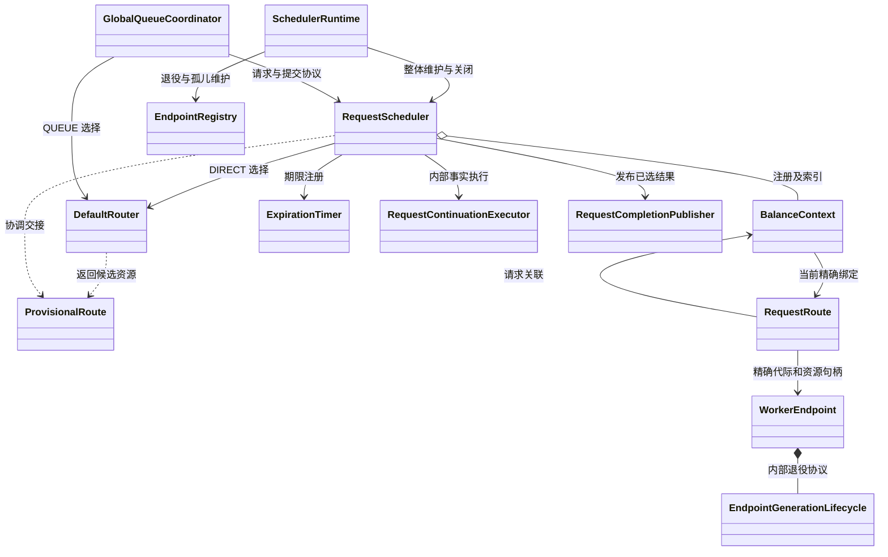

# FlexLB 请求职责重构开发交接

> 历史迁移记录。2026-10-03 的新交接以[当前类图、成员/API 和实现约束](target-class-api-review.md)为准，包含删除 RequestLifecycle、扩展交付清理责任及无 fetch 时取消 Prefill 的协议要求。本文的旧职责位置和测试结果不代表新方案已经实现或验收。

成员和接口级评审见[目标类图和 API](target-class-api-review.md)。其中标明了保留、迁入和拟收拢的接口，作为本文职责边界的详细视图。

本文交接单请求状态封装、调度服务职责收缩和执行设施边界整理的开发工作。目标是让请求状态、路由资源和端点容量分别由明确的对象维护，使开发者通过协议接口协作，不再跨对象逐字段修改请求状态。

**状态：本文保留原设计与验收计划；首版已实现，API 性能验收尚未通过。** 实际结构与本轮验证见[实施记录](ownership-class-diagram.md#2026-10-02-请求职责现状)。设计以 2026 年 10 月 2 日审查的工作区为基线，HEAD 为 `2b2338ce9a86fbbee6b77203b1d57950dbea3346`。审查对象包含大量未提交修改，不能只检出该 commit 就认为获得了本文基线。关键源码指纹和已运行测试见[证据记录](evidence/request-ownership-rehearsal/evidence.json)。实施前保存实际起点的 commit 或工作区补丁，并确认差异。

本轮只重构职责和接口，保持既有行为。本文覆盖旧文档中与本轮请求职责、类名和 scope 冲突的建议；不执行旧 `final-design.md` 中的五阶段迁移，不恢复 `RequestSlot`、`RequestRegistry`、`RouteAdmission` 等已撤销的结构。不以减少类数或代码行数作为验收指标。

## 1 开发目标和排除范围

完成后必须满足：

1. 单请求生命周期的可变状态由 `BalanceContext` 的行为方法维护，外部无法任意写入。
2. `RequestScheduler` 管理请求目录、入口与跨对象协调，单请求记录不再散落在三个服务级 Map 中。
3. 路由选择、尝试资源、具体绑定及端点容量的所有权清楚，失败和迟到事件不会跨身份结算。
4. Timer、继续执行器和 Publisher 具有独立执行契约，业务裁决不由线程设施决定。
5. 原有原子交接、响应竞争、资源结算与停机顺序保持不变。

本轮不做：新增 `RequestSession` 或另一份请求状态；新增 `RequestRuntime`；合并线程池；引入通用事件总线、状态机框架或基类；合并批次和单请求投递；改路由算法、协议 schema、配置语义、错误码、公开查询相位或 Engine 取消协议。已有 `SchedulerRuntime` 继续负责整体维护和有序停机，不再建立第二个管理器。

## 2 类划分依据

按独立决策和不变量划分职责，再决定 Java 类和方法的组织。信息隐藏的依据是让调用者不必了解内部表示和变化原因，而非把处理流程的每一步都建成类。理论参考：[Parnas 的模块划分准则](https://www.cs.lafayette.edu/~gexia/cs301/resources/parnas.html)。

| 审查问题 | 本轮落地要求 |
| --- | --- |
| 这个对象封装什么独立决策 | 选路策略、请求裁决、容量记账、任务执行必须能分别解释 |
| 哪些约束必须一起成立 | 请求投递资格与本地交接不能拆开；响应选择与发布不能混同 |
| 身份与 scope 是什么 | 区分请求实例、一次尝试、一次绑定、端点代际、批次与抢占事务 |
| 谁维护状态与释放义务 | 请求维护自身义务；端点维护容量账本；句柄表达精确交接 |
| 拆分是否减少调用方知识 | 禁止用一组 getter/setter 包装同一套外部状态拼装逻辑 |

状态拥有者不要求独占整个调用栈。跨对象协调可以持有请求锁，但只能调用完整协议方法，不能绕过协议写私有状态。技术类型可保留为包内类或静态嵌套类，不要求每个概念新增文件。

## 3 目标职责和生命周期

| 类或概念 | scope | 拥有的状态和决策 | 禁止扩入的职责 |
| --- | --- | --- | --- |
| `BalanceContext` | 一次请求实例，直到本地资源义务结清 | 稳定输入、阶段、当前绑定、取消、响应选择、清理和请求侧抢占参与记录 | 全局索引、队列排序、容量计数、线程池、RPC 客户端 |
| `RequestScheduler` | 调度服务实例 | 注册、活动索引、终态记录、入口、跨对象操作、全局 admission 计数 | 直接读写请求内部状态、端点容量记账 |
| `SchedulerRuntime` | 调度运行期 | 定期维护、指标遍历、整体停机顺序 | 重新裁决请求结果 |
| `DefaultRouter` | 可复用的选路组件 | 组合各角色策略，产生精确端点选择 | 已提交请求的生命周期与资源结算 |
| `ProvisionalRoute` | 一次选路和准入尝试 | 尚未转交的代际 pin、Decode reservation；交接或回滚 | 请求永久身份、第二份容量账本 |
| `RequestRoute` | 一次具体分配 | 请求与精确端点代际的关联、资源句柄、旧回调识别 | 选路策略、整个请求终态 |
| `WorkerEndpoint` 及 State | 一个端点代际 | 预留、容量、Engine 归属和精确释放 | 请求响应胜者 |
| `EndpointGenerationLifecycle` | 所属端点代际 | 关闭交接入口、排空已接受交接、一次退役清理 | 远端存活判断、整个请求寿命 |
| `GlobalQueueCoordinator` | 全局排队运行期 | 顺序、容量等待、放置编排 | 私写请求阶段 |
| `WorkerBatcher` | 单端点运行期 | 本地等待、成组、投递驱动 | 请求终态和另一份资源账本 |
| `BatchTransaction` 与抢占事务 | 一次跨请求事务 | 成员交接、发送责任、跨 victim 协调 | 将整项事务塞入某一个 Context |
| 三个执行设施 | 服务运行期；注册或任务另有短生命周期 | 计时、内部事实串行执行、用户回调隔离与排空 | 请求业务裁决 |

`DefaultRouter` 返回 `ProvisionalRoute`；调度编排创建并提交 `RequestRoute`。创建对象不是提交生效点。候选对象和绑定对象可能短暂同时存在，资源责任只能在约定的交接点转移。



图省略回调和部分端点依赖，不表示所有运行调用均单向。允许短期操作持有精确句柄；不允许 Context 获得全局查询或任意任务执行能力。

## 4 必须保持的行为约束

| 编号 | 约束 | 可观察的验收结果 |
| --- | --- | --- |
| C01 | 请求、原 Future、路由、端点代际及适用 token 精确匹配 | 旧请求或旧路由回调不能修改新实例 |
| C02 | 只有一个内部请求阶段；公开 Phase 是既有投影 | 不新增第二份可写生命周期，不改变查询语义 |
| C03 | 响应选择与资源终态独立 | 已选成功响应可以和后来的资源超时结算并存 |
| C04 | ACK 观察不是响应选择 | ACK 到达后、正式选择前仍允许原有超时竞争 |
| C05 | 外部排队 Future.cancel 保持同步完成语义 | 队列线程暂停不妨碍 Future 被取消；资源随后结算 |
| C06 | 投递资格、时间检查、本地所有权交接与 claim 同一临界区 | 取消不能插入半次交接；一个绑定最多取得一次投递权 |
| C07 | 端点队列 publication 在请求锁外，admission 操作覆盖间隙 | publication 阻塞时取消可进入；事实保留到操作结算 |
| C08 | 有效发布许可先于其保护的终止提交 | 关闭不会遗失已接受但尚未入队的响应 |
| C09 | 提前触发、取消、重复触发按精确期限注册握手 | 不丢期限、不重复消费、不让旧期限作用于新绑定 |
| C10 | 只有持有者能回滚或释放对应能力 | 成功交接后旧 holder 不释放下游资源 |
| C11 | Engine ACK、UNKNOWN、NOT_FOUND 不能一概视作资源释放 | 请求取消不导致容量提前归还或重复发送 |
| C12 | 本地撤回不创建新请求 | 原 Future、优先级、FIFO 身份、绝对期限保留 |
| C13 | 退役关闭入口后排空已接受交接 | cleanup 不与尚持有 pin 的交接重叠 |
| C14 | 停机先终止生产者，再排空消费者 | 在途 admission、timer、RPC 和内部事实均有明确结算 |

本轮保留当前七阶段及现有合法边，不顺便修改状态机：

| 当前阶段 | 允许的下一阶段 |
| --- | --- |
| `QUEUED` | `ROUTING`、`FINALIZING` |
| `ROUTING` | `QUEUED`、`READY_TO_DELIVER`、`FINALIZING` |
| `READY_TO_DELIVER` | `ROUTING`、`DELIVERING`、`FINALIZING` |
| `DELIVERING` | `RESULT_PENDING`、`FINALIZING` |
| `RESULT_PENDING` | `FINALIZING` |
| `FINALIZING` | `FINISHED` |
| `FINISHED` | 无 |

这张表只描述阶段转换，不代表阶段足以推导响应是否已发布、资源是否已归还或远端是否已停止。

## 5 字段和类型迁移清单

源码起点见 [RequestScheduler](../../flexlb-sync/src/main/java/org/flexlb/balance/scheduler/RequestScheduler.java) 和 [BalanceContext](../../flexlb-sync/src/main/java/org/flexlb/balance/scheduler/BalanceContext.java)。以下目标归属是本轮要求；不允许旧 Map 和新字段长期双写。

| 当前字段或类型 | 目标归属与具体修改 |
| --- | --- |
| `routingOperations<BalanceContext, AdmissionHandle>` | Context 私有的当前 admission 引用；删除服务级 Map |
| `cleanupOperations<BalanceContext, CleanupProgress>` | Context 私有清理进度；保留 PENDING/RUNNING/RUN_AGAIN/WAITING 的防重入语义 |
| `preemptions<BalanceContext, PreemptionRegistration>` | Context 私有请求侧参与引用；跨 victim 协调器与 Decode 资源 claim 保留 |
| `stage`、`finalOutcome`、`cancellationReason/Response`、`selectedResponse` | Context 私有，唯有请求协议方法修改 |
| `item`、delivery kind、batchId、ACK/接受/可见性事实 | Context 私有；通过精确路由或 claim 的操作更新 |
| 三类 deadline 引用、活动时间和决策期限事实 | Context 私有；安装、消费、摘除都是精确身份操作 |
| `RequestStage`、`ResponseResult`、请求专属辅助记录 | 随 Context 协议迁移，优先静态嵌套或现有包内类型；删除 Context 对 Scheduler 内部状态类型的 import |
| `RequestFuture` | 将现有实现迁为 Context 所属静态类型；保留 override 行为、初始化防重绑和完成后释放 target 的逻辑 |
| `AdmissionHandle`、`DeliveryClaim` | 消除非静态内部类隐式捕获 Scheduler；请求状态由 Context 管理，操作完成通过窄回调回到编排方 |
| `TerminalAction`、`DeferredTerminal` 等现有包内记录 | 继续表达精确事实与一次性交接；删除前先证明身份、失败和清理信息均有替代归属 |
| `activeRequests`、`terminalRecords` | 留在 Scheduler，按精确实例发布、替换、移除 |
| `registrationLock`、`shuttingDown`、admission 全局计数与 monitor | 留在 Scheduler，不迁入某个请求 |
| endpoint 的 reservation、容量、preemption hold | 留在 endpoint/State，不复制到 Context |

`AdmissionHandle.close()` 和 `terminate()` 的幂等及全局 admission 计数退出不能因迁移失效。Context 持有当前操作身份不等于它负责全局排空计数。窄回调只表达该操作的完成，不暴露 Scheduler 的查询、选路和执行器能力。

`RequestFuture` 对外 complete、completeExceptionally、cancel 仍经原请求协议。迁移后通过私有窄 completion target 回到编排方；owned completion 后仍清空 target，避免已完成 Future 长期保留整个服务。不要通过额外的 session 对象绕开这项迁移。

输入与观测区不在本轮全面改写。注册时已冻结的 `RequestRequirements` 继续作为稳定调度输入；不能重新从可变 Request 中读取 requestId/priority 等来替代它。首次 Worker FIFO 身份仍在原首次路由时点初始化，不提前到注册。

## 6 方法迁移清单

方法名用来定位现有代码，不要求目标签名原样保留。优先按一条完整协议迁移，而非先移动所有字段，再用 setter 补齐编译。

| 当前方法组 | 目标与迁移规则 |
| --- | --- |
| `register`、`schedule/submit`、`submitDirect`、目录查询 | Scheduler 保留入口与目录；通过 Context 激活及快照接口访问请求 |
| `advanceStageLocked`、`assertInvariantLocked`、请求内 ownership 判断 | Context 内部实现；全局 `isCurrentSlot` 判断仍在 Scheduler |
| `tryBeginAdmissionHandle`、`finishAdmission`、`settleAdmissionLocked` | Scheduler 管理全局 admission 门槛及外部动作，Context 管理当前 operation 及滞留事实 |
| `commitRoute` | Scheduler 保留锁内绑定、锁外 publication、锁内确认的编排；Context 封装绑定与确认，不暴露 item setter |
| `prepareDispatch`、`claimDelivery` | 保留完整原子区；请求资格和 claim 更新归 Context，受约束的本地资源交接在同一原子区发生 |
| `acceptDeliveryResult`、`acknowledgeDeliveryLocked`、端点事实处理 | Context 校验身份和更新事实；Scheduler 锁外执行指标、通知及发布 |
| `recordCancellationLocked` | Context 裁决首个原因；Scheduler 在同一请求临界区采集原有诊断并组装输入，不能提前采样再当作裁决时证据 |
| `cancelQueuedExternal`、`completeExternal` | Scheduler 保留外部 Future 协议编排，Context 选择结果；publishNow 和用户回调仍在请求锁外 |
| `claimPublicationResultLocked` | Context 维护唯一响应选择；不得提前合并到 ACK 处理 |
| deadline 安装、消费、期限判断和预测更新 | Context 封装请求事实；Timer 仅安排注册和传递触发 |
| `claimFinalizationLocked` | 请求资格、义务摘除和阶段推进归 Context；发布许可取得与外部执行仍由 Scheduler 协调，详见下一节 |
| `finishTerminal`、`releaseEndpoints`、`settlePrefill/Decode` | Scheduler 执行已认领动作，保留失败隔离和精确资源验证；不得重新选择业务结果 |
| `cleanUpRequest`、`resumeCleanup` | 清理 runner 的状态握手归 Context；endpoint 调用留在锁外的执行部分，不新增通用 CleanupService |
| `commitTerminalRecord` | Context 验证 action/route 并完成本地状态；Scheduler 在原临界区写终态记录、移除精确活动项 |
| 请求侧 preemption 安装、更新、解除 | Context 管理单请求参与状态；Scheduler/协调器执行跨对象通知，不合并 DecodeState 的资源状态 |

返回值优先复用既有 claim、action、snapshot 和精确句柄。如果确实缺少携带信息的类型，可增加局部不可变记录；必须说明它承载了什么无法由已有结果表达的信息，不引入通用 Effect 框架。

## 7 关键协议的实现顺序

### 7.1 路由 publication 与并发取消

1. Scheduler 取得全局 admission 许可，并在 Context 中安装精确 operation。操作失败必须归还全局许可。
2. 在请求锁内核对当前实例、operation 和阶段，绑定候选 route。
3. 释放请求锁，执行 endpoint publication。保留现有 publication 成功、拒绝、异常的不同语义。
4. publication 未解决期间，取消或退役事实可以进入 Context，但不能丢弃 operation 正在保护的资源义务。
5. 回到请求锁内，按原结果确认可投递状态或撤销临时绑定，合并期间保留的事实。
6. 锁外执行通知、回滚或已认领清理；无论成功失败，精确 operation 只结束一次，全局计数只退出一次。

禁止锁外 publication 尚未返回时，仅因已取消就删除所有请求跟踪。禁止把 publication 移入请求锁以省略中间协议。

### 7.2 投递资格与本地交接

同一个 Context monitor 内依次完成精确身份和阶段检查、读取当前时间并判断期限、本地 endpoint transfer、记录唯一 claim 和关联身份。保持原 `prepareDispatch` 和 `claimDelivery` 的锁契约。

这段原子区可执行现有受约束的本地资源操作，不能执行 RPC、等待退役、Future completion 或任意用户回调。部分 endpoint 资源操作会同步发出内部容量通知，迁移时必须检查这条回调链和反向锁路径，不能假设 transfer 是无回调的纯函数。转移返回失败和抛异常按现有资源结果结算，不能一概解释为操作未发生。

### 7.3 响应选择和实际发布

ACK 先作为请求事实记录；在原选择时点取得并消费 publication permit，再在请求锁内选择一次响应；解锁后 Publisher 完成 Future。已选成功响应尚未发布时，后来的 timeout 或 Future.cancel 不能替换它。

排队外部 cancel 保留特殊顺序：请求锁内选择取消结果，锁外同步发布 Future 取消，最后通知队列 owner 继续资源处理。不能要求队列先清理完才让 cancel 返回。资源仍在清理期间，不能只因 Future.isDone 删除请求跟踪。

### 7.4 终止认领和资源结算

保留“资格检查、取得必要发布许可、冻结动作、进入 FINALIZING”的连续临界区。编排形态如下，名称为语义示意，不是要求新增公共 API：

```text
持有请求锁
    校验仍为当前实例及精确 route
    Context 判断是否满足终止条件
    如需响应发布，Scheduler 取得 publication permit
    Context 认领现有 TerminalAction，摘除本次义务并进入 FINALIZING
    认领失败则按原规则归还未消费 permit
释放请求锁
    执行精确期限取消和 endpoint 结算
    保留原失败隔离、pending 清理和后续唤醒
持有请求锁
    Context 校验本次 action 和 route
    Scheduler 与 Context 按原顺序完成终态快照、FINISHED 和精确索引移除
释放请求锁
    按原发布流程完成 Future；排队外部 cancel 已发布的路径不得二次选响应
```

上述“取得许可”不能移到已推进 FINALIZING 之后。原来的 `finishRequest` 随发布动作执行的路径也不能随意提前。endpoint 结算失败如何隔离、何时仍可提交终态记录，应保持当前代码和测试的契约，不以本次结构改造重定义成功条件。

### 7.5 撤回和抢占

保留每个 victim 的精确 admission/抢占身份，endpoint 原子处理本次资源替换，再逐请求解除旧绑定和决定是否重新排队。不同时持有多个请求锁等待 endpoint 或 RPC。取消若已赢得裁决，撤回结束不能把请求重新放回队列。

请求侧 `PreemptionRegistration` 和资源侧 claim 可以有不同存活时间。Cancel ACK 不代表 Engine terminal，UNKNOWN 不代表 NOT_SENT；不能删去资源侧 hold，也不能因请求已从目录移除而直接释放远端归属资源。

## 8 Timer 和运行设施改造

### 8.1 ExpirationTimer

保留三类精确期限注册、`PREPARED/FIRED_BEFORE_INSTALL/ARMED/CONSUMED/CANCELED` 握手、在途注册计数和关闭异常共享。`InactivityDeadline` 只是重新检查活动事实的唤醒，不是请求已经超时的证明。

将 `maintain` 中策略编排移回已有 `SchedulerRuntime`：一轮只读一次动态 TTL，使用同一时间基准；先让 Scheduler 清终态记录，再由 EndpointRegistry 清孤儿，保留 `retainForSchedulerCleanup` 和逐项失败隔离。时间截断和溢出语义保持原样。不要改成两项各自读取配置的独立定时任务。

将 Timer 对具体 Scheduler 的依赖收窄为它实际需要的注册安装、触发、关闭门槛和精确请求快照回调。可在 Timer 内定义一个包内协作接口，或复用已有函数参数；不新增框架或另一份请求 Map。期限判定逻辑留在 Context，当前实例目录判断由 Scheduler 提供。

Timer.close 保持以下次序：关闭注册入口，等待在途注册结束，摘除并取消精确句柄，停止并等待定时线程，发布共享关闭结果。不能先在 Scheduler 中随意扫一遍句柄，再关闭仍接受注册的 Timer。

### 8.2 RequestContinuationExecutor

保留每 Context 的串行队列和跨 Context 并发。任务执行时队列项仍存在，避免重入提交另起并发 drain。保留异常隔离、关闭期间已接受任务的排空和现有恢复路径；不改为“一请求一常驻线程”。

`awaitIdle` 只证明当时为空。只有生产者已经停止，才能用它参与停机完成判断。不要为了消除 Context 引用而改为裸 requestId 排队，避免身份复用串线。

### 8.3 ResponseCompletionExecutor（2026-10-06）

运行时内部的响应执行设施，由 SchedulerRuntime 创建和关闭。执行器仅维护不含请求身份或响应类型的 CompletionRegistration、任务执行、拒绝恢复、在途排空、并发关闭和回调重入关闭；不依赖 BalanceContext、ACK、deadline 或 reporter。

Scheduler 持有响应协议和完成操作：ACK 对应的请求 deadline 在排队前取消；ACK 指标上报及响应复验仍在原响应执行队列实际执行时发生，避免提前冻结成功结果，也避免指标上报阻塞请求续接线程。Context 的 PublicationPermit 保存请求身份、响应种类和一次认领，与执行登记分开；SelectedResponse 是冻结的数据。已选终态响应直接提交完成操作，外部 Future 操作仍同步执行，调用方回调均在请求锁外。

执行器运行 Scheduler 提供的完成操作，而非只接收提前选定的 ACK 响应：这保留“响应线程被其他回调占用时，后到终态可以使排队 ACK 失效”的既有竞争边界。任务执行和异常退出均通过 finally 归还执行登记；排空不能只看线程池队列长度。

验证：3 个独立 reviewer 的复审无阻断问题；所有权/关闭重点 UT 70 项通过，Sync 全量 UT 1,631 项通过。完整本地 reactor 共 2,484 项，1 项跳过，Mock 吞吐锚点 1 项失败；该类远端复跑 8 项全部通过。750P/750D、64g JVM、3,000/10,000 QPS 的 BATCH 与 NON_BATCH 共 4 个场景通过 Master/client P99 < 50 ms 及吞吐 ≥ 98% 的门槛。[完整验证记录](evidence/response-completion-executor-2026-10-06.json)。

质量复审补充：执行登记不等于响应获胜；PublicationPermit 使用 consumeForSelection / abandonIfUnused 表达一次选择机会。执行器区分异步 worker 与同步 caller，提交前锁检查失败归还登记，主线程池关闭失败仍尝试关闭恢复线程池。新增异常路径覆盖后 Sync 全量 UT 1,633 项通过，重点 UT 72 项通过，复审及格式检查通过；本轮未重复性能测试。

### 8.4 已有 SchedulerRuntime 的停机顺序

整体顺序由现有 `SchedulerRuntime.shutdown()` 维护。RequestScheduler 只暴露自身各关闭步骤，不再增加一个整体 shutdown owner。保留当前顺序及故障下继续执行剩余步骤的行为：

```text
beginShutdown                        关闭请求注册入口
closePlacement                       关闭全局放置
awaitAdmissionMutations              等待已接受的 admission 操作
EndpointRegistry.close               退役端点并结算对应生产源
dispatcher.shutdownAndAwait          等待投递及回调
closeExpiration                      关闭期限注册和定时线程
awaitContinuations                   排空已到达的内部事实
closeOutstandingAndTerminalize       处理剩余请求
continuations.close                  最终关闭内部事实执行
completionPublisher.close            最后排空响应发布
```

最后两个操作目前合在 `RequestScheduler.closePublisher()` 中。将该组合方法改为能表达两项作用的名称，例如 `closeRequestExecutors()`，同步修改调用和测试。不要仅为形式把这个组合步骤拆成另一套可独立乱序关闭的服务。

## 9 提交顺序和完成条件

### PR 1 单请求封装和 Scheduler 收缩

按请求身份与只读快照、admission/绑定、投递与响应、取消/终止/清理、期限与抢占参与的顺序逐组迁移。每组同时迁移数据和相关行为，保证可以编译和运行契约测试；最终 PR 不保留双写 Map 或通用 setter。

- [ ] Context 生命周期字段私有，外部只能经行为或快照访问。
- [ ] 删除三个服务级单请求 Map；全局 admission 计数继续正确。
- [ ] 状态类型、Future 和操作身份不再使 Context 依赖 Scheduler 内部状态表示。
- [ ] 整个请求锁外的副作用边界及锁内本地交接原子区保持。
- [ ] 没有新增请求实体、额外生命周期字段或行为转发服务。
- [ ] C01 至 C12 的相关回归通过，端点清理死锁测试通过。

### PR 2 Timer 执行和运行设施职责

- [ ] 定期保留策略编排归已有 Runtime，Timer 的请求协作依赖收窄。
- [ ] 提前触发和关闭注册握手完整，Timer 无请求副本索引。
- [ ] 两个执行器保留各自线程隔离和排空机制。
- [ ] 关闭方法名称与实际范围一致，Runtime 顺序不变。
- [ ] C04、C05、C08、C09、C14 及重入/异常关闭回归通过。

### PR 3 路由契约和文档收尾

只修改前两项迁移暴露出的真实接口越界、重复状态或错误说明，不为此强制重写路由/端点实现。对已经满足约束的类，以补充准确契约和复核证据完成，不制造无收益代码改动。

- [ ] ProvisionalRoute 的交接与回滚、RequestRoute 的身份和 endpoint 的释放职责明确。
- [ ] C01、C10 至 C13 在真实组批/撤回/抢占路径有回归覆盖。
- [ ] 无旧类的生产入口、过时类型 import 或仅作转调的新包装层。
- [ ] 更新本目录的现状类图和两份 CLAUDE.md 中不符合实现的描述。
- [ ] 整体功能测试通过，实际改动涉及的性能门槛完成。

三个 PR 按顺序开发和审查。不允许 PR 1 先改变语义、等 PR 2/3 再恢复行为。公共调用签名如需调整，所有模块调用方必须随同更新并编译。

## 10 验证清单和命令

在 `rtp_llm/flexlb` 目录使用仓库 Maven wrapper 和 Java 21。先运行基线，再运行改动后的同组测试；测试名称可能保留 RequestRegistry/RequestSlot 等历史名字，不能仅凭名称将其删除。

| 协议 | 现有主要测试 |
| --- | --- |
| 注册、身份与生命周期 | `RequestSchedulerEntryTest`、`RequestLifetimeTest`、`RequestStateTest` |
| publication 和本地交接锁边界 | `RequestLifecycleDeliveryLockContractTest`、`RequestAdmissionExpirationRaceTest` |
| 响应选择、同步 cancel、重入发布 | `RequestCompletionPublicationRaceTest` |
| 资源结算与死锁 | `RequestAdmissionResourceLeakTest`、`RequestResourceAccountingTest`、`DeliverySettlementTest`、`EndpointCleanupDeadlockTest`、`EndpointCleanupOwnershipTest` |
| 撤回和抢占 | `QueuedDecodeWithdrawalTest`、`PreemptionRegistrationTest`、`DecodePreemptionCoordinatorTest`、`DecodeCapacityPreemptionTest` |
| Timer 与继续执行器 | `ExpirationTimerTest`、`RequestContinuationExecutorTest`、`RequestInactivityTest`、`RequestConfirmationTimeoutTest` |
| 端点代际 | `EndpointGenerationLifecycleTest`、`EndpointRetirementLinearizationTest`、`EndpointDiscoveryTest` |
| 整体关闭 | `RequestOrchestratorsTest`、`PollRunnerLifecycleTest`，以及发布/Timer 的关闭竞态测试 |

最先运行的三组基线契约：

```bash
./mvnw -q -pl flexlb-sync -am test \
  '-Dtest=RequestLifecycleDeliveryLockContractTest,RequestCompletionPublicationRaceTest,QueuedDecodeWithdrawalTest' \
  -Dsurefire.failIfNoSpecifiedTests=false
```

PR 1 的补充范围：

```bash
./mvnw -q -pl flexlb-sync -am test \
  '-Dtest=RequestSchedulerEntryTest,RequestLifetimeTest,RequestStateTest,RequestAdmissionExpirationRaceTest,RequestAdmissionResourceLeakTest,RequestResourceAccountingTest,DeliverySettlementTest,EndpointCleanupDeadlockTest,EndpointCleanupOwnershipTest,PreemptionRegistrationTest,DecodePreemptionCoordinatorTest,DecodeCapacityPreemptionTest' \
  -Dsurefire.failIfNoSpecifiedTests=false
```

PR 2 和端点/关闭边界：

```bash
./mvnw -q -pl flexlb-sync -am test \
  '-Dtest=ExpirationTimerTest,RequestContinuationExecutorTest,RequestInactivityTest,RequestConfirmationTimeoutTest,RequestOrchestratorsTest,PollRunnerLifecycleTest,RequestCompletionPublicationRaceTest,EndpointGenerationLifecycleTest,EndpointRetirementLinearizationTest,EndpointDiscoveryTest' \
  -Dsurefire.failIfNoSpecifiedTests=false
```

最终运行完整功能测试和格式检查：

```bash
./mvnw test
./mvnw spotless:check -Pspotless-check
git diff --check
```

由于修改请求锁热路径、快照分配或执行设施可能影响吞吐和延迟，相关 PR 按项目已有性能 profile 单独验证，不能从单测推导性能结论：

```bash
./mvnw -Psync-performance-regression -pl flexlb-sync -am test
./mvnw -Papi-performance-regression -pl flexlb-api -am test
```

需要增加覆盖时，从 C01 至 C14 推导可观察行为，优先扩展现有测试。竞态通过 latch/barrier 控制关键时点，不依靠 sleep 碰撞。不要 mock 掉正在验证的请求锁、本地所有权交接、发布许可或期限安装握手；不要编写只验证字段移动位置的单元测试。

提交前必须核对：同一个请求在延迟 ACK、cancel、expiry、退役、UNKNOWN 和 shutdown 组合下，响应是否唯一、资源是否有明确最终 owner、旧事件是否无害、所有等待能否退出。

## 11 已有模拟证据和适用范围

交接前执行了三组真实 Java 契约测试：`RequestLifecycleDeliveryLockContractTest` 19 项、`RequestCompletionPublicationRaceTest` 13 项、`QueuedDecodeWithdrawalTest` 13 项，共 45 项通过，失败/错误/跳过均为 0。这是重构前基线，不是新实现的验收结果。源码指纹仅覆盖证据文件中列出的文件，不能替代完整仓库快照。

另有一个有限交错协议模型，9 组修正设计场景共 73 条完整顺序、251 个执行前缀，未违反模型中的断言。6 种刻意削弱的设计均产生反例：

| 削弱方案 | 一条反例顺序 |
| --- | --- |
| ACK 到达即选择成功 | ACK 观察 → inactivity terminal → 正式选择尚未发生 |
| 退役不等待 pin | acquire → close gate → cleanup |
| Publisher 关闭只看队列 | reserve → begin close → finish close，尚未 submit |
| 旧事件只验证 requestId | 替换实例/路由 → 旧 callback |
| 不记安装前触发 | fire → fire → install |
| 同步 cancel 必须等清理 | 选择 cancel → 队列暂停 → cancel 无法返回 |

模型不是从 Java 自动抽取，也不证明重构实现等价；它假设事件边界原子执行，没有覆盖 JVM 内存可见性、真实锁重入、执行器失败、网络结果、完整 batch/preemption 事务和性能。弱化版本是反例探测，不代表当前代码存在对应缺陷。

- [模型源码](evidence/request-ownership-rehearsal/protocol_model.py)
- [交错结果与反例](evidence/request-ownership-rehearsal/results.json)
- [基线源码指纹与 Java 用例结果](evidence/request-ownership-rehearsal/evidence.json)

从仓库根目录可重新运行模型，不需要第三方 Python 库：

```bash
python3 rtp_llm/flexlb/docs/scheduler-design/evidence/request-ownership-rehearsal/protocol_model.py
```

## 12 交付给 reviewer 的材料

每个 PR 的说明须列出：本次迁移的状态和方法、消除的旧机制、保持的原子区、资源交接点、实际运行的测试及未验证范围。提供与代码一致的目标类图，不需要展示全部历史候选。

出现以下任一情况不能按纯重构合入：旧 Map 与 Context 字段双写；用 Future.isDone 代替资源结算；将本地原子交接拆成无保护的检查/执行；把 UNKNOWN 当未发送；让 Timer 直接决定请求终态；新增第二个整体 shutdown owner；为满足测试而改变原先的外部语义。

若某条既有行为确需改变，单独提交行为变更及依据，不混入字段迁移。本文接口细节可以在保持契约的前提下调整，但不能用新的类名、包装层或注释代替所有权和并发协议的落实。
