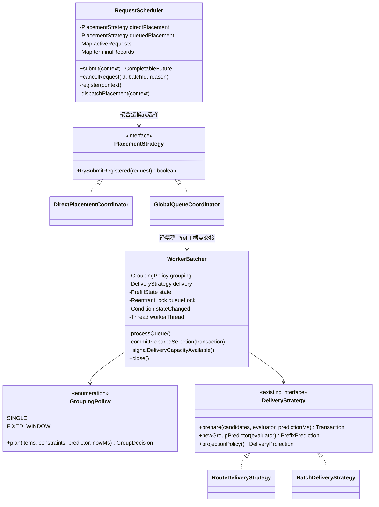
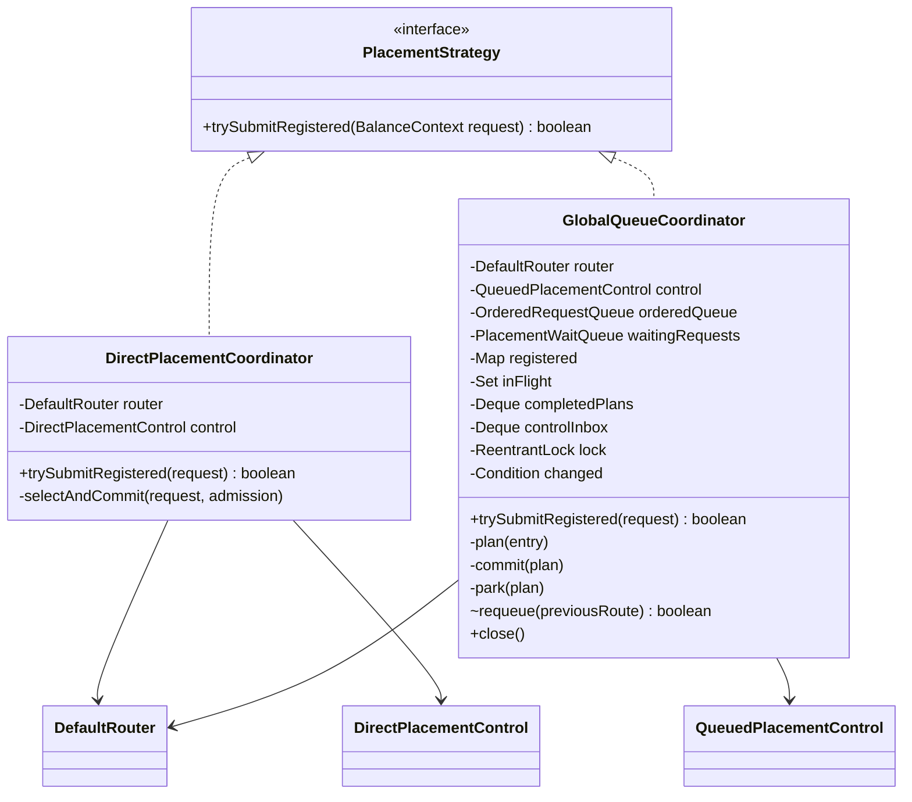
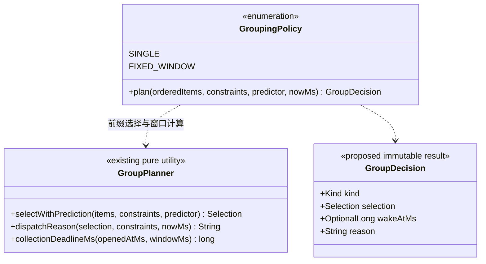
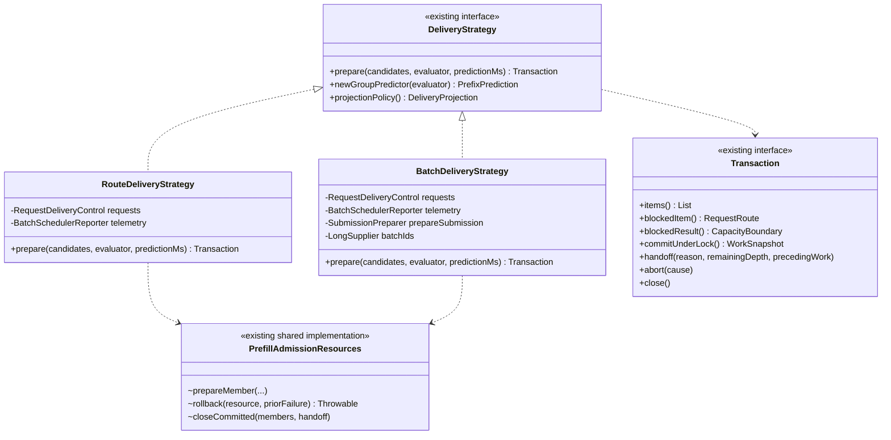

# FlexLB 本轮设计改进评审稿

> 历史方案。2026-10-03 的请求调度结构与开发契约以[当前类图、成员/API 和实现约束](target-class-api-review.md)为准。本文的 PlacementStrategy、DirectPlacementCoordinator、GlobalQueueCoordinator 及不新增抽象基类等建议已被替代；不得据此恢复旧类或端口。

本文汇总整体分层、DIRECT 与 QUEUE 编排、三个变化轴、接口与继承取舍，是本轮评审的统一入口。类图描述目标，API 标明拟新增和保留，不是当前实现的自动生成图，也不是完成验收的声明。

实施起点（2026 年 10 月 2 日）核查：工作区已有 DirectPlacementCoordinator，但其 submitRegistered 仍接收完整 RequestScheduler；GroupingPolicy 尚未出现，GroupPlanner 是静态纯计算工具；DeliveryStrategy 及其 Transaction 接口已存在。生产代码正在变化，实施与验收必须绑定实际提交，不沿用旧测试结果证明新代码。

## 1 设计结论

| 决策 | 本轮要求 |
| --- | --- |
| 三个变化轴 | 放置 PlacementStrategy、成组 GroupingPolicy、交付 DeliveryStrategy |
| 接口与基类 | 对外使用接口；内部通过组合或已有计算函数复用；本轮不新增抽象基类 |
| DIRECT 与 QUEUE | 分别由 DirectPlacementCoordinator、GlobalQueueCoordinator 编排；Scheduler 只注册与分派 |
| 共用能力 | 共用 Router、请求准入与资源协议，不复制状态和资源账本 |
| 依赖隔离 | 协调器依赖窄请求协作端口；不能接收整个 RequestScheduler 作为万能参数 |
| 状态归属 | 请求事实归 BalanceContext，容量归 State，队列归协调器，发送责任归 Transaction |
| 运行设施 | 复用现有 SchedulerRuntime、Timer 和两个执行器，不新建 Runtime 或通用状态机框架 |

整体层次是接入适配 → 应用编排 → 业务协议/决策计算。通信、计时和存储通过使用方定义的端口接入；装配负责选择实现和有序启停。三个变化轴位于应用编排及决策计算边界，不是三层上下级关系。

## 2 组合类图

`+` 表示调用入口，`-` 表示私有成员，`~` 表示包内操作。图省略监控、普通 getter 和无关重载；图中参数为语义简写，精确契约见后文。



DIRECT 不经过 WorkerBatcher/GroupingPolicy，保留现有立即单请求路由交接。复用 NON_BATCH 资源及请求协议即可；本轮不强制将 DIRECT 改接 WorkerBatcher 的 prepare 流程。上图中的组合依赖不意味着每种模式都经过所有策略对象。

入口按请求当前合法配置选择已装配的策略，不能仅把一个 strategy 固定注入就悄悄改变原配置切换语义。QUEUE 未在启动时启用时，仍按原规则拒绝后来启用的 QUEUE 请求。

## 3 放置接口与实现



### 拟新增入口契约

```java
interface PlacementStrategy {
    boolean trySubmitRegistered(BalanceContext request);
}
```

| 项目 | 必须满足 |
| --- | --- |
| 输入 | 已完成唯一注册的 Context，使用原 RequestFuture |
| 返回 true | 已接管本次模式编排；可能尚未放置，也可能已同步完成或失败 |
| 返回 false | 本调用没有接管且没有遗留资源/队列项；入口按原拒绝协议结算，不允许另找策略重试 |
| 并发取消 | 接管前或过程中取消，精确请求协议决定胜者；false 不能覆盖已经选定的结果 |
| 异常 | 普通执行异常在接管后由持有者结算；不能通过 throw 暗示已发生的交接不存在。灾难性 Error 保留异常及必要 finally，不承诺一律吞掉 |
| Future | 不创建替代 Future，不通过 dependent stage 破坏外部 cancel |
| 生命周期 | 接口不含 start/close；DIRECT 无伪造运行线程，QUEUE 的生命周期仍由既有 owner 管理 |

禁止让 Scheduler 在捕获异常后无条件换一种策略或重新提交。已接管的 DIRECT 失败通过原请求发布协议处理；GlobalQueueCoordinator 的 true 只代表接受排队责任。

### 协作端口

下表是现有调用能力的收窄，不是新增一层业务服务。可定义为各协调器的嵌套 Control 接口；DirectPlacementControl、QueuedPlacementControl 是图中的区分名称。实现由装配提供，类中不保留完整 Scheduler 类型。

| 使用方 | 需要的能力 | 不应获得的能力 |
| --- | --- | --- |
| DIRECT Control | claimAdmissionHandle、commitDirectRoute、publishRoute、publishDecisionResponseAsync | 队列恢复、全目录遍历、整体 shutdown |
| QUEUE Control | claimAdmissionHandle、enqueueRoute、cancelRequest、hasPendingGlobalControl、onGlobalControl、canRestoreGlobalQueue、settleGlobalQueueClose、publishDecisionResponseAsync | DIRECT 提交、执行器控制、任意请求状态写入 |

沿用现有精确参数和结果类型，不通过 Object 或通用 command 字符串调用。当前 attachGlobalQueue 属于装配关系，应由构造/装配明确建立，不属于队列运行协议。端口返回的 RouteDelivery 等值类型不得要求使用方引用 RequestScheduler 的内部实现类型，应归相应协议契约。

目标收益：Scheduler 不再依赖 DefaultRouter；两种模式的阻塞、重试和失败解释都在各自协调器；共同资源生效点仍由同一请求/端点协议维护。

## 4 成组接口与实现



### 拟新增 API

```java
enum GroupingPolicy {
    SINGLE, FIXED_WINDOW;

    // 两个模式共用 plan(Iterable<T>, Constraints, PrefixPrediction<T>, long)。
}
```

第 79 轮实现已收敛为上述枚举；plan 返回 GroupDecision<T>，不再保留两个无状态单例实现类。

`GroupDecision<T>` 携带既有 Selection<T>，不复制可写成员表。kind 为 EMPTY/WAIT/READY；EMPTY 没有成员，WAIT 必须给出有效的 wakeAtMs，READY 给出可尝试交付的候选组和原因。容量等待由 Worker 的资源协议处理，不编码成没有唤醒时间的策略 WAIT。READY 不是容量已预留或发送已成功。wakeAtMs 只描述策略建议的唤醒时间，Worker 仍需联合请求 deadline、停止及资源变化条件等待。

两个实现不重复保存 maxRequests/window/budget 字段。它们读取调用时冻结的 Constraints；策略配置的唯一来源由装配和现有配置生成逻辑确定，避免构造器配置与每次参数不一致。SINGLE 对应一成员和无收集等待的约束；FIXED_WINDOW 使用现有窗口与预算规则。不得让接口抽取改变单个不可分割队首的既有边界处理。

| 纯计算约束 | WorkerBatcher 保留的职责 |
| --- | --- |
| 不读全局时钟，使用 nowMs | 读取时间并捕获有界队列视图 |
| 不改队列、不判断当前 Context 的写状态 | 清理过期/已取消成员，核对精确身份 |
| 不预留资源、不发通知或 RPC | 预测后复验快照及容量，申请真实 lease |
| 不启动 Timer、不等待 Condition | 结合窗口、deadline、资源和 stop 谓词进行等待 |
| predictor 每次计算独立，不跨请求组复用可变累计器 | 从 DeliveryStrategy 取得本次 predictor |

生产组批和路由预测应复用相同策略及纯计算规则；不复制一套 projection 的窗口算法。传给纯规划器的输入只暴露 GroupPlanner.Input 需要的只读字段。

## 5 交付接口与共享实现



保留现有 DeliveryStrategy 和 Transaction API。图中的 RequestDeliveryControl 表示按当前投递调用收窄的请求端口；SubmissionPreparer 表示现有 prepareSubmission 函数依赖，不要求新增同名 Service。

prepare 允许取得准备资源，但不提前转移队列成员所有权。commitUnderLock 维护现有 endpoint 锁下的队列和资源提交。handoff 执行模式对应的交接。abort/close 只结算本事务仍拥有的义务，不能撤销已经移交的资源或把 UNKNOWN 认作未发送。

| 差异 | NON_BATCH | BATCH |
| --- | --- | --- |
| 交付 | 逐请求取得路由投递权并发布路由响应 | 持有 submission permit，发送批次并处理异步结果 |
| 预测 | 当前单请求预测累计规则 | 当前 batch 预测规则 |
| 失败 | 逐成员交接和发布结算 | 还包含提交、在途、ACK 和 UNKNOWN 等证据 |
| 事务状态 | RouteTransaction 独立维护 | BatchTransaction 独立维护 |

公共字段 requests/telemetry 是共享依赖引用，不是必须抽基类的理由。两种 prepare 的错误处理也不完全相同：不能因为循环和 finally 形似就统一模板。继续使用已有 PrefillAdmissionResources/Failures 等完整操作；只有发现同一所有权、锁边界和失败语义的重复操作时才追加提取。

## 6 合法装配和生命周期

| scheduler | grouping | delivery |
| --- | --- | --- |
| DIRECT | 不参与 | NON_BATCH |
| QUEUE | SINGLE | NON_BATCH 或 BATCH |
| QUEUE | FIXED_WINDOW | NON_BATCH 或 BATCH |

当前 DispatcherConfig 明确拒绝 DIRECT+BATCH，必须保留。三轴可分别解释不等于允许任意笛卡尔积。

装配层根据配置创建实现。策略接口不增加 getType/isBatch/isDirect 让消费者再次 switch。Worker 不再按 singleDecision 执行两套组选择流程；类型差异归 GroupingPolicy。配置校验和入口选择模式是允许的 switch。

策略生命周期不同：DIRECT 无队列运行期；QUEUE 有线程、等待和关闭；GroupingPolicy 可无状态复用；DeliveryStrategy 每次产生独立事务及 predictor。不能把某次请求的 claim、reservation、成员表保存在共享策略对象中。

整体停机继续由现有 SchedulerRuntime 驱动。关闭 QUEUE 的 owner 持有其明确的生命周期能力，不通过强转 PlacementStrategy 或空的 DIRECT.close 来统一。Timer 和 Publisher 的排空顺序遵守原交接，不因策略接口调整而改变。

## 7 实现约束与验收

| 编号 | 硬约束 | 验证重点 |
| --- | --- | --- |
| R01 | 同一个请求只注册一次，使用原 Future | 外部 cancel、拒绝接管和重复事件 |
| R02 | 放置不决定组大小，成组不发送，交付不重新选 worker | 包/API 依赖与实际调用路径 |
| R03 | Context 不维护 endpoint 容量，策略不私写 Context 阶段 | 私有字段和协议入口审查 |
| R04 | 资格、时间复验、本地 handoff、claim 更新保持原子 | RequestLifecycleDeliveryLockContractTest |
| R05 | publication 仍在请求锁外，operation 覆盖中间窗口 | publication 暂停时并发取消及退役 |
| R06 | ACK、响应选择、Future 发布保持不同生效点 | RequestCompletionPublicationRaceTest |
| R07 | 已取得发布许可和在途 admission 均计入排空 | 关闭/重入/拒绝执行测试 |
| R08 | WAIT 不丢资源、窗口、deadline 或 stop 唤醒 | 原 Worker 条件锁和队列版本契约 |
| R09 | 选路结果及事件精确匹配请求、route、代际、token | 旧回调、相同地址重启及撤回 |
| R10 | UNKNOWN 不等于 NOT_SENT；Cancel ACK 不等于释放容量 | batch 及 preemption 结算测试 |
| R11 | 纯规划接口不引入无界队列复制、锁内预测或共享可变 predictor | 规划基准、并发预测及性能 profile |
| R12 | 共用实现不得隐藏不同模式的失败和清理语义 | 部分成功、准备失败、交接后 cleanup 失败 |

interface 保障替换入口，不自动保障上述行为。基类只有在流程、状态生命周期、锁、资源所有权及异常语义都相同，且少量 hook 足够表达差异时才可引入；公共流程应由 final 方法封闭。出现 mode boolean、大量空 hook、要求子类记得 super、跨子类互不适用的字段，均拒绝该基类。

## 8 开发清单

| 顺序 | 改动 | 必须删除或避免 |
| --- | --- | --- |
| 1 | 明确 PlacementStrategy 的接管契约，对两种实现建立同一套契约测试 | accepted 与 completed 混同、第二个 Future |
| 2 | 现有 DIRECT/QUEUE 接入接口；按消费者收窄 Control | Direct 接收完整 Scheduler、Scheduler 直接调用 Router |
| 3 | 抽 GroupingPolicy，复用 GroupPlanner；Worker 统一调用 | Worker 内 SINGLE/FIXED_WINDOW 的算法分支、配置双份存储 |
| 4 | 保留 DeliveryStrategy，隔离 RequestDeliveryControl，复用现有资源函数 | 新建 AbstractDeliveryStrategy、复制资源协议 |
| 5 | 核对真实和 projection 规划规则、合法装配及停机顺序 | DIRECT+BATCH、DIRECT 空生命周期、改变线程隔离 |
| 6 | 更新依赖检查、场景回归和当前类图 | 用旧模型或旧测试数字作为新实现验收 |

每一步可独立编译和验证，不先制造全套接口等最后集成。原请求职责迁移可以继续，但以本稿补充的放置/成组边界为准。

测试和运行命令沿用[请求交接的验证清单](request-ownership-handoff.md#10-验证清单和命令)。新增 PlacementStrategy 与 GroupingPolicy 契约覆盖：拒绝入口无遗留义务、接管后失败不重投、取消竞争、空组、SINGLE 立即候选、窗口到期、预测预算、容量变化后复验、规划/预测一致。结构接口变更后运行完整功能测试；热路径改动再运行相应性能 profile。

## 9 文档关系

- 本稿：本轮模式抽象、成员/API、组合复用和实施约束的统一入口。
- [架构边界](architecture-contract.md)：整体分层、允许依赖和唯一状态所有者。
- [请求职责交接](request-ownership-handoff.md)：状态与方法迁移、并发时序、现有测试入口。
- [完整对象图](target-class-api-review.md)：请求、token、endpoint 和运行设施细节；放置/成组部分以本稿为准。

本稿接口已在工作区实现，验证以本轮实际 Java 运行结果为准。完整现状见 [当前类图](../current-class-diagram.md)。

## 10 本轮实现说明

- `PlacementStrategy.trySubmitRegistered` 是唯一的模式接管入口。DIRECT 和 QUEUE 各自持有窄 `Control`；Scheduler 实现端口，不再依赖 Router。`PlacementConfiguration` 先安装请求与队列关联，再启动 QUEUE 线程；关闭仍由原 Runtime 驱动。
- `RouteDelivery` 移到 DIRECT 协议所属类。两种 DeliveryStrategy 接收 `RequestDeliveryControl`，保留各自事务和资源协议，没有增加抽象基类。
- `GroupingPolicy` 和不可变 `GroupDecision` 已接入 Worker 与路由预测。实现使用 `Iterable<Input>` 接收有序视图：生产侧有界捕获，预测侧惰性遍历剩余前缀，避免为符合 `List` 签名复制整条投影队列。策略只读取约束，不另外保存一份配置。
- 删除 Scheduler 的旧装配方法、`attachGlobalQueue`、DIRECT `submitRegistered(context, scheduler)`、QUEUE `offer(context)`，以及 Worker 的 `singleDecision` 算法分支和独立窗口等待辅助方法；调用方、测试夹具和规划工具已迁移。
- 修正空队列投影快捷路径漏算窗口等待的问题：与生产组批一样，按策略 WAIT 时间和已有提交工作取较晚的开始时间；满组和达到预测预算仍可提前 READY。保留单次预测和模型快照缓存，加入窗口/预算对照回归。
- 新增共同的放置接管/失败/取消/关闭契约、配置切换测试、成组边界测试、依赖检查和 Spring 装配/关闭测试；既有请求锁、响应竞争及资源结算测试继续运行。

### 2026-10-02 本轮验证

在本地 macOS、JDK 21 上串行执行，未修改断言阈值或排除失败测试。以下结果属于本轮实现，不能视为全部验收通过。

| 检查 | 结果 |
| --- | --- |
| `./mvnw -q test` | 2,121 项：2,119 通过、1 失败、1 既有跳过；无测试错误 |
| common / cache / grpc / sync | 分别 225 / 37 / 15 / 1,274 项全部通过 |
| API 功能测试 | 175 项，无失败，1 项既有跳过 |
| Mock Engine 功能测试 | 395 项，394 通过；低批量吞吐校准失败 |
| `./mvnw -q -pl flexlb-sync -am -Psync-performance-regression test` | 3 项通过 |
| `./mvnw -q -pl flexlb-api -am -Papi-performance-regression test` | 16 项中 2 项失败：真实 gRPC 突发和 engine-scale 矩阵的 Master P99 分别为 837 ms、82 ms，门槛均为 50 ms |
| 本轮修改 Java 文件的 Spotless 检查、`git diff --check` | 通过；全仓 Spotless 仍有本轮未改的 `ArithmeticFormulaTest` 导入顺序、`ServerStatus` 多余空行问题 |

`PriorityLatencyE2ETest` 原先用 Scheduler 汇总队列数量判断交接完成，可能在全局队列与 endpoint 队列之间的交接窗口提前满足条件。现在等待所有请求实际进入 endpoint 队列后再检查优先级，保留原数量和结果断言；定向测试及最终全量测试均通过。

最终全量测试剩余失败为 `ProductionCaliberDecodeTest.lowBatchDrainRateMatchesProductionAnchor`：实测 398 tok/s，要求 519 ±15%。该测试直接调用 Mock Engine，不经过本轮 Scheduler 路径，且测试及 `JavaMockEngineCluster` 与本轮开始前逐字节一致；串行复跑及切换另一个 JDK 21 后仍失败。在本轮开始前的源码快照中也复现同项失败（401 tok/s）；基线仅删除测试夹具中已无法编译的 `DefaultRouter.select(context)` 转发重载，未改生产代码、校准测试或门槛。当前证据证明该失败在本轮改动前已存在，尚不能证明具体的系统计时根因，也不能据此宣称 UT 全绿。功能测试日志为 `/tmp/flexlb-round-last-ut.log`，基线校准日志为 `/tmp/flexlb-round-baseline-calibration.log`，两项性能 profile 日志为 `/tmp/flexlb-round-sync-perf.log`、`/tmp/flexlb-round-api-perf.log`。

同一基线快照的 API 性能 profile 也在相同两项测试上失败，P99 分别为 961 ms、76 ms（`/tmp/flexlb-round-baseline-api-perf.log`）。该对照只能证明门槛在本轮改动前已未满足；单次样本不能证明性能提升，也不能排除小幅回退。剩余校准与端到端性能问题仍需处理后才能满足全部验收条件。
