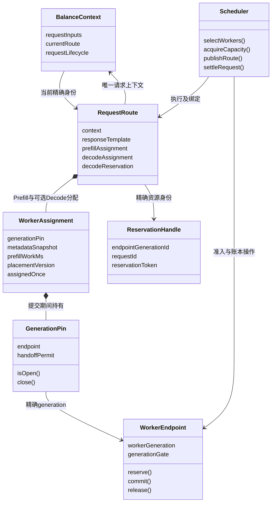

# 请求与 Worker 分配的所有权设计

更新：2026-10-08。当前方案替代 `49604284fc` 的 RoutingResult / RequestRoute 两种过程表示；
`b28a71bfd6` 的测试专用工厂清理继续保留。旧方案与验证历史可在上述提交查看。

## 1. 从业务关系确定对象

请求需要将各角色分配到精确的 Worker generation，并在取得容量后关联精确的资源身份。
选择、预留和提交是 Scheduler 执行的操作；不为每一步创建一个保存相同分配事实的对象类型。

| 对象 | 保存的独立事实 | 行为边界 |
| --- | --- | --- |
| BalanceContext | 一次请求的固定输入、当前精确路由身份、请求生命周期和响应选择 | 保留现有原子变更与锁约定；不保存第二份 Worker 选择数据 |
| RequestRoute | 请求与完整 Worker 分配的关系，及可选 Decode reservation 的精确身份 | GroupPlanner 输入和响应投影；不维护提交阶段、发送阶段或资源释放进度 |
| WorkerAssignment | 单个请求角色对应的 Worker generation，冻结的角色元数据、预测工作量、placementVersion | 持有 generation pin；一次消费校验；不预留或释放 Decode / Prefill 账本资源 |
| WorkerEndpoint | 多个请求共享的一个 Worker generation 及其资源操作能力 | generation 校验、准入、账本提交及资源释放 |
| Scheduler | 各次操作的执行与交接责任 | 选择、预留、复验、提交、回滚与后续通知；不复制 Worker 分配事实 |

WorkerAssignment 的 metadata 在创建时复制冻结，导出 DTO 时再复制。
角色、requestId、group、hitCache 等内部查询直接读取冻结事实，不从公开的可变 Response 反推身份。
WorkerEndpoint 从 assignment 的精确 pin 导出，不另存一份 endpoint 引用。

## 2. 可落地的类图

RequestRoute 的 responseTemplate 是供前端输出的私有 DTO 模板。
它不承担 Worker 身份、资源阶段或实际账本状态的判断；成功响应导出时只深拷贝一次。

## 3. 唯一事实与必要的能力保护

已删除：

- RoutingResult 类及所有 Java 引用。
- RequestRoute 重复保存的 Prefill / Decode Endpoint、复制的角色 metadata、hitCache 字段。
- 独立保存的 RoutingResult.requestId；请求身份来自冻结的 Context 输入。
- SelectedRole 类名，以及 SELECTOR / ROUTING_RESULT / CLOSED owner 枚举。
- PrefillReservationAttempt 同时捕获两个路由表示的字段；只保留实际提交的 RequestRoute。
- 响应先导出拷贝、再成功化拷贝的连续两次深拷贝。

WorkerAssignment 保留一次消费的 AtomicBoolean；GenerationPin 的 permit 保留开放状态。
这两项约束分别回答“同一个能力是否已分配”和“generation 能力是否仍开放”，不能合成 finished。
WorkerAssignment.close 不维护第二个关闭状态，只委托底层幂等 permit；关闭不修改资源账本。
元数据在 pin 关闭后仍可读取，取得已关闭的 pin 或再次消费会被拒绝。

## 4. 容量取得、精确身份与交接

DefaultRouter 返回 RequestRoute（其 decodeReservation 尚为空），请求的 Worker 分配已经固定。
取得 Decode 预留后，`RequestRoute.create` 用同一份 WorkerAssignment 和模板引用构造携带精确 reservation 的路由值。
两个值使用同一类型，Worker 分配事实不被复制，也不通过可变字段补写 reservation。
只有最终绑定的精确路由身份用于队列、发送和异步回调；旧回调不能通过 requestId 越过身份校验。

保持新的不可变路由身份，是为了固定“这一组 Worker + 这一个 reservation”的对应关系。
它不代表新调度阶段，也不维护新的提交标志。真实请求阶段仍只在 Context，真实资源状态仍只在 State。

| 资源或责任 | 提交前 | 交接生效后 | 结束条件 |
| --- | --- | --- | --- |
| generation pin | QUEUE Plan / DIRECT 局部作用域持有完整路由的 pin | 同一作用域继续持有到操作退出 | close 仅释放 pin，不释放请求账本 |
| Decode 待回滚责任 | QUEUE Plan.pendingDecodeRollback / DIRECT 方法局部句柄 | 交接点立即清空待回滚引用，交给原有请求清理协议 | 未交接由 finally / try-with-resources 回滚 |
| Decode 真实资源事实 | DecodeState | DecodeState | 精确释放、Worker 终态或相应远端释放证明 |
| 请求响应与终结 | BalanceContext | BalanceContext | 响应唯一选择与资源完成分别判断 |

QUEUE 的交接点仍为 offerPinned 成功；DIRECT 的交接点仍为非空 DeliveryClaim。
确认、唤醒或 pin close 失败不能倒退已经生效的交接。
取消 ACK、远端释放证明、发送退出、请求终态保持原来的独立语义。
未调整锁顺序、DispatchGate、RUN_AGAIN、取消重试和超时协议。

## 5. 功能与遗漏检查矩阵

| 事件序列 | 必须保持的结果 | 现有回归依据/实施后补充 |
| --- | --- | --- |
| 第 N 个角色选择失败、完整分配构造失败 | 所有已取得 pin 都释放；无预留泄漏 | DefaultRouterTest / WorkerAssignmentTest；invalidResultConstructionLeavesPinOwnershipWithTheSelector |
| 取得 Decode 预留后 RequestRoute 构造失败 | 预留回滚，两个 pin 都释放，原异常保留 | routeConstructionFailureRollsBackCapacityAndClosesPins（QUEUE/DIRECT） |
| 普通获取与抢占接收之后再尝试提交 | 使用同一精确结果，禁止再次获取或覆盖预留 | conflictingPreemptionResultDoesNotOverwriteOrReleaseExistingCapacityTwice / queuePublicationRetainsCapacityAcrossWakeFailureAndRepeatedConsumption |
| QUEUE 提交前取消 | bindRoute 拒绝；预留释放；不入队 | RequestContextLifecycleTest / GlobalQueueProgressTest |
| QUEUE 入队后取消、通知异常或 pin close 异常 | 已生效绑定不撤销；准备方不回滚交接资源 | DefaultRouterTest / RequestContextLifecycleTest |
| DIRECT Prefill 满、发送额度满或 commit 失败 | 各自释放未交接资源；不发布成功响应 | DirectAdmissionContractTest |
| DIRECT Prefill 已提交但 DeliveryClaim 未取得 | 开放准备能力被关闭；已提交账本走既有请求终结 | cancellationAfterPrefillCommitRejectsClaimAndSettlesBothLedgers |
| Engine 终态早于绑定、ACK 或响应发布 | 后续事件不能覆盖终态；沿用响应竞争与清理规则 | DirectAdmissionContractTest / DeliverySettlementTest |
| RPC 已调用但结果未知 | 不按 NOT_SENT 释放；保留清理责任 | DeliveryClaimTest / DeliverySettlementTest |
| 抢占结果即刻完成或来自其他线程 | 决策线程消费一次；结果接收失败只释放一次 | GlobalQueueProgressTest / DefaultRouterTest |
| 抢占期间 cancel/shutdown，结果随后成功 | 等待结果结算，释放返回资源再关闭 pin及配额 | GlobalQueueProgressTest |
| 接收校验失败或 markQueued 抛异常，释放也失败 | 保留 primary/suppressed 规则，继续释放其他资源 | DefaultRouterTest；conflictingPreemptionResultDoesNotOverwriteOrReleaseExistingCapacityTwice |
| blocker 的 placementVersion 改变 | 新一轮全量选择，不在旧选择上继续抢占 | GlobalQueueProgressTest |
| 旧选路回调、旧 generation、旧 token | 精确身份阻止修改新绑定 | DeliverySettlementTest / RequestTerminalSettlementTest / RequestContextLifecycleTest |
| 前端不 fetch、响应已完成但 Worker 未终结 | 请求响应与资源终态分离；期限/远端清理路径继续执行 | RequestLifetimeTest / RequestInactivityTest / DeliveryClaimTest |
| 清理运行期间又到终态 | 保留 RUN_AGAIN 等现有执行责任，不遗漏新事实 | DeliveryClaimTest.runningCleanupStillAcceptsANotificationAndPreventsEarlyShutdown；保留运行期间再通知与 shutdown 的受控交错 |
| State 清理与请求资源操作并发 | State 解锁后进入请求；禁止反向持锁 | EndpointCleanupDeadlockTest |
| BATCH/NON_BATCH 的准备与提交并发取消 | 保留请求复验、资源账本复验、DispatchGate 顺序 | RequestDeliveryLockContractTest / BatchDeliveryStrategyTest / RouteDeliveryStrategyTest |

目标实现的完成标准：上述每项有实际执行证据；请求响应一次；本地责任、permit、pin、
操作配额在相应结束条件下归零；远端仍可能持有的资源继续可追踪。生产减量以最终 diff 为准。

## 6. 本轮验证记录

最终 UT 与远端性能结果记录在本轮 evidence 文件。
新增验证覆盖 metadata 原始对象 / 嵌套 DebugInfo / 导出 DTO 的修改隔离，
未消费能力在 pin 关闭后被拒绝，以及响应模板不受前端修改影响。
现有构造失败、回滚失败、抢占冲突、唤醒失败、提交后取消、旧回调和独立 JVM 死锁用例继续执行。
测试结果只证明实际覆盖的事件序列，不等同于所有并发交错的形式化证明。

独立提交候选：API reactor 2,172 例（0 failure、0 error、1 个既有 skip），mock-engine 14 例通过。
共 2,186 例，含现有 5 个独立 JVM 死锁用例。提交候选只包含本轮分配模型，未包含其他 agent 的投递事务改动。
生产 sync 从 101 文件 / 24,492 行收敛到 100 文件 / 24,432 行，净减少 60 行。

远端 750P/750D、3,000 / 10,000 QPS，10 秒预热、10 秒测量，使用
`-Xms64g -Xmx64g -XX:+UseZGC -XX:+ZGenerational -XX:+AlwaysPreTouch`。
独立候选四个场景均通过 QPS ≥ 98%、服务端/客户端/批等待 P99 < 50ms：

| 模式 | 目标 QPS | 客户端 P99 | 服务端 P99 |
| --- | ---: | ---: | ---: |
| BATCH | 3,000 | 11.921ms | 11ms |
| BATCH | 10,000 | 23.019ms | 17ms |
| NON_BATCH | 3,000 | 0.757ms | <1ms |
| NON_BATCH | 10,000 | 0.736ms | <1ms |

中间混合源码曾出现 81.505ms 客户端 P99，成功及失败记录均保留。
不能将最终通过归因于某一处拷贝删除，也不能由这些短窗口宣称长尾稳定消除。
结果只针对上述明确 JVM 配置；没有修改生产默认 JVM 参数或放宽门槛。

[本轮实施证据](evidence/worker-assignment-model-2026-10-08.json) 包含前后版本、源码摘要、失败轮次与验证范围。
