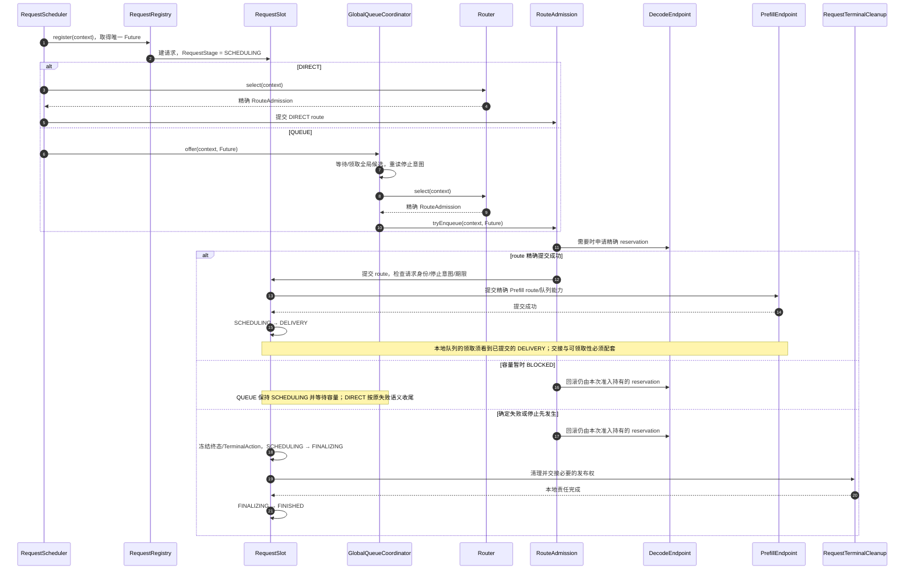
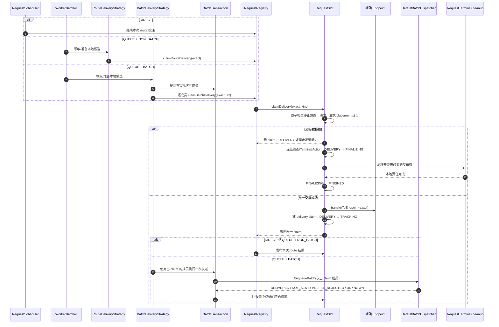
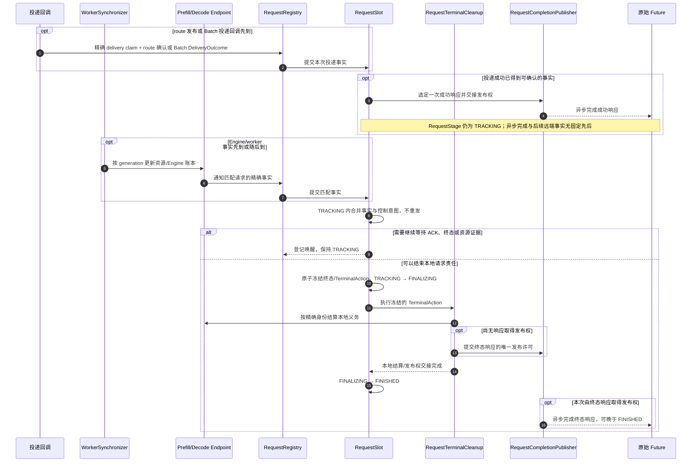
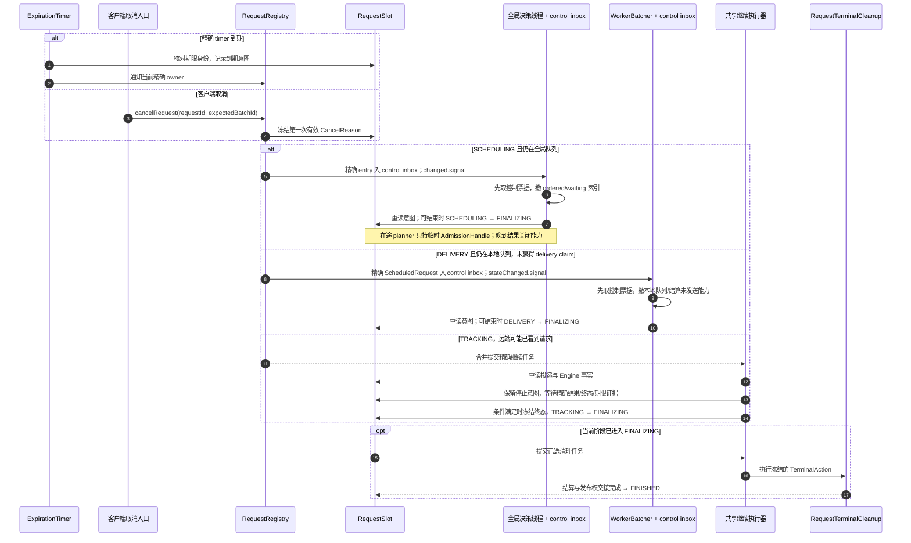
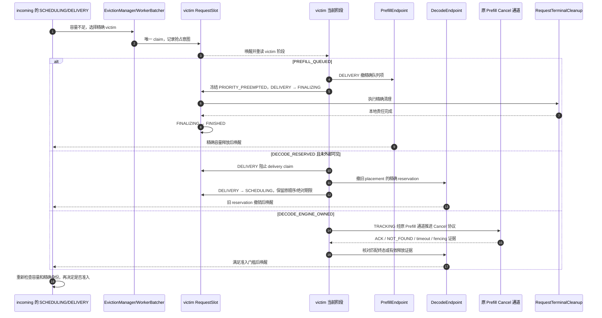

# 请求阶段的类时序与状态转移

状态：目标设计，尚未实施。图中的类名取自当前代码，箭头描述迁移后的职责，不表示这些调用现在已经只写控制意图。`RequestStage` 只由精确 `RequestSlot` 写入；图中其他对象保存各自的队列、资源或批次事实。实线箭头是执行/提交，虚线箭头是结果或唤醒。等待中的请求没有常驻线程。

## 1. 注册、选路与放置：SCHEDULING → DELIVERY

DIRECT 提交后在同一调用链继续 DELIVERY；QUEUE 在 Prefill 本地队列等待。RouteAdmission 只管理本次尚未交接的 pin/reservation，失败时只回滚自己仍拥有的能力。路由/容量变动引起的重新选择留在 SCHEDULING，不创建新请求阶段。

## 2. 本地投递：DELIVERY → TRACKING

图中的 DIRECT route 发布由现有 `RequestScheduler`/`RouteAdmission` 调用，QUEUE NON_BATCH 由 `RouteDeliveryStrategy` 调用；BATCH 的真实发送权只归 `BatchTransaction`。`claimDelivery` 是停止意图与外部可见交接的单一仲裁点。交接后若停止意图才到，TRACKING 按远端可能可见处理；只有精确结果证明 `NOT_SENT`，才按未发送收尾。`UNKNOWN` 不回 DELIVERY，不重发。

## 3. 外部事实与退出：TRACKING → FINALIZING → FINISHED

终态可先于 ACK，此时若成功响应尚未赢得发布权，进入 FINALIZING 时可选定终态响应。FINALIZING 已提交不可中断的终止决策：迟到取消、超时和抢占不能改判；迟到 ACK 只能补所属账本事实或推动未完清理。不能用 `Future.isDone()` 判断发布权：已选响应可能还在异步队列。FINISHED 表示本地义务与发布权按协议交接，远端仍未知的资源继续由原 endpoint generation 的账本负责。

## 4. 超时或客户端取消：控制入口只记录，当前阶段执行

timer/cancel 不直接撤队、释放资源、调用 Engine Cancel 或完成 Future。控制票据在队列锁下入 inbox 并 signal；全局决策/WorkerBatcher 睡前检查 inbox，醒来先按精确身份撤队，**不等队尾或容量等待请求被正常排序选中**。阶段交接检查仍未消费的停止意图，新 owner 对旧票据不依赖；投递 claim 的原子检查也直接读取当前时间，避免 timer 延迟触发让过期请求继续发送。`Runner` 只做 TRACKING/FINALIZING 的请求继续，不进入两个排队索引。

## 5. 抢占：incoming 提交意图，victim 主流程结算

抢占发起方设置 victim 的控制意图，不替 victim 执行撤队、释放或 Engine Cancel。一个 victim 同时只能有一个抢占 claim。ACK、普通 NOT_FOUND 和 RPC 超时都不能单独证明 Decode 容量已释放；incoming 不因 victim 状态变化直接取得资源。普通客户端取消不走 Engine Cancel 协议。

## 实施时逐点核对

| 交接点 | 状态转移 | 必须同一边界确认的事实 |
| --- | --- | --- |
| route 提交 | SCHEDULING → DELIVERY | 请求仍有效、精确 endpoint 能力已交接、本地队列不能抢跑 |
| delivery claim | DELIVERY → TRACKING | 停止意图/当前时间、精确身份和 endpoint 责任一次仲裁 |
| 未发送的 Decode 撤回 | DELIVERY → SCHEDULING | 无外部 delivery claim、旧 reservation 精确撤销、原顺序/期限保留 |
| 投递确认 | TRACKING 内无阶段变化 | 可赢得唯一成功响应发布权，随后继续跟踪 Engine 事实 |
| 终态选择 | SCHEDULING/DELIVERY/TRACKING → FINALIZING | 终态和 TerminalAction 同时冻结；后到控制事件不能中断或改判，不能覆盖已选成功响应 |
| 本地完成 | FINALIZING → FINISHED | 清理义务及必要的终态响应发布权已交接，远端未知账本仍归原 endpoint |

现有代码中 `RequestSlot.cancelRequest`、`ExpirationTimer` 回调和 Prefill 排队抢占仍可能直接触发清理或资源替换；上图是迁移后的目标边界。改代码时应沿这些实际入口逐步迁移，不能在旧写入口旁增加一套可写 RequestStage 并长期双写。
