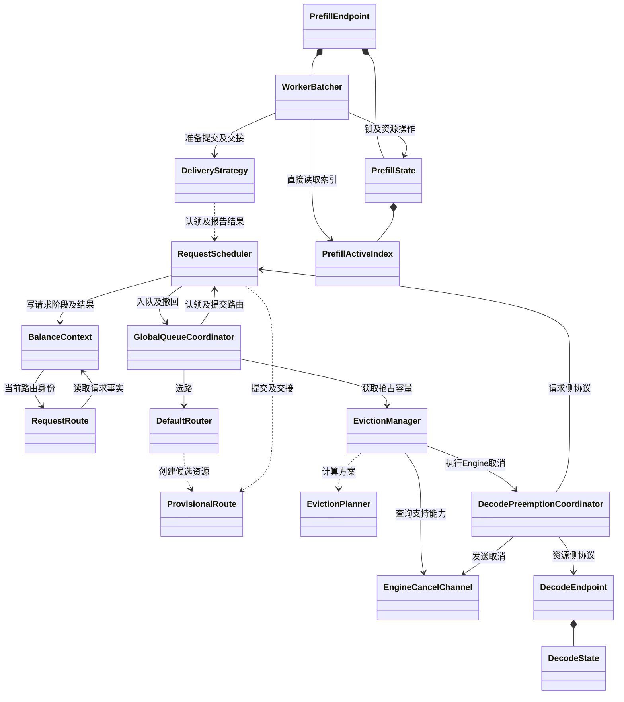
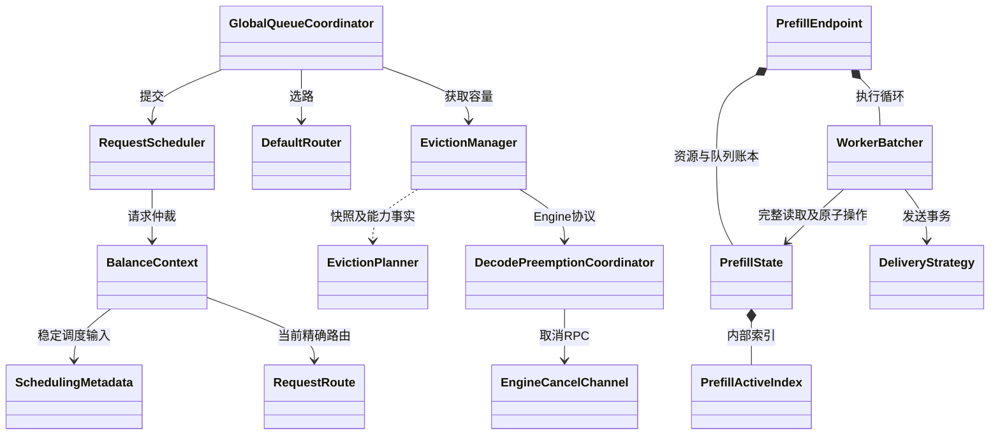
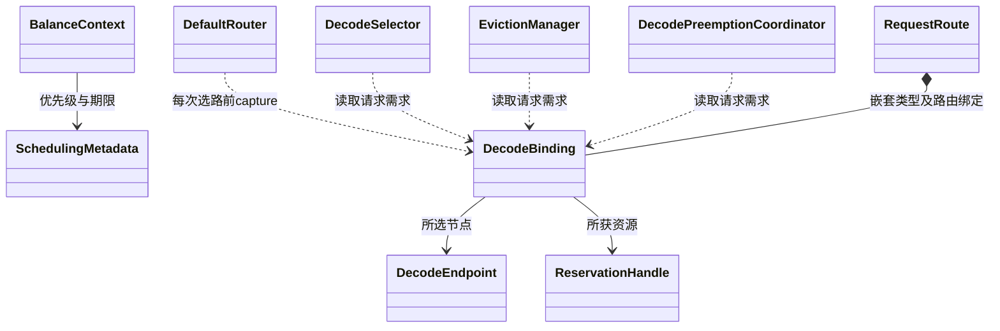
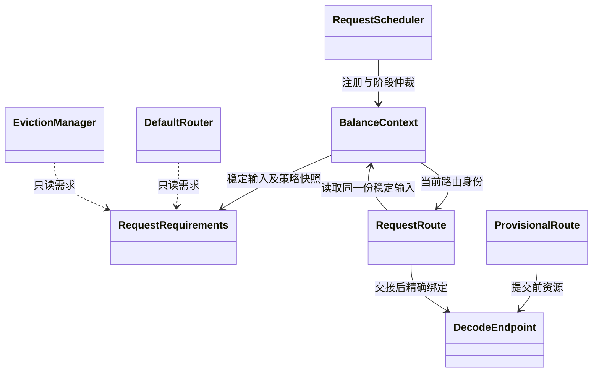
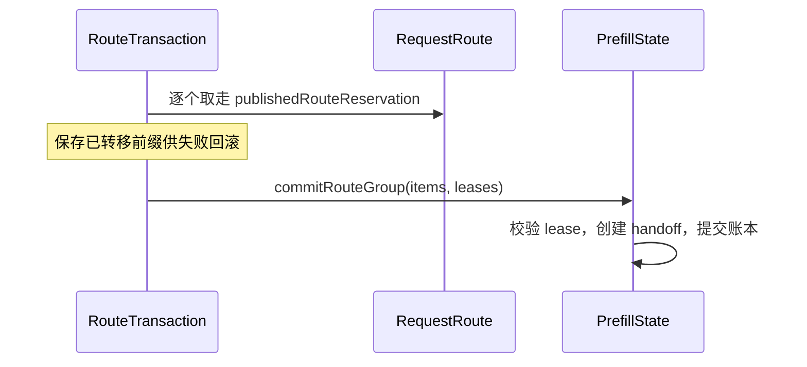
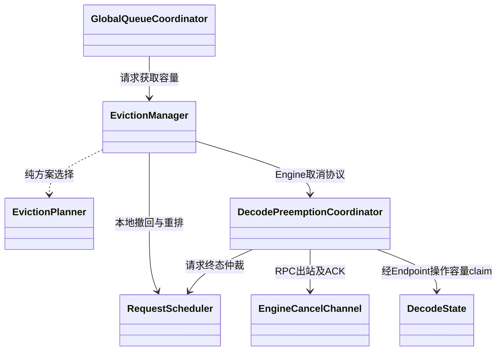
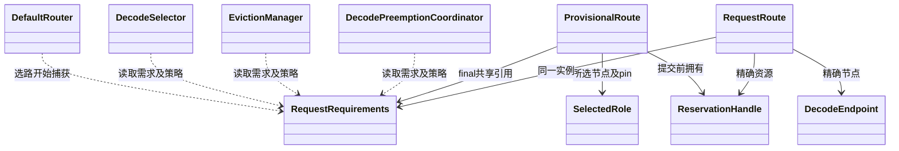
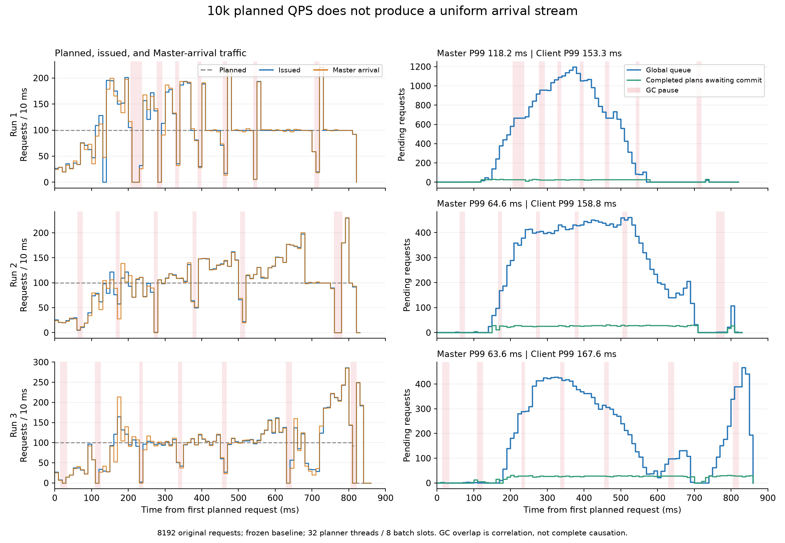

# 当前调度类结构：问题与改进顺序

2026-09-25，按当前源码重新核对。除明确标注已实施的部分外，其余接口为建议。
sync 生产 Java 为 **26,398 行**，距离 25,000 行还差 1,398 行。
历史推导见 ownership-class-diagram.md；其中已实施或撤回的建议不应再作为待办。

## 1. 当前结构

箭头表示依赖，组合表示创建并拥有；省略指标、配置和返回路径。

不能仅凭双向箭头合并类。Scheduler 与全局队列分别控制请求生命周期和排队；
Context 与 RequestRoute 分别代表整个请求和某一次路由，旧路由回调必须有独立身份。

## 2. 不自然的边界与审查结论

### A. Endpoint 自己拼装账本快照的一致性规则（已实施收敛）

证据：PrefillEndpoint.isCurrentProjection 分别读取队列、调度输入和资源三个版本；
captureProjectionSourceUnderLock 再拼一次版本，随后读取 snapshotUnderLock 和 activeIndex.isEmpty。
Endpoint 因而必须知道 State 的所有失效来源和内部索引。

改进：State 提供一次原子捕获，返回现有 Snapshot、三个版本和 activeEmpty；
并提供对应的版本匹配操作。Endpoint 保留预测器、投递策略、投影缓存与锁外物化，
删除本地 ProjectionVersion 和逐字段版本拼装，去掉投影路径对 activeIndex 的直接访问。
版本可以纳入既有 Snapshot，具体实现优先避免再加包装对象。

三个版本不能合成单一版本：其更新来源及失效语义不同。activeEmpty 必须直接在锁内读取，
不能为了判断为空而物化整条队列。保持现有锁外 volatile 版本快查、锁内复验及共享缓存。

已实施：State.snapshotUnderLock 同时捕获 ProjectionVersion 与原快照；
State.isCurrentProjection 统一匹配。空状态直接通过同锁捕获的 Capture.isEmpty 读取，
没有新增 activeEmpty 字段。Endpoint 删除本地版本拼装、匹配及全部 activeIndex 直接访问。
ProjectionSource 物化后仍清空 ownership，仅保留不含请求引用的版本对象。

WorkerBatcher 的 captureHead、snapshotActiveQueue、等待谓词也直接依赖索引；
但共享锁服务于 Condition、controlInbox、精确队首判断和提交复验。
三路审查后，暂不把“隐藏 Worker 的全部索引和锁”列为首改项：
尚未证明可删除整个等待协议，逐 getter 包装会增加间接层。
**State 不接受投递事务，不回调 DeliveryStrategy。**

### B. 阻塞结果有两条传递通道（已实施收敛）

证据：Scheduler.enqueueRoute 返回 PlacementResult.blocked(key)，
ProvisionalRoute 同时保存可变 blockedEndpoint；GlobalQueueCoordinator.commit
先读 publication.blocker，再读 admission.blockedEndpointChanged / blockedEndpoint 决定救援。
一次阻塞事实需要两个对象共同说明，容易在修改分支时遗漏同步更新。

改进：以现有 PlacementKey 为唯一阻塞结果，由它匹配 Admission 已持有的 SelectedRole，
取得精确 endpoint 并比较原捕获 placementVersion。删除 blockedEndpoint 字段、重置和赋值，
无需扩充通用 PlacementResult 或新增结果类。
必须按角色与 endpoint 联合匹配，保留所选 generation，不能只用地址。
容量版本已变化时仍 REPLAN，不得直接发起抢占。

已实施：blockedEndpointIfCurrent 接收返回的 PlacementKey，匹配原 SelectedRole，
比较原捕获版本与精确 endpoint 当前版本；变化返回 null，GQC 进入 REPLAN。
旧可变字段、重置和赋值已删除，两个 key 构造共用同一方法。

### C. 输入的冻结时点分散，类型按阶段兼职

证据：Context 的 request、schedulingMetadata 可通过公开 setter 替换；
GlobalQueueCoordinator.offer 固定 priority / routingGroup；DefaultRouter.select 每次 capture DecodeBinding；
RequestRoute 构造时再固定过期时间、队列身份及投递配置。
DecodeBinding 同时包含请求输入和 status / endpoint / reservation 三个选路结果。

当前生产入口设置一次输入，尚未据此证明真实重试会改变优先级；问题是类型约束没有表达这个约定。
同一请求的“稳定输入”和某次选路的“资源结果”在类图上混为一个对象。

改进：以注册为边界，明确哪些输入必须固定、哪些配置允许重读；优先扩展已有
SchedulingMetadata 表达稳定调度输入。Context 保留该输入，路由对象保存选中节点及精确资源。
逐项迁移后删除重复 capture、输入回退与可替换入口，不能只新增 RequestInput 再保留全部旧字段。
原 Request 对象的内部可变性也必须纳入检查，仅移除 Context setter 不足以冻结它。

首次 Worker FIFO 时间和序号仍在原首次路由创建时点生成，不能提前到注册。
RequestRoute 构造器写 Context 的问题已经修复，本轮不重复列为待实施项。

### D. 纯规划器依赖完整取消通道（已实施收敛）

证据：EvictionPlanner.planDecode 接收 EngineCancelChannel，但只调用
`isSupported(ep.endpoint())`；实际 RPC 在 DecodePreemptionCoordinator。
生产 GrpcEngineCancelChannel.isSupported 当前恒为 true，接口和测试仍表达不支持分支。

已实施：Manager 在同一端点快照下查询能力，将布尔值交给 Planner；
Planner 只消费资源快照、策略和能力事实，删除 Planner → CancelChannel 依赖。
Manager 保留能力查询依赖，没有向 Coordinator 增加纯转发方法，也没有新增 CapabilityService。
保留原短路顺序：只有策略允许 Engine victim 时才查询所选 endpoint 的能力。
保留策略关闭及通道不支持的语义，不能因为生产实现恒 true 就删掉所有能力约束。

EvictionManager 和 DecodePreemptionCoordinator 暂不整类合并：前者选择本地撤回或 Engine 取消，
后者处理异步 ACK、终态证据及资源隔离。后者没有与 Manager 对称的 shutdown 生命周期；
目前不能声称合并可删除“两套关停”。只有发现并能删除具体的命令适配或重复执行流程才再合并。

## 3. 目标职责图

这是职责方向，不要求新增同名类或抽象层；省略返回值、回调和实际保留的共享锁。

## 4. 实施顺序与完成标准

| 顺序 | 改造范围 | 必须实际删除 | 验证重点 |
| --- | --- | --- | --- |
| 已实施 | State 原子提供投影输入及版本 | Endpoint 本地版本拼装及投影路径的直接索引访问 | 三类失效、空队列判断、并发缓存物化、锁外预测；热路径改动按范围跑性能 |
| 已实施 | 阻塞结果只通过 PlacementKey 传递 | Admission.blockedEndpoint 可变字段及其更新 | 双角色同地址、旧 generation、容量恢复后 REPLAN、抢占准入 |
| 3 | 请求稳定输入与本次路由结果 | 经契约核实后的重复冻结、替换入口与回退 | 重试输入一致、FIFO 时点、旧路由隔离、配置更新语义 |
| 已实施 | Planner 的取消能力依赖 | Planner 对完整 RPC 通道的依赖；Manager 保留查询入口 | 能力开关、不可行原因与方案选择保持一致；本地测试 |

前三路独立审查分别核对了请求模型、Worker 并发边界及抢占结构；上述优先级已吸收审查结论。
第 1、2 项有明确可删除机制，第 3 项需先核实输入契约，第 4 项依赖更清晰但减行收益小。
没有证据保证剩余调整足以净减 1,604 行，不按类合并数量预估收益。

保留：请求阶段、投递事实和清理义务的区别；请求侧抢占登记与资源侧 claim 的独立生命周期；
ACK 与资源释放的区别；DIRECT 所需账本；投影缓存及 O(1) 容量计数。
结构审查之后已实施 B，生产净减 5 行。本地专项 103/103 通过；
日志 `/tmp/flexlb-blocker-verified-tests.log`。本次未跑远端性能，性能门槛仍未通过。

随后实施 A，生产净减 2 行。投影专项与真实 Worker 队列回归共 159/159 通过，
三个独立 review 无阻断；日志及边界说明见 ownership-class-diagram.md 第 18 节。

## 5. 再从类图检查：输入、资源、执行是否放对位置

本节为本次只读审查结论，尚未实施；不能把建议图当作当前源码。

### 5.1 最明显的不自然依赖：选路之前依赖选路之后的类型

源码依据：RequestRoute.java:176–217 的 DecodeBinding 同时包含请求 ID、优先级、
KV 需求、容量策略、成本公式，以及 status / endpoint / reservation；
DefaultRouter.java:58 在选路前创建后三项全空的对象，ProvisionalRoute 再 bind 所选节点与资源。
RequestRoute.java:135–157 的通用请求属性也从这个 Decode 类型读取。

这造成两种不自然关系：

1. Selector、抢占规划入口依赖“选路完成后对象”的嵌套类型；其实只需要不可变需求。
2. 一个类型同时表达“尚未选择”“已选节点”“已获资源”，每次 bind 都复制请求字段。
   无独立 Decode 的 PDFUSION 请求也要通过它读取请求 ID 和优先级。

**建议优先收敛这一处，而非再建立 RequestInputService 或增加协调层。**

- 请求 ID、优先级、期限、输入长度、期望长度属于请求输入，由 Context 保存稳定值。
- Decode 容量、模式和成本公式属于请求采用的调度策略快照，不能随普通重试无意重读。
- status / endpoint / reservation 属于本次路由结果，由 ProvisionalRoute 在提交前拥有，
  RequestRoute 在交接后保留精确引用。
- 可以将现有 DecodeBinding 的输入部分改成 sync 内的不可变需求值，Context 持有同一份；
  路由结果放回已有路由对象。必须同时删除旧混合类型及 capture/bind 复制链，不能两套并存。
- SchedulingMetadata 在 common 模块，只适合通用元数据；不能为了字段集中，
  让 common 反向依赖 sync 的 DecodeEndpoint.AdmissionCapacity 或 DecodeCostFormula。

建议职责关系如下，`RequestRequirements` 仅表示改造后的输入值，不是新增执行服务：

落地前必须核实配置对象是否可原地修改、重试是否允许采用新配置。
ConfigService 返回的 FlexlbConfig 是可变共享对象；当前重试会重新读取 Decode 策略，
因此提前冻结策略可能改变热更新行为，必须用明确契约与重试测试决定。
SchedulingMetadata 虽是不可变值，Context 上的引用仍可被 setter 替换；注册边界须封住替换。
不能只删除 setter 就声称 Request 已不可变；必须让调度读取稳定值，审查原 Request 的内部修改。
注册冻结也不能提前 Worker FIFO 时间：首次 Worker 路由创建才分配时间与序号。

### 5.2 Worker 的问题是共享内部结构，不能靠增加 getter 层解决

当前 PrefillEndpoint 创建 PrefillState 与 WorkerBatcher；WorkerBatcher 又直接持有 State 的
PrefillActiveIndex（WorkerBatcher.java:265），并在 captureHead / snapshotActiveQueue /
等待谓词 / commitUnderLock 中共同维护读取、复验和提交协议。

目标边界是：Worker 决定何时规划、何时提交，State 原子维护队列与资源。
如果把一次完整的队首捕获或提交复验移入 State，应同时删除 Worker 对索引布局的了解；
只有新增同名转发方法，没有减少跨类规则，不算结构改善。
State 不应接受 DeliveryStrategy.Transaction 或调用发送逻辑，否则又把执行者塞进账本。
当前尚未证明整块协议可以删除，不把隐藏所有锁与索引作为本轮直接实施项。

#### 一个更具体的可删候选：Route 提交拆成了两次所有权转移

RouteDeliveryStrategy.java:240–264 先逐成员从 RequestRoute 取走 publishedRouteReservation，
保存 transferredReservations 前缀计数，再调用 State 提交；失败时 :293–307 依据该计数关闭前缀。
PrefillState.java:984–1055 又在同一资源锁内校验精确 lease、创建 handoff 并提交资源账本。

建议将 QUEUE 的 item 句柄校验及转移纳入 State 的一次锁内提交，事务只接收最终 handoff。
预期删除 transaction 的 transferredReservations、逐成员取走循环和前缀回滚分支，
而不是把这段补偿原封不动搬到 State。

这是有明确删除目标的结构候选，尚未证明可直接实施：必须检查所有取走句柄的路径，
尤其 Worker 停止后的清理，并将可能失败的校验及分配放在所有权修改之前。
DIRECT 没有 item 发布的 lease，不能强行套用 QUEUE 前置条件。
验证多成员第二项失败、取消与 stop 竞争、DIRECT，以及容量/句柄不泄漏也不重复释放。
State 只接收精确 item 与 lease，不接收投递事务或回调执行逻辑。

### 5.3 抢占类图应标清三种所有权

- Planner：只计算牺牲哪些请求，不执行取消。
- Manager：准入检查，选择本地替换或 Engine 取消路径。
- Coordinator：取消出站、ACK、终态等待与失败收尾。
- DecodeState：精确 reservation、KV 与 victim claim，在资源锁下更新。
- RequestScheduler：请求响应、阶段与终态，在请求锁下仲裁。

证据：EvictionPlanner.java:84–108；EvictionManager.java:59–101；
DecodePreemptionCoordinator.java:101–285；DecodeState.java:717–817、840–965；
RequestScheduler.java:2334–2402。
请求可能先结束，Engine 容量仍待确认，因此双侧状态不能合并为一个 terminal 布尔值。
取消 ACK 也不能释放全部容量。这里只画经 Endpoint 的依赖，不建议 Coordinator 绕过 Endpoint。

Manager 和 Coordinator 都依赖取消通道并不自动构成重复职责：前者查询能力，后者发 RPC。
新增 Coordinator.supports 转发方法只改变图的形状，本次不采纳。

### 5.4 下一轮改造的验收尺度

| 优先级 | 改造 | 必须删除的旧机制 | 验证 |
| --- | --- | --- | --- |
| 结构主线 | 请求稳定需求与本次路由结果分开 | DecodeBinding 混合状态、重复 capture/bind 输入复制、已无用途的回退入口 | 重试输入一致、配置语义、PDFUSION、旧路由回调隔离、FIFO时点 |
| 同轮小清理 | ProvisionalRoute 请求 ID 只读唯一来源 | 与 DecodeBinding 恒等的 requestId 字段和参数 | 错请求绑定继续拒绝 |
| 优先验证可行性 | QUEUE Route 的句柄转移与账本提交合为一个原子操作 | transaction 前缀计数、取走循环与前缀回滚 | 多成员失败、取消/stop、DIRECT、资源守恒 |
| 后续有证据再做 | State 收回完整队列原子操作 | Worker 中对应索引遍历与复验规则 | 丢唤醒、队首变化、取消与提交竞争、锁外预测 |
| 保留职责 | 抢占规划、取消协议、资源账本、请求终态 | 不为类数量减少强行合并 | UNKNOWN、迟到 ACK、终态先到、generation隔离 |

公开生产工厂仅供测试和工具调用是 API 边界问题，但把它们搬到测试目录不作为减行成果。
本轮只更新结构审查文档，未修改生产代码、未执行测试；生产仍为 26,604 行。
没有证据表明上述结构调整能直接达到 25,000 行，也没有新的性能达标结论。

## 6. QUEUE Route 原子交接已实施

生产 26,604 → 26,590（净减 14 行）。State.commitRouteGroup 在资源锁内验证所有成员的
精确 lease；对于 WAITING 的 NON_BATCH 成员同时验证 item 发布的句柄，然后创建 handoff、
移除队列索引、取走句柄并提交账本。DIRECT 的 UNINDEXED 成员不需要发布句柄。

RouteTransaction 删除提前取走句柄的循环、transferredReservations 和失败时的前缀关闭。
RequestRoute 删除对应的 expected-CAS 取走重载；原观察器由 State 用于提交前校验。
State 未引用 DeliveryStrategy.Transaction，也没有新增执行层。

原两个 mock 事务测试改由真实 State 与真实 RequestRoute 测试覆盖第二成员无句柄或
绑定错误句柄：失败后第一成员句柄、等待队列和未提交状态保留，修复输入后同一组可提交；
提交后句柄清空，关闭旧 lease 不释放已提交容量，真实终态最终释放资源。

本地两组共 127/127 通过：
- `/tmp/flexlb-route-atomic-tests.log`：91 项，队列、Route、State 快照及容量。
- `/tmp/flexlb-route-atomic-boundary-tests.log`：36 项，DIRECT、退休、清理所有权及死锁边界。

本轮为局部提交协议收敛，按用户要求仅跑本地回归，未运行远端性能。
之前远端性能门槛仍未通过，本轮不据单测推断性能达标。

三个独立 reviewer 分别核对并发、职责设计与测试覆盖，均未发现阻断。

最终将取走句柄与 commitIndividual 合并为一次遍历，复用 entry；最终源码重新通过 127/127，
日志 `/tmp/flexlb-route-atomic-verified-tests.log`，三个 reviewer 也已复核最终循环。

## 7. 输入与路由资源拆分已实施

生产 26,590 → 26,583（净减 7 行，含新增 RequestRequirements.java 的全部行数）。
删除 RequestRoute.DecodeBinding，替换为不持资源的不可变 RequestRequirements。
Selector、抢占 Manager/Coordinator 只接收需求值，不再依赖 RequestRoute 的嵌套资源类型。
ProvisionalRoute 复用 SelectedRole 的节点与 status，只另外持有尚未转出的 reservation；
删除重复 requestId。RequestRoute 直接冻结最终 Decode status、endpoint 和 reservation。
同一 RequestRequirements 实例贯穿选路、准入和路由对象，不再 bind/复制整份输入。
reserveDecode 后只保存句柄，删除原 bind 对象分配的异常补偿。

本轮保持 DefaultRouter.select 的原捕获时点，因此不是“注册后全生命周期冻结”完成：
每次重选仍读取当次配置；Context 的 setter 与 fallback 尚待收敛。第 5 节混合类型图为改造前依据，
下面是当前实际依赖：

公开工厂仍在初始化 FIFO 之前拒绝空需求与另一请求的 reservation；新增真实 Context 测试
确认这两种非法输入都不会改变首次 Worker 入队时间和序号。
跨请求错误句柄由真实 DecodeEndpoint.reserve 的构造契约保证不会产生；若自定义实现违约，
后续工厂仍拒绝该句柄，外层 ProvisionalRoute.close 负责回滚。

本地完整 API reactor：1,663 通过、1 跳过，日志 `/tmp/flexlb-requirements-regression.log`。
该全量运行后前置了工厂校验并增加测试，最终源码另跑专项，结果另记。

最终专项 79/79 通过：`/tmp/flexlb-requirements-verified-tests.log`；三个独立 reviewer 无阻断。
当前源码已在指定远端 luoli_gpu 运行默认配置性能测试，475 个 Java 文件运行前后 SHA 一致。
Master P99 796 ms，门槛 250 ms，测试失败；环境正常，没有环境阻碍。
详见 evidence/remote-performance-2026-09-24.md 的输入/资源拆分段。

## 8. 终态流程及投影复制复查：排除两种未经证实的简化

RequestScheduler.processRequestEndLocked 的 Decode 退休分支不能直接合并到
processPendingEventsUnderPreemptionLocked 的普通终态分支：后者必须更新 Decode 抢占账本，
前者在 endpoint 已退休时直接结算。取消 API 与调度期限回调也分别有 batch、首次取消、
精确定时器身份和 delivery claim 约束；本轮没有删掉这些分支。

列表复用实验虽通过 72 项单测和三路功能审查，远端顺序对照 P99 为 812/905 ms，
收益没有得到支持，已撤回。当前生产与实验前相同（26,583 行）。
后续不继续凭这一份少量 planner 样本声称 copyOf 是主瓶颈；需针对实际全局选路及
Worker 等待阶段获取更直接的吞吐/耗时证据。详见远端性能文档的未保留实验。

## 9. Worker 私有结果类型的不可达校验已删除

BatcherCycleResult 仅有 capacityBlocked、awaitingSchedulingChange、simple 三个私有构造入口。
前两者固定 placementCapacityChanged=false 且要求非空 request；simple 固定 request/unavailable=null。
因此 compact constructor 的“两类状态不可混用”检查不可能失败；删除该重复校验，保留工厂入参约束。
队首身份、queue/input 版本、容量监听、超时与 stop 等待路径均未改。
生产 26,583 → 26,574（净减 9 行）；本地专项 88/88，三个独立 reviewer 无阻断。
日志 `/tmp/flexlb-cycle-constructor-tests.log`，基线 `/tmp/flexlb-before-cycle-constructor.java`。
本轮按局部改动只跑本地回归，远端仍是此前 26,583 行源码；没有新的性能结论。

## 10. 注册后调度元数据固定为唯一来源

注册在 Context monitor 内补齐缺失 SchedulingMetadata，再建立注册身份（第 38 轮删除独立 registeredRequestId，以原始 RequestFuture 标识）。
Context 的元数据 setter 在同一 monitor 下拒绝注册后的不同引用（包括 null），同引用幂等。
正常 API 入口原本已提供元数据，不改变其优先级、PrioritySource 和绝对期限。
内部无元数据上下文按原 getter 的 priority/expiry 固定一次；注册后不再因 Request.priority
或 Context.startTime 修改而改变调度事实。

GlobalQueueCoordinator.offer 删除独立 priority 参数，仅接受 context；排序键继续按原规则
归一化，保留 0→默认优先级行为。GlobalQueueEntry 的归一化排序值仍保留，不能直接用带
零哨兵的请求值替换。未注册对象 getter 的兼容回退仍存在，Request 内部和 Decode 策略尚未冻结。

本轮生产 26,574 → 26,583（增加 9 行），用于建立注册后不可变约束，不作为减行成果。
没有新增状态字段/执行类；后续输入收敛必须以这一约束为依据继续删除重复机制。
完整 API reactor 1,664 通过、1 跳过：`/tmp/flexlb-metadata-freeze-regression.log`。
最终新增测试后专项 102/102：`/tmp/flexlb-metadata-freeze-verified-tests.log`。
三个 reviewer 无阻断；基线 `/tmp/flexlb-before-metadata-freeze/`。
本轮局部注册边界改动未跑远端性能；当前本地源码与远端源码不同，不能仅按相同行数判断一致。

## 11. 取消指标入口合并

生产 26,583 → 26,565，净减 18 行。RequestSchedulerReporter 将三个同构上报方法
合为 CancelEvent 与 reportEngineCancel，保留原指标名、标签、优先级来源和上报时点。
本地专项 29/29 通过：`/tmp/flexlb-cancel-metric-tests.log`；三个独立 reviewer 无阻断。
这是局部重复代码清理，不能解决状态交接复杂度；未运行新的远端性能测试。

## 12. Worker 候选捕获收回 State

生产 26,565 → 26,533，净减 32 行（包含 State 新增接口）。删除 Worker 的 QueueHead、
captureHead、ActiveQueueSnapshot、snapshotActiveQueue，以及第二套队首/KV 校验。
State.captureQueue 一次锁内捕获有界有序成员、总队列大小、前缀最早入队时间与两个版本；
Worker 只消费该快照，等待仍复验队首与版本，提交仍验证精确身份、期限及资源所有权。
窗口判断仅在总 size 小于 maxRequests 时使用 oldest，此时快照覆盖全队列。
KV 检查仍先于尾部过期项清理；预测后容量复验保留。

没有新增严格的提交时优先级门槛：快照后插入更高优先级请求时，已有候选可能继续，
原实现第二次捕获后也存在同样竞态；此次可能扩大该时间窗。
等待窗口或 KV 不足时现在也分配候选列表，不能声称分配成本下降。

新增 PrefillStateSnapshotTest 覆盖有界顺序、前缀年龄、独立版本更新与旧快照不变性。
专项 111/111；最终完整 API reactor 1,667 通过、1 跳过，含新增测试：
`/tmp/flexlb-queue-capture-regression.log`。三路审查已核对功能、并发与测试；
具体性能证据见远端文档。默认性能前后 P99 910/630 ms，均未通过 250 ms 门槛。
单次顺序对照且 offered QPS 不同，不作为因果性能提升结论。
基线 `/tmp/flexlb-before-queue-capture/`。

## 13. Route 前缀预测删除重复计算

RouteDeliveryStrategy.newGroupPredictor 原本每次 append 都重新预测全部 prefix，
n 个被访问成员执行 n(n+1)/2 次单请求预测。改为每次 selection 独立累计 added，
执行 n 次预测；GroupPlanner 保证按序追加，超预算尾项后立即结束选择。
Evaluator 是不可变模型快照，seqLen/hitCache 已冻结；累加顺序及有效性验证保留。
新增测试比较五种预算下与全前缀参考结果相等、成员至多计算一次、新决策归零。

生产增加 2 行至 26,535，属于计算复杂度改进，不作为减行成果。
三个 reviewer 无功能阻断；测试 review 要求补充首项超预算用例，已加入 budget=4。
按小改动本地测试要求，本轮未同步或运行远端；上轮远端 BATCH 测试不覆盖此 Route 路径，
不能用于推断本次端到端收益，整体 250 ms 性能门槛仍未通过。
基线 `/tmp/flexlb-before-route-prefix.java`；最终测试日志 `/tmp/flexlb-route-prefix-final-tests.log`。
最终专项 43/43 通过，包含新增首项超预算用例。

## 14. 删除投递许可的请求身份副本

EngineDispatchPermit 删除未使用的 requestId 字段、构造参数及 getter；底层 DispatchLease
仍保存并校验精确请求身份。唯一构造点及 dispatch/release/退休行为不变。
生产净减 8 行至 26,527。完整 API reactor 1,672 通过、1 跳过，三个 reviewer 无阻断。
日志 `/tmp/flexlb-permit-identity-regression.log`；基线 `/tmp/flexlb-before-permit-identity.java`。
本轮没有远端同步或性能测试，性能门槛仍未通过。

## 15. Cache 指标复用本次上报的不可变标签

EngineHealthReporter.reportCacheStatusCheckerSuccess 将重复构造的节点标签与角色标签
各固定为一次局部分配；标签维度、指标值、条件和上报顺序保持，两个缓存数值仍在首次
缓存指标上报前读取。没有新增字段、类、全局缓存或执行层。
生产 26,527 → 26,512，净减 15 行。新增 populated/empty 两分支完整 schema 断言。
最终专项 23/23：`/tmp/flexlb-cache-tags-final-tests.log`。
基线 `/tmp/flexlb-before-cache-tags.java`；本轮局部改动未运行远端性能。

## 16. 抢占规划快照去掉活 Endpoint

DecodeEndpointSnapshot 删除 endpoint 字段。纯规划器现在只接收节点标识、容量策略、
资源使用与不可变候选列表；静态 capture 仍在原时点从 Endpoint 捕获数据。
Manager 用已有 selectedEndpoint 参数做退休与取消能力检查，与原快照内引用完全相同，
不按地址重查，后续精确 generation 的资源提交不变。
生产净减 1 行至 26,511；主要收益是移除规划输入中的可执行对象引用。
专项 59/59：`/tmp/flexlb-pure-snapshot-tests.log`。
基线 `/tmp/flexlb-before-pure-snapshot/`；本轮未运行远端性能。

## 17. 五处线程工厂采用 Java 21 标准实现

RequestContinuationExecutor、RequestCompletionPublisher、GlobalQueueCoordinator、
ExpirationTimer、WorkerEndpoint 使用 Thread.ofPlatform().daemon().name(...).factory()，
删除手写 ThreadFactory 回调及其专用 AtomicInteger/AtomicLong 序号。
Publisher 从 0 编号，Continuation/Planner/Retirement 从 1 编号，Expiration 保留固定名称。
线程池大小、队列、拒绝策略、预启动、关闭和恢复路径保持。未改为虚拟线程。

生产 26,511 → 26,478，净减 33 行。完整 API reactor 1,674 通过、1 跳过：
`/tmp/flexlb-thread-factories-regression.log`。三个 reviewer 无阻断。
审查新增实际线程测试验证名称、daemon/platform 及 InheritableThreadLocal 继承，另行专项验证。
基线 `/tmp/flexlb-before-thread-factories/`；本轮没有远端性能运行，性能门槛仍未通过。

## 18. DeliveryClaim 不再复制 Context 中的投递身份

DeliveryClaim 删除 slot、kind、correlationId，仅保留精确 RequestRoute 和 completeCalled。
Context 从 final item.ctx 取得，kind/batchId 在 Context monitor 下读取。二者生产唯一写入点
是 claimDelivery，前提 READY_TO_DELIVER + NONE；成功后进入 DELIVERING，无重置到待投递的路径。
Context 不可重新注册，旧 claim 仍通过 exact item 和活跃阶段校验拒绝晚到事实。
外部 expectedBatchId 校验保留，重复完成及 ROUTE/BATCH 类型约束也保留。

本轮生产净减 8 行至 26,470。完整 API reactor 1,675 通过、1 跳过：
`/tmp/flexlb-delivery-claim-regression.log`；基线 `/tmp/flexlb-before-delivery-claim.java`。
未同步远端或运行性能，性能门槛仍未通过。

三个 reviewer 未发现本次改动的阻断问题。审查新增同一 item 不能再次移交的真实边界测试；
最终专项 19/19 通过，日志 `/tmp/flexlb-delivery-claim-contract-final.log`。

## 19. 超时入口只执行一次锁内决策

RequestScheduler.decideInactivityLocked 改为返回锁外动作，统一选择继续失败清理或执行终态动作。
删除 enqueueInactivityDeadline、expireInactiveRequest、claimDelivery 中的 cleanup 布尔值和二次分流；
投递 ACK 路径继续传递原抢占终态通知。过期清理决定保持粘性，后续 Worker 活动不能撤销。
定时器精确身份检查、finally rearm、admission 暂存及前端结果仲裁保持不变。
生产 26,470 → 26,459，净减 11 行。基线 `/tmp/flexlb-before-inactivity-effects.java`。

本轮同时否定“没有 CleanupProgress 就直接返回”的删除方案：BATCH 普通终态会保留部分
Prefill 账本，迟到的明确投递失败仍需按 exact item 清理；请求终态不等于批次资源已结算。
不能把这个分支误判为重复 cleanup。单纯将它拆成另一个函数尚未证明能降低整体复杂度。

本轮完整 API reactor：1,676 通过、1 跳过，日志 `/tmp/flexlb-inactivity-effects-regression.log`。
并发、设计、测试三路审查无阻断；现有测试覆盖粘性过期、旧定时器、重新挂载、投递前期限和迟到 ACK。
`git diff --check` 通过。本轮局部改动仅本地回归，未同步远端或运行性能；最近远端
仍为 26,533 行版本，P99 630 ms 未通过 250 ms 门槛，不能视为当前源码性能验证。

## 20. 抢占执行状态审查：本轮未实施合并

重新通读 DecodePreemptionCoordinator 的 setup、ACK、终态等待和 abort，独立设计审查得出：

| 机制 | 必须维护的事实 | 不能使用的替代来源 |
| --- | --- | --- |
| ClaimDisposition | 本地取消是否跨过 outbound 边界、是否已交给后续协调 | RequestScheduler 的协议推进可能失败，不能反推是否发过 RPC |
| terminalCompletion | recordTerminal 完成后才允许聚合等待继续 | 直接等待 terminalObservation 会与更新 disposition 的回调竞态 |
| AttemptCapability.closed | commit 后不再 abort，同一尝试只 close 一次 | victim 完成状态不能代表 incoming reservation 已提交 |
| endpointBegun | beginPreemption 是否成功，是否需要 abort | 有请求侧 claim 不代表已有 endpoint 事务 |

REQUEST_FENCED 还可直接记录 terminal；不能把 disposition.TERMINAL 简单替换成
terminalCompletion.isDone。ACK 等待与终态等待有先后且独立的时间预算，不能在安装 observer
时就对所有 child future 设置同一超时。没有据此证明可删除完整状态机制，本轮不做表面合并。

同时静态核对 balance 下只出现一次的 public/protected 方法：activePrefillDeliveryStrategy
是 Spring 装配入口；closeAdmissionAndAwaitMutations 和 reserveUnqueued 有测试调用。
reserveUnqueued 表达 engine-facing shadow，不能当作普通 queued reserve 等价替换；
不把测试构造代码搬出生产目录来计减行收益。该扫描仅筛选候选，不构成全仓死代码证明。

下一处应检查 WorkerBatcher 与 PrefillState 共同执行的提交边界：Worker 持 queueLock 后
调用 transaction.commitUnderLock，再操作 State.removeSelectionBoundaryUnderLock 和 activeIndex。
需要以整个原子提交操作为单位确认边界，逐个 getter 包装不能消除这种依赖。
当前生产仍为 26,459 行；本轮无生产或测试代码变更，没有新的性能结论。

## 21. 抢占待确认事实不再复制投递身份

PreemptionRegistration 只保留 pendingDeliveryConfirmation，删除 pendingConfirmationBatchId
及 getter。登记只来自已验证精确 DeliveryClaim 的确认入口；Context.batchId 在首次投递交接时
唯一写入，后续抢占不创建新的路由身份。恢复确认时因此无需再传同源 batchId。
进一步删除 acknowledgeDeliveryLocked 的 expectedBatchId 参数，以及仅该函数调用的四参
ownsDeliveryClaimLocked 重载；原调用对 kind/batchId 都是同源自比较。
保留有效条件：当前 item、活跃精确路由、无 finalOutcome；外部 matchesBatch 校验不变。

生产 26,459 → 26,446，净减 13 行。基线 `/tmp/flexlb-before-preemption-confirmation.java`
与 `/tmp/flexlb-before-preemption-confirmation-scheduler.java`。本轮没有远端性能运行。

最终专项 108/108 通过：`/tmp/flexlb-preemption-confirmation-final-tests.log`。
测试审查随后补充真实 Scheduler 的抢占期间 ACK 暂存/NOT_FOUND 恢复测试，DecodeEndpoint
使用 mock 控制资源侧归还结果；确认原 batchId 发布和错误 batchId 查询拒绝。
最终测试类 16/16 通过：`/tmp/flexlb-preemption-confirmation-boundary-tests.log`，
编译产物晚于最终测试文件修改时点。并发、设计与测试三路 review 无阻断。

## 22. 无到期的收集窗口不重复规划

投影中的 GroupPlanner.plan 先选择成员，再由时间判断 readiness。窗口推进到 deadline
且严格早于整个冻结队列最早 expiry 时，成员、顺序、probe 位置和预测输入都未变化；
直接复用 plan/planning，用推进后的时间计算 readyInMs。到达 expiry（含相等）继续走
原 prune/replan。earliestExpiryMs 不移除已消费前缀只会保守地多重算，不会漏清理。
没有新增缓存、字段、执行层或等待状态。生产 26,446 → 26,445，净减 1 行，主要收益
是省去一次成员选择、预测和 planning cursor 创建；不足以完成总行数目标。
基线 `/tmp/flexlb-before-window-replan.java`；投影/分组专项 85/85。
远端默认 P99 746 ms，仍未达标，详见性能证据文档 14:22 段。

三个 reviewer 无阻断。审查补充真实 ROUTE projection 的计数测试，验证无到期窗口只规划
一次、恰在截止时到期仍拒绝、预测预算达到上限无需等待。最终专项 86/86：
`/tmp/flexlb-window-replan-final-tests.log`。新增测试晚于远端源码归档，本地最终生产与远端
测试生产相同；远端运行未包含这条新增测试。`git diff --check` 通过。

## 23. 过期事实从唯一队列槽位推导

ProjectedQueue 保留有序数组、前缀游标、probe rank 和惰性 expiry heap；全量 removeIf
会在多窗口多到期时反复扫描，不作为等价性能替代。
删除 ExpirationPrune record、两个本地到期布尔值及外层初始 head 的 sticky 更新。
pruneExpired 直接返回 probe 槽是否已清空，initialHeadDisposition 读取初始 head 槽。
已消费的槽在 prefix 消费与后续 heap 到期过程中都不清空，因此不会误标已完成的初始 head；
只有消费前到期才清空槽并持续表示 TERMINAL_PRUNED。没有新增字段或层。
生产 26,445 → 26,426，净减 19 行。基线 `/tmp/flexlb-before-prune-result.java`。
投影/分组专项 86/86：`/tmp/flexlb-prune-result-tests.log`；本轮局部推导替代未跑远端性能。
最近远端 26,445 行版本 P99 746 ms，仍未通过 250 ms 门槛。

三路 review 无阻断。现有测试覆盖已消费前缀后成员到期、初始 head 消费前到期、probe 到期；
没有新增镜像测试。`git diff --check` 通过。

## 24. 清理重入改为循环（已实施）

RequestScheduler.cleanUpRequest 的 RUN_AGAIN 原来递归重进完整清理方法，
同步补跑次数会增加调用栈。现改为同一循环，每轮重新读取精确路由、清理进度与过期事实。
保留 RUN_AGAIN→PENDING 的锁外交接窗口；其他线程取得执行权时仍只登记补跑并退出。
已结清端点不会重复调用；清理记录已移除时仍允许迟到失败结算旧精确路由。
异常统一累计并保留首因，多轮 suppressed 从递归嵌套改为平铺。

生产代码净增加 1 行至 26,427，本轮收益是删除递归控制流，不是行数下降。
三路审查无阻断。新增真实抢占释放重入与首轮异常组合用例；最终专项 89/89 通过，
日志 /tmp/flexlb-cleanup-loop-final-tests.log。小范围清理改动未重跑远端性能；
最新远端 P99 746ms 仍未通过 250ms 门槛。

复核没有证明终态 releaseEndpoints 与投递失败 cleanUpRequest 可以合并：
前者按终态证据释放，后者允许未知 Engine 所有权继续等待。
另外 WORKER 来源为 PREFILL_ENDPOINT 时不能简化掉 releasePrefill 的来源判断。

## 25. Worker 状态代际检查与回调收敛（已实施）

GrpcWorkerStatusRunner.handleStatusResponse 原在新版本与同版本两个分支重复处理
已提交 WorkerStatus 丢失精确 Endpoint 的情况。现将该检查前置到版本分支之前：
alive、Endpoint 缺失且 cursor>=0 时统一退休；首次 cursor=-1 仍允许创建。
进入同版本分支的 responseVersion 已被证明大于零，所以共用 cursor>=0 门槛等价。
原新版本缺失 Endpoint 的异常文案统一为同版本的文案；退休、失败指标与锁边界不变。

新版本状态与同版本心跳只会产生一个投影回调，删除 activityProjection 局部变量及第二次
执行，统一在原锁外 finally 执行 statusProjection，然后完成可能的代际退休。
没有合并新版本账本更新和心跳活跃事实这两种不同操作。

生产净减 13 行至 26,410。新增 responseVersion=1/2 的参数化用例，验证已提交 cursor=1
且 Endpoint 缺失时不重建代际；已有 cursor=-1 初次创建用例保留。
三路审查通过，专项 49/49 通过（/tmp/flexlb-status-boundary-tests.log）。
小范围同步边界改动未重跑远端性能，性能门槛仍未通过。

完整回归还发现并修正了第 37 轮接口收敛遗漏的测试反射签名：
RequestLifecycleTestSupport.acknowledge 不再传递已删除的 batchId，唯一调用方同步更新。
发布线程测试改为先等待依赖 Future 再等待原 Future；本机 JDK 21 的 timedGet 在完成后
会调用 postComplete，原等待顺序可能让主测试线程协助执行 thenApply，干扰线程断言。
测试审查确认新顺序仍能检测生产同步 fallback，并未放宽线程约束。
首次完整回归还出现一次容量唤醒用例超时，单独复跑该 39 用例类通过；尚未据此证明超时根因。

最终完整 API reactor 回归：共 1682 项，失败 0、错误 0、跳过 1；
日志 /tmp/flexlb-status-boundary-final-regression.log。容量唤醒用例此次完整回归也通过，首次超时原因仍未定。

## 26. 冗余仲裁条件与容量唤醒复查

RequestScheduler.recordCancellationLocked 与 decideInactivityLocked 删除重复的
finalOutcome 判断：前面的 ownsActiveGenerationLocked 已包含该约束，且全部在同一
Context 监视器内求值。cancelQueuedExternal 删除 admissionPending 中恒真的
(globalControl || local)，前置分支已对两者都为 false 的情况返回。
没有改变 Future 的求值顺序、请求身份判断或任何资源释放规则。物理行数仍为 26,410。

上轮容量唤醒超时用例以 RepeatedTest(30) 连续执行，30/30 通过，日志
/tmp/flexlb-capacity-edge-repeat.log。保留原释放发生于 blocked 返回前的交错和所有
请求顺序/尝试次数断言，没有增加超时或降低断言；仍不能宣称首次超时根因已经消除。

30 次重复仅用于一次性诊断，测试恢复原 @Test，保留钩子强制交错。

失败行重新核对：此前超时位于 RequestSchedulerTest:827 的 awaitIndependentCommit，
第 825 行队首 future 等待已返回，不能将失败直接归因于队首容量重试丢失。
CapacityFixture.createRequest 原仍对运行中的共享 lifecycle.enqueueRoute 增加 stub；
现统一在调度器启动前配置 Answer，通过 ConcurrentMap 发布完整的请求私有数据。
备用 Worker 测试原也动态改写共享 router/enqueueRoute，现用 volatile 不可变
AlternativeRoute 一次发布该请求的新 route/item，Answer 保留精确身份判断与原 endpoint
尝试次数语义。消除了测试夹具的并发 stubbing 风险，但未证明它就是首次超时根因。

冗余条件专项 156/156 通过（包含一次性 30 次容量重复诊断），日志
/tmp/flexlb-redundant-guards-tests.log；恢复普通 @Test 并完成夹具调整后的最终
RequestSchedulerTest 39/39 通过，日志 /tmp/flexlb-capacity-stubbing-final-tests.log。

## 27. 选路资源交接与清理边界（2026-09-25）

`RouteAdmission` 更名为 `ProvisionalRoute`，`ScheduledRequest` 更名为 `RequestRoute`。
前者拥有本次选路的 generation pin 和尚未交出的 Decode reservation；后者标识一次精确的
Worker 分配，创建时尚未提交，提交后承接容量与后续回调身份。BalanceContext 仍记录整个请求，
RequestScheduler 执行阶段变化；没有增加管理层或第二份请求状态。

| 时点 | ProvisionalRoute | RequestRoute / Endpoint |
| --- | --- | --- |
| 选中 Worker | 拥有 pin，后续取得 Decode reservation | 尚未绑定请求 |
| 创建 RequestRoute | 仍负责失败回滚 | 只有精确身份，尚未拥有容量 |
| QUEUE offerPinned 成功 | 交出 Decode reservation 的回滚责任 | 队列接收精确 route，Scheduler 推进 READY_TO_DELIVER |
| DIRECT commit + claimDelivery 成功 | 交出 Decode reservation 的回滚责任 | Endpoint/发送 claim 接收容量及发送责任 |
| 选路作用域退出 | try-with-resources 关闭 pin；仅未交接时回滚 Decode | 已交接容量依据后续精确证据清理 |

删除提交过程中关闭 pin 的行为，避免将 pin 清理异常误判为发布失败。
commitRoute 的 finally 只撤销失败 publication 的绑定；阶段推进和唤醒发生在发布成功之后，
其异常不能再触发 publication rollback。pin 的作用域由现有 try-with-resources/Plan.close 结束。

新增异常测试在本轮旧实现下均失败：pin 关闭错误发生在 offerQueued 内；通知错误导致尝试
回滚已提交绑定并追加错误 suppressed。改后针对性 141 项通过。
日志：`/tmp/flexlb-route-ownership-baseline-tests.log`、`/tmp/flexlb-route-ownership-tests.log`。
这些测试证明本地交接与回滚边界，不证明性能改善。

性能目标更新为 **Master P99 < 50ms**；默认 burst 和 engine matrix 的 Master 上限同步收紧。
最近远程测量仍为旧代码 P99 746ms，本轮尚未复测，不能视为达标。

完整 API reactor 回归：1685 通过、1 跳过，日志 `/tmp/flexlb-route-ownership-full-tests.log`。
设计和测试 review 通过；并发 review 推动进一步收紧 DIRECT 作用域：先关闭选路 pin，
再结束 AdmissionHandle 并发布响应，避免同步响应回调延长 pin 生命周期。
原 DIRECT 成功测试增加 pin.close 先于 publishRoute 的顺序断言。
最终作用域调整及清理异常修复后针对性 161/161 通过：`/tmp/flexlb-route-ownership-final-tests.log`。
本轮 sync 生产 Java 26,414 → 26,410（减少 4 行），重点为所有权与异常边界收敛；尚未达到 25,000 行目标。

并发 review 在收紧作用域后发现：已取得 DIRECT delivery claim 时，pin.close 异常会截断
publishRoute。现仅在已成功交接后记录清理异常并继续发布，未成功交接的异常仍向上传递。
DIRECT 成功测试同时覆盖正常关闭和 pin.close 抛错，验证成功响应、无 Decode 回滚与关闭顺序。

## 28. 取消与调度期限共用执行流程（2026-09-25）

RequestScheduler 原 cancelRequest 与 onSchedulingDeadline 各自执行一遍记录取消、选择队列
通知或本地终止、锁外通知与清理。本轮收敛为同一 cancelRequest 流程：API 提供 batch 身份，
timer 提供精确 RequestDeadline；没有新增状态、DTO、线程或执行层。

保留两种入口的差别：API 使用 expectedBatchId=0 通配，已经取得 delivery claim 时忽略
DEADLINE；timer 原子消费精确句柄、要求请求仍 open，但 admission 尚未结束时仍可记录到期。
两种入口均按原顺序在锁外通知全局 owner、本地 owner，再执行已取得的终止动作。
API 直接比较同锁 batchId，删除仅用于 matchesBatch 的临时 RequestState 快照。

新增参数测试覆盖 admission 与 delivery claim 短暂重叠窗口：timer 记录并暂存到期事实，
显式 DEADLINE 不记录，两者均不会夺取在途 admission 的清理责任。
专项 139/139 通过，日志 `/tmp/flexlb-cancellation-flow-final-tests.log`。
设计、并发和测试三路 review 通过。本轮生产 Java 26,410 → 26,398，净减 12 行。

本轮同时复核 Prefill/Decode 释放流程与可疑无用 API：Prefill 的 status、终态、orphan 已共用
settleUnderLock；Decode 本地回滚、NOT_SENT、EXPIRED、Engine 终态的释放证据不同，不能仅因
代码形似而合并。方法引用及 Spring 生命周期入口也已计入调用审查，不据文本调用数删除。
这不是全目录逐函数审计完成的声明；25,000 行与 P99<50ms 目标仍未达成。

完整 API reactor 复跑：1688 通过、1 跳过，日志
`/tmp/flexlb-cancellation-flow-full-recheck.log`。首轮完整回归的
FlexlbGrpcForwarderAsyncTest.monitoringFailureCannotLoseOrDuplicateTheResponse 因本地 gRPC
UNAVAILABLE 未取得成功响应；该类独立复跑 12/12 通过，再次全量通过。
未修改该测试或生产转发实现，首次连接失败原因仍未证实。
本轮按小范围改动运行本地功能验证，未远程重跑性能，不能据此声明 P99 改善。

## 29. 注册输入、选路资源与队列所有权（2026-09-25）

本轮以前一轮 26,398 行为基线，处理用户列出的五项。当前 sync 生产 Java 为
26,415 行（净增 17），RequestScheduler 3,204 → 3,190，WorkerBatcher 1,157 → 1,106。
这是职责与输入一致性的调整，不能算作 25,000 行目标完成。

- `RequestScheduler.register` 在发布 Context 前只捕获一次 `RequestRequirements`。
  请求 ID、优先级、Decode 需求与策略、输入长度、apiKey、缓存键及块大小固定；缓存键复制为不可变列表。
  Prefill、Decode、分组匹配及 recent-key 统计共用这些值；分组策略规则仍可动态更新。
- `BalanceContext` 持有请求输入、唯一 Future、首次 Worker 排队时间和序号、期限与当前阶段。
  `RequestRoute` 只持有该次选路的节点、资源句柄和投递身份；删除 requirements、enqueuedAtMs、
  enqueueSequence、expiresAtMs 副本。`ProvisionalRoute` 删除需求引用，只保留精确请求 ID 与待交接资源。
  旧回调仍须匹配精确 RequestRoute/投递身份，不能仅按 requestId 结算新路由。
- `RequestScheduler` 删除重新捕获输入的 createRequestRoute 重载，以及 ACK/抢占 Worker 终态中
  已被前置条件覆盖的检查。没有新增事件转发层；取消 ACK 与资源终态继续各自提供结算证据。
- `PrefillState` 接管完整队列快照、空选择边界复验、提交后队列收尾、等待谓词与诊断计数。
  Batcher 删除索引字段及直接索引操作；State 的公开 activeIndex 出口也删除。
  Batcher 仍拥有控制消息、容量订阅、Condition 和投递事务，State 不依赖 DeliveryStrategy.Transaction。
- NON_BATCH 的预算规划已算过累计前缀，completion 复用当前或前一前缀的 long 值。
  前一前缀用于预算超限剔除末项；不通过 double 转换恢复耗时，保留饱和加法。
  该优化只覆盖 NON_BATCH + FIXED_WINDOW + 正预测预算，不能推导 BATCH 性能改善。

三路 review 检查了冻结发布、旧回调身份、抢占判定和等待/唤醒协议。
Review 发现 recent-key 统计仍读原 Request，已改为冻结输入并增加原列表被修改的回归。
新增测试覆盖注册后 DTO/缓存键变动、重试共享输入，以及投影调用次数、预算回退和大整数精度。
最终回归和远端 A/B 结果见本节后续记录；不得以之前版本的全量结果代替最终版本验证。

最终完整 API reactor：**1693 通过、1 跳过**（0 failure/error），日志
`/tmp/flexlb-five-items-verified.log`。其中 sync 1242 项通过。`git diff --check` 通过。

远端使用指定工作目录及 `luoli_gpu`，JDK21；基线为本轮开始前的 Java/POM 快照，
两侧使用相同的性能测试配置。首次编译发现远端残留已删除的 RouteAdmission/ScheduledRequest，
已备份到容器 `/tmp/flexlb-obsolete-source-20260925` 后清理，随后重新完成 A/B。
最终源码包的前后 SHA256 全量校验保存在结果目录，最终远端恢复为本轮源码。

| 对照场景 | 基线 Master P99 | 当前 Master P99 | 基线/当前 Master QPS | 结果 |
|---|---:|---:|---:|---|
| NON_BATCH / FIXED_WINDOW，8 Prefill + 16 Decode，目标 5k QPS | 25ms | 16ms | 5000.1 / 5018.9 | 两侧通过 |
| 同配置，目标 10k QPS | 16ms | 18ms | 9936.6 / 9962.4 | 两侧通过 |
| BATCH / FIXED_WINDOW，8192 请求突发 | 732ms | 705ms | 5484.5 / 5629.4 | 两侧均未通过 P99<50ms |

NON_BATCH 两侧均设 `flexlb.perf.max-predicted-execution-ms=16000`，用于触发正预算投影路径；
这是测试公式的预算参数，不是生产时延建议。BATCH 使用原始默认配置和吞吐门槛，不放宽断言。
当前 BATCH route_submit P99=362ms、batch_wait=380ms、dispatch_ack=19ms、ack_response=2ms；
阶段分位数不可相加。单次 A/B 只支持这些场景未见明显吞吐退化，不能证明稳定提速或全部性能达标。
完整结果：`/tmp/flexlb-five-items-perf-20260925/`，含 XML、日志、源码哈希和退出码。

尚未达成：sync 25,000 行、BATCH P99<50ms；RequestScheduler 仍需进一步按完整事件流程收敛。
本轮第2/5项只删除已证明冗余的输入捕获重载与事件守卫，没有声称整个调度器已完成简化。

## 30. 退休入口与旧容量查询收敛（2026-09-25）

生产 Java 26,415 → **26,378**，净减 37 行；距 25,000 仍差 1,378 行。

- EndpointRegistry 的 beginRetirement 不再转调第二个公开 detachAndBeginRetirement 入口。
  原两层合为一条完整流程：校验锁与 ACTIVE 身份 → 关闭精确 endpoint gate 并移出路由 →
  登记 detached barrier 与 RETIRING → 锁外发布容量变化 → 返回排空句柄。
  无 endpoint 的状态仍进入 RETIRING。排空等待仍由 completeRetirement 在锁外执行。
- 删除 LayeredAdmissionView.admissionVersion 的零调用转发。
- 删除仅测试使用的 DecodeEndpoint.realKvAvailable 及 DecodeState 独立算法。
  测试直接断言生产使用的 routingView().realKvAvailable；生产路径未改。
  生产容量视图使用既有饱和加法，未引入另一份 KV 算术。

本轮还逐项审查 Scheduler 的取消/同步 Future.cancel、普通释放/失败清理、准入/抢占暂存事件，
以及 Prefill 队列归属、Decode phase/engineLifecycleOwned、三组容量计数及抢占 KV hold。
这些候选存在不同的完成或资源证据，或承担热路径 O(1) 读取；没有为了行数合并不同协议。
这次审查不代表已完成全目录每函数、字段、分支审计。

退休专项 56/56 通过：`/tmp/flexlb-retirement-entry-tests.log`。
三位 review 均未发现阻断；真实 gate/map/代际隔离由 EndpointRetirementLinearizationTest、
EndpointRegistryRoleTest 覆盖，ExpirationCleaner mock 测试仅证明先全部退休再排空的顺序。
本轮为小范围非调度热路径改动，按约定只跑本地测试；上一轮性能结果不作为本版本性能通过证明。

最终完整 API reactor 回归：**1693 通过、1 跳过**，0 failures/errors，
`/tmp/flexlb-retirement-entry-full.log`。本轮目标仍未完成，保留 25,000 行和 P99<50ms 门槛。

## 31. 删除规划器字段适配层（2026-09-25）

生产 Java 26,378 → **26,346**，净减 32 行，距 25,000 仍差 1,346 行。
GroupPlanner.ItemAccess 与 Item/WorkerBatcher 两个只转发 getter 的实例删除。
GroupPlanner.Input 直接声明 enqueuedAtMs/seqLen 两个只读输入，RequestRoute 与冻结的 Item 实现它；
select/plan 不再接收额外字段访问器，泛型约束为 T extends Input。
读取方法、调用顺序、负值归一化、窗口和预算判断均保持原样，没有新增状态或执行层。

测试与热点工具调用一并迁移。routing-hotspots/run.py 在编译旧基线时只补回旧签名的适配参数，
保持 ProjectionDifferential 的工作负载相同；Python 语法检查通过，未把语法检查称为差分运行成功。

专项 128/128 通过：`/tmp/flexlb-planner-input-tests.log`。
完整 API reactor：1693 通过、1 跳过，0 failures/errors，`/tmp/flexlb-planner-input-full.log`。
三位 reviewer 未发现输入、并发发布或测试语义回归。git diff --check 通过。
本轮属于小范围接口简化，按约定本地验证；未运行新远端性能测量，不声明 P99 改善。
25,000 行、BATCH P99<50ms 和全目录逐字段/函数/分支审查均尚未完成。

## 32. 投递结果入口以 claim 为唯一身份（2026-09-25）

生产 Java 26,346 → **26,332**，净减 14 行。RequestScheduler 3,190 → 3,176。
删除 completeDelivery 纯转发；DeliveryClaim.complete 直接消费同一 acceptDeliveryResult 返回的锁外动作。
异步 enqueueBatchDeliveryResult 继续将该动作交给 continuation executor，未改变取证与发布时点。
acceptDeliveryResult 改为私有，只接收 claim/result，从不可变 claim.item.ctx() 获取 Context；
不再接受可与 claim 冲突的第二份请求身份。删除 ownsDeliveryClaimLocked 的恒等身份检查和转发，
保留 ownsActiveItem 对当前阶段和精确 RequestRoute 的复验。
重复 complete 的异常/忽略规则、旧 route 的失败资源清理与 UNKNOWN 等待确认规则未改。
本轮没有合并成功响应与资源终态，也没有合并同步 Future API 与异步投递续处理。

最终专项回归 **352/352 通过**：`/tmp/flexlb-delivery-result-final-tests.log`，覆盖请求生命周期、
批次/直接投递、迟到回调、取消与资源结算。三路 review 均未发现阻断。
本轮没有重跑全量或远端性能；之前的全量/性能结果保留版本边界，不冒充本轮测量。
目标仍进行中：总行数还差 1,332 行，BATCH P99<50ms 尚未达标。

## 33. 领导权关闭信号与重复标志（2026-09-25）

生产 Java 26,332 → **26,314**，净减 18 行。ZookeeperMasterElectService 466 → 448。
删除与 markOffline 同步变化的 autoRejoin；takeLeadership 在通知 observer 之前安装 latch，
offline 无条件先发关闭信号，修复 observer 同步下线时的丢信号；删除每秒轮询和单调用包装。
新增 ZkLeadershipShutdownRaceTest 在旧代码上确定性失败，新代码通过。
包含真实嵌入式 ZooKeeper 选举、会话失效转移的专项 **17/17 通过**，
日志 `/tmp/flexlb-leadership-shutdown-tests.log`；三路 review 未发现新增阻断。
本次没有声称解决既有 markOffline 检查与 isMaster 发布之间的所有短暂交错。

## 34. 注册输入与 Prefill 事件完整流程继续收敛（2026-09-25）

生产 Java 26,314 → **26,291**，净减 23 行；RequestScheduler 3,176 → **3,166**。

- RequestRequirements 在注册时冻结投递模式对应的资源要求和并发批次上限。
  RequestRoute 删除两份每次选路重新捕获的配置字段及 batch-limit 转发 getter；
  BatchDeliveryStrategy 直接读取同一不可变输入，重试不会因后续配置对象变化而漂移。
  原始请求、注册输入与一次选路的 endpoint/reservation 身份继续分离。
- Prefill 事实先在请求锁内核验一次精确 RequestRoute/endpoint 身份，再按事实 kind 处理。
  cleanup 与正常阶段共用 ACTIVE/PRIORITY_CANCELED 分支，删除两个单调用 helper、
  重复身份判断和无用 source 参数。Decode update 同步监听器可能回入，
  因此调用后的资源跟踪身份、精确 preemption claim 与 tryFinish 顺序完整保留。
  Cancel ACK 和资源终态仍使用不同证据。
- WorkerBatcher.commitBoundary 直接消费 PrefillState.QueueBoundary，
  删除第二份 result/removedTerminalBoundary 映射；终态通知仅在 State 已移除边界项后执行。
  State 的队列复验与提交、Batcher 的等待唤醒和锁外回调边界未变。

注册输入回归扩展为 BATCH/NON_BATCH 两种配置，注册后修改源配置，再构造首次及重试 route。
内联 helper 前专项 619/619 通过：`/tmp/flexlb-frozen-input-prefill-flow-tests.log`。
三路 review 均未发现阻断；最终版本完整 API reactor **1695 通过、1 跳过**，无失败或错误。日志：
`/tmp/flexlb-frozen-input-prefill-flow-full.log`。

本轮是局部所有权与事件流收敛，没有修改预测算法、跑新远端 perf 或放宽任何性能门槛。
第 29 节的远端 A/B 仅对应当时源码：NON_BATCH P99 为 16/18ms，BATCH 为 705ms。
它不能用来宣称本轮代码性能通过；BATCH P99<50ms 和总行数 25,000 仍未完成。

## 35. 资源持有与目录事务审计（2026-09-25）

生产 Java 26,291 → **26,260**，净减 31 行。删除五个只读写私有字段或转发单一结果的函数：

- EndpointRegistry.prefillDirectory/publishPrefillDirectory：目录选择与发布直接位于
  mutateEndpointMap 的同一 lifecycleGate 事务。保留预构建目录 → 精确 CHM 更新 → volatile 发布顺序。
  supportsPrefill 仅包括 PREFILL/PDFUSION，因此原发布 helper 的非法 role 分支不可达。
- PrefillState.putRequestUnderLock/openGenerationHandoff：直接使用本类 requests 和 lease.generationHandoff。
  enqueueActiveUnderLock、commitBatchUnderLock 的入口 requireLock，以及 reserveUnqueuedRoute
  的 lock/finally 均保留；原函数没有独立状态变化或约束。
- PrefillAdmissionResources.decodeCapacityFull：在唯一 CAPACITY_FULL 分支直接构造同一拒绝结果。
  Decode permit 未取得，此路径没有回滚义务；构造与异常顺序不变。

本轮同时审查了 GlobalQueueCoordinator 全部字段/函数/分支、EndpointRegistry 发布/退休/关闭流程，
以及两种 DeliveryStrategy 和 PrefillAdmissionResources 的资源持有流程。保留的关键独立职责：

| 代码 | 保留原因 |
| --- | --- |
| GlobalQueueCoordinator.registered | 响应完成前保留原 FIFO 身份，支持路由撤回与 Future 控制 |
| ordered/waiting/inFlight、两个 inbox | 分别表达顺序、容量等待、规划槽、完成计划和优先控制事件 |
| Plan.waitKey/availabilitySequence | 关闭临时资源后仍需停车与防丢容量唤醒 |
| EndpointRegistry 两种 in-flight 计数 | 发布与 detached retirement 在不同的锁外工作阶段排空 |
| Prefill/Decode 目录重建 | 前者替换保持原位置，后者替换追加到尾部，不能直接通用化 |
| Batch/Route transaction phase 与 Member.admissionOwned | 异步批次发送与逐请求移交的关闭边界不同；每个 permit 仅移交一次 |
| Route transaction 的三个只读列表视图 | 从同一 prepared 列表导出各接口需要的精确成员顺序，并非三份可变所有权 |

专项 **300/300 通过**：`/tmp/flexlb-private-flow-tests.log`，覆盖 endpoint 代际、退休、
Prefill 账本、两种投递策略、WorkerBatcher 与 DIRECT 路径。三路最终 review 无阻断；git diff --check 通过。
本轮为小范围内部函数收敛，没有重跑完整 reactor 或远端 perf；第 34 节全量结果仍对应其源码版本。
25,000 行与 BATCH P99<50ms 目标均未完成；此审计不代表其余所有类已逐项完成审计。

## 36. 删除规划结果的第二份容器（2026-09-25）

生产 Java 26,260 → **26,218**，净减 42 行；GroupPlanner 335 → 294。
删除 GroupPlanner.Plan 与 plan/evaluateReadiness 两个入口。
Selection 是唯一成员、资源形状、窗口起点、预测边界和预测值的结果容器；
dispatchReason 只根据该结果、约束和时钟返回发送原因，null 表示继续等待。
预测边界、满批、窗口到期的判断优先级保持原样。

WorkerBatcher 仍在预测结束后读取 now，再复验当前容量，然后准备资源。
RouteTimelineProjector 仍使用冻结的 decisionNowMs；等待时按原 collectionDeadlineMs
公式计算期限，队首或成员过期继续重选。删去每次规划的 Plan 对象及重复校验；
没有声称原 List.copyOf 必然分配新列表，也没有合并不同资源所有权。

完整 API reactor **1695 通过、1 跳过**：`/tmp/flexlb-planning-result-full.log`。
三路 review 发现差分工具对 null reason 的 toString 调用会失败，已改为 String.valueOf，
并实际运行新旧版本差分，未用 Maven 通过代替工具验证。
差分覆盖 2000 组选择、2000 组发送原因/期限、4000 个候选投影：
BLOCKED=40、MODELED=3704、UNAVAILABLE=256，摘要两侧相同：
`95c539579fb16dcd428124e7df3ec488d3b04d7fec751cefbc85b5472157a40a`。
三路 review 的阻断已解决；git diff --check 通过。

### 本轮远端 A/B

按用户指定目录和 luoli_gpu 容器执行，JDK 21，256 个可见处理器。
基线为本轮修改前快照，当前为最终源码；486 份 Java/POM 的运行前、恢复后、运行后
SHA-256 全部通过，且最终本地文件匹配清单。远端保留当前源码。
NON_BATCH 使用 FIXED_WINDOW、正预测预算 16000ms、8 Prefill/16 Decode；
BATCH 使用原默认 8192 请求 burst。所有吞吐及 50ms 门槛不变。

| 场景 | 基线 Master QPS / P99 | 当前 Master QPS / P99 | 门槛结果 |
| --- | --- | --- | --- |
| NON_BATCH 5k QPS | 5002.4 / 30ms | 5001.4 / 18ms | 两侧通过 |
| NON_BATCH 10k QPS | 9964.8 / 33ms | 9928.2 / 12ms | 两侧通过 |
| BATCH burst | 5746.7 / 700ms | 5892.4 / 703ms | 两侧仅 P99 失败 |

单次 A/B 不证明稳定提速。当前 BATCH 的 route_submit P99=353ms、batch_wait=350ms、
dispatch_ack=21ms、ack_response=1ms；这些分位数不能相加。
本次简化没有解决 BATCH 尾延迟，25,000 行目标仍差 1218 行。

结果及源码校验：`/tmp/flexlb-planning-result-perf-20260925/`，归档：
`/tmp/flexlb-planning-result-perf-results.tar.gz`。
首次工具编译缺少 sync 测试类目录，已补正确 classpath 后从基线差分继续；
之前已完成的基线性能测量未重复执行。该问题已解决，不构成外部环境阻碍。

## 37. 规划热点实验：二分插入未通过性能验收，已撤回（2026-09-26）

在第 36 轮 26,218 行源码上重新采集 BATCH JFR。551 个执行采样中 planner 线程 230 个，
ProjectedQueue.create 71 个，其中旧插入位置比较语句附近 54 个；Prefill 批次成员扫描仅 2 个。
依据已有排序快照尝试 upper-bound 二分定位，保留全扫描的过期、重复 ID、队首与最早期限处理。
1024 项含等序/过期的测试证明比较次数降至不超过 11，完整回归和新旧投影差分通过；
但比较次数下降不能证明服务时延改善。

使用指定主机、指定目录、luoli_gpu 容器、JDK 21 原有场景和门槛，执行正反两次 A/B：

| 顺序 / 场景 | 基线 Master QPS / P99 | 二分候选 Master QPS / P99 |
| --- | --- | --- |
| 基线→候选，NON_BATCH 5k | 5008.6 / 25ms | 5029.6 / 63ms |
| 基线→候选，NON_BATCH 10k | 9910.6 / 12ms | 9872.4 / 17ms |
| 基线→候选，BATCH 8192 burst | 5441.9 / 845ms | 5571.9 / 793ms |
| 候选→基线，NON_BATCH 5k | 5034.3 / 21ms | 5106.0 / 38ms |
| 候选→基线，NON_BATCH 10k | 9963.2 / 10ms | 9953.7 / 18ms |
| 候选→基线，BATCH 8192 burst | 6415.7 / 561ms | 5513.7 / 775ms |

所有吞吐门槛通过；BATCH 两侧均未通过 P99<50ms，候选第一次 NON_BATCH 5k 也超线。
交换运行顺序没有证明稳定收益，故从修改前归档精确恢复整个 RouteTimelineProjector 文件。
没有放宽门槛，也不将第二次通过覆盖第一次失败。保留等序项/过期项结果测试，删除比较次数要求。
GroupPlanner 两个只有 `>` / `>=` 的私有函数仍在唯一调用处内联，阈值语义不变。

两次运行分别校验 486 份 Java/POM；新旧均覆盖 2000 次选择、2000 次原因/期限、4000 个候选，
摘要一致：`95c539579fb16dcd428124e7df3ec488d3b04d7fec751cefbc85b5472157a40a`。
实验结果目录：`/tmp/flexlb-probe-search-perf-20260926/`、
`/tmp/flexlb-probe-search-reverse-20260926/`；JFR：`/tmp/flexlb-batch-flow-profile-20260926/`。
这些数据对应已撤回的候选，不能作为最终代码的性能通过证明。

## 38. 请求身份、事件检查与队列边界继续收敛（2026-09-26）

最终生产 Java **26,218 → 26,200，净减 18 行**。距离 25,000 仍有 1200 行。
RequestScheduler 仍为 3166 行；本轮实际删掉两次重复生命周期检查，没有新增转发层。

| 用户指定范围 | 本轮结果及保留边界 |
| --- | --- |
| Context / Router / 单次路由 | 删除 Context.registeredRequestId，ID 只存于 RequestRequirements。原始 RequestFuture 作为注册完成标志；Future 完成后对象类型不变。每次路由的 endpoint/reservation 仍由 RequestRoute 和 ProvisionalRoute 持有，旧路由精确对象隔离保留。 |
| RequestScheduler | 准入开始与投递资格分别删除已被同锁 isOpen 蕴含的 active-generation 检查。投递仍检查当前 Context、精确 RequestRoute、READY 阶段和 claim；准入结算只取一次 CleanupProgress。 |
| WorkerBatcher / PrefillState | Endpoint 直接读取 State.queueDepth，删除 WorkerBatcher.queueSize 转发。完整读取/复验/队列提交已经在 State；prepare 前后复验之间有锁外工作，必须保留两次。 |
| Projector / GroupPlanner | 删除两个私有预算比较函数。热点二分优化已按第 37 节实验撤回；性能验收未完成。 |
| 抢占 | 复核请求、Cancel 协议与 Decode 提交。admission-open 与 commit 前判断有异步间隔，不能当重复决策删除。Cancel ACK 可后续变 UNKNOWN，确认事实与资源终态必须独立。没有为追求行数强行合并。 |

注册去重的第一版将 requirements 非空当作注册标志，导致组件 fixture 提前捕获输入与真实注册混淆，
原断言发现 21 个失败/错误。现改由原始 RequestFuture 标记注册，不修改这些断言以掩盖差异。
review 又发现 foreign RequestFuture 能被 setFuture 借用，导致未注册上下文读取空 requirements；
setFuture 现拒绝借用和替换注册 Future，只允许重设自身原引用。
新增真实注册测试覆盖预填输入、源 ID 改变、取消后冻结、借用拒绝以及另一 Context 仍可正常注册。
注册与 setter 继续共享 Context monitor；没有新增标记字段。

并发 review 进一步指出：公开 getter 先观察到新 Future 时，需要看见先前写入的 requirements。
原有 future 字段改为 volatile，注册按 requirements → volatile future 发布，getter 读取该标记后
安全读取冻结输入；不依赖调用方恰好经过注册锁或请求目录。测试 review 将“另一 Context 可注册”
加强为 Future 未完成、Context 持有同一原始 Future、ID 正确，避免非空错误 Future 也通过。

最终 API reactor 全量 **1697 通过、1 跳过**，无失败或错误：
`/tmp/flexlb-five-boundaries-reviewed-full.log`。三路 review 的身份、测试断言及并发发布问题均已修复；
git diff --check 通过。最终 486 份 Java/POM 已同步指定目录和容器，SHA-256 全部匹配：
`/tmp/flexlb-five-boundaries-final-remote-source.log`。远端保存的是撤回二分后的最终源码；
最后的身份/边界小改动按约定跑本地全量，未将候选版性能数据冒充最终源码结果。
五项审计和本轮安全删除不代表 25,000 行或 50ms 目标完成；未证明等价的抢占和清理流程仍保留。

## 39. 抢占执行使用唯一资源句柄（2026-09-26）

生产 Java **26,200 → 26,170，净减 30 行**，距 25,000 仍有 1170 行。
DecodePreemptionCoordinator 551 → 522；DefaultBatchDispatcher 735 → 734。

- ClaimedVictim 不再保存整份 DecodeRequestView，只引用 beginPreemption 已使用的同一
  ReservationHandle。REQUEST_FENCED 直接消费该冻结代际/请求/token，不在回执时重建身份；
  删除 reservation helper。命令的完整 view 仍用于 victim phase 和唯一性校验。
- 删除仅创建并追加 ClaimedVictim 的 add 包装、私有构造器重复 token 校验。
  nextToken 的溢出/正值校验保留。删除 protocol 结果为空的不可达兜底：两条上游路径
  都经 finish/abort 构造非空结果，异常仍进入原失败分支。
- recordTerminal 的单参方法改为 void，删除总返回 true 的重复终态分支；写相同 enum 幂等。
  带观察值的入口仍验证空值、requestId 与异常，并在同一 monitor 内更新 disposition。
- 聚合终态等待结束只需触发 finish；删除仅供被忽略 failure 参数消费的 TimeoutException。
  保留 delayedExecutor 的执行器交接，避免 orTimeout 让有锁清理在 JDK 共享 Delayer 上执行。
  private allOf 的完成不修改任何 child observer，是否提交仍检查每个真实 TERMINAL。
- DispatchTask 删除 prefillEndpoint 字段，直接从已冻结非空成员列表的第一项读取 final endpoint。
  逐项投递权过滤、协议 ACK 按 ID 匹配、permit 释放、同步回调 gate 和 UNKNOWN/NOT_SENT 分界不变。

三个独立 reviewer 确认以上语义边界。测试 review 指出回执乱序用例只断言 request claim，
未断言资源句柄；已在 REQUEST_FENCED 分支增加 generation=9/request=12/token=102 的精确端点更新断言。
本轮为局部所有权与内部函数收敛，未改变规划/发送策略或性能门槛，按约定运行本地专项，未重跑远端 perf。
139 个抢占、淘汰、生命周期、注册、Dispatcher 与 BatchDeliveryStrategy 专项通过：
`/tmp/flexlb-preemption-protocol-final-tests.log`。
基线：`/tmp/flexlb-preemption-protocol-before.java`、`/tmp/flexlb-preemption-protocol-before-dispatcher.java`。
上一轮完整回归对应第 38 节版本，不能以本轮专项声称重新验证了整个 reactor。
加强断言后的 Coordinator 专项 **8/8 通过**：`/tmp/flexlb-preemption-protocol-review-test.log`。
git diff --check 通过；远端仍为第 38 节已校验源码，本轮没有新增性能达标结论。

## 40. Decode 账本写入回到完整事务（2026-09-26）

生产 Java **26,170 → 26,114，净减 56 行**；DecodeState 1769 → 1713。
距离 25,000 仍有 1114 行。本轮没有移动代码到其他生产模块或缩短格式凑行数。

- 许可安装直接位于 acquireDispatchPermit 的原位置，删除 installEngineDispatchPermitLocked
  和内部 installDispatchPermit 包装。现有同锁入口已经判定没有 permit；其后容量判断仅取快照并做
  纯计算，不释放锁或回入。保留 new lease → 赋值 → dispatchUsage.add → admissionVersion++ 顺序。
- 删除 requestState 的 map.get 转发及私有 DecodeRequestState 六个纯字段 getter，外部接口未变。
  phase 仍为 volatile；queued/confirmed/ownsRequest/priorityKnown 等语义谓词保留。
- 未跟踪确认对象直接在 trackConfirmed 构造、confirm，再 put 发布；删除唯一调用的工厂。
  clearRequestOwnership 仅写 phase=null，在两处实际清理流程直接执行。
- 删除私有构造器 token 负值校验：三个构造点分别来自已校验的正 token 或固定 0。
  删除 refresh 的重复 confirmed 校验：两个调用均位于同锁的 confirmed 分支。
  保留多字段 confirm/refresh，以及返回并清除 permit 的真实转移方法。
- reserveLocked 删除重复的 ID 可用检查与 putIfAbsent 失败分支。reserve、replaceQueuedRequests、
  beginPreemption 三个调用方均先在 admissionLock 下完成 ID 验证；中间没有回调或同 ID 写入，
  victim ID 与 incoming ID 明确不同，所有请求表写入也均由该锁串行。仍先分配 state/handle，
  然后 put、计数、递增版本；方法注释记录调用前提。

ResourceUsage 和投影缓存保留：它们让容量检查保持 O(1)，不是可以用循环替换而不付性能代价的重复状态。
基线：`/tmp/flexlb-decode-mutation-before.java`。三路 review 验证锁、发布顺序和调用前提；
现有测试覆盖重复许可、容量竞争、退休迟到、抢占与历史 token，没有通过弱化断言处理失败。
本轮是内部事务/私有函数收敛，按约定仅跑本地相关测试，未重跑远端性能。
最终相关专项 **263/263 通过**：`/tmp/flexlb-decode-mutation-reviewed-tests.log`，无失败或错误。
git diff --check 通过。第 38 节全量结果仍只对应其版本；本轮不宣称已达成行数或性能目标。

## 41. Prefill 提交前完整校验（2026-09-26）

生产 Java **26,114 → 26,101，净减 13 行**；距 25,000 仍有 1101 行。

- 真实回归复现：BatchReservation.commit 收到同一 RequestRoute 两次，旧实现先移除首项，
  再在第二次移除抛错，ACTIVE 队列从 2 项变成 1 项。预约仍 OPEN，索引却已被破坏。
- validateGroup 统一以 identity set 拒绝重复成员，在 Route/Batch 任一索引、lease 修改前完成。
  新测试断言失败前后队列快照和 batchSlots 不变，同一预约随后合法提交成功，
  两个成员分别终结后批次容量归零。
- 删除 Route 单独的 lease 去重集合：canonical item 唯一，每项仍校验 entry.reservation
  和 lease.originalOwner 的精确身份及 OPEN 状态，两个不同 entry 不可能共享该 lease。
- 删除 BatchReduction.add/remove 包装。构建来自 requests.values() 的一次扫描；
  释放在同锁下已经验证成员存在，其后至 remove 没有回调或集合变更。

旧实现失败证据：`/tmp/flexlb-prefill-group-before-test.log`。
最终相关专项 **444/444 通过**：`/tmp/flexlb-prefill-group-fixed-tests.log`。
三个独立 reviewer 对身份、原子性与测试复核均无阻断；git diff --check 通过。
本轮局部正确性修复按约定仅跑本地测试，未新增远端性能结论。
Batch 路径新增一次身份集合分配，Route 路径替换原 lease 集合；功能通过不能证明性能达标。

## 42. RequestScheduler 路由发布事务收敛（2026-09-26）

生产 Java **26,101 → 26,069，净减 32 行**；距 25,000 仍有 1069 行。

- commitRoute 合入只有一个调用点的 tryBindItemForPublicationLocked 和
  rollbackItemPublicationLocked，删除两函数。完整流程直接表达锁内核验及绑定、
  锁外队列发布、finally 中精确回滚、成功后推进 READY_TO_DELIVER 与唤醒。
  原异常首因与 suppressed 行为、阶段/路由/handle 身份检查保留。
- 删除绑定和 installRequestDeadline 中被 isOpen 覆盖的活跃代际判断；
  isOpen 已校验 stage.isActive、finalOutcome==null、未取消及 Future 未完成。
- Decode retirement 的唯一调用 helper 合入事件入口；相同 monitor 下先核验端点与
  reservation，再交给 processRequestEndLocked，后续 continuation 仍在锁外提交。
  旧 detail 永远是非空字符串拼接，删除对应重复非空断言。

相关专项 **337/337 通过**：`/tmp/flexlb-route-transaction-tests.log`。
基线：`/tmp/flexlb-route-transaction-before.java`。
本轮内部控制流收敛，没有新增转发层或状态；按约定仅运行本地相关回归。
行数与 P99 目标仍未完成，本轮没有新的远端性能结论。

三个独立 reviewer 最终均未发现阻断。按测试 review 补跑 Decode 退休与清理失败专项
DeliverySettlementTest、RequestSlotTerminalSettlementTest：**53/53 通过**，日志
`/tmp/flexlb-route-retirement-review-tests.log`。两组测试与上述 337 个专项不重叠；
覆盖旧 generation、错误 token、清理未完成时收到精确退休。git diff --check 通过。

## 43. Batcher 入队链合并（2026-09-26）

生产 Java **26,069 → 26,048，净减 21 行**。其中入队实现净减 14 行，
另 7 行来自纠正过期的类注释，分别计数，不将注释变化算作逻辑简化。

- offer 直接完成锁内停止复验、State 入队、失败时的队列抢占及成功唤醒。
  删除只有一个调用点的 enqueue/enqueueUnderLock，victim 通知继续在解锁后执行。
- 保留 replacement 前的 stopped 复验：stop gate 使用不同 monitor，
  不能因为前面刚判断过 stopped 就删除第二次读取。
- 类注释明确 PrefillState 持有队列身份、预约与版本；Batcher 持有线程、
  控制消息和等待唤醒协议，避免旧注释继续暗示双重队列所有权。

相关专项 **222/222 通过**：`/tmp/flexlb-batcher-offer-tests.log`。
基线：`/tmp/flexlb-batcher-offer-before.java`。局部流程合并，未重跑远端性能。
距离 25,000 仍有 1048 行，性能目标也仍未达成。
三个独立 reviewer 均无阻断。已有测试覆盖严格优先级、抢占关闭、预约失败回滚、
多 victim 前缀恢复及并发 stop 时拒绝 offer；没有为内联改动增加镜像测试。
git diff --check 通过。

## 44. 一次选路使用一次 Decode 预约流程（2026-10-02）

生产 Java **26,048 → 26,040，净减 8 行**。
ProvisionalRoute.reserveDecode 不再在两种模式中重复构造完整预约调用；
模式仅选择容量参数：IMMEDIATE 为 null，WAIT/PREEMPT 使用冻结 requirements.capacity。
随后统一传递同一个 pin、requestId、hard/expected KV 和 priority。
旧五参 DecodeEndpoint.reserve 本身转调六参并传 null，实际账本行为和排队身份不变。

DefaultRouterTest 的 DIRECT stub 改为显式验证六参 null；QUEUE 冻结输入的断言保留。
初次测试编译发现缺少 isNull 静态导入，修复后相关专项 **277/277 通过**：
`/tmp/flexlb-route-reserve-tests.log`。基线：`/tmp/flexlb-route-reserve-before.java`。
本轮没有改变算法或资源门槛，按约定只运行本地相关回归。

审查未找到可直接删除的完整 pin/预约转移协议：SelectedRole、ProvisionalRoute 和
RequestRoute 所有权转移时点不同，不能合并成一个完成标志。
距 25,000 仍有 1040 行，P99 目标仍未达成，未新增远端性能结论。
三个独立 reviewer 最终均无阻断；git diff --check 通过。

## 45. 统一端点目录更新算法（2026-10-02）

生产 Java **26,040 → 26,008，净减 32 行**；EndpointRegistry 998 → 966。

- Prefill 与 Decode 两份不可变目录构建合成一个私有泛型函数；目录条目类型和对外接口不变。
- 删除 Prefill 的原位替换分支：mutateEndpointMap 只有三个调用点，发布拒绝所有非空旧映射，
  失败补偿和退休只移除精确旧映射。因此合法变化只有 null→new、old→null 或不变。
  同址新代际必须先摘除旧代际，再从尾部加入，不存在直接 old→new。
- 保持生命周期锁内先构建不可变目录、再精确 CHM compute、最后发布 volatile 目录的顺序；
  CLOSING/CLOSED 返回空目录。关闭期间可能先构造一个无副作用条目再返回空表。

相关专项 **62/62 通过**：`/tmp/flexlb-directory-update-tests.log`。
基线：`/tmp/flexlb-directory-update-before.java`。三个独立 reviewer 均无阻断。
额外加强同址重建后的完整目录顺序断言，明确旧位置被移除，新代际加入尾部。
本轮修改仅在发现/退休目录变更时执行，没有修改每请求选路算法；按约定本地验证，未跑远端 perf。
距 25,000 仍有 1008 行，P99 目标仍未达成。
加强顺序断言后的 EndpointRegistryRoleTest **14/14 通过**：
`/tmp/flexlb-directory-order-tests.log`（包含在上述 62 个测试范围内，非额外独立总数）。
git diff --check 通过。

## 46. 缓存索引更新结果统一判定（2026-10-02）

生产 Java **26,008 → 25,994，净减 14 行**。
GrpcCacheStatusCheckRunner.updateLocalKvCache 直接返回是否成功建立索引，
删除调用方对同一结果对象的再次判空和 isSuccess。null 与拒绝结果共用失败上报，
日志原因仍区分 no update result 与具体拒绝消息；成功后才更新 indexedVersion。

review 指出初稿将失败指标上报移出 try 会改变指标自身异常时的捕获和轮询记录行为，
最终已恢复原异常边界；保留 catch 内的上报。没有借本轮重构改变异常协议。
最终 sync 相关专项 **31/31 通过**，reactor BUILD SUCCESS：
`/tmp/flexlb-cache-outcome-final-tests.log`。现有测试覆盖失败后沿旧版本重试、
成功推进及旧代际回调不可写新缓存；三个 reviewer 无最终阻断。
基线：`/tmp/flexlb-cache-outcome-before.java`。git diff --check 通过。
本轮局部同步流程收敛，未重跑远端性能。距离 25,000 仍有 994 行；P99 目标仍未完成。

## 47. 一次 victim 事件完成固定指标上报（2026-10-02）

生产 Java **25,994 → 25,981，净减 13 行**。
三个生产入口原本均连续调用 reportVictim 和 reportPriorityPreempt，stage 相同且
中间无其他操作。reportVictim 现在按原顺序上报两指标；删除独立第二接口和三个重复调用。
Decode KV、Cancel 指标和原异常隔离范围保留；monitor 的名称、标签和值不变。
新增 reporter 契约测试验证两指标的精确 schema、顺序和无额外上报。

首次专项 125 项有 1 失败：unavailableSecondVictimRestoresTheClaimedPrefix
启动真实 Batcher，却在两次 offer 后才加 State 锁，后台线程可提前消费 victim。
测试修复将同一可重入 ownershipLock 覆盖入队准备至全部回滚断言，不改变生产 State，
不修改原断言。最终 sync 专项 **125/125 通过**：
`/tmp/flexlb-victim-report-final-tests.log`。初次失败日志保留在
`/tmp/flexlb-victim-report-tests.log`。三个 reviewer 最终无阻断。
基线生产文件归档：`/tmp/flexlb-victim-report-before.tar`。
本轮监控调用收敛，未改变抢占决策或资源终态；未重跑远端性能。
距 25,000 仍有 981 行，P99 目标仍未完成。
mock-engine 及其依赖模块 test-compile 通过：`/tmp/flexlb-victim-report-reactor-compile.log`；
该命令只证明生产/测试源码兼容，不等于运行 E2E。git diff --check 通过。

## 48. 成功投递不再构造收尾异常（2026-10-02）

生产 Java 仍为 **25,981 行**；本轮针对实际执行路径，不声称有行数收益。
WorkerBatcher.handoff 的 finally 原本在每次成功交接后都创建带堆栈的
IllegalStateException，再交给几乎总是直接返回的 transaction.abort。
现在传递实际失败（正常返回为 null）；BatchTransaction 仅在 COMMITTED 状态确实
需要收尾时构造相同 fallback 异常。SUBMITTED/INFLIGHT/TERMINAL 不分配该异常，
RouteTransaction 原本不消费 cause，行为不变。未增加状态或改变异步交接协议。

新增真实 Batch 事务回归验证未交接时 abort(null) 的错误响应、重复调用幂等、
Prefill/Decode 占用归零和无 RPC。相关专项 **170/170 通过**：
`/tmp/flexlb-lazy-delivery-abort-tests.log`。
基线：`/tmp/flexlb-lazy-delivery-abort-before.tar`。

远端环境复验：SSH 可连接，指定源码目录仍存在，但
`docker inspect -f '{{.State.Running}}' luoli_gpu` 返回 No such object；
`docker ps -a` 同样没有该容器。已向用户询问替代容器或恢复原容器，
未进入其他人的容器、未同步覆盖源码、未改变性能门槛。
历史 BATCH 分阶段证据显示 route-submit 和 batch-wait 各约 350ms，
本轮只能证明移除了成功路径异常分配，不能证明 P99 收益或达标。

三个 reviewer 已复核第 48 轮实际 diff，均无阻断；异常首因与 suppressed、
未交接的真实事务清理、成功交接后的空操作语义保持一致。

## 49. 撤回直接持有原句柄，合并 Worker 单次流程（2026-10-02）

sync 生产 Java **25,981 → 25,922，净减 59 行**；其中 RequestScheduler
3,133 → 3,113（减 20），WorkerBatcher 1,060 → 1,021（减 39）。
没有移动生产代码或压缩格式凑数。

### 排队 Decode 撤回

删除 WithdrawnRoute：它重复保存 AdmissionHandle.owner 和 withdrawingRoute。
批量撤回现在直接持有 AdmissionHandle；关闭前把旧 RequestRoute 保存为局部变量，
所以 close 清掉句柄字段后仍使用原路由身份重新入队。
合并 claimQueuedRoute 与单调用 tryBeginRouteWithdrawal，资格统一由同锁下
ownsPreparedDeliveryLocked 加精确 Decode endpoint/reservation、优先级和期限检查完成。
单调用 detachWithdrawnRoute 内联到原 finally；Prefill 队列移除仍在 Context 锁外，
随后锁内确认原句柄和 item，再交权和回队。取消、后续 victim 冲突、回队失败及旧 token
隔离语义保留。基线：`/tmp/flexlb-withdrawal-owner-before.java`。
相关专项 **96/96 通过**：`/tmp/flexlb-withdrawal-owner-tests.log`。

### Worker 流程

删除 headBoundary、awaitPrefillKvCapacity、notifyAdmissionFailure、
releaseUnconsumedRouteReservation 四个单调用函数：头部阶段与期限判断、KV 等待直接
呈现在 processQueue；失败回调合并在原错误隔离边界内；停止路径通过 TWR 关闭取回的
精确 reservation，然后继续原 callback → ACK 流程。
删除 commitPreparedSelection 的重复非空校验：唯一调用方已排除空项，
生产 Batch/Route transaction 在 PREPARED 后不再修改成员集合，事务本身也保留提交校验。
State 仍拥有成员复验、提交后队列边界处理和等待条件；本轮未把索引操作移回 Batcher。
基线：`/tmp/flexlb-batcher-flow-before.java`。
相关专项 **204/204 通过**：`/tmp/flexlb-batcher-flow-tests.log`；与上一组有交叉，
不把两组数量相加当作独立用例总数。

两部分均经设计、并发、测试三个 subagent review，最终无阻断。git diff --check 通过。
本轮未重跑远端性能；第 48 轮记录的容器缺失尚无恢复信息。
总目标仍未完成：距 25,000 行还有 922 行，P99 <50ms 尚未达标。

## 50. Decode 同锁内复用已验证的账本身份（2026-10-02）

生产 Java **25,922 → 25,891，净减 31 行**，全部位于 DecodeState。

- markQueued 使用已经通过精确身份检查的 current 清理 dispatch permit；删除
  按 requestId 再查一次的单调用重载。清理方法的返回值无消费者，改为 void。
- replaceQueuedRequests 使用已验证的 held.engineLifecycleOwned；删除同锁内
  重读 shadowReservation 并重复比较 token 的单调用函数，生命周期保护仍保留。
- beginPreemption 每个 victim 只读取一次 request 并核验资源所有权；局部集合
  通过 add 的结果拒绝重复句柄。安装 incoming/claim 前的资格已在同一 admissionLock
  内验证，容量计算和 reserveLocked 不调用外部回调，因此删除两个安装期重复检查。
- 校准 running 列表时已跳过所有 terminalNow ID，删除终态循环中恒无效果的
  confirmedNow.remove；保留 presentNow/confirmedNow/terminalNow 的不同语义。

初稿把 claim 构造合并到校验循环，review 指出这会让 INFEASIBLE 尝试多分配对象。
最终恢复容量验证通过后才构造所有 claim、全部构造完成后再安装 incoming 的顺序。
未引入新的缓存、索引或状态；保留安装失败的精确回滚和原方法格式、所有权说明。

最终相关专项 **248/248 通过**：`/tmp/flexlb-preemption-prepare-final-tests.log`。
初稿测试日志 `/tmp/flexlb-preemption-prepare-tests.log` 保留，但不以初稿结果代替最终验证。
基线：`/tmp/flexlb-preemption-prepare-before.java`。
设计、并发、测试三个 subagent 已复核最终差异，均无阻断。git diff --check 通过。
最后仅恢复原注释和参数换行，未改变已测试的 Java 语义。

本轮局部账本收敛未运行远端性能；指定 luoli_gpu 缺失的环境问题仍未获得恢复信息。
距离 25,000 行还有 891 行，P99 <50ms 目标仍未完成。

## 51. NON_BATCH 失败前保留事务所有权（2026-10-02）

生产 Java **25,891 → 25,890，净减 1 行**。本轮主要修复资源所有权问题，
不是大幅缩减代码；距离 25,000 行仍有 890 行。

RouteTransaction.handoff 原先在校验 precedingWork、构造 deliver 临时列表之前
执行 takeCommitted。此时失败会留下 CLOSED 事务，外层 abort 无法释放 Decode
permit 与 Prefill committed handoff。现在先校验输入、分配列表，再在原 try/finally
紧前方接管；前置失败由现有 abort 回滚，接管后仍由原 finally 清理，并保持
清理先于 telemetry 的顺序。没有新增状态或补偿入口。
ClaimedRoute 删除重复 item 引用，直接取不可变 DeliveryClaim.item。

新增 rejectedHandoffRetainsCommittedOwnerForAbort 在旧实现上确实失败：
permit.release 未被调用，见 `/tmp/flexlb-route-handoff-before-test.log`。
修复后的投递/WorkerBatcher 专项 **171/171 通过**，
见 `/tmp/flexlb-route-handoff-tests.log`。
本地 sync reactor **1,527/1,527 通过**，见 `/tmp/flexlb-round51-full-tests.log`；
API reactor **1,701 通过、1 跳过**，0 failures/errors，
见 `/tmp/flexlb-round51-api-full-tests.log`。两次 reactor 与专项有交叉，不相加计数。
三个 subagent 分别审查设计、并发所有权和回归证据，均无阻断。
基线文件：`/tmp/flexlb-route-handoff-before.java`。

远端 luoli_gpu 已恢复运行；容器原 Java 21 丢失，已在
`/opt/flexlb-jdk21-20261002` 安装 Corretto 21.0.12.1，供同环境前后对照。
旧远端源码留档 `/tmp/flexlb-round51-remote-before.tar.gz`，共 486 个 Java/POM 文件，
sync 生产 26,200 行；当前 486 个文件同步到指定目录并逐个验证 SHA-256。
性能测试源码与基线相同；门槛和负载未修改。

第一组按基线 → 当前运行，结果如下（Master 指标）：

| 场景 | 基线 QPS | 当前 QPS | 基线 P99 | 当前 P99 |
| --- | ---: | ---: | ---: | ---: |
| NON_BATCH 8×16，目标 5k | 5,074.7 | 4,982.4 | 20ms | 15ms |
| NON_BATCH 8×16，目标 10k | 10,010.7 | 9,872.7 | 16ms | 14ms |
| BATCH，8,192 突发请求 | 6,164.1 | 5,732.1 | 702ms | 760ms |

两次 NON_BATCH 的测试门槛均通过；两次 BATCH 吞吐门槛通过，但 P99 门槛失败。
BATCH 第一组的 route_submit / batch_wait P99：基线 367/365ms，当前 399/416ms；
分位数不能直接相加作为整体 P99。日志为
`/tmp/flexlb-round51-{baseline,candidate}-{nonbatch,batch}.log`。

为核对回退，第二组反向按当前 → 基线运行：

| 场景 | 基线 QPS | 当前 QPS | 基线 P99 | 当前 P99 |
| --- | ---: | ---: | ---: | ---: |
| NON_BATCH 8×16，目标 5k | 5,051.3 | 5,012.8 | 22ms | 41ms |
| NON_BATCH 8×16，目标 10k | 9,881.8 | 9,822.1 | 17ms | 16ms |
| BATCH，8,192 突发请求 | 5,951.0 | 5,548.7 | 596ms | 676ms |

反向组 NON_BATCH 均通过原门槛；BATCH 吞吐通过、P99 失败。
当前 BATCH 两组均较基线吞吐下降约 7%，不能把这些数据称为性能无回退。
第二组日志 `/tmp/flexlb-round51-{baseline,candidate}-repeat-{nonbatch,batch}.log`。
BATCH 第二组的 route_submit / batch_wait P99：基线 333/319ms，当前 313/431ms。
因此继续做热路径差异隔离，而非宣布本轮性能验收完成。

随后在远端做单变量隔离，结束后自动恢复当前 486 文件；这些实验不写回本地实现：

| 实验版本（其余保持当前代码） | BATCH Master QPS | BATCH Master P99 |
| --- | ---: | ---: |
| 仅 WorkerBatcher 恢复远端基线 | 5,710.6 | 734ms |
| 仅 RequestScheduler.commitRoute 及其原两 helper 恢复基线 | 5,834.1 | 679ms |

两项单次隔离都未充分恢复基线吞吐，尚不能归因给方法内联。

第三项仅在远端实验版去掉 validateGroup 的新增重复身份集合（性能请求均唯一），
得到 **5,277.1 QPS / 880ms P99**，未恢复性能。该检查保护真实正确性边界，
已随实验结束恢复，不因未证实的性能猜测删除。三个隔离实验均非最终生产版本，
不能以它们替代当前版本的 760/676ms 验收结果。
最终远端已恢复当前源码，486 文件 SHA-256 再次一致。

结论：本轮修复交接失败的资源泄漏，功能回归和三路 review 通过；
代码量仍为 25,890 行。远端性能验证已经恢复执行，累计改动的 BATCH 吞吐回退
尚未归因，且所有 BATCH P99 均未达到 50ms。下一步应在相同负载下对选路/队列
规划做针对性采样，不能把缩减代码量直接当作性能改善。

最终恢复后远端 clean test-compile 通过：`/tmp/flexlb-round51-final-compile.log`；
本地 git diff --check 通过。

## 52. 复用队列项的不可变预测特征（2026-10-02）

本节记录第 51 轮冻结基线及本轮三个预测文件，不包含同时在共享工作区执行的
“实现请求归属交接设计”迁移。该冻结版本 sync 生产 Java **25,890 → 25,889，净减 1 行**；
不能将这个数字或下列测试结果直接用于迁移中的最新工作区。

### 保留的修改

- `GroupPlanner.Item` 用不可变 `PrefillBatchFeatures.Item` 保存原先的 seqLen/hitCache。
  原七参数构造及两个访问方法保留，校验仍在原物化时点进行；特征不含请求 payload、
  Context、Route 或可变资源。每个队列项增加一个常驻小对象，换取消除重复预测的对象创建。
- `RouteTimelineProjector.PredictionBoundary` 直接按组内顺序复用这些特征，
  `PrefillBatchFeatures` 仍复制并冻结列表。预测次数、输入值和队列判断不变。
- 删除单调用的 `PrefillPredictionBoundary.predictDecisionGroupMs` 转发方法。
  committed 路径调用 evaluator 一次，随后由 `committedDecisionGroupMs` 校验一次；
  非法值异常、ceil 和 Long.MAX_VALUE 饱和行为保持不变。

三个 subagent 分别完成设计、并发与测试覆盖的只读 review，均未发现功能阻断。
此前特征复用专项 168/168 通过；最终三个文件的冻结版本在指定远端 luoli_gpu 内
执行 API reactor `clean test`，**1,701 通过、1 跳过、0 failures/errors**，
见 `/tmp/flexlb52-frozen-api-clean-tests.log`。这些测试包含专项，不叠加计数。
本地曾出现运行中缺类和后续 testCompile 找不到 Context 方法；核对 486 文件的
SHA-256 与另一任务状态后，确认期间共享源码和构建目录受到并发迁移/构建影响。
这些失败未被当作通过，也没有回滚另一任务的改动；最终验证改用冻结远端快照。

### 性能与分配证据

相同 BATCH 8,192 突发负载、真实 gRPC、相同门槛；基线为第 51 轮，候选为特征复用。
正反顺序各一组，未开启 JFR：

| 顺序 | 基线 Master QPS | 候选 Master QPS | 基线 P99 | 候选 P99 |
| --- | ---: | ---: | ---: | ---: |
| 候选 → 基线 | 5,826.3 | 5,728.8 | 758ms | 714ms |
| 基线 → 候选 | 5,406.6 | 5,715.0 | 844ms | 739ms |

两组 P99 方向一致；吞吐和平均延迟结果混合，不能宣称稳定吞吐提升。
四次 BATCH 吞吐门槛通过，P99 门槛全部失败，**50ms 目标仍未达到**。
NON_BATCH 8×16 的 5k/10k 门槛全部通过；候选两次 P99 分别为 24/19ms、25/24ms，
基线分别为 19/13ms、31/11ms。日志本地为
`/tmp/.flexlb-features{,-baseline,-repeat,-baseline-repeat}52-{nonbatch,batch}.log`。
最后删除单调用包装属于等价简化，包含在最终 clean 功能回归中，未追加性能重复运行。

JFR 单独采样（含 warmup，不能作为无 profiling 性能门槛结果）：
旧预测特征构建路径中，`PrefillBatchFeatures.Item` 的采样分配权重约 92.7MB；
新版本该路径未采样到此类分配。全 fork 分配权重约 2.273GB → 2.228GB，
这是采样估计而非精确分配量，也不表示其他路径分配完全相同。
`PredictionBoundary.batchDurationMs` 的包含栈执行样本 160 → 83，
全部执行样本分别 4,586/4,479；计数受线程调度和采样影响，不能当作直接耗时比。
保留优化的依据是明确去掉重复特征物化、功能等价及两组尾延迟方向一致。

另一个试验在 `ProjectedQueue.create` 增加队尾比较以跳过循环比较。
专项通过，但同组 BATCH QPS 5,742.8 对基线 5,971.7、P99 697 对 735ms，
未同时改善吞吐与延迟，已恢复原实现；最终源码不含此试验。

冻结交付文件为 `/tmp/flexlb52-final-source.tar.gz` 与
`/tmp/flexlb52-final-manifest.json`，共 486 个 Java/POM；远端最终逐个 SHA-256 一致。
三个本轮生产文件的本地内容与冻结快照一致，`git diff --check` 通过。
累计第 39–51 轮相对第 38 轮的 BATCH 吞吐回退仍未充分归因；
代码量 ≤25,000 与 BATCH P99 <50ms 两个目标均未完成。

## 53. 性能瓶颈诊断：投递积压放大历史队列重算（2026-10-02）

按用户最新要求，本轮只分析性能，不参与共享 worktree 的归属迁移。
所有实验使用第 52 轮冻结快照，在指定机器的 luoli_gpu 容器串行运行。
诊断计数器及测试参数注入只存在于远端临时副本；结束后自动恢复冻结快照，
486 个 Java/POM 的 SHA-256 全部一致，恢复后 `clean test-compile` 通过。
生产默认配置、性能断言及本地 Java 源码未因本轮诊断改变。

### 53.1 选路并行度偏大，但不是数百毫秒尾延迟的唯一原因

默认 `InternalRuntimeSettings.resolveQueuePlannerThreads` 使用 availableProcessors，
远端为 256。因此单 Prefill、单 Decode 的 BATCH 突发测试也使用 256 个选路线程。
保持原负载、原批次并发 2、原性能门槛，利用既有 JVM 属性做正反顺序对照：

| 选路线程 | 第一组 Master QPS / P99 | 反向组 Master QPS / P99 |
| ---: | --- | --- |
| 256 | 5,747.0 / 769ms | 5,885.4 / 721ms |
| 32 | 6,347.0 / 678ms | 6,433.0 / 698ms |
| 8 | 6,570.8 / 737ms | 6,029.3 / 805ms |

顺序为 256 → 32 → 8 → 8 → 32 → 256，无 JFR、无诊断源码。
32 线程两次均优于 256；8 线程没有稳定尾延迟收益。
这支持给规划并行度设置合理边界，不能据此认定所有拓扑的最优值为 32。
证据：`/tmp/flexlb53-planner-matrix.log`，远端完整日志
`/tmp/flexlb53-planners-{run}-{threads}.log`。

### 53.2 主要放大机制：资源额度 2 → 活跃队列变长 → 每个请求重算历史分组

随后加入仅用于诊断的计数器，8,192 个请求、maxRequests=16、10ms 成组窗口、
真实 gRPC、同样的 token 长度分布均不变，固定 32 个选路线程，改变批次资源额度：

| Prefill 批次额度 | Master QPS（各次） | Master P99（各次） | batch_wait P99（各次） |
| ---: | --- | --- | --- |
| 2 | 6,753 / 6,405 / 6,533 | 754 / 636 / 728ms | 354 / 347 / 324ms |
| 8 | 10,552 / 10,422 | 130 / 68ms | 45 / 17ms |
| 32 | 10,094 / 11,233 | 79 / 106ms | 15 / 19ms |

顺序为 2 → 8 → 32 → 2，再 32 → 8 → 2。
这是诊断变量实验，不能把改变额度后的结果作为默认配置性能验收；所有 P99 仍超 50ms。
32 额度未稳定优于 8，不能单凭单次最低值挑配置。

第一次 2 与 8 的计算量对照：

| 计数 | 额度 2 | 额度 8 |
| --- | ---: | ---: |
| Prefill projection 调用 | 8,192 | 8,192 |
| 各次 projection 活跃队列长度之和 | 13,018,372 | 147,139 |
| 最大活跃队列长度 | 2,700 | 179 |
| 投影中选出的历史/候选分组 | 818,015 | 13,556 |
| 实际发给 Engine 的批次 | 513 | 516 |
| membership 快照复制的成员引用 | 9,822,012 | 89,675 |

额度恢复为 2 后，两次队列长度累计又达 14,528,306 / 13,774,304，
而额度 8 的反向组为 122,968；不是只在单次测试里出现的现象。
projection 调用数始终等于请求数，证据指向每次选路内部的历史重算，
而非这些成功请求反复整体重试。

代码路径是 `PrefillActiveIndex.Capture` 复制成员，`ProjectedQueue.create`
重新遍历并插入虚拟请求，再由 `projectWithPredictions` 从队首逐组执行
`GroupPlanner.select` 和预测，直到找到虚拟请求所在组。
工作量随每次看到的队列长度累积，约为 O(Σ queueLength)，积压增长时会显著放大。
本例平均每次投影读取约 1,589 个既有队列项，最终真正投递只有约 513 个批次。
复用两个 token 特征只能减少其中的对象创建，不能消除整个历史重算。

特别注意额度的真实语义：`BatchDeliveryStrategy` 为首个成员申请 batch reservation，
`PrefillState.settleUnderLock` 在最后一个成员资源终态时关闭 lease，
`releaseBatchSlotUnderLock` 才归还额度。它不是收到 EnqueueBatch ACK 就释放的
纯 RPC 并发限制。直接改成 ACK 释放会改变资源所有权；提高额度也改变允许排入
Engine 的工作量，不能作为无语义影响的调参修复。

诊断证据：`/tmp/flexlb53-diag-matrix.log`、`/tmp/flexlb53-repeat-matrix.log`；
计数器生成脚本 `/tmp/flexlb53-instrument.py`，临时补丁
`/tmp/flexlb53-diagnostic-only.tar.gz`。计数包含少量原子累加开销，因此主要用于
计算量及大幅差异判断，不替代未插桩的性能基线。

### 53.3 积压降低后，瓶颈转移到常规请求管线

默认 256/2 的 JFR 全 fork 执行样本中，选路线程 1,596/4,479，约 35.6%；
32/8 的诊断采样中为 439/3,827，约 11.5%。后者队列长度累计 112,792，
历史分组 11,405，证明重算已大幅收缩。样本含 warmup/初始化；它们不是精确 CPU
耗时比，也不能直接与无 JFR 的吞吐数字混算。

32/8 的这次带 JFR 运行：Master P99 62ms，route_submit 55ms、batch_wait 18ms、
dispatch_ack 20ms、ack_response 2ms。不同分段 P99 不可相加。
剩余热点分散在 gRPC、请求注册/选路/提交、投递 protobuf 解码和重新编码等路径；
尚未将 route_submit 的 55ms 拆成全局队列等待、planner 排队/执行和 commit 等待。
不能仅凭一段包含采样宣称某个函数解释了全部剩余延迟。

此前全 fork 分配采样中，GenerateInputPB.mergeFrom 权重约 1.061GB：
约 555MB 在 Master dispatch 线程，约 506MB 在 mock Engine 的 gRPC executor。
后者属于同 JVM 压测服务端模拟开销，不能全部算到 Master。
Master 的 `DefaultBatchDispatcher.buildInput` 会解析原 ByteString，更新角色地址和
priority，再序列化发送；这是后续值得核对的真实 payload 成本。
客户端预先序列化请求发生在测量窗口之前，不应因它在全 fork CPU 图中很大就列为
Master RT 主因。JFR 也观察到约 8–17ms 的多次 GC 暂停，但目前未建立每个尾请求
与暂停的逐请求关联，因此仍属于待量化的尾延迟因素。

### 53.4 下一步优化顺序

1. **先明确批次资源额度和 Schedule RT 的容量预算。** 额度持有到资源终态的语义
   保持正确；按真实 Engine 接收/执行能力核定额度，不通过提前释放伪造低延迟。
2. **减少长队列情况下重复预测的工作量。** 优先研究历史完整分组/预测结果复用，
   新请求只重算受其插入影响的部分；必须覆盖优先级插入、过期、撤回、预测器版本、
   资源约束变化，保留与当前完整投影的差分验证。仅缓存 Item 特征不足以解决主因。
3. **约束规划并行度。** 32 是这次单 Worker 对照中合理的诊断值，需要多 Worker
   负载验证后才能选择默认策略；不再直接按 256 CPU 数量为单模型开满线程。
4. **拆分低积压时的 route_submit。** 测全局队列等待、planner 排队/执行、结果等待提交，
   并对齐 GC 与慢请求，再决定是否优化串行提交或 payload 构建。

本轮已证实数百毫秒延迟的主要放大机制；尚未达到默认配置 P99 <50ms，
也没有将诊断配置或临时代码写入本地生产实现。

## 54. 逐请求拆分全局等待与串行提交（2026-10-02）

本轮继续只做冻结版本的性能分析，不修改共享 worktree 的 Java 源码。
临时远端探针记录每个请求的全局入队、获得规划名额、提交线程池、规划开始/结束、
发布规划结果、开始提交、routeSubmitted、提交返回以及原投递/响应时间戳。
同时记录单一决策线程每轮的阶段时间。最终恢复第 52 轮快照，486 文件 SHA-256
一致，恢复后 clean test-compile 通过。

### 54.1 剩余 route_submit 主要是等待规划名额

固定 32 planner，执行额度 8 → 2 → 8，均为 8,192 请求、原负载和原门槛。
三次成功导出完整 8,192 条时间线，每条 attempts=1；全部基础阶段时间非负，
相邻阶段之和精确等于该请求的完整服务端耗时。

| 分段 P99 | 额度 8 第一次 | 额度 2 | 额度 8 第二次 |
| --- | ---: | ---: | ---: |
| 全局入队 → 获得规划名额 | 99.47ms | 443.43ms | 126.19ms |
| executor 提交 → planner 开始 | 0.047ms | 0.043ms | 1.40ms |
| 实际规划 | 1.22ms | 14.93ms | 1.35ms |
| 结果发布 → 开始提交 | 17.49ms | 15.84ms | 19.16ms |
| 完整 submitRoute 调用 | 0.399ms | 0.421ms | 0.369ms |
| 原 batch_wait | 33.00ms | 338.37ms | 44.41ms |
| 精确服务端总耗时 | 108.54ms | 786.07ms | 190.01ms |

插桩运行的毫秒直方图 P99 分别为 108/786/190ms，均未过 50ms 门槛。
与上一节未插桩/不同探针的吞吐数字不混用；这些数据用来定位等待位置。

对同一批最慢 1% 请求（82 条）取各段平均值，可以避免把不同请求的 P99 相加：

- 额度 8 第一次：平均总耗时 109.45ms，其中全局等待 99.06ms，实际规划 0.32ms，
  等待提交 2.41ms，batch_wait 3.55ms，dispatch 后到响应 3.76ms。
- 额度 2：平均总耗时 787.38ms，其中全局等待 445.35ms，batch_wait 338.35ms。
- 额度 8 第二次：平均总耗时 190.87ms，其中全局等待 114.44ms，batch_wait 44.65ms，
  dispatch 后到响应 28.13ms，说明尾部也受后续管线波动影响。

同三次全局等待阶段的最大请求数为 1,010 / 4,601 / 1,479。
这确认了全局队列排队是真实存在的，并非把 planner 执行时间误记为排队。

### 54.2 现有阶段指标的边界需要准确解释

`RequestScheduler.enqueueRoute` 在 reserveDecode 和 createRequestRoute 后设置
routeSubmittedNanos，然后才调用 commitRoute/offerQueued。因此：

- 原 route_submit 只覆盖到该标记。
- 原 batch_wait 还包含剩余路由提交，不是纯 Worker 队列等待。
- 本次完整提交调用另用开始/返回探针计时；没有移动生产时间戳以改善数据。

另有 600 / 474 / 383 条请求在响应时 ackAtNanos=0，现有测试允许真实 Worker
终态证据先到达并发布响应。对此保留原始值，不伪造 ACK，也不将负的 ACK 差值
纳入统计。全请求分解使用 dispatch → response；其余阶段覆盖所有 8,192 条记录。

### 54.3 单次很短的提交，串行累计占据主要服务时间

新增决策循环探针再跑 32/8，第一组不启用 JFR，第二组启用 JFR。
无 JFR 的第一组：全局首次入队到最后提交返回约 720.55ms，8,620 个循环，
恰好处理 8,192 个已完成计划。

| 决策循环阶段 | 累计线程墙钟时间 |
| --- | ---: |
| poll 规划结果及控制收件箱 | 7.28ms |
| 两处控制动作合计 | 10.16ms |
| processCompletedPlan | 516.92ms |
| claimPlanningSlots | 50.08ms |
| submitPlan | 31.57ms |
| awaitIfNoWork | 92.46ms |

processCompletedPlan 的 516.92ms 中，submitRoute 调用累计 414.50ms：
reserveDecode/createRequestRoute 至 route 标记 140.69ms，
其后 commitRoute、发布及 route telemetry 至 submitRoute 返回 273.81ms。
平均每个 submitRoute 约 50.60μs；虽然单次 P99 只有约 0.38ms，
8,192 次串行累计仍占该窗口约 58%。所以不能用“单次不到 1ms”排除其吞吐影响。
规划名额在 processCompletedPlan 的 finally 中释放；已规划完成但未处理的结果
仍占名额，串行处理进度会直接影响后续请求何时能开始规划。

第二组启用 JFR 的窗口约 817.78ms，processCompletedPlan 累计 543.62ms，
其中 submitRoute 453.18ms。它支持相同结构判断，不作为独立无开销性能数字。

### 54.4 GC 是可观察的停顿因素，但不能解释全部串行耗时

第二组在导出时记录同一进程 nanoTime/currentTimeMillis 对照，与 JFR 的
GCPhasePause 时间对齐（墙钟换算约毫秒精度）。测量窗口中 7 次 GC 暂停，
合计约 99.98ms。最长的 7 个决策循环分别约
20.58 / 16.89 / 16.34 / 14.86 / 14.24 / 13.80 / 8.59ms，
与 GC 暂停重合约 18.97 / 15.82 / 15.18 / 13.73 / 13.08 / 12.42 / 7.32ms。

这解释了一部分 10～20ms 的全局停顿，并会让多个在途请求一起变慢。
但约 100ms 的暂停不能独自解释 544ms 的 processCompletedPlan 累计时间；
不能将所有全局等待都归因于 GC。下一步减少 payload 解析/重建的分配有明确动机，
需继续区分 Master 与同 JVM mock Engine 的分配来源。

### 54.5 基于证据调整优化顺序

1. **高积压场景：** 保持资源终态协议，核定批次额度；减少长队列重复历史预测。
2. **低积压仍不达标：** 优先缩短全局决策线程的 submitRoute 热路径。
   纯计算和可延后的观测工作应尽量退出串行提交段；容量占用、代际复验、请求发布
   和失败回滚仍要保留同一所有权约束。不能直接并行提交同一 Worker 的冲突操作。
3. **分配与停顿：** 检查 Master 的 GenerateInputPB 解析、修改、序列化成本，
   再对齐尾请求与 GC，避免通过提前释放资源或修改指标时间点制造低 RT。
4. planner executor 本身的排队 P99 通常只有数十微秒，当前不应优先增加线程。

证据文件：`/tmp/flexlb54-matrix.log`、`/tmp/flexlb54-timing-*.csv`、
`/tmp/flexlb54-stage-analysis.json`、`/tmp/flexlb54-cycle-analysis.txt`、
`/tmp/flexlb54-cycle-evidence.tar.gz`。探针生成脚本为
`/tmp/flexlb54-instrument.py` 和 `/tmp/flexlb54-cycles.py`。
首个探针版本缺少 assertNotNull 引用导致 testCompile 失败，修正测试探针后才得到
上述三组完整数据；失败日志保留为远端 `/tmp/flexlb54-instrument-compile-failed.log`。
最终临时代码已撤回，未改生产配置或降低门槛。当前结论适用于冻结版本，
共享 worktree 的归属迁移完成后需要用相同口径重新验证。

## 55. 串行提交内部：Prefill 锁等待大于锁内修改（2026-10-02）

本轮仍只分析冻结版本；不修改共享 worktree 的生产实现。
在第 54 轮逐请求探针上增加操作边界，再增加锁前/锁后/释放前的时间戳。
所有运行固定 32 planner、Prefill 批次额度 8、8,192 请求；诊断参数不作为默认配置验收。
每组完整导出 8,192 条记录，attempts=1，已校验操作时间戳非零、次序正确。

### 55.1 哪些操作消耗串行决策线程时间

两次操作级探针测得以下累计线程墙钟时间（不是 CPU 时间，也不是逐项 P99）：

| 操作 | 第一次 | 第二次 |
| --- | ---: | ---: |
| ProvisionalRoute.reserveDecode | 123.51ms | 113.26ms |
| createRequestRoute | 15.50ms | 16.12ms |
| 绑定请求 item 的第一次上下文临界区 | 24.99ms | 12.93ms |
| ProvisionalRoute.offerQueued | 173.13ms | 194.60ms |
| READY_TO_DELIVER 状态转换临界区 | 5.14ms | 4.21ms |
| signalRouteReady | 58.01ms | 28.24ms |
| route 观测及 submitRoute 返回剩余部分 | 21.86ms | 47.02ms |
| finishAdmission | 33.82ms | 52.60ms |
| 完整 processCompletedPlan | 514.54ms | 523.01ms |

上述操作覆盖约 89% 的 handler 时间，剩余包含队列删除、Plan 关闭、
释放规划名额和探针记录等。这些墙钟量也包含线程被调度出去或 GC 暂停的时间，
不能把某次长尾全部归为方法内部计算。

createRequestRoute 平均约 1.9μs；READY 状态转换平均约 0.5～0.6μs。
本场景仅删除这些小函数或状态检查，不足以解释或消除主要串行耗时。
首批两个运行 Master P99 为 176/206ms，均未达到门槛；不能因吞吐变高就宣称改进。

### 55.2 进一步拆开锁等待和持锁执行

接着保留相同行为，在 DecodeState.reserve、WorkerBatcher.offer 和
WorkerBatcher.signalSchedulingInputsChanged 的实际锁边界增加计时。
两次均不启用 JFR：

| 临界区部分 | 第一次累计 | 第二次累计 |
| --- | ---: | ---: |
| Decode reserve 等待 admissionLock | 50.06ms | 37.81ms |
| Decode reserve 持锁执行 | 41.30ms | 41.00ms |
| Prefill offer 等待 queueLock | **154.40ms** | **131.40ms** |
| Prefill offer 持锁执行 | 31.06ms | 46.26ms |
| READY 唤醒等待同一 queueLock | **31.80ms** | **40.06ms** |
| READY 唤醒持锁执行 | 1.30ms | 1.31ms |

对应 offerQueued 总耗时为 204.42/197.64ms，仅 Prefill 锁等待就占约 76%/66%。
READY 唤醒总耗时 38.11/45.83ms，其中等待锁占约 83%/87%；其锁内本体平均
只有 0.159μs。Decode reserve 也有等待，但占比和绝对值较小。
本次完整 handler 累计 508.25/521.17ms，Master P99 为 147/120ms，均未通过 50ms。

这说明需要缩短的是请求发布路径对共享 Prefill 锁的等待及协调成本。
不能将所有 reserve/offer 时间都当作资源账本计算，更不能据此直接删除正确性检查。
锁等待区间包含可能发生的 GC/调度停顿；这里没有再对每个等待区间做 GC 扣除，
因而它是准确的墙钟归属，不是全部由竞争线程持锁造成的 CPU 归因。

### 55.3 从现有流程确定下一项可验证假设

一次 QUEUE 发布目前顺序为：

1. 上下文仍处于 ROUTING 时，offerQueued → WorkerBatcher.offer 获取 Prefill 锁，
   写入 ACTIVE 索引，并发出一次 stateChanged 信号。
2. commitRoute 将上下文改为 READY_TO_DELIVER。
3. signalRouteReady 再次获取同一 Prefill 锁，更新 schedulingInputVersion 并唤醒。

因此每个请求的发布与 READY 通知会两次获取同一把 Prefill 锁；第一次信号也可能
在发送资格尚未就绪时唤醒 Batcher。实际锁与 WorkerBatcher 决策、状态回报、
投影快照等操作共享。当前数据已证明等待成本，尚未证明是哪类竞争者占据全部等待，
也没有证明第一次唤醒在所有路径都可删除。

下一项应验证的优化假设是：在保持发布前后所有权检查、READY 资格与丢失唤醒保护的
前提下，能否合并发布与通知的锁操作，或避免资格未就绪时的无效唤醒。
不能把队列发布变成无锁写，也不能提前让 ROUTING 请求获得发送权。
该方向比优先删除 createRequestRoute、拆更多阶段包装层更贴近已测到的成本。
若仍存在大量等待，再分别计量 Batcher 提交、状态校准、规划快照的持锁时长，
选择真正需要移出临界区的工作。

### 55.4 证据与恢复

操作级 CSV：`/tmp/flexlb55-commit-{1,2}-32-8.csv`；
锁边界 CSV：`/tmp/flexlb55-locks-{1,2}-32-8.csv`；
汇总 `/tmp/flexlb55-analysis.txt`、`/tmp/flexlb55-lock-analysis.txt`；
完整归档 `/tmp/flexlb55-evidence.tar.gz`。
探针生成器 `/tmp/flexlb55-instrument.py`、`/tmp/flexlb55-locks.py`。
首个操作探针错误匹配了另一个同名异常语句，导致 compile 失败；改为限定方法范围后
才运行上述成功导出的四组数据。失败日志保留在归档中，没有计入性能结果。

所有临时代码由退出清理恢复；486 个 Java/POM SHA-256 与第 52 轮冻结版本一致，
恢复后 `clean test-compile` 通过，日志 `/tmp/flexlb55-restored-compile.log`。
本轮没有将临时字段、ThreadLocal 或计时器加入本地生产代码，没有修改资源额度默认值，
没有移除任何所有权、取消 ACK 或终态清理约束。P99 <50ms 仍未完成。

## 56. 性能专项：Prefill 锁的占用者与 Batcher 重复检查

本轮按用户要求仅分析性能，未修改共享 worktree 的生产代码。远端诊断使用第 52 轮
冻结的 486 个 Java/POM 文件，不包含另一个任务正在实施的请求归属迁移。
结论适用于该冻结版本，不能当作当前共享工作区的性能结果。

### 56.1 测量范围

仍为同一 8,192 请求突发、最大 16 请求一批、10ms 收集窗口的真实 gRPC 压测，
Engine 为同 JVM 的模拟实现；运行在 luoli_gpu 容器不表示执行了真实 GPU 推理。
默认配置为 256 个规划线程、2 个未终结批次额度。32/8 仅用于降低积压后的归因，
不是已验证的生产配置建议，也不是在相同配置下达成性能改进。

临时替换 Prefill 的 ReentrantLock，按线程职责统计最外层持锁段。
Condition.await 前结束计时，重新获得锁后重新计时，排除 Condition 休眠时间。
显式等待仅统计 lock/lockInterruptibly，不包含 Condition 内部重新获得锁的等待。
持锁和等待均为墙钟时间，含 GC/线程调度停顿；计时探针自身也有开销。

### 56.2 谁在占用发布请求所需的锁

下表均为整轮 8,192 请求的累计时间，绝非单请求延迟。三个运行顺序为 32/8、256/2、32/8。

| 配置：规划线程/批次额度 | 规划线程持锁 | Batcher 持锁 | 状态回报持锁 | 决策线程持锁 | 决策线程显式等锁 | Master P99 |
| --- | ---: | ---: | ---: | ---: | ---: | ---: |
| 32/8，第一次 | 116.25ms | 123.44ms | 66.07ms | 39.71ms | 207.58ms | 168ms |
| 256/2，默认 | 451.07ms | 122.70ms | 63.94ms | 41.03ms | 598.96ms | 736ms |
| 32/8，第二次 | 84.23ms | 127.18ms | 42.61ms | 35.10ms | 195.55ms | 131ms |

默认运行中，规划线程占已记录持锁墙钟的约 66.5%。低积压时规划和 Batcher 都是
重要占用者。决策线程每次均恰好获取 16,384 次锁，对应每请求的入队与 READY 通知
各一次；其自身临界区很短，等锁显著更长。第 55 轮的发布等待现已定位到竞争者类别，
但这里尚未把规划持锁时间进一步拆到每个具体方法，不能全部记在单个快照方法上。

源码中需要优先检查的锁内工作（行号以冻结文件为准）：

- PrefillEndpoint.captureRouteProjectionInputs（186）：缓存版本失效后在共享锁内捕获快照。
- PrefillActiveIndex.Capture 构造和 capture（181）：成员变化使缓存失效，下次捕获复制整个有序队列；已有按版本缓存。
- PrefillState.snapshotUnderLock（1768）、captureCurrentWorkUnderLock（1811）：构建工作快照时遍历 requests，包括仅检查后跳过的 ACTIVE 请求。
- PrefillState.capturePrecedingWorkUnderLock（1798）：提交批次时构建排除集合、扫描工作并在锁内 materialize。

第 53 轮在相同 32 个规划线程下，仅将批次额度由 2 改为 8，累计投影队列长度从
13,018,372 降到 147,139，预测分组数从 818,015 降到 13,556。两组均只有
8,192 次投影入口，说明主要是每次重算的历史队列越来越长，不能解释为请求不断重试。
结合本轮锁数据，支持的瓶颈链路是：批次资源受限形成积压，队列复制/预测成本随积压
放大，发布线程又与规划和批处理争用同一把锁，进一步拖慢全局请求推进。

### 56.3 Batcher 的高频检查发生在哪里

再增加只读原因计数，运行 32/8 与默认 256/2 各一次：

| 处理结果 | 32/8 | 默认 256/2 |
| --- | ---: | ---: |
| processQueue 总次数 | 4,312 | 984 |
| 队列为空 | 0 | 0 |
| 请求仍处于 ROUTING | **0** | **0** |
| 等待收集窗口 | **3,781** | 69 |
| 等待容量 | 16 | **402** |
| 已提交的队列移除/批次推进 | 515 | 513 |
| Engine 收到批次数 | 515 | 513 |
| Master P99 | 135ms | 746ms |

两组分类之和等于总次数；本场景已提交推进次数与实际 Engine 批次数相同。
低积压组约 87.7% 的队列处理重新进入收集窗口等待，平均每发出一批有约 7.3 次
这样的检查。这不是证明忙循环：线程会等待，但每次成员/调度输入版本变化会让
等待谓词失效，继而重新捕获队列、记录等待快照、进入下一次等待。

WorkerBatcher.recordQueueWait（577）还会读取 Prefill 队列计数和 Decode 视图；
因此等待理由没有变化时仍重复做观测采样，也是可测量的开销候选。
这组运行 Batcher 记录 24,678 个持锁段；默认组为 12,760 个，包含 await 重新
获得锁后的段，不能将这个数全部解释为显式 lock 调用次数。

该结果不支持第 55 轮提出的“ROUTING 提前唤醒导致大量空转”猜测作为本压测的
主因。不能据此删除首个信号或 ROUTING 保护；即使合并通知能减少锁操作，也需要
另行证明资格发布、取消和丢失唤醒语义。

### 56.4 优化顺序与验证要求

1. **优先减少随排队长度增长的重复快照/预测。** 现有缓存会因频繁入队/提交失效，
   需要验证能否复用已完成的队列前缀计算，或让同一批已有规划任务共享一致快照。
   优先评估现有数据结构和捕获节奏，避免再维护一套独立请求状态。对照指标是复制引用数、
   预测分组数、规划持锁时间和相同配置的 P99；优先级插入、过期、取消和资源变化必须正确失效。
2. **减少全局提交线程的共享锁往返。** 第 54 轮 720.55ms 决策循环窗口中，
   processCompletedPlan 累计 516.92ms；第 55 轮 Prefill 发布/READY 等锁是主要组成。
   合并发布与通知的同步边界是候选，尚未证明可行或收益。必须保持只有 READY 请求可发送，
   保持旧 route/generation 回调隔离。单纯删除 createRequestRoute 等小方法不对应主要成本。
3. **减少收集窗口内的重复检查和重复观测。** 根据本轮原因计数定位，优先考虑合并同一轮
   捕获/控制检查，以及只在有意义变化时更新等待观测。任何选择性唤醒都必须保留满批、
   定时到期、队头/优先级变化、容量释放、取消和停止等触发，不能只改成等满 10ms。
4. **再处理分配和 GC、Decode 锁。** 已测 GC 会放大尾部停顿，但不是全部串行耗时；
   同 JVM 的模拟 Engine 也产生 protobuf 分配，需分清归属。提高批次容量会改变资源并发，
   必须按实际 Engine 能力验证，不能提前在 ACK 时归还仍被未终结请求占有的额度。

默认规划线程数随机器 CPU 数膨胀到 256 也值得收敛；此前仅调到 32 的对照仍有
678～698ms P99，不能把调线程数当成完整解决方案。所有上述运行均未达到 P99 <50ms。
该突发场景下也需要分别观察全局排队、真实规划、结果等待、提交、批次等待和发送响应，
不能相加不同阶段各自的 P99，也不能以吞吐通过替代延迟通过。

### 56.5 证据、恢复与边界

原始汇总 `/tmp/flexlb56-matrix.log`、`/tmp/flexlb56-cycles-matrix.log`；
完整远端日志 `/tmp/flexlb56-evidence.tar.gz`；探针生成器
`/tmp/flexlb56-instrument.py`、`/tmp/flexlb56-cycles.py`，锁探针
`/tmp/flexlb56-lock-owner.java`。这些文件不属于生产实现。

远端通过退出清理恢复，486 个 Java/POM 的 SHA-256 全部与冻结清单一致。
恢复后 clean test-compile 通过，日志 `/tmp/flexlb56-restored-compile.log`。
本轮只在此文档追加分析，不改共享 worktree 的 Java，不将探针同步给另一个任务。

## 57. 性能专项：规划持锁时间主要花在 ACTIVE 队列复制

延续第 56 轮，仅在第 52 轮冻结版本上增加临时计时；共享 worktree 的生产代码未改动。
这次同时记录原有锁占用和锁内三个边界：snapshotUnderLock、ActiveIndex 实际重建
Capture、captureCurrentWorkUnderLock；Batcher 另计 capturePrecedingWorkUnderLock。
按规划/Batcher/其他线程分开累计，扫描循环只增加本地计数，不逐项读取时钟。

### 57.1 默认配置的两次复现

运行顺序为默认 256/2 → 诊断 32/8 → 默认 256/2。以下均为整轮累计墙钟时间，
包含可能的 GC/调度停顿和探针扰动；嵌套方法时间不能相加当作独立成本。

| 指标 | 默认第一次 | 默认第二次 | 低积压诊断 32/8 |
| --- | ---: | ---: | ---: |
| 规划线程全部 Prefill 持锁时间 | 435.70ms | 511.15ms | 96.63ms |
| snapshotUnderLock | 399.61ms | 478.31ms | 74.77ms |
| 其中 ACTIVE 成员复制 | **326.32ms** | **402.79ms** | 24.62ms |
| 其中已提交工作捕获 | 58.88ms | 60.76ms | 33.59ms |
| 实际 ACTIVE Capture 重建次数 | 5,219 | 5,141 | 5,507 |
| 累计复制队列成员数 | **9,601,083** | **8,858,559** | 92,979 |
| 决策线程显式等待 Prefill 锁 | 529.73ms | 573.01ms | 205.51ms |
| Master P99 | 675ms | 795ms | 146ms |

默认两次运行，snapshotUnderLock 覆盖规划持锁时间的 91.7%/93.6%，其中仅 ACTIVE
复制就占全部规划持锁时间的 **74.9%/78.8%**。现在可以把第 56 轮的线程类别归因
进一步定位到 PrefillActiveIndex.Capture 中的 List.copyOf(entries)。其输入来自
有序 TreeSet；成员变化时，下一次捕获在共享锁内复制整个集合。

重建次数三组都在五千左右，主要差异是每次复制长度。默认下平均每个进入压测的请求
对应约 1,081～1,172 次成员引用复制；低积压组约 11 次。这些数字统计的是源码遍历
的成员数，不是精确分配字节，也不是请求重试次数。

### 57.2 工作快照的扫描浪费存在，但排在全量队列复制之后

默认两次运行，规划线程构造已提交工作快照分别扫描 1,389,824/1,298,546 个条目，
其中 1,372,740/1,281,798 个是 ACTIVE，比例 **98.77%/98.71%**。这些 ACTIVE
条目在当前 BATCH 场景中不会产生已提交工作记录，扫描后直接跳过。

Batcher 为本批次捕获 preceding work，分别扫描 917,961/884,682 个条目，
其中约 98.3% 是 ACTIVE；其 work-capture 计时为 33.94/32.45ms。
包含排除集合和 materialize 的 preceding 方法总计为 46.71/42.16ms，
约占 Batcher 本轮持锁时间的 39.2%/35.8%。这里不能把两层计时重复相加。

但已有 committedWorkCapture 缓存确实有效：5,430/5,331 次 snapshotUnderLock
只触发 733/734 次工作捕获。删掉这层缓存会把扫描频率推高，不能作为简化方向。

### 57.3 对后续优化的具体约束

第一优先级应是降低 ACTIVE 有序成员快照的全量复制频率/规模，而不是继续精简
状态判断小函数。需要对照评估捕获节奏能否合并、相同一致性边界能否共享快照；
如果考虑增量数据结构，应先证明其维护成本和总复杂度低于当前方案。
不能让规划线程无锁遍历会变化的 TreeSet，也不能绕过队头优先级、过期和提交复验。
仅换一种 List 构造器可能减少常数开销，无法消除随积压增长的重复全量复制。

第二优先级是让已提交工作捕获尽量避免扫描大量 WAITING 请求。优先检查现有已提交
批次/资源记录能否直接提供同等信息，避免再维护重复请求状态。必须覆盖 DIRECT
未发布但已预留的工作、逐成员终态、批次剩余成员、未知 Engine 工作和时间衰减；
不能只针对这个固定窗口 BATCH 压测构造摘要而改变其他投影语义。

降低这两处锁内成本后，再评估发布/READY 的两次锁往返和收集窗口重复观测；
现有测量不能承诺其中任何单项足以把 P99 降到 50ms。三次性能运行均因原 P99
断言失败，本轮提供的是定位证据，没有实现性能修复。

### 57.4 证据与恢复

汇总 `/tmp/flexlb57-matrix.log`，比例计算 `/tmp/flexlb57-analysis.json`，
完整日志 `/tmp/flexlb57-evidence.tar.gz`，探针生成器 `/tmp/flexlb57-instrument.py`。
远端退出后恢复冻结源码，486 个 Java/POM SHA-256 校验一致；恢复后
clean test-compile 通过，日志 `/tmp/flexlb57-restored-compile.log`。

## 58. 性能专项：复用已有工作快照的可行性与边界

本轮继续仅分析。读取当前 worktree 后确认 PrefillActiveIndex、PrefillState、GroupPlanner
与第 52 轮冻结版本逐字节相同；PrefillEndpoint、RouteTimelineProjector、WorkerBatcher、
GlobalQueueCoordinator 已变化。因此之前定位到的底层复制/扫描代码仍存在，但不能将
冻结压测的端到端数值归为正在修改的当前版本。

### 58.1 找到一处不需要新增缓存的重复工作

commitBatchUnderLock 先校验成员为规范 ACTIVE 队列身份，再调用
capturePrecedingWorkUnderLock：建立本批成员排除集合、扫描全部 requests、materialize。
但正常排队成员本就被 captureCurrentWorkUnderLock 跳过，不进入已提交工作。
已有 committedWorkCapture 如果仍有效，在这个 BATCH 边界有望提供同一份前序工作。

DIRECT 不同：UNINDEXED 且已预留的 route 会计入工作，提交时必须排除自身；
不能把两个调用点都机械替换成无排除的缓存读取。

### 58.2 旁路对照结果

远端使用冻结源，每次仍返回原实现计算结果；临时探针只在成员全部属于 ACTIVE 索引、
已有缓存且缓存时间不晚于提交时间时，计算缓存的对照结果，不替换实际调度输入。

比较内容包括：按提交时间衰减后的逐请求/逐批次身份、成员、阶段、剩余工作量、未知
工作数，并比较提交后 50ms 的总剩余工作。统一时刻后比较，不能直接将不同捕获时间
的 WorkSnapshot.equals 当作语义一致性判据。

| 配置 | 实际提交次数 | 已有有效缓存 | 对照一致 | 对照不一致 |
| --- | ---: | ---: | ---: | ---: |
| 默认 256/2 | 513 | 305（59.5%） | 305 | 0 |
| 低积压诊断 32/8 | 515 | 473（91.8%） | 473 | 0 |

这证明当前两组场景的 778 次缓存命中结果等价，不能扩大为所有生命周期交错都已证明。
没有缓存的 250 次仍需捕获，没有做对照。旁路本身增加了锁内对象构造和比较，P99
625/211ms 只能记录为诊断运行结果，不是优化前后对照；原 50ms 门槛均未通过。

### 58.3 落地方案应如何收敛

- **主热点：ACTIVE 队列复制。** 优先验证是否可以合并快照捕获时机。例如全局决策线程
  对已经完成的规划结果做有界处理后再补充规划任务，可能提高同一版本快照的共享率。
  此处只是待验证假设，不能等待一批慢规划全部完成；需要保留控制事件公平性和优先级。
  若无收益再评估索引数据结构，不直接引入第二套可写请求账本或无界版本链。
- **明确的复用点：BATCH preceding work。** 使用已有工作快照，保留 DIRECT 自身排除。
  实施前明确 WorkSnapshot 的时间契约：实际消费使用 totalRemainingWorkMsAt(now)，
  但 totalRemainingWorkMs() 表示捕获时刻的工作量；直接复用旧对象会保留旧 capturedAtMs，
  不能声称两个对象所有 getter 都完全相同。需要在提交边界保留契约或按消费语义明确时间。
- **锁外构造不能只改 getter。** BatchDeliveryStrategy/RouteDeliveryStrategy 的
  commitUnderLock 都在 Prefill 锁内调用 handoff.precedingWork()。
  仅将 WorkSnapshot 改成 getter 中惰性构建，仍会在同一临界区执行，不能声称已移出锁。

投影复用还应区分三种内容，避免“一个版本号缓存全部”的错误：

| 内容 | 可复用依据 | 必须重新处理的变化 |
| --- | --- | --- |
| ACTIVE 有序成员 | 成员及排序键未变 | 入队、移除、优先级/排序变化 |
| 已提交工作 | 成员、阶段、预测及未知工作未变 | 提交、状态推进、部分终态、剩余批次重算；运行时间按查询时刻衰减 |
| 候选请求的预测时间线 | 上述输入、分组约束、模型快照、候选插入位置和时间条件均适用 | 过期边界、收集窗口、模型/容量变化、插入影响的分组 |

这些区别应落实在现有 owner 和不可变输入上，不引入新的请求生命周期状态。

### 58.4 后续验证的必要范围

已有 PrefillStateSnapshotTest 覆盖 DIRECT 交错预留、BATCH 与单发共同的前序工作、
逐成员终态和工作时钟；这些测试是可复用的门槛，本轮只阅读，未对当前 worktree 执行。
实施缓存复用后还需覆盖：旧缓存包含运行工作时推进时钟、时钟回退、未知工作、
批次部分完成/抢占后的重算，以及本批成员必须从前序工作排除。主热点的任何优化均需
在相同配置下远端对照，并观测复制成员数、持锁、排队与 P99；不能用提高容量替代优化。

证据：`/tmp/flexlb58-matrix.log`、`/tmp/flexlb58-evidence.tar.gz`、
探针生成器 `/tmp/flexlb58-shadow.py`。探针不进入共享 worktree。

远端退出清理后，486 个 Java/POM SHA-256 与冻结清单一致；恢复后 clean test-compile 通过，日志 `/tmp/flexlb58-restored-compile.log`。

## 59. 性能专项：否决通过延迟规划补位来合并快照

第 58.3 节提出的“有界处理已完成结果后再补规划任务”在本轮被既有进度约束否决，
不再作为待实施建议。共享 worktree 的生产代码没有改动。

在远端冻结版本临时将每次处理一个完成结果改为最多处理 16 个，再补充规划任务。
每个结果处理前仍处理控制事件，队列为空立即结束，不等待未完成的规划。先运行
GlobalQueueProgressTest，失败则不进入性能矩阵。

结果为 **11 项测试，1 项失败，0 错误**：
completedBacklogDoesNotDelayRefillingAReleasedSlot。
其可控交错为：R1 提交期间 R2 的规划已经完成，R3 等待空闲名额；R1 提交结束并释放
名额后，R2 的提交阻塞。原约束要求 R3 在 R2 提交结束前就使用 R1 的名额开始规划。
临时候选推迟补位，使 R3 等待 R2，触发原断言。

因此，“不等待慢规划任务”不足以证明这个方案保持进度：**已经完成的规划结果，其
后续提交本身也可能阻塞**。即使限制一次最多处理 16 个，也没有限制每次提交耗时。
不能把该失败称为测试太严格，更不能放宽它来取得更好的突发吞吐结果。

脚本在测试失败后退出并恢复冻结源，性能对照未执行；本轮没有任何可报告的性能收益。
486 个 Java/POM SHA-256 与冻结清单一致。恢复后重新 clean 执行同一个进度测试集，
确认原实现通过，以区别候选引入的回归与环境问题。

结论：保留每次释放名额后的及时补位。ACTIVE 全量复制的优化应作用于不可变快照
表示、构造成本或安全的计算复用，不能靠延迟其他请求的规划换取缓存命中率。
BATCH 工作快照复用候选独立于该推进协议，仍按第 58 节列出的时间及生命周期边界验证。

证据：临时生成器 `/tmp/flexlb59-drain.py`；候选失败日志归档
`/tmp/flexlb59-evidence.tar.gz`；恢复后的基线测试日志
`/tmp/flexlb59-restored-tests.log`。临时修改未进入共享生产代码，也未保留在远端。

## 60. 性能专项：私有数组减少构造常数，未证明端到端收益

本轮只在远端冻结版本临时对照 Capture 的内部表示，没有改变入队、规划补位、
提交、等待和资源释放协议，没有修改共享生产代码。

候选将 Capture 的私有 List<Entry> 改为构造时一次复制出的私有 Entry[]。
数组不向外暴露，items/projectedItems 仍输出不可变 List；排序、Entry 身份和旧快照
保持方式不变。改动仅五处替换，没有新增状态或类。

远端 Corretto 21 的 javap 字节码确认：非现成不可变 List 的集合走
Collection.toArray → List.of；一般多元素数组路径再次分配并逐元素校验/复制。
这解释了消除一次防御性复制的候选，但不能推导端到端一定更快。

### 60.1 正确性门槛

候选 clean 执行 87 项现有测试全部通过：PrefillActiveIndexTest 6 项、
PrefillStateSnapshotTest 34 项、两处 RouteProjectionTest 共 36 项、
GlobalQueueProgressTest 11 项。覆盖快照不随后续修改变化、相同排序键的精确身份、
并发共享、构建失败重试、工作快照及全局进度。本轮未把这些局部回归扩大为完整功能验证。

### 60.2 同配置 A/B/B/A

规划线程固定 256、未终结批次额度固定 2，使用同样的第 57 轮计时探针。
每次切换源码后更新修改时间，日志确认重新编译 sync/API，避免复用上一候选的 class。

| 顺序 | 实现 | 复制成员数 | 复制累计耗时 | 耗时/成员 | Master QPS | Master P99 |
| --- | --- | ---: | ---: | ---: | ---: | ---: |
| 1 | 原 List | 9,094,356 | 338.69ms | 37.24ns | 5,757.1 | 639ms |
| 2 | 私有数组 | 9,856,066 | 317.55ms | 32.22ns | 5,671.4 | 771ms |
| 3 | 私有数组 | 9,083,459 | 271.22ms | 29.86ns | 4,593.8 | 986ms |
| 4 | 原 List | 8,752,458 | 288.76ms | 32.99ns | 5,479.1 | 789ms |

单位成员耗时是累计墙钟/成员数，仍含固定开销、GC、调度停顿和探针成本，
不是独立微基准的每元素 CPU 时间。两次候选的单位成本较低，但整轮复制规模仍约
900 万，P99 没有稳定改善；不能用一列局部耗时替代最终门槛。

第三次候选先触发 client QPS 4533.5 <5000 的吞吐断言，因此没有执行到 P99 断言；
输出的 P99 为 986ms，也不满足 50ms。其余三次失败点为原 P99 断言。未放宽任何门槛。
四个样本不足以证明某种表示必然导致吞吐回退，但足以说明目前没有采用它作为性能修复
的证据。本轮撤销候选，不将此常数改动加入共享生产代码。

### 60.3 收敛结论

ACTIVE 快照主要成本仍是高频重建导致的反复全量遍历。仅换 List/数组没有消除
O(累计排队成员数) 的工作量。第 59 轮又证明不能通过推迟规划补位隐藏这项工作。
后续若实施结构改造，应直接减少全量遍历，在保持不可变快照和原推进协议的条件下验证，
而不是堆叠容器替换、线程数调整等局部修改后宣称 P99 达标。

证据：`/tmp/flexlb60-matrix.log`、`/tmp/flexlb60-analysis.json`、
`/tmp/flexlb60-evidence.tar.gz`（含回归、四次完整性能日志、远端 JDK 字节码），
候选生成器 `/tmp/flexlb60-array.py`。
远端退出后恢复，486 个 Java/POM SHA-256 一致；clean test-compile 通过，
日志 `/tmp/flexlb60-restored-compile.log`。本轮共享工作区仅追加这段分析。

## 61. 性能专项：消除锁内全量复制后，端到端等待仍未改善

本轮仍只分析：在 /tmp 和远端冻结版本建立持久化 AVL 索引原型，保留 owner 锁与原调度
推进协议。增删只重建树路径，Capture 保存不可变根；锁内捕获从 O(n) 降为 O(1)，
队列展开和投影仍在锁外遍历。索引源文件从 205 行增至 284 行，净增 79 行。
未修改共享 worktree 的生产代码。

### 61.1 三个独立 review 与测试证据

三个 subagent 分别审查并发/生命周期、AVL 算法/复杂度、独立属性测试，未发现具体算法
或并发阻断。它们均明确指出新增复杂度与写入分配成本，未建议仅凭正确性采用原型。

独立 JDK21 属性实验复制的原型源码与 /tmp 原型逐字节一致：升序、降序、全同键各
20,000 次插入及删除；三个固定 seed 各 100,000 次随机增删；另验证顺序删除、相同
RequestRoute 删除再入队。逐段校验 BST 顺序、AVL 高差、缓存高度、数量和优先级计数，
对照独立 TreeSet，并检查旧 Capture 的成员及物化身份。20,000 节点测试峰值高度 15。
实验是索引算法验证，未替代真实 Context/资源生命周期回归。

首次远端 87 项回归出现一项 GlobalQueueProgressTest 失败：
admissionFailureDoesNotFenceSmallerRequestOnTheSameWorker 期望排队 1、实际 2。
该 fixture 在 mock enqueueRoute 返回前先写 admitted；测试等待 admitted 后立即查队列，
可能观察到 GlobalQueueCoordinator 尚未执行 removeRequest 的中间状态。
冻结基线的相同测试重复 100 次，复现 **9 次同样失败**。这与第 59 轮候选引入的进度回归
不同，不能混淆。

仅在临时测试副本中将等待条件改为“已进入 admitted 且排队数已变为 1”，保留原始断言，
并重复该用例 100 次；随后相关回归共 **186 项通过**。原始失败、基线复现、修正后的日志
全部保留。不能把这个结果写成“原始 87 项直接全绿”。临时测试修正也没有写入共享工作区。

### 61.2 保持配置的 A/B/B/A 结果

仍为 256 规划线程、2 个未终结批次额度、8192 突发请求、同样计时探针。
表中持锁与捕获是整轮累计墙钟；阶段 P99 分别统计，不能相加，也不代表同一组尾部请求。

| 实现/次序 | 锁内成员捕获 | 规划线程持锁 | 决策线程等锁 | route_submit P99 | batch_wait P99 | Master QPS | Master P99 |
| --- | ---: | ---: | ---: | ---: | ---: | ---: | ---: |
| 原实现 1 | 385.44ms | 501.34ms | 632.27ms | 391ms | 390ms | 5571.6 | 708ms |
| AVL 原型 2 | 5.08ms | 103.97ms | 201.04ms | 237ms | 591ms | 5208.0 | 766ms |
| AVL 原型 3 | 4.09ms | 98.78ms | 184.98ms | 114ms | 671ms | 5166.9 | 765ms |
| 原实现 4 | 343.86ms | 488.08ms | 539.35ms | 341ms | 419ms | 5479.3 | 759ms |

原实现锁内累计复制 949 万/960 万成员，原型在这个捕获边界不再复制成员，因此日志
active-copy 的 visited=0；**不代表锁外物化/预测不再遍历成员，也不代表总分配为零**。

这个实验确认全量复制确实造成大量锁占用：去掉后，捕获和决策等锁显著下降。
但原型两次吞吐较低，端到端 P99 没有改善，四次均因原 P99 <50ms 断言失败。
其 route_submit 分布下降，而 batch_wait 分布上升，提示单独加快上游并未提高下游
消化能力；不能把局部节省的 300ms 直接从单请求 P99 中减去。

### 61.3 修正瓶颈归因与方案选择

第 57 轮“全量复制是规划持锁主热点”仍成立；但将它直接等同于“解决它即可显著降低
端到端 P99”不成立。本轮是对该因果假设的实测修正。

默认额度下，批次交接后的占用和释放速度、完整队列的重复投影，以及上游/下游共享
CPU 的成本仍共同影响排队。要进一步区分，应该量每个批次从取得额度到最后成员终态
释放的时间和额度饱和区间，而不是继续以锁热点排名替代端到端归因。取消 ACK 或 RPC ACK
不能提前释放该额度；提高并发额度也不是这项结构改造的收益。

原型增加 79 行和自维护平衡树，却没有获得端到端收益，本轮**不采用**。冻结生产实现和
测试已全部恢复。三个 review 的结论仅覆盖隔离原型，不代表整个持续变化的重构通过审查。

证据：`/tmp/flexlb61-matrix.log`、`/tmp/flexlb61-analysis.json`、
`/tmp/flexlb61-evidence.tar.gz`；原型 `/tmp/flexlb61-PrefillActiveIndex.java`；
属性实验 `/tmp/flexlb61-avl-review/src/org/flexlb/balance/endpoint/AvlReview.java`。
远端恢复后 486 个 Java/POM SHA-256 与冻结清单一致，clean test-compile 通过，
日志 `/tmp/flexlb61-restored-compile.log`。未将原型或临时测试修改加入共享生产代码。

## 62. 性能专项：批次额度主要占用在发送与接收路径

本轮按第 61 轮结论，测量冻结版本的每个批次从取得 Prefill 额度到最后成员终态释放的
完整时间线。没有改变资源释放语义，没有修改共享生产代码。

### 62.1 场景与事件校验

这个测试的 MockRpcService 先发 ACK，再调用 acceptedBatchListener；监听器将每个成员
加入 simulatedCompletions，独立 flexlb-perf-engine-status 线程组装并回报 Prefill/Decode
终态。默认 MockWorkerBehavior 没有配置 enqueue 延迟，也没有模拟 GPU 执行等待。
TaskInfo.executionTimeMs=1 是报告字段，不是实际 sleep 或 GPU 计算耗时。

探针记录 reserve、commit、send 调用、send 返回、Mock RPC 方法入口、ACK 发出、
accepted 回调、最后成员入终态队列、终态线程处理成员、Prefill 状态提交和额度释放。
占用事件在同一 Prefill owner 锁内记录递增/递减后的额度数。

三组分别记录 513/514/513 批，与 Engine 实收批数相同。每批所需时间点全部存在，
因果链无负间隔；每组 reserve/release 事件数恰好为批数两倍，最后占用为零。
**所有批次持有时长之和与占用额度的时间积分精确相等**，排除了这组数据中的漏记和串线。
统计窗口为首个测量批次取得额度至最后一个释放，不含压测前的请求序列化准备时间。

### 62.2 额度饱和与占用时间

| 指标 | 默认 256/2 第一次 | 诊断 32/8 | 默认 256/2 第二次 |
| --- | ---: | ---: | ---: |
| 批次数 | 513 | 514 | 513 |
| 额度同时用满的时间比例 | **89.64%** | 8.23% | **87.50%** |
| 平均占用额度数 | 1.886 / 2 | 4.580 / 8 | 1.866 / 2 |
| 每批持有时间平均 | 5.510ms | 8.520ms | 5.539ms |
| 每批持有时间 P99 | 22.691ms | 37.043ms | 34.512ms |
| Master P99 | 781ms | 246ms | 787ms |

默认配置长期用满两份额度。诊断配置加额度后每批持有时间反而更长，说明不能假设
提高并发后单批成本不变；也不能按原持有时间线性外推新的吞吐。这组 32/8 同时改变了
规划线程数和额度，只用于低积压条件下的路径归因；单变量额度对照见第 53 轮。

### 62.3 持有时间花在哪里

以下为默认两次运行的每批平均时间，以及占全部批次额度持有时间的比例。

| 区间 | 第一次平均 / 占比 | 第二次平均 / 占比 |
| --- | ---: | ---: |
| 取得额度 → commit 完成 | 0.519ms / 9.43% | 0.424ms / 7.66% |
| commit → 调用 sender | 0.295ms / 5.35% | 0.318ms / 5.74% |
| **调用 sender → Mock RPC 方法入口** | **3.769ms / 68.40%** | **3.751ms / 67.72%** |
| Mock RPC → 发出 ACK | 0.028ms / 0.50% | 0.018ms / 0.32% |
| 发出 ACK → accepted 回调 | 0.114ms / 2.08% | 0.174ms / 3.14% |
| accepted → 最后成员进入终态队列 | 0.125ms / 2.27% | 0.110ms / 1.99% |
| 最后入队 → 终态线程处理最后成员 | 0.486ms / 8.82% | 0.556ms / 10.03% |
| 处理最后成员 → 最后一次 Prefill 状态提交 | 0.029ms / 0.53% | 0.028ms / 0.50% |
| 最后一次 Prefill 状态提交 → 额度释放 | 0.144ms / 2.61% | 0.160ms / 2.90% |

CSV 的 first_dequeued/last_dequeued 实际打点在终态线程遍历已 drain 的成员、准备组装
TaskInfo 时，因此对应区间包括终态队列等待及此前成员组装成本，不应标成纯队列等待。
所有时间为墙钟，包含可能的调度/GC停顿；阶段 P99 不能相加。

诊断 32/8 下，send → Mock RPC 仍占额度持有时间的 62.01%（平均 5.283ms），
最后一次状态提交 → release 仅 2.64%（0.225ms）。这轮证据不支持把主要成本归为
最后的资源清理函数，也不能拿 ACK 代替资源终态来规避额度占用。

### 62.4 发送区间还需要分清什么

三组所有批次的 send 调用均先返回，之后 Mock RPC 方法才开始。默认两次可以进一步
分成：sender 同步调用平均 **2.293/2.268ms**，返回后至 Mock RPC 入口平均
**1.476/1.483ms**。前者覆盖 DefaultBatchDispatcher 的组包、观测和 gRPC 调用发起；
后者仍包含传输调度、编码/解码和接收端排队，不能直接称为网络耗时。

源码定位：DefaultBatchDispatcher.doDispatch 先 buildBatchRequest，再日志/trace，最后
调用 EngineGrpcClient.batchEnqueueAsync。buildInput 对每个请求的 GenerateInput ByteString
执行 input.mergeFrom，然后补充路由信息；Mock RPC 的方法入口已在 protobuf 解码之后。
结合之前 JFR 的 protobuf 分配证据，后续应先区分组包/解析成本与 gRPC 处理成本，
核对是否有重复解析或复制，再决定优化位置。现在尚未分别计量这几个内部步骤，
不能把 3.75ms 全部归给 mergeFrom，也不能据此直接改 wire 协议或删除校验。

这个结果解释了第 61 轮为何加快上游后仍有大量 batch_wait：默认额度大部分时间都被
尚未完成发送/回报链路的批次占着。它支持优先调查发送路径；尚未证明优化任一单点
就能达到 P99 <50ms。三次门槛均未通过。

### 62.5 恢复与证据

CSV `/tmp/flexlb62-batch-{1,3}-256-2.csv`、`/tmp/flexlb62-batch-2-32-8.csv`，
各有对应 `.occupancy.csv`。分析脚本 `/tmp/flexlb62-analyze.py`，汇总
`/tmp/flexlb62-analysis.txt`、`/tmp/flexlb62-analysis.json`，完整日志/CSV 归档
`/tmp/flexlb62-evidence.tar.gz`。探针生成器 `/tmp/flexlb62-instrument.py`。
远端退出后恢复，486 个 Java/POM SHA-256 与冻结清单一致；clean test-compile 通过，
日志 `/tmp/flexlb62-restored-compile.log`。共享工作区仅追加这段分析。

## 63. 发送路径分解：protobuf 解析、同步 gRPC 与接收前处理

本轮遵循“其他 agent 修改 worktree，先分析性能”的要求，只在远端第 52 轮冻结源码
上临时打点，未修改共享生产代码。该结论针对冻结版本，不能作为当前并行改动后的性能结论。

### 63.1 实验及校验

真实 gRPC 的 8192 请求 burst，256 规划线程 / 2 批次额度 → 32 / 8 → 256 / 2。
维持原有吞吐及 Master P99 <50ms 门槛。每个请求 GenerateInput 原始字节平均
19,306B，三轮总量均为 158,158,016B；每轮计数恰为 8192。

在第 62 轮探针基础上，增加 doDispatch 入口、组包结束、日志结束、gRPC 调用前后、
完成观察器注册，以及每批累计 buildInput / mergeFrom 时间。逐请求计时使用 finally，
不改变错误与所有权处理。buildInput 包含 mergeFrom，不能把嵌套时长相加。
探针自身、线程调度与 GC 都可能计入墙钟时长，本轮不是 CPU 独占时间测量。

三轮分别 513 / 516 / 513 批；时间点齐全，发送步骤顺序成立，所有 sender 返回均早于
Mock RPC 入口。所有额度事件收支闭合，额度占用积分等于逐批持有时间之和。

### 63.2 端到端结果

| 指标 | 默认 256/2 第一次 | 诊断 32/8 | 默认 256/2 第二次 |
| --- | ---: | ---: | ---: |
| Master QPS | 5703.6 | 11722.6 | 5468.8 |
| Master P99 | 690ms | 158ms | 815ms |
| route_submit P99 | 339ms | 153ms | 400ms |
| batch_wait P99 | 353ms | 21ms | 409ms |
| 额度用满的时间比例 | 88.62% | 7.61% | 90.84% |
| 每批额度平均持有 | 5.302ms | 6.765ms | 5.617ms |

三轮均在原 P99 断言失败，不能标记性能达标。32/8 同时改两个参数，仅用于低积压
条件下定位成本；不能由本轮把收益单独归给线程数或额度数。

### 63.3 默认配置的发送成本

| 区间，每批平均 | 第一次 | 第二次 | 占发送开始至 Mock 入口时间 |
| --- | ---: | ---: | ---: |
| sender → doDispatch | 0.006ms | 0.005ms | 约 0.1% |
| 组包 | 0.967ms | 1.186ms | 26.8%–29.6% |
| 其中 GenerateInput mergeFrom | 0.826ms | 1.058ms | 22.9%–26.4% |
| 日志调用 | 0.002ms | 0.002ms | 约 0.06% |
| 校验、取地址、设置 dispatch 时间/trace | 0.035ms | 0.032ms | 0.8%–1.0% |
| batchEnqueueAsync 同步调用 | 1.141ms | 1.111ms | 27.8%–31.6% |
| 注册完成回调 | 0.006ms | 0.005ms | 约 0.1% |
| gRPC 调用返回 → Mock RPC 入口 | 1.456ms | 1.665ms | 40.4%–41.6% |

组包内 mergeFrom 占 85.5%–89.2%，但它只占整个额度持有时间的 15.6%–18.8%。
不能用“解析占组包大头”推导出“解析是全部端到端瓶颈”。最后一次 Prefill 状态提交
至额度释放只有平均 0.137 / 0.139ms，占持有时间 2.59% / 2.48%。

低积压 32/8 下，组包 / 同步 gRPC / gRPC 返回后至入口分别为平均
1.434 / 1.118 / 1.892ms，发送段占全部额度持有时间 66.43%。这一阶段划分可重复观察。

### 63.4 源码解释与优化优先级

1. **排队是当前请求 RT 的主要表现；有限额度下的发送链路值得优先优化。**
   默认两个额度约九成时间用满，发送开始至 Mock 入口占额度持有时间 68.1%–71.2%。
   这解释了上游计算变快后仍可能积压在 batch_wait，不能仅用 route_submit 下降证明收益。
2. **解析是可定位的成本，但尚无 Master 内重复解析的证据。**
   FlexlbServiceImpl 入口把 GenerateInput ByteString 放进 context，DefaultBatchDispatcher
   在发送前 mergeFrom、校验 request_id、补路由地址/优先级/trace，再交给 gRPC。
   接收端还有独立解码。简单在入口提前解析可能只是转移工作与延长对象存活，不能假定减少总成本。
3. **下一项应拆 gRPC 同步调用和接收前处理。**
   EngineGrpcClient 在同步路径取连接、创建 stub、调用 enqueueBatch 并注册回调。
   当前探针没有区分 stub/编码/流控/线程排队；调用返回后的时间还包含传输、服务端解码
   与调度，不能全部标为网络延迟。两段合计约占发送区间七成，值得先定位，再决定改什么。
4. **当前证据不支持优先删日志、trace 或终态清理来解决主要 RT。**
   本测试 debug 日志关闭，不能外推为所有日志配置都便宜。ACK 与资源终态仍须分开。
5. **队列快照依然是局部锁热点，但已有反例约束其收益。**
   第 61 轮持久树将 capture 从约 344–385ms 降到 4–5ms，端到端 P99 未改善且增加代码。
   因而不应单凭该热点采用复杂树结构；保留原语义、先消除发送链路的可证明成本更有依据。

本轮只有分段测量，没有证明任一具体优化能把 P99 降到 50ms，也没有据此改变配置默认值。

### 63.5 恢复与证据

远端已恢复，486 个 Java/POM SHA-256 与冻结清单一致；恢复后 clean test-compile 成功。

- 生成器：`/tmp/flexlb63-instrument.py`
- 完整日志及 CSV：`/tmp/flexlb63-evidence.tar.gz`
- 分析脚本：`/tmp/flexlb63-analyze.py`
- 汇总：`/tmp/flexlb63-analysis.txt`、`/tmp/flexlb63-sender-analysis.json`
- 恢复编译：`/tmp/flexlb63-restored-compile.log`

## 64. gRPC 分解：同步编码和 Mock 接收解码占主导

本轮继续只在第 52 轮冻结副本诊断，未修改共享生产代码。第 63 轮没有区分的
同步 gRPC 与接收前处理，现在已分别计量。所有指标为墙钟时间，包含 GC 和调度停顿，
不能当作独占 CPU 时间；本轮没有性能优化实现。

### 64.1 探针保持的执行路径

核对本地项目实际依赖 grpc 1.65.0、protobuf 3.25.1，以及依赖 sources.jar：

- 生成的 futureStub.enqueueBatch 调用 channel.newCall + ClientCalls.futureUnaryCall。
  临时探针使用同样的 channel、callOptions、方法名和调用方式，只换入包装的 request marshaller。
- ProtoInputStream 实现 KnownLength 和 Drainable。MessageFramer 先调用 available 获得长度，
  再走 drainTo。包装流保留这两个接口并委托原实现，避免退化为按字节复制路径。
- available 内调用 getSerializedSize；drainTo 内调用 message.writeTo，写入 gRPC 输出流。
  因而 drain 时间包含 protobuf 编码及其输出写入，不应称为纯编码 CPU 时间。
- Mock 服务绑定相同的处理器和方法名；包装其原 request marshaller.parse，记录解码起止。
  不更换 payload、协议、deadline、重试规则、响应处理器或批次额度释放条件。

测量线程是同一 JVM 内真实 Netty gRPC，服务端为 Java Mock；不代表真实 C++/GPU Worker
解码成本。Mock 无 GPU 计算等待这一条件继续成立。

### 64.2 数据完整性与重叠

256/2 → 32/8 → 256/2 三次分别 513 / 515 / 513 批。
每批恰好一次 available、一次 drainTo、零次 read；全部 drain 在原客户端调用线程执行。
客户端各时间点顺序成立，解析结束均早于 Mock RPC 入口，批次 ID 与第 63 轮粒度探针完全匹配。
总编码字节分别 158,774,914 / 158,774,886 / 158,774,917B，不含 HTTP/2 等协议开销。

第二个默认运行有 1 批在客户端方法返回前 5.629μs 已开始服务端解析，这是合法跨线程重叠。
分析保留 client_return → parse_start 的有符号差值，未截零，也未将其当成负耗时错误删除。
同线程步骤及解析内部仍分别验证顺序。三个运行的其余批次均在客户端方法返回后开始解析。

### 64.3 每批平均成本

| 分段 | 默认 256/2 第一次 | 诊断 32/8 | 默认 256/2 第二次 |
| --- | ---: | ---: | ---: |
| EngineGrpcClient 入口 → stub 就绪 | 0.035ms | 0.035ms | 0.051ms |
| channel.newCall | 0.014ms | 0.023ms | 0.014ms |
| futureUnaryCall | 1.203ms | 1.130ms | 1.142ms |
| ↳ 其中 available / 长度计算 | 0.202ms | 0.197ms | 0.199ms |
| ↳ 其中 drainTo / 编码写入 | 0.804ms | 0.722ms | 0.740ms |
| ↳ 排除以上两项后的剩余 | 0.197ms | 0.211ms | 0.203ms |
| futureUnaryCall 后回调注册等 | 0.007ms | 0.008ms | 0.007ms |
| 客户端方法返回 → 服务端开始解析 | 0.542ms | 0.471ms | 0.364ms |
| Mock 服务端 protobuf 解析 | 1.719ms | 1.186ms | 1.164ms |
| 解析结束 → Mock RPC 入口 | 0.008ms | 0.009ms | 0.009ms |

嵌套项不能重复相加。长度计算 + 编码写入占客户端同步 gRPC 时间
79.9% / 76.9% / 77.4%。服务端解析占客户端返回至 Mock 入口时间
75.8% / 71.2% / 75.7%。

对应 Master 发送前 GenerateInput mergeFrom 每批平均 0.925 / 1.077 / 0.972ms。
其与长度计算、编码写入、接收解析之和，占全部额度持有时间约 57.0% / 49.7% / 54.5%。
这是测得的路径归因，含停顿与极少重叠，不能作为“消除解析即可提升对应比例吞吐”的预测。

### 64.4 对下一步行动的约束

1. 不应再把第 63 轮同步 gRPC 的约 1.1ms 主要归给创建 stub/连接查找。
   已测得最大部分是 payload 的长度计算和编码写入。增加发送线程不能自动消除此成本。
2. 不应把 gRPC 返回后的约 1.5ms 主要归为网络等待。
   在这个测试里大部分是 Java Mock 对约 159MB 总 payload 的解码；真正从返回到解码开始的
   混合传输/排队区间平均约 0.36–0.54ms，仍未细分为网络与线程等待。
3. 下一项应验证请求负载大小与编解码成本、额度周转的因果关系，并区分 Java Mock 的影响。
   可先使用同一真实 gRPC 路径的独立 payload 编解码实验，不降低现有性能门槛，
   也不以小 payload 结果替代原始 8192 请求测试结果。
4. 目前不能直接建议自定义 protobuf wire 拼接、跳过 request_id 校验或改变 Worker 协议。
   这些会增加复杂度并涉及未知字段、重复字段、嵌套配置及 trace 的语义；本轮尚无正确性或收益证明。
   同样，提前解析到 context 只会移动成本的可能性仍然存在。
5. 资源所有权重构与这一 payload 成本属于不同改动范围。继续简化状态时应保持 ACK 和
   资源终态的区别；当前没有依据通过提前释放额度规避发送/接收处理时间。

### 64.5 门槛、恢复与证据

| 指标 | 默认第一次 | 诊断 32/8 | 默认第二次 |
| --- | ---: | ---: | ---: |
| Master QPS | 4766.9 | 11258.3 | 5416.2 |
| Client QPS | 4699.3 | 10985.2 | 5304.8 |
| Master P99 | 995ms | 188ms | 751ms |

三次 P99 都高于原门槛。默认第一次 Client QPS 也低于 5000，并首先在吞吐断言失败。
探针可能增加开销，本轮用于归因，不能把其吞吐与上一轮直接比较成回归或收益。

远端已恢复 486 个 Java/POM 的冻结 SHA-256，随后 clean test-compile 通过。
完整证据 `/tmp/flexlb64-evidence.tar.gz`；含原始 batch CSV、transport CSV 及性能日志。
生成器 `/tmp/flexlb64-instrument.py`，探针 `/tmp/flexlb64-probe.java`，
分析脚本 `/tmp/flexlb64-analyze.py`，汇总 `/tmp/flexlb64-analysis.txt` 和
`/tmp/flexlb64-analysis.json`，恢复编译日志 `/tmp/flexlb64-restored-compile.log`。

## 65. 保持 token 数量、缩小编码宽度的对照：字节减少 66%，吞吐仅增加约 10%

继续遵守只分析性能的边界：临时改动只用于远端冻结副本，共享生产 Java 未修改。
本轮是因果诊断，不是可部署的优化——真实 token ID 不能被替换来改善性能。

### 65.1 唯一实验变量与有效性

所有运行使用原 8192 请求、256 规划线程、2 批次额度、相同调度参数和探针。
顺序为原始值 A → 紧凑合成值 B → B → A。B 将 payload 中每个 token ID 改成
1–127 循环的单字节 varint 值，保持元素数量不变。构造 128 个模板时逐个断言：

- token 元素数量与原始模板相同；
- 清除 token 字段后，两个 protobuf 消息完全相等；
- 调度 seqLen、blockCacheKeys、maxNewTokens、model 等元数据未修改。

原测试仍校验每个请求送达 Engine 后的 token 数量与该请求模板 seqLen 一致。
四次均为 8192 请求、513 批、平均 6373.6 token、平均 15.97 请求/批。
原始 corpus 的混淆校验仍在，但它不证明 B 仍是原始内容负载；日志明确标注
synthetic_compact_tokens=true。B 的缓存键仍保留原值，Mock 不校验其与替换后的 token
内容是否对应。因此 B 只用于传输/编解码诊断，不能代表真实推理或 KV 命中行为。

改变编码宽度同时影响前端入站流量、解析分支和下游发送时序，因此本实验不能把端到端
差值全部归为网络字节数。没有修改压缩配置、性能门槛或资源终态条件。

### 65.2 结果

| 指标 | A 第一次 | B 第一次 | B 第二次 | A 第二次 |
| --- | ---: | ---: | ---: | ---: |
| GenerateInput 总字节 | 158,158,016 | 53,730,048 | 53,730,048 | 158,158,016 |
| Master QPS | 5591.3 | 6257.4 | 6161.0 | 5682.8 |
| Master P99 | 759ms | 574ms | 692ms | 740ms |
| 每批 Master 解析 | 0.853ms | 0.727ms | 0.933ms | 1.009ms |
| 每批长度计算 | 0.264ms | 0.117ms | 0.124ms | 0.162ms |
| 每批编码写入 | 0.725ms | 0.482ms | 0.447ms | 0.726ms |
| 每批 Mock 解码 | 0.945ms | 0.805ms | 0.952ms | 1.150ms |
| 每批额度持有 | 5.317ms | 4.719ms | 4.873ms | 5.406ms |
| 两份额度用满的时间 | 86.78% | 84.80% | 87.30% | 90.68% |

两次同类运行的算术平均：字节数减少 66.0%，长度计算减少 43.3%，编码写入减少
36.0%，四段编解码合计减少 21.4%，额度持有时间减少 10.5%，Master QPS 增加 10.1%。
这些是本组四次采样的描述值，不是统计置信区间或可承诺的生产收益。

解析阶段的两个取值范围存在明显重叠：不能将小幅平均下降说成稳定的单点收益。
编码写入的下降则在两个 B 和两个 A 之间均可观察。紧凑 payload 下额度仍约 85%–87%
时间用满，P99 仍为数百毫秒。原始和合成四次全部未通过原 P99 <50ms 门槛。

### 65.3 修正后的判断

- 大 payload 的编码宽度确实影响发送成本与吞吐，但字节数降低三分之二没有带来同量级
  的端到端改善。不能把当前问题收敛成网络带宽问题，也没有依据直接选择 gRPC 压缩。
- token 元素数量和解析出的对象/数组规模在这轮不变。成本仍可能包含逐元素处理、分配、
  数组扩容/复制、调度与 GC。当前探针只证明墙钟占用，尚未分别证明这些内部原因。
- 下一项有价值的诊断是：在原始 payload 不变时，能否把必需解析移出有限批次额度持有
  区间，并观察总 RT、总分配和错误路径。只提前做同样工作未必改善整体性能，必须实测。
  若做临时原型，应保持唯一输入来源、保留 request_id 与 protobuf 完整性校验，避免在
  context 里长期维护原始字节和解析结果两份数据。尚未据此改动生产输入或错误契约。
- 队列/所有权简化仍需独立完成。本轮没有证明原始负载达标，也没有将诊断结果换成新的门槛。

### 65.4 完整性与恢复

每轮 transport 与 batch CSV 的批次集合相同，input_count 合计均为 8192。
所有批次仍走一次 available、一次 drainTo、零 read，编码线程与调用线程相同。
额度保留/释放事件闭合，时间积分等于逐批持有时间之和；跨线程合法重叠保留在原始数据中。

远端恢复后的 486 个 Java/POM SHA-256 与冻结清单一致，clean test-compile 成功。
证据：`/tmp/flexlb65-evidence.tar.gz`，`/tmp/flexlb65-summary.json`，
`/tmp/flexlb65-analysis.txt`，`/tmp/flexlb65-occupancy.txt`。
生成器 `/tmp/flexlb65-instrument.py`；分析脚本 `/tmp/flexlb65-analyze.py`、
`/tmp/flexlb65-occupancy.py`、`/tmp/flexlb65-summary.py`；
恢复编译日志 `/tmp/flexlb65-restored-compile.log`。

## 66. 原始 payload 提前解析：额度持有缩短，端到端有收益，临时原型不直接采用

遵循只分析性能的要求，仅在远端第 52 轮冻结副本测试临时原型，未改共享生产 Java。
本轮保留原始 token 值和全部请求字段，用同一份探针代码切换 earlyParse=false/true。
先完成定向回归，再执行 A → B → B → A（均为 256 规划线程、2 批次额度）。

### 66.1 实验改了什么

B 在 API 构造 Context、调用 setGenerateInputPb 时将字节解析成不可变 GenerateInputPB。
解析成功后 Context 清掉自己的 raw 字段，只保留解析结果；发送时取 fresh toBuilder，
原 request_id 校验、trace 注入、路由地址覆盖、priority 设置和发送结果协议仍执行。
普通 InvalidProtocolBufferException 不在入口抛出，保留 raw，仍由原发送路径解析失败。
缺失/空 payload 的入口判断保留。兼容 getter 在已解析时会重新序列化，后述限制不能忽略。

A 和 B 都有诊断字段/计时包装；因此是同一诊断实现内 earlyParse 开关的对照，不能把
整个临时归档当成生产补丁。提前解析发生在线程安全发布到 scheduler 之前。

计时没有绕过新工作：Context 的 serviceStartNanos 在构造时产生，早于 setter；
ServerScheduleLatencyRecorder 从 grpcEntryNanos（回退 serviceStartNanos）计量到响应完成。
因此提前解析仍被 Master RT 和 route_submit 计入，没有移出性能门槛的时间窗。

### 66.2 回归与输入完整性

67 项定向测试通过：DefaultBatchDispatcherTest 43、QueuedBatchDeliveryTest 14、
RequestSchedulerEntryTest 6、FollowerLocalRetryMockEngineTest 4。
包括原有 trace/嵌套未知字段、发送失败和 follower fallback 测试；临时新增两个测试覆盖
未知字段语义、fresh builder 不改原输入、替换 setter 不读旧结果、畸形输入延迟失败及空输入。
这是定向覆盖，不代表完整生产回归或所有错误类型均不改变时序。

四次都处理 8192 请求、513 批；输入总字节均为 158,158,016。
A 的 prepared=0，B 的 prepared=8192；所有测量请求都实际经过对应路径。
transport 与 batch CSV 集合一致；额度事件闭合，持有时间之和等于占用积分。
发送仍是一批一次 available/drainTo，未退化为 read 路径。

首次定向命令因上游 flexlb-common 没有匹配测试而被 Surefire 停止，尚未执行目标测试。
补上 reactor 定向运行所需的 failIfNoTests=false / failIfNoSpecifiedTests=false 后，
明确核对四个目标类合计 67 项实际执行且全部通过；未调整任何行为或性能断言。
首个配置失败日志也保留在证据包中。

### 66.3 性能结果

| 指标 | A 第一次 | B 第一次 | B 第二次 | A 第二次 |
| --- | ---: | ---: | ---: | ---: |
| Master QPS | 5302.1 | 6345.1 | 6271.6 | 5365.3 |
| Master P99 | 871ms | 602ms | 582ms | 760ms |
| route_submit P99 | 445ms | 364ms | 359ms | 372ms |
| batch_wait P99 | 432ms | 271ms | 254ms | 409ms |
| 额度内每批生成 input builder | 1.108ms | 0.0126ms | 0.0096ms | 0.890ms |
| 每批额度持有 | 5.763ms | 4.642ms | 4.712ms | 5.586ms |
| 两份额度用满时间 | 89.41% | 83.99% | 84.83% | 87.18% |
| setter 准备时间累计 | 9.75ms | 635.72ms | 1045.17ms | 27.03ms |
| 全 JVM 窗口分配字节 | 4,053,684,728 | 3,840,689,672 | 3,733,120,208 | 3,976,426,400 |
| GC MXBean 收集时间增量 | 174ms | 159ms | 183ms | 183ms |

两次同类样本均值：QPS 增加 18.3%，P99 下降 27.4%，额度持有缩短 17.6%。
这组原始 payload 实验支持“把解析移出稀缺额度区间可改善周转”，但四次仍未通过
Master P99 <50ms 门槛，且 B 仍约 84%–85% 时间用满额度。

解析没有消失：B 在入口累计花了 636–1045ms 墙钟时间，这些请求可并行，不能直接加到
端到端 RT，也不能当 CPU 总时长。分析字段使用 codec_inside_hold_ms，明确不包含入口准备，
避免把成本转移误记为总解析成本减少。

分配量来自 JDK ThreadMXBean.getTotalThreadAllocatedBytes 的窗口差值，窗口包含 runTraffic
中的客户端请求准备，以及 Master、Mock Worker、探针和相关后台线程。测得约下降 5.7%，
不能据此推导 Context live heap 下降、raw 已释放或 Master protobuf 本身少分配。
该窗口从调用 runTraffic 前开始，因此包含 client QPS/RT 计时起点之前的模板序列化；
停止于 runTraffic 返回、awaitCompletionCount 之前，也不能称为完整生命周期分配量。
GC MXBean 时间是管理接口报告的收集时间，不能直接当全部 STW 暂停时间。

### 66.4 不能原样投产的原因

1. Context 字段二选一不等于全链路单份输入。API routeAndComplete 的取消/完成回调仍捕获
   整份 ScheduleRequest，原 ByteString 与解析结果可同时可达；尚未测峰值存活堆。
2. buildContext 先于 forwardToMaster 判断。原型也会让 follower 提前解析，而转发仍需要
   原始 wire request。若采用，应在确定本地调度后准备输入，避免转发节点做无用解析。
3. Context 在该临时原型的 setter 内执行解析，不应仅因性能有收益便将它当作最终职责设计。
   实际输入准备应由入口执行流程负责，Context 持有唯一、明确的请求输入记录。
4. 兼容 getter 从返回原 ByteString 变成重新序列化 PB。语义等价不保证编码顺序、重复字段
   表达或字节 identity 不变；不能把当前针对未知字段语义的测试当成字节契约证明。
5. 普通 protobuf 格式异常继续在发送边界报错，但 OOM 或其他 unchecked 故障可能改为入口
   失败；提前准备也可能为最终被拒绝、转发或已取消的请求做额外工作。诊断场景不能证明
   全部错误/拒绝路径成本和行为已满足生产要求。

6. 公开 setter 若与发送并发替换，先清 prepared 再写 raw 的双字段更新存在中间态，
   hasGenerateInputPb 可能误报缺失，或 has 通过后 builder 对 null mergeFrom。
   正常 API 在调度前设置一次不触发该条件，但该原型不能保留当前公开可变 setter 后直接投产。
   最终设计应以一次构造并发布的请求输入为边界，而非再加一组补救状态。

### 66.5 三个独立 review

- review_concurrency：正常单次设置、发布、fresh builder 与本地 route 重试未发现阻断；
  指出并发替换输入的中间态和 getter 原始字节契约变化。
- review_design：确认整份 ScheduleRequest 仍被异步回调持有，且 follower 在分流前做了解析；
  Context 单字段清理不等于整条链减少存活对象，解析也不应作为最终 Context 职责。
- review_tests：确认 Master RT 包含新工作、67 项定向回归范围以及四次 P99 失败；
  指出 JVM 分配窗口与 client RT 窗口不同，且总字节长度相同不能证明出站字节逐项相同。
  本轮没有声称出站编码逐字节相等，也没有拿窗口分配数证明 raw 已回收。

三个 review 均为只读，不修改共享代码。以上发现已纳入结论；不采用临时原型。

### 66.6 恢复与证据

远端 486 个 Java/POM SHA-256 已恢复为冻结清单，随后 clean test-compile 成功。
本轮临时原型全部撤销，仅保留分析和证据。

归档 `/tmp/flexlb66-evidence.tar.gz`，定向测试 `/tmp/flexlb66-tests.log`，
四次原始日志/CSV `/tmp/flexlb66-batch-{1,2,3,4}-256-2.*`。
汇总 `/tmp/flexlb66-summary.json`、`/tmp/flexlb66-occupancy.txt`、`/tmp/flexlb66-analysis.txt`；
生成器 `/tmp/flexlb66-instrument.py`；恢复编译 `/tmp/flexlb66-restored-compile.log`。

## 67. 低积压条件复验：提前解析的 P99 收益不稳定，发压节奏必须同时报告

本轮使用第 66 轮完全相同的临时 Java 归档，固定 32 个规划线程和 8 个批次额度，
执行原流程 A → 提前解析 B → B → A。未重复无变化的 67 项定向回归。
只读核对当前工作区 DefaultBatchDispatcher 和 FlexlbServiceImpl 仍逐字节等于冻结版本；
其他调度文件已变化，故这里仍是冻结版本实验，不能作为最新工作区的端到端成绩。

| 指标 | A 第一次 | B 第一次 | B 第二次 | A 第二次 |
| --- | ---: | ---: | ---: | ---: |
| 实际 offered QPS | 13305.1 | 12701.8 | 12264.0 | 10676.8 |
| 平均 issue 调用耗时 | 75.0μs | 78.6μs | 81.4μs | 93.5μs |
| Master QPS | 10574.6 | 12591.3 | 10957.6 | 9982.5 |
| Master P99 | 184ms | 142ms | 155ms | 64ms |
| route_submit P99 | 169ms | 137ms | 150ms | 60ms |
| batch_wait P99 | 20ms | 20ms | 18ms | 27ms |
| 每批额度持有 | 7.040ms | 6.240ms | 6.122ms | 7.452ms |
| 8 份额度同时用满时间 | 5.13% | 4.43% | 4.68% | 3.24% |
| 全 JVM 窗口分配 | 2.857GB | 2.848GB | 2.850GB | 2.843GB |

四轮输入均为 8192 请求、158,158,016 字节；批次数为 517/516/518/514。
主输入准备计数与 earlyParse 开关吻合；批次时间/额度积分完整性检查通过。

提前解析依然缩短了额度持有，但额度已不经常用满，P99 没有稳定优于原流程。
分配量也没有显示第 66 轮默认高积压条件下约 5.7% 的下降。
因此不能把第 66 轮的 18% 吞吐收益、27% P99 下降外推成通用优化收益。

原流程第二次的吞吐更低，P99 反而最低，同时输入速率比第一次低约 20%。
源码 runTraffic(requestCount, firstId) 使用 targetQps=0，单线程顺序 issueRequest；
虽叫 burst，实际发出速度仍受同步 gRPC 调用和运行环境影响，没有固定的到达曲线。
该现象提示到达节奏是解释 P99 波动的必要变量，但四个样本不能证明它是唯一原因。

后续诊断应补固定计划到达速率的 A/B，复用已有绝对时间 pacing（不跳过迟到请求，
client RT 包含发压迟滞），并同时记录实际 offered QPS 和 pacing lag。
这类诊断不能替代原 burst 门槛；本轮四次依旧都未通过 P99 <50ms。

另外核对容器资源：Docker NanoCpus/CpuQuota/CpuPeriod 为 0、CpusetCpus 为空，
cgroup cpu.max 为 max 100000，读取时 nr_throttled/throttled_usec 为 0。
未发现容器自身 CPU 配额节流的证据；这不排除宿主机竞争、JIT、GC 或线程调度的影响。

远端 486 个 Java/POM 已恢复并通过 clean test-compile。未改共享生产 Java。
证据 `/tmp/flexlb67-evidence.tar.gz`、`/tmp/flexlb67-matrix.log`、
`/tmp/flexlb67-summary.json`、`/tmp/flexlb67-occupancy.txt`；
恢复编译 `/tmp/flexlb67-restored-compile.log`。

## 68. 固定计划 10K QPS 复验：提前解析不能稳定改善低积压 P99

延续第 67 轮的 32 规划线程 / 8 额度，原始 payload 不变，A → B → B → A。
临时测试仅将测量段改用已有 runTraffic 的 targetQps=10000 重载，warmup 不变。
绝对计划时间不跳过迟到请求，client RT 使用计划发出时间，包含发压迟滞。
这组 paced 诊断不替代原 burst 门槛，也没有修改其默认运行方式或断言。

| 指标 | A 第一次 | B 第一次 | B 第二次 | A 第二次 |
| --- | ---: | ---: | ---: | ---: |
| 实际平均 offered QPS | 10001.0 | 10001.0 | 10001.1 | 10001.0 |
| 平均发压迟滞 | 22.62ms | 30.80ms | 18.32ms | 32.46ms |
| 平均 issue 调用 | 75.14μs | 82.66μs | 61.26μs | 76.39μs |
| Client QPS | 9865.6 | 9854.7 | 9866.7 | 9866.5 |
| Client P99 | 136.13ms | 170.23ms | 151.07ms | 161.01ms |
| Master QPS | 10116.1 | 10084.9 | 10844.4 | 10117.8 |
| Master P99 | 88ms | 129ms | 107ms | 107ms |
| route_submit P99 | 82ms | 121ms | 102ms | 102ms |
| batch_wait P99 | 26ms | 21ms | 25ms | 17ms |
| 每批额度持有 | 6.443ms | 5.644ms | 5.718ms | 5.733ms |
| 全 JVM 窗口分配 | 2.846GB | 2.850GB | 2.850GB | 2.845GB |

A 表示原流程；B 表示第 66 轮临时提前解析。四次输入均 8192 请求、158,158,016 字节，
批次数 514/513/517/513；已检查预解析计数、批次 ID、时间顺序与额度积分闭合。
四次均失败于 P99 <50ms，所有吞吐、请求覆盖和批次正确性断言此前通过。

### 68.1 收窄结论

- 提前解析在默认两个额度的高积压场景有可观察的收益；在本组 8 额度、计划 10K QPS
  下，没有表现出稳定的 P99 改善。不能因第 66 轮结果便优先改动生产输入模型。
- 这组尾延迟主要体现在 route_submit：P99 为 82–121ms，而 batch_wait 为 17–26ms。
  两者的 P99 不能相加或视为同一个请求，但这足以提示下一轮应回到提交前流程分解，
  继续区分 API 准备、全局队列等待、规划完成等待和决策提交，而非继续微调发送解析。
- 实际平均 offered QPS 一致不代表到达曲线一致。18–32ms 平均发压迟滞说明计划请求
  会迟到并追赶，瞬时请求到达仍可能形成突发。client RT 保留了这部分延迟，不能删掉。
- 负载生成器、Master、Java Mock Worker 共用 JVM；可能共同受到 GC/JIT/调度影响。
  目前没有把这些因素逐一分离，不能把发压迟滞全部归因于 GC，也不能将本测试的
  Mock 解码或整体分配量外推为生产 Worker 的性能。

后续若要提高归因可信度，应记录逐请求计划/实际发出与 Master 到达时间；必要时将
发压器移到独立进程。原 burst 回归继续保留，不能用新的负载模型冒充原门槛通过。

### 68.2 恢复与证据

远端 486 个 Java/POM 已恢复到冻结 SHA-256，clean test-compile 成功。
未改共享生产代码。证据 `/tmp/flexlb68-evidence.tar.gz`、`/tmp/flexlb68-matrix.log`、
`/tmp/flexlb68-summary.json`、`/tmp/flexlb68-occupancy.txt`；
生成器 `/tmp/flexlb68-instrument.py`；恢复编译 `/tmp/flexlb68-restored-compile.log`。

## 69. 逐请求分解：全局等待占路由长尾主体，规划计算本身很短

本轮回到冻结原流程（没有提前解析），固定 32 规划线程、8 批次额度、计划 10K QPS，
重复三次。只加入逐请求时间点和轻量 GC JFR，不改共享生产 Java，也不改变原 burst 门槛。

### 69.1 测量边界与完整性

对每次 8192 请求记录：计划/实际发出、issue 返回、客户端收到响应、Master interceptor
入口、服务开始、进入全局队列、领取规划名额、提交/开始/结束规划、发布规划结果、
开始提交、routeSubmitted、提交成功打点、batchDispatched、ACK（允许尚未观察到）、响应记录。
三次每条请求恰好一次规划，没有重复 request_id 或缺失记录。

逐请求校验各服务端阶段非负、阶段之和精确等于 server RT；客户端也用有符号响应末段
校验完整时长。第一/第二次有 1/3 个请求在服务端记录完成时间之前已被客户端观察到，
这是异步回调重叠；未截零或删除该数据。因此该末段不能被解释为纯网络耗时。

JFR 仅开启 JVMInformation、GCPhasePause、GarbageCollection，按 JVMInformation 选出
实际 Surefire 测试进程，排除 Maven JVM。用前后两组 Instant/nanoTime 配对映射 GC 事件，
两组 offset 差分别 2/16/0ns。分析只计测量窗口相交的顶层 GCPhasePause，未叠加子阶段。
探针和记录器仍可能带来开销，本轮用于归因，不作为新的无探针基线。

### 69.2 请求在何处等待

下表的阶段 P99 来自原始纳秒时间线，产品日志按毫秒量化后略有差别。

| 指标 | 第一次 | 第二次 | 第三次 |
| --- | ---: | ---: | ---: |
| 实际 offered QPS | 10001.1 | 10001.0 | 9786.7 |
| 平均发压迟滞 | 17.30ms | 60.27ms | 95.17ms |
| Client P99 | 153.34ms | 158.84ms | 167.58ms |
| Master P99 | 118.18ms | 64.65ms | 63.62ms |
| 注册/入口准备 P99 | 0.415ms | 0.407ms | 0.378ms |
| **全局排队 P99** | **109.22ms** | **53.64ms** | **51.91ms** |
| 规划线程排队 P99 | 0.054ms | 0.064ms | 0.063ms |
| 规划计算 P99 | 1.689ms | 1.602ms | 1.333ms |
| 规划已完成、等待串行提交 P99 | 13.54ms | 13.20ms | 15.52ms |
| route_submit P99 | 111.20ms | 56.82ms | 55.28ms |

不能把不同阶段的 P99 相加。进一步取每轮 route_submit 最慢的 82 个请求，比较同一组
请求内的平均组成：

| 同一长尾组的平均值 | 第一次 | 第二次 | 第三次 |
| --- | ---: | ---: | ---: |
| route_submit | 112.11ms | 57.35ms | 55.57ms |
| 其中全局排队 | 109.23ms | 53.85ms | 49.26ms |
| 全局排队占比 | 97.4% | 93.9% | 88.6% |
| 其中规划计算 | 0.332ms | 0.556ms | 0.495ms |
| 全局排队内直接重叠 GC 暂停 | 47.56ms | 10.04ms | 7.73ms |

所以当前最慢的提交前请求，大部分时间尚在等待领取规划名额；不能将这些耗时归给
GroupPlanner 的一次计算，也不支持单凭该现象增加规划线程。

### 69.3 “规划名额”与串行提交的实际关系

源码 claimPlanningSlots 使用 plannerCount - inFlight.size() 决定可领取数。
规划计算完成并 publishPlan 后，entry 仍在 inFlight；只有 processCompletedPlan 的 finally
在提交/清理之后移除它。因此同一个配置同时决定线程数和覆盖到提交阶段的在途窗口，
“32 个名额全占”不代表“32 个线程都在计算”。

从领取名额到提交成功打点的观测区间，平均约 1.921/2.339/2.652ms；其中已完成规划结果
等待提交占 80.7%/82.8%/84.3%，实际规划仅占 15.9%/13.9%/12.5%。
这里提交成功打点先于 finally 中真实名额释放，故不是完整名额持有时间的百分比；
不可据此省略后续清理。它与源码一起说明，名额周转应结合串行提交流程分析。

下一处应测量精确的名额释放和决策线程提交/锁等待，核对是否存在可合并的重复进入临界区。
不得直接在 publishPlan 时提前释放名额——那会改变在途资源与工作量边界。
也不得重试第 59 轮已失败的“先清空 completed backlog 再补位”：该做法破坏已有进度测试。

### 69.4 发压、GC 与队列的关系

左侧每 10ms 的实际发出与 Master 到达明显呈现先滞后、再追赶的变化；平均速率接近
10K 并不意味着均匀到达。右侧显示全局积压及等待提交的结果，红色为 GC 暂停区间。

三轮测量窗口各有 7/6/7 次 GCPhasePause，相交总时间 104.76/83.44/101.16ms。
长尾排队与 GC 有直接重叠，但其余等待不能简单称为“与 GC 无关”：暂停后的积压也可能
持续存在。反过来，发压迟滞和长尾差异也不能仅由 GC 总时间解释。

第二/三次 Master P99 降低的同时，客户端 P99 和发压迟滞增大。客户端最慢 82 条中，
平均发压迟滞分别为 35.09/95.92/102.94ms；相应平均 server RT 为 111.88/62.11/64.12ms。
单看 Master P99 会遗漏请求在发压器侧等待的变化。

### 69.5 恢复与证据

三次仍都失败于原 P99 <50ms 断言；其前面的请求覆盖、批次和吞吐检查通过。
这是 paced 诊断，不能替代原 burst 回归。远端已恢复 486 个 Java/POM SHA-256，
随后 clean test-compile 成功。共享生产代码未改。

完整日志、逐请求 CSV、时钟配对与 JFR：`/tmp/flexlb69-evidence.tar.gz`。
汇总 `/tmp/flexlb69-analysis.json`、`/tmp/flexlb69-analysis.txt`；
生成器 `/tmp/flexlb69-instrument.py`；分析脚本 `/tmp/flexlb69-analyze.py`；
绘图脚本 `/tmp/flexlb69-plot.py`，绘图库仅装在 `/tmp/flexlb69-plot-env`，未修改项目依赖；
恢复编译 `/tmp/flexlb69-restored-compile.log`。

## 70. 精确名额释放：约八成名额时间在等提交，串行提交还包含锁等待和 GC

延续第 69 轮：第 52 轮冻结源码、32 规划线程、8 批次额度、8192 个原始请求、计划
10K QPS，重复三次。只增加临时诊断，未修改共享生产 Java。

### 70.1 本轮补足了什么

将记录终点延伸到 processCompletedPlan 中 inFlight.remove 之后，覆盖提交成功后的
removeRequest、内部 plan.close、finally 的 closePlan 和释放名额时的锁等待。结果数组在
整个过程结束后 clone 并发布，避免读取未完成字段。领取点在 inFlight.addAll 后、释放点在
inFlight.remove 后，均在同一把锁内，因此可以按这些线性化点重建名额占用。

同时记录 enqueueRoute、Decode 预留、创建 RequestRoute、Prefill 入队、READY 状态通知、
两处 Context monitor、AdmissionHandle 清理及相应锁等待；用 ThreadMXBean 读取同一个
decision 平台线程的 CPU 累计值。CPU 与墙钟采样边界相邻但不完全重合，极短片段有少量
CPU 差值高于墙钟值的测量噪声；本文仅使用 8192 次累计值，不逐条截零。探针本身也有开销。

每轮 8192 个 ID 唯一且恰好一次规划，所有阶段非负；每条请求的名额分段之和精确等于
领取至释放时长。事件扫描的积分也与这 8192 条持有时间之和一致，最大在途数恰好 32。

### 70.2 名额主要被谁占着

| 指标 | 第一次 | 第二次 | 第三次 |
| --- | ---: | ---: | ---: |
| Master P99（原始纳秒换算） | 114.03ms | 80.18ms | 117.83ms |
| Client P99 | 162.56ms | 134.81ms | 140.05ms |
| 全局排队 P99 | 107.26ms | 72.80ms | 111.32ms |
| 单请求完整名额持有均值 | 1.670ms | 1.458ms | 1.699ms |
| **已完成规划、等待提交占名额时间** | **80.94%** | **78.76%** | **78.97%** |
| 规划计算占名额时间 | 14.70% | 16.70% | 16.62% |
| 平均在途名额数 | 16.77 | 14.63 | 17.04 |
| 平均进入 plan 但尚未返回的请求数 | 2.47 | 2.44 | 2.83 |
| 全局有等待者时，32 个名额全满的时间占比 | 76.90% | 77.96% | 77.28% |
| 最大尚未领取名额的队列长度 | 1433 | 1085 | 1263 |

平均占用以首个 offer 到最后一个名额释放的约 816ms 窗口计算。“进入 plan 但未返回”
包含锁等待和 GC 暂停，不是 CPU 利用率。全局有等待者的区间约 396–462ms。

route_submit 最慢 82 个请求中，全局排队分别占平均 route_submit 的
96.80% / 97.28% / 98.19%。这组请求自己的完整提交平均仅 0.040 / 0.038 / 0.038ms；
长尾主要形成于它们获得名额之前，不是各自提交时突然执行了上百毫秒计算。

### 70.3 串行提交在哪里耗时

下表均为 8192 次累积耗时，单位 ms；墙钟指 commit 入口至 finally 释放锁后。

| 指标 | 第一次 | 第二次 | 第三次 |
| --- | ---: | ---: | ---: |
| 串行提交墙钟 | 444.71 | 388.41 | 426.69 |
| 同线程 CPU | 205.51 | 194.39 | 210.79 |
| Prefill 入队锁等待 | 127.31 | 109.85 | 94.69 |
| READY 通知再次取 Prefill 锁等待 | 20.17 | 20.94 | 21.36 |
| Decode 预留锁等待 | 31.49 | 26.07 | 27.07 |
| 两处 Context monitor 等待合计 | 3.83 | 3.29 | 3.46 |
| 最终释放规划名额的锁等待 | 3.82 | 15.35 | 4.24 |
| AdmissionHandle 清理整体 | 52.24 | 24.55 | 39.91 |
| 提交区间直接重叠的 GC 暂停 | 63.58 | 46.73 | 51.51 |

这些行有包含/重叠，**不能相加**：GC 可能发生在等待锁、持锁或清理期间，锁等待也可能
包含自旋 CPU。三处 endpoint 锁等待累计占提交墙钟约 34%–40%；CPU 约 46%–50%。
不能把墙钟减 CPU 的差额全部归给锁，也不能把 AdmissionHandle 清理墙钟全算作清理计算。

例如第一轮最慢提交耗时 15.70ms，同线程 CPU 仅 0.129ms，与 GC 直接重叠 14.27ms。
同轮一个清理阶段耗时 13.22ms，其完整提交与 GC 重叠 12.98ms。第三轮也存在约 10ms
提交、CPU 0.282ms且不与 GC 直接重叠的样本，说明还不能用 GC 一项解释全部尾部。

### 70.4 对优化方向的约束

1. **先看串行提交的稳定处理速率及突发恢复。** 名额并非只限制规划计算；提前释放会扩大
   待提交工作和资源持有量，不会自动提高单线程提交能力。加规划线程也不能据上述占用
   直接推导收益。当前 worktree 只读核对仍保留“提交 finally 释放名额”这一结构，其他新
   实现的性能尚未测量。
2. **Prefill 的共享锁是值得继续剖析的责任边界。** 入队锁等待明显高于 Context monitor
   等待；READY 通知再次取锁有成本，但只占全部提交墙钟约 5%–7%，单删这次加锁也无法
   解释百毫秒长尾。通知承担防丢唤醒协议，不能凭调用看似重复就删除。
3. **先分离负载生成与服务暂停的影响，再比较方案的 P99。** 三次平均 offered QPS 均约
   10001，平均发压迟滞仍为 24.15 / 17.31 / 14.41ms；共同 JVM 中的暂停会导致追赶突发。
   下一项有区分力的实验是独立进程发压，保留相同 payload、负载曲线和原始 burst 门槛。
4. 默认两个批次额度下，发送路径的 protobuf 成本仍是此前已证实的另一瓶颈。这里分析
   使用 8 额度，不覆盖默认配置，也没有证明生产 Worker 的解码成本等同 Java Mock。

本轮没有提出并行提交、提前释放名额或删除状态保护的生产改动。它给出了下一处需要
优化的实际边界，以及为什么现有数据不足以支持这些捷径。

### 70.5 恢复与证据

三次均执行到原 Master P99 <50ms 断言并失败；未放宽门槛。远端 486 个 Java/POM
SHA-256 已恢复验证，随后 clean test-compile 成功（2026-10-02 22:26:28 +08:00）。
共享 worktree 的其他 agent 改动未覆盖，未运行本地 Maven。

日志、逐请求 CSV、时钟配对及 GC JFR：`/tmp/flexlb70-evidence.tar.gz`；
分析：`/tmp/flexlb70-analysis.json`、`/tmp/flexlb70-extended.json`；
脚本：`/tmp/flexlb70-instrument.py`、`/tmp/flexlb70-analyze.py`、`/tmp/flexlb70-extended.py`；
恢复编译：`/tmp/flexlb70-restored-compile.log`。

## 71. 在层次重构后的版本上减少提交锁内工作

本轮接续其他 agent 的层次重构，重新冻结当前源码为 `/tmp/flexlb71-base.tar.gz`
（503 个源代码、资源及构建文件），不再用第 52 轮代码代表当前实现。
基线本地 API reactor 回归：1726 项、0 failure/error、1 skip。

### 71.1 实现及 review

- `PrefillState.CommittedHandoff` 传递已有不可变 `WorkCapture`；`DeliveryStrategy.Transaction`
  的提交返回同一捕获。`WorkerBatcher` 在释放 Prefill 所有权锁后物化排序与预测索引。
- BATCH 提交使用已有 `committedWorkCapture`。本次成员已经验证是 WAITING ACTIVE，原捕获
  本来就排除它们，因此无需再构造排除集合并重新扫描。DIRECT 的 UNINDEXED 自身仍需精确
  排除，保留原专用捕获；其物化发生在资源锁外、delivery claim 和 Decode 交接之前。
- 缓存失效规则保持原样；运行中工作的时间老化继续按消费者 `nowMs` 计算。缓存的
  capturedAtMs 可能早于提交时刻，不能把它解释为新的提交时间。
- 三个独立 review 覆盖并发/所有权、架构边界、测试。并发 review 找出并修复了新异常窗口：
  QUEUE NON_BATCH 已提交并出队后若物化失败，`RouteTransaction.abort` 需逐个精确成员调用
  `failDeliveryPreparation`。一个回调失败不阻断后续成员，finally 关闭成员许可和 generation
  handoff，重复 abort 不重复消费。沿用现有 NOT_SENT 结算，没有新增生命周期字段或执行器。

定向回归最初暴露了四处测试 mock 返回类型/导入未迁移，修正后 141 项通过；随后本地
API reactor 1730 项、0 failure/error、1 skip。Route abort 修复后定向 123 项全部通过。
新测试覆盖缓存有/无、时间推进、提交后资源终态与冻结快照独立、锁外物化抛错、DIRECT
计算失败不得 claim，以及一个成员清理失败仍继续处理后续成员。

### 71.2 原 burst 前后对照

真实 gRPC、8192 原始请求、同一 Java Mock、2GB heap，原 throughput 和 P99 门槛不变。
每个配置按基线→候选→候选→基线顺序，未固定 burst 的实际到达速率。

| 配置 | 基线 P99（两次） | 候选 P99（两次） | 基线 client QPS | 候选 client QPS |
| --- | --- | --- | --- | --- |
| 256 planner / 2 批次额度 | 1051 / 796ms | 699 / 640ms | 5007 / 5503 | 5582 / 6057 |
| 32 planner / 8 批次额度 | 116 / 93ms | 69 / 150ms | 10837 / 10634 | 12382 / 11502 |

第一组显示收益，但第二组尾延迟不稳定，不能据此声称稳定的端到端提升。所有测试都在
Master P99 <50ms 处失败；未调整该断言。

### 71.3 锁内成本的独立核对

再对默认 256/2 配置做 A/B/B/A，临时计时仅覆盖批次提交的 preceding-work 捕获及原来的
锁内物化，约 512 次/轮；不修改工作负载。候选在锁外的物化不计入该锁内区间。

| 指标 | A1 | B1 | B2 | A2 |
| --- | ---: | ---: | ---: | ---: |
| 捕获次数 | 513 | 513 | 512 | 515 |
| **锁内累计捕获耗时** | **37.36ms** | **3.47ms** | **4.72ms** | **40.94ms** |
| 捕获时已有有效缓存的次数 | 283 | 273 | 261 | 285 |
| 捕获时 active queue 长度累计 | 925855 | 1003155 | 1081070 | 952055 |
| Master P99 | 698ms | 749ms | 787ms | 705ms |
| client QPS | 5793 | 5582 | 5356 | 5468 |

局部锁内时间下降约 87%–92%，符合减少重复遍历、把物化移出锁的实现目标；不能说总计算
全被消除。带探针的这一组端到端结果反而未改善，再次说明局部锁成本下降不足以保证 P99。
本轮保留的是有限代码改动带来的更短临界区，不将其作为 50ms 达标的证据。

### 71.4 证据与后续集成

原始日志及汇总 `/tmp/flexlb71-performance-summary.json`，基线/候选/探针归档和脚本均在
`/tmp/flexlb71-*`。性能只覆盖 BATCH，后续 NON_BATCH 异常补正由功能回归验证。
本轮过程中其他 agent 又将 RequestScheduler 拆为接口和 DefaultRequestScheduler，实现
仍在修改。因此上述性能属于第 71 轮冻结版本；最新接口版的独立集成见下一节。

## 72. 接口拆分后的整合验证

本轮将第 71 轮提交快照优化与 RequestScheduler 接口拆分整合，并补真实账本回归。
冻结版本 `/tmp/flexlb72d-integrated.tar.gz`，505 个源代码、资源及构建文件的 SHA-256
保存在 `/tmp/flexlb72d-manifest.json`。这里的可执行整合版本仍使用 DefaultRequestScheduler；
不能将结果外推为随后 DirectRequestScheduler / QueuedRequestScheduler 拆分版本的测试结果。

### 72.1 异常回收和入口迁移

- 新增真实 Prefill / Decode 账本测试：已提交、尚未 claimDelivery 时物化失败，重复执行
  failDeliveryPreparation 后资源归零，Decode 许可关闭，原容量可以再次使用。
- PDFUSION 和 API 容量等待夹具改经公开 submit 后，必须提供有效 BATCH 输入。补入与
  requestId 一致的 GenerateInputPB，保留原容量、优先级、FIFO、取消和重试断言。
- 最终远端 API reactor clean test：**1740 项、0 failure、0 error、1 skip**。
  TransientCapacityQueueContractTest 的 21 项全部通过。
- 三个 reviewer 再次只读核对共享源码中的最新拆分：锁外物化、缓存时间老化、精确
  成员清理及测试覆盖未发现新增关键问题。DIRECT 保留 claim 前物化，允许取消竞争时
  少量无用计算，以保证物化异常发生时发送权尚未交出。

中间验证暴露了接口迁移中的测试 mock、缺失 BATCH 夹具输入，以及一次资源归档时间戳
问题；均逐项修正，未降低校验或测试门槛。上述最终结果来自完整重新构建。

### 72.2 整合版本原始 burst 门槛

仍为原始 8192 请求、真实 gRPC / Java Mock / 2GB heap。只在远端测试副本中增加批次
额度的命令行覆盖，生产配置和断言不变；测试结束恢复源码并核对全部 505 个哈希。

| 配置 | offered QPS | client QPS | Master QPS | Master P99 | route_submit P99 | batch_wait P99 | dispatch_ack P99 |
| --- | ---: | ---: | ---: | ---: | ---: | ---: | ---: |
| 256 planner / 2 额度 | 11543 | 5684 | 5770 | **729ms** | 403ms | 376ms | 18ms |
| 32 planner / 8 额度 | 13829 | 11619 | 11983 | **140ms** | 135ms | 19ms | 20ms |

两组通过原吞吐断言，均在 Master P99 <50ms 处失败。不同阶段 P99 来自不同样本，不能
相加，也不能用这两组负载速率不同的结果推导配置的纯因果收益。32/8 下 route_submit
的尾部仍然明显，下一步应继续定位全局等待和串行提交，以及共同 JVM 暂停造成的突发。
本轮只证明快照捕获临界区缩短；没有证明稳定端到端收益，更没有完成 50ms 目标。

由相同起点的 offered QPS 和 client QPS 反算窗口：默认配置约 710ms 发完、1441ms 收齐
响应，发压结束后约 731ms 才排空；32/8 约 592ms 发完、705ms 收齐，差约 113ms。
这证明本次 burst 有明显积压，但不能将整个测量窗口的平均 QPS 当作稳定服务能力，
也不能将排空时间直接等同所有请求的 P99。

日志：`/tmp/flexlb72d-integrated-tests.log`、`/tmp/flexlb72d-final-256-2.log`、
`/tmp/flexlb72d-final-32-8.log`；汇总：`/tmp/flexlb72d-perf-matrix.log`。
证据归档 `/tmp/flexlb72d-evidence.tar.gz`；恢复后的 test-compile 通过。

### 72.3 规划线程与批次额度交叉核对

为区分前两组同时改变的两个因素，追加 32/2 → 256/8 → 256/8 → 32/2 四次原 burst。
未改变生产默认值、payload 或断言，全部结果如下：

| 配置/次序 | offered QPS | client QPS | Master P99 | route_submit P99 | batch_wait P99 |
| --- | ---: | ---: | ---: | ---: | ---: |
| 32/2 第一次 | 15468 | 6929 | 654ms | 373ms | 287ms |
| 256/8 第一次 | 10728 | 10560 | **45ms** | 27ms | 16ms |
| 256/8 第二次 | 10207 | 9528 | **107ms** | 95ms | 28ms |
| 32/2 第二次 | 15522 | 6281 | 773ms | 413ms | 359ms |

256/8 有一次通过全部原始门槛，但第二次到达速率更低仍失败，不能认定稳定达标。
32/2 未解决积压；结合之前的额度持有剖析，默认两个额度仍是优先处理的限制。
这组也否定了“只要减少规划线程便能保证低延迟”的推断。由于原 burst 的实际到达
曲线未受控，这不是严格同到达负载的因子实验，仍不能量化两个参数各自的纯收益。
下一轮需要同时保留原门槛和受控到达诊断；不能通过多次运行只挑出 45ms 一次交付。

四次日志 `/tmp/flexlb72d-cross-{1-32-2,2-256-8,3-256-8,4-32-2}.log`；
汇总 `/tmp/flexlb72d-cross-matrix.log`。

### 72.4 共享目录继续改动的边界

在本轮验证期间，另一个任务继续将实现拆为 AbstractRequestScheduler、
DirectRequestScheduler、QueuedRequestScheduler、RequestLifecycle，并迁移模式切换和
排空。第 73 轮首次冻结捕获到尚未迁移完的 installPlacement / closePlacement 引用，
编译失败，不能作为性能样本。没有为迁就旧调用添加生产兼容层，也没有覆盖该任务的改动。
第 72 轮可编译快照用于完成本轮性能改动的验证；后续整体拆分仍需独立完整回归。

## 73–75. 两个完整调度器实现的整合

继续接入共享目录中的 DirectRequestScheduler / QueuedRequestScheduler / RequestLifecycle
拆分。第 74 轮完整回归发现旧夹具缺少 QUEUE owner、两处反射旧 queueCoordinator 字段。
这些属于实际入口迁移遗漏，保持原取消、超时、容量和 FIFO 断言完成迁移。

第 74 轮停在 RequestRegistryTest 的 teardown。线程栈显示主线程等待准入句柄计数，
没有线程互相持锁等待的证据。独立诊断在 AfterTestExecutionCallback 中输出了原始异常：
futureCancelAfterQueuePublicationStillWinsBeforeAdmissionHandleCloses 的取消断言先失败，
随后未执行 admission.close。测试改为 try-with-resources，保证失败也释放句柄；归属缺失
由共享夹具补齐。临时诊断只在远端测试副本中使用，完成后已恢复。

### 75.1 正确性与审查

第 75 轮冻结 506 个源代码、资源及构建文件，远端完整 API reactor clean test：
**1742 项、0 failure、0 error、1 skip**。该版本包含 DIRECT→QUEUE 时保留 Prefill 账本、
补建 ACTIVE 等待索引的改动。三个 reviewer 核对的锁外物化、时钟老化、精确资源回收和
原测试断言仍成立。

之后共享目录追加“termination 包含关闭本实例工作线程”的边界。并发 reviewer 另行
核对当前 drainScheduled：它在异步关闭任务提交前置位，阻止 close→stopAccepting 回入
再次提交关闭任务。这个后续版本的回归不能自动由第 75 轮结果代表。

### 75.2 新结构性能复核

| 配置 | offered QPS | client QPS | Master QPS | Master P99 | route_submit P99 | batch_wait P99 |
| --- | ---: | ---: | ---: | ---: | ---: | ---: |
| 256 planner / 2 额度 | 12034 | 6004 | 6104 | **680ms** | 366ms | 322ms |
| 32 planner / 8 额度 | 9491 | 9320 | 9572 | **67ms** | 56ms | 27ms |

均通过吞吐门槛、未通过 Master P99 <50ms。32/8 的实际到达速率比第 72 轮低很多，
不能把 140→67ms 全部归因于层次拆分。默认配置依然存在明显全局等待和批次等待；
两个额度的周转及串行提交仍是下一轮目标，不能提前释放仍有资源责任的额度。

证据：`/tmp/flexlb75-integrated-tests.log`、`/tmp/flexlb75-perf-matrix.log`、
`/tmp/flexlb75-final-256-2.log`、`/tmp/flexlb75-final-32-8.log`、
`/tmp/flexlb74-hang-threads.txt`、`/tmp/flexlb74-registry-diagnostic.log`。

## 76. 收尾版本的独立验收

冻结已完成重构的版本，包含实例资源关闭、drainScheduled 防重入及迟到回调拒绝。
源码归档 `/tmp/flexlb76-integrated.tar.gz`，506 个文件的清单
`/tmp/flexlb76-manifest.json`。Sync 生产 Java 为 **104 个文件、26,501 行**（含空行和注释），
距离 25,000 行目标仍差 1,501 行。本轮不宣称代码量或性能最终目标完成。
另一个任务随后开始的新一轮测试包装清理，不属于这份冻结版。

远端 `luoli_gpu` 中 API reactor `clean test`：**1745 项、0 failure、0 error、1 skip**。
其中 WorkerBatcherSchedulingTest 13 项、RequestResourceAccountingTest 19 项、
RequestSchedulerContractTest 11 项全部通过。三组独立 review 的结论及修复见前述记录。

同一份源码、原始 8192 请求 burst、真实 gRPC / Java Mock / 2GB heap：

| 配置 | offered QPS | client QPS | Master QPS | Master P99 | route_submit P99 | batch_wait P99 |
| --- | ---: | ---: | ---: | ---: | ---: | ---: |
| 256 planner / 2 额度 | 11593 | 5679 | 5761 | **733ms** | 378ms | 374ms |
| 32 planner / 8 额度 | 10455 | 9971 | 10249 | **72ms** | 63ms | 17ms |

两组通过原吞吐断言，均在 Master P99 <50ms 处失败；未改门槛。结合第 71 轮对照，
只能证明锁内捕获成本下降约 87%–92%，不能宣称稳定端到端收益。下一处重点仍是默认
额度持有期间的工作，以及高额度下的全局等待/串行提交；不能将取消 ACK 或响应成功
等同资源终态来提前释放额度。

性能临时修改恢复后，全部 506 个源码/资源/构建文件哈希核对通过。
日志 `/tmp/flexlb76-integrated-tests.log`、`/tmp/flexlb76-final-256-2.log`、
`/tmp/flexlb76-final-32-8.log`；汇总 `/tmp/flexlb76-perf-matrix.log`。

恢复后 test-compile 通过；完整证据归档 `/tmp/flexlb76-evidence.tar.gz`。

## 77–78. 发送链路与 Decode 单表后的重复逻辑收敛

第 77 轮删除 DispatchTask 中转对象、构造期 MeterRegistry 字段和批次内部身份/阶段转发函数；
普通异步 ACK 不再分配暂存 Event，提前到达的 ACK 仍等能力清理后发布。生产净减 52 行。

第 78 轮聚焦 DecodeState：DispatchLease 只绑定一个 DecodeRequestState，删除原多表结构
遗留的同对象 token 交叉检查及二次 map 查找；抢占前后容量检查复用一个锁内 CapacityUsage；
abort 直接调用统一资源移除入口，结束时更新一次 admissionVersion。生产净减 51 行。
未更改 Cancel ACK、NOT_FOUND 与资源终态的分界，也未改放行条件。

首次回归发现 TTL 保留回调可以同线程重入确认请求，故回调后的 confirmed 复查并非冗余。
已恢复该条件；原有 shadowSweepRechecksPhaseAfterRetentionCallbackConfirmsTheRequest
继续保留。三个 reviewer 复核恢复后的差异无其他阻断。另补强现有 abort 用例：验证新路由
缓存反映 incoming 释放，旧快照保持原值。

第 78 轮隔离副本本地 Sync reactor：1568 项、0 failure、0 error、0 skip；随后补强的
DecodeEndpointLayeredViewTest 29 项全部通过。改动文件与受测副本逐字节一致，git diff --check
通过。日志 /tmp/flexlb-converge78/verified-tests.log、abort-cache-tests.log；本轮差异和哈希
分别为同目录 change.patch、manifest.json。最初失败日志 tests.log 保留作回入证据。

当前 Sync 生产 Java 104 文件、26377 物理行（含空行/注释），距 25000 仍有 1377 行。
本轮为局部去重，仅做本地回归；没有新远端性能结果，P99 <50ms 仍未验收通过。

## 79. 合并成组策略的重复流程

将 GroupingPolicy 接口和两个无状态单例实现收为 SINGLE/FIXED_WINDOW 枚举，共用前缀选择、
空组和 READY/WAIT 构造。SINGLE 仍拒绝窗口/预测预算并禁用 predictor；FIXED_WINDOW 的窗口、
预算和不可拆分队头规则不变。删除两个实现类，迁移生产、测试和性能工具的引用及两份类图。
WorkerBatcher 的等待诊断直接保留同一次锁内捕获的 QueueCounters，删除四个值的重复拆装。

生产 Java 净减 35 行，当前 **102 文件、26342 行**（含空行和注释），距 25000 仍差 1342 行。
隔离副本 Sync reactor **1568 项、0 failure、0 error、0 skip**；三组只读 review 无阻断。
旧实现类引用已清理，修改的 Java 文件与受测副本逐字节一致。证据位于
/tmp/flexlb-converge79/：tests.log、change.patch、manifest.json。
本轮为局部等价合并，没有重跑远端 perf，P99 <50ms 仍未通过验收。

## 80. 合并全局队列重试索引，并撤销性能回退方案

先尝试以两个 TreeSet 替代手工链表、扫描游标、位图和每桶重试树。虽然本地 1568 项
回归通过，远端微基准证实该方案不能保留：25 万请求的插入由 2.7–3.6ms 增至
41.9–66.7ms，FIFO 恢复由 0.002ms 增至 19.89ms。已撤销这项方案及对应的节点字段删除。

最终保留链表、每桶前向游标和位图，仅将最多 101 个桶内重试树合成一个全局重试树。
扫描直接比较最高优先级前向项与全局重试首项，采用同一优先级/FIFO 顺序；删除 Bucket 的
peek/poll/hasPending 三个方法。恢复序号、扫描预算、回调内唤醒和 drain 顺序保持。
生产净减 **18 行**，当前 **102 文件、26324 物理行**，距 25000 目标仍差 1324 行。

最终生产版本本地 Sync reactor：1568 项、0 failure/error/skip；随后新增紧预算的跨优先级
重试/前向竞争用例，OrderedRequestQueueTest 15 项通过。三路 review 无生产语义阻断。
全部修改的 Java 文件与受测隔离副本逐字节一致。

远端按指定目录在 luoli_gpu 中测量，微基准使用生产队列类；仅将未参与队列操作的
BalanceContext 换成空类型，避免将请求服务初始化混入索引计时。8 次交替样本取中位数：

| 场景 | 原实现 | 最终实现 |
| --- | ---: | ---: |
| 25 万 FIFO 插入 | 3.994ms | 3.574ms |
| 25 万 PRIORITY 插入 | 3.376ms | 3.694ms |
| 25 万 FIFO 扫描 | 13.505ms | 10.346ms |
| 25 万 PRIORITY 扫描 | 12.204ms | 11.267ms |
| 25 万积压中唤醒+扫描 256 个 FIFO 请求 | 31.464μs | 30.308μs |
| 25 万积压中唤醒+扫描 256 个 PRIORITY 请求 | 21.347μs | 37.792μs |

全局重试树使跨优先级重试成本增加约 16.4μs/256 请求，不能称为全面性能提升。
正常前向链路和恢复保留原数据结构；此轮收益是重试状态与扫描流程收敛。

真实 gRPC / 8192 请求 burst / 256 planner / 默认 2 额度：原实现两次 Master P99 为
689ms、697ms（offered QPS 分别 10976、13380），最终实现为 740ms（offered QPS 12142，
client QPS 5777、Master QPS 5871，route_submit P99 428ms、batch_wait P99 314ms）。
吞吐门槛通过、延迟门槛失败；到达速率和执行波动使这些样本不能证明端到端收益或等价。
没有修改原性能断言，P99 <50ms 仍未验收通过。

证据目录 /tmp/flexlb-converge80：retained-tests.log、queue-tests-verified.log、
retained-micro.log、retry-micro.log、retained-perf-summary.log、retained-change.patch、
retained-manifest.json。被撤销方案保留为 rejected-OrderedRequestQueue.java，
micro.log 和 perf-matrix.log 记录其前后对照。远端已同步最终保留版本。

## 81. 端点清理的原子认领与队列快照瘦身

EndpointGenerationLifecycle 删除 cleanupClaimed 和 drainContinuationArmed。
tryStartCleanup 在同一锁内完成清理认领和等待交接的选择：仍有 handoff 时进入
WAITING_HANDOFFS，最后一个 permit 将阶段推进到 CLEANUP_SCHEDULED 并在锁外触发
原退休执行器；没有 handoff 时由调用者执行清理。beginCleanup 只接受待执行阶段，
completeRetirement 只接受 CLEANING；失败仍由 WorkerEndpoint 的 finally 发布。
删除 WorkerEndpoint 中分开的认领/arm 调用，等待者仍只在 RETIRED 时返回。
删除 handoff 归零时无效的提前 notifyAll，保留清理完成时的唤醒。

PrefillState.QueueSnapshot 删除无生产消费者的 size 和 oldestEnqueuedAtMs，
同时删除逐项计算最早排队时间。WorkerBatcher 仍读取同锁冻结的有界成员和双版本，
所有权复验、等待和唤醒流程保持。测试保留成员顺序、完整读取、双版本和不可变性。

本轮生产净减 **31 行**，当前 **102 文件、26293 物理行**；比 30842 行起点少
4549 行（约 14.7%），距离 25000 仍差 1293 行。未以搬移或压缩格式计数。

端点生命周期修改后，隔离 Sync reactor **1570 项、0 failure/error/skip**；
追加删除队列快照字段后，相关 State、WorkerBatcher 和 Endpoint 回归 **105 项通过**。
三路只读 review 均无阻断；已修正过时测试名。修改的五个 Java 文件与受测副本逐字节一致，
git diff --check 通过。证据位于 /tmp/flexlb-converge81：tests.log、
snapshot-tests-verified.log、change.patch、manifest.json。

本轮为局部状态及无用计算删除，没有重跑或同步远端 perf；远端仍是第80轮保留版本。
P99 <50ms 仍未通过，不能据本轮本地回归声称性能达标。另行核查的期限状态、
整批 ACK 完成执行器与请求 continuation 均承担独立语义，未为行数强行合并。

## 82. 清理结算决策合并与隐式选路版本入口删除

BalanceContext.finishCleanup 现在一次返回 STALE、REPEAT 或 TRY_FINISH，删除
cleanupNeedsAnotherPass 的重复身份/阶段检查。RUN_AGAIN 转为 PENDING 后直接进入
下一轮，省去原先必定返回 null 的终态认领。STALE 仅在旧 route 的端点资源结算执行后
退出，仍不能推进当前请求终态。资源完成位、过期快照和逐项异常累计保持原顺序。
finishCleanup 直接读取首次失败时冻结的 progress.source，删除重复传参。

tryFinishCleanupLocked 原来始终以 requestPublication=false 认领终态，因此删除
它的 publication supplier 及 RequestLifecycle 六处无用闭包。实际需要发布响应的
其他终态入口保留原许可获取和异常回收规则。

SelectedRole 删除两个仅测试使用的隐式 placementVersion 工厂及查询 helper；
实际 Prefill/Decode 选择器原本就传冻结版本。API、mock-engine 的测试运行时以及
QueuedDecodeWithdrawalTest 改为显式传入同一 endpoint 的版本，资源认领和关闭规则不变。

生产净减 **40 行**，当前 **102 文件、26253 物理行**，距 25000 目标仍差 1253 行。
生命周期改动后隔离 Sync reactor **1570 项通过**；删除工厂后 Sync/API/mock-engine
相关测试 **76 项通过**（54/21/1），最后 CleanupNext 命名调整后投递结算 **37 项通过**。
以上均 0 failure/error/skip。三路只读 review 无阻断，六个修改的 Java 文件与受测副本
逐字节一致，git diff --check 通过。证据位于 /tmp/flexlb-converge82：tests.log、
selection-tests.log、cleanup-final-tests.log、change.patch、manifest.json。

本轮没有重跑或同步远端 perf；P99 <50ms 尚未验收。另行审查确认 reserveUnqueued
虽无生产调用，但相关测试混合了“未排队且可回滚的抢占临时 owner”和“已发送至 Engine”
两种不同语义；本轮未作机械替换，也未删除生产抢占仍需要的临时资源状态。

## 83. 合并 Decode 抢占规划与删除同锁重复结算检查

EvictionPlanner 将单维缺口和双维缺口归入同一 planDecodeOneOwnership 流程，删除
planDecodeCombined 层。根据初始缺口仅构造需要的 slot/KV 集合，完整可行方案仍按
ORDER 比较；双维均不可行时才进入原有 pressure 驱动的两轮补偿，保留相等时 KV 优先、
第二轮排除已选成员、CASE 标签、成本和失败原因。

DecodeState.settlePriorityClaimTerminalLocked 删除镜像 attemptToken 参数和重复 exact
claim 查询，直接使用已验证 claim 的 token。三个入口都在同一 admissionLock 内完成
身份验证，随后无外部回调；同一 claim 不可能同时是 incoming reservation，因此删除
该函数内的一次 attempt 全表扫描。保留所有公开入口的代际校验、Cancel 阶段校验和
remainingVictims 成员检查。未删除 ACK 与资源终态的独立判断。

本轮生产净减 **21 行**，当前 **102 文件、26232 物理行**，距 25000 仍差 1232 行。
隔离 Sync reactor **1570 项通过、0 failure/error/skip**，三路只读 review 无阻断。
额外用改前源码和当前源码进行 **20000 组确定性规划对照**，proposal 的所有字段及
失败 Map 一致：48 组 slot、208 组 KV、2000 组双维补偿、17744 组无可行方案。
首次纯随机池虽无输出差异，但未命中双维补偿，覆盖断言失败；补入分层双维样本后通过，
未修改生产行为或放宽断言。该对照是输入样本证据，不代表对所有输入的形式化证明。

两个修改的生产 Java 文件与受测副本逐字节一致，git diff --check 通过。证据在
/tmp/flexlb-converge83：tests.log、differential.log、differential-verified.log、
BeforeEvictionPlanner.java、EvictionPlannerDifferentialTest.java、change.patch、manifest.json。
基线和对照程序仅留在临时证据目录，未作为旧实现写回仓库。本轮未重跑或同步远端 perf，
P99 <50ms 仍未验收。reserveUnqueued 的测试混合两种真实资源语义，本轮未机械替换。

## 84. PrefillState 独占 NON_BATCH 预约，删除请求对象上的镜像所有权

删除 RequestRoute.publishedRouteReservation 原子字段及 bind/take/read 三个接口。
RouteReservation 现在只存于 PrefillState.RequestEntry.reservation；投递准备调用
PrefillEndpoint.prepareRoute，在 State 锁内核验精确 RequestRoute、OPEN 状态并更新预测，
返回借用句柄。commitRouteGroup 仍在任何 detach 之前验证所有成员的 canonical identity、
entry.reservation、originalOwner 和 OPEN 状态，准备之后发生抢占或停止会使提交失败。

removeQueuedUnderLock 合并原 terminalizeActiveUnderLock，只关闭 canonical RouteReservation；
BatchReservation 的 OPEN lease 和 generation handoff 仍归准备事务。抢占在同一锁内先成功
接纳 incoming 再删除 victims，删除整套从 RequestRoute 取出预约、逐个核对和失败恢复流程。
入队失败由 finally 回滚 canonical entry。停止路径由 State 完成索引摘除与 Route lease
关闭，在 finally 解锁后通知容量变化；STOP_DETACHED 身份仍保留到回调成功确认，回调失败
时由 generation retirement 重放。WorkerBatcher 不再操作预约，也不再包一层 detach 锁。

生产净减 **102 行**：PrefillState -53、RequestRoute -28、WorkerBatcher -21、
RouteDeliveryStrategy -4、PrefillEndpoint +4。当前 **102 文件、26130 物理行**，
距 25000 目标仍差 1130 行。没有搬移生产代码或压缩格式。更新既有类图中的 RequestRoute
字段/接口，工具 SnapshotBench 的撤回入口同步迁移。

验证：隔离 Sync reactor **1571 项通过**（common 225、cache 37、grpc 15、sync 1294），
0 failure/error/skip。随后真实 WorkerBatcher 的并发停止测试扩为 BATCH/NON_BATCH ×
回调成功/失败四种组合，所在测试类 **14 项通过**。State 测试直接验证精确 lease 关闭、
重复 close 不再通知及锁外通知；其他测试覆盖 stale route 同 ID 替换、所有成员先验证再提交、
抢占接纳异常回滚和准备后被抢占。三路只读 review 无阻断。首轮测试编译曾因 assertThrows
的条件 Class 泛型推断失败，改为显式 Class<? extends Throwable> 后完成上述回归。
12 个修改的 Java 文件与隔离受测副本逐字节一致，git diff --check 通过。

远端已按指定目录同步，在 luoli_gpu/JDK21 中对照。每次相关 perf 日志均确认 sync 的
102 个源文件实际重编译，未使用旧 class。保留原吞吐和 P99 门槛。

| 场景 | 修改前 | 修改后 | 结论 |
| --- | --- | --- | --- |
| NON_BATCH，4P/8D，5000 QPS，预热与测量各 10000 请求 | Master 5003.3 QPS，P99 10ms | Master 4996.6 QPS，P99 11ms | 两者均通过原门槛；不宣称性能提升 |
| BATCH，单 P，8192 请求突发，第一对照 | Master 6081.5 QPS，P99 703ms | Master 5409.9 QPS，P99 773ms | 吞吐通过，P99 均失败 |
| BATCH，反向重复对照 | Master 5761.3 QPS，P99 763ms | Master 5552.2 QPS，P99 711ms | P99 均失败；波动不足以证明性能等价或改善 |

BATCH 修改后两次 route_submit P99 354/303ms、batch_wait P99 425/412ms；
修改前为 339/335ms、364/430ms。完整系统 P99 <50ms **仍未达标**。
远端对照结束后恢复修改后源码并校验 517 个文件的 SHA256，重新编译最终版本。
证据位于 /tmp/flexlb-converge84：before/、work/、tests-verified.log、stop-tests.log、
change.patch、manifest.json、before/after-manifest.json、各 perf 原始日志和 remote-final.log。

## 85. 删除投递成员镜像归属位

PrefillAdmissionResources.Member 改为不可变 record(item, decode)，删除 admissionOwned
及 transfer/close 的同步和重复阶段分支。精确 EngineDispatchPermit.resolve 本身通过
同步和缓存结果完成一次结算：成功交出后 release 无副作用，先撤回后迟到 dispatch 返回
OWNERSHIP_LOST。没有 Decode 的成员不持有额外资源。RequestLifecycle.claimDelivery
仍在 Context 锁内认领唯一发送权，事务阶段也阻止关闭后重新 handoff；没有删除这些保护。
BatchDeliveryStrategy、RouteDeliveryStrategy 仅改为 record accessor。

生产净减 **19 行**，当前 **102 文件、26111 物理行**，距 25000 仍差 1111 行。
隔离完整 Sync reactor **1578 项通过**（common 225、cache 37、grpc 15、sync 1301），
0 failure/error/skip。三路只读 review 无阻断，五个修改的 Java 文件与受测副本逐字节一致，
git diff --check 通过。

测试新增真实 Decode permit 的五种结算场景：TRANSFERRED、ABANDONED、同 ID REPLACED、
RETIRED、资源释放后容量发布抛错。重复 close 和旧 member 的迟到 transfer 均不能改变
新许可、账本版本或通知次数。无 Decode 的唯一发送权由现有真实 RequestLifecycle
anItemTransfersDeliveryOwnershipOnlyOnce 测试验证，未依赖 Member 的旧布尔位。

首轮回归发现 Direct 的两个既有清理边界现在都委托 permit.release，旧 Mockito 断言
次数为一不再匹配；改为精确断言两次调用。真实 permit 测试验证物理结算只发生一次；没有
改动 Direct 清理顺序。异常注入测试曾把 topologySnapshot 故障延续到快照读取，改为在
finally 恢复后再断言。最终通过结果来自 tests-final.log，之前失败日志保留。

证据位于 /tmp/flexlb-converge85：before/、work/、tests.log、tests-verified.log、
tests-final.log、change.patch、manifest.json。本轮小范围改动仅跑本地回归，未同步或
重跑远端 perf；远端仍是第84轮验证版本，系统 P99 <50ms 尚未完成验收。

## 86. 退役直接收敛 canonical owner，复用失败聚合

PrefillState.retireGenerationOwnership 删除 canonicalActive 镜像及请求表 key/item、
ACTIVE 索引、Route lease 类型/状态和 batch 计数的重复审计。RequestEntry 只在 State 内
按 item.requestId() 入表，item 只在同锁退休提交时置空后随表清除；ACTIVE 索引与 lease
由同一写入协议维护。退休仍先收集并冻结完整 ownedItems、共享批次 completion 和 lease，
再统一清空，避免对外持有的旧 lease 保留请求上下文。此改动减少内部损坏诊断覆盖，
不宣称在任意反射破坏或内存损坏后保持原诊断行为。真实生命周期边界上的 OPEN Batch
handoff、OWNED 状态检查和 orphan handoff 释放继续保留。

PrefillEndpoint 删除私有 appendRetirementFailure，使用既有 Failures.append：首因不变，
后续异常加入 suppressed，诊断聚合自身失败不阻止后续清理。reserveBatch 的异常与拒绝
两处 pin 关闭合并到 finally；成功移交给 BatchReservation 后不关闭。

生产净减 **70 行**（PrefillState -54、PrefillEndpoint -16），当前 **102 文件、26041
物理行**，距 25000 仍差 1041 行。未搬移生产代码或压缩格式。

隔离完整 Sync reactor **1582 项通过**（common 225、cache 37、grpc 15、sync 1305），
0 failure/error/skip。随后 finally 改动的最终版本补跑 PrefillEndpointTest、
PrefillStateSnapshotTest、PrefillRequestCapacityTest、WorkerBatcherQueueTest、
PrefillEndpointDirectSchedulerTest，共 **139 项通过**。新增测试覆盖 OPEN batch 退役的
handoff 回调成功/失败、共享批次只生成一次 completion、STOP_DETACHED 请求保留归属，
以及 scheduler 回调和两次 completion 报表连续失败后仍清空账本并保留所有异常。
三路只读 review 无阻断；review 指出真实 PrefillEndpoint.reserveBatch 内部抛异常归还
pin 尚无定向测试，当前 finally 是原异常路径的等价合并，未扩大测试主张。

四个修改的 Java 文件与最终受测副本逐字节一致，git diff --check 通过。
证据：/tmp/flexlb-converge86/before、work、tests.log、tests-final.log、change.patch、
manifest.json。本轮属于退役冷路径与等价清理收敛，仅本地测试，未同步或重跑远端 perf；
远端仍为第84轮版本，系统 P99 <50ms 目标仍未达标。

## 87. Decode 释放直接返回结算结果

DecodeState.releaseLocalReservationLocked 直接返回 RELEASED/STILL_OWNED/STALE，
删除 caller 将 boolean 再转换成结果的分支，以及受保护 owner 路径中的同锁重入、再次
查询请求表和 incoming attempt。LOCAL_ROLLBACK 对 Engine/protocol owner 仍报错，
COUNTERPART_FINISHED 仍保留这类资源；旧 reservation token 仍不能触碰新请求。

通用 settleAuthoritativeTerminalLocked 只结算资源，保留精确 claim 和 incoming attempt
保护。删除 retainTerminalRecord 参数、未被其他 caller 使用的 boolean 结果和结算后再次
查询完整归属的 hasExactOwnerLocked。NOT_SENT 是原先唯一要求保留历史的 caller，现由
该入口明确记终态历史并推进版本。该入口同锁先确认 exact + ownsRequest 并排除协议
owner，资源移除后必定 prune，因此不会覆盖活 owner；Worker status 和普通 victim
reconciliation 的历史策略保持原样。删除后验审计减少内部错误诊断覆盖，未删除入口保护。

生产净减 **25 行**，当前 **102 文件、26016 物理行**，距 25000 仍差 1016 行。
隔离完整 Sync reactor **1583 项通过**（common 225、cache 37、grpc 15、sync 1306），
0 failure/error/skip。终态历史测试增加 NOT_SENT：迟到 finished/running 不能重新计入资源，
保留期过后只能出现无旧 token 的 Engine 观测。旧 token 与正常 COUNTERPART_FINISHED
测试加强为精确 STALE/RELEASED 结果断言；既有真实测试覆盖 Engine owner 的 STILL_OWNED、
claim、UNKNOWN、终态和资源版本。三路只读 review 均无阻断或必须补测项。

三个修改的 Java 文件与受测副本逐字节一致，git diff --check 通过。证据位于
/tmp/flexlb-converge87：before/、work/、tests.log、change.patch、manifest.json。
本轮小范围同锁结算收敛仅本地回归，未同步或重跑远端性能。远端仍为第84轮版本；
完整系统 P99 <50ms 与 25000 行目标均未完成。

## 88. 摘除的 deadline 只保存不可变引用

ExpirationTimer.DetachedDeadlines 改为 record，删除聚合 released 位、同步 release 和
手写构造/字段赋值。每个 DeadlineRegistration.cancel 本身在自己的锁内先变为 CANCELED，
再调用底层 ScheduledFuture.cancel；底层取消抛错也不会让第二次释放重新执行副作用。
聚合仍按 inactivity→request→decision 尝试取消，保留首因与 suppressed 并继续清理。

BalanceContext.detachDeadlines 在 Context 锁内摘取并清空全部句柄；终态动作和 Timer.close
不能同时获得同一组非空句柄。人为并发 release 同一 record 时，第二调用现在可以在第一
调用的某个底层 cancel 返回前完成；生产调用不依赖原聚合等待行为，也没有改变 deadline
自己的取消/消费仲裁。未删除注册期间、触发前后、Timer 关闭的状态协议。

生产净减 **20 行**，当前 **102 文件、25996 物理行**，距 25000 仍差 996 行。
隔离完整 Sync reactor **1584 项通过**（common 225、cache 37、grpc 15、sync 1307），
0 failure/error/skip。ExpirationTimerTest 使用真实 timer 注册与 DeadlineRegistration，
仅 mock Context 安装接口并替换 ScheduledFuture 取消副作用；验证三次取消均抛错后
仍全部执行、错误顺序、重复释放无副作用，以及并发释放每个任务只取消一次、已取消
deadline 无法再消费。三个 subagent review 无阻断和必要补测项。

两个修改的 Java 文件与受测副本逐字节一致，git diff --check 通过。
证据：/tmp/flexlb-converge88/before、work、tests.log、change.patch、manifest.json。
本轮小范围状态收敛仅本地回归，未同步或重跑远端性能；远端仍为第84轮版本。
25000 行目标和完整系统 P99 <50ms 验收仍未完成。

## 89. 第85–88轮累计变更的远端验证与采样

核对远端517个打包文件与第84轮 SHA256 清单一致且没有运行中的 Maven/Java 压测，
在 luoli_gpu 内按相同命令先测第84轮、再测第88轮。每次触碰 Java 时间戳强制编译；
四份日志均确认 Sync 编译102个生产源文件。结束后逐文件核对远端为第88轮源码。

NON_BATCH 4x8、5000 QPS、预热/测量各2秒：新旧 Master P99 均10ms，通过原门槛。
BATCH 单 Prefill、8192无节流突发、256规划线程：旧版/新版 Master P99 为780/727ms，
route_submit P99 为367/333ms，batch_wait P99 为412/395ms，均未通过50ms原门槛；
实际 offered QPS 为11461/10650，不能据此宣称性能提升或等价。两版513批、平均15.97
项/批，完成QPS约5467/5464。阶段P99不能直接相加。

额外对第88轮进行 JFR 诊断，Master P99 752ms；此轮不作为A/B结果。JFR 共483个
ExecutionSample，其中202个来自 global planner/decision/batcher 线程，集中在
03:37:46–48（+08:00）。50个采样的首个 FlexLB balance frame 为 ProjectedQueue.create，
25个为 GroupPlanner.selectWithPrediction。此证据定位重复队列构造/预测的检查方向，
不等于它们各自占请求墙钟时间的比例，也不排除积压和调度竞争。

性能测试实际覆盖真实 loopback Master/Mock Engine gRPC；Mock completion publisher
提供合成终态，不是实际 GPU 计算。成功响应可由 ACK 或先到的权威终态触发。汇总
QPS可提示积压，不能单独证明 Master P99 下界。测试门槛与断言均未放宽。

本轮无生产代码改动；仍为102文件、25996物理行。证据：/tmp/flexlb-converge89 下
新旧源码包与清单、remote.log、before/after-perf.log、nonbatch-before/after.log、
after.jfr、events.json。远端基准清单现为 /tmp/flexlb89/after-manifest.json。

## 90. 投影直接合并不可变快照与 probe

RouteTimelineProjector.ProjectedQueue 删除每次投影复制的 Item 数组、裁剪副本、过期索引堆
及 itemsBeforeProbe 镜像计数。现在保留原不可变 List、probe 插入位置和消费游标；每次
规划只遍历当前时钟下仍存活的成员。iterator 在取到 probe 时记录本组序位，包含被预算
拒绝的 tentative tail；未取到时 completion 仍落在当前前缀尾部。消费只允许推进 probe
之前的成员；选中 probe 即返回。初始队首已消费后仍保留 BEFORE_PROBE，而未消费就过期
才标为 TERMINAL_PRUNED。队列仍需遍历一次核对重复 requestId 和最早到期时间，未引入
跨请求缓存或降低候选评估范围。

本轮曾尝试删除 ProjectionSource.capturedRuntime/capturedOrder，concurrency review 指出
外层两个字段是 volatile，DIRECT→QUEUE 会改变它们；已完整撤回该尝试，防止旧 ownership
与新分组策略混合。另两路 review 对最终游标改动未发现阻断；原测试覆盖 probe 全部位置、
过期洞、跨组消费、精确期限、同排序键与预算拒绝，未增加重复实现的测试。

生产净减 **56行**，当前 **102文件、25940物理行**，距25000仍差940行。完整隔离 Sync
reactor **1584项通过**（common225/cache37/grpc15/sync1307），恢复 Endpoint 后对最终版本
补跑 PrefillEndpoint/DirectScheduler/两个 RouteProjectionTest，**110项通过**。原
ProjectionDifferential 同源2000例、4000候选在新旧版本的SHA256完全一致：
76a5242a5eb997ccdb35d310494486ca2ff13fd3f8d7c8d0101ee2161b8ee6fd。
首次构建因临时目录缺少proto失败，补齐后重新完整运行；失败日志保留。

远端 luoli_gpu 使用第88轮与本轮按 ABBA 跑原 BATCH 突发门槛，Master P99分别为
**761/736/680/679ms**，client QPS分别5533/5722/5791/5985；offered QPS分别
11421/11849/11255/11969。结果重叠且到达速率不同，不能宣称端到端改善；四轮均只在
原50ms P99断言失败，原吞吐量和行为断言通过。最终版 NON_BATCH 4x8、5000 QPS
Master P99 **10ms**，通过。每轮强制编译，日志确认102个Sync生产文件；最终逐文件
核对517个打包文件，远端停留本轮源码，清单为 /tmp/flexlb90/after-manifest.json。

独立投影基准沿用 SnapshotBench 的8种投影工作负载（10/100 endpoint，32/1024深度，
1/64规划线程），三次独立JVM交替运行新旧版。修复该工具在层次重构后未调用
SchedulingTestConfig.freezeInputs(context) 的fixture；两版使用完全相同工具和公式。
工具不执行RPC/真实调度线程，结果不能作为端到端P99证据。准备阶段曾缺Sync test类路径、
公式文件及已冻结输入，修复后重跑；失败日志保留，没有使用失败轮的数据。

独立基准最终8种场景每种9个有效样本、以中位数比较：每次全fleet扫描的分配下降
约7.6%–10.6%。深度1024、100 endpoint时，单规划线程从4,279,408降至3,868,208
bytes/scan，64规划线程从3,861,566降至3,450,365 bytes/scan。CPU前后比为0.978–1.059，
大致持平，不能将个别wall吞吐提升外推为请求延迟提升。两版三次JVM的8项checksum一致，
远端4000候选差分hash也与本地一致。此基准不覆盖过期密集队列的性能；其语义由现有
过期用例和随机差分验证。

最终只有 RouteTimelineProjector 生产文件和 SnapshotBench 工具文件发生本轮Java改动，
与对应受测源码逐字节一致，git diff --check通过。证据：/tmp/flexlb-converge90 中
before/、work/、tests-final.log、tests-restored.log、change.patch、manifest.json、
新旧源码包与517文件清单、remote.log、四份*-perf.log、nonbatch-after.log、
differential/、bench/、bench-results/、bench-summary.json。最终三路review无未处理阻断。
25000行目标及完整系统P99<50ms目标仍未完成。

## 91. 退役句柄统一拥有代际身份与收尾

EndpointRegistry.Retirement 替代只拥有 endpoint 的 DetachedGeneration；句柄冻结目录的
role/address、精确 WorkerStatus、可选 endpoint，并绑定创建它的 Registry。未发布 endpoint
的 status 也返回句柄，因此 GrpcWorkerStatusRunner 不再维护 generationRetiring，调用方
不再将 status/key/endpoint token 重新拼给 completeRetirement。该转发入口、单独 detach
辅助方法及 beginRetirement 前后重复身份查询已删除；摘除事务内部仍校验 exact endpoint，
在同一代际锁与 Registry gate 下先关 endpoint 准入、撤映射，再标 RETIRING。

Retirement.complete 独占一次完成权：依次 close/await endpoint，finally 结算已发布 endpoint
的 Registry barrier，再 finally 完成 cache 清理与精确 status 移除。无 endpoint 的句柄不增加
该 barrier，与旧 detached=null 路径一致。重复 complete 现在在进入清理前直接拒绝，不能
重复减计数、清缓存或碰同地址替代代际。生产旧路径对重复完成只会记录失败后再次尝试
finalize；新 API 将一次性所有权约束放在整个完成操作上。所有生产 caller 均只持有和调用
本次返回的句柄，没有依赖旧重复完成行为的入口。

ExpirationCleaner 删除 PendingRetirement、retirementStarted、每role中间列表和仅做单位
转换的私有函数；保留先关全部过期代际再等待清理的两阶段流程。身份复验改查 Registry，
删除对不可变快照自身的恒真比较。外层 finally 处理已取得的句柄，后续 begin 因 Registry
关闭等原因失败时也不会遗失此前的清理义务。EngineSyncRunner 删除跨锁重复传递的 role
变量；同步 caller 的句柄名称也统一表达完整退休操作。

生产净减 **171行**，当前 **102文件、25769物理行**，距25000仍差769行。四个生产文件
和三个测试文件变更，没有搬移实现或压缩格式凑数。完整 Sync reactor **1585项通过**
（common225/cache37/grpc15/sync1308），最终版本再跑关联 **46项通过**。第一次构建因新增
测试遗漏import失败，修复后完整重跑；日志保留。

新增/加强行为证据：未发布 endpoint 的退休仍移除状态；cache 清理抛错后仍移除精确身份；
旧句柄二次完成被拒绝且替代代际不受影响；真实 Prefill/Decode endpoint 关门后拒绝旧引用
的offer/pin，随后真实 status 目录及 Prefill cache 被清理；第二个 begin 失败时第一个已经
取得的句柄仍在 finally 完成，尚未开始的状态保持ACTIVE。线性化测试的断言与清理又经
review补上嵌套finally，单独1项复验通过，避免断言失败跳过资源关闭。

三个subagent review无未处理阻断。review指出 beginRetirement 的 placement通知在返回
句柄前若发生异常会遗失句柄，这个窗口原实现已存在；PlacementAvailability 内部隔离普通
listener异常，本轮未宣称解决其底层分配或日志抛错等异常窗口。

远端第90轮→本轮先验517文件SHA、确认无在运行Java压测后同步，初次 NON_BATCH 4x8、
5000QPS Master P99 10ms通过，BATCH突发853ms失败。为核对偏慢是否稳定，继续跑旧/旧/新，
P99为752/737/636ms；对应offered QPS为10817/12726/10430（初次新版11754）。结果有较大波动，
不据此宣称端到端改善、稳定回归或严格等价；BATCH原50ms门槛一直未通过。

补齐finally和最终测试fixture后，再同步并强制编译最终源码：NON_BATCH Master P99
**10ms**通过；BATCH Master P99 **675ms**，client QPS5848、offered QPS11360，仍只在
原50ms门槛失败。该最终轮不作为独立A/B提升证据。最终517文件SHA逐项相符，远端停留
最终版本；下次同步前应以 **/tmp/flexlb91/final-after-manifest.json** 验证，原after清单与
archive保留用于重现前述交替轮。

七个本轮修改Java文件与最终本地受测副本逐字节一致，git diff --check通过。证据位于
/tmp/flexlb-converge91：before/、work/、tests-final.log、tests-cleanup.log、
tests-resource-finally.log、change.patch、manifest.json、新旧/最终源码包与清单、
remote.log、repeat.log、final-remote.log、*-perf.log和nonbatch-*.log。
本轮所有授权修改与验证已落地；25000行及完整系统P99<50ms仍未完成。

## 92. Decode 快照直接交给抢占规划

已核对第90轮投影游标与第91轮退休句柄优化均在当前工作区。本轮不重置既有层次重构。
DecodeState 在同一 admissionLock 内将 ownsRequest 的条目捕获为 ResourceSnapshot.requests
不可变 Map；移除先拆 reserved/confirmed、再为抢占合并 candidates 的转换。请求相位、
priorityKnown、reservationToken、claimedForPreemption 均取自原条目；phase=null 的历史
仍排除，synthetic hold 仍只计入 routing 的容量账本，不伪造可抢占候选。

删除 DecodeEndpointSnapshot 生产类。EvictionPlanner 直接接收已冻结的 RequestRequirements
和 ResourceSnapshot，容量策略与输入不再逐字段重新传递。claimed 排除并入唯一候选筛选
循环，删除单调用的 lowerPriorityCandidates；排序、严格低优先级、两种 ownership 分开
选择、slot/KV 合并与提交时精确复验均保持。诊断/HTTP 仍输出原字段和计数口径；confirmed
计数改为一次遍历，HTTP 复用 reservedCount，避免合并快照后额外重复扫描。

本轮 Sync 生产净减 **43行**，当前 **101文件、25726物理行**，距25000还差726行；API生产
为避免重复计算增加1行。没有搬移生产实现或压缩格式凑数。完整隔离 Sync reactor
**1586项通过**（common225/cache37/grpc15/sync1309）；最终计数与候选循环版本跨模块目标
**81项通过**（sync52/api24/mock-engine5），包括HTTP状态查询、容量等待与Engine取消抢占。
随后全nested规划用例及强化快照用例 **40项通过**。首次构建因测试fixture误用WorkerStatus
无参构造编译失败，改用真实createDiscovered后重新执行；失败日志保留。

快照测试验证旧Map不可变、旧claim标记不受后续认领影响，且在只有一个slot缺口时，旧快照
选择精确accepted victim，新快照排除已认领victim。自查修正过一个测试假阳性：两次抢占
begin会额外预留两个incoming槽位，旧固定容量会扩大缺口，导致漏掉claimed过滤也可能
因候选不足而返回null。最终用例明确让前后都只缺一个槽位，并排除同优先级请求，避免该
混淆。三路subagent对最终并发语义、设计及测试迁移review无未处理阻断。

本轮只修改快照/读取与规划输入衔接，按用户“小改动本地测试”的要求未再跑远端perf，
未宣称端到端延迟改善；远端仍是第91轮final-after源码。此前BATCH P99<50ms门槛仍未通过。
24个本轮变更Java文件（含1个删除）与受测隔离副本核对一致；最后只对planner长行换行，
确认Java token不变。git diff --check通过。证据：/tmp/flexlb-converge92/before、work、
change.patch、manifest.json、tests.log、tests-final.log、tests-cross-module.log、
tests-planner-final.log。行数与完整系统性能目标继续保持未完成状态。

## 93. 预测热路径去除中转与重复填充

PrefillTimeVariableBindings 直接返回线程局部 BindingContext，删除只转交相同数组/list 的
EvaluationVariables record 及持有字段。单请求的 itemVars 使用已填好的 topLevelVars，
删除第二次数组申请、清零和 request 字段填充。batch 路径仍使用独立 item 数组；合法
sum(expr) 不能访问批次级变量，原单项数组的空批次字段与新别名不可被公式观察。现有
并发、single/batch交替与失败后复用测试保持。借用视图仍须在同线程下一次调用前消费。

GroupPlanner.Shape 的饱和乘法改用 Math.multiplyHigh 与低位符号检测，去除热路径除法。
其输入来自非负 seqLen/max 与正组大小；63组 BigInteger oracle 覆盖零、正常乘积、低位
负溢出及高位非零但低位正/零的回绕。另删除仅剩测试调用的旧 select/ToDoubleFunction
适配入口，五个测试类直接使用生产 selectWithPrediction，原预测表达式与断言保留。

本轮 Sync 生产净减 **23行**，当前 **101文件、25703物理行**，距25000还差703行。
初始三文件实现完整隔离 Sync reactor **1586项通过**；增加边界测试后目标测试通过，
最终删除适配入口后 **138项通过**。三个subagent完成并发、设计与最终测试迁移review，
没有未处理阻断。额外审查未证明 PrefillState 的 STOP_DETACHED、原始/剩余工作量、
学习资格或锁内WorkCapture冗余，本轮没有为了减行合并这些不同语义。

远端先验第91轮517文件SHA，同步第92/93轮源码并删除已退役 DecodeEndpointSnapshot；
在 luoli_gpu 使用JDK21编译目标测试。前后各自从同一运行classpath覆盖编译三个变化类，
使用相同 SnapshotBench/ProjectionDifferential、真实公式；3个JVM fork交替，各8种投影
场景、每场景9次测量。4000候选差分sha256均为
76a5242a5eb997ccdb35d310494486ca2ff13fd3f8d7c8d0101ee2161b8ee6fd。
深度1024场景CPU中位数下降约1.9%～5.5%，深度32下降0.2%～2.0%；分配量基本不变。
单线程墙钟约持平至下降3.0%，64线程有噪声（浅队列10-worker场景上升4.6%）。这些数据
支持局部计算开销改善，不证明完整系统P99<50ms；本轮未重复端到端门槛，此前BATCH
675ms失败仍是未解决项。最初差分运行因远端缺少公式资源失败，补齐相同文件后重跑；
失败日志保留。最终仅删除未被生产调用的适配入口，未改变已测量的生产计算路径。

8个变更Java文件与最终本地受测副本逐字节一致，git diff --check通过。远端最终516文件
SHA相符；后续同步以 /tmp/flexlb93/final-after-manifest.json 为基准。证据位于
/tmp/flexlb-converge93：before/、work/、tests.log、boundaries.log、planner-final.log、
change.patch、manifest.json、build.log、bench.log、summary.json、bench/前后源码、
remote.log、final-sync.log及新旧同步清单。原始微基准日志在容器 /tmp/flexlb93/bench/。
25000行目标及完整系统P99门槛仍未完成。

## 94. 注册后的请求必须属于一个 scheduler

唯一生产注册入口 AbstractRequestScheduler.register 始终传 this，Direct/Queued.submit
先取得 submission obligation。RequestLifecycle.register 在激活请求前拒绝 null owner；
BalanceContext.bindScheduler 同样明确非空契约。注册前 Context.scheduler 仍可为空，
queueOwner 仍区分直接与队列模式。准入、终态清理、PublicationPermit、Continuation
删除11处 nullable owner 兼容判断。当前由 Runtime 统一退出，等待真实准入操作、交付结算、请求事件队列和回包许可；已删除通用 retain/release 计数，执行设施关闭后不再接收新的工作。
注册方法还删除 slot/registeredContext 两个只指向参数context的局部别名。

直接注册的旧测试改用真实 DirectRequestScheduler；手工activate的DIRECT夹具取得一次
初始 retain，代表生产register持有的请求义务。裸continuation/publisher夹具只附owner，
各自执行能力负责retain/release。QUEUE原有fixture和只在QUEUE附request deadline的条件
保持，不为DIRECT测试顺手加入计时行为。新增DIRECT/QUEUE两模式契约：null owner不会
改变future/owner/active目录，同Context随后正常注册，持有真实admission时取消、归还后
等待future以及scheduler termination，验证拒绝不污染后续所有权与关闭。

完整隔离Sync reactor **1587项通过**（common225/cache37/grpc15/sync1310）。新增契约测试
初版QUEUE只做低层register而未进入全局队列，直接取消后等待超时；修正为领取并归还真实
admission句柄，沿生产结算路径驱动取消，没有放宽断言。最终相关 **102项通过**，包含
两个新增模式用例和原清理/发布/continuation/终态竞态测试。三路subagent对生产所有权与
测试迁移review无未处理阻断，测试review也复核最终fixture修正。所有10个变化Java文件与
受测隔离副本逐字节相同，git diff --check通过。

这轮主要减少无效分支，Sync生产物理行数只净减 **4行**；当前 **101文件、25699行**，
距25000仍差699行。没有把删分支数当成删行数。本轮依用户要求仅本地测试，未再跑perf；
远端仍是第93轮final-after源码，下次同步前验 /tmp/flexlb93/final-after-manifest.json。
证据：/tmp/flexlb-converge94/before、change.patch、manifest.json、tests.log、
tests-final.log（新增fixture初次超时）、tests-final-fixed.log。最终受测目录复用
/tmp/flexlb-converge93/work。25000行与完整系统P99<50ms均未完成，目标保持进行中。

## 95. 抢占成本只保留精确优先级档案

EvictionPlanner 原先逐victim同时累积 PriorityHarmProfile 与饱和long weightedCost，
两者都含 case/stage/length 权重，后者仅额外乘 f(priority)，只用于提交后的指标/日志。
删除 DecodeVictimSet.weightedCost、DecodeEvictionProposal.totalCost字段、规划循环的
标量乘加和组合分支的重复加法；PriorityHarmProfile 从不可变桶计算 Σ(harm[p]×f(p))，
最终截断到Long.MAX_VALUE。全部因子非负，故与旧逐步饱和、再按case加权和组合的结果
相同。EvictionManager在提交观测点计算一次，原指标/日志复用该值。没有新增缓存字段，
也不保留Proposal到Profile的转发方法。PriorityCostFunction两个专用饱和函数随之删除。

字典序优先级排序、victim数量/ID tie-break、容量复验、取消ACK与资源终态逻辑均未改。
新增8个优先级×6个BigInteger边界组合覆盖诊断成本饱和，以及跨桶合并、源档案不可变、
scalar饱和不参与优先级排序；原组合缺口测试仍精确核对256/320成本、victim顺序与释放量。
完整隔离Sync reactor **1590项通过**（common225/cache37/grpc15/sync1313），最终删转发
方法后关联 **27项通过**。三路subagent审查无阻断，设计review再次核对最终调用清理。

Sync生产净减 **15行**，当前 **101文件、25684行**，距25000还差684行。6个修改Java文件
与受测副本逐字节一致，git diff --check通过。本轮是局部纯计算与诊断读取收敛，依用户
要求只本地回归，未重复远端性能测试或宣称端到端收益；远端仍为第93轮final-after源码。
证据：/tmp/flexlb-converge95/before、change.patch、manifest.json、tests.log、tests-final.log；
最终受测目录 /tmp/flexlb-converge93/work。行数与完整系统P99门槛仍未达成。

## 96. 容量等待只由事件源保存监听集合

PrefillAdmissionResources.DecodeAvailability 不再保存 subscribedListener、额外monitor和
重复订阅分支，改为只携带RequestRoute的不可变record。容量查询仍指向同一DecodeEndpoint，
add/remove直接使用endpoint的ConcurrentHashMap key set；集合承担监听去重和幂等退订。
唯一生产订阅管理点 WorkerBatcher.setCapacityBlockedHeadUnderLock 仍在queueLock下使用
每个Batcher固定的capacityAvailableSignal，先退旧源再订新源；awaitWork先订阅、再同锁
复查可用性、最后条件等待，finally仍退订。因此删除镜像状态不删除防丢唤醒协议。

Availability接口没有单listener限制；原DecodeAvailability的私有单listener防御约束放宽。
生产调用严格按来源/回调配对。不同Batcher的回调不同，退订不相互影响；source切换使用
引用!=，record的值相等不改变切换或缓存失效。没有声称支持任意错配source的remove调用。
附带删除 CapacityBoundary 构造器重复的availability子条件：首个布尔校验已使非UNAVAILABLE
不得携带availability，第三条件只需保留projectionSemantics限制，合法输入集合保持。

新增真实DecodeEndpoint账本/permit双waiter测试：CAPACITY_FULL期间订阅，同callback重复
add只通知一次；移除一个waiter不影响另一个，重复remove幂等，重新add后恢复后续通知。
RequestRoute冻结输入及非目标生命周期回调用mock，容量/集合/释放通知未mock。原WorkerBatcher
相关测试继续验证容量事件唤醒、不轮询、换头退订；新测试是行为保真验证，不宣称基线反证。
最终相关 **124项通过**，三路subagent review无未处理阻断，设计review复核附带布尔等价。

Sync生产净减 **21行**，当前 **101文件、25663行**，距25000还差663行。三个变化Java文件
与受测隔离副本逐字节一致，git diff --check通过。局部监听状态删除依用户要求只本地回归，
未跑远端perf或宣称P99改善；远端仍为第93轮final-after源码。证据位于
/tmp/flexlb-converge96/before、change.patch、manifest.json、tests.log、tests-final.log；
最终受测目录 /tmp/flexlb-converge93/work。完整目标继续进行中。

## 97. 投递指标与请求汇总入口收敛

BatchSchedulerReporter 将仅由 reportDelivery 使用的缓存汇总直接归入该流程，复用不可变
endpoint/role tags；保留 batchId 非零和 totalTokens>0 门槛、饱和 token 求和、指标顺序及
外围 Throwable 隔离。删除单用途缓存 helper，并将 scheduler size/age 合并为一次调用；
size 仍用 PREFILL role，age 仍用 SCHEDULER role。Runtime 仍在同一 RuntimeException 边界
隔离指标失败。age 的纯 CHM 遍历提前到两个指标发送之前，两项本来就不是原子快照。
性能测试覆写的投递原因与等待时间入口继续保留。

新增零 token 批次验证缓存三指标不发、批次形状和预测指标继续发；既有精确 schema、
饱和数值、观察者异常隔离测试保留。最终相关89项通过，三路review无阻断，4个变化Java
文件与受测副本逐字节一致，git diff --check通过。生产净减51行，101文件、25612行。
证据：/tmp/flexlb-converge97/{before,change.patch,manifest.json,tests-final.log}。

## 98. 关闭流程删除重复状态

CommittedHandoff 的 generationHandoff 改为 final，删除置空与重复 null 分支，由下层
HandoffPermit CAS 保证只释放一次。保留 synchronized close：并发第二次关闭仍等待首次
释放和退休回调返回，同线程重入依靠可重入锁与下层 CAS 返回。BatchReservation 的 nullable
handoff 仍表示 OPEN→OWNED 真实转交，不删除；提交末次精确归属校验也继续保留。

RequestContinuationExecutor 删除 closing/closed 两个字段及第二关闭者的专用等待分支。
每个 close 都在 lifecycle 锁内等待 queues 排空，然后关闭 accepting；同锁原子性使执行中
新增的嵌套事实被纳入排空，关闭后不再接收。随后各调用者使用线程池幂等 shutdown 和
awaitTermination，线程池终止成为关闭完成的唯一依据。保留每个调用者的中断状态。

真实 PrefillState 提交的两模式测试并发关闭同一 handoff，验证不误释放另一许可、退休只
触发一次、已提交请求资源仍需终态释放。既有 continuation 四组合测试扩为双并发等待者，
覆盖普通/恢复线程、close/awaitIdle、执行中嵌套事实、两个中断状态及线程池确实终止。
最终相关133项通过，三路review无未处理阻断，4个变化Java文件与受测副本逐字节一致。
生产净减22行，当前101文件、25590行，距离25000还差590行。第97–98轮合计净减73行。
证据：/tmp/flexlb-converge98/{before,change.patch,manifest.json,tests.log,tests-final.log}。
本轮均为局部收敛，按用户要求只做本地测试，没有新远端perf结果或P99改善结论；远端仍是
第93轮final-after源码。25000行与完整系统P99<50ms目标尚未达成。

## 99. 准入阻塞结果只有一个构造流程

RouteProjection.applyAdmissionPolicy 合并未建模工作、队首在probe之前和之后的重复结果复制，
先决策 state/detail，再统一构造 Candidate。删除 applyAfterProbeAdmission、blockerRole、
copyAdmissionResult 三个函数。未知Engine工作仍优先判为BLOCKED；TERMINAL_PRUNED仍直接
返回原候选；NONE仍抛错；AFTER_PROBE继续按BLOCKED/UNAVAILABLE分别保留状态、detail和role。
blockerRole仍仅在 afterProbe==UNAVAILABLE 时携带，未改变之前即使BEFORE_PROBE也保留Decode
证据的行为。没有新增可变共享状态、缓存或候选分配。

Candidate 的两个单用途校验/Optional转发函数删除。UNKNOWN为-1，long值小于-1与原先
“负数且不等于UNKNOWN”完全等价。旧构造参数合法集合不变。

RouteAdmissionPolicyTest 将未知工作用例扩为两种AfterProbeAdmission，验证始终BLOCKED、
role是否保留、TTFT为空，以及incomingPrefillMs、cacheHitTokens和routingCacheMatchTokens
逐项保留。原模式化BEFORE/AFTER、过期队首、DIRECT忽略准入观察等用例继续通过。最终相关
85项通过，三路review无阻断，两个变化Java文件与受测隔离副本逐字节一致，git diff --check
通过。生产净减46行，当前101文件、25544行，距25000仍差544行。局部纯投影结果收敛只做
本地测试，没有新的远端性能结论；远端仍为第93轮final-after版本。
证据：/tmp/flexlb-converge99/{before,change.patch,manifest.json,tests.log,tests-final.log}。
完整目标继续进行中，未宣称行数或P99门槛完成。

## 100. 生命周期直接提供 Timer 窄接口

RequestLifecycle 直接实现现有 ExpirationTimer.RequestAccess，删除 expirationAccess 匿名
适配对象及五个转发方法；三个原包内接口实现按Java规则改public。Timer仍只持窄接口，不
依赖具体调度器。构造时传入this只被Timer保存，空线程池未安排期限任务，不执行回调。
测试直接传已有registry/mock，删除为调用适配器而设的doCallRealMethod及fixture分支。

entryFor(RequestRoute) 直接使用route绑定的唯一Context，并在其锁内验证isCurrentSlot和
ownsActiveItem；删除先按requestId查询目录、再锁内再次查询的重复读取。旧route同ID重用
以及foreign lifecycle仍同时受目录对象身份和route身份保护。关闭入口内联唯一调用的
completeOutstandingRequestsForShutdown，仍先claim全部TerminalAction、再执行副作用；
beginShutdown的CAS仍在registrationLock中执行，删除多余局部结果变量。

RequestRegistryTest在双Lifecycle同ID活请求和旧route重注册两个用例追加四种入口：排队到期、
控制、投递失败、抢占。既有阶段/future断言确保两侧请求不受错误回调影响，foreign活对象
用例能发现丢失目录身份检查。完整Sync reactor1595项通过（common225/cache37/grpc15/
sync1318）；补强入口验证后95项相关测试通过。三路review无阻断，5个变化Java文件与受测
副本逐字节一致，git diff --check通过。生产净减18行，当前101文件、25526行，距25000
还差526行。未新增远端perf结论，远端仍为第93轮final-after源码。
证据：/tmp/flexlb-converge100/{before,change.patch,manifest.json,tests.log,tests-final.log}。
目标继续进行中，行数及完整系统P99<50ms仍未完成。

## 101. GenerationPin 删除派生身份，退役等待直接传播异常

WorkerEndpoint.status 和 WorkerStatus.generationId 均为final；GenerationPin持有精确endpoint，
故删除generationId副本，访问器从endpoint.status派生。requirePinnedGeneration保留endpoint对象
身份和permit.isOpen校验，删除恒等generation比较；SelectedRole删除同一恒等检查。
Registry/DecodeSelector对选择快照的generation复验继续保留，它们比较的是不同来源。

EndpointGenerationLifecycle.awaitRetirement用finally恢复等待期间捕获的中断，超时直接抛出；
删除timeoutFailure暂存和尾部重复分支。锁释放、阶段复验、有界等待、清理异常对象传播均保持。
测试强化同WorkerStatus不同endpoint拒绝、退役期间pin仍有效、跨线程关闭后失效，以及
超时/清理失败后的中断恢复。116项相关测试通过，三路review无阻断；5个变化Java文件与
受测隔离副本逐字节一致，git diff --check通过。生产净减18行，当前101文件、25508行，
距25000仍差508行。局部改动没有新增远端性能结论，远端仍为第93轮final-after源码；
完整系统P99<50ms仍未达标。证据：/tmp/flexlb-converge101/{before,change.patch,manifest.json,tests.log}。

## 102. 投递准备只使用事务阶段判定移交

RouteDeliveryStrategy和BatchDeliveryStrategy删除prepare的transferred/prepared局部镜像，
finally直接依据各事务既有PREPARED阶段决定是否回滚。两种事务都只在非空成员列表准备成功后
进入PREPARED，随后直接返回；此前事务尚未逃逸。因此commitUnderLock在requirePhase之后
重复检查成员非空的分支一并删除。Route缺失Prefill的失败构造内联到唯一入口，删除blocked
单用途工厂，仍返回CLOSED事务和同一失败边界，不持有资源。

Route新增缺Prefill时空成员、精确阻塞项、commit拒绝且RequestLifecycle无交互的测试；
Batch既有准备失败用例增加commit拒绝与重复close，继续验证首因与suppressed清理异常、
submission只关闭一次。既有部分前缀提交、多成员准备异常、清理异常及投递锁协议继续覆盖。
最终121项相关测试通过，三路review无阻断；4个变化Java文件与受测隔离副本逐字节一致，
git diff --check通过。生产净减18行，当前101文件、25490行，距25000仍差490行。
本轮未改变调度算法或新增远端perf结果，远端仍为第93轮final-after源码；完整系统P99<50ms
仍未完成。证据：/tmp/flexlb-converge102/{before,change.patch,manifest.json,tests.log,tests-final.log}。

## 103. 响应发布统一执行与许可归还

RequestCompletionPublisher删除publishNow包裹executePublication的重复执行/归还层：
publishNow直接执行响应，单个finally覆盖入口校验、结果发布及许可释放；异步submit也投递
同一入口。requireOwnedPermit只判断归属，归还由submit的失败catch或publishNow的finally
承担，仍归还原publisher的许可。异步执行的早期校验异常也受finally保护。

ThreadLocal<Integer> publicationDepth只被close用作“是否处在发布调用中”的判断，从未按
深度决策，改为最外层设置并移除的Boolean publicationActive；内层保留外层标记。
新增同步/异步两种外层发布测试：内层回调先close，返回后外层回调再close，能识别内层
错误移除标记导致的自等死锁；两种入口的foreign permit拒绝都验证原所有者计数归零。

相关69项通过；完整Sync reactor1600项通过（common225/cache37/grpc15/sync1323），
三路review无阻断。2个变化Java文件与受测副本逐字节一致，git diff --check通过。
生产净减11行，当前101文件、25479行，距25000仍差479行。未新增远端性能结论，远端
仍为第93轮final-after源码，完整系统P99<50ms仍未达标。
证据：/tmp/flexlb-converge103/{before,change.patch,manifest.json,tests.log,tests-full.log}。

## 104. Build EnqueueBatch protobuf slots directly

DefaultBatchDispatcher now appends each request directly to its rank's protobuf
builder. It deletes the single-rank pre-scan, grouped request lists, copied/sorted
rank entries, and buildDpSlot helper. A TreeMap is created only when a second rank
appears. Output retains ascending Long rank order and original order within each
rank. The sole caller rejects empty input before construction. Address-cache
validation remains exact. Mixed-rank construction now visits original input
order; with multiple invalid members the first diagnostic can differ, but the
whole batch still fails as NOT_SENT before RPC invocation.

Local 75 and remote 92 relevant tests passed; three reviews found no functional
blocker. Interleaved-rank tests now assert per-slot request order alongside role
addresses, absent Decode, changed addresses and immutable RoleAddr reuse. Both
changed Java files match the locally tested copy. git diff --check passed.
Production reduction: 19 lines; 101 Java files, 25460 physical lines, 460 above goal.

Remote execution used the authorized directory and luoli_gpu, JDK21. No environment
blocker. Before synchronization, all 516 files from round93's final manifest
matched; after synchronization and after performance runs, all 519 current file
hashes matched. The new remote baseline is /tmp/flexlb104/after-manifest.json;
local copy: /tmp/flexlb-converge104/after-manifest.json. Future sync must use this
baseline. Evidence is in /tmp/flexlb-converge104, including environment.log,
change.patch, manifest.json, tests.log, and remote-results.

Same-machine A/B compiled the old/new dispatcher against the same classpath.
2000 randomized valid payloads were byte-identical, SHA256:
524aa062b0a6d5d3ee6ea2faa81623f65d1f1486552911df66f78b95be96a4e9.
A short initial warmup showed +8% CPU for 16 requests / one rank, so final runs
used at least one second warmup per case. Final results: three alternating JVM
forks per revision, three measured rounds per case, median of nine samples:

| Requests / ranks | CPU change | Allocation change |
|---|---:|---:|
| 1 / 1 | +0.17% | 0% |
| 16 / 1 | +1.55% | +3.62% |
| 16 / 4 | -4.14% | -1.60% |
| 16 / 16 | -12.70% | -9.06% |
| 64 / 1 | -0.97% | -0.07% |
| 64 / 4 | -4.59% | +0.67% |
| 64 / 64 | -7.08% | -9.08% |
| 256 / 1 | +1.48% | -0.02% |
| 256 / 4 | +1.50% | +1.38% |
| 256 / 256 | -2.94% | -8.99% |

Retained for fewer intermediate structures and multi-rank gains; this is not a
claim of improvement in every case. Original E2E gates remain: NON_BATCH 4x8,
5000 QPS, 10000 requests passed with Master P99=11ms. BATCH 8192-request burst,
FIXED_WINDOW, 256 planner threads still failed only P99<50ms: measured 675ms.
That matches the older 675ms observation, but offered rates differ, so it is not
strict A/B evidence of E2E improvement. Stage P99: grpcQueue=4ms, routeSubmit=309ms,
batchWait=366ms, dispatchAck=19ms, ackResponse=2ms; percentiles are not additive.
The remaining latency needs evidence from placement and batch queue waits.
Both the line-count target and full-system P99 gate remain incomplete.

## 106. Settle each completed global plan before parking or retrying

Verified that round104's protobuf optimization and the scheduler hierarchy
refactor were already present in this worktree. Round105 only collected JFR
configuration help; it produced no unapplied implementation or performance result.

QueuedRequestScheduler now handles successful, rejected, closed and blocked plans
in one status switch. Finished entries share one removal point. Normal completed
plans close in one finally before capacity-sequence validation and before their
planning slot becomes reusable. Selection diagnostics survive that close as a
local immutable-map reference. Shutdown keeps its previous exception-isolating
close path. Priority rescue still transfers the route and admission handle before
attaching a possibly synchronous callback. The single-use reportRouteSubmitted
method was inlined into submitRoute; enqueueRoute retains its capacity boundary.
No new field, class or forwarding layer was introduced.

Three regression cases cover a cleanup-generated capacity edge, parked selection
diagnostics, and handle-close failure followed by planner progress. These assert
preserved behavior rather than claiming the old implementation lacked it.

Verification history is retained in /tmp/flexlb-converge106:
- Initial focused run: 66 passed.
- First full run exposed a new test restubbing error and seven fixture failures
  after moving telemetry inside a stubbed enqueueRoute boundary. Fixed the test
  with doReturn and kept telemetry in submitRoute; no assertions were weakened.
- Final full run: common225/cache37/grpc15 passed; sync1326 had zero assertion
  failures and one UnfinishedStubbingException in the unchanged
  PrefillEndpointTest.repackNormalizesInvalidFeatures test.
- Focused recheck of PrefillEndpointTest, RequestSchedulerTest and
  GlobalQueueProgressTest: all123 passed without further source changes. This is
  not reported as a clean full-suite pass; the intermittent Mockito failure
  remains recorded in tests-final.log.
- Three read-only reviews completed. The reported shutdown exception-boundary
  difference was corrected. Both changed Java files match the tested copy;
  git diff --check passed.

Physical production Java LOC: 25460 -> 25441 (-19), still101 files,441 above25000.
This control-flow simplification used local tests only. The remote baseline stays
round104; no new performance claim. BATCH P99<50ms remains unmet (last measured
675ms); NON_BATCH's last measured P99 was11ms.

## 107. Profile the BATCH backlog before changing projection ownership

Previous turn106 made implementation progress. This turn collected runtime evidence
on the authorized remote host, repository directory and luoli_gpu container.
The 519 round104 source hashes matched before profiling; round106's local queue
control cleanup is not on that host. No remote production source was changed.
JDK21 JFR used profile.jfc with2ms ExecutionSample and1ms monitor/park thresholds.
The original BATCH8192 burst test and all its gates were retained.

Identified the Surefire JVM from jdk.JVMInformation (pid245105), excluding Maven,
java-version and ByteBuddy-attacher recordings. Printed stack depth128. Main-thread
stacks place warmup at07:30:03.684--03.749 and measured runTraffic at
07:30:04.009--06.041. The selected busy interval04.010--06.040 has2201 CPU samples.
Nearest FlexLB balance frames (sample counts, not measured CPU-time percentages):

| Frame | Samples |
|---|---:|
| RouteTimelineProjector.ProjectedQueue.create |211|
| GroupPlanner.selectWithPrediction |202|
| BalanceContext.RequestFuture.completeOwned |176|
| DefaultBatchDispatcher.dispatchBatch |132|
| DefaultBatchDispatcher.buildInput |126|
| PrefillActiveIndex.Capture constructor |75|
| PrefillTimeVariableBindings.batchVariables |61|

Blocked durations were clipped to the same busy interval; overlapping thread
waits are sums, not additive end-to-end latency. The important distinction is
that decision-thread awaitChanged is an intentional condition wait. Sampled lock
waits include captureRouteProjectionInputs (~86ms across24 events), WorkerBatcher
.offer (~77ms across11), acceptRegistered (~67ms across26) and projection-source
materialization (~48ms across16). Events shorter than1ms are not measured, so this
cannot prove that locks are irrelevant or isolate all virtual-thread contention.

Source inspection corroborates repeated work: ProjectedQueue.create scans every
frozen active member for duplicate request ID, the incoming insertion position,
and earliest live expiry on every candidate projection. GroupPlanner then walks
prefixes until it reaches the incoming request. PrefillActiveIndex.Capture already
owns immutable membership, but only caches projected item conversion. The next
optimization should evaluate moving reusable lookup/expiry/order calculations to
that frozen snapshot, then remove the corresponding per-projection scan. Do not
add a second mutable request owner. Preserve expired duplicate handling, strict
priority/FIFO insertion, initial-head disposition and deadline-triggered regrouping.
A same-machine before/after differential and benchmark are required before keeping
such a hot-path change; the existing4000-candidate ProjectionDifferential is useful
but needs explicit duplicate/expiry boundary coverage for that proposal.

Instrumented result: client5007.1QPS, master5082.5QPS, P99=919ms, failing only the
unchanged<50ms gate. StageP99: grpc11ms, route-submit437ms, batch-wait519ms,
dispatch-ACK24ms, ACK-response1ms. This is profiling evidence, not a new uninstrumented
baseline or a claimed regression against round104's675ms. No environment blocker.
Physical production LOC remains25441; no implementation change is claimed here.
Evidence: /tmp/flexlb-converge107/{environment.log,profile.sh,profile-execution.log,
results,events.json,analyze.py,analysis.txt,post-profile-hashes.log}.

## 108. Keep snapshot reuse; reject expensive derived indexes

Applied and measured the pending frozen ACTIVE membership optimization against
round108/before, which includes the completed scheduler hierarchy refactor.
The first implementation added request-expiry and sorted-expiry indexes and a
binary insertion lookup. Three reviews found no production semantic blocker, but
the remote A/B rejected the cost: deep membership capture allocated about5.5x as
much and wall throughput fell to0.46--0.74x, while projection gains were generally
only4--6%. All three index implementation changes were precisely reverted.
QueueSnapshot and RouteTimelineProjector are byte-identical to108/before; the
per-projection scan remains and is not claimed as resolved.

The retained optimization uses List.copyOf when Capture first materializes its
projected items. QueueSnapshot can now reuse this frozen JDK list across status
changes instead of copying it again. No new field, owner, index, or layer remains.
Also deleted Shape.add, whose sole production caller constructed a complete shape
just to check a singleton head's KV capacity. WorkerBatcher now compares bounded
head tokens directly. GroupPlanner keeps the same arithmetic for actual group
selection; its unchanged saturatedMultiply helper moved out of Shape. Shape tests
now obtain results from real selection, and the BigInteger overflow oracle calls
the same production multiplication helper. The old add-only saturation test was
removed with that API; real selection overflow/rejected-growth coverage remains.

Remote microbenchmark:26 scenarios,3 alternating JVM forks per revision,3 measured
samples per fork,9-sample medians. The first experiment's setup DEBUG logging was
large; the final simple A/B used identical WARN-only logback configuration on both
sides. The retained change was measured separately from Shape.add deletion.
Same source differential now includes non-positive deadlines, exact expiry,
repeated IDs, and later planning clocks. All2000 selections/2000 plans/4000 complete
candidates matched, SHA256 bec7d80a270bec455efc5289418bbce6dcafe1e1e1c55304479ca9a2d4ca1d32.

| Final simple A/B scenario | Before | After |
|---|---:|---:|
|100 endpoints, depth1024,1 planner, status capture wall ns/scan|38961.71|6857.40|
|same, allocated bytes/scan|106144|3044|
|100 endpoints, depth1024,64 planners, status capture wall ns/scan|973.81|399.45|
|100 endpoints, depth1024,1 planner, membership capture wall ns/scan|565406.41|531347.74|
|100 endpoints, depth1024,1 planner, projection wall ns/scan|7069936.87|5959007.47|

Not every scenario improved:10 endpoints/depth32/64-planner membership capture had
0.71x wall throughput; its allocations stayed near baseline. No uniform speedup
or end-to-end improvement is claimed from this microbenchmark.

Validation:
- Local full reactor: common225/cache37/grpc15/sync1327, all passed.
- Exact class filters omit nested JUnit classes; the full run includes the36
  GroupPlanner tests and is the authoritative validation for the arithmetic change.
- Three read-only reviews of the final implementation completed without blockers.
- Remote focused regression passed; original104 hashes checked before sync and
  final108 hashes checked after applying exactly8 changed files. Previous106 queue
  cleanup is included in the synchronized108 source.
- Fresh original BATCH8192 burst,planner256: before657ms P99/client5986.5QPS,
  after680ms P99/client5602.9QPS. StageP99 before/after: grpc5/29ms,
  route-submit331/304ms,batch-wait333/378ms,dispatch-ACK18/19ms,
  ACK-response2/1ms. Both runs fail only the unchanged<50ms gate. A single pair
  does not establish improvement or isolate a regression; the target remains unmet.
- NON_BATCH4x8,5000QPS,10000 requests passed: master P99=10ms,
  observed offered rate5000.5QPS,master4999.4QPS.
- No environment blocker. git diff --check passed; tested519-file manifest matches
  local sources. Remote authoritative manifest is now /tmp/flexlb108/after-manifest.json.

Physical production Java LOC:25441 ->25430 (-11),101 files,430 above25000.
Evidence: /tmp/flexlb-converge108/{final.patch,tests-full.log,tests-simple.log,
remote-execution.log,after-manifest.json,results}. The results directory preserves
measurement lines and verification signatures; full benchmark setup logs remain
in the remote container under /tmp/flexlb108/{bench,simple}.

## 109. Keep cleanup decisions inside one pass and remove redundant reads/checks

Previous108 changed source and produced discriminating performance evidence;
it was progress. Current109 inspected the live worktree against its own frozen
backup and preserves the hierarchy refactor and108 snapshot reuse.

RequestLifecycle's settlePrefill and settleDecode each had exactly one caller.
Removed both methods and placed their resource operations directly inside the
existing cleanup pass. Prefill and Decode still have independent try/catch
boundaries and completion flags. An expired Prefill still removes queued ownership
before releasing committed work; failure of either call leaves Prefill unsettled.
Decode without a reservation is complete; explicit expiry uses EXPIRED release;
other failures retain the exact boolean returned by settleFailedRequest. Cleanup
reentry, partial completion, deadline cancellation and finalization are unchanged.

DecodePreemptionCoordinator's isTerminal and shouldTransferUnknown each only read
one volatile disposition. Removed these wrappers and their redundant monitor
acquisitions. All disposition writes and aggregate allVictimsTerminal checks stay
under the attempt monitor. The old getters released their locks before external
endpoint/request calls, so they never supplied atomicity across those calls;
terminal races still converge through exact claims and the guarded transferred
transition. Cancel ACK and resource terminal continue to be independent facts.

BalanceContext no longer calls its full invariant audit after five updates that
cannot modify the audited fields: markAwaitingConfirmationLocked,
consumeAdmissionFacts, retainAdmissionExpiry, recordCancellation, and
advancePreemption. Their writes only affect diagnostics/time, handle-local pending
facts, cancellation data, or the registration's protocol phase. Slot-lock checks,
identity/eligibility guards and audits at ownership/stage mutations remain.
An already-corrupt context might now report that corruption at a later ownership
boundary; no new production path creating such corruption was found.

Validation: initial106 and final158 focused tests passed, including partial cleanup
failure/reentry, expiry during cleanup, NOT_SENT versus PREFILL_REJECTED ownership,
request deadline races, delivery confirmation, queued withdrawal, synchronous
preemption terminal and reordered cancellation ACKs. No mirror tests were added
for these control-flow deletions. Tested sources match the worktree and
`git diff --check` passed. Evidence: /tmp/flexlb-converge109/{before,change.patch,
manifest.json,tests.log,tests-final.log}.

Physical production Java LOC:25430 ->25409 (-21),101 files,409 above25000.
Three read-only reviewers completed the final three-file diff without blockers.
This small change used local regression; remote sources remain round108 at
/tmp/flexlb108/after-manifest.json. No new performance claim. Last measured
NON_BATCH P99=10ms passed; BATCH P99=680ms still fails the unchanged<50ms target.

## 110. Keep committed batch failure cleanup with its transaction

Round109 made source reductions and passed focused regression; it was progress.
Round110 preserves the hierarchy refactor,108 snapshot optimization, and109 cleanup
changes. BatchDeliveryStrategy now keeps failCommitted inside BatchTransaction:
submission rejection and explicit committed abort share the same failure cleanup
and terminal phase assignment. The sequence remains close submission, notify every
prepared request, then release committed admission. Admission release and terminal
assignment are in finally; exact submission/handoff references are still detached
before their close callbacks, and entry phase guards are unchanged.

Removed the single-call closeCapabilities wrapper. The existing delivery finally
now closes admission and submission directly, preserves the first cleanup failure
with the second suppressed, and only then opens DispatchGate. Cleanup failures are
still appended as one aggregate to the original delivery failure. No fields,
protocol stages, or forwarding layers were added.

Validation:155 focused tests passed across BatchDeliveryStrategyTest,
QueuedBatchDeliveryTest,RouteDeliveryStrategyTest,DeliverySettlementTest,
RequestAdmissionExpirationRaceTest,WorkerBatcherSchedulingTest,
EndpointCleanupOwnershipTest,EndpointCleanupDeadlockTest, and
RequestLifecycleDeliveryLockContractTest. Two new parameterized cases exercise
explicit abort and submission rejection with simultaneous submission-close and
first-member cleanup failures: the second member still settles, every capability
closes once, the primary/suppressed failures are preserved, and repeated abort
performs no more cleanup. Sources byte-match the isolated tested copy;
git diff --check passed. Evidence: /tmp/flexlb-converge110/{before,change.patch,
manifest.json,tests.log}.

Physical production Java LOC:25409 ->25387 (-22),101 files,387 above25000.
This small cleanup change used local regression. Remote remains round108;
last measured NON_BATCH P99=10ms passed, BATCH P99=680ms still fails<50ms.
No new performance claim.
Three read-only reviews completed without blockers. The synchronous callback test
covers closing capabilities before opening the gate. The combination of an
already-created gate and a failing submission.close has no dedicated injected
case in this focused suite; the independent Failures.run calls preserve gate
opening after either close failure, and no defect was found in that path.

## 111. One queue projection flow, including an idle singleton

Round110 made source reductions and passed tests/reviews; it was progress.
This round removed the separate empty-queue branch and projectIdleSingleton
method from RouteTimelineProjector. Empty and nonempty queues now use the same
head-capacity, grouping/readiness, expiry and completion flow. An empty queue
still uses the singleton prediction cache when readiness does not require a
prefix prediction, retains NONE initial-head disposition and the
EMPTY_ACTIVE_QUEUE_SINGLETON diagnostic, and overlaps committed work with the
collection window via max. DIRECT and unknown-work paths are unchanged.

This exposed a real existing discrepancy: an empty queue with19 available KV
tokens modeled a20-token request as deliverable. The live WorkerBatcher and the
nonempty projection both block that head. Added a BATCH/NON_BATCH projection test;
it failed on the frozen baseline with expected BLOCKED but actual MODELED and
passes after the flow merge. This deliberate behavior correction is additional
to the existing randomized equivalence workloads.

ProjectedQueue now owns its selection cursor directly. GroupingPolicy.plan is its
only consumer, takes one iterator per selection, and retains only selected item
lists. Resetting index/visited/probePending per selection removes anonymous
iterator allocations without adding an owner or sharing mutable state between
projections. Expiry pruning and multi-group probe positions remain covered.

Validation:
- Focused102 tests passed; full local reactor common225/cache37/grpc15/sync1330
  passed, including nested tests. All three read-only reviews completed without
  blockers. Final tested source byte-matches the worktree; diff check passed.
- Remote baseline108519-file manifest verified before any source update. Applied
  exactly7 changed files including109/110 changes, forced changed Java mtimes,
  passed265 focused tests and verified the final519 hashes. Authoritative remote
  source manifest is now /tmp/flexlb111/after-manifest.json.
- Isolated111 projection A/B:3 alternating JVM forks per version,3 measured
  samples per fork,12 scenarios (10/100 endpoints,depth0/32/1024,1/64 planners).
  Full scans use the same real captured endpoint snapshots/formula.4000 candidate
  results plus2000 selections/plans match, SHA-256
  bec7d80a270bec455efc5289418bbce6dcafe1e1e1c55304479ca9a2d4ca1d32.
- Micro results are mixed, with wall speedups0.94–1.20x. Empty queues allocate
  about40 extra bytes per endpoint because they now use ProjectedQueue. Nonempty
  queues allocate less.100 endpoints/depth32/64 planners:157130→151532bytes/scan,
  wall9035→9001ns/scan.100 endpoints/depth1024/1 planner:3528272→3456608bytes,
  wall6.37→6.58ms/scan. This is a control-flow simplification and correctness fix;
  it does not establish a CPU or E2E performance improvement.
- Original BATCH8192 burst gate,planner256: fresh108before client5421.9/master5504.2QPS,
  P99816ms;111after client5208.8/master5288.7QPS,P99733ms. StageP99 before→after:
  grpc4→8ms,route-submit403→348ms,batch-wait414→454ms,dispatch-ACK22→24ms,
  ACK-response2→2ms. Both fail only the unchanged<50ms gate. A single noisy pair
  cannot establish stable improvement; throughput is slightly lower.
- NON_BATCH4x8/5000QPS/10000requests passed: master5003.9QPS,P9910ms.
  No environment blocker. All benchmark and test processes completed.

Physical production Java LOC:25387 ->25345 (-42),101 files,345 above25000.
Evidence: /tmp/flexlb-converge111/{before,change.patch,test-before.log,tests.log,
tests-full.log,bench-execution.log,remote-execution.log,after-manifest.json,results}.
The results directory contains remote logs, verification signatures, micro samples
and summary; benchmark sources/overlays are in the sibling bench directory.

## 112. Finish request notification after queue removal

Confirmed the round111 projection changes and the scheduler hierarchy refactor
are present in the working tree. The starting production count was25345 lines.

WorkerBatcher now shares the post-removal capacity notification and terminal
callback sequence between admission-boundary removal and expiration. Previously,
commitBoundary and dropHead skipped the terminal callback if a capacity listener
threw after the item was removed. The already-committed selection path had an
independent-failure boundary; the other removal paths now have the same guarantee.
Capacity failure remains the primary exception; terminal callback failures remain
isolated by logging. Committed-transaction abort behavior is unchanged.

Merged stop callback and exact acknowledgement into one sequential settlement
block. A callback failure still prevents acknowledgement; retained STOP_DETACHED
ownership remains available to endpoint retirement. Later items still drain.
Removed the one-call acceptRegistered wrapper in QueuedRequestScheduler without
changing registration, locking, retain, callback installation or cancellation
recheck order. No lifecycle fields or ownership layers were added.

Validation: two new parameterized regression cases both failed with the original
removal notification code (missing admission-failure/expiration callback), then
passed after the fix.204 focused tests passed across WorkerBatcher, global queue,
scheduler contract/entry/mode, Decode withdrawal, endpoint cleanup and Prefill
snapshot coverage. All215 sync source files byte-match the isolated tested copy;
git diff --check passed. This is a small cleanup/error-path change, so no new
remote perf run was required. The remote source baseline remains111; measured
BATCH P99=733ms still fails the unchanged<50ms gate, NON_BATCH P99=10ms passed.

Physical production Java LOC:25345 ->25330 (-15),101 files,330 above25000.
Evidence: /tmp/flexlb-converge112/{before,change.patch,test-before.log,tests.log,
tested-manifest.json}.

All three read-only reviews completed without blockers. The new regression cases
enter the removal boundary directly; existing expiration tests cover reaching
that boundary from the worker loop.

## 113. One close result and one Decode permit settlement entry

Round112 made source reductions and fixed a reproduced callback omission; it was
progress. Rechecked the current production count:25330 lines before this round.

ExpirationTimer now uses one shared CompletableFuture<Throwable> for the close
transaction. Removed CloseState and closeFailure plus the separate wait branch
for non-owner closers. The same registrationMonitor still rejects registrations
after closure begins, and the first closer still waits for inflightRegistrations
to reach zero before detaching deadlines and shutting down the executor. Other
closers join the same result outside the monitor. Close failure identity and
interrupt restoration are preserved; deadline installation/consumption states
were not collapsed into this infrastructure lifetime.

DecodeEndpoint.dispatch now owns the entire permit settlement under the exact
permit monitor. Removed applyDispatch and EngineDispatchPermit.resolve, eliminating
the endpoint-to-permit-to-endpoint round trip. The sequence remains cached-result
check, generation pin, state mutation, capacity notification, pin release, then
result caching. Returning an unused permit still cannot grant later sending
ownership; old-generation and wrong-endpoint validation remain intact.

Validation:91 timer/lifetime/inactivity/confirmation/cleanup tests passed;188
Decode admission/state/expiry/direct-admission/settlement/cleanup tests passed
(the suites overlap). New success/failure parameterized cases hold a real timer
registration in flight while two callers close, reject further registration,
verify one cleanup snapshot and a terminated executor, share the exact close
failure, and preserve the interrupted follower's flag. They do not inject an
interrupt into the first closer's registration wait; that unchanged branch still
restores its recorded interrupt in finally. All215 sync source files byte-match
the isolated tested copy; git diff --check passed. Three independent read-only
reviews found no blockers. These small control-flow changes used local tests;
no new remote performance claim. Remote remains111, and BATCH P99<50ms remains
unmet (last measured733ms; NON_BATCH10ms passed).

Physical production Java LOC:25330 ->25319 (-11),101 files,319 above25000.
Evidence: /tmp/flexlb-converge113/{before,change.patch,tests.log,decode-tests.log,
tested-manifest.json}.

## Round 114 — one Decode release settlement after reason-specific guards

Kept the current hierarchy and prior optimizations. DecodeState.release now
performs the local release transaction directly under admissionLock. Removed
releaseLocalReservationLocked and releaseUnsentRequestLocked. LOCAL_ROLLBACK,
COUNTERPART_FINISHED and NOT_SENT share exact state lookup, ownership removal,
accounting updates and the final version increment. Reason-specific decisions
remain explicit: confirmed Engine ownership wins over NOT_SENT; a NOT_SENT
preemption victim settles through its exact claim; an incoming attempt cannot
be locally discarded. EXPIRED retains its separate protocol-expiry transaction.

Removed two redundant checks from the common settlement: NOT_SENT already
excludes protocol/incoming ownership under the same lock before removal;
COUNTERPART_FINISHED can only reach removal without a protocol claim, so pruning
necessarily removes its exact entry before terminal history is installed. No
external callback occurs between these checks and mutation.

Validation: new 12-case phase/reason matrix passes against both the previous and
current implementation (baseline DecodeStateTest 35 cases). It covers stale
reservation tokens and generations, idempotence, sibling accounting, dispatch
permit settlement, and the difference between local rollback and definitive
NOT_SENT after dispatch. Full local reactor passed: common 225, cache 37, grpc
15, sync 1346; zero failures/errors/skips. All 215 sync source files byte-match
the isolated test copy. Three independent read-only reviews passed. This small
release-flow refactor used local regression tests; no new remote performance
claim. Remote remains round111, with BATCH P99 733ms still above the 50ms gate.

Physical production Java LOC: 25319 -> 25302 (-17), 101 files, 302 above 25000.
Evidence: /tmp/flexlb-converge114/{before,change.patch,test-before.log,tests.log,
tested-manifest.json}.

## Round 115 — incremental learning-model prefixes and shared feature computation

Round114 was progress: exact Decode release settlement was consolidated and
validated. Rechecked the working production count at 25302 lines. Queue indexes
still represent different concurrency responsibilities; this round instead
followed group prediction into LearningPredictor, whose default append session
copied and rescanned every prefix.

LearningPredictor.ModelEvaluator now owns an append session with six accumulated
features, bound to its immutable weight snapshot. Whole-batch and singleton
prediction share the same feature update and evaluator. A complete growing group
now visits each member once rather than rebuilding every prefix. Invalid append
arguments are rejected before mutation. Training directly accumulates each
sample's gradient, removing its temporary nine-element gradient vector while
preserving multiplication grouping and addition order. No new production class
or forwarding layer was introduced.

Review identified an empty-learning-batch compatibility difference: an empty
feature list must still carry intercept input 1.0. Restored that initialization
and added a regression. All three independent read-only reviews then passed.
New tests also check bit-exact prefixes during model replacement, independent
sessions, scalar clamping, and invalid append without prefix corruption.

Validation: the first two new tests pass against the previous implementation;
current local targeted regression passed 166 tests. An independently compiled
copy of the original class compares 128 training rounds (including empty batches),
8192 prefixes, scalar numeric/clamping edges, GroupPlanner selections, and all
nine learned weights bit-for-bit. This differential passed locally and remotely.
Its per-platform digests differ, so only within-platform old/new equivalence is
claimed. All 215 sync source files match the local tested copy; diff check passed.

Remote execution used the authorized repository and luoli_gpu. Preflight verified
519 baseline111 files and no running Java process. The initial script exited
before source mutation because its container temporary directory was absent;
after creating that directory the same preflight passed. Synced the 10 changed
source/test files since111, excluding unrelated IDE workspace metadata. Forced
Java mtimes before Maven to avoid stale classes. Remote regression:255 passed.
Final remote manifest verifies519 files as revision115.

Learning-model prefix microbenchmark: three alternating JVM forks per revision,
three measured samples per group size per fork; medians below are per complete
group prefix sequence (single thread, logging disabled):

| Members | Before ns/group | After ns/group | Before allocated B/group | After allocated B/group |
| --- | ---: | ---: | ---: | ---: |
| 1 | 94.25 | 74.45 | 248 | 88 |
| 16 | 1995.45 | 298.12 | 4592 | 64 |
| 64 | 14821.01 | 1143.19 | 29592 | 64 |
| 256 | 140846.96 | 4542.29 | 315816 | 64 |

Original BATCH burst gate remains failing: fresh baseline111 P99 823ms,
client5322.9/master5412.1 QPS; revision115 P99 671ms,
client5563.6/master5634.7 QPS. Both exceed the unchanged50ms limit.
Route-submit P99:389->298ms; batch-wait:457->380ms; dispatch ACK:26->21ms.
This single pair does not prove a stable E2E gain or attribute it to this model
optimization. NON_BATCH 4x8/5000QPS/10000requests passes its original test:
Master5000.5QPS, P99 10ms. Mock Engine real-RPC tests do not measure GPU inference.

Physical production Java LOC:25302->25294 (-8),101 files,294 above25000.
Evidence:/tmp/flexlb-converge115/{before,change.patch,test-before.log,tests.log,
tested-manifest.json,after-manifest.json,after-verification.txt,results,bench}.
Remote authoritative manifest:/tmp/flexlb115/after-manifest.json.

## Round 116 — deadline capabilities own cancellation directly

Round115 changed code and produced verified local/remote evidence, so it was
progress. Rechecked current production at25294 lines. DeadlineRegistration
already owns the exact ScheduledFuture and its synchronized cancellation state;
its ExpirationTimer back-reference served only a forwarding cancel method.
Removed that reference and ExpirationTimer.cancel. RequestLifecycle and the
response publisher now cancel their already-owned exact deadline directly.
DetachedDeadlines.release no longer needs a timer parameter, and
RequestCompletionPublisher.submitDelivery no longer depends on the timer for
cleanup. Decision-deadline cancellation retains its existing logging/isolation
policy through a static helper.

The registration, install-before-fire, consume and cancel state machine is
unchanged. ScheduledFuture identity remains the authority for which task is
cancelled. Private concrete deadline constructors were explicitly restored
following review, preserving Timer-only capability creation. No new state or
forwarding layer was added. Four tests changed only to use the narrower APIs;
existing cancellation failure, idempotence, concurrent detached-release and
publication races remain covered.

Validation: final complete local reactor passed common225/cache37/grpc15/
sync1349 (1626 total, zero failures/errors/skips). All215 source files byte-match
the tested tree; diff check passed; all three read-only reviews found no remaining
code blockers. The first complete run failed one PrefillEndpointTest parameter
case at Mockito.doReturn(...).when(spy).seqLen(), before the tested operation.
The unchanged pre-round Prefill test suite passed70/70 in isolation and the final
complete run passed, without changing or weakening that test. The original
AssertionError was not reproduced or root-caused; it is retained as an unresolved
test-environment observation rather than claimed fixed.

This small cancellation API/ownership cleanup used local regression only.
Remote authoritative code remains115; its NON_BATCH P99 is10ms and BATCH671ms,
still above the unchanged50ms gate.
Physical production Java LOC:25294->25277 (-17),101 files,277 above25000.
Evidence:/tmp/flexlb-converge116/{before,change.patch,tests.log,test-before.log,
tests-final.log,tested-manifest.json}.

## Round117 — share exact preemption reconciliation before request effects

The latest incremental prediction and deadline cleanup optimizations remain in
this worktree, together with the scheduler hierarchy refactor. This round merges
the repeated route lookup, Decode reconciliation and exact claim detachment in
RequestLifecycle.processPendingEventsUnderPreemptionLocked. Terminal evidence
keeps precedence over a retained delivery confirmation. Transport-unknown local
facts still wait; authoritative Decode terminal facts still skip redundant ledger
settlement. Failed Decode reconciliation retains the request claim. Terminal
completion and response acknowledgement remain separate effects after detachment.

The removed active-null early return is covered by acknowledgeDeliveryLocked's
existing active-generation guard under the same request monitor. No field, class,
forwarding layer, executor or timeout was added. All three read-only reviews
(concurrency, design and test coverage) found no blocking issue or required new
test. Local targeted regression passed127 tests with zero failures/errors/skips:
DeliverySettlementTest, RequestSlotTerminalSettlementTest,
DecodePreemptionCoordinatorTest, PreemptionRegistrationTest,
DecodeCapacityPreemptionTest, RequestRegistryTest and RequestInactivityTest.
All211 Java source/test files match the tested isolated tree.

Strict *.java counting corrects the previous total by2 lines: the earlier all-file
count included non-Java files in src/main/java. This round's production Java count
is25275->25267 (-8),101 files,267 above25000. This small control-flow consolidation
used local tests only. Remote code remains115; the latest measured BATCH P99 is
671ms and NON_BATCH P99 is10ms. The BATCH<50ms target remains unmet; no new
performance improvement is claimed.
Evidence: /tmp/flexlb-converge117/{before,change.patch,tests.log,tested-manifest.json}.

## Round118 — one registry close result, preserve both ownership barriers

EndpointRegistry now uses one shared close completion instead of an OPEN/CLOSING/
CLOSED enum plus a separate failure field. The owner installs it and clears the
routing directories under lifecycleGate; other closers join outside that monitor
and observe the same failure. Accepted candidate publications and already detached
retirements retain their separate drain barriers. Cleanup still closes all gates,
initiates all generation cleanups, and then awaits all generations. Interruption
is restored. Identity-based generation deduplication and per-role failure isolation
remain unchanged; the sole-use collection wrapper and repeated orphan sweep loops
were removed. No request state or forwarding layer was added.

Three new regression cases first passed against the pre-round production baseline.
The complete local reactor then passed common225/cache37/grpc15/sync1354 (1631
cases, zero failures/errors/skips). Review prompted a fourth case which blocks a
real candidate publication, verifies two closers wait, and verifies late publication
is rejected. The final focused EndpointRegistryCloseTest run passed4/4. All212
Java source/test files match the final isolated test tree. All three read-only
reviews found no remaining blocker; test review also approved the final addition.

EndpointRegistry alone shrank27 lines (878->851). The initial round-local
production count was25240; the following round audit found concurrent shared-tree
changes to Failures and SchedulerRuntime (+14 net), giving25254 at the start of
round119. Those edits were retained. This registry lifecycle cleanup used local
tests only. Remote authoritative code
remains115; BATCH P99=671ms still fails the50ms gate, NON_BATCH P99=10ms. No new
performance improvement is claimed.
Evidence: /tmp/flexlb-converge118/{before,change.patch,test-before.log,tests.log,
test-final.log,tested-manifest.json}.

## Round119 — reuse failure aggregation in ordered scheduler shutdown

The shared tree had removed Failures.runAll and expanded SchedulerRuntime.shutdown
into a manual failure-aggregation loop (+14 net relative to the round118 local
count). Preserve the removal of that single-use helper; reuse existing Failures.run
inside the loop and Failures.rethrow after all eight steps. The order, original
RuntimeException/Error identity, checked-Throwable wrapping message, and suppression
order remain the same. Diagnostic addSuppressed failures can no longer interrupt
later cleanup, matching the existing utility contract. No new helper or state.

All three read-only reviews passed. Local RequestOrchestratorsTest,
RequestSchedulerContractTest and RequestSchedulerModeTest passed36 cases, zero
failures/errors/skips. These include early Error, failure order, every cleanup
leaf, shutdown admission and mode-generation ownership. All212 Java sources/tests
match the final isolated tree; diff check passed. No additional mirror tests or
remote performance rerun were required for this shutdown-only consolidation.

Actual shared-tree strict Java count:25254->25237 (-17),101 files,237 above25000.
Round118 and119 own changes total -44; concurrent preserved changes total +14.
Remote remains115 (BATCH P99=671ms, NON_BATCH P99=10ms); the BATCH50ms requirement
remains unmet. Evidence:/tmp/flexlb-converge119/{before,change.patch,tests.log,
tested-manifest.json}.

## Round120 — one typed eviction outcome reporter

Round119 changed production and completed regression/review, so it was progress.
The current-tree audit examined request cleanup, preemption, deadline and endpoint
ownership. ACK versus terminal evidence and cleanup barriers remain independent;
no unsupported state collapse was made. Eviction planning and commit metrics,
however, had identical priority/case/result tag construction and duplicate isolated
wrappers. RequestSchedulerReporter now takes EvictionEvent.PLAN or COMMIT, matching
its existing CancelEvent pattern. EvictionManager uses one reporting wrapper.
Original metric names, values, log operation names, order and nested observer
failure boundaries are preserved. No new state or forwarding layer was added.

Local RequestSchedulerReporterTest, EvictionManagerTryAdmitTest,
DecodePreemptionCoordinatorTest and EvictionPlannerDecodeContractTest passed39
cases (zero failures/errors/skips). Four cases assert externally observable metric
names/tags/values for feasible, infeasible, success and conflict. Existing injected
metric failures still leave preemption results intact. Three read-only reviews
passed; no old reportEvictionPlan/reportEvictionCommit Java calls remain.
All212 source/test files match the tested tree except one whitespace-only line-wrap
fix in EvictionManagerTryAdmitTest, verified separately. Production bytes match;
both manifests are retained and diff check passes.

Production Java LOC:25237->25214 (-23),101 files,214 above25000. The reduction
removes two pairs of duplicate methods and their obsolete method documentation.
No format compression or relocation was used. This observer-only API consolidation
used local regression. Remote stays115; BATCH671ms still fails50ms, NON_BATCH10ms.
Evidence:/tmp/flexlb-converge120/{before,change.patch,tests.log,tested-manifest.json,
current-manifest.json}.

## Round121 — remove the duplicate Decode request-observation fact

Round120 changed production and completed regression/review, so it was progress.
The current-state audit found that RequestLifecycle is the only production
consumer of Decode WorkerStatusFact.Kind and treats ACTIVE and ACCEPTED identically:
both update activity and prove Worker ownership; only TERMINAL carries settlement.
Removed ACCEPTED and its factory, and emit one common ACTIVE fact after Decode
calibration updates its resource ledger. The ledger still distinguishes shadow,
ACCEPTED_NOT_RUNNING and RUNNING, keeps exact reservation tokens and preemption
holds, and applies terminal evidence separately. Heartbeat notification behavior,
lock boundaries and the outside-lock projection callback are unchanged.

The former test that parameterized the two synonymous scheduler facts is now one
case. Four new real-endpoint cases cover every Engine TaskPhase through calibration,
heartbeat and terminal release; they verify the exact notification plus distinct
resource phases and occupancy. The first test compile exposed an invalid test-only
call to a State method; it was corrected to existing Endpoint snapshot/count
assertions, without adding production API. Final targeted regression passed165
cases across DecodeEndpointTest, DecodeEndpointLayeredViewTest,
DecodeCapacityPreemptionTest, DeliverySettlementTest,
RequestAdmissionExpirationRaceTest, RequestLifecycleDeliveryLockContractTest,
RequestLifetimeTest, RequestInactivityTest and GrpcWorkerStatusRunnerTest.
Zero failures/errors/skips. All212 source/test Java files byte-match the tested
tree, diff check passed, and three read-only reviews found no remaining blocker.
No old WorkerStatusFact.accepted/Kind.ACCEPTED references remain in repository Java.

Production Java LOC:25214->25203 (-11),101 files,203 above25000. This small fact
protocol simplification used local regression. Remote remains115; BATCH P99=671ms
still fails50ms, NON_BATCH P99=10ms. No new performance claim.
Evidence:/tmp/flexlb-converge121/{before,change.patch,tests.log,tests-final.log,
tested-manifest.json}.

## Round122 — remove queue forwarding and unused context reads

Round121 changed production and completed regression/review, so it was progress.
The queue ownership audit retained registration, in-flight planning and capacity
wait indexes because they cover distinct lifetimes. Removed the queue's private
error-response forwarding method in favor of the same Response.buildErrorResponse
entry point, and its duplicate priority normalization in favor of
PriorityNormalizer.normalize(value, null). Valid priorities remain unchanged;
all invalid values still fall back to50. Removed two unused package-level Context
read methods (detail and batchEnqueueStartedAtMs); the fields and their snapshot/
DeliveryPublication output remain intact. No new layer, field or state was added.

A proposed preemption signal-argument removal was rejected during the local audit:
acknowledgeDeliveryLocked passes null and must not emit a victim terminal signal.
That attempt was fully reverted; RequestLifecycle byte-matches the round baseline.

Existing regression passed95 cases: PriorityNormalizerTest32 and sync63 across
GlobalQueueProgressTest, OrderedRequestQueueTest, PlacementWaitQueueTest,
RequestSchedulerModeTest and RequestSchedulerContractTest. Zero failures/errors/
skips, no test changes. Three read-only reviews passed. All212 sync Java source/
test files and the common normalizer/source test match the isolated tested tree
(214 files total); diff check passed.

Production Java LOC:25203->25192 (-11),101 files,192 above25000. Local regression
only for these wrapper/API deletions. Remote remains115: BATCH671ms still fails
50ms; NON_BATCH10ms. Evidence:/tmp/flexlb-converge122/{before,change.patch,tests.log,
tested-manifest.json}.

## Round123 — performance hotspot isolation (no production changes)

The user assigned structural simplification to another agent and asked this task
 to focus on performance. No local source was synchronized or changed. The remote
luoli_gpu baseline remains round115; all519 manifest files matched before profiling
and the same manifest is checked again after the runs. This isolates the measurements
from ongoing local restructuring. This is the real-gRPC/mock-Engine BATCH burst
case, not GPU inference or a steady-rate production latency claim.

### Unprofiled baseline and planner-thread diagnostic

Original test: MasterBatchEndToEndPerformanceTest#batchScheduleRemainsFastAcrossRealGrpcBoundaries,
64 warmup requests followed by8192 measured requests, unchanged input distribution,
FIXED_WINDOW10ms/max16. The5000QPS and strict P99<50ms gates were unchanged.
All four runs completed the correctness assertions and throughput gates, then failed
the P99 gate. Runs were sequential in the order below, without concurrent Java tests.

| Planner threads | Client QPS | Master QPS | Master P99 ms | route-submit P99 ms | batch-wait P99 ms | dispatch-ACK P99 ms |
| --- | ---: | ---: | ---: | ---: | ---: | ---: |
|256 baseline|5482.3|5595.5|653|350|342|23|
|32 diagnostic|6374.7|6463.5|721|376|354|22|
|64 diagnostic|5148.8|5275.2|922|432|536|18|
|256 repeat|5582.5|5659.3|715|360|356|24|

This small sweep does not establish an optimal thread count.32 improved throughput
in one run but did not lower P99; reducing planner parallelism alone is not supported
as the latency fix. Offered burst rates and run-to-run variation differ. Do not change
production defaults based on this sweep. Stage percentiles are not additive.
route-submit includes time from service entry until route submission, not just CPU
inside the router; batch-wait ends at dispatch, not at Engine ACK.

### JFR evidence, measured traffic only

Surefire JVM277526 was selected using jdk.JVMInformation; Maven, java-version and
agent-attachment JVM recordings were excluded. Execution sampling period2ms,
ThreadPark/JavaMonitorEnter threshold1ms. Approximate measured traffic window:
2026-10-03T11:15:33.444300+08:00 through11:15:34.985272+08:00. End is the main-thread
all-futures wait completion at test line459; start is inferred from the issue-loop
end minus the logged offered traffic duration. Request payload preparation before
traffic and test startup are excluded. Boundaries are approximate, not per-request
traces. The instrumented run had Master5384.6QPS/P99820ms and is not a baseline
performance result.

Within that window:2052 execution samples. Counts below are sampled stack shares,
not exact CPU-time percentages; inclusive stacks overlap.

| Observed work | Samples | Share of all execution samples | Meaning |
| --- | ---: | ---: | --- |
|RouteTimelineProjector.projectWithPredictions, inclusive|514|25.0%|Repeated queue grouping and service prediction remain hot after prior optimizations|
|GroupPlanner.selectWithPrediction, nearest balance frame|171|8.3%|Most sampled calls originate in route projection, not live batch selection|
|ProjectedQueue.create, nearest balance frame|120|5.8%|Full active-snapshot scan per probe checks identity, expiry and insertion point|
|DefaultBatchDispatcher.dispatchBatch, inclusive|219|10.7%|Includes request parsing and outbound protobuf serialization|
|BalanceContext.RequestFuture.completeOwned, inclusive|229|11.2%|Primarily downstream completion callbacks; the small Future wrapper itself is not the cause|
|FlexlbServiceImpl.logPvRecord JSON serialization under completion|91|4.4%|Successful PV output is disabled by the test's WARN level, but JSON is still built|

Additional evidence:

- PrefillEndpoint.captureRouteProjectionInputs has1.764s aggregate clipped park
  time across competing threads. This is not1.764s wall latency or a request P99.
  PrefillActiveIndex.Capture construction has65 nearest-frame CPU samples; snapshot
  membership copying remains visible despite per-version capture reuse.
- Allocation sample weights total approximately1.212GB. DefaultBatchDispatcher.buildInput
  accounts for438.6MB, of which427.4MB is int-array growth while parsing GenerateInputPB.
  Another421.7MB of int-array growth belongs to the mock Engine's incoming batch
  parser in the same JVM; it must not all be attributed to Master allocations.
-10 GC pauses intersect the window, totaling182.4ms, maximum32.9ms. This establishes
  visible GC work, not a per-request causal attribution for P99.
- PredictionBoundary.batchDurationMs contributes44.2MB of sampled allocation weight;
  it builds a feature list, copies it into PrefillBatchFeatures, and the formula path
  walks the batch again. Group selection/list copying and snapshot materialization
  add further allocations.
- logPvRecord executes after response completion is recorded. Its wasted JSON work
  occupies completion-publisher capacity and may delay later requests, but does not
  belong to the same request's recorded ACK-to-response interval. Disabling logs
  again is not a fix; honor the existing log-level gate before constructing data.

### Optimization order supported by this evidence

1. First remove disabled-log serialization work at the API completion boundary,
   preserving error logging and enabled PV contents. This is a bounded opportunity,
   not an explanation for all653–715ms of baseline P99.
2. Main algorithmic target: reuse unchanged queue-prefix grouping/prediction work
   within a frozen projection snapshot. Do not cache a final TTFT across clock,
   expiration, predictor-model, queue/ownership-version or policy changes. Incoming
   priority insertion can alter the containing group and suffix; correctness needs
   equivalence coverage for those boundaries before any cache is accepted.
3. Investigate avoiding full token-array decode/re-encode in batch payload assembly.
   Preserve request-id validation, unknown protobuf fields, per-request tracing,
   priority and selected role-address replacement. A custom wire fast path adds
   complexity; do not implement it solely from allocation samples without a separate
   measured comparison against a simpler payload representation.
4. Revisit snapshot copying/ownership-lock contention after the repeated projection
   work is reduced. Retain lock-protected capture plus outside-lock materialization;
   do not move expensive prediction under the lock or increase planner threads.

No production optimization or50ms attainment is claimed in this round. Local
structural changes need their own synchronized, fingerprinted before/after run when
stable. Evidence:/tmp/flexlb-converge123/{perf-*.log,perf-*.exit,jfr/,events.json,
analysis.txt,details.txt,analyze.py,details.py,callbacks.py,final-verification.txt}.

## Round124 — skip disabled PV serialization

Round123 produced actionable profile evidence, so the previous turn was progress.
This turn implements its bounded API opportunity: logPvRecord checks INFO for a
successful response and ERROR for a failed response before building PvLogData or
serializing JSON. The existing forwarded-node skip, observer finally, completion
recording order, enabled log contents and exception isolation remain intact. Three
production lines added in flexlb-api; no sync production changes from this task.
The production INFO default does not benefit from the successful-log short circuit;
the performance fixture explicitly uses WARN. This is not a general P99 fix.

The first local isolated build retained a deleted RequestLifecycle.java because an
incremental source copy did not remove stale files; corrected with --delete only
inside the isolated /tmp tree. The next copied snapshot still failed to compile
while the other agent was changing PrefillEndpoint/QueueExecutionSettings and
SchedulerRuntime/SchedulerBinding interfaces. Neither attempt reached API tests;
no local integrated regression pass is claimed. Concurrent local structural edits
were preserved, including changes made to FlexlbServiceImpl during this turn.

The remote baseline was checked against all519 round115 manifest entries before
mutation. Only the three-line log guard was applied remotely; local structural edits
were not synchronized. The resulting baseline is115 plus the round124 guard.
Remote API regression passed60 tests: FlexlbServiceImplTest50 and
ScheduleForwardMatrixTest10, zero failures/errors/skips. Existing cases cover
successful/failed PV contents, forwarding, and observer failure cleanup. Three
read-only reviewers found no code blocker; local integration remains unverified.

Unprofiled original8192-request BATCH burst after the guard: client6107.1QPS,
Master6234.8QPS, Master P99692ms. Prior identical baseline256-thread runs had
5595.5/5659.3 Master QPS and P99653/715ms. All original correctness and throughput
assertions passed; P99<50ms still failed. One after run does not establish throughput
improvement, and P99 remains within baseline variation. No performance gate changed.

JFR after the guard selected Surefire JVM283035. Approximate measured window
11:30:11.618370–11:30:13.301358+08:00,2174 execution samples: no
JsonUtils.toStringOrEmpty or FlexlbServiceImpl.logPvRecord frame appeared, compared
with91/2052 samples under PV serialization in round123. This corroborates elimination
of disabled-log serialization; sampling absence is not an exact invocation count.
RouteTimelineProjector.projectWithPredictions still appears in719 samples (33.1%),
GroupPlanner.selectWithPrediction333, ProjectedQueue.create168. The profile run
itself was slower (Master4918.5QPS/P99935ms) and failed the throughput gate; it is
instrumented diagnostic evidence, not a performance acceptance result.

Next algorithmic target remains frozen-queue prefix grouping/prediction reuse,
with expiry, ordering, clock and predictor identity equivalence. Do not infer that
removing one callback cost caused the relative projection sample share to rise.
Evidence:/tmp/flexlb-converge124/{own.patch,change.patch,tests.log,tests-final.log,
perf-unit.log,perf-after.log,perf-profile.log,jfr/,events.json,analysis.txt,
after-manifest.json,final-verification.txt}. own.patch is solely this task's change;
change.patch also captures concurrent local structural edits and is not all ours.

## Round125 — remove redundant per-item prediction resets

Round124 changed authoritative code and validated a measured hot-path opportunity,
so the prior turn was progress. Continued performance work while the other agent
owns structural changes. JFR123 included31 samples in Arrays.fill through
BindingContext.acquireArray. Auditing its sole batchVariables caller and both
formula backends established that all four request slots are overwritten on every
reuse; the other pooled-array slots are initialized to zero and never written.
Single-request evaluation uses the separate topLevelVars array. Removed per-item
Arrays.fill and poolIndex; itemVars.size() is the current pool index before append.
The top-level reset remains necessary for alternating single and batch evaluation.
Own sync production change is -6 physical Java lines, with no new state or layer.

Independent local tests used the frozen remote124 source manifest plus this one
candidate file. Initial setup lacked the adjacent cpp proto inputs; after supplying
those, four IncrementalPredictionTest cases exposed the absent deepseek-v4.txt test
fixture. That fixture is present in the local repository but not in the remote519-file
manifest snapshot. Added it only to the isolated test tree and retained every failed
log. Final tests-verified.log passes107 cases with zero failures/errors/skips:
FormulaPredictorTest47, IncrementalPredictionTest7, scheduler.RouteProjectionTest33,
projection.RouteProjectionTest7, RouteDeliveryProjectionTest13. These cover batch
size growth/shrink, mixed single/batch calls, multithread isolation, numerical edge
cases and bit-exact comparison to independent append bindings. Three read-only
reviews found no semantic blocker or required additional test.

Remote original8192-request BATCH burst, same256 planning threads and unchanged
50ms/5000QPS gates,124 baseline ->125 candidate:

| Measurement | Before | After |
| --- | ---: | ---: |
|Client QPS|5858.4|5365.4|
|Master QPS|5947.2|5448.1|
|Master P99 ms|721|719|
|route-submit P99 ms|391|310|
|batch-wait P99 ms|366|419|
|dispatch-ACK P99 ms|23|27|

Both passed correctness and throughput assertions, then failed P99<50ms. P99 was
essentially unchanged; single-run throughput was lower, so no end-to-end performance
improvement or stable throughput parity is claimed. Retain this deletion of provably
redundant state/work, but do not treat it as resolving repeated queue projection.
The next performance comparison must continue to check throughput as well as latency.

Concurrent updates replaced both this candidate file and round124's PV guard with
their previous contents. After testing, reapplied only the exact performance hunks:
the binding file first had to byte-match its recorded baseline, and the API guard
was inserted only at its unique existing logPvRecord body. Other structural edits
were preserved. Current integrated workspace validation remains separate; these107
passes concern the frozen124 baseline plus125, not the other agent's evolving tree.
Remote125 retains124's guard and changes only this binding file relative to124.
Evidence:/tmp/flexlb-converge125/{own.patch,before/,baseline.tar.gz,tested-manifest.json,
tests*.log,perf-before.log,perf-after.log,after-manifest.json,final-verification.txt}.

## Round126 — reject batch-value memoization after profiling

Round125 removed redundant work/state and produced tests plus a performance pair;
it was progress despite no demonstrated E2E speedup. This round directly tested
whether repeated group predictions justify a broader value cache. The candidate
was confined to /tmp and the authorized remote test checkout, never applied to the
shared production workspace.

Candidate: replace the one-shape batch-value memo with a per-projector LRU of at
most256 ordered feature lists, each at most64 items. Only committed prediction
milliseconds were cached; model snapshot reference changes cleared values, invalid/
failed predictions were not cached, and queue/expiry/priority/TTFT were recomputed.
Immutable feature-only keys avoided retaining request contexts.110 isolated local
tests passed, including3 candidate-specific cases for order/cache hits, model
identity, failure retry, eviction and oversized keys. Three read-only reviews found
no correctness blocker, but identified singleton lookup overhead and per-planner
memory multiplication as costs requiring measured justification.

All519 round125 baseline manifest files matched before the experiment. Original
8192-request burst/256 planners, unchanged inputs and acceptance gates:

| Run | Master QPS | Master P99 ms |
| --- | ---: | ---: |
|Baseline125|5688.0|800|
|Candidate, no instrumentation|5537.1|746|
|Candidate with diagnostic counters|5233.0|821|
|Candidate with JFR|5188.7|750|

The uninstrumented pair did not establish a stable latency improvement and had lower
throughput. Every listed run still failed P99<50ms. Counter/JFR runs are diagnostic,
not interchangeable with the baseline timing.

The counter-only process reported722058 hits and127563 misses, approximately85%
hit rate across849621 batch-duration queries. These counts include the64 warmup
requests and8192 measured requests; they are not a measurement-only count. High
reuse is real, but is not sufficient evidence that a value cache helps.

JFR selected Surefire JVM290371 (JVMInformation verified). Approximate measured
traffic window12:03:49.726395–12:03:51.320450+08:00 yielded2047 execution samples:
RouteTimelineProjector.projectWithPredictions668 (32.6%),
GroupPlanner.selectWithPrediction262 (12.8%), ProjectedQueue.create201 (9.8%),
cachedBatchDurationMs148 (7.2%), LinkedHashMap.get102 (5.0%),
AbstractList.equals35, AbstractList.hashCode32, FormulaPredictor.predictBatchMs37.
These are inclusive sampled stack counts; they overlap and are not exact CPU-time
percentages. The map lookup/key traversal consumed substantial work while repeated
group planning and active-list scanning remained prominent. Avoid adding persistent
per-thread cache complexity without a clear aggregate benefit.

Decision: reject this candidate. Restored remote RouteTimelineProjector byte-for-byte
to125 after first checking it still matched our candidate; all519 round125 manifest
entries then matched. Removed the candidate test from the isolated source tree and
its compiled test classes. The shared projector remained unchanged throughout.
Candidate and diagnostic source remain only as /tmp experiment evidence, with no
new production cache fields, classes or configuration. Recompiled the restored remote
source and passed100 existing formula/route-projection regression cases, zero failures,
errors or skips (perf-restored.log). Round124 and125 accepted changes remain the baseline.

Next useful target: reduce repeated group construction/scanning itself. A cache that
still hashes and compares every group's members substitutes another traversal for
part of the old one. Preserve exact priority, expiry, grouping and model semantics
when evaluating reusable frozen-prefix work; do not silently replace the established
projection with a cheaper approximation.
Evidence:/tmp/flexlb-converge126/{candidate.patch,RouteTimelineProjector.java,
BatchProjectionCacheTest.java,tests.log,perf-*.log,jfr/,events.json,analysis.txt,
final-verification.txt}.

## Round127: quantify repeated projection work; reject owned-list candidate

Scope follows the request to focus on performance while another agent changes the
shared design. All remote experiments used the519-file round125 manifest, with
only explicitly verified experiment files changed. No evolving workspace snapshot
was copied over that baseline.

### Frozen queue reuse and grouping cost

A temporary counter-only run (64 warmup +8192 measured requests) recorded:

|Counter|Count|
|---|---:|
|Projection invocations|8256|
|Queue snapshots|5761|
|Nonempty active memberships|5585|
|Items materialized in memberships|9729022|
|Nonempty projections|8176|
|Active items visited while creating projected queues|13284911|
|Groups planned|834806|
|Full groups|827074|
|Prefix predictors constructed|0|
|Maximum observed active depth|3171|

Approximately101 groups were planned per projection;99.1% were full. Snapshot
reuse was only1.43 projection calls per queue snapshot. This supports prioritizing
repeated traversal/group construction over a whole-snapshot result cache; it does
not establish an asymptotic optimization that preserves priority, expiry and
prediction semantics. Counters cover warmup as well as measurement and perturb
queue depth. Diagnostic timing (5830 QPS/P99 694ms) is not an uninstrumented baseline.
All three instrumented sources were restored before the following A/B, and normal
Maven compilation rebuilt them to remove the diagnostic bytecode.

### Owned read-only result list experiment

The candidate let GroupPlanner publish its internally owned, frozen selection
storage without List.copyOf. External Selection constructor inputs and snapshots
created during a prediction callback still copied. Two temporary behavioral tests
covered immutable publication and rejected-tail/callback snapshots. All75 selected
planner, policy, prediction and projection regression tests passed. Three independent
reviews found no semantic blocker. None of this proves a performance improvement.

A separate single-thread microbenchmark used identical prebuilt members, escaping
Selection results, alternating baseline/candidate order, five warmup rounds and six
measurement rounds. ThreadMXBean measured allocation; the runtime was the same
remote JDK21 with a2GiB heap. It did not consume results through the full projection
and transport pipeline and is not an end-to-end benchmark.

|Group size|Baseline bytes/op|Candidate bytes/op|Baseline median ns/op|Candidate median ns/op|
|---|---:|---:|---:|---:|
|1|104|104|19.90|16.22|
|16|400|240|220.43|169.92|
|64|1360|816|596.56|527.34|

The original8192-request real-gRPC BATCH burst, unchanged fixtures and gates, ran
in A/B/B/A order with256 planner threads:

|Run|Master QPS|Master P99 ms|gRPC queue P99 ms|Route-submit P99 ms|Batch-wait P99 ms|
|---|---:|---:|---:|---:|---:|
|A baseline|5841.8|629|6|328|332|
|B candidate|5201.7|950|674|332|420|
|B repeat|5227.1|754|95|329|423|
|A restored baseline|5747.3|722|10|330|394|

All four satisfied the5000 QPS floors and preceding correctness assertions; all
failed the unchanged P99<50ms gate. Stage percentiles cannot be added. The first
candidate has a large gRPC-queue outlier, but the reverse-order comparison also
failed to show a benefit. Do not infer a proven cause of the regression from these
runs; the isolated allocation saving is insufficient to justify this new wrapper
and frozen flag.

Decision: reject the candidate. The shared GroupPlanner was never changed.
Restored only our candidate remote file after checking its bytes, then compiled
and ran the restored E2E baseline. Reverified all519 round125 manifest files and
confirmed no test JVM remained. Removed the temporary candidate test and its test
classes from the isolated local tree and restored that tree's GroupPlanner source.
Its existing production target may remain stale until the next Maven compile; do
not use that target directly as a baseline. Candidate source/patch/test and benchmark
remain only under /tmp as experiment evidence. Accepted124/125 changes remain in
the shared workspace.

### Current performance priorities and semantic limits

1. Repeated deep-queue projection is the main algorithmic target: earlier JFR
   showed roughly25–33% inclusive execution samples under projection; this round
   confirms repeated full groups and millions of active-item visits. Full-group
   planning/prediction work must be reduced together, without replacing exact
   ordering/expiry/capacity rules with an approximation.
2. Batch payload parsing is the largest observed Master allocation source:
   round123 attributed438.6MB sampled allocation weight to buildInput, mostly
   protobuf int-array growth. Another421.7MB belonged to mock-engine parsing in
   the same JVM and must not be charged to Master. Routing changes only request
   metadata, but currently decodes the token payload to rebuild GenerateInputPB.
   Eliminating that decode would require a deliberate transport contract; no
   ad-hoc protobuf byte rewriting was introduced.
3. Queue snapshot capture also contends on endpoint ownership locks. The earlier
   1.764s parked time is aggregated across threads, not a wall-time or P99 value.
   Freeze/materialization work should be measured separately from lock waiting
   before changing the ownership boundary.

A read-only review of the current shared single-endpoint route found no equivalent
shortcut: projectView decides selectability using expiry, capacity, admission-block
position and prediction validity; incomingPrefillMs feeds delivery prediction;
selected TTFT is written to ServerStatus.prefillTime and metrics. Skipping only
single-element ranking cannot remove this work. Do not bypass projection simply
because the endpoint count is one.

The remote baseline predates the other agent's ongoing structural edits. Re-profile
once those edits stabilize before claiming these measurements describe the final
integrated workspace. P99<50ms remains unmet.

Evidence:/tmp/flexlb-converge127/{candidate.patch,GroupPlanner.java,
GroupSelectionOwnershipTest.java,tests.log,perf-*.log,bench.log,bench/,
prepare.py,remote.py,install-candidate.py}.

## Round128: reuse the projection iterator's consumed prefix

The previous goal turn made progress by rejecting an ineffective candidate and
quantifying repeated projection work. This turn changes the production projector:
removePlannedPrefix no longer traverses every selected member again. GroupPlanner
already advanced the projection iterator and reads at most one rejected tail.
Reuse that cursor; rewind one position for a rejected ACTIVE item, and leave the
cursor unchanged for a rejected probe, whose next() never advanced the ACTIVE index.
The existing probe-consumption guard remains. No fields, classes, cache or execution
layers were added. This removes one production physical line and an O(group size)
second traversal. It does not remove the initial scan or grouping traversal.

Expanded the existing all-priority-position/expired-gap regression across five
limits: singleton, full group, prediction budget, compute capacity and KV capacity.
Each runs13 probe positions in both BATCH and ROUTE projections. Existing WAIT and
expiry tests cover iterator reset versus selection reuse. All73 selected planner,
policy, prediction and projection cases passed in the isolated stable baseline and
again in the current shared workspace (tests-integrated.log). Three independent
reviews found no semantic blocker. The cursor calculation relies on GroupPlanner's
existing at-most-one-rejected-tail consumption contract; the method comment states
that premise, and the regression matrix exercises its termination branches.

The candidate was copied into the shared source and existing test only after checking
both still exactly matched the saved pre-change versions. Other-agent edits were
preserved. Current sync production Java snapshot after applying the change is25205
physical lines in101 files; this is a count of the shared tree, not an attribution
of its other changes. The25000 target and full performance goal remain incomplete.

Remote verification used the authorized path/container and fixed round125 source.
All519 manifest files were checked before running. Only the accepted projector file
changed remotely; after-manifest.json records the new round128 baseline. The test
fixture, offered traffic, planner count256, correctness assertions,5000 QPS floors
and strict P99<50ms limit were unchanged.

|Uninstrumented run|Master QPS|Master P99 ms|Route-submit P99 ms|Batch-wait P99 ms|
|---|---:|---:|---:|---:|
|Before|5190.3|856|346|508|
|After|5612.5|766|445|337|

Both runs passed throughput floors and preceding correctness assertions, and both
failed P99<50ms. The single pair favors the change, but is insufficient to claim a
stable percentage speedup. Stage percentiles cannot be added. Retain the change for
the proven redundant-work deletion with passing semantic tests and this gate check.

### Fresh JFR and remaining hotspots

Verified JFR JVM300134 is the Surefire JVM. The approximate measured window,
derived from the measurement await and logged offered rate, is
12:43:55.389060–12:43:57.110297+08:00. Full-depth export yielded2165 execution samples:

|Inclusive sampled stack|Samples|Share of execution samples|
|---|---:|---:|
|RouteTimelineProjector.projectWithPredictions|604|27.9%|
|GroupPlanner.selectWithPrediction|260|12.0%|
|ProjectedQueue.create|145|6.7%|
|DefaultBatchDispatcher.buildInput|85|3.9%|
|FormulaPredictor.predictBatchMs|85|3.9%|

Inclusive counts overlap and are not exact CPU time. No sample contained
removePlannedPrefix; this is not proof that its cost is zero. Initial scan and group
formation remain the actionable projection costs.

Sampled allocation weight was1.515GB in this window. buildInput accounted for565.3MB;
separate mock-engine IntArrayList parsing accounted for523.1MB. Ten overlapping GC
pauses totaled148.1ms with a19.2ms maximum. The instrumented run achieved4812.2
Master QPS/P99 907ms, failing both the throughput floor and latency gate; do not
substitute this perturbed run for the uninstrumented A/B.

A newly verified measurement caveat: the aggregate monitor waits attributed to
reportRoutingCacheMatchMetrics (0.384s) and reportCacheHitMetrics (0.344s) terminate
in Mockito InvocationContainerImpl.getStubbingsAscending on a LinkedList monitor.
They are fixture mock contention, not evidence that the production metrics reporter
uses the same lock. The performance fixture passes stubOnly Mockito metrics reporters
into CostBasedPrefillStrategy. A useful next diagnostic is the real reporter with the
existing NoOpFlexMonitor sink, preserving request traffic and performance gates, to
separate mock interception overhead from production planning cost. Do not optimize
production synchronization based on those mock stacks.

Final remote source verification again matched all519 expected entries, with only
this accepted file different from125; jps showed no remaining test JVM. No environment
blocker occurred. The shared integrated targeted regression passed, but the remote
performance baseline still predates other-agent structural changes and does not prove
full integrated E2E performance.

Evidence:/tmp/flexlb-converge128/{candidate.patch,tests.log,tests-integrated.log,
perf-before.log,perf-after.log,perf-profile.log,after-manifest.json,jfr/,events.json,
analysis.txt,prepare.py,verify.py}.

## Round129: remove metrics-mock contention from the performance fixture

The preceding turn made production progress by removing a duplicate projection
traversal. New JFR evidence also identified fixture contention, so this turn replaces
the two stubOnly metrics reporters in MasterBatchEndToEndPerformanceTest.createRouter
with real CacheMetricsReporter and EngineHealthReporter implementations backed by
the existing NoOpFlexMonitor sink. ReflectionTestUtils injects the cache reporter's
monitor; the engine reporter reuses the existing helper and existing event-loop/client
references. No production source, request load, transport, correctness assertion or
performance gate changed. Real tag construction/reporting code now runs, while no
monitoring backend is contacted. Other fixture mocks still exist.

Three independent reviews passed initialization, resource lifecycle and measurement
scope checks. Current shared API/reactor test compilation passed (test-compile with
-DskipTests); this is compilation evidence, not a passing functional suite. The actual
remote E2E executions reached the unchanged performance assertions, exercising real
Master/Engine gRPC, request payload and resource/accounting checks.

|Fixture|Master QPS|Master P99 ms|Route-submit P99 ms|Batch-wait P99 ms|
|---|---:|---:|---:|---:|
|128 with metrics mocks|5670.3|683|315|414|
|129 real reporters + NoOp sink|5762.2|743|373|378|

Both met the5000 QPS floors; both failed P99<50ms. This single comparison changes
the measurement fixture and proves no production performance improvement. All future
production before/after comparisons must use the same129 fixture on both sides.
Metrics mocking was not the main end-to-end latency source.

Fresh JFR verified Surefire JVM303712. The approximate measured window was
12:55:45.959413–12:55:47.583956+08:00, with2177 execution samples:
projection642 (29.5%), GroupPlanner225 (10.3%), ProjectedQueue.create209 (9.6%),
buildInput144 (6.6%), FormulaPredictor.predictBatchMs81 (3.7%). These inclusive counts
overlap and are not exact CPU-time percentages. The instrumented run recorded5149.5
Master QPS/P99 908ms. It is not interchangeable with uninstrumented timing.

The metrics reporter invocation-container monitor waits observed in128 no longer
appeared in the129 measured event set. Some Mockito advice can still appear on real
reporter methods because the class is instrumented elsewhere in the JVM; remaining
mocked cache/config calls also consume samples. Do not claim the whole fixture is
mock-free or that NoOpFlexMonitor models the production metrics backend. The main
remaining production targets are still initial queue scanning, grouping and payload
parsing, with initial queue creation prominent in this fresh profile.

Applied only the exact reviewed test-file patch after confirming its prior bytes.
Remote519-file verification differs from128 only in this performance test; production
is unchanged, no test JVM remains, and after-manifest.json defines baseline129. No
environment blocker occurred. Sync production LOC remains25205; P99<50ms and the
complete task are still unmet.

Evidence:/tmp/flexlb-converge129/{candidate.patch,compile-integrated.log,
perf-before.log,perf-after.log,perf-profile.log,jvm.txt,jfr/,events.json,analysis.txt,
mock-stacks.txt,after-manifest.json,remote.py,verify.py}.

## Round130: reject binary insertion; identify startup cost inside measurement

Candidate: use upper-bound binary search on the already ordered QueueSnapshot to
locate the probe, leaving the complete live-identity and earliest-expiry scan intact.
This reduced comparator calls to logarithmic count, but did not eliminate O(n) queue
scanning. No cache or state field was added; production source would grow by8 lines.
The existing1024-member, equal-priority, half-expired regression was extended to
bound comparator calls while retaining its276ms expected projection. All73 selected
regressions passed. Three read-only reviews confirmed the production sorting premise,
equal-key ordering, expired runs, admission-head disposition and128 cursor reuse.

Same129 fixture, same production baseline,256 planners, original8192 burst/gates:

|Run|Master QPS|Master P99 ms|
|---|---:|---:|
|Before|5763.5|738|
|Binary candidate|5672.8|794|
|Candidate repeat|5395.2|781|
|Restored baseline repeat|6155.5|676|

Both orders failed to support retaining the candidate. All four passed throughput
floors and preceding correctness checks, and failed P99<50ms. Rejected the candidate:
shared production/test sources were never changed; restored the exact remote candidate
to129 and rebuilt through the final baseline E2E. Verified all519 expected129 files.
Restored isolated candidate source/test as well; that isolated target must be rebuilt
before direct use because its compiled projector may still be the rejected candidate.

JFR verified candidate Surefire JVM307290. Approximate measured window
13:07:15.461930–13:07:17.091645+08:00 had1989 execution samples: projection659 (33.1%),
GroupPlanner324 (16.3%), queue creation119 (6.0%). Compared with129, the initial scan
has fewer samples, but total projection is still prominent and end-to-end timing does
not improve. Inclusive samples overlap and do not prove causal CPU-time percentages.
Instrumented candidate timing was5081.3 Master QPS/P99 915ms, not an A/B baseline.

### New evidence: the original burst includes substantial JVM startup work

Re-examining129 JFR ThreadStart/Compilation/Deoptimization events in the same
approximate1.625s measured window found469 new threads,167 deoptimization events,
and63 recorded compilation events. New threads included192 global planners,
177 grpc-default-worker threads,28 dispatch workers,30 gRPC executor threads,
19 pool workers,19 compiler threads and4 completion workers. Compilation events are
thresholded observations, not an exhaustive compiler accounting or pause durations.

For an inspected grpc-default-worker ThreadStart, the parent was the load-generator
main thread. Its full stack was issueRequest → ClientCallImpl.CancellationHandler.setUp
→ AbstractEventExecutorGroup.schedule → SingleThreadEventExecutor.startThread.
Thus this thread startup belongs to client deadline scheduling, not evidence of a
Master channel leak. The fixture creates client channels with Netty's default event
loop group; the64-request warmup has not exercised all threads on this host. Planner
and dispatch pools also expand during the measured burst. This is an observed cold
start component; its exact contribution to P99 remains unquantified.

Next discriminating experiment: use the existing fixed-rate engine-matrix test with
explicit warmup to measure a stable offered rate and warmed execution alongside the
unchanged original burst gate. Do not silently change the original64-request warmup,
weaken its50ms threshold, or call a warmed/steady-rate result a pass for that burst.
Compare production candidates under the same arrival profile and JVM preparation.
The goal still requires the original performance failures to be resolved.

Evidence:/tmp/flexlb-converge130/{candidate.patch,tests.log,perf-*.log,jvm.txt,jfr/,
events.json,analysis.txt}; startup evidence:/tmp/flexlb-converge129/startup-events.json.

## Round131: distinguish startup-inclusive and warmed fixed-rate performance

The preceding turn made progress by correcting a metrics fixture and identifying
thread/JIT startup inside measurement. This turn changes no production source or
repository test. It runs the existing engine-scale matrix with explicit parameters
against the verified129 baseline in the authorized remote directory/luoli_gpu.
Same varied token payloads, real gRPC/mock Engine, BATCH/FIXED_WINDOW,256 planner
threads, and unchanged matrix correctness and latency gates were used throughout.

The measured phase uses open-loop paced arrivals for2000ms. The existing warmup-ms
parameter derives a request count from target rate, then awaits warmup completion;
configured2000ms does not imply all warmup processing finished in exactly2s.
The original8192-request burst test,64-request warmup and50ms gate remain unchanged.

|Fleet Prefill×Decode|Target QPS|Warmup requests|Measured requests|Actual offered QPS|Master QPS|Master P99 ms|Client P99 ms|Matrix result|
|---|---:|---:|---:|---:|---:|---:|---:|---|
|1×1|5000|64|10000|5000.5|5029.5|330|342.022|FAIL|
|1×1|5000|10000|10000|5000.5|4991.1|42|104.043|PASS|
|1×1 repeat|5000|10000|10000|5000.5|4991.0|12|23.526|PASS|
|1×1|10000|20000|20000|10000.5|9980.7|38|43.018|PASS|
|16×16|5000|10000|10000|5000.5|5019.4|22|26.539|PASS|

The minimal-warmup case fails the client250ms assertion before reaching the Master
50ms assertion; its printed Master P99 also exceeds that limit. All warmed cases
completed the full matrix assertions, including worker coverage, identity/payload,
dispatch/accounting and final ownership checks. Matrix throughput requires85% of
target by its unchanged default; report actual QPS rather than claiming an exact
5000/10000 completion rate. The original burst still has its separate5000 QPS floor.
Client latency includes load-generator pacing delay; Master latency does not include
all such client delay. The42ms Master run has104ms client P99, so it is not evidence
of client P99<50ms in every warmed run.

Warmed route-submit P99 was4ms,2ms,6ms and1ms respectively; the corresponding batch
queue P99 was38ms,8ms,34ms and22ms. The minimal-warmup run recorded153ms route-submit
and270ms batch wait. These observations support startup/transient backlog as a major
factor in the previous short tests, without assigning an exact percentage of delay
to thread creation versus compilation versus queueing. Stage percentiles do not add.
No traffic, latency gate or request count was silently relaxed to obtain these passes.
The warmed/fixed-rate passes do not satisfy or replace the failing original burst.

This evidence changes the next action: diagnose the startup-inclusive arrival path
and JVM preparation before adding persistent queue-prediction caches. The existing
hot code can sustain roughly10k QPS in this1×1 warmed workload and roughly5k QPS in
this16×16 workload below50ms Master P99. These are2s measured windows on a scheduler
mock-engine fixture, not long-duration production or GPU-inference qualification.

Remote source revalidation matched all519 expected129 files and jps showed no live
test process. No environment blocker occurred. The shared sync tree still counts
25205 Java physical lines. Comparing shared files to the remote manifest finds35
changed tracked entries (including IDE metadata and other-agent protocol changes),
so these results must not be presented as full performance validation of the current
integrated workspace. The evolving shared tree was not copied over the controlled
remote baseline. Existing accepted128/129 changes remain;130 remains rejected.

Evidence:/tmp/flexlb-converge131/{matrix.sh,perf-minimal-warmup.log,perf-warmed.log,
perf-warmed-repeat.log,perf-warmed-10k.log,perf-warmed-fleet.log,shared-delta.json}.

## Round132: reject eager planner-thread startup

A diagnostic added only `prestartAllCoreThreads()` before the decision thread starts.
The original 64-warmup/8192-request burst, 256 planners and all gates were unchanged.
Baseline versus prestarted: Master QPS 5498.7 versus 5389.3; Master P99 725 versus
764 ms; route-submit P99 295 versus 294 ms; batch-wait P99 433 versus 467 ms;
ACK P99 23 versus 28 ms. Both passed the throughput floor and failed the 50 ms gate.
There is no demonstrated benefit, so the candidate was rejected. Prestarting would
also make all planner threads resident for idle scheduler generations and require
startup-failure cleanup. No shared production or test source was changed.
Remote source was restored and all 519 baseline129 hashes verified. Compiled classes
still require the next Maven recompilation after restoration; source verification
alone does not establish bytecode restoration.
Evidence: /tmp/flexlb-converge132/{diagnostic.patch,perf-before.log,perf-prestarted.log}.

## Round133: warmed steady-load hotspot profile, without production changes

The user delegated structural cleanup elsewhere and asked this task to focus on
performance. Continue on the controlled remote129 baseline, preserving the shared
worktree. No production candidate was installed. Extend the existing matrix measured
phase from2s to5s: target5000 QPS,10000 warmup requests,25000 measured requests,
256 planners,1x1 and16x16 fleets; all existing matrix gates remain unchanged.

|Fleet|Run|Master QPS|Master P99 ms|Client P99 ms|Route-submit P99 ms|Batch-wait P99 ms|Result|
|---|---|---:|---:|---:|---:|---:|---|
|1x1|normal|5004.0|39|62.756|3|25|PASS|
|1x1|JFR|4996.6|21|27.841|1|16|PASS|
|16x16|JFR|5002.3|26|37.417|2|22|PASS|
|16x16|normal after source restoration|5003.4|21|38.320|2|19|PASS|

The different normal/profile latencies are run variability, not a claimed benefit
from recording. These are five-second scheduler/mock-engine measurements, not a
long-duration or real GPU qualification, and do not replace the failing original
64-warmup/8192-request burst. Current shared structural/protocol changes are not
included in this fixed remote baseline.

For JFR only, four diagnostic test lines print Instant timestamps immediately before
traffic timing and after elapsed timing, outside the timed region. Filter samples to
the25000-request phase, excluding request construction, warmup and result collection.
The timestamp boundary includes at most the small print-to-timer interval. Surefire
JVMs320041/321209 were selected by JVMInformation; full stack depth128 was used.

|Measured-window statistic|1x1|16x16|
|---|---:|---:|
|Elapsed seconds|5.0107|5.0111|
|Execution samples, whole fixture JVM|2084|2468|
|RouteTimelineProjector.projectWithPredictions, inclusive|20 (0.96%)|57 (2.31%)|
|GroupPlanner.selectWithPrediction, inclusive|4 (0.19%)|19 (0.77%)|
|DefaultBatchDispatcher.buildInput, inclusive|379 (18.19%)|349 (14.14%)|
|Master buildInput allocation sample weight GB|2.236|2.081|
|Mock Engine EnqueueBatch parsing allocation sample weight GB|2.337|2.195|
|All allocation sample weight GB|7.210|7.098|
|GC pauses / total ms / largest ms|19 /205.3 /34.2|18 /271.0 /39.0|
|Recorded ThreadStart events|0|5|

CPU percentages use all fixture execution samples, including client pacing, gRPC,
mock Engine and scheduler; they are inclusive, overlapping, sampled stack incidence,
not exact CPU time or production-only shares. Allocation weights are statistical
estimates, not exact allocated bytes. Master buildInput and mock Engine parse are
classified separately by their stacks; the latter must not be attributed to Master.

This changes hotspot priority. In the previous short cold burst129, projection was
642/2177 samples (29.5%); in these warmed paced runs it is about1-2%. Deep transient
backlog and startup can amplify projection work; a cache aimed only at the cold
profile should not be assumed to help steady operation. The concrete persistent
hot path is full GenerateInput parsing in buildInput followed by outbound protobuf
serialization. Inspect token-array growth/copies and serialization before proposing
more prediction state. No reusable parsed GenerateInput object was found on the
current Master path: request registration retains ByteString, and buildInput parses
it while rewriting route addresses, priority and trace carrier. Moving parsing earlier
or storing another request representation alone does not eliminate the work.

Lock attribution also matters. The fleet profile's roughly0.199 aggregate seconds
under RequestFuture.completeOwned are actually callback-side
ServerScheduleLatencyRecorder.recordCompletion -> ConcurrentHashMap.computeIfAbsent
ReservationNode waits, not a BalanceContext monitor. They cluster near13:38:27.520
and overlap a27.322ms GC pause almost entirely. RequestContinuationExecutor's27.9ms
monitor event overlaps the same pause. These samples do not establish persistent
lock contention as the primary bottleneck; aggregate thread wait is not wall time.
Scheduler awaitChanged is idle waiting and must not be called lock contention.

Fixture review confirmed: both matrix phases use9-byte varint request IDs; original
burst warmup starts at1 and measurement at1000000 (shorter encodings). All payloads
and futures are prepared before timing but retained during the measured phase and
can contribute to GC. Open-loop pacing retains late slots; client P99 includes such
lateness. Mock Engine immediate ACK, protobuf parsing and CopyOnWriteArrayList batch
records share the JVM. The normal results still completed full correctness/ownership
assertions, not just a latency printout.

The diagnostic test source was restored, the final normal run recompiled it, all519
baseline source hashes matched, and jps showed no leftover test JVM. Shared production
and tests were untouched. Evidence: /tmp/flexlb-converge133/{matrix.sh,analyze.py,
perf-*.log,one-analysis.txt,fleet-analysis.txt,jfr-one/,jfr-fleet/,
fleet-monitors.json,fleet-gc.json}. Bulk event JSON is reproducible from the retained
JFR with `jfr print --json --stack-depth 128` and the event names in analyze.py.

Design review adds two boundaries: the warmed profile does not rule out projection
as a cold-burst bottleneck. Entry-time parsing would charge follower forwarding,
rejected and cancelled requests, change malformed-payload failure timing, and can
retain both byte and object representations. Raw forwarding must not bypass embedded
request-id validation, trace injection, selected role addresses or frozen priority.
Next investigation should split mergeFrom/build/serialization and dispatch queue
latency before selecting a code change; no protocol fast path or persistent cache
has been justified by this profile alone.

Three read-only reviewers completed this investigation: tests verified measurement
boundaries and fixture costs; design verified the sole parse site and protocol
constraints; concurrency found no demonstrated sustained production lock bottleneck.
The1x1 recorder monitor events similarly overlap an11.94ms GC pause. No concurrency
protocol change is warranted by these monitor/park aggregates.

Further1x1 CPU stack inspection narrows buildInput:372 of379 inclusive samples have
its caller at line587, `input.mergeFrom(generateInput)`;3+2 are at addRoleAddr,
1 at build and1 at getGenerateConfigBuilder. The leading leaves are varint32 decode
(188) and GenerateInputPB.Builder.mergeFrom (175). This supports investigating full
payload decoding before optimizing route-field mutation. Retained evidence:
/tmp/flexlb-converge133/one-cpu.json; sampled stack locations remain approximate.

## Round134: preserve burst gate, isolate warmup and request encoding

Previous turn made progress: the steady JFR changed hotspot priority toward payload
decoding. Current source inspection confirms GenerateInputPB.Builder.mergeFrom
iterates packed token varints into IntArrayList; no already-parsed Master input exists.
The builder freezes/shares that list at build. Moving parsing earlier or caching the
same request would not eliminate this sole decode. No speculative parser/protocol
or ownership change was made.

To distinguish startup from burst backlog, use a temporary test-only2x2 diagnostic:
warmup count64 or20000; warmup request IDs start at1 or2000000. Measured requests stay
8192 at1000000, same payload distribution,256 planners, original throughput floor and
P99<50ms assertion. The patch only adds two system-property reads; shared source is
untouched. All combinations have disjoint warmup/measured IDs. The2000000 variant
uses3-byte numerical IDs and7-digit strings like measurement; the1..20000 variant
traverses1/2/3-byte encodings. Review verified these boundaries and unchanged gates.

This is a diagnostic change to preparation, not a replacement for the original
64-warmup acceptance test. More warmup also changes JIT, heap/GC and fixture history.
The original burst has no pacing: warming both sides can increase offered traffic,
so equal request count does not mean an identical arrival profile. Report offered
QPS with latency rather than interpreting the result as an isolated server warmup
speedup. No persistent production warmup or cache is proposed from this experiment.

|Preparation|Offered QPS|Master QPS|Master P99 ms|Approx completion-span minus issue-span ms|
|---|---:|---:|---:|---:|
|baseline|11199.7|5801.0|700|680.7|
|matched-id|11727.0|5319.7|871|841.4|
|long-warmup|66367.7|8836.2|798|803.7|
|long-matched|35386.7|7718.1|835|829.9|
|restored|10315.9|5056.6|851|825.9|

The first four diagnostic runs passed preceding identity/payload checks and both
throughput floors, then failed the unchanged50ms assertion. The restored-source run
failed the client throughput floor first (4971.9 QPS <5000); its printed Master P99
also exceeds50ms. This cross-run spread prevents attributing single-run differences
to encoding or warmup alone. All values above are unprofiled.

The last column uses8192/masterQps -8192/offeredQps. Master rate actually uses
(N-1)/(lastCompletion-firstCompletion), while offered rate usesN/(lastIssueEnd-
trafficStart). Their origins differ. This is an approximate comparison of spans,
not a per-request queue delay, lower bound or independent validation of P99. Together
with route-submit P99 of365/429/509/518ms and batch-wait P99 of341/462/271/342ms, it
is consistent with requests arriving faster than the pipeline drains them. Stage
percentiles cannot be summed. Longer warmup made the unpaced client substantially
faster (35k-66k QPS), so it did not provide an identical arrival profile.

A tests reviewer checked the experiment and this interpretation. Conclusion: do not
propose more production startup threads or change the acceptance warmup based on
these results. Compare optimizations under fixed arrivals as well as preserving the
original burst gate. A separate profiled long-matched run is used only to inspect
which hot path grows under warmed burst backlog.

The additional long-matched JFR (Surefire329742) changes the next action again.
Filter to the explicit8192-request timestamp interval14:00:06.683815–07.946167+08,
1.26235s, excluding20000-request warmup and payload preparation. Profiled throughput
was6544 Master QPS /28970 offered QPS, P99972ms; this is instrumented and remains a
failed gate, not a normal-run comparison. CPU/alloc/GC events were printed at stack
depth128. This analysis intentionally excludes parks/monitors and makes no new lock
claim.

Of1495 measured execution samples, projection is750 (50.17%), GroupPlanner is401
(26.82%), ProjectedQueue.create48 (3.21%), and buildInput120 (8.03%). GroupPlanner
leaf samples cover the member loop, saturated resource arithmetic/capacity checks
and selection construction, not one isolated logging or adapter method. There are
only5 ThreadStart events in this measured phase, although92 recorded deoptimizations
show that prewarming does not mean compilation activity has ended.

Allocation sample weight is3.548GB for the whole fixture JVM: Master buildInput
822MB and mock Engine parsing623MB are separate; PrefillBatchFeatures252MB,
active-index materialization245MB, Selection244MB, GroupPlanner219MB and prediction
boundary202MB are additional categories. Nine GC pauses total182ms, largest42.5ms.
These are sampled estimates and overlapping CPU stack incidence, not exact cost
accounting.

The warmed paced and warmed burst profiles therefore have different hot paths:
projection is roughly1-2% under paced5k QPS, but50% under this warmed burst backlog.
Do not conclude that startup or protobuf alone explains the original tail failure.
Next production-candidate work should examine repeated grouping/prediction under
backlog while also tracking decode allocation in the steady case. Prior cache/list
wrapper experiments were rejected; this profile does not justify reinstating them.
A controlled arrival profile is needed to attribute a candidate's effect, and the
unchanged original burst remains a required acceptance check.

All temporary warmup controls and markers were removed from remote source after
profiling. The restored API/reactor test-compile succeeded;519 source hashes matched
baseline129; jps showed only jps, no test JVM. No environment blocker occurred and no
shared production/test source was edited. Evidence:
/tmp/flexlb-converge134/{diagnostic.patch,profile-diagnostic.patch,e2e.sh,profile.sh,
summary.json,perf-*.log,perf-*.exit,profile-analysis.txt,profile-events.json,jfr/}.

## Round135: reject typed-array immutable-list materialization after throughput regression

Prior134 evidence established projection/grouping as the warmed-burst hot path.
This candidate replaced two `stream.toList` followed by `List.copyOf` materializations
with `List.of(stream.toArray(T[]::new))`: Capture.projectedItems and projection batch
features. No fields, caches, classes, predictor timing or ownership rules were added.
It is a local factory substitution, not the previously rejected custom-list wrapper.

A local JDK21 allocation microbenchmark covers0/1/16/64/1024 members, equality,
non-null rejection, immutability and downstream List.copyOf identity reuse. Median
bytes per operation change: singleton264->240;16 members456->376;64 members1032->760;
1024 members12552->8440. Empty remains208. CPU measurements show no stable material
benefit. This synthetic materialization test does not establish Master improvement.

All121 targeted cases passed in both isolated baseline-plus-candidate and integrated
shared trees, including planner/projection, active-index concurrent materialization,
old captures, immutability and exception retry. Three read-only reviewers found no
semantic or concurrency blocker. The two production expressions were provisionally
applied to shared source while remote validation continued.

Remote A/B/B/A uses the fixed129 baseline, same original burst gates, and separate
5s/5000-QPS warmed matrix. All original burst cases fail50ms; their throughput floors
pass. Fixed-rate candidate cases pass full matrix assertions, but the baseline itself
shows substantial run variation, including two failures:

|Scenario|Variant order|Master QPS|Master P99 ms|Result|
|---|---|---:|---:|---|
|Original burst|A|5811.6|728|FAIL|
|Original burst|B|5598.1|743|FAIL|
|Original burst|B repeat|5456.5|848|FAIL|
|Original burst|A repeat|6050.9|707|FAIL|
|5s/5k,10000 warmup|A|4996.3|228|FAIL|
|5s/5k,10000 warmup|B|5001.3|40|PASS|
|5s/5k,10000 warmup|B repeat|4996.0|35|PASS|
|5s/5k,10000 warmup|A repeat|4996.0|61|FAIL|

Because the original burst has an unconstrained load generator, a follow-up diagnosis
changes only the measured runTraffic call to the existing11000-QPS open-loop pacing.
Warmup stays64 at ID1; measurement stays8192 at ID1000000; all throughput/latency gates
remain. This temporary fixture is not a replacement for original acceptance. Planned
arrival slots are identical; actual issue timing can still lag and catch up.

|Controlled burst order|Actual offered QPS|Master QPS|Master P99 ms|
|---|---:|---:|---:|
|A|10817.0|6131.0|628|
|B|10940.1|5548.5|745|
|B repeat|11001.1|5572.9|844|
|A repeat|11001.0|5981.9|492|

All four controlled cases also fail50ms. Candidate throughput is lower in both pairs,
with worse tail latency. Nominal pacing does not eliminate JVM/GC/catch-up variability
or prove the mechanism of regression, but it supplies no basis to retain a change
whose burst throughput repeatedly declines. Do not promote the favorable steady P99
or allocation microbenchmark while discarding these adverse cases. Candidate135 is
REJECTED and must not be reapplied as an accepted optimization.

The two exact shared hunks were reversed without changing other-agent edits. Isolated
source was restored too. Remote controlled fixture and both production files were
restored to129, all519 hashes verified. Restore compilation results are recorded below.
No source/test optimization from135 remains. Shared sync production count returns to
25205 physical lines across101 Java files; this round has net zero production lines.
The goal remains incomplete and the original burst gate remains unsatisfied.

Evidence:/tmp/flexlb-converge135/{candidate.patch,bench/ListMaterializationBench.java,
bench.log,tests.log,tests-integrated.log,e2e.sh,matrix.sh,controlled.py,
perf-*.log,perf-*.exit,summary.json,compile-*-restored.log,compile-restored.log}.

Rollback verification: shared sync/reactor test-compile, isolated sync/reactor test-compile, and remote API/reactor test-compile all passed. Source byte equality for both shared candidate files and the 519-file remote baseline was checked; no test JVM remained. No environment blocker occurred.

## Round136 — full-prefix group reuse does not establish a burst benefit

Performance-only work; shared structural edits remain untouched. The candidate was
kept in an isolated tree and the controlled remote129 baseline. It memoized complete
FIXED_WINDOW groups before the probe only when prediction budget is zero. Every hit
still compared all member identities through the current expiration-aware iterator;
constraints, model snapshot identity and delivery strategy identity invalidated the
cache. Clock/committed work, admission and probe prediction remained current. The
cache retained at most4096 payload-free immutable members per planner thread.
It added47 production lines and persistent calculated state.

Local planner/projection/index regressions plus four new cache tests passed125 cases.
The strengthened1500-case clock/member/model/constraint differential test also passed.
Three read-only reviewers found no correctness blocker. They highlighted retained
per-thread memory and the need to prove end-to-end benefit. No cache test or candidate
production code has been applied to the shared tree.

Remote results use real gRPC with the Java mock engine, original8192-request burst,
256 planners and unchanged gates. These are not GPU inference measurements:

|Scenario|Variant|Master QPS|Master P99 ms|Result|
|---|---|---:|---:|---|
|Original burst|A baseline|6008.8|643|FAIL|
|Original burst|B candidate|5299.9|813|FAIL|
|Original burst|B repeat|6051.8|623|FAIL|
|Original burst|A restored|5912.0|704|FAIL|
|5s/5k,10000 warmup|A baseline|4996.2|38|PASS|
|5s/5k,10000 warmup|B candidate|4987.9|17|PASS|
|5s/5k,10000 warmup|A restored|4996.0|28|PASS|

The candidate has one favorable steady sample but inconsistent burst results.
A separate diagnostic run counted677901 eligible group lookups,502500 head matches
and502500 complete identity matches: approximately74.1% hits, including64 warmup
requests. These counters ran only in the diagnostic copy. Its4940.9 QPS/1072ms P99
must not be used to estimate uninstrumented performance. Successful reuse alone does
not establish a useful end-to-end improvement; no specific regression mechanism is
claimed from this experiment.

Decision: REJECT136; do not retain47 lines of cache state on this evidence. Remote
sources restored to129 with all519 hashes verified, and restored A runs recompiled
and exercised the original projector. Isolated source and its candidate-only test
were removed/restored, and isolated reactor test-compile passed. Shared projector is
byte-identical to the baseline and was never changed. Physical shared production
count remains25205 lines across101 sync Java files.

### Current hotspot applicability

Source hashes confirm that shared RouteTimelineProjector, GroupPlanner,
PrefillActiveIndex, PrefillTimeVariableBindings, DefaultBatchDispatcher, RequestRoute
and the API performance fixture still match controlled129. BalanceContext and
QueuedRequestScheduler have other-agent changes. Existing method-level hotspot
measurements identify useful targets, but controlled129 throughput/latency does not
validate the whole current shared structure.

The useful split remains: warmed burst134 has projection50.17% inclusive CPU samples
and GroupPlanner26.82% (overlapping, not additive); warmed fixed-rate133 has only
0.96%/2.31% projection samples for1x1/16x16 fleets, while Master buildInput parsing is
18.19%/14.14%. Queue depth changes which work dominates. In the burst, inspect the
amount of repeated queue traversal and grouping before adding more memoization. In
steady load, inspect token-array protobuf parsing and allocation at buildInput; the
mock engine's separate parse allocations must remain excluded from Master totals.
Original burst P99<50ms is still unmet. The baseline5s/5k passes here do not replace it.

Evidence: /tmp/flexlb-converge136/{candidate.patch,ProjectionGroupReuseTest.java,
tests.log,tests-differential.log,RouteTimelineProjector-diagnostic.java,diagnose.py,
e2e.sh,matrix.sh,perf-*.log,perf-*.exit,summary.json,compile-restored.log}.

Final rollback verification: remote API/reactor test-compile passed after explicit
restored-projector recompilation; candidate-only compiled class removed,519 source
hashes reverified. Remote compile evidence: compile-remote-restored.log.

## Round137 — isolate heap size and GC pauses from burst tail latency

The prior cache rejection provided new evidence, so this turn continues performance
analysis while other-agent structural work stays untouched. A current-source trace
and three read-only reviews confirm that buildInput contains the only Master parse
of GenerateInputPB. There is no parsed input to reuse. Existing early-parse results
(round66–68) already distinguish moving work outside batch permits from eliminating
it. No duplicate parsed/raw state or custom protobuf field parser is introduced.

### Controlled diagnostic scope

All runs use fixed129 production source, original64 warmup and8192 measured requests,
256 planner threads, real gRPC and the Java mock engine. All original throughput,
coverage, payload and P99 assertions remain. A temporary four-line API-test change
prints PID and UTC instants immediately before trafficStartNanos and after all client
response futures complete. Source payload/future construction is outside this
window; status-drain waits and final summaries are after it. These markers are for
correlating JVM logs, not a new latency definition.

The existing flexlb.perf.heap property supplies both-Xms and-Xmx to Surefire. Runs
A/B/B/A compare2g/8g/8g/2g G1. Each GC log is selected by the test PID, excluding Maven
and other JVMs. Pause overlap is clipped to the measurement window; timestamps have
millisecond log resolution. GC pauses and total safepoint times overlap and must not
be added. Non-GC safepoints are reported separately. Different request-stage P99s
also cannot be added.

The G1 experiment did not substantially separate pause counts or time. Two additional
short8g Epsilon runs therefore disable collection only for diagnosis. The choice is
passed via process-local JDK_JAVA_OPTIONS (also inherited by Maven); it does not alter
repository or persistent JVM configuration. It is not a proposed production GC.

|Run|Heap/collector|Offered QPS|Master QPS|Master P99 ms|GC pauses|GC overlap ms|Non-GC safepoints ms|
|---|---|---:|---:|---:|---:|---:|---:|
|a1|2g G1|10930.3|5833.6|639|8|125.48|7.87|
|b1|8g G1|11740.3|5970.7|700|7|103.38|6.80|
|b2|8g G1|12126.6|6369.5|627|8|120.68|7.70|
|a2|2g G1|10675.0|5572.4|723|8|123.50|9.70|
|c1|8g Epsilon|13484.9|6182.6|731|0|0.00|7.60|
|c2|8g Epsilon|13786.6|6322.5|718|0|0.00|14.58|

Every run completed its full measured response window and failed only the original
Master P99<50ms assertion; the stored Maven exit codes are1. Wrapper success/Completed
messages are not test success. Epsilon logs confirm the active collector and zero
GC pauses. Its remaining safepoints total7.60/14.58ms; final heap occupancy is below
8g, and neither run OOMed. No measurement is GPU inference.

### What this changes

- Increasing total G1 heap from2g to8g is not a demonstrated tail-latency fix. The
  JVM changes region size from1MiB to4MiB, while using163 parallel and41 concurrent
  GC workers; collection ergonomics differ. Window pauses still total103–125ms.
- Hundreds of milliseconds of tail latency occur even with no GC pauses. This
  disproves a GC-pause-only explanation for this burst. It does not show that GC
  has no performance cost or that reducing allocation is unhelpful.
- Epsilon also accelerates the unpaced client: offered load rises to13.5–13.8k QPS,
  while measured Master throughput remains6.2–6.3k. Thus P99 differences cannot be
  interpreted as the causal benefit/cost of GC removal. Collector choice, memory
  retention/locality and JVM startup history change together; only two samples per
  variant were taken. Do not subtract total pause time from request P99.
- The next performance work should target queue growth and processing capacity,
  especially repeated projection work and the amount of mandatory work performed
  while a batch permit is held. A heap change or a speculative parser is not justified
  by this experiment. Prior warmed fixed-rate passes still do not satisfy burst50ms.

### Integrity and evidence

Three reviewers checked test boundaries, sole parse ownership, failure classification
and restoration. The remote runner restores the only modified test file in finally,
verifies all519 source hashes, then compiles the restored API reactor. Both diagnostic
sequences completed this restoration; final test-compile passed and jps showed no
remaining test JVM. Shared production/test source was never changed. No environment
blocker occurred: container memory.max=max, cpu.max=max100000; observed host memory
was4030GiB total with ample available memory. This does not exclude host contention.

Artifacts: /tmp/flexlb-converge137/{diagnostic.patch,e2e.sh,run.py,run-no-gc.py,
perf-*.log,perf-*.exit,gc-*.log,analyze.py,analysis.json,compile-restored.log,
remote-evidence.tar.gz}. All accepted production optimizations remain at129.
The active25000-line and burst50ms goals remain incomplete.

Final test-review verification independently matched the two Epsilon PID logs and
all six failed P99 assertions. Censored stage values such as <1ms are retained
separately by the analyzer instead of silently being treated as numeric zero.
Shared sync count rechecked:25205 physical lines/101 Java files.

## Round138 — remove redundant singleton feature cache; reject batch loop replacement

The previous GC experiment eliminated a single-cause explanation and provided
progress. This round returned to the projection hot path and tested two independent
changes in an isolated tree: replace batch feature Stream mapping with ArrayList/for,
and delete the separate cachedSingletonBatch object/helper behind the existing
singleton numeric prediction cache. No queue owner or protocol state was changed.

### Performance experiment: batch loop not retained

The feature-construction microbenchmark uses real GroupPlanner.Item and
PrefillBatchFeatures classes, escaping each result. It checks value equality,
immutability, null rejection and isolation from later source mutations. Three
remote JDK21/2g forks, six alternating samples per variant per fork, cover sizes
0/1/16/64/1024. Source collection type matters: ArrayList-input CPU medians for16
members were117.43ns baseline versus145.55ns loop, while frozen JDK-list inputs
matching production Selection gave188.12ns versus114.76ns. Both allocated496 versus
336 bytes/operation. For frozen64 members,658.25ns versus365.73ns and1072 versus912
bytes; frozen1024 members,11405.44ns versus7892.23ns and12592 versus12432 bytes.
These are materialization measurements, not Master throughput improvements.

An initial attempt labeled immutable accidentally used the mutable source after an
artifact copy. It was excluded and retained in invalid-immutable-attempt. The final
immutable run used a separate source path; its actual compiled-source SHA256 and
archive bytes were verified. bench-summary.json contains only the valid samples.

Remote end-to-end A/B/B/A compares129 with the combined candidate, preserving all
original gates and fixture settings. No diagnostic counters or GC changes remain:

|Scenario|Variant|Master QPS|Master P99 ms|Result|
|---|---|---:|---:|---|
|Original burst|A|5923.7|676|FAIL|
|Original burst|B combined|5193.0|1012|FAIL|
|Original burst|B repeat|5329.7|654|FAIL|
|Original burst|A restored|6199.9|650|FAIL|
|5s/5k warmed|A|4999.4|34|PASS|
|5s/5k warmed|B combined|5021.1|36|PASS|

The B burst cases also show large grpc_queue P99 values724/219ms, versus9/3ms for A.
This is a confounder, not proof that list construction caused the throughput loss.
Regardless, there is no end-to-end benefit supporting promotion of the batch loop;
the favorable frozen-list microbenchmark does not override the adverse results.
The loop replacement is REJECTED. All combined-candidate remote changes were restored
to129 and recompiled before applying the separately reviewed final cleanup.

### Retained final change

Only delete PredictionBoundary.cachedSingletonBatch and its single-use helper.
A singleton numeric prediction cache hit still returns before feature construction,
keyed by immutable model identity and seqLen/hitCache. On a miss, construct the same
immutable feature value and invoke the same predictor/validation/error boundary.
A successful prediction still updates the same numeric cache; failures do not.
The removed object cache only saved a small allocation on model replacement with
unchanged shape, or on failed prediction retry. This tradeoff is accepted to remove
redundant state; it is not a measured latency optimization.

The production batch feature mapping remains the original stream expression. No
ArrayList import/loop or rejected group-cache fields remain. Final production diff
is one field, one helper and its branch removed, with construction inlined at the
sole cache-miss call site: net14 physical Java lines removed. Only this projector
changed in the shared production tree during this round; other-agent edits stayed
intact. Current sync count:25191 lines across101 files,191 above the25000 target.

The initial combined isolated candidate passed121 targeted tests. The final shared
cleanup independently passed121 tests, including singleton call-count/model-sharing,
invalid predictions, grouping, delivery, expiry and active-index snapshot cases.
All three reviewers rechecked the exact final subset with no blocker. As requested
for small changes, this cleanup uses local regression; combined-candidate remote
performance results above must not be presented as final-cleanup results. No new
P99 improvement or50ms completion is claimed.

Final cleanup was synchronized to the authorized remote directory and API/reactor
test-compile passed. The new519-entry accepted manifest differs from129 only in
RouteTimelineProjector; it is /tmp/flexlb138/after-manifest.json remotely and
/tmp/flexlb-converge138/after-manifest.json locally. The isolated final source was
also recompiled. git diff --check passed. No environment blocker occurred.

Evidence: /tmp/flexlb-converge138/{candidate.patch,final.patch,tests.log,
tests-final-integrated.log,FeaturesBench-mutable.java,FeaturesBench-immutable.java,
bench-*.log,bench-summary.json,bench-immutable-source.sha256,perf-*.log,perf-*.exit,
perf-summary.json,compile-final.log,compile-final-isolated.log,after-manifest.json,
remote-evidence.tar.gz,remote-final-evidence.tar.gz}. Accepted baseline is now138
(singleton cleanup only); original burst50ms and the full active goal remain open.

## Round139 — remove redundant normalization; reject more elaborate binding loops

The previous turn changed accepted production code and provided progress. This turn
checked actual prediction binding work. fillRequestVars has only three callers:
single-request input requires clamping, batch features have already been validated
by their immutable Item constructor, and append bindings explicitly validate first.
Therefore clamping every batch item again is unnecessary. The long-to-double stores,
subsequent double-to-long reads and long aggregate arithmetic must remain unchanged.

An isolated first candidate moved clamping to singleRequestVariables and cleared
only top-level slots1–4 (the other six are overwritten). A second candidate also
pre-expanded the array pool and traversed frozen features by index, deleting
acquireArray. Both candidates passed107 targeted tests; three reviewers found no
semantic blocker. Pool growth timing under resource exhaustion can change, and the
partial reset would couple reset to the contiguous slot layout.

### Measured candidates and rejection

Remote benchmarking used actual production binding classes compiled separately from
verified138 source and each candidate, in the authorized luoli_gpu container.
Compilation briefly synchronized the one source file into the authorized repository,
then restored all519 hashes in finally. Microbenchmark classes were written only to
isolated before/after directories; normal target bytecode remained138 at that stage.
Three alternating JDK21/2g forks per variant produced18 samples for each batch size.
An independent pre-measurement mixed-call trace digested every double slot, including
empty/growing/shrinking batches, negative single inputs, hit>input, Long.MIN/MAX,
2^53 boundaries and1000 deterministic random mixed calls. All six final-candidate
64-bit digests matched10261570409711978176; existing incremental tests independently
check bit-exact numeric behavior.

The first candidate's batch16 CPU median changed121.44->118.10ns, batch64
410.45->417.87ns, batch1024 6499.37->6416.42ns, with32B/call in both. This does not
establish a material general benefit from partial clearing.

The indexed/pre-expanded candidate removes the iterator allocation but increases
CPU for the representative multi-member batches:

|Batch members|Before wall ns|Candidate wall ns|Before CPU ns|Candidate CPU ns|Bytes before->candidate|
|---:|---:|---:|---:|---:|---:|
|1|22.86|17.23|22.80|17.18|32->0|
|16|122.02|146.28|121.68|145.85|32->0|
|64|410.50|552.52|409.37|550.74|32->0|
|1024|6556.24|8558.71|6536.16|8529.72|32->0|

The archive-copy step retained an older staging source filename even though the
measured after-classes were compiled from the updated synchronized source. Before
using results, all three measured candidate class files were byte-compared against
fresh compilation of the exact final experimental source; all matched. The source
and class hashes are in verified-bytecode.json. analyze.py validates these hashes
rather than trusting that overwritten staging filename. Production source was again
restored to138 after verification.

Reject indexed traversal, pool pre-expansion and partial reset. No end-to-end test
was needed to establish that this micro-optimization candidate did not warrant
promotion; the32-byte saving does not justify the observed20–35% multi-member CPU
increase. These are binding microbenchmarks, not Master latency measurements.

### Final retained subset and verification

Only move single-input clamping to its entry and let the private fill helper consume
normalized/validated values. Batch/append no longer repeat provably redundant clamps.
The foreach traversal, acquireArray helper and full Arrays.fill remain unchanged.
No new state or layout dependency remains. Net production change is minus2 physical
lines; current sync total25189/101 Java files,189 above the target.

The exact shared final subset separately passed107 regression cases. Three reviewers
rechecked it and confirmed no experimental loop/reset changes remain. The final
small deletion follows the user's local-test policy; do not attribute the combined
candidate's benchmark results to this subset or claim an end-to-end speedup.

Final source was synchronized remotely and the API reactor test-compile passed.
Accepted139 manifest has519 entries and differs from138 only in
PrefillTimeVariableBindings. The isolated final source was also recompiled, and
shared git diff --check passed. Other-agent structural files were untouched. No
environment blocker occurred. Original burst P99<50ms and the full goal remain open.

Evidence:/tmp/flexlb-converge139/{candidate.patch,final.patch,stage-one.patch,
stage-one-evidence.tar.gz,final-evidence.tar.gz,accepted-evidence.tar.gz,
BindingsBench.java,bench-*.log,verified-bytecode.json,analyze.py,summary.json,
tests.log,tests-final-isolated.log,tests-final-integrated.log,compile-final.log,
compile-final-isolated.log,after-manifest.json}. Accepted remote baseline is139
(normalization boundary only). Subsequent performance work should target repeated
projection and permit-held processing instead of assuming manual loops are faster.

## Round140 — batch concurrency constrains the current burst; planner count is secondary

Performance diagnosis only, following the user's split of work: another agent owns
structural cleanup. No shared production or test source changed in this round.
Remote tests used the frozen accepted139 source (519 manifest entries), not the
concurrently edited shared tree. Both diagnostic fixture variants were temporary;
finally restored all519 source hashes and successfully compiled the API reactor.
Artifacts: /tmp/flexlb-converge140/{run.py,paced.py,e2e.sh,diagnostic.patch,
paced-diagnostic.patch,perf-*.log,perf-*.exit,summary.json,analyze.py,
compile-restored.log,compile-paced-restored.log}.

The first eight runs use original64 warmup/8192 measured requests, varied real
payload shapes averaging6373.6 input tokens, 1 Prefill/1 Decode, max batch16,
10ms collection window, real Netty gRPC and simulated Engine completion. Factor
order is A B C D D C B A: planner threads256/32 × endpoint in-flight batch limit2/8.
Only a temporary test property sets the existing dispatcher limit; production
ownership and release rules are unchanged. All throughput gates pass, but every
run fails the original50ms Master P99 assertion. The shell's exit0 merely means
the harness completed; each Maven exit is1 and logs show exactly one latency
assertion failure, with zero test errors.

| Run | Planners | Batch limit | Offered QPS | Master QPS | Master P99 | Route P99 | Batch wait P99 | ACK P99 | Pacing lag us | Result |
|---|---:|---:|---:|---:|---:|---:|---:|---:|---:|---|
| a1 | 256 | 2 | 12574.5 | 5787.6 | 787ms | 539ms | 337ms | 14ms | 0.000 | FAIL |
| b1 | 32 | 2 | 14923.1 | 6856.6 | 663ms | 312ms | 350ms | 17ms | 0.000 | FAIL |
| c1 | 256 | 8 | 11896.1 | 12071.1 | 69ms | 61ms | 17ms | 18ms | 0.000 | FAIL |
| d1 | 32 | 8 | 12652.0 | 12726.3 | 71ms | 64ms | 32ms | 21ms | 0.000 | FAIL |
| d2 | 32 | 8 | 13493.2 | 12074.5 | 115ms | 110ms | 20ms | 23ms | 0.000 | FAIL |
| c2 | 256 | 8 | 14403.7 | 12876.8 | 85ms | 79ms | 18ms | 22ms | 0.000 | FAIL |
| b2 | 32 | 2 | 11261.9 | 6101.9 | 633ms | 230ms | 401ms | 16ms | 0.000 | FAIL |
| a2 | 256 | 2 | 10935.6 | 5968.5 | 642ms | 264ms | 379ms | 19ms | 0.000 | FAIL |
| paced-a1 | 256 | 2 | 11001.1 | 6171.0 | 598ms | 293ms | 309ms | 20ms | 114318.976 | FAIL |
| paced-c1 | 256 | 8 | 11001.1 | 11148.2 | 75ms | 70ms | 19ms | 20ms | 34344.686 | FAIL |
| paced-c2 | 256 | 8 | 10541.7 | 10721.5 | 90ms | 84ms | 17ms | 19ms | 81422.231 | FAIL |
| paced-a2 | 256 | 2 | 11000.4 | 5707.2 | 716ms | 365ms | 360ms | 20ms | 86549.842 | FAIL |

The final four runs hold256 planners and change only the measurement call to the
existing11000-QPS open-loop pacing, comparing limits2/8/8/2. Warmup, payloads,
request counts and assertions remain unchanged. This is supplemental diagnosis,
not a substitute for original burst acceptance. Actual offered rates and pacing
lag are retained above: planned slots match, but average lateness34–114ms means
arrival timing is not strictly identical and catch-up bursts remain.

Findings supported by these runs:
- Limit2 sustains roughly5.8–6.9k Master QPS in original bursts; limit8 reaches
  12.1–12.9k. Original P99 falls from633–787ms to69–115ms, still above50ms.
- At fixed256 planners with planned11k arrivals, limit2 gives P99598/716ms,
  versus75/90ms at limit8. This corroborates endpoint in-flight capacity as an
  important constraint for this fixture; it does not quantify an isolated causal
  effect or establish production capacity under real GPU execution.
- Reducing planners256→32 has no consistent P99 improvement at the same limit.
  Two independent JVM repeats per cell are insufficient for statistical claims.
- Original batch-wait P99 is337–401ms with limit2 versus17–32ms with limit8;
  dispatch-to-ACK stays14–23ms. Stage percentiles cover different requests and
  must not be added to reconstruct end-to-end P99.

Ownership review establishes why simply releasing the credit earlier is invalid:
Prefill batch credit is reserved at the first transaction member, before member
preparation/prediction, and stays owned after commit until the last member's
Prefill ledger settlement (terminal observation, definitive failure cleanup or
retirement). Successful EnqueueBatch ACK is not that settlement. A separate global
dispatcher semaphore limits accepted executor tasks and is released when the task
ends; pending RPC callbacks have a separate shutdown counter. The generation
handoff guard is also distinct and closes in delivery finally. These lifetimes
must remain separate.

Existing JFR evidence narrows the next investigation: in accumulated burst134,
projection has ~50% inclusive CPU samples; in warmed steady133, Master buildInput
has14–18%, mostly protobuf token parsing. Queue backlog can amplify projection
work, so its large sample share alone does not show that a new projection cache
is the best next change. Parse/build/RPC all occur while endpoint credit is held.
The next measurement should split credit residence into pre-send preparation,
RPC/Engine processing, and accepted-to-terminal-application time, keeping the
original release boundary and validating malformed-input/cancellation semantics.

Read-only test-path review found a further confounder to measure, not an established
CPU bottleneck: accepted Engine batch members are individually enqueued into
simulatedCompletions; one daemon takes/drains requests and serially publishes
Prefill then Decode terminal deltas for all endpoints. A batch can be split across
multiple status applications, and credit waits for its last member. Production
uses asynchronous worker status polls, whereas this fixture has no real GPU work
or production polling interval. Measure accepted-to-status queue time, status
application cost and batch fragmentation before considering a fixture-only atomic
batch enqueue comparison. Do not report such a change as a production optimization.

Concurrency, design and test reviewers independently checked the ownership chain,
fixture differences and experiment interpretation. No defaults were tuned or
production optimization accepted by this diagnostic round. The original P99<50ms
goal remains unmet.

## Round141 — batch-credit residence and synchronous protobuf serialization

Continued performance work while the other agent owns shared structural cleanup.
Round140 counted as progress: its two-factor experiment changed the next action
from planner tuning to measuring the credit-held delivery path. Round141 changes
no shared production/test source. All experiments use frozen remote139 (519 hashes)
in the authorized luoli_gpu container; no environment blocker occurred.

Temporary probes record per-batch monotonic timestamps in an AtomicLongArray:
successful Prefill batch reservation; start/end request construction; before RPC
invocation; mock accepted-listener entry; last member's simulated completion enqueue;
batch-credit release; completion-executor callback entry; build thread CPU; first
Prefill status apply; last status apply end; number of status applications. Follow-up
probes add synchronous batchEnqueueAsync CPU/return and mock RPC handler entry.
Rows are emitted only after runTraffic has awaited simulated completions and drain.
Only request IDs>=1000000 enter the probe, excluding64 warmup requests.

Probe limitations are material: record allocation happens under the Prefill lock,
and CHM lookups, atomic writes, CPU reads and status-ID sets add work. These are
mechanism diagnostics, not uninstrumented acceptance results or request P99 breakdowns.
The probe starts only after reservation succeeds, excluding global/worker queue
wait before credit acquisition. Release can include OPEN rollback in failure cases;
analysis asserts complete success-path timestamps for every measured row here.
The eight runs all complete8192 requests and fail only the original50ms P99 gate.

An initial role-filter error compared RoleType to its String code, leaving the first
four runs' status slots9–11 zero. Those status slots are explicitly invalid and
excluded from interpretation. Corrected runs compare RoleType directly. The final
four runs additionally print ThreadMXBean CPU supported/enabled=true. Initial runs
have positive CPU deltas but no capability banner. All raw evidence is retained.

|Run|Batch limit|Measured batches|Credit-full fraction|Mean credit residence ms|Master QPS|Master P99 ms|
|---|---:|---:|---:|---:|---:|---:|
|two1|2|513|0.900|5.045|6050.8|698|
|eight1|8|516|0.109|7.079|11477.8|96|
|eight2|8|515|0.039|6.492|11742.3|116|
|two2|2|513|0.904|5.327|5731.4|674|
|fixed-two|2|512|0.919|5.422|5732.9|765|
|fixed-eight|8|513|0.172|8.614|9256.0|305|
|rpc-two1|2|513|0.872|5.196|5730.0|742|
|rpc-two2|2|513|0.916|5.468|5647.5|782|

The final two runs give the clearest same-limit decomposition, in milliseconds per
batch. These are arithmetic means of paired batch timestamps, not stage percentiles
being added together:

|Interval|rpc-two1|rpc-two2|
|---|---:|---:|
|reserve_to_build|0.595|0.588|
|build_wall|1.024|1.126|
|built_to_invoke|0.083|0.066|
|invoke_to_mock_listener|2.767|3.005|
|mock_listener_to_credit_release|0.728|0.684|
|credit_total|5.196|5.468|
|build_cpu|0.854|1.006|
|grpc_call_wall|1.145|1.263|
|grpc_call_cpu|1.032|1.053|
|invoke_to_mock_handler|2.611|2.850|
|mock_handler_to_listener|0.156|0.155|

The first five intervals partition reservation-to-release. The following CPU and
RPC subintervals overlap that partition and MUST NOT be added to it. RPC return and
mock handler entry are on different threads; all513 rows in each final run happen
to have return before handler entry, but no protocol guarantees this order.

Important naming: mock listener entry is after server response onNext/onCompleted;
it is neither Engine admission time nor client ACK observation. Completion-executor
entry precedes result validation/publication and includes callback scheduling delay.
Invoke-to-handler includes client serialization, transport, server protobuf decoding
and dispatch scheduling; handler-to-listener contains mock recording/response work.
Neither interval can be called pure network time. Status apply counters belong to
this fixture's synthetic completion path, not production worker polling.

With corrected status counters, fixed-two has422/512 fragmented batches, mean1.838
status applications; fixed-eight has209/513, mean1.415. In final RPC runs fragmentation
is376/513 and404/513. It is real fixture behavior, but listener-to-credit-release is
only~.68–.73ms of~5.20–5.47ms credit residence. Even idealized removal of the entire
synthetic terminal interval cannot account for the roughly twofold throughput gap
observed in140. An atomic batch-completion enqueue comparison remains a possible
fixture calibration, not the first production optimization or a claimed speedup.

Synchronous client work is significant: batchEnqueueAsync returns a Future but uses
~1.03–1.05ms of dispatch-thread CPU before returning, in addition to~.85–1.01ms build
CPU. Mock handler-to-listener is only~.155ms. This points the next investigation at
protobuf reconstruction and outbound encoding rather than another planner cache.

Corroboration from the existing134 warmed-burst JFR (separate workload, no new profile):
123 of1495 CPU samples include EngineGrpcClient.batchEnqueueAsync;118 also include
ClientCallImpl.sendMessage/MessageFramer.writePayload. Of these,86 include protobuf
OutputStreamEncoder streaming writes and32 include getKnownLength/getSerializedSize.
Leaf samples include36 bufferUInt32NoTag,32 GenerateInputPB.writeTo,31 computeInt32SizeNoTag,
and14 flushIfNotAvailable. Inclusive counts overlap and are not exact CPU percentages
or additive latency. Together with141 thread CPU, they justify testing standard
contiguous byte-array serialization against the current buffered OutputStream path,
while preserving typed protobuf content, malformed-input handling, RPC invocation
uncertainty and exact request ownership. No such candidate is yet accepted.

All temporary source edits were restored via finally;519 baseline hashes were
verified and API/reactor compilation passed after each stage. Temporary nested
CreditProbe class bytecode was explicitly removed after restore. No live test JVM
remained. No production settings, protocol, release timing or shared structural
work changed. Three read-only reviewers checked probe boundaries, test coverage,
fixture differences and interpretation. The original P99<50ms target remains unmet.

Evidence: /tmp/flexlb-converge141/{instrument.py,fixed.py,rpc.py,e2e.sh,
diagnostic.patch,fixed-diagnostic.patch,rpc-diagnostic.patch,perf-*.log,perf-*.exit,
analyze.py,analysis.json,analysis.txt,rpc-cpu.json,compile*restored.log}.

## Round142 — reject eager byte-array batch serialization

Performance-only iteration; shared structural work remains untouched. Prior141
established synchronous protobuf encoding as substantial CPU work while Prefill
batch credit is held. This candidate changes only EngineGrpcClient's EnqueueBatch
request marshaller: standard request.toByteArray(), then a private ByteArrayInputStream
implementing Drainable. The original descriptor is copied with toBuilder; response
marshaller/schema/method options are retained. ClientCalls.futureUnaryCall uses the
generated stub's existing channel and CallOptions. BATCH_ENQUEUE remains non-retrying,
and the Dispatcher invocation/UNCERTAIN boundary is unchanged. Candidate adds39
physical grpc-module lines; none were applied to shared production source.

The actual distinction is ArrayEncoder versus protobuf's buffered OutputStreamEncoder,
NOT adding Drainable support or eliminating copies. Original ProtoInputStream already
implements Drainable and KnownLength and streams message.writeTo(target). The new path
allocates the whole message array and then copies to the framer. Inspection of local
gRPC1.65.0 MessageFramer.getKnownLength confirms ByteArrayInputStream is recognized
alongside KnownLength, so the candidate retains known-length framing without an extra
marker interface. A reviewer initially raised that concern; actual library source
and the other reviewers resolved it.

Isolated behavior regression:12 tests pass, including a temporary public-client-call
test with signed token values,8192 tokens and unknown fields. It checks exact bytes,
method name/type, response-marshaller/schema identity, deadline, partial-read/drain,
repeated drain and I/O failure behavior. These are compatibility tests and may also
pass the baseline; they do not establish speedup or exercise a real response parser.
Remote Netty mock E2E exercises the actual outbound marshaller and receiving parser.

Controlled remote source is frozen139,519 manifest entries. Original burst A/B/B/A
retains64 warmup/8192 measured requests, default256 planners/2 batch slots, all payloads
and gates. A supplemental A/B/B/A changes only measured runTraffic to planned11000QPS.
Per-run source manifests are retained; pacing is diagnostic, not replacement acceptance.

|Run|Actual offered QPS|Master QPS|Master P99 ms|Average pacing lag us|Result|
|---|---:|---:|---:|---:|---|
|before1|11977.5|4661.6|1095ms|0.000|FAIL|
|after1|10033.8|6304.6|513ms|0.000|FAIL|
|after2|10863.5|6042.0|620ms|0.000|FAIL|
|before2|11925.0|5877.9|697ms|0.000|FAIL|
|paced-before1|10907.6|5708.1|713ms|102952.625|FAIL|
|paced-after1|10990.2|6601.1|549ms|75759.621|FAIL|
|paced-after2|10655.5|5793.3|671ms|118632.048|FAIL|
|paced-before2|11000.1|5793.4|694ms|94007.589|FAIL|

All eight E2E runs fail. Original before1 first fails the client throughput floor
(4608.5<5000); its reported P99 is also1095ms, but execution does not reach that
assertion. The remaining seven fail the unchanged50ms Master P99 gate. All report
zero test errors. The shell returns0 to collect failed-run evidence; Maven exits1.

Original candidate runs also have slower offered traffic than their baselines.
Paced candidates improve the first comparison but overlap the second: Master QPS
5793.3 versus5793.4. Actual offered rates and76–119ms average pacing lag still differ.
This provides no reliable end-to-end improvement large enough to justify a new
transport special case and its full-message allocation. No claim is made that the
candidate caused the degraded initial baseline.

To distinguish encoder CPU from transport variability, a separate remote JDK21
microbenchmark uses16×6374 synthetic positive token inputs, fresh message objects
whose serialized sizes have not yet been cached, and the same295574-byte wire output.
Both modes copy into one preallocated target and compare every byte. Stream mode
calls getSerializedSize then writeTo(OutputStream), modeling ProtoInputStream's
known-length streaming path; array mode calls toByteArray then writes it. This is
not a gRPC/Netty benchmark and the token fixture is not the full varied E2E replay.
It omits the small wrapper objects and channel/framing/Engine work. Three separate
JVMs run300 warmup operations per mode followed by six alternating250-operation
measurements per mode. Per-thread CPU and allocation counters are enabled.

|Encoder|Median CPU ns/batch|Median wall ns/batch|Allocated bytes/batch|
|---|---:|---:|---:|
|stream|618260.9|619820.7|4664|
|array|566499.2|569441.3|296144|

The ~8.4% isolated encoder CPU reduction costs~63.5 times the encoder allocation
(~291KB extra per batch). These allocations concern the measured encoding operation,
not total service allocation. With uncertain E2E benefit, the candidate is REJECTED.
No additional steady-state expansion was needed after that decision; no steady-state
claim is made. The temporary compatibility test is kept only in the experiment
artifact, removed from the isolated source/test classes alongside the candidate.
Shared EngineGrpcClient is byte-identical to the before snapshot.

All remote production/fixture edits restored in finally;519 baseline source hashes
verified; API/reactor compilation passed. Candidate-only EncodedBatch and extra
anonymous EngineGrpcClient$3 class files were removed. Isolated grpc/reactor
compilation also passed after rollback. Three read-only reviews found no protocol
blocker but required end-to-end evidence and highlighted allocation risk. No live
performance JVM remained and no environment blocker occurred. Net shared production
change:0 lines. Original P99<50ms remains unmet.

Evidence: /tmp/flexlb-converge142/{candidate.patch,EngineGrpcClient.java,before.java,
BatchSerializationTest.java,tests.log,run.py,paced.py,e2e.sh,*-manifest.json,
perf-*.log,perf-*.exit,EncodingBench.java,bench-*.log,summary.json,
compile*restored.log}. Do not reapply this candidate as an accepted optimization.

## Round 143 — pure protobuf parsing parallelism screening (not adopted)

Performance investigation only; shared production and test code were not edited.
Existing EnqueueBatchExternalInputPB contains typed GenerateInputPB. Master must
validate request_id, replace selected role addresses and priority, and propagate
per-request trace context. No existing opaque-payload protocol removes this parse
while preserving those responsibilities and failure timing. Custom wire surgery,
generated-code changes and a second retained Context representation were not added.

Two standalone remote JDK21 experiments screen parallel parsing of immutable
ByteStrings. Each operation returns independent GenerateInputPB builders; only the
microbenchmark digest follows. There is no Context access, role rewriting, queue
commit, transport or real Engine in these operations. Inputs contain request_id
and token_ids only; a shape reuses the same cache-hot input list. Digest equality is
checked for each operation (request_id, token count, every127th token), not full
message byte equivalence. This is a valid-input timing screen, not a compatibility
or malformed-input test.

Each mode has200 warmup waves, then four alternating200-wave measurement blocks
per shape/concurrency in each of three separate JVMs, fixed2GB heap. Concurrent
batches are1 or2, giving200 or400 batch samples per block. Values below are medians
of12 block means, not pooled request percentiles. Each batch timer includes parsing,
executor/Future lifecycle where applicable, and digest traversal. Throughput also
includes outer caller submission and wave barriers. Reported process CPU and total
thread allocation counters cover whole-process measurement windows, including JIT,
GC and runtime work; they are not isolated parsing CPU/allocation. P99 has only2–4
tail observations per block and is not used to establish a service tail improvement.

First experiment uses a scoped virtual-thread-per-task executor per batch. Small
and single-member shapes regress. At16×6374 tokens, median batch mean wall time is
501.5→116.1us with1 concurrent batch, and536.8→238.3us with2. This suggests that long
pure parsing can benefit from parallel execution in this synthetic workload; it
does not reduce the number of parses or total data processing.

Second experiment uses a fresh fixed thread pool with a virtual-thread factory,
at most4 active parsing threads PER BATCH. It still submits one Future per member;
the pool's task queue is unbounded and this is not a global concurrency limit.
Executor.close waits for its tasks within the timed operation. There are96 measured
blocks across the three JVMs, all completed with matching digests.

|Members × tokens|Concurrent batches|Sequential mean us|Bounded4 mean us|
|---|---:|---:|---:|
|16 ×64|1|21.6|415.1|
|16 ×64|2|13.9|302.1|
|16 ×6374|1|1308.0|1191.6|
|16 ×6374|2|1490.7|1027.2|

For the long-input/two-batch case, process CPU window values are1.450 versus2.213ms
per batch, and total allocation counters about1.493 versus1.503MB per batch. These
are whole-process observations, not reliable attribution of CPU to the parser.
Per-fork median means for that case are1233.8→514.2us,2348.1→1536.6us and
1384.8→1027.2us. For one concurrent long batch, the third fork regresses
1190.0→1383.5us. Both modes vary considerably across forks, and the second experiment's
sequential baseline is substantially slower than the first experiment. No cause was
isolated for that drift; do not compare these experiments to claim4 versus16 threads
caused an improvement or regression.

Decision: do not introduce a production parsing executor from this evidence. The
screen shows a workload-specific wall-time opportunity and clear short-input cost,
not stable end-to-end benefit. A future candidate would still need ordered validation,
original-thread role/trace rewriting, waiting for all accepted tasks on failure or
interruption, preserving the original exception and interrupt status, and a genuine
Netty E2E comparison. These lifecycle/error contracts are not exercised here. No
new production threshold or additional persistent scheduling state was introduced.
No E2E run was made in round143; original P99<50ms remains unmet.

Priority from rounds140–143 remains reducing the occupied batch-slot lifetime and
RPC send path. In the instrumented frozen139 workload, each batch occupies a slot
for5.196/5.468ms; request build contributes1.024/1.126ms and RPC invocation to mock
handler entry2.611/2.850ms. Those averages describe different boundaries; overlapping
subspans must not be added. A successful RPC ACK does not end Prefill resource
ownership, so releasing batch slots on ACK would change correctness. The diagnostic
2→8 slot experiment shows capacity sensitivity, not authorization to change the
production limit or evidence of real-GPU capacity. Historical warmed-burst JFR also
identifies route projection as substantial CPU work; its inclusive sample shares
cannot be added to GroupPlanner shares. Avoid spending complexity on parsing alone
as though it explained the complete request tail.

Remote source verification after the experiment matched all519 frozen139 manifest
entries. Only /tmp benchmark source/classes/logs were created remotely. These
controlled results do not validate the other agent's newer shared-tree structural
edits. Evidence: /tmp/flexlb-converge143/{ParseBench.java,bench-*.log,summary.json,
BoundedParseBench.java,bounded-*.log,bounded-summary.json}.

Three independent read-only reviews (concurrency, design, tests) completed. They
confirmed the96-block accounting and scoped-executor lifecycle, highlighted that
4 workers are per batch rather than global, and agreed the microbenchmark does not
justify production adoption or an E2E P99 claim. Process CPU changes remain
whole-process observations, not isolated parser attribution. Final remote jps showed
only jps; no benchmark JVM remained. No environment blocker occurred.

## Round 144 — separate Mock Engine decoding from RPC transit

Previous goal turn143 was progress: the controlled parsing screen ruled out an
unconditional per-batch parallel parser and retained no production complexity.
This round tests where the remaining invoke-to-Mock-handler time is spent. It uses
frozen139 remote source, not the concurrent agent's latest structural tree. Shared
production/test source is unchanged. Shared sync production count is still25189
physical Java lines across101 files, above the25000 goal.

Temporary instrumentation extends round141's per-batch CreditProbe with three slots:
15=Mock server request marshaller parse start,16=parse end,17=current-thread CPU
used between those samples. The EnqueueBatch method descriptor delegates to its
original request marshaller, returns the same parsed object, and retains the original
response marshaller, handler and descriptor options. Other methods are unchanged.
MockWorker registers a service definition with the same service name/schema and
methods. This adds no persistent production state or alternate protocol.

This measures the receiving Java Mock Engine's entire EnqueueBatchRequestPB parsing,
including nested inputs and InputStream reads. It is different from Master
DefaultBatchDispatcher.buildBatchRequest's per-member parse/role rewrite/build.
Inspection of local grpc-protobuf-lite1.65.0 ProtoLiteUtils.java confirms parse may
copy KnownLength input into a thread-local buffer before parsing; the measured
boundary includes that work and CPU timing calls. It does not directly measure
C++ Engine decoding or GPU work. Record lookup and writes occur after parse-end,
so the small parse-end-to-handler interval includes probe overhead.

Two original Netty burst runs preserve64 warmup/8192 measured requests,256 planners,
2 batch slots, max16 members, varied inputs averaging6373.6 tokens, all original
QPS/P99 gates. Each produced513 complete18-slot records. CPU timing was enabled
and supported. Both have zero missing measured parse samples and satisfy
invoke≤parse-start≤parse-end≤handler-entry≤accepted-listener. CPU differences are
nonnegative and no larger than their enclosing sampled wall intervals. The first
run has one server parse starting before client batchEnqueueAsync returns; the
second has none. That return is asynchronous and is not an ordering fence.

|Run|Actual offered QPS|Master QPS|Master P99 ms|Maven exit|Result|
|---|---:|---:|---:|---:|---|
|parse-two1|11720.7|5839.6|721|1|FAIL original50ms P99 gate|
|parse-two2|10556.1|5881.8|632|1|FAIL original50ms P99 gate|

Both report one assertion failure and zero test errors. The script's successful
exit means evidence collection/restoration succeeded, not that the test passed.
These are diagnostic repeats, not an optimization A/B comparison.

Batch-weighted arithmetic means in milliseconds:

|Boundary|parse-two1|parse-two2|
|---|---:|---:|
|Reserve → build start|0.6320|0.6199|
|Master request build|1.0282|1.0681|
|Built → RPC invocation|0.0518|0.0816|
|RPC invocation → server parse start|1.5772|1.5356|
|Mock server request parse|0.9841|0.9360|
|Parse end → mock handler entry|0.0063|0.0055|
|Mock handler → accepted listener|0.2094|0.1137|
|Accepted listener → credit release|0.7026|0.7590|
|Total credit residence|5.1917|5.1194|
|Client synchronous call wall (overlapping)|1.1388|1.1059|
|Client synchronous call CPU|1.0144|1.0364|
|Mock server parse CPU|0.8485|0.7728|
|Master request build CPU|0.8760|0.8321|

The first eight rows form non-overlapping intervals within each measured batch's
credit lifetime and sum to its total. The extra call/CPU rows overlap these spans
and must not be added again. No sum of phase percentiles is used to estimate the
request P99. Batch credit residence excludes the request's wait before reservation.

Mock parse accounts for roughly18–19% of occupied credit time, with CPU means
0.849/0.773ms versus wall0.984/0.936ms. Thus a substantial part of the former
invoke-to-handler interval is receiving-side Java work, not network waiting.
The signed client-call-return-to-server-parse-start difference averages0.438/0.430ms
(medians0.205/0.206ms); it mixes remaining transport and scheduling and may be
negative. Do not label it a direct network latency measurement. Server parse P99
is3.35/3.66ms. Full two-slot occupancy fractions are88.96%/87.93%.

This evidence lowers the priority of blind channel/executor tuning. Work remains
on Master parse/rewrite and synchronous RPC encoding, each around1ms in this
fixture, while about1ms is spent by the same-JVM mock receiver. Any next experiment
that changes the receiver must be explicitly a diagnostic isolation experiment,
not a replacement acceptance gate or a claimed production Master optimization.
Real Engine validation is still required to generalize receiving-side costs.
Neither parse parallelism nor early release on RPC ACK was introduced.

Three read-only reviewers checked concurrency/protocol preservation, statistical
coverage and design interpretation. They emphasized the distinction between the
two parsers, asynchronous client/server overlap, and reading Maven failure status.
No environment blocker occurred. Temporary source edits were restored in finally,
all519 frozen139 source hashes matched, and API/reactor test compilation passed.
Temporary CreditProbe and nested anonymous class files were removed. Artifacts:
/tmp/flexlb-converge144/{run.py,e2e.sh,compile.sh,parse-diagnostic.patch,
perf-parse-*.log,perf-parse-*.exit,analysis.json,analysis.txt,analyze.py,
compile-rpc-restored.log}. Original P99<50ms and full goal remain unmet.

Final remote inspection found no remaining CreditProbe bytecode and only jps
in the Java process list; no diagnostic JVM remained.

## Round 145 — remove unnecessary request-envelope retention; define early-parse boundary

Round144 was progress: server-marshaller timing separated Mock Engine decoding
from the RPC interval and reduced the priority of blind network tuning. This round
inspects current shared-tree input flow before attempting to move parsing outside
batch-slot ownership. It does not repeat the rejected66–68 setter-parsing prototype.

### Accepted change

FlexlbServiceImpl now reads the immutable wire request_id once at entry and passes
the primitive long to handleForwardCompletion and routeAndComplete. Those helpers,
the forwarding completion callback, the local cancellation listener and route-future
completion previously retained the entire FlexlbScheduleRequestPB solely to read
that ID. The forwarding call still receives the original request unchanged. The
cancellation listener is still installed after synchronous scheduler registration,
and completeOnce/cleanup/forward fallback predicates are unchanged. The ID comes
from the original wire message, not later mutable Context/request fields.

This removes unnecessary references from these service callbacks. Context still
holds the raw GenerateInput ByteString; forwarding/transport may hold their own
references. It does not prove raw token bytes are collectible, reduce the number
of parses, or establish a heap-size/P99 improvement. No new field, class, executor,
input cache or forwarding layer was introduced. Physical production change is+1
line in flexlb-api; sync remains25189 lines/101 Java files. This is not counted as
progress toward the25000 sync LOC threshold.

### Current input boundary findings

- buildContext runs before master/follower selection. Parsing in that setter would
  still parse on pure forwarding nodes, as in the rejected66 prototype.
- RequestLifecycle.register performs duplicate, expiration and shutdown checks,
  calls Context.activate and publishes ownership under registrationLock. Parsing
  a long input inside that global lock would serialize registrations.
- The earliest existing local-only point after successful duplicate rejection is
  after RequestLifecycle.register returns, before Direct/Queued submit publishes
  routing work. A preparation step would have to verify the exact registered
  RequestFuture/owner, freeze input under the Context monitor, and parse outside
  the registration/context locks. Cancellation/retirement can occur meanwhile.
- BalanceContext.generateInputPb still has an unrestricted Lombok setter;
  DefaultBatchDispatcher reads item.ctx().getGenerateInputPb at actual dispatch.
  Caching a parsed PB without freezing that input can send stale input on a route.
  Existing QueuedBatchDeliveryTest.payloadFailureAfterClaimUsesExistingNotSentSettlement
  deliberately replaces raw input after claim and requires NOT_SENT cleanup with
  no Engine call. A new freeze contract cannot silently bypass this behavior.
- Missing input currently returns8406 at entry; malformed protobuf fails8510 at
  dispatcher build. Moving malformed failure before registration can also change
  duplicate/deadline/cancel precedence. Preserving deferred failure requires an
  explicit owned result representation; do not add a second raw/parsed Context
  state merely because it shortens the critical section.

These findings identify the exact prerequisite for a larger performance change;
this round does not change those contracts. The callback capture cleanup removes
one independently unnecessary retention path without committing to an early-parser
design or overriding the other agent's scheduler restructuring.

### Verification and review

Local current-tree API reactor targeted run:82 tests,0 failures,0 errors,0 skips:
FlexlbServiceImplTest50; FlexlbGrpcForwarderAsyncTest12;
FlexlbServiceCancelTest7; FollowerLocalRetryMockEngineTest4;
FlexlbForwardHopGuardNettyTest9. These cover asynchronous forwarding, allowed local
fallback, cancellation, single response and hop guard behavior. BUILD SUCCESS.
Compiled javap signatures show routeAndComplete and schedule lambdas capture long
IDs and no FlexlbScheduleRequestPB argument. This proves the direct lambda-capture
change, not global object reachability. git diff --check passes for the edited file.
No mirrored implementation test or flaky GC-reachability assertion was added.

Three independent read-only reviews found no blocker in the actual patch. They
confirmed wire-ID stability and unchanged cancellation registration order, and
identified additional precedence/freeze/unknown-field tests that a future early
parser would require. The current small change is sufficiently covered by existing
local tests; no remote perf run was made or claimed for it. Remote remains the
frozen139 baseline used in144, so those measurements are not presented as results
for the newer shared tree. No environment blocker occurred. Original P99<50ms
and the complete goal remain unmet.

Evidence: /tmp/flexlb-converge145/{candidate.patch,FlexlbServiceImpl.before.java,
FlexlbServiceImpl.after.java,source-hashes.json,tests.log,compiled-signatures.txt}.

## Round 146 — frozen queue identity reuse is mostly concurrent, not ready cached work

Previous turn145 made an accepted callback-retention change and passed82 targeted
tests. This round returns to the measured route-projection CPU hotspot. Current
PrefillActiveIndex already caches membership Capture by revision, each Entry's
GroupPlanner.Item, and the Capture's projectedItems list. Thus another cache must
justify reusing actual grouping/prediction work, not repeat those existing caches.
No shared production or test source changed this round;145 remains in the shared
API tree. Controlled remote source remains frozen139.

### Diagnostic1: repeated list identity

A temporary RouteTimelineProjector probe counts measured requests (id>=1000000),
active-list lengths, and groups actually consumed before the group containing the
incoming probe. Each loop increments the group counter immediately before
removePlannedPrefix; the final probe group, early-return paths and expired/blocked
paths that consume no group add no prefix groups. Total members is the sum of
input list lengths, not a direct count of iterator operations.

It compares reference identity (not equals/content) with the current projector's
previous list and global recent-list windows1/16/128/1024. All global accesses hold
one probe monitor. Empty lists are counted separately and excluded from hits.
IdentityKey uses System.identityHashCode plus reference equality, so hash collisions
do not become false hits. These diagnostic maps retain lists; the per-thread previous
reference also extends lifetime. Locking and retention can change scheduling/GC.
The resulting QPS/hit distribution is not an uninstrumented performance measurement.

|Run|Calls|Empty|Input-member sum|Consumed prefix groups|Thread-last hits|Global1 hits|Global16/128/1024 hits|
|---|---:|---:|---:|---:|---:|---:|---:|
|reuse1|8192|21|14470847|900608|0|3085|3110|
|reuse2|8192|12|15184547|945242|0|3079|3133|

The larger windows add only25/54 hits over global1;128 and1024 add none over16.
The global1-hit calls consumed303949/307792 prefix groups (33.75%/32.56% of the
current calls' total prefix-group work). This does NOT mean those groups can safely
be skipped. Same-list calls can differ in probe position, timing/expiry, model,
constraints, delivery policy, committed work and admission policy. Different lists
can also have identical prefixes. Therefore these counts are neither actual cache
hits nor a universal upper bound on all possible prefix reuse.

### Diagnostic2: has the first computation reached its finally block?

A separate temporary probe keeps only the globally most recent non-empty list and
an exact FirstUse object. begin is synchronized; an immutable Observation retains
that FirstUse even if latest is replaced. Only that FirstUse's producer sets its
volatile completion flag in projectView's finally block. Thus an old producer cannot
mark a replacement list complete. An A→B→A sequence creates a new FirstUse for the
last A. The empty-list case does not replace latest.

The marker means projection/admission-policy work has ended and the producer has
entered diagnostic cleanup, including exceptional exits. It is set before counters
and before actual return/throw. It does not establish a successful or reusable result.
A follower seeing an incomplete marker observes only that instant; it does not prove
the whole follower computation overlaps the producer's computation.

|Run|Calls|Empty|Seen same recent list|Producer reached finally|All prefix groups|Prefix groups in completed-hit calls|
|---|---:|---:|---:|---:|---:|---:|
|completion1|8192|30|4677|244|957570|26587|
|completion2|8192|14|3215|94|878107|2278|

Completed-hit calls account for2.78%/0.26% of that run's consumed-prefix-group count.
Thread-last hits are26/0 (4262/0 prefix groups). Every completed count is no greater
than the corresponding seen count, and all call/member/group counts obey their
total bounds. The sizeable differences between runs and probe variants show the
opportunity distribution is sensitive to concurrency and observation overhead;
do not infer that simplifying the probe caused a performance improvement.

The majority of repeat begins observe a producer not yet in finally. Exploiting
those overlaps would require a separate shared-computation protocol or waiting,
with policy/model/time validity and failure handling. This is substantially more
than storing the previous answer, and could add tail latency. There is no evidence
here that the required complexity pays for itself. Together with136's rejected
feature/group prediction cache, the decision is NOT to add another production LRU
or a cross-thread waiting protocol. This narrows the next action away from routine
cache expansion; it does not prove every incremental queue algorithm is futile.

### Gates, reviews, restoration

All four runs use the original64 warmup/8192-request Netty burst,256 planners,
2 slots and unchanged50ms Master P99 gate. They are diagnostic repeats, not candidate
A/B comparisons. Each reports513 Engine batches, one assertion failure and zero test
errors. Maven exits1 in every run:

|Run|Offered QPS|Master QPS|Master P99 ms|
|---|---:|---:|---:|
|reuse1|11321.1|5985.7|660|
|reuse2|10816.3|5797.5|672|
|completion1|9953.7|5132.7|710|
|completion2|11247.2|5942.4|665|

Three independent read-only reviews checked reference matching, marker publication,
replacement isolation, counter inclusion relations and interpretation. They corrected
"completed" to mean entry into finally, and rejected interpreting same-list frequency
as a safe-calculation hit rate. Both variants restore source in finally and compile
the API reactor. Final inspection matches all519 frozen139 source hashes, finds no
ReuseProbe helper/nested bytecode, and lists only jps as a Java process. No environment
blocker occurred. No production performance or LOC improvement is claimed for146;
original P99<50ms and full goal remain unmet.

Artifacts: /tmp/flexlb-converge146/{run.py,completion.py,completion-helper.txt,
e2e.sh,compile.sh,diagnostic.patch,completion-diagnostic.patch,perf-*.log,
perf-*.exit,summary.json,compile-restored.log,compile-completion-restored.log}.
The completion script reused the remote compile-restored.log filename; it was copied
locally under compile-completion-restored.log to preserve both restore compilations.

## Round 147 — direct feature-row evaluation: small signal, candidate withdrawn

The candidate removes projection's stream mapping and PrefillBatchFeatures list
copy before FormulaPredictor reads the same immutable GroupPlanner selection.
It adds a public List+Function evaluator overload with a default compatibility
path and directly fills the existing ThreadLocal bindings for FormulaPredictor.
It adds no cache or persistent state, but adds approximately13 production lines.
Only the isolated125 copy and controlled remote139 baseline were changed;
shared production sources were never changed by this round.

### Correctness and compatibility review

The isolated regression set passes130 tests across formula/learning prediction,
group planning and projection. Three extra tests pass for ordered frozen rows
(including long/double boundary values), reset following accessor failure and
custom Evaluator default delegation with immutable captured features.

All three read-only reviewers found no current production concurrency blocker:
selection membership is immutable, the actual feature accessor is a pure record
read, and bindings are per-thread and reset before the next evaluation. However,
FormulaPredictor is public and non-final. An external subclass overriding only
predictBatchMs(PrefillBatchFeatures) would be bypassed by the new two-argument
Formula implementation. No such subclass exists in this repository. The generic
accessor also broadens the contract to require no same-thread reentrant prediction.
These are additional interface obligations, not a free removal of two lists.

### Unchanged original burst gate, A/B/B/A

The remote run retains256 planners,2 batch slots,64 warmup requests and8192
measured requests, using real Netty and the Java Mock Engine. Source manifests
are verified before every run. All four Maven exits are1, with one assertion
failure and zero test errors: the original Master P99<50ms gate still fails.

|Run|Implementation|Offered QPS|Master QPS|Master P99 ms|
|---|---|---:|---:|---:|
|before1|baseline|10835.7|5592.4|698|
|after1|candidate|11118.1|5828.6|683|
|after2|candidate|11634.3|6001.0|675|
|before2|baseline|11621.8|5775.7|737|

Candidate mean Master QPS is5914.8 versus5684.05 (+4.1%); the mean of the two
reported run P99 values is679 versus717.5ms (not a pooled request P99).
Both pairs show an improvement signal, and after2/before2 offered rates are close.
Only two pairs were measured, the first pair's arrival rate differs, and baseline
P99 itself moves698→737ms. This does not establish a stable causal improvement.
No allocation or CPU benefit was measured for147. Given the additional public
interface contract and override compatibility issue, this candidate is withdrawn;
there is no production performance gain or LOC reduction claimed for this round.

### Performance focus from the accumulated evidence

Round144 measured mean batch-slot residence5.12–5.19ms with two slots and almost16
requests per batch; slots were simultaneously full about88–89% of the observed
interval. A back-of-envelope saturated capacity at that observed residence is
2×16/0.0052 ≈6154 requests/s, close to measured burst throughput. This is an
explanatory estimate, not a fixed service-capacity bound: residence itself depends
on load, CPU contention and the Mock Engine. Burst offered rate is roughly11k/s.

Inside that residence, Master input building averages1.03–1.07ms, receive-side
Java Mock Engine parsing0.94–0.98ms. Client synchronous RPC CPU is1.01–1.04ms;
it overlaps the send-to-receive interval and must not be added to it. Round141's
serialization stack samples and round133's warmed CPU profile support focusing
on protobuf input construction/encoding and slot residence. Round134's burst CPU
profile separately identifies projection/prefix grouping as a major CPU consumer;
its inclusive percentages overlap and are not additive. Neither finding permits
returning a batch credit on RPC ACK: final member settlement still owns release.

Round140's2→8-slot diagnostic raised throughput and reduced P99 to69–115ms,
but still did not meet50ms and does not establish safe GPU capacity. Keep the
production slot limit and original gate unchanged. New broad cache or predictor
API changes are lower priority than reducing measured work within slot residence.
The frozen remote139 results do not validate the concurrent structural changes
in the latest shared tree, and the Java Mock Engine is not an actual GPU engine.

### Cleanup and evidence

Remote finally restored all519 baseline source hashes and successfully compiled
the API reactor. The isolated four candidate files were restored with exact-byte
precondition checks, the isolated FeatureRowsTest and its compiled classes were
removed, and sync reactor test-compile passed. All four shared source files still
match their pre-experiment bytes. Artifacts remain outside the repository:
/tmp/flexlb-converge147/{candidate.patch,FeatureRowsTest.java,tests.log,
feature-tests.log,perf-*.log,perf-*.exit,*-manifest.json,summary.json,
remote.py,e2e.sh,compile.sh,compile-restored.log,local-compile-restored.log}.

## Round 148 — profile the current shared implementation, including protocol changes

The previous goal turn made progress by rejecting147's public evaluator overload
on insufficient benefit/compatibility evidence. This round follows the user's
performance focus while another agent owns structural cleanup. No shared production
or test code was changed. A final recount is101 sync production Java files and25189
physical lines; the25000-line and original performance goals remain unmet.

### Freeze actual build inputs

Snapshot500 relevant FlexLB source/resource/build files plus the two C++-tree proto
files consumed by flexlb-grpc's Maven generate-sources. Relative to frozen139 there
are35 changed existing Java files,2 new Java tests,1 new test resource and1 changed
proto. In particular, model_rpc_service.proto adds ordinary cancellation reasons
and supports_request_cleanup. Omitting this outside-FlexLB build input would not
represent the current implementation. All502 snapshot hashes still match shared
files after the experiment. IDE metadata and stray source-directory class files
are excluded. The remote restoration manifest extends139's519 entries with both
proto files (521 entries). Only the39-file delta is applied, with exact prior-byte
checks and saved originals. Other agents' shared edits are preserved.

An initial attempt to remove old build outputs on the host failed with permission
denied: they belonged to the container user. No burst had started and sources were
still original. Cleanup was moved inside luoli_gpu and the confirmed terminated
attempt was rerun. Subsequent switches rebuild grpc/sync/api/mock-engine classes
and test classes to prevent obsolete bytecode reuse. This environment issue was
resolved; there is no remaining permission blocker.

Review found that a partially failed multi-file write could defeat the original
all-at-once restore guard. Later profile/regression runners track successful changes
per file and use same-directory temporary replacement before updating their expected
bytes. These checks reject unexpected remote edits; they are not an atomic lock
against an unrelated process editing the same tree. No such edits were observed.

### Original burst A/B/B/A: current sources are not performance-accepted

All runs use the original64-request warmup,8192 measured requests,256 planners,
2 batch slots, real Netty and Java Mock Engine. No performance threshold was changed.
A is frozen139; B is the current frozen shared snapshot, not a new optimization.

|Run|Offered QPS|Master QPS|Master P99 ms|First failing assertion|
|---|---:|---:|---:|---|
|baseline1|11268.4|5858.1|696|Master P99<50ms|
|current1|10701.8|5591.3|715|Master P99<50ms|
|current2|12971.2|4261.9|1308|Client QPS≥5000 (actual4201.5)|
|baseline2|11337.2|5721.0|724|Master P99<50ms|

Each Maven exit is1 with one assertion failure, zero test errors. current2 did not
reach the P99 assertion;1308ms is its printed measurement. Its offered rate also
rose substantially. One current run resembles baseline and one is much worse;
this is a real stability concern to investigate, not proof that the structural
changes caused a regression. Do not average away the bad run or claim non-regression.
The restored baseline returning to5721QPS/724ms establishes a useful control, but
arrival-rate variation and only two current runs still limit causal attribution.

### Actual functional gates: corrected zero-test false success

The first regression scripts accidentally retained api-performance-regression,
whose JUnit tag selector filtered out the ordinary tests. Both preliminary logs
report zero tests; their exit0 is NOT accepted as a functional pass. The premature
commentary saying regression passed was explicitly corrected. Only burst now uses
that profile. Because flexlb-api does not depend on flexlb-mock-engine, its reactor
cannot validate Mock cancellation; a separate mock-engine reactor was added.

Reruns with opensource,!internal were matched by each log's Running class names to
Surefire XML, checking nonzero tests and zero failures/errors/skips per class:

- current-regression-actual:18 classes,304 tests (254 sync +50 API).
- current-mock-regression-actual:5 classes,56 tests (34 sync +22 mock-engine).
- Cancellation coverage includes GrpcEngineCancelChannelTest9,
  MockEngineCancelChannelTest10 and HttpMockCancelIntegrationTest12.
- Queue coverage adds GlobalQueueProgressTest14, QueuedDecodeWithdrawalTest13
  and RequestSchedulerModeTest7. Total360 actual tests passed.

This is a focused regression set for the changed paths, not the entire project
suite. Two profile-selected zero-test logs remain as evidence of the corrected
mistake and are excluded from the total.

### Current-source JFR: projection and protobuf remain the primary CPU targets

A separate diagnostic uses20000 warmup requests with IDs starting at2000000,
then8192 measured requests. JFR profile settings sample execution every2ms and
monitor/park waits above1ms. Test-only phase timestamps select the1.133s measured
interval. This differs from the original warmup and adds sampling overhead; it
is not a replacement gate or a controlled throughput comparison. Master QPS7369,
P99874ms,513 batches; the original50ms assertion still fails in this diagnostic.

The initial jfr print JSON export silently limited stacks to its default5 frames.
Re-exporting the SAME recording with --stack-depth128 recovers captured stacks up
to64 frames; no rerun was needed. The5-frame analysis undercounted inclusive parents
(projection25%, buildInput0.35%) and is superseded, not a performance improvement.
Use the full-stack results below (1141 execution samples):

|Inclusive stack|Samples|Share of execution samples|
|---|---:|---:|
|RouteTimelineProjector.projectWithPredictions|466|40.84%|
|GroupPlanner.selectWithPrediction|138|12.09%|
|FormulaPredictor.predictBatchMs|65|5.70%|
|DefaultBatchDispatcher.buildInput|101|8.85%|
|EngineGrpcClient.batchEnqueueAsync|123|10.78%|
|Mock Engine EnqueueBatch parsing|86|7.54%|

These are same-JVM sampled CPU proportions, include child calls, and are not
additive wall-time fractions. buildInput is again visible as a significant caller
of protobuf parsing. Weighted allocation samples attribute about648MB to Master
input construction and434MB to Mock receiving parse, alongside repeated projection
lists. Allocation weights are estimates, not per-site byte accounting: for example,
a single TerminalAction sample carries93MB weight and cannot establish that those
objects actually allocated93MB.

Static review of BalanceContext, QueuedRequestScheduler, RequestLifecycle and
RequestCompletionPublisher found no additional whole-success-path work from those
four classes' changes. The full-stack measured sample includes submitDelivery3
and onPrefillStatus1, with no samples naming acceptDeliveryResult or
acknowledgeDeliveryLocked. This does not prove those methods cost nothing, but
provides no reason to prioritize rewriting that ownership/publication chain as a
CPU optimization. Focus remains projection repeated work and protobuf processing
inside batch-slot residence, while preserving exact settlement semantics.

This profiled interval also contains8 GC pauses totaling217.05ms, largest123.83ms.
That can affect observed latency in this diagnostic. It does not prove GC caused
the unprofiled current2 outlier; earlier no-GC experiments also failed the50ms gate.
Do not attribute parked durations directly to lock contention without subtracting
or inspecting overlapping process-wide pauses.

Independent interval review finds that17 DeadlineRegistration.cancel parks sum to
124.7ms across threads, approximately107ms (86%) overlapping GC intervals. All5
JavaMonitorEnter events (3 ProjectionSource.materialize,2 RequestLifecycle.register)
also nearly coincide with GC pauses. Summed waiting time repeats concurrent thread
intervals and is not elapsed wall time. This evidence does not identify a sustained
cancellation/registration lock bottleneck; do not rewrite that protocol on this basis.

### Reviews, cleanup and evidence

Three read-only agents reviewed changed hot-path responsibilities, isolation and
restoration, and test coverage. Build inspection added proto inputs; review findings led to separate
Mock regression, actual-test XML verification and stronger partial-write recovery.
Final remote verification matches all521 original hashes. Final API+mock-engine
reactor test-compile passes after restoring sources. No production optimization is
claimed for148; the useful result is a validated current-source snapshot, actual
360-test regression evidence, and current rather than stale hotspot attribution.

Artifacts: /tmp/flexlb-converge148/{prepare.py,remote.py,profile_run.py,
regression_run.py,run.sh,profile.sh,*-manifest.json,current-delta.tar,snapshot/,
original-delta-manifest.json,baseline*.log,current*.log,*.exit,
actual-test-summary.json,summary.json,profile.patch,perf-profile.log,jfr/,
profile-events.json,profile-analysis.txt,profile-specific.json,
compile-final-restored.log}. The initial5-frame export/analysis is retained with
-depth5 suffixes. No real C++ GPU Engine behavior or latency is validated here.

## Round 149 — full-prefix subList elision: allocation saving is not a stable E2E gain

The preceding turn made progress by validating the latest shared-source snapshot
and correcting hotspot attribution. This round tested one measured allocation site
in that snapshot: BatchProjection.completionOffsetMs always creates subList(0,n),
even when n is the entire immutable selection. The candidate uses the original
list for a complete prefix, retaining subList for a partial prefix. It adds no
field, interface or cache, but adds one branch/physical line. Shared production
sources were never changed. The isolated candidate was withdrawn after measurement.

### Behavior and reviews

Three read-only reviewers found no functional blocker: bounds checking still occurs
first, selected membership is List.copyOf-frozen, list content/order are identical
for the full prefix, and cached planning/partial-prefix paths retain their contracts.
Predictions promises content-based evaluation, not a concrete List type or identity.
Existing tests already exercise first/middle/last members, invalid indices, cached
prefixes and exact/saturated arithmetic; no implementation-mirroring test was added.
Local and remote each pass70 existing tests. Remote logs and Surefire XML confirm6
actual classes, including13 RouteDeliveryProjectionTest cases, with zero failures,
errors or skips. Ordinary tests use opensource,!internal, without the performance tag.

### Microbenchmark: actual private BatchProjection with the production predictor path

PrefixBench obtains the production immutable projection once, outside measurement.
Its Predictions implementation performs the current stream feature mapping,
PrefillBatchFeatures construction, FormulaPredictor evaluation and boundary rounding.
Each JVM runs16/64-member full and half prefixes, four100000-operation warmup blocks
and four measured blocks per case. Outputs/digests agree. The source lists are
reused and warm; these tests omit queue capture, grouping, locks and network traffic.
ThreadMXBean measures calling-thread CPU/allocation. CPU numbers are per-operation
means, not whole-service throughput. Reflection is not inside the measured loop.

Local JDK21 four-fork A/B/B/A shows full16 allocation496→472B/op and CPU232.1→214.5ns
(about7.6% lower); full64 CPU instead rises678.7→700.4ns. Half-prefix CPU also varies.
A separate six-JVM run on the authorized remote container (A/B/B/A/A/B,2GiB heap)
produces these means:

|Members/prefix|Baseline CPU ns/op|Candidate CPU ns/op|Baseline bytes/op|Candidate bytes/op|
|---|---:|---:|---:|---:|
|16/16|276.881|256.459|475.897|451.897|
|16/8|190.390|203.362|360|400|
|64/64|1015.337|839.396|1032|1048|
|64/32|462.067|406.779|648|688|

The full16 path saves24B, but the partial16 path allocates40B more and costs about
6.8% more CPU in this run, despite unchanged source for that branch. Different list
implementations and JIT compilation context can change optimization across the
whole call path; the benchmark did not inspect compiler output to establish the
mechanism. The fixed case order is another limitation. Do not extrapolate “one
wrapper removed” into a universal allocation or latency improvement.

### Current-snapshot A/B/B/A, original gate

Both sides use the frozen148 shared implementation, including the new ordinary
cancellation proto. B differs only by the full-prefix branch. Each switch rebuilds
affected module classes. Original64 warmup,8192 burst,256 planners,2 batch slots
and50ms P99 gate remain unchanged:

|Run|Offered QPS|Master QPS|Master P99 ms|
|---|---:|---:|---:|
|before1|12917.8|5999.5|752|
|after1|12387.6|6069.9|701|
|after2|10974.3|5691.1|697|
|before2|11566.4|5993.2|677|

All four exit1 solely on the original P99 assertion, with zero test errors.
Candidate mean Master QPS is5880.5 versus5996.35; one candidate is slightly faster
and one slower. Actual offered rates differ, so this is not proof of a causal
regression either. It supplies no stable E2E benefit to justify retaining this
extra branch. Candidate withdrawn; no P99 improvement or production LOC reduction
is claimed. The original performance requirement remains unmet.

### Cleanup and next boundary

The remote runner restores the underlying521-hash baseline, and API+mock-engine
reactor test-compile succeeds. Isolated BatchDeliveryStrategy is restored with
exact-byte checks, sync test-compile succeeds, and shared BatchDeliveryStrategy
still matches its pre-experiment bytes. No environment blocker occurred in149.
The benchmark's two compiled variants remain only in /tmp artifact directories.

Further tiny list-wrapper changes are lower priority. The larger measured cost is
Master protobuf parsing while a scarce batch slot is held. The next implementation
question is whether parsing can finish after local registration but before queue
publication, with one retained input representation and the existing missing-input,
malformed-payload, duplicate-ID and cancellation precedence. This is not yet an
implemented or validated optimization. Follower forwarding and NON_BATCH must not
acquire unnecessary parsing work, and deferred parse failure must not silently
change NOT_SENT into an uncertain transport outcome.

Artifacts: /tmp/flexlb-converge149/{candidate.patch,BatchDeliveryStrategy.java*,
remote.py,run.sh,PrefixBench.java,micro.py,tests.log,candidate-tests.log,
actual-test-summary.json,before*.log,after*.log,*.exit,*-manifest.json,
local-bench-*.log,bench-*.log,micro-summary.json,summary.json,
compile-restored.log,local-compile-restored.log}.

## Round 150 — prepare protobuf input before acquiring scheduling resources (2026-10-03)

User steering is performance; structural cleanup remains separate. The candidate
was first isolated in `/tmp/flexlb-converge150/repo`, based on the exact 502-file
current-source snapshot validated in148. No shared source changed during ABBA.
After measurement and three reviews, nine checked files were applied to the shared
workspace: four production files and five test files. Every touched file was
checked against its original hash before writing; all other502 snapshot entries
still match. No unrelated structural edits were reverted.

### Retained implementation and ownership

- `BalanceContext` replaces its raw ByteString field with one volatile
  `FutureTask<GenerateInputPB>`. The setter captures bytes without parsing; the JDK
  clears the capturing callable after completion. There is no second raw/parsed
  cache and no getter that reconstructs serialized bytes. Parse failure is retained
  until dispatch reads the result, then the original InvalidProtocolBufferException
  is rethrown. Input replacement still replaces the authoritative task.
- Queued BATCH planning prepares input after its initial queue check, before the
  existing absolute-deadline check and before `claimAdmissionHandle`. Preparation
  holds neither a request monitor nor an admission handle/endpoint resource.
  Cancellation can finish while preparation is running. Expiration cancels the
  exact Context, preventing a stale parser from cancelling a reused request ID.
  Follower forwarding and NON_BATCH do not invoke preparation.
- `DefaultBatchDispatcher` clones the immutable parsed message through toBuilder,
  then applies the original request-ID, role, trace and priority rules. Parse
  failures still occur before RPC invocation and settle as NOT_SENT. Missing input,
  duplicate and expired-request error precedence remains intact.
- Source-wide getter use was checked. The new typed getter is package-private;
  the old raw getter has been removed. Existing external source/binary callers of
  that old method, if any exist outside this repository, would need migration.
- Requests expiring while queued can spend parsing CPU before the post-parse
  deadline check; no extra expiry state or second parser executor was introduced.

The applied change adds34 production lines: sync now has25,223 physical Java lines
in101 files, versus25,189 before150. This is a measured performance tradeoff, not a
claim that the25,000-line or P99 target has been met.

### Original burst gate: current-source ABBA in luoli_gpu

Unchanged64-request warmup,8192 measured requests, one Prefill/Decode, two batch
slots,16-request cap,10ms window,256 planners and original QPS/P99 assertions.
This is real Netty transport to the Java Mock Engine, not GPU inference.

| Order | Source | Actual offered QPS | Master QPS | Master P99 |
| --- | --- | ---: | ---: | ---: |
| A1 | current baseline | 11012.4 | 6098.4 | 613ms |
| B1 | prepared input | 10413.2 | 6173.6 | 564ms |
| B2 | prepared input | 10956.1 | 6970.7 | 480ms |
| A2 | current baseline | 10492.5 | 5645.9 | 688ms |

Candidate mean Master QPS6572.15 versus5872.15 is +11.9%; mean per-run P99
522 versus650.5ms is -19.8% (not a pooled percentile). Both candidate results beat
both baselines, but four runs with varying actual offered rates do not establish
statistical confidence or an exact causal gain. All four still fail the unchanged
50ms assertion with one failure and zero test errors. The optimization is retained
for the observed improvement and demonstrated movement off batch delivery.

### Candidate JFR: remaining hotspots

A separate diagnostic run uses20,000 warmup requests, then8192 measured requests;
it does not replace the64-warmup gate. Execution sampling2ms, full recorded stacks
exported with `--stack-depth 128`; measurement window0.817s,1040 CPU samples.

| Inclusive stack | Samples | Share |
| --- | ---: | ---: |
| RouteTimelineProjector.projectWithPredictions | 446 | 42.88% |
| GroupPlanner.selectWithPrediction (inside projection) | 265 | 25.48% |
| EngineGrpcClient.batchEnqueueAsync | 150 | 14.42% |
| Mock Engine EnqueueBatch parsing | 79 | 7.60% |
| BalanceContext.prepareGenerateInput | 75 | 7.21% |
| DefaultBatchDispatcher.buildInput | 0 | no CPU sample |

These are inclusive CPU samples, not wall-time shares; nested rows cannot be added.
Compared with148's101/1141 buildInput samples (8.85%), parsing is now sampled under
planner preparation. Zero buildInput samples does not mean zero execution cost or
that parsing work disappeared. All265 GroupPlanner samples are from projection;
207 land around its member loop (lines165-168), reading the next item and computing
sequence/padded-token shape. JIT source attribution does not isolate individual
instruction cost. Formula prediction is44/1040 (4.23%), a projection subset.
This points next work at repeated projected group traversal/shape computation,
with real grouping, expiry and prediction semantics preserved, rather than adding
another lifecycle abstraction or a speculative global cache.

The diagnostic run reaches Master10218.5 QPS/P99644ms with much higher offered
traffic51325 QPS; it still fails50ms and is not comparable to the unprofiled gate.
Six overlapping GC pauses total62.67ms/max16.55ms. Allocation sample weights total
2.917GB (prepare1.108GB, projection0.659GB, buildInput7.59MB); these sampling weights
are not exact allocations or proof of a memory reduction. The earlier148 profile
had different scheduling/GC behavior, so its throughput is not an A/B estimate.

### Verification and restoration

- Final planner version: isolated local279 tests, remote279 tests, then applied
  shared-source279 tests, all14 targeted classes, zero failures/errors/skips.
  Shared Surefire XML counts were matched to actual log classes (137sync,
  73API,69mock). Ordinary tests do not use the performance profile.
- New coverage: deferred original parse exception, authoritative input replacement,
  cancellation while preparation is blocked, post-preparation absolute expiry,
  duplicate/expired+malformed precedence, NON_BATCH malformed input, replacement
  after preparation yielding NOT_SENT/no RPC, and unknown-field preservation.
  Existing trace/frozen-priority and follower-retry checks remain. The concurrency
  latch blocks the preparation method boundary, not protobuf's internal loop.
- The first added test run had two incorrect `verifyNoInteractions(router)`
  assertions: normal routing-group lookup is expected. They were narrowed to the
  required no-selection assertion; no production behavior was relaxed.
- Three read-only agents reviewed concurrency, design and tests; all found no
  blocking issue after the exact-Context cancellation and exception fixes.
- Final application only narrows getter visibility and normalizes imports versus
  the measured candidate. Shared reactor tests passed after those edits.
- Remote ABBA and JFR each restored all521 underlying baseline hashes in finally;
  API+mock-engine test-compile succeeded after restoration. No environment blocker.

Artifacts: `/tmp/flexlb-converge150/` contains candidate/applied patches and
manifests, source snapshots, before*/after*.log, summary.json, tests-final.log,
candidate-tests.log, shared-tests.log, shared-actual-tests.json, remote/profile
runners, profile-events.json(.gz), profile-analysis.txt and profile-specific.json.
Raw JFR remains at remote `/tmp/flexlb150/jfr/`. Performance remains an open goal.

## Rounds 151–152 — loop simplification does not improve the complete pipeline

Performance work continues from the accepted150 source:503 exact source/build files,
including the typed-input optimization and current protocol. Shared production and
test files remain byte-identical to150. Both candidates stay outside the workspace.

151 removes the redundant `mayGrow` condition from GroupPlanner's selection loop
and tests maximum size/prediction boundary before the side-effecting iterator's
hasNext. Its ProjectedQueue can postpone skipping an expired tail until the next
pruneExpired; three reviewers checked that head/probe ordering and rejected-tail
handling remain correct for the documented immutable inputs. Existing tests already
cross full groups, expired runs, every probe position, compute/KV bounds and
prediction boundaries; no implementation-mirroring test was added.

- Isolated local and remote each execute70 targeted tests in6 classes, all pass.
- Existing randomized differential harness adapted only to direct projection-policy
  access compares2000 selections/plans and4000 candidates. Both digests are
  `2489d0c3c78b497ab045a12f2a280a6108b0a9685492d660e723b1908cd326f1`.
- Linux micro runs6 JVMs in A B B A A B order, queue depths16/256/2048, prediction
  budgets0/700, and initially expired/nonexpired members. The median CPU improvement
  is8.5–9.9% for256/2048 with budget700, but only1.1–2.9% without a prediction
  budget. Some16-member cases regress by1.2–2.2%. Digests agree; allocation is
  unchanged. Case order is fixed and this excludes live queue capture/networking.

Original-gate ABBA on current150, unchanged64 warmup/8192 requests, two credits,
max batch16,256 planners, Java Mock Engine and real Netty:

| Run | Source | Offered QPS | Master QPS | Master P99 |
| --- | --- | ---: | ---: | ---: |
| A1 | accepted150 | 10990.5 | 6190.8 | 594ms |
| B1 | simplified loop | 9402.7 | 5578.4 | 617ms |
| B2 | simplified loop | 9489.8 | 5529.2 | 638ms |
| A2 | accepted150 | 10611.5 | 6869.1 | 462ms |

The two candidate runs are slower than both baselines. Offered rates vary, so no
specific regression mechanism is established; the evidence is sufficient to reject
the optimization. All four fail only the original50ms assertion, zero test errors.
151 was never applied to shared source; its isolated full tree was restored to all
503 accepted150 hashes and sync reactor test-compile passed. Remote restored all521
underlying baseline hashes and API+mock-engine compilation passed.

152 additionally replaces repeated picked.size calls inside that candidate loop
with a for-loop index. The same differential digest matches. Six Linux JVMs show
similar budget700 savings (8.4–9.2% for256/2048), but approximately -0.9% to+0.2%
CPU changes for those queue sizes with budget0. It establishes no additional benefit
over the already-rejected151 and is not advanced to another E2E experiment. Neither
candidate is claimed as an accepted speedup or production line reduction.

Artifacts: `/tmp/flexlb-converge151/` and `/tmp/flexlb-converge152/`, including
candidate patches, before/after standalone class variants, micro logs/summaries,
differential logs;151 additionally retains regression logs, original-gate logs,
manifest checks and restoration compilation. Shared sync remains25,223 lines.

## Round 153 — remeasure batch-credit residence after accepted150

The largest CPU stack need not be the throughput constraint. This round rebases the
144 credit probe onto the current503-file source snapshot containing150, measuring
the remaining critical path rather than adopting another projection cache.
Only five temporary remote files are instrumented; no shared production/test changes.
The real Netty/Java Mock Engine fixture retains8192 requests,64 warmup, two credits,
16-member limit,256 planners and the original QPS/P99 assertions. This is not GPU
inference or an uninstrumented performance acceptance run.

The probe records reserve/release immediately after the canonical Prefill ledger
increment/decrement under its lock; build begins/ends around buildBatchRequest;
RPC synchronous CPU surrounds batchEnqueueAsync; the original server marshaller is
wrapped once to observe parse (no second parse or wire-format change). Accepted
listener, terminal status application and final credit release have separate marks.
ACK and RPC return may interleave with the listener; they are not treated as one
ordered chain. First-status-to-release can span multiple status applications.

### Probe review and complete-data checks

Three reviewers checked event meaning and measurement limits. The initial probe
could throw on duplicate batch IDs after acquiring a credit. It was corrected to
record collisions without throwing, then both diagnostic runs were repeated. The
initial runs are retained under `initial/` and excluded from the table below.

Analysis now requires zero collisions, exact probe-row count equal to engine_batches,
nonzero ACK/RPC/parse marks, nonnegative CPU times, valid timestamp order, maximum
occupancy2 and final occupancy0. Both final runs have513 rows for513 engine batches,
zero collisions and pass every check. runTraffic already waits for simulated
completions and asserts all request/Prefill/Decode ownership drained before returning.
Probe dump happens afterward, so waiting there does not alter the recorded latency
samples. Its release/status-end condition is specific to this successful synchronous
status-settlement path; it must not diagnose cancellation, rollback or an asynchronous
release path as a failed request. Probe allocations inside the Prefill lock remain
measurement overhead, not a production optimization.

### Final repeated diagnostic results

Values below are means per batch; CPU and wall-clock rows can overlap.

| Phase | Run1 | Run2 |
| --- | ---: | ---: |
| Credit residence (wall) | 4.793ms | 4.435ms |
| Reserve to request-build start (wall) | 0.650ms | 0.632ms |
| Request build (wall) | 0.234ms | 0.221ms |
| Request build (CPU) | 0.169ms | 0.141ms |
| Synchronous RPC call (wall) | 1.343ms | 1.273ms |
| Synchronous RPC call (CPU) | 1.152ms | 1.084ms |
| Invoke to server parse start (wall) | 1.881ms | 1.740ms |
| Mock Engine request parse (wall) | 1.135ms | 0.849ms |
| Mock Engine request parse (CPU) | 0.998ms | 0.797ms |
| Accepted listener to credit release (wall) | 0.705ms | 0.867ms |
| First terminal status to release, across polls (wall) | 0.486ms | 0.631ms |

Both credits are occupied for87.97%/83.77% of the respective measured credit windows;
mean occupancy is1.866/1.805. Of513 batches,388/352 require more than one observed
terminal-status application; mean status application counts1.758/1.694. These
intervals do not identify CPU spent within a single status reducer.

The instrumented Master results are6441.9 QPS/P99466ms and6550.7 QPS/P99639ms, with
actual offered9512.0/13093.8 QPS. Each still fails only the original50ms assertion,
zero test errors. They cannot be used as an uninstrumented A/B estimate. Relative
to the older144 diagnostic's approximately1.03–1.07ms build CPU, accepted150 has
moved most parsing CPU out of this credit-held stage; it has not removed parsing
from total request processing. Current synchronous RPC CPU and Mock decoding are
larger remaining costs. JFR attributes much RPC work to serialization, but the
RPC CPU span includes all synchronous client work and is not an isolated encoder
measurement. Mock decoding is a fixture/backend cost, not Master parsing.

Next investigation should separate reserve-to-build waiting/CPU and the dispatcher
executor handoff from synchronous encoding. Direct execution on the existing worker
thread is a bounded experiment to evaluate, not an approved semantic simplification:
its global admission bound, worker parallelism, shutdown and pending-completion
ownership must remain explicit. Changing credit release to ACK or raising the
configured batch limit would change the constraint and is not this optimization.

Remote scripts restored all521 underlying hashes in finally and successfully
recompiled API+mock-engine after each diagnostic run; shared503 hashes still equal
accepted150. No environment blocker occurred. Original performance and25,000-line
goals remain open.

Artifacts: `/tmp/flexlb-converge153/` contains the final diagnostic patch/manifests,
remote runner, source tar, final logs, analysis.py/txt/json, initial runs, and
restoration compile log. Temporary probe bytecode was removed by target cleanup.

## Round 154 — executor handoff is small; isolate serialization cost

Performance-only investigation on the same503-file accepted150 source. No shared
production/test edits. Three read-only reviewers rejected direct inline submission
as an equivalent optimization: it changes the poolSize execution limit, serializes
WorkerBatcher work, executes RPC while holding BatchTransaction.handoff's monitor,
and lets worker shutdown interrupt the sending thread. Existing blocked-RPC and
transaction-monitor tests express real contracts. No inline candidate was run or
merged.

Instead the153 diagnostic adds five marks in BatchDeliveryStrategy: preparation
complete, commit entry/exit, immediately before submission, and delivery-task entry.
This separates reserve-to-build into six consecutive intervals. In particular,
submit-to-executor includes submit/execute overhead and thread scheduling; it is
not a pure queue-wait measurement. Executor-to-build includes per-request claims,
prediction checks and dispatch preparation.

Two remote runs in luoli_gpu retain the original8192-request/64-warmup Netty + Java
Mock workload, max16 members, two Prefill batch credits and256 planners. This is a
diagnostic with probe overhead, not an uninstrumented optimization comparison or
GPU/C++ Engine benchmark.

| Mean per batch | Run1 | Run2 |
| --- | ---: | ---: |
| Credit residence | 4.8701ms | 4.4981ms |
| Reserve → members/prediction prepared | 0.3035ms | 0.2186ms |
| Prepared → commit entry | 0.0610ms | 0.0636ms |
| Commit | 0.0553ms | 0.0934ms |
| Commit → submit | 0.0077ms | 0.0088ms |
| Submit → delivery executor entry | 0.0418ms | 0.0394ms |
| Executor entry → build start (claims etc.) | 0.3791ms | 0.2397ms |
| Request build | 0.2385ms | 0.2228ms |
| Synchronous RPC CPU | 1.1409ms | 1.1021ms |
| Mock server parse (wall) | 1.3170ms | 1.1063ms |
| Accepted listener → credit release | 0.7169ms | 0.6706ms |

Submit-to-executor is only0.86%/0.88% of credit residence, with P990.476/0.357ms.
The older0.63–0.65ms reserve-to-build measurement must not be called executor
waiting. Removing the execution pool has little supported upside on this path
and would alter important semantics.

Both credits are occupied89.57%/90.55% of the respective credit windows, with mean
occupancy1.884/1.895. This is consistent with the observed6.4–6.8k completion QPS;
credit residence is a direct throughput constraint under these settings. It does
not prove projection CPU is irrelevant: competing CPU work can increase residence,
and the constraint can differ with more workers or another workload. Do not change
credit release to ACK or raise the configured limit to report a passing gate.

| Run | Offered QPS | Master QPS | Master P99 | Route-submit P99 | Batch-wait P99 |
| --- | ---: | ---: | ---: | ---: | ---: |
| 1 | 10857.6 | 6374.7 | 576ms | 273ms | 304ms |
| 2 | 10763.3 | 6803.0 | 467ms | 233ms | 318ms |

Stage percentiles cannot be added. Both runs fail only the original50ms assertion,
with zero test errors. Complete-data checks pass:512/512 and513/513 batches, zero
probe collisions, ordered new timestamps, valid CPU/status observations, maximum
credit occupancy2 and final occupancy0. Review found overlapping parent/child
intervals in the initial analysis's shares; reserve_to_build is now retained only
as a descriptive metric and excluded from the mutually exclusive shares. Each
run's shares now sum to1.0, asserted by the analyzer. Status-end remains the last
observed relevant status invocation, not necessarily the invocation releasing the
credit; multi-poll spans do not measure one reducer's CPU time.

### Existing JFR narrowed to the sending call

Reanalyzed the accepted150 JFR within its original measured phase, filtering only
ExecutionSample stacks containing EngineGrpcClient.batchEnqueueAsync. Of1040 total
CPU samples,150 match the RPC stack. Mutually exclusive classification yields:

-59 samples in GenerateInputPB.getSerializedSize, including57 with
  CodedOutputStream.computeInt32SizeNoTag as leaf;
-83 in GenerateInputPB.writeTo excluding the size-computation samples;
-8 elsewhere in that RPC call.

The generated protobuf implementation traverses tokenIds once to compute the packed
varint byte length and again to emit values. It memoizes sizes on each immutable
message, but dispatch's toBuilder/build creates the final message after role,
priority and trace rewriting. This explains a concrete sending-side CPU cost.
The JFR counts are sampled evidence from a separately warmed profile, not exact
time percentages of154 or evidence that the same message is encoded twice.

Next useful investigation: reduce repeated token size/encoding work while retaining
wire compatibility and unknown fields; continue evaluating projection's repeated
queue traversal without another unproven cache. Mock decode/status timing is
reported separately and needs real Engine confirmation before production claims.
The earlier142 eager byte-array marshaller already failed to establish stable E2E
gains, so simply repeating that allocation-heavy candidate is not justified.

Remote finally restored all521 underlying baseline hashes and API+mock-engine
test-compile passed. Shared503 source hashes still match accepted150; sync remains
25,223 production lines. Three reviewers checked probe boundaries and analysis.
No performance gate or line-count goal is declared complete.

Artifacts: `/tmp/flexlb-converge154/` contains the six-file diagnostic patch, source
manifests, remote scripts, both logs, validated analysis, restoration compile log,
and streaming JFR reanalysis script/result.

## Rounds 155–156 — protobuf runtime experiment, not retained

154 identified token-length calculation and emission as major sending-side CPU
work. A bounded alternative to a custom wire encoder is a runtime upgrade: the
[official v33.0 CodedOutputStream implementation](https://github.com/protocolbuffers/protobuf/blob/v33.0/java/core/src/main/java/com/google/protobuf/CodedOutputStream.java)
uses Long.numberOfLeadingZeros for signed-int size calculation. The
[official Java cross-version guarantee](https://protobuf.dev/support/cross-version-runtime-guarantee/)
covers3.x generated code with4.x runtime. These are reasons to test, not evidence
that this application's latency improves. Protoc remains3.25.1 throughout.

All experiments start from the exact503-file accepted150 source snapshot. No
shared production, test or POM files were changed. Three reviewers examined
dependency compatibility, measurement boundaries and regression coverage.

### Isolated Linux microbenchmark and compatibility

Six JVMs in old/new/new/old/old/new order compare protobuf-java3.25.1 and4.33.0
using the same existing generated classes. Each input has16 members with synthetic
positive token values, lengths32/6374/32768. Each JVM warms every case, then measures
three repetitions. Reported ratios compare median-per-JVM values across three JVMs
of each variant. Fixed case/mode ordering and synthetic values limit generality.

| Tokens per member | Size CPU change | Full encoding CPU change | Parse CPU change |
| --- | ---: | ---: | ---: |
| 32 | -35.0% | -8.6% | +25.5% |
| 6374 | -76.1% | -21.0% | +24.8% |
| 32768 | -84.8% | -23.0% | +9.9% |

Full encoding measures getSerializedSize plus writeTo an array-backed OutputStream;
fresh builder construction happens before timing. Parse is measured separately.
The size and emission times are nested/subset measurements, and encoding/parse
changes cannot be subtracted to claim an E2E improvement. Encoding allocation is
unchanged;6374-token parse allocation increases280 bytes from about1.50MB per batch.
All six JVMs report the expected loaded runtime and identical four fixture hashes.

A separate two-runtime cross-read/write fixture validates both request and ACK:
16 members, fetch-attach timeout, signed int32 width boundaries, success/error ACK,
unknown varint/fixed32/fixed64/bytes/group fields at nested/top levels, builder
round trips and truncated-wire rejection. Old and new produce identical bytes for
these fixtures. This is explicit bidirectional compatibility, not merely each
runtime reading its own output.

### 155: core-only prototype

Only parent protobuf.version changes to4.33.0.301 targeted regressions pass in17
classes remotely. Actual Surefire classpath confirms core4.33.0 but transitive
protobuf-java-util3.25.1 remains. The prototype is not a fully aligned dependency
upgrade. Original uninstrumented Netty burst ABBA:

| Run | Source | Offered QPS | Master QPS | Master P99 |
| --- | --- | ---: | ---: | ---: |
| A1 | accepted150 | 10995.4 | 6509.5 | 579ms |
| B1 | core4.33.0 | 12095.9 | 7213.9 | 513ms |
| B2 | core4.33.0 | 13479.8 | 7241.7 | 538ms |
| A2 | accepted150 | 11692.3 | 6403.8 | 637ms |

The apparent mean QPS gain11.94% justified testing an aligned candidate; it did not
justify adopting the mixed-version prototype. Four runs with variable offered rate
are not a statistical confidence claim.

### 156: aligned runtime candidate and repeated original gate

Three temporary POM changes: parent sets protobuf.version4.33.0 and imports
protobuf-bom; common/grpc remove redundant explicit core versions. gRPC stays1.65.0
and protoc stays3.25.1. No scheduler semantics, concurrency limits or test thresholds
change. The BOM manages core/util; actual classpaths and artifact inspection also
check that no protobuf-javalite or old core/util slipped in.

- 308 regressions in20 classes pass in both the isolated local clean build and
  remote build, including every grpc module test and the scheduling/forwarding/
  cancellation cases from155.
- Isolated API package succeeds. Both actual test classpaths and the produced
  BOOT-INF/lib contain core4.33.0 and util4.33.0 only; grpc-protobuf/grpc-protobuf-lite
  remain1.65.0, and no protobuf-javalite jar is present.
- An independent check of the original gRPC batch marshaller passes full read,
  parse, partial read followed by Drainable remainder, EOF, output-error propagation
  and response parse using signed-token/unknown-field fixtures. It does not impose
  an undocumented stream-position guarantee after output failure.

| Run | Source | Offered QPS | Master QPS | Master P99 |
| --- | --- | ---: | ---: | ---: |
| A1 | accepted150 | 10564.9 | 6413.8 | 552ms |
| B1 | aligned4.33.0 | 11173.3 | 6149.5 | 616ms |
| B2 | aligned4.33.0 | 10196.9 | 6782.1 | 425ms |
| A2 | accepted150 | 9258.1 | 6490.6 | 472ms |

Mean QPS changes only+0.21%; one candidate run regresses both throughput and P99,
the other improves. The earlier benefit is not reproduced stably. This does not
prove that util alignment caused a regression: phases and offered rates vary, and
no such mechanism is demonstrated. Neither155 nor156 is retained. The micro-level
encoding improvement is real within that benchmark; stable complete-pipeline
improvement is not established. A C++ Engine may have a different tradeoff from
the Java Mock, so these results are not a production hardware conclusion.

All eight E2E logs contain complete8192-request summaries with512/513 batches,
one failure solely for the unchanged50ms assertion, and zero test errors. These
runs use the original two credits, max16 members and256 planners; no limit or
latency assertion was relaxed. Both remote scripts finally restore521 underlying
baseline hashes and successfully recompile API+mock-engine. No environment blocker
remains. The isolated local three-POM candidate is restored to all503 accepted150
hashes and a clean API+mock test-compile is run after restoration. Shared source
is unchanged and sync production remains25,223 physical Java lines. The overall
line and latency goals remain open.

Artifacts: `/tmp/flexlb-converge155/` holds the runtime micro/wire fixtures, jar
checksum evidence and prototype ABBA; `/tmp/flexlb-converge156/` holds the aligned
POM patch, local/remote regressions, marshaller check, actual-runtime/package
inventory, second ABBA, source manifests and restoration logs.

## Round 157 — split resource handoff from deadline registration

156 rejected a runtime upgrade without stable complete-pipeline gains. This round
returns to the accepted150 scheduler, still503 exact source/build hashes, to test
whether the remaining executor-entry-to-build interval hides redundant ownership
or timer work. No shared production/test changes. Seven temporary remote files
carry diagnostic probes; runtime remains the existing protobuf3.25.1.

154's probe is extended with claim-loop and setDeliveryPrediction-loop wall/CPU
intervals. Per-request nested sums observe Decode transfer callbacks, Context lock
wait plus prediction update, and deadline release/attach. Batch identity is read
under the existing Context monitor after beginDelivery has set it; the transfer
callback still executes once inside the original lock. The original calls, ordering,
exception behavior and ownership transitions are preserved. New map/atomic writes
inside locks perturb timing, so values diagnose costs rather than establish an
uninstrumented speedup or an exact difference against154.

### Repeated original-fixture observations

Means per batch below. Nested wall intervals overlap their enclosing loops; CPU
intervals are not additional wall-clock intervals.

| Interval | Run1 | Run2 |
| --- | ---: | ---: |
| Credit residence (wall) | 4.6301ms | 4.7211ms |
| Executor entry to request build (wall) | 0.2506ms | 0.3552ms |
| Per-member claim loop (wall) | 0.1213ms | 0.1633ms |
| Per-member claim loop (CPU) | 0.0934ms | 0.0940ms |
| Decode transfer callbacks, summed wall | 0.0620ms | 0.1012ms |
| Member-list construction / possible subset prediction (wall) | 0.0079ms | 0.0105ms |
| setDeliveryPrediction loop (wall) | 0.1138ms | 0.1389ms |
| setDeliveryPrediction loop (CPU) | 0.0794ms | 0.0792ms |
| Context lock wait and prediction update, summed wall | 0.0399ms | 0.0413ms |
| Deadline release/attach, summed wall | 0.0637ms | 0.0859ms |
| Post-prediction to request build (wall) | 0.0052ms | 0.0398ms |

The member-list interval is only0.17%/0.22% of credit residence. Even its complete
elimination cannot explain the throughput gap. In partial-claim cases the same
interval includes subset prediction, so it must not universally be called list
allocation time. The final row includes gate creation, checks and entry into
dispatchBatch; it is not a pure gate cost. Second-run wall variation includes
outliers (mean0.0398ms versus P990.0302ms), while claim/prediction loop CPU remains
close between runs. A detailed scheduling/GC attribution is not established.

Both credits are occupied89.77%/86.49% of the measured windows. The instrumented
Master results are6789.4 QPS/P99562ms and6463.4 QPS/P99539ms, offered11707.9/10285.7
QPS. Both fail only the unchanged50ms assertion, zero test errors. This remains the
real-Netty/Java-Mock fixture with8192 measured requests,64 warmup,16-member maximum,
two credits and256 planners; it is not C++ Engine/GPU inference.

### Review conclusions and data validation

Three read-only reviewers find no whole redundant flow safe to remove:

- ClaimDelivery arbitrates current request identity, cancellation and expiration
  under the Context lock before transferring the exact Decode dispatch permit.
  The endpoint generation pin and Decode ledger transition cover separate facts.
- setDeliveryPrediction consumes the delivered membership's prediction once and
  reconciles actual Engine acceptance; deadline cancellation/installation has its
  own exact-handle race protocol. It cannot simply be removed from the send path.
- The ordinary successful case could reuse the transaction's read-only members
  instead of materializing submitted again, but the measured cost is small. This
  observation does not justify another micro-optimization or semantic shortcut.

The analyzer validates512/512 and513/513 probe rows against engine_batches, zero
collisions, ordered timestamps, per-row nested wall bounds,8192 total transfer
callback returns, maximum occupancy2 and final occupancy0. Count32 records callback
returns including false and excludes throws; only this all-success fixture permits
comparison against all8192 requests. CPU counters are verified enabled and values
nonnegative. Mutually exclusive credit shares sum to1.0; new nested intervals are
excluded from that share sum.

Next investigation should emphasize the larger RPC path and Engine status-to-credit
release interval. Removing necessary resource/expiration arbitration would save a
small amount of CPU while weakening the explicitly tested ownership model.

Remote finally restored all521 underlying baseline hashes and API+mock-engine
compilation passed. Shared503 source hashes remain unchanged and sync production
is25,223 physical Java lines. No environment blocker or passing50ms gate is claimed.
Artifacts: `/tmp/flexlb-converge157/` contains probe patch/manifests, both full logs,
validated analysis and restoration evidence.

## Round158 — exact batch member lookup: correct but no E2E benefit (rejected)

The status terminal path rebuilt each affected batch's live member set by scanning
all canonical requests, including queued requests. An isolated candidate froze a
private final long[] of request IDs at batch commit, before any ownership mutation,
and resolved each ID through the canonical requests map with exact BatchWork
identity. This removes the full-table scan for changed-batch status and single-item
terminal cleanup. Orphan sweep still freezes groups with a full canonical scan.
The candidate deleted the generic predicate grouping helper and net removed six
production lines, but added one immutable derived index/array allocation per batch.

The added regression settles one member of batch10, reuses its request ID in
batch11, then settles batch10's last member via WorkerStatus. It verifies batch10
completes once, batch11 retains its membership/prediction/capacity, late batch10
status and old RequestRoute cleanup cannot affect batch11, and final batch11
settlement returns capacity to zero. Local and remote each passed193 tests across
11 selected classes. Three read-only reviewers found no correctness blocker in
commit atomicity, exact identity, last-member close, orphan grouping, or index
lifetime. These results establish correctness coverage, not performance benefit.

Original real-Netty/Java-Mock burst ABBA, unchanged8192 measured requests,
64 warmup, max batch16, two credits,256 planners, average6373.6 input tokens:

| Order | Version | Offered QPS | Master QPS | Master P99 | Batches |
| --- | --- | ---: | ---: | ---: | ---: |
| A1 | current | 10077.9 | 6476.2 | 479ms | 513 |
| B1 | candidate | 10753.6 | 6722.4 | 516ms | 512 |
| B2 | candidate | 11792.6 | 6424.7 | 644ms | 513 |
| A2 | current | 11967.1 | 6761.5 | 578ms | 513 |

Mean Master throughput changed−0.68%; pair directions differ. Offered traffic also
varies, so the P99 differences do not establish a causal regression. There is no
demonstrated E2E improvement to justify retaining the derived index. All four runs
fail only the original P99<50ms assertion, with zero test errors. Candidate rejected;
no production/test source changes applied to the shared tree. Candidate tar/patch
and logs remain under `/tmp/flexlb-converge158/` for reproducibility.

A measurement correction: the fixture's terminal consumer uses BlockingQueue.take
followed by drainTo, then applies Prefill and Decode status. It does not sleep/poll
at a fixed1ms interval. TaskInfo.executionTimeMs(1) is mock reported metadata.
Several status applications may split one batch because events arrive per member.
Older probe names containing "across_polls" must not be read as periodic polling.

Remote finally restored521 baseline hashes and API+mock compilation passed.
Isolated source restored to503 accepted-current hashes; shared503 hashes unchanged.
Current sync production remains25,223 physical Java lines. Next investigation
returns to queue projection/planning CPU, previously the largest sampled category;
this experiment does not establish terminal member lookup as a dominant bottleneck.

## Round159 — remote startup-inclusive versus warmed hotspot sampling

Round158 made progress by rejecting an exact batch-member index without an E2E
benefit. This round rechecks where CPU samples occur in the original64-warmup
burst, because the detailed round150 profile used20000 warmup requests.

During preparation, the shared tree began another agent's structural migration:
RequestLifecycle disappeared while tests still referenced its factory. No shared
production/test source was overwritten or used as a partially migrated benchmark.
The experiment explicitly uses the previously validated503-file accepted150
snapshot from `/tmp/flexlb-converge151/repo`, synchronized as the exact46-file delta
to the authorized remote repository and run inside luoli_gpu. These measurements
must not be attributed to the ongoing structural revision or its eventual result.

### Environment and scope

The container reports256 online logical CPUs, cpuset0–255, CPU quota `max 100000`,
on two64-core Intel Xeon6776P sockets with SMT. This confirms remote execution with
no cgroup CPU quota, not exclusive possession of host CPUs. The JDK directory name
contains21, but JVMInformation establishes the actual runtime as21.0.12.1+12-LTS.
Surefire uses2GiB heap. Both diagnostic runs use original8192 measured requests,
max16 batch members, two batch credits,256 planners, real Netty and Java Mock Engine.
The sole test edits parameterize warmup count/id and print phase boundary Instants;
all throughput/correctness assertions and P99<50ms remain unchanged.

| Run | Warmup requests | Offered QPS | Master QPS | Master P99 | Measured phase |
| --- | ---: | ---: | ---: | ---: | ---: |
| cold1 | 64 | 11251.8 | 6375.0 | 609ms | 1.339s |
| warm1 | 20000 | 49769.0 | 9687.0 | 686ms | 0.856s |

Both have512 batches, one failure at the original50ms gate and zero test errors.
These are separately launched JVMs, fixed cold→warm order, one sample each, with
sampling overhead and substantially different offered rates. They are diagnostic,
not an ABBA production-candidate acceptance or proof of a causal warmup benefit.
In particular, the larger warmed P99 does not prove a warmed-server regression.

### Window-filtered samples change the interpretation

Only ExecutionSample events between the8192-request PERF_PHASE_START/END Instants
are counted. This interval begins after payload preparation and ends after client
futures complete. Inclusive categories overlap; percentages are sampled stacks,
not exact CPU-time shares, request latency, or whole-host CPU utilization.

| Observation in measured window | cold1 | warm1 |
| --- | ---: | ---: |
| ExecutionSample count | 1857 | 1079 |
| RouteTimelineProjector.projectWithPredictions | 318 (17.1%) | 535 (49.6%) |
| GroupPlanner.selectWithPrediction, subset of projection | 101 (5.4%) | 208 (19.3%) |
| FormulaPredictor.predictBatchMs, subset of projection | 57 (3.1%) | 45 (4.2%) |
| BalanceContext.prepareGenerateInput | 150 (8.1%) | 63 (5.8%) |
| EngineGrpcClient.batchEnqueueAsync | 148 (8.0%) | 124 (11.5%) |
| Mock EnqueueBatch parse | 64 (3.4%) | 91 (8.4%) |
| New threads | 484 | 3 |
| Recorded compilation events overlapping window | 48 | 4 |
| GC pause overlap | 137.7ms | 105.2ms |

The cold window starts192 planners,183 grpc-default-worker threads,28 dispatch
workers,39 grpc-default-executor threads,17 pool workers,4 dispatch-completion
workers and21 compiler threads. The warm window starts only3 compiler threads.
Round130 had already traced grpc-default-worker startup to load-client deadline
scheduling; this is not evidence of a Master channel leak. The fresh measurement
confirms startup remains relevant on accepted150 after input preparation changes.

Compilation recording retains the profile's100ms threshold. Counts omit shorter
compilations. Summed overlap is8.291s cold and0.688s warm across parallel compiler
threads; these are compilation elapsed intervals, NOT CPU consumption or a summed
request pause. Cold examples include gRPC onHalfClose, Netty headers/HPACK/flush and
DecodeState.doCalibrate; warmed overlap still includes GroupPlanner compilation.
This sample cannot isolate JIT from thread-pool/transport/heap warmup.75 cold and5
warm execution stacks are truncated, another limit on inclusive attribution.
No allocation events were exported, so no allocation improvement is claimed.

### Recording identity, review and restoration

The initial pretty-print selection encountered a JDK PrettyWriter null-method NPE.
Its partial text was not accepted as sufficient recording identity. An independent
export.sh then selects by JVMInformation containing surefirebooter, records the
exact path/PID, requires successful JSON export and parses the complete output.
Verified Surefire PIDs are476288 and477639; each independently exported JSON is
byte-identical to the earlier JSON. The analyzer also requires measured-window
runTraffic stacks and nonzero samples. These exports exclude Maven/ByteBuddy JVMs.

Three read-only reviewers checked source restoration, phase windows, nonoverlapping
request IDs, JVM selection and causal limits. Their concerns led to the explicit
PID-bound re-export and retention of100ms compilation-threshold limitations.
Remote finally restored521 original hashes and API+mock compilation passed;
subsequent jps showed only jps. Shared structural edits were left untouched.

Next action: measure production changes against the original startup-inclusive
burst as well as inspect deep-queue projection for steady-state CPU reduction.
Long-warmup projection dominance alone is insufficient to explain the original
burst failure, and extra warmup is not an accepted fix for its50ms requirement.
Artifacts: `/tmp/flexlb-converge159/` contains source manifests, remote scripts,
full logs, CPU environment, verified JVM identities, filtered analysis and exports.

## Round160 — dispatcher worker prestart: repeatable throughput signal, integration pending

Round159's startup-inclusive sampling motivated a targeted dispatcher experiment.
Planner prestart had already failed to help in132; this experiment instead moves
creation of sender/completion workers before any committed batch holds capacity.
No queue limit, permit, pool size, payload,64-request warmup,8192 burst,256 planners
or50ms gate changes. The test-only variant calls prestartAllCoreThreads immediately
after constructing its dispatcher:32 senders and8 completion workers. The analyzer
requires exactly that marker in each candidate log and none in controls.

All performance execution was after exact-source synchronization to the authorized
remote repository, inside luoli_gpu. The fixed source is accepted150's503-file
snapshot; shared structural migration continued separately. Original ABBA followed
by reverse BAAB yielded these paired results:

| Pair | Baseline offered QPS | Candidate offered QPS | Baseline Master QPS/P99 | Candidate Master QPS/P99 |
| --- | ---: | ---: | ---: | ---: |
| 1 | 11269.2 | 12240.4 | 6087.9 /663ms | 6947.0 /575ms |
| 2 | 10457.0 | 12687.7 | 6721.2 /483ms | 7140.6 /547ms |
| 3 | 11335.9 | 10840.7 | 6128.0 /628ms | 6459.5 /575ms |
| 4 | 11252.7 | 11824.4 | 6463.4 /560ms | 6990.6 /537ms |

Paired throughput changes are+14.1%,+6.2%,+5.4%,+8.2%; aggregate mean+8.4%.
Three P99 pairs improve and one worsens. All eight runs fail only the original50ms
assertion with zero test errors,512/513 batches and full8192 response coverage.
Offered rates vary; this is a repeatable signal on this fixture, not a universal
production gain or isolation of Thread.start CPU from scheduling/heap effects.

### Production-path candidate and review

The isolated production candidate prestarts the existing two pools at the end of
DefaultBatchDispatcher construction. It adds no persistent fields or forwarding
layer. Initialization failure independently calls the existing Failures.run for
both shutdownNow operations and rethrows the original failure; cleanup exceptions
are suppressed onto that first failure. No live-request shutdown protocol changes.
Normal construction now owns64 sender+8 completion idle core workers by default,
compared with the fixture's32+8. This consumes resources and startup time before
traffic, so the measured8.4% cannot be quantitatively extrapolated to defaults.

Initial local and remote six-class regressions each passed96 cases. Final cleanup
coverage parameterizes a second-pool startup failure with/without first-pool cleanup
failure, verifying both shutdown requests and preserved first cause. The new three
cases pass locally; final full remote selection passes97 (90 sync+7 API), zero
failures/errors/skips. A real idle-pool test checks configured workers and successful
shutdownAndAwait termination. The failure-injection test uses Mockito constructed
pools; it proves cleanup requests, not instantaneous termination of real partial
startup workers. Three reviewers found no remaining blocker in this candidate.

Two additional original-burst runs through the production initialization path
(no test-side prestart hook) measured7004.6 QPS/P99450ms and6720.4 QPS/P99561ms.
Both still fail50ms. They preceded the error-only cleanup refinement; no additional
performance claim is made for that refinement. The final remote validation restores
all521 baseline hashes in finally and recompiles API+mock successfully.

### Integration evidence: not yet applied to shared production

A fresh isolated snapshot of the ongoing shared refactor was captured at21:32 and
combined with this candidate. The first capture omitted the changed external RPC
proto files; compilation exposed missing generated cleanup methods. Both current
external protos were then included and a clean rebuild ran the tests. This snapshot
captured507 build/source/resource files plus the two external protos.

The integrated sync selection ran90 cases with34 failures and3 errors; API did not
run because the sync reactor failed. An independent identical snapshot without the
prestart production change also fails
DefaultBatchDispatcherTest.dispatchPreservesDistinctPerRequestTraceContextsInOneBatch.
Thus at least this failure is reproducible without the optimization; the complete
37 failures/errors have not all been attributed. This is a captured migration state,
not a claim about the eventually completed refactor. Shared helper tests continued
changing during this validation and were not overwritten.

No shared production/test code has been changed by160. The reviewed+tested candidate
remains in `/tmp/flexlb-converge160/production.patch` and the isolated151 source tree.
Integrate only after rechecking the coherent structural revision and run remote
performance against that revision. P99<50ms and the full goal remain unmet. Evidence
includes all ten burst logs, manifests, analysis.json,97-case final remote results,
restoration logs and both integrated candidate/baseline failures under the same160
artifact directory. No environment blocker is claimed.

Integration reviewer confirmed the trace-case cause: the new send boundary requires
ctx.delivery()!=null and tryStartSend(), while this captured test's createRequestRoute
only freezes Context and creates the route, without claimDelivery. It therefore emits
NOT_SENT and never invokes the mocked RPC. Baseline and candidate fail the same
successLatch assertion. The two QueuedBatchDelivery occupancy failures and the
RequestCompletionPublicationRace latch failure need separate diagnosis; no common
cause is asserted for them.

## Round 161: prestart rejected on the structural revision

Captured 511 build/source/resource files, including both external RPC protos;
135 remote delta paths include deletion of RequestLifecycle and RequestDeliveryControl.
The isolated baseline compiled API and mock. The candidate remained only in temporary
artifacts and was not applied to shared production. Remote startup regressions passed
3 cases; these verify pool lifecycle, not the real scheduler claim. Real claim, RPC
receipt and WorkerStatus settlement are exercised by the original 8192-request burst.

All performance ran on 11.163.39.110 inside luoli_gpu. ABBA, unchanged 50 ms gate:

| Run | Master QPS | Master P99 ms |
| --- | ---: | ---: |
| before1 | 5843.8 | 478 |
| after1 | 6300.6 | 525 |
| after2 | 6246.0 | 478 |
| before2 | 6377.7 | 464 |

Throughput improvement did not repeat across both pairs; both candidate P99 values
were worse than their corresponding baseline. Reject prestart for this revision;
do not extrapolate the older revision's 8.4% improvement. Each burst ran one test with
one P99 assertion failure and zero errors. The 50 ms goal remains unmet.
Three readonly reviewers checked design, concurrency and test evidence. Cleanup
restored all 521 remote baseline hashes and API+mock compilation passed. Artifacts:
/tmp/flexlb-converge161. No environment blocker. Shared production/tests unchanged.

## Round 162: current-revision JFR identifies configuration copying

The prior turn yielded new ABBA evidence and rejected prestart; this round is progress
through a new remote profile, not a wait or completion claim. Captured512 files from
the current shared tree; no shared production/test modifications. All execution ran
on the specified remote host in luoli_gpu with JDK21. A test-only profile added phase
markers and configurable warmup count; the original8192 request and50ms gate remain.

Original64-warmup burst completed its functional checks: Master5881.3 QPS/P99542ms,
only the50ms assertion failed. The measured frontend-response window was1.417s,
2098 execution samples,47 truncated. JFR was independently re-exported by examining
all records and requiring exactly one containing the actual runTraffic stack inside
the unique8192-request phase window; PID505721. The analysis enforces that same stack
and window contract. The window excludes payload preparation and later status drain;
the complete E2E test also validates WorkerStatus settlement and exact engine IDs.

New hotspot evidence (inclusive samples; nested counts must not be added):

| Path | Samples / all2098 | Share |
| --- | ---: | ---: |
| Master gRPC executor threads | 683 | 32.6% |
| RouteTimelineProjector.projectWithPredictions | 368 | 17.5% |
| SchedulerSettings.newRequestConfig, on Master threads | 316 | 15.1% |
| SchedulerSettings.capture, on Master threads | 188 | 9.0% |
| GroupPlanner.selectWithPrediction | 202 | 9.6% |

The actual stacks show Jackson deserialize beneath BalanceContext construction and
Jackson serialize beneath FlexlbServiceImpl's package-private constructor supplier.
These costs are not the same: production SchedulerRuntime captures settings at
scheduler-generation creation, while the current benchmark's direct-scheduler
constructor captures them again on every request. Every request still deserializes
configuration in the production BalanceContext binding constructor. Thus the next
experiment must first align benchmark binding capture with production, then evaluate
request configuration-copy alternatives without weakening frozen-generation or
per-request isolation. Do not attribute both JSON operations to production.

The20000 warmup diagnostic failed before measurement:19602 successful requests and398
exceptional UNKNOWN responses. Logs show FlexlbGrpcServer's32-thread executor rejecting
tasks with roughly8192 queued. There is no8192 measurement window or usable warm result.
The hardened re-export validation rejected it; no warmed throughput or hotspot claim
is made. This is a load/functional outcome, not an environment blocker, and does not
justify raising executor/queue limits or replacing the original performance gate.

Review found the initial profile launcher had insufficient JVM selection and outcome
checks; standalone reexport.py adds exact test-stack selection and log contracts.
Review also found three extraneous source-tree artifacts (.DS_Store and two .class
files) included by the broad snapshot copy. They were restored with the rest of the
remote tree, and future snapshots must exclude them; no correctness claim is based on
those artifacts. The runner restored all521 baseline hashes and recompiled API+mock.
Artifacts: /tmp/flexlb-converge162/{analysis.json,grpc-stacks.json,reexport.py,cold1.log,
warm1.log,cold1-verified-record.json,compile-restored.log}. Shared sync count observed
25590 physical Java lines in103 files; other-agent refactoring continues. Neither LOC
nor P99 completion is claimed.

## Round 163: apply production-equivalent benchmark binding

Applied only MasterBatchEndToEndPerformanceTest's service setup: create one frozen
SchedulerBinding before starting the server and use the existing supplier constructor.
The fixture's scheduler/config are fixed for its lifetime. Every request still creates
its own mutable configuration copy. Three reviewers passed design, concurrency and
fixture coverage. No production code or resource/ownership boundary was changed.
Applied only after verifying the shared file still matched the frozen baseline hash,
then verified the applied bytes equal the remotely tested candidate hash.

The remote509-file snapshot excludes source-tree .class and .DS_Store artifacts.
Original64 warmup/8192 burst, credits2,50ms gate, no JFR. ABBA:

| Run | Master QPS | Master P99 ms |
| --- | ---: | ---: |
| before1 | 6109.5 | 585 |
| after1 | 6429.1 | 578 |
| after2 | 5828.9 | 634 |
| before2 | 5565.0 | 598 |

Each run passed functional assertions through8192 engine IDs and WorkerStatus
settlement, then failed only P99<50ms; zero test errors. Throughput is higher in both
candidate pairs, but P99 is inconsistent. This is a benchmark fidelity correction,
not a production optimization or proof of performance improvement. Retain it because
it removes serialization that the real same-generation runtime does not perform.
Future performance comparisons must use this corrected fixture on both sides.
All521 remote baseline hashes restored and API+mock recompiled successfully.
Artifacts: /tmp/flexlb-converge163, including candidate.patch and analysis.json.

Next production hotspot is SchedulerSettings.newRequestConfig / BalanceContext's
full-config per-request deserialization (316/2098 cold execution samples in162).
A solution must preserve generation freezing and prevent cross-request mutable DTO
sharing; do not remove isolation merely to remove JSON. Coordinate with the ongoing
structural work rather than reverting its ownership design. P99 and LOC goals remain
open; no environment blocker.

## Round 164: reject cached TokenBuffer configuration copies

Tested a509-file frozen snapshot including the corrected163 performance fixture.
Candidate replaced serialized String with a private TokenBuffer captured once, while
each request still received an independent mutable DTO. It adds18 production lines.
No shared production/test files changed this round.

Configuration tests cover DIRECT/QUEUE values, nested list isolation, source mutation,
returned-copy mutation and256 concurrent copies. The initial test compared readTree
with valueToTree and encountered IntNode/LongNode representation differences; fixed
to compare identical JSON serialization on both sides. Original/candidate both pass.
An existing RequestOrchestratorsTest maintenance invocation-count failure reproduces
with the original implementation (20 tests, one failure). Focused candidate settings,
mode and API cancellation tests pass16/16 locally and remotely; not a full-suite pass.

Remote luoli_gpu, original64 warmup/8192 burst/credits2/50ms gate, ABBA:

| Run | Master QPS | Master P99 ms |
| --- | ---: | ---: |
| before1 | 6638.6 | 557 |
| after1 | 6164.6 | 562 |
| after2 | 6398.7 | 541 |
| before2 | 6401.6 | 503 |

Candidate throughput loses7.1% in pair1 and is flat in pair2; P99 worsens in both.
Each burst completes functional checks then fails only50ms, zero errors. Reject this
parser substitution; configuration copying remains a hotspot but this is no remedy.

Three reviewers checked design, concurrency and tests. Jackson2.13.5 TokenBuffer also
retains the original config graph through JsonWriteContext child.currentValue; close
only marks the buffer closed. Values are detached and read cursors independent, but
this extra lifetime is undesirable. A second token-only copy could remove retention,
yet adds complexity to a candidate already lacking performance benefit; not added.

All521 remote baseline hashes restored and API+mock compilation passed. Isolated
production source restored from the verified frozen baseline. The shared source had
meanwhile changed: another agent added InternalRuntimeSettings preservation to
SchedulerSettings. A hash guard prevented overwriting it; these performance results
apply to the frozen pre-change snapshot, not that newer implementation. Future work
must rebase on current sources. Artifacts: /tmp/flexlb-converge164 (patch, new test,
analysis.json, all logs). No shared candidate residue. P99/LOC goals remain open;
no environment blocker. The next direction is reducing the amount copied per request
while preserving configuration isolation, not adding another parser/cache layer.

## Round 165: diagnostic removal of all per-request configuration copies

Previous turn provided a negative TokenBuffer result, so this round measures whether
removing the entire copy is worth a structural change. New509-file snapshot includes
the other agent's InternalRuntimeSettings preservation in FlexlbConfig/SchedulerSettings.
The isolated diagnostic captures JSON into a new DTO once, then returns that same DTO
to all requests. This knowingly violates request isolation and is NOT a production
candidate. No shared production/tests were modified. Its only use is measuring the
possible combined effect of removing configuration work in this fixed workload.

Three readonly reviews confirm the fixed burst does not call config setters after
binding creation. However, DecodeCostEstimatorConfig.compiledFormula caches a parsed
formula: the shared diagnostic also avoids per-request formula parsing, not just JSON
read/DTO allocation. Differences include allocation/GC, object lifetime, cache reuse
and queueing effects. They are not exact Jackson CPU-time savings and cannot justify
sharing mutable configuration in production.

Remote luoli_gpu, corrected163 fixture, original64 warmup/8192 requests/256 planners,
2 batch credits, real gRPC/Mock Engine, unchanged50ms assertion, ABBA:

| Run | Master QPS | Master P99 ms |
| --- | ---: | ---: |
| before1 | 6384.8 | 553 |
| diagnostic1 | 6948.9 | 587 |
| diagnostic2 | 6184.2 | 586 |
| before2 | 6597.7 | 439 |

One throughput pair improves and the other worsens; P99 worsens in both. Every burst
completed successful-request, exact Engine-ID and WorkerStatus settlement checks,
then failed only50ms; zero errors. Even this deliberately broader diagnostic does
not show reliable tail-latency improvement. Configuration copying is observed CPU
work, but these results do not support treating it as the primary P99 bottleneck or
undertaking a large config redesign solely for this gate. Keep request isolation.

Source restoration verified521 baseline hashes and API+mock compilation succeeded.
All diagnostics remain under /tmp/flexlb-converge165; none applied to shared code.
Next profiling should revisit the batch-credit-held send/status-settlement interval
on the current structure. Do not increase credits, release on ACK, or replace the
original burst gate. This round changes the next action through measured evidence;
P99/LOC completion remains unproven. No environment blocker.

## Round 166: remeasure current batch-credit residence

Rebased the23-slot probe on current structure in an isolated snapshot. Six diagnostic
files changed; new tryStartSend/NOT_SENT/UNCERTAIN boundaries preserved. Original
burst ran twice remotely in luoli_gpu. Local API+mock test-compile passed. No shared
production/test changes. Three reviewers checked marker ownership, timing semantics,
functional gates and restoration. Remote restored521 baseline hashes and API+mock
compile succeeded. Artifacts: /tmp/flexlb-converge166.

All513/512 measured batches have complete unique rows, zero collisions, valid marker
ordering and max occupancy2. Each8192-request test completed function checks and failed
only the original50ms P99 assertion (661/585ms). These are instrumented measurements,
not an A/B claim against uninstrumented performance. Probe allocation/clock calls can
perturb latency, especially where markers execute under State locks.

| Mean wall time / occupancy | Run1 | Run2 |
| --- | ---: | ---: |
| Batch credit held | 5.164ms | 4.933ms |
| Reserve to request build | 0.734ms | 0.722ms |
| Request build | 0.159ms | 0.166ms |
| Built to RPC invocation | 0.120ms | 0.162ms |
| RPC invocation to accepted listener | 3.328ms | 3.118ms |
| Accepted listener to credit release | 0.824ms | 0.766ms |
| Both credits occupied | 89.3% | 91.6% |
| Dispatch executor queue wait | 0.052ms | 0.048ms |

Nested observations, NOT additional serial segments: client RPC call wall1.338/1.250ms
and thread CPU1.207/1.112ms; server request-marshaller parse wall1.328/1.327ms and CPU
1.019/1.078ms. Marshaller timing includes input stream reading. Invoke-to-parse-start
is1.830/1.689ms. ACK callbacks can run before or after accepted listener/status, since
MockRpcService sends the response before its accepted listener; no ordered ACK-to-
release interval is assumed. The send/transport/parse interval remains the largest
credit-held component (~63–64%), whereas executor handoff wait is about1%.

Terminal status application averages1.82/1.79 calls per batch;417/399 batches span
multiple application events. This is event-driven simulated WorkerStatus application,
NOT polling. Marker5 precedes queue insertion and is named last_accepted_record in
analysis. Marker6 is capacity counter decrement under the Prefill lock; another
acquirer still must wait for unlock. Marker10 is the last observed status-apply end,
not necessarily the call that released the credit. Accordingly its interval is named
release_to_last_status_end. These successful-burst ordering checks do not generalize
to cancelled/partially-not-sent batches, which can release before RPC invocation.

Evidence redirects work toward serialization/transport/server-parse waiting rather
than adding sender threads or changing ACK/terminal ownership. The2-credit and50ms
requirements remain unchanged and unmet. No environment blocker.

## Round 167: reject removal of fixed TCP socket buffers

Isolated candidate deletes only EngineGrpcClient.createChannel's fixed512KiB
SO_RCVBUF/SO_SNDBUF options and their comment. Retry, deadlines, channel ownership,
64/128KiB Netty watermarks and2MiB HTTP/2 initial window remain unchanged. This affects
all EngineGrpcClient service-type connections, not only batch enqueue. No shared
production/test changes; three reviewers found no ownership issue but limited the
performance claim to the actual measured environment.

In the remote luoli_gpu container, core rmem_max/wmem_max are212992. An independent
unconnected AF_INET TCP socket reports default rcv131072/send16384; after explicit
512KiB requests getsockopt reports425984 for both (kernel-accounted values). This is
not an observation of live Java channels or a proof of a bandwidth bottleneck.
The raw observation is saved in socket-observation.json.

Remote targeted tests actually ran20 cases: AbstractGrpcClient1, RetryPolicy3,
GrpcEngineCancelChannel9, FlexlbServiceCancel7, all passed. These mostly validate
surrounding contracts with mocks/static checks; real transport evidence comes from
the original Netty8192-request burst below. Each ABBA run completed exact Engine IDs
and WorkerStatus settlement and failed only the original50ms assertion, zero errors.

| Run | Offered QPS | Master QPS | Master P99 ms |
| --- | ---: | ---: | ---: |
| before1 | 9820.5 | 6417.8 | 465 |
| after1 | 10773.6 | 6457.1 | 520 |
| after2 | 9443.6 | 6129.9 | 516 |
| before2 | 12197.3 | 7096.3 | 537 |

First pair throughput is nearly flat; second loses13.6%. P99 and offered traffic
move inconsistently. No reliable benefit: reject, without extrapolating to cross-host
high-BDP networks. Keep current buffers. Remote finally restored521 baseline hashes
and API+mock compilation passed. Artifacts: /tmp/flexlb-converge167. No environment
blocker. The next investigation returns to measured token-size/serialization CPU:
whether final per-route input and its memoized size can be prepared before batch
credit acquisition without duplicate lifecycle state or changed trace/route identity.
P99 and LOC goals remain open.

## Round 168: reject a naive pre-size move; current contract regressions pass

The previous remote experiment rejected socket-buffer tuning. This round examined
whether final GenerateInputPB construction/getSerializedSize can move before credit
acquisition. No production candidate was applied and no performance result is claimed.
Current isolated snapshot compiled and ran78 local contract tests: input preparation3,
dispatcher47, admission-expiry race4, publication race17, API cancellation7; zero
failures/errors/skips. This is scoped evidence, not a full-suite assertion.

Generated protobuf code is decisive: GenerateInputPB.getSerializedSize computes the
packed token length into that message's tokenIdsMemoizedSerializedSize and memoizedSize.
Its toBuilder→mergeFrom only shares/copies tokenIds_; buildPartial allocates a new
message and does not copy either memo field. Dispatcher currently calls toBuilder,
rewrites role addresses/priority/trace, and builds a new message. Thus calling
getSerializedSize on Context's original parsed input would not remove the subsequent
token-size traversal. Possible nested-message/JIT warming is not the intended saving.
No reflection into generated fields or generated-source patch was introduced.

RequestRoute.create is called from the single queue decision-loop commit path; moving
O(tokens) work there serializes it. BatchDeliveryStrategy.prepare also executes on
one worker batcher and acquires credit on first append. ProvisionalRoute.prepare can
run on planner threads, but this is not an equivalent move: it executes again for
retries/ultimately unpublished selections, also handles legitimate NON_BATCH routes,
and earlier getGenerateInput changes deferred malformed-input failure into planning
failure. Current dispatch-time tracing checks a global volatile enablement flag and
request trace context. Preserving that timing while retaining an early final PB would
require additional cache validity/fallback state. That complexity is unsupported by
a measured benefit and is not added.

Existing tests explicitly preserve failed-parse deferral and input replacement;
dispatch trace tests cover per-request parent propagation and original carrier
preservation. These tests do not by themselves prove every dynamic trace-reconfigure
race. Static review identifies the timing dependency; do not claim the78 tests cover
an unimplemented alternative. SelectedRole try-with-resources would release pins on
prepare failure, but that does not establish equivalent failure classification.

Shared sync count observed25539 physical Java lines across103 files. Other-agent
structural changes are preserved. Artifacts: /tmp/flexlb-converge168 (frozen source
manifest, generated protobuf, local-contract-tests.log and test-counts.json). No
remote writes or performance runs in this round;167 had already restored and compiled
the remote. Goals remain incomplete, with no environment blocker. The result rules
out an ineffective cache warmup and avoids relocating work into serial critical code.

## Round 169: remote segmented warmup isolates persistent hot paths

No shared production/test change. Frozen current source (511 files) was overlaid
with guarded per-file hashes in the user-specified remote repository and executed
inside luoli_gpu, JDK21.0.12.1, planner threads256. Each run retained8192 measured
requests,2 batch credits,16 maximum batch members,10ms collection window and the
original P99<50ms assertion. The diagnostic compared64 warmup requests with five
successive4096-request warmups; it does not replace the original acceptance test.

| Run | Warmup | Offered QPS | Master QPS | Master P99 ms |
| --- | --- | ---: | ---: | ---: |
| cold1 | 64 | 9208.3 | 5592.8 | 603 |
| warm1 | 5x4096 | 65391.2 | 11054.3 | 615 |
| cold2 | 64 | 9397.5 | 6130.8 | 514 |
| warm2 | 5x4096 | 62828.0 | 11058.1 | 611 |

All four ran exactly one test with one P99 assertion failure, zero errors/skips;
8192 measured responses, telemetry and Engine membership checks completed. Each
warmup chunk waits for all frontend responses, applied Prefill/Decode terminal
statuses, empty accepted/status queues, empty live request registry and zero active
resource counters. Warmup IDs2000000..2020479 are disjoint from measured IDs1000000..
1008191. Only after all warmup chunks are complete are measurement records reset.
Review identified that awaitCompletionCount returns even on timeout. The second pair
adds exact assertions for cumulative completion_count and responseTimings.size
before every warmup-settled marker; all six assertions pairs passed. The first pair's
markers alone are not proof of full warmup telemetry coverage.

JFR selection requires exactly one recording with the actual test runTraffic stack
inside the unique8192-request measurement window. JVMInformation confirms the API
Surefire JVM; all analysis filters whole-record exports by that window. The window
starts after client fixture construction and ends at frontend response completion,
so it does not include subsequent status-drain work. Execution samples use2ms period.

| Window metric | cold1 | warm1 | cold2 | warm2 |
| --- | ---: | ---: | ---: | ---: |
| Execution samples | 2201 | 904 | 2140 | 850 |
| Queue projection inclusive samples | 502 | 226 | 421 | 194 |
| GroupPlanner inclusive samples | 238 | 83 | 172 | 69 |
| Request configuration copy samples | 356 | 13 | 329 | 22 |
| Engine RPC invocation inclusive samples | 114 | 146 | 123 | 137 |
| Mock EnqueueBatch parse samples | 72 | 75 | 78 | 81 |
| GenerateInput preparation samples | 147 | 89 | 166 | 75 |
| GC pause overlap ms | 176.5 | 92.1 | 149.2 | 102.3 |
| Long compilation events overlapping window | 66 | 0 | 77 | 0 |
| Thread starts in window | 506 | 0 | 514 | 1 |

Inclusive categories can overlap; percentages are sampled stack incidence, not
wall-time shares. Zero long compilation events means none above the recording
threshold, not absence of all JIT work. Longer warmup changes caches, heap age,
terminal history and client issue speed as well as JIT, so this is neither a causal
JIT experiment nor an optimization A/B. Faster unpaced arrivals also create a
larger backlog. The evidence rejects prewarming alone as a solution to the original
tail gate and focuses further investigation on steady-state queue projection and
protobuf work; it does not justify changing request-config isolation or credit life.

Three read-only reviewers checked test isolation, active-resource settlement and
JFR scope. Terminal history/tombstones and diagnostic counters remain between chunks;
this is a warmed runtime, not an empty-history runtime. No active ownership leak was
observed. Both remote sessions restored521 original hashes and compiled API+mock in
finally; no environment blocker. Artifacts: /tmp/flexlb-converge169 (four logs,
verified JFR identities/exports, analysis.json, manifests and remote restoration logs).
Shared sync still25539 physical Java lines across103 files. Both LOC and P99 goals
remain open; other-agent structural work is preserved.

## Round 170: reject projection-bypass diagnostic as CPU isolation

No shared production or test edit. The511-file current snapshot was tested remotely
in luoli_gpu with the unchanged64-warmup/8192-request,2-credit/16-member burst and
50ms gate. A temporary diagnostic replaced only the local QueueSnapshot passed
inside RouteTimelineProjector.project with an empty ACTIVE list. Actual queues,
status transitions and resource ownership were not edited. This is deliberately
not a production candidate: its projection semantics are different.

| Run | Original/diagnostic | Offered QPS | Master QPS | P99 ms |
| --- | --- | ---: | ---: | ---: |
| before1 | original | 10656.7 | 6466.9 | 533 |
| after1 | empty projected queue | 12761.2 | 6647.1 | 673 |
| after2 | empty projected queue | 10290.8 | 6712.8 | 484 |
| before2 | original | 11102.8 | 6311.0 | 588 |

All four logs show exactly one test, one50ms P99 failure, zero errors/skips, with
8192-request telemetry/membership coverage assertions passing. This does not prove
equivalence of the diagnostic. Three reviewers checked isolation and scope. They
identified a concrete semantic conflict: projectView applies admission policy with
the original snapshot, while the empty projection reports InitialHeadDisposition.NONE.
If the original snapshot has a semantic admissionBlock, applyAdmissionPolicy throws
`admission-blocked ACTIVE head was not projected`. This exception was not observed
in any of the four logs; absence here does not remove the reachable conflict.
The diagnostic also changes predicted expiry/TTFT and downstream routing feedback,
while still paying snapshot-capture and materialization costs. Thus the results are
not a measurement of isolated projection CPU savings and are not an optimization
upper bound. No inference that queue projection can safely be omitted is supported.
P99 changes in opposite directions across the pairs; all remain far above the gate.

A separate stack breakdown of169's verified warm measurement windows gives a firmer
encoding target: of146/137 samples containing EngineGrpcClient.batchEnqueueAsync,
64/41 contain GenerateInputPB.getSerializedSize,79/95 contain GenerateInputPB.writeTo,
and only3/1 contain neither. These are mutually exclusive sampled stack categories,
not wall-time percentages; they identify generated protobuf size/write work inside
the RPC caller. They do not show two encodings or justify moving send boundaries.
The original input's size memo does not survive toBuilder/build, as established168.

Remote restoration verified521 baseline hashes and API+mock compilation succeeded.
Shared structural work was preserved. Artifacts: /tmp/flexlb-converge170 (snapshot,
diagnostic.patch, ABBA logs/results.json, restoration log), plus169/rpc-stacks.json.
No environment blocker; original LOC and P99 goals remain incomplete. Future probes
must preserve the full Candidate result rather than drop its admission evidence.

## Round 171: distinguish idle/GC waits and find allocation copy sites

This round exports additional events from the already verified remote169 cold2/warm2
JFR files; no new latency run or shared code edit is claimed. Analysis uses the same
unique8192-request phase windows (1.403s/0.746s). Remote jfr print exports include
JavaMonitorEnter/Wait, ThreadPark, SocketRead/Write and ObjectAllocationSample.

The configured wait/socket threshold is10ms. Most recorded parking comes from
ThreadPoolExecutor.getTask or ForkJoinPool.awaitWork: idle workers, not request
queue residence. Summing hundreds of threads yields hundreds of thread-seconds;
this is neither wall time nor CPU consumption. Grouping now distinguishes idle
workers, runtime/test infrastructure, monitor entry, ReentrantLock entry and the
business wait stack. Missing Socket events cannot exclude Netty nonblocking I/O cost.

Both windows contain17 recorded monitor/ReentrantLock acquisition waits. Their
summed, window-clipped thread durations are316.657ms/195.595ms. Unioning GCPhasePause
intervals before intersection gives303.473ms/187.365ms overlap, leaving13.184ms/8.230ms
outside GC. Thus about96% of these recorded long waits overlap process-wide pauses;
there is no support here for attributing their full duration to expensive lock
holders. This does not exclude sub10ms contention, scheduling delay, or cumulative
short lock costs, and does not prove GC explains the full P99.

Allocation samples identify protobuf IntArrayList.addInt growth during both Master
input parsing and the Java mock Engine request parser. The records share one JVM,
so mock-server allocation must not be misreported as Master production allocation.
Sampling weights are statistical and time-window attribution is approximate:
396/266 samples have summed weights975MB/2307MB, not exact allocated-byte counts.
Large individual weights are not proof of those allocation-site totals.

A concrete additional site is repeated immutable-list copying in the prediction
path: RouteTimelineProjector maps features using Stream.toList, then
PrefillBatchFeatures performs List.copyOf. JDK's nullable Stream list cannot be
reused by List.copyOf, whose toArray/List.of path copies again. This is directly
visible in the warm allocation stacks (ImmutableCollections.listCopy/ListN.toArray
and listFromArray). Unlike the prior projection bypass, changing only the immutable
list construction can retain exact candidates and evaluator semantics;172 tests
that narrow hypothesis. No cache, additional request state or ownership change is
justified by these samples.

The wait/window analysis was independently reviewed; threshold, concurrent-wait
summation and nonblocking-socket limitations are retained. Artifacts:
/tmp/flexlb-converge171/{profile.jfc,analysis.json,classified.json,gc-overlap.json,
alloc-analysis.json} and corresponding scripts/compressed remote exports. No source
was overlaid remotely in171;170's restored baseline remains its starting state.
The LOC/P99 goals are still incomplete, with no environment blocker.

## Round 172: retain a measured allocation reduction in feature-list construction

The171 allocation stacks identified copying at the existing projection/predictor
boundary. The one-line expression change constructs List.of(mapped.toArray(Item[]::new))
instead of mapped.toList() before PrefillBatchFeatures's List.copyOf. This removes
one intermediate array copy without cache fields, lazy aliasing, a new abstraction,
or skipping queue/prediction work. Production formatting adds one physical line.

JDK21's Stream.toList returns a ListN that permits null and cannot be reused by
List.copyOf. The old constructor copies via toArray and then List.of; the candidate
still makes List.of's defensive copy, but the subsequent List.copyOf reuses that
non-null immutable list. GroupPlanner.Item requires non-null immutable features,
so ordering, identity, retained immutability and error wrapping stay the same.
No predictor subclass call or prediction boundary is bypassed.

Remote ordinary regressions ran8 actual test classes (both RouteProjectionTest
classes match the filter),119 cases, zero failures/errors/skips. The ABBA burst
used the same original64 warmup/8192 requests,2credits,16 members and50ms gate:

| Run | Master QPS | Master P99 ms |
| --- | ---: | ---: |
| before1 | 6067.3 | 570 |
| after1 | 6074.4 | 597 |
| after2 | 6274.1 | 627 |
| before2 | 5884.4 | 692 |

All four completed functional/coverage checks and failed only the original P99
assertion. QPS changed+0.1%/+6.6%; P99 moves in opposite directions. No reliable
end-to-end latency improvement is claimed.

After performance runs and baseline restoration, a separate remote JDK21 allocation
probe used the actual GroupPlanner.Item/PrefillBatchFeatures classes and the two
exact construction expressions. ThreadMXBean allocation counters,100000 operations
per measurement, a volatile result sink and two repeats show:

| Members | Original bytes/op | Candidate bytes/op | Saved bytes/op |
| --- | ---: | ---: | ---: |
| 16 | 472 | 392 | 80 |
| 32 | 664 | 520 | 144 |
| 64 | 1048 | 776 | 272 |

Both repeats agree at these sizes. Size1/2 original counts varied during compilation,
so those values are not used as steady allocation claims. This isolated expression
probe establishes allocation reduction, not complete-request allocation or P99.
The patch is retained for that narrow demonstrated benefit and no new mutable state.

Three reviewers found no semantic/concurrency blocker. The exact remotely tested
candidate was applied to the shared file only after verifying its hash still matched
the frozen source; no other-agent edit was overwritten. Both original remote521
hashes and API+mock compilation were verified after restoration. Temporary probes
remain outside the repo; no diagnostic flags entered production. Artifacts:
/tmp/flexlb-converge172 (candidate.patch, manifests, test-counts.json, ABBA logs,
AllocationProbe.java/allocation-probe.log, applied.json and restoration evidence).
Current shared sync count25545 lines/103 files. LOC and P99 goals remain incomplete;
no environment blocker. This is an allocation optimization, not a50ms acceptance.

## Round 173: remove one snapshot copy and fix an existing test's cleanup barrier

Final production change only replaces Capture.projectedItems's
List.copyOf(mappedStream.toList()) with List.of(mappedStream.toArray(Item[]::new)).
Capture.entries is already frozen. Entry materialization, ordering, synchronized
initialization, volatile publication and retry-after-failure are unchanged. The result
remains immutable/non-null; no field, cache, or new layer is added. This adds one
physical source line for formatting. The initial separate PrefillBatchFeatures.from
array candidate was discarded: it introduced a manual index and a stronger source
size/iteration consistency assumption into a public generic factory. That candidate
was never applied to the shared tree and was absent from final ABBA.

The initial candidate's expanded12-class/190-case regression failed one case:
QueuedBatchDeliveryTest.lateHandoffStartsOneBoundedObservationWindowWithoutFabricatingWorkerActivity,
ack=false, expected batchCount0 but observed1. A separate original-source run with
identical190-case filter reproduced the same failure. Each remote failure restored
all521 baseline hashes and compiled API+mock in finally; performance did not start.

Root cause is the test's barrier: delivery.settlement().get can unblock before the
settlement's dependent callback submits endpoint cleanup to the continuation executor.
awaitIdle only observes tasks already queued, and can return in that gap. The test
now waits, with the existing5s bounded helper, for this request's terminal record.
finishTerminal's archive path calls releaseEndpoints successfully before
commitTerminalRecord/RequestRepository.archive. Thus the new condition precedes
assertions only after resource release; failed cleanup still times out and fails.
The fresh per-test repository and single registered ID prevent stale tombstone reuse.
No production cleanup behavior was changed or skipped.

Both the original production source plus corrected test and the final snapshot
candidate plus the same corrected test passed all190 cases,0 failures/errors/skips.
The actual12-class counts are retained in test-counts.json. Final unprofiled ABBA
ran in the requested remote repository/luoli_gpu, original64 warmup,8192 requests,
2 batch credits,16 members and unchanged50ms assertion:

| Run | Master QPS | P99 ms |
| --- | ---: | ---: |
| before1 | 6306.6 | 537 |
| after1 | 6580.2 | 537 |
| after2 | 6675.1 | 520 |
| before2 | 6937.2 | 493 |

All four completed functional/coverage assertions, with one50ms failure and zero
errors/skips per invocation. Throughput changes+4.3%/-3.8%; no stable throughput or
tail benefit is established. The candidate is retained only as a small allocation
reduction without new state, not as evidence of meeting the latency goal.

A remote JDK21 ThreadMXBean probe after all performance runs/restoration isolates
the two list-construction expressions over actual GroupPlanner.Item objects. It
uses identity mapping to exclude Entry lazy-materialization work, so it measures
list construction, not a complete Capture. At64 elements both repeats show1032→760
bytes/op (272 saved);256 elements3336→2296 (1040 saved). The16-element original
varied480/456 versus376, so only the settled second value supports80 bytes saved;
no precise16-member steady-state claim is needed. List.of retains its defensive
copy; only the intermediate copy is eliminated.

Three reviewers examined cache publication, immutability, generic factory boundaries,
the exact terminal barrier and actual regression counts. Hash checks proved both
shared files unchanged since the frozen snapshot before applying the exact tested
Capture/test bytes. The generic factory remains untouched. Remote source restoration
and API+mock compilation passed after final ABBA. Artifacts: /tmp/flexlb-converge173,
including initial/base failure logs, baseline-fixed-tests.log, snapshot-tests.log,
candidate-snapshot.patch, test-wait.patch, manifests, ABBA logs, allocation probe and
applied.json. Shared sync count25546 physical lines/103 files; other-agent work is
preserved. LOC/P99 targets remain open; no environment blocker.

## Round 174: generated-code inspection rules out the proposed protoc hot-loop change

No shared production/test/POM edits and no new performance run. Earlier155/156 tested
protobuf-java4.33.0 while retaining protoc3.25.1, so those results did not establish
what a newer Java generator emits. This round fetched the specific protoc4.33.0
artifact through Maven on the authorized remote and generated Java under
/tmp/flexlb174 using the existing engine proto. The binary reports libprotoc33.0;
its SHA256 and exact input/import arguments are recorded in inspect-inputs.json.
An initial missing wrappers.proto import path was corrected by locating the actual
protoc-dependencies root; generation then succeeded. No environment blocker remains.

The old and new GenerateInputPB excerpts were compared directly. Four relevant
blocks are byte-for-byte equal after trimming surrounding whitespace:

- packed token tag18 parser: pushLimit, ensureTokenIdsIsMutable, repeated readInt32
  and addInt, popLimit;
- ensureTokenIdsIsMutable: mutable-copy transition, with no packed-length-derived
  capacity reservation;
- token getSerializedSize loop using computeInt32SizeNoTag;
- token writeTo loop using writeInt32NoTag.

The new class changes GeneratedMessageV3 to GeneratedMessage and adds runtime-version
validation, among other generated API changes. These differences do not implement
the hypothesized token preallocation or eliminate either token traversal. This is
not proof that complete generated-code/runtime performance is identical, nor a
full upgrade compatibility test. It removes the specific rationale for undertaking
another broad dependency upgrade/ABBA at this point. No handwritten generated-code
patch, private-field reflection or protocol change was introduced.

Remote project source still matches all521 original baseline hashes after inspection.
The command only adds Maven artifacts and generated files outside the project; the
prior restored API+mock build remains untouched. Artifacts:
/tmp/flexlb-converge174/{old-GenerateInputPB.java.txt,new-GenerateInputPB.java.txt,
inspect-inputs.json,compare.py,compared-hot-paths.json}. Goals remain open; this
round changes the next investigation rather than claiming an optimization.

## Round175: narrow projection CPU evidence before another optimization

Reanalyzed the four verified remote Round169 JFR recordings, restricted to each
8192-request measured phase. This is analysis of existing remote executions, not a
new performance run or a new before/after claim. GroupPlanner and
PrefillTimeVariableBindings source hashes still exactly match the recorded source.
Round172/173 allocation changes postdate those recordings, so their allocation
benefits must not be inferred from these samples.

|Execution|All projection samples|GroupPlanner leaf|Binding loop leaf|Comparator leaf|
|---|---:|---:|---:|---:|
|cold1|502|233|25|29|
|warm1|226|76|42|38|
|cold2|421|163|41|26|
|warm2|194|61|38|23|

Projection membership is inclusive of projectWithPredictions, while the three leaf
columns are disjoint sampled top-frame locations. They are sample counts, not
elapsed-time measurements or percentages of end-to-end request latency. Generated
formula evaluation is not the dominant sampled leaf in this view; setup and repeated
queue traversal deserve attention before changing formula arithmetic.

The current E2E fixture inherits the default sum(computeTokens) +
0.3*sum(hitCacheTokens) expression through TestFlexlbConfigs. A no-sum binding path
would therefore not remove item processing in this workload. Exact numerical
semantics also forbid replacing floating-point sums with the existing long totals
without proving equivalence at rounding and overflow boundaries.

A proposed upper-bound insertion search was abandoned before mutation or rerunning:
Round130 already tested the same candidate and rejected it in both orders. It still
requires the full duplicate-identity and earliest-expiry scan. Design review also
noted that production FIFO comparator equivalence relies on unique enqueueSeq;
QueueSnapshot itself does not validate sortedness. Likewise, Round139 has already
rejected indexed binding traversal/pool pre-expansion after remote CPU measurements.

Line/BCI inspection places most warm binding samples at the loop backedge and most
warm GroupPlanner samples at next()/the loop backedge. These locations cannot by
themselves identify the costly machine instruction or justify removing bounds,
expiry, or capacity checks. Do not reinterpret them as measured costs of the final
Java statement on that line.

Remote environment rechecked: luoli_gpu exposes256 logical CPUs and cpu.max is
max100000. Neither asprof nor perf is installed on PATH; perf_event_paranoid is2.
This is only a tooling observation, not a blocker for remote JFR or Maven runs.
No production source changed and no benchmark gate was relaxed. Current shared sync
production remains25,546 lines across103 Java files; the25,000-line and50ms P99 goals
remain open. Artifacts: /tmp/flexlb-converge175/{projection.py,projection.json,
lines.py,lines.json,source-verification.json}. An unused frozen current-source
snapshot was prepared but never synchronized or executed remotely.

Three read-only reviews completed. Test review caught that the first lines.py version
included non-projection callers; it now uses the same projection stack filter as
projection.py and was rerun. For both methods in every run, summed line counts now
exactly reconcile to the projection leaf counts. Concurrency review found no safe
whole traversal to delete: grouping owns capacity/prefix rejection, the initial
scan owns identity/expiry, and bindings own both per-item and aggregate values.

The next potential reuse boundary is BatchProjection.completionOffsetMs: distinguish
absent planning from a present planning result whose requested prefix was not cached.
However, current fixture defaults and Round169 launcher commands do not enable
max-predicted-execution-ms; QueueExecutionSettings maps null to0, and the projector
then never constructs AppendPlanning. Under that configuration, full-batch prediction
is the first service-time evaluation, not a demonstrated lost prefix-cache hit.
Do not add a larger prefix cache on the basis of these JFR stacks alone.

## Round176: reject streaming full-batch evaluation after remote microbenchmark

Tested a distinct candidate after Round175: FormulaPredictor.predictBatchMs obtains
one fresh Aggregation and AppendBindings, binds and accumulates each immutable item,
then evaluates once. If incremental compilation is unavailable, the original pooled
binding/full-evaluation path remains. No shared mutable state or new owner is added;
the candidate adds9 production lines and was never applied to the shared source.

Nine exact current production source files were frozen and compiled separately for
before/after. All performance execution used the specified remote luoli_gpu container,
JDK21.0.12.1,2g heap; classes lived under the authorized repository's
flexlb-sync/target/flexlb176. Direct host rsync to target initially failed permission
checks because target is container-owned. Host /tmp staging plus docker cp resolved
this without changing permissions. No performance process had started on that failed
attempt; the later run completed normally.

Six separate JVMs ran before1/after1/after2/before2/before3/after3. Each formula/size
had8 unreported warmup rounds and6 measured rounds per fork (18 reported samples
per variant). Both variants call their actual compiled FormulaPredictor implementation.
The result is consumed by a volatile sink. CPU and allocation use current-thread
ThreadMXBean counters; all recorded deltas were positive. These measurements exclude
background/GC thread CPU and use fixed, cache-hot features. They are not Master QPS
or P99 measurements.

Before timing, each fork checked1080 batches against the original full-formula/binding
path. Nine expressions cover the real formula, default expression, nested/multiple
sum, scalar-only variables, signed zero, NaN/infinity, empty/growing batches,
2^53 boundaries and Long.MAX_VALUE. Every fork matched digest18074461457948068695.
This finite differential set does not prove arbitrary formulas, compiler fallback,
or every failure classification; no such broader correctness claim is made.

|Formula / batch|Original CPU ns/op|Candidate CPU ns/op|Bytes/op original→candidate|
|---|---:|---:|---:|
|default /1|30.10|31.17|32→280|
|default /16|153.76|166.75|32→280|
|default /64|548.54|473.23|32→280|
|default /1024|9253.73|6611.30|32→280|
|deepseek /1|57.53|114.17|32→360|
|deepseek /16|337.00|273.47|32→360|
|deepseek /64|1192.09|966.17|32→360|
|deepseek /1024|18370.93|14838.89|32→360|

The default expression at the actual16-member E2E group size becomes about8.4% more
CPU-expensive and allocates248 more bytes per prediction. Larger groups and the
complex formula gain CPU, but complex singletons become nearly twice as expensive.
AppendBindings also updates batch summary slots after every item although this path
only evaluates once. Reject this general replacement: reducing traversals is not
sufficient justification for these common-case and allocation regressions. No new
per-formula threshold, cache, ThreadLocal accumulator or special-case branch is added
to rescue the rejected candidate. No E2E test is claimed or needed to establish that
this candidate is not ready for promotion.

Three read-only reviews found no immediate shared-state/subclass-contract blocker,
but identified the extra allocation, scalar-formula cost and compiler-fallback
coverage limits. Remote verification confirmed21 measured input hashes, exactly one
differing compiled class (FormulaPredictor), and all521 existing production baseline
file hashes unchanged. Normal build classes were never overwritten. Shared production
remains unchanged; original25000-line and50ms P99 targets remain unmet.
Evidence: /tmp/flexlb-converge176/{candidate.patch,manifest.json,PredictionBench.java,
bench.sh,before-*.log,after-*.log,analyze.py,summary.json,verified-remote.json}.

## Round177: isolate client deadline-thread startup; reject smaller client groups

New attribution from the verified Round169 cold recordings: all183 measured
`grpc-default-worker-ELG` starts in each run originate from the load generator's
issueRequest -> ClientCallImpl.CancellationHandler.setUp -> EventExecutorGroup.schedule.
They occur within the first76.9/91.7ms after the measured phase begins. This proves
where those thread starts occur, not that they explain the entire request P99.
Production Master server already uses a fixed4-thread NIO group; its Engine client
uses a separate8-thread NIO group. The four load-generator channels use gRPC defaults.

Tested an isolated fixture-only candidate assigning those four load-generator
channels an independent8-thread group, closed in finally after channel teardown.
Original64 warmup/8192 measured requests,2 Prefill credits,16-member groups,10ms
collection window and256 planner threads were preserved. All runs were on the
specified remote repository in luoli_gpu, with guarded source synchronization and
full restoration in finally. No production optimization is claimed for this change.

Initial NIO candidate had a transport confound. Review verified original default
worker threads run EpollEventLoop in the actual JFR. Therefore a second ABBA kept
EpollSocketChannel/EpollEventLoopGroup while changing the client group to8 threads.
It removes the transport-type confound, but still changes both client isolation from
the mock worker default pool and pool size; it is not a pure thread-count experiment.

|Experiment|Run|Offered QPS|Master QPS|Master P99 ms|
|---|---|---:|---:|---:|
|NIO8|before1|10056.0|6456.8|475|
|NIO8|after1|10231.0|6231.5|694|
|NIO8|after2|10853.3|6062.5|598|
|NIO8|before2|9903.9|6288.0|560|
|Epoll8|before1|10842.5|6767.5|479|
|Epoll8|after1|9741.2|6223.4|614|
|Epoll8|after2|9011.6|6000.5|625|
|Epoll8|before2|10357.0|6564.6|499|

All eight runs completed8192 responses and their preceding functional/ownership
checks, producing512–514 batches of at most16. Each Surefire invocation reports
1 test,1 failure,0 errors,0 skips; the sole assertion failure is the unchanged
Master P99<50ms gate. Neither candidate is retained. Even the Epoll-controlled
configuration is slower in both orders, so reducing the visible startup-thread count
is not sufficient evidence to change the fixture. Offered load also varies and must
remain part of the interpretation; these measurements are not production scheduler
CPU improvements.

Three read-only reviewers checked attribution, resource lifecycle and comparability.
The transport confound was corrected with the additional experiment, rather than
being silently ignored. Test-owned groups initiate shutdown in finally; original
teardown interruption limitations remain and no broader lifecycle claim is made.
Both experiments restored all521 remote baseline hashes and rebuilt API+mock
successfully. Shared test file still matches its frozen pre-experiment hash, and no
production/test candidate was applied. Sync remains25,546 lines/103 Java files.
No persistent environment blocker occurred. Evidence:
/tmp/flexlb-converge177/{thread-starts.py,thread-starts.json,candidate.patch,
remote.log,before*.log,after*.log,summary.json,epoll/}.

## Round178: reject request-count backpressure as an equivalent BATCH optimization

Audited the current production pipeline for a larger reduction in projection work.
GenerateInput parsing already belongs to the exact BalanceContext FutureTask and is
prepared by the planner; dispatcher buildInput obtains that result and rewrites the
selected role addresses, priority and trace before constructing the outbound message.
It is not a second protobuf parse. The role-address equality checks also cannot simply
be replaced by one Prefill address per batch: the existing dispatcher regression
explicitly varies a member's Prefill address and asserts each member's actual address,
as well as missing/changed Decode addresses and multiple DP ranks.

Considered keeping more pending requests in the global queue by deriving a BATCH
local request limit from maxInflightBatches * maxRequests (32 in the burst fixture).
Rejected before implementation or performance execution because this changes a
specified contract rather than merely reducing CPU work:

- DispatcherConfig states that BATCH limits batches, while NON_BATCH limits requests.
  QueueExecutionSettings and PrefillEndpoint both disable request-count admission
  in BATCH mode; changing only one would leave discovery and commit inconsistent.
- WorkerBatcherQueueTest.batchModeKeepsPriorityQueueWithoutAnExtraRequestCountLimit,
  WorkerBatcherRequestCapacityTest.defaultBatchLimitAllowsTwoReservationsAndReopensAfterRelease,
  and PrefillRequestCapacityTest.batchRequestCountDoesNotLimitWaitingAndBatchPermitWaitsForLastMember
  explicitly cover queue admission independently of batch permits.
- Existing queued-seat replacement requires a RouteReservation. A BATCH ACTIVE member
  has no such reservation, so the proposed cap would introduce a full-queue condition
  that high-priority arrivals cannot resolve through that replacement path.
- Global planning currently sees those endpoints as eligible. A commit-only hidden cap
  would add selection/rejection/parking/replanning work and alter grouping and timing.
  A faster result under that different policy would not prove an equivalent optimization
  or a numerical upper bound on the original system's possible speedup.

A read-only design review independently confirmed the ownership/unit/priority risks.
The older Round127 measurements (1.43 projections per captured queue; roughly101 groups
per projection) also do not justify adding a whole-snapshot cache: a new snapshot cache
would leave most cross-snapshot work intact. Those historical counts are not claimed
as newly measured current rates. No new cache, queue limit, fallback or production
field was introduced. No test was weakened or rerun to bless a changed policy.
Current sync production remains25,546 lines across103 files. No remote experiment was
needed for the rejected semantic shortcut. Audited source/test hashes are recorded in
/tmp/flexlb-converge178/static-audit.json. Both original goals remain unmet.

## Round179: one virtual projection cursor, without probePending

Applied the reviewed RouteTimelineProjector candidate after checking the shared
source hash still matched the frozen experiment baseline. ProjectedQueue now counts
the incoming probe as one position in its virtual sequence. Every next() advances
that position, so both a rejected ACTIVE tail and a rejected probe rewind once.
Removed the independent probePending field and its special prefix-removal branch.
The mapping to immutable ACTIVE members remains local to this cursor. Physical LOC
is unchanged: sync production remains 25,546 lines / 103 Java files. This is a
state simplification; it is not claimed as a throughput or P99 improvement.

All execution below used the specified remote repository and luoli_gpu container,
JDK21. Remote regression passed 190 tests with zero failures/errors/skips. Three
subagent reviews found no blocking ownership, expiry, rewind or coverage issue.
The original 8192-request real-gRPC burst ABBA measured:

| Run | Master QPS | Master P99 ms |
| --- | ---: | ---: |
| before1 | 6030.7 | 518 |
| after1 | 6296.6 | 542 |
| after2 | 6685.5 | 428 |
| before2 | 2602.7 | 1914 |

Each run reached full functional measurements (512–516 batches, max batch16).
The first three failed the unchanged 50ms P99 assertion. before2 failed the
client QPS floor first (2555.9 <5000); its recorded P99 also misses the goal.
The slow baseline cannot be discarded to claim a gain. Existing logs do not
establish its cause. A later idle-container inspection is not evidence of host
load at the time of that run.

To check the local algorithm cost separately, rebuilt the current frozen baseline
on the remote and compiled only candidate RouteTimelineProjector into a classpath
precedence directory. Identical existing ProjectionDifferential harnesses matched
2000 selections, 2000 plans and 4000 candidates (40 BLOCKED,3638 MODELED,322 UNAVAILABLE),
SHA256 bec7d80a270bec455efc5289418bbce6dcafe1e1e1c55304479ca9a2d4ca1d32.
Three alternating JVM forks per variant yielded nine measured samples per case:

| Queue depth / planners | Before CPU ns | After CPU ns | Before bytes | After bytes |
| --- | ---: | ---: | ---: | ---: |
| 32 / 1 | 26119.37 | 26178.20 | 16468.00 | 16468.00 |
| 32 / 64 | 23245.84 | 23261.84 | 15217.91 | 15217.83 |
| 1024 / 1 | 662485.12 | 636731.90 | 347056.00 | 347056.00 |
| 1024 / 64 | 708083.52 | 712984.75 | 345778.70 | 345778.50 |

These are medians per ten-endpoint fleet scan, including status invalidation,
capture, real prediction/projection, and task coordination, not per-request
latency or pure cursor instructions. The workload uses the harness's DeepSeek
formula and 700ms prediction budget, not the E2E default formula. Results provide
no indication of a substantial local regression, but do not prove an E2E speedup.
Both remote experiment sequences restored all521 baseline hashes and rebuilt API
and mock classes in finally. No persistent environmental blocker occurred.
Evidence: /tmp/flexlb-converge179/{candidate.patch,results/,micro-results/,
micro.py,CursorBench.java,remote.log,micro-remote.log}. Original LOC and P99 goals
remain unmet; broader structural refactoring remains with the other agent.

## Round180: reject expiry fast path that defeats waiting-group reuse

Checked repeated expiry lookups in ProjectedQueue.hasNext()/next(). Isolated candidate
moved the existing earliestExpiryMs minimum before the expired-item skip, then used
that whole-sequence minimum to avoid per-item expiry checks when all deadlines were
still in the future. No extra field was proposed. Three reviews identified the
important conflict: the same minimum controls WAIT selection/prediction reuse.
Including an already-expired member forces a second planning operation after a
collection wait, even when the surviving group has not changed.

Remote luoli_gpu candidate and baseline each passed the existing190 regressions.
The existing2000-case differential also matched (2000 selections/plans,4000
candidates; digest bec7d80a270bec455efc5289418bbce6dcafe1e1e1c55304479ca9a2d4ca1d32).
Neither check alone covered prediction invocation counts with an initially expired
prefix and a live waiting group. Added this combination to the existing counted
collectionWaitReusesPredictionUntilExpiryOrBudgetChangesTheDecision test:
MODELED59ms, exactly one planning and two prefix predictions, despite the expired
head. Executed the identical extended test remotely against both implementations.
The candidate failed precisely with planningCalls expected1 but2; the accepted
baseline passed. Retained only that regression addition in the shared workspace
using a source-hash guard. The production candidate was never applied.

Remote isolated micro medians (per ten-endpoint scan,9samples/variant/case) were:

| Queue depth / planners | Before CPU ns | Candidate CPU ns |
| --- | ---: | ---: |
| 32 / 1 | 26313.83 | 26388.66 |
| 32 / 64 | 23461.75 | 23396.48 |
| 1024 / 1 | 650922.98 | 619388.76 |
| 1024 / 64 | 740268.45 | 745031.87 |

Allocation was effectively unchanged. These all-live input results do not offset
the verified extra work on expired-prefix/WAIT input and cannot establish an E2E
improvement. No additional E2E benchmark was warranted for the rejected candidate.
Both remote sequences restored521 baseline source hashes and rebuilt API+mock in
finally; no persistent environmental blocker occurred. Production remains25,546
lines /103 files. Original LOC/P99 goals remain unmet. Evidence resides in
/tmp/flexlb-converge180/{candidate.patch,RouteProjectionTest.java,remote.log,
expiry-remote.log,results/,micro-results/}.

## Round181: defer Prefill ownership validation error-string construction

Rechecked the Master timing boundaries before choosing another hotspot. The route
submission histogram spans service entry through queued route creation, including
global waiting and planning. Batch wait spans that point through outbound payload
preparation, immediately before delivery claims start sending. Neither is a pure
projection timer. Round179 normal runs had route_submit P99 196–250ms and batch_wait
272–313ms; their percentile values cannot be added to derive a request percentile.
The slow baseline had547/1314ms respectively. This audit does not attribute those
wall times to one CPU function or assert that batching capacity may be relaxed.

PrefillState's successful ownership checks eagerly constructed request-id error
messages under the endpoint lock. Changed ten identical fixed-prefix/id patterns to
an overload of the existing requireState helper, which concatenates only when the
condition fails. The constant-message helper remains. The condition and request-id
getter still evaluate in the same order; failure exception class and exact text are
unchanged. Two already-failure-only IllegalStateException constructors are untouched.
No lifecycle state, queue membership, ownership fence, or resource release changed.
Three reviews found no blocking semantic issue. Applied only this candidate after
checking the shared source hash against the frozen baseline.

Remote luoli_gpu baseline and candidate each passed190 regressions with zero
failures/errors/skips. A focused allocation benchmark invokes real PrefillState's
validateGroup with16 canonical ACTIVE members under its real lock, queuedOnly true
and false. Reflection arguments are prepared before measurement. Each variant ran
three alternating JVM forks, five warmup and five measured rounds of100000 calls per
case. Each fork also checked duplicate-member rejection and its complete exception
message. Medians over15 measured samples per case:

| Validation case | Before CPU ns/call | After CPU ns/call | Before bytes/call | After bytes/call |
| --- | ---: | ---: | ---: | ---: |
| queuedOnly=true | 499.17 | 238.57 | 3600 | 328 |
| queuedOnly=false | 796.55 | 252.47 | 5064 | 328 |

These are success-path internal validation costs, including reflection; the lock is
acquired once outside the loop. They do not measure full commit/rollback, contention,
end-to-end throughput or P99. Existing projection differential signatures also match,
but are not claimed as targeted coverage of this error-formatting change. No fresh
E2E gain is claimed. Physical production LOC increases3 to25,549 across103 files;
the small overload is retained for measured allocation reduction, not as progress
against the line-count threshold. Both original goals remain open.
Remote sources were restored to all521 baseline hashes and API+mock rebuilt in
finally. No persistent environment blocker. Evidence:
/tmp/flexlb-converge181/{candidate.patch,error-prefix-audit.json,ValidationBench.java,
micro-results/,results/,remote.log,prior-stage-measurements.json}.

## Round182: measured whole-JVM CPU demand of the current remote burst

Revalidated dispatcher preparation: role-address reuse is already scoped to each
batch and must still compare each member's selected address. The existing mixed
address regressions prohibit assuming one identical address for every member.
Did not introduce another payload cache or remove those comparisons.

Old Round169 JFR recordings have only0–1 jdk.CPULoad events inside each measured
window; they cannot establish interval-average CPU consumption. Added an isolated
fixture diagnostic around the existing runTraffic measured interval, using process
CPU time from OperatingSystemMXBean. Request/payload construction precedes the
interval. It ends after all Schedule response futures complete, before latency
sorting and the final simulated terminal-resource drain. No shared test or
production source was changed by this diagnostic.

Two fresh remote luoli_gpu runs used the current accepted181 source,256 planners,
2 in-flight batch credits,64 warmup requests and8192 measured requests. Thresholds
and correctness assertions remained unchanged:

| Run | Wall seconds | Process CPU seconds | Average logical cores | Master QPS | Master P99 ms |
| --- | ---: | ---: | ---: | ---: | ---: |
| cpu1 | 1.297069 | 71.32 | 54.986 | 6446.6 | 478 |
| cpu2 | 1.372473 | 68.73 | 50.077 | 6409.3 | 464 |

Both report256 available processors. The observed whole-JVM average consumption
is21.5%/19.6% of256 logical CPUs, including load generation, Master, mock Engine,
status delivery, GC and JIT. It is not isolated Master utilization, does not exclude
one-core/short-window saturation, and is not a bound on possible useful parallelism.
No throughput improvement is inferred because these are current-source repeats,
not a matched optimization A/B. Offered rates10078.1/9099.2 exceed completion rates;
that observation motivates examining critical-path progress and backlog, not
relaxing the existing batch-credit contract or increasing thread counts blindly.

Both runs delivered all8192 requests across513 batches, max16, and reached the
original performance assertions. The only test failure was P99<50ms. Stage P99:
route_submit197/190ms, batch_wait301/356ms, dispatch_ack21/20ms. Stage percentiles
are not additive and do not by themselves identify CPU bottlenecks. A read-only
measurement review confirmed these scope limitations. Remote finally restored
all521 baseline source hashes and rebuilt API+mock; no persistent blocker occurred.
Shared source hashes remain identical to the frozen current manifest. Production
remains25,549 lines/103 files; original goals remain unmet. Evidence:
/tmp/flexlb-converge182/{candidate.patch,results/,summary.json,remote.log,
historical-cpu-samples.json}.

## Round183: independent protobuf child builder is not a useful CPU optimization

Inspected completion-to-capacity settlement again. Exact member terminal checks and
batch membership reductions still enforce last-member credit release; no ACK was
substituted for resource terminal and no notification predicate was weakened. The
previously rejected immutable original-member-id index from158 was recognized as
the same proposal and not retried.

Tested a separate two-line DefaultBatchDispatcher candidate: construct GenerateConfig
from generateInput.getGenerateConfig().toBuilder(), then set it on the outer builder
at final build, instead of obtaining the parent's linked child builder. No new cache,
field, type or physical LOC change. Three reviews found no reachable semantic issue:
configuration presence, unknown fields, role-address rewriting, trace and priority
remain intact, and failures still precede RPC ownership transfer.

On remote luoli_gpu, candidate and current baseline each passed237 regressions,
including all47 DefaultBatchDispatcherTest cases plus the existing190 queue/projection
cases. A focused benchmark reflected into the real private buildInput on a dispatcher
mock shell.64 distinct inputs covered absent/present config, nested/top-level unknown
fields, address changes and priority; serialized results matched across implementations:
da3bb740073b61796aa98f47467462d05fb15f01d9b1df93683951386322b55a.

Three alternating JVM forks, five warmup/five measured rounds of200000 calls per fork:

| Per buildInput | Current | Candidate |
| --- | ---: | ---: |
| CPU ns, median | 165.90 | 170.13 |
| Wall ns, median | 167.97 | 171.97 |
| Bytes allocated | 992 | 920 |

The allocation reduction is real in this fixture, but CPU did not improve (median
+2.5%, not a statistical claim of regression). Inputs use a warmed address cache per
request, no large token payload and no tracing; measurement includes reflection and
a volatile result sink. Real batch role-cache transitions, serialization and RPC are
outside this benchmark. Existing actual-send tests cover trace/address/priority behavior.
Given the small allocation-only gain and absent CPU benefit, rejected this candidate
without another E2E run. Shared production/test hashes remain exactly as before this
round. Temporary benchmark sources were not added to the repository.

Remote finally restored all521 baseline hashes and rebuilt API+mock successfully;
no persistent environmental blocker occurred. Production remains25,549 lines/103files,
and the original LOC/P99 goals remain open. Evidence:
/tmp/flexlb-converge183/{candidate.patch,BuildInputBench.java,results/,micro-results/,remote.log}.

## Round184: default configuration construction is not the main copy cost

Inspected FlexlbConfig field initialization and SchedulerSettings.newRequestConfig.
A request receives a new default object graph before Jackson updates it from the
frozen serialized configuration. Considered a special empty configuration constructor
to avoid defaults that are subsequently replaced. Did not implement that extra API
before measuring its likely relevance.

Remote luoli_gpu measurement compared independently escaped default FlexlbConfig
construction using the existing immutable InternalRuntimeSettings with full
SchedulerSettings.newRequestConfig using frozen BATCH configuration. Configuration
capture is outside measurement. Three JVM forks alternate case order AB/BA/AB;
each case runs7 warmup and5 measured rounds of20000 operations, yielding15 measured
samples. ThreadMXBean records current-thread CPU and allocated bytes; volatile sink
prevents discarding the resulting object graph. Median results:

| Operation | Wall ns | CPU ns | Allocated bytes |
| --- | ---: | ---: | ---: |
| Default construction | 86.70 | 86.50 | 632 |
| Full isolated request copy | 6146.63 | 5928.70 | 3616 |

The standalone constructor is small relative to full-copy CPU in this workload.
The two operations do different work; subtraction is not a measured decomposition
of the clone implementation, an end-to-end attribution, or a strict upper bound on
an optimized constructor. This evidence does not justify adding a special constructor
and alternate default-initialization path. Full per-request copying and immutable
internal sizing remain intact. Existing TokenBuffer/no-copy experiments are not
reintroduced as new candidates.

The benchmark initially used an int literal for a Long setter, so javac rejected
the diagnostic; no measurement was produced. Corrected1 to1L after confirming the
process ended and restoration completed, then reran. Final baseline regression
passed193 tests (190 existing plus3 SchedulerRuntimeBindingTest), zero failures,
errors or skips. The benchmark also checks that changing one request timeout does
not change the next copy and that the immutable runtime reference is preserved;
these checks are not a comprehensive isolation proof. A measurement review confirmed
the scope limitations. Both remote attempts restored521 source hashes and rebuilt
API+mock in finally. No persistent environmental blocker or production/test edit.
Production remains25,549 lines/103 files; the original goals remain open. Evidence:
/tmp/flexlb-converge184/{ConfigCostBench.java,micro-results/,results/,remote.log,
remote-first.log}.

## Round 185 — remove repeated candidate membership checks

Applied removal of `result.contains(entry)` in OrderedRequestQueue's bounded
candidate scan. The forward cursor advances and the retry index removes the
selected entry before eligibility is evaluated. The sole production predicate,
inside QueuedRequestScheduler's coordinator lock, only checks request state or
removes the current completed entry; it cannot requeue an already selected entry.
The method now documents that predicate restriction. This does narrow the behavior
for hypothetical reentrant predicates which requeue an already selected entry;
no production caller uses that behavior. Final sorting remains necessary for the
existing cleanup-wakeup test, where a previously scanned higher-priority entry
becomes ready during the current capture. No new state or forwarding layer.

Rejected an earlier idea to drain completed plans before refilling free planner
slots: `completedBacklogDoesNotDelayRefillingAReleasedSlot` requires a new request
to begin planning while the next buffered commit is blocked. Batching those commits
would violate existing progress semantics. The decision loop remains unchanged.

All execution used luoli.hn@11.163.39.110, luoli_gpu, JDK21, 256 available logical
CPUs. A remote baseline test initially failed because its fixture publishes
`admitted` inside enqueueRoute before commit removes the global queue entry.
`admissionFailureDoesNotFenceSmallerRequestOnTheSameWorker` now awaits both
admission and queuedCount==1 before retaining the original assertions. The same
fix was used in both variants. Candidate and baseline each passed272 tests, with
zero failures, errors, or skips. First-attempt failure logs are retained. Both
attempts restored521 baseline source hashes and rebuilt API+mock in finally.

The remote microbenchmark scans65536 entries per round, in FIFO and PRIORITY mode,
with candidateLimit/scanBudget1,16,256. Three alternating JVM forks,7 warmup and5
measured rounds per case give15 measured samples. Queue construction is outside
the timed region. Eligibility is always true; retries/cancellation/wakeups are
covered by regression tests, not represented by this microbenchmark. Median
current-thread CPU nanoseconds per selected entry:

| Mode | Limit | Before | After |
| --- | ---: | ---: | ---: |
| FIFO | 1 | 93.39 | 94.32 |
| FIFO | 16 | 11.15 | 9.08 |
| FIFO | 256 | 47.82 | 27.16 |
| PRIORITY | 1 | 41.41 | 41.61 |
| PRIORITY | 16 | 32.71 | 30.55 |
| PRIORITY | 256 | 62.89 | 30.65 |

Allocation is unchanged in each case. This supports removal of repeated linear
membership searches for larger captures; it does not establish an end-to-end
throughput or P99 improvement. Three read-only reviews (concurrency, design, tests)
found no blocker under the actual production predicate contract. Two source files
were applied only after hash verification against the frozen baseline. Production
physical LOC is25,552 across103 files (+3 documentation lines); this round removes
an operation, not production lines. The25000-line and original P99<50ms goals remain
unmet. No persistent environment blocker. Artifacts:
/tmp/flexlb-converge185/{candidate.patch,first-remote.log,micro-baseline-tests.log,
remote.log,results/,micro-results/,test-before.java}.

## Round 186 — typed configuration reader diagnostic rejected

Measured current SchedulerSettings.newRequestConfig against a static typed
ObjectReader followed by withValueToUpdate(new FlexlbConfig(internalRuntime)).
Both consume the same frozen JSON and allocate independent request DTOs. No
production candidate was applied. This explores repeated reader setup without
reintroducing the rejected TokenBuffer or shared mutable configuration proposals.

Remote luoli_gpu on11.163.39.110, JDK21,256 available logical CPUs. Three JVM forks
use AB/BA/AB order,7 warmup and5 measurement rounds of20000 copies per variant,
with volatile escape and current-thread CPU/allocation counters. Median values:

| Copy path | Wall ns | CPU ns | Allocated bytes |
| --- | ---: | ---: | ---: |
| Current reader setup | 6074.10 | 6051.57 | 3552 |
| Static typed reader | 5975.57 | 5854.80 | 3616 |

The small1.6% wall/3.25% CPU difference and extra64 allocated bytes do not justify
adding a cached production field. The diagnostic typed reader uses a separate
otherwise-default ObjectMapper; mapper/cache state and grouped run order prevent
isolating reader reuse as the sole cause. No claim of statistical or end-to-end
improvement. Reviewer independently confirmed these limitations.

Before measurement,16 threads created256 copies and checked equal serialized
values, identical immutable runtime reference, and isolation after mutating a
request timeout. This covers this batch configuration and mutable field, not all
configuration variants. Remote baseline193 tests passed without failures/errors/
skips. Source restoration verified521 hashes and rebuilt API+mock in finally.
Shared source hashes are unchanged since freezing. Production remains25,552 lines/
103 files; original LOC/P99 goals remain open. No environmental blocker.
Artifacts: /tmp/flexlb-converge186/{ConfigReaderBench.java,remote.log,results/,
micro-results/}. Next performance investigation should distinguish queue buildup
under offered load from local per-request computation, retaining original burst
acceptance rather than substituting a lower-load pass.

## Round 187 — offered-load diagnostic, no production change

Remote luoli_gpu,256 logical CPUs, JDK21. A temporary performance-test-only patch
passes a diagnostic target QPS to the existing open-loop runTraffic overload for
the8192 measured requests. The64-request warmup remains unchanged. Payloads,
256 planners,2 Prefill batch credits,batch16,10ms window,5000 QPS floor and50ms
Master P99 gate are unchanged. The fixture retains original arrival deadlines and
does not skip overdue slots. Six independent Maven/JVM runs use4000/6000/8000/
8000/6000/4000 ordering. This is diagnostic, not replacement burst acceptance.

| Run | Target | Actual offered QPS | Mean pacing lag ms | Mean issue call us | Client QPS | Master QPS | Master P99 ms | Route-submit P99 ms | Batch-wait P99 ms | Dispatch-ACK P99 ms |
| --- | ---: | ---: | ---: | ---: | ---: | ---: | ---: | ---: | ---: | ---: |
| 1 | 4000 | 4000.5 | 127.969 | 175.016 | 3325.5 | 3366.4 | 954 | 531 | 517 | 41 |
| 2 | 6000 | 6000.7 | 10.250 | 72.745 | 5955.4 | 6052.6 | 219 | 85 | 199 | 21 |
| 3 | 8000 | 8000.9 | 47.435 | 101.769 | 6168.1 | 6451.0 | 433 | 107 | 347 | 20 |
| 4 | 8000 | 8000.9 | 51.390 | 89.658 | 6244.7 | 6747.9 | 425 | 148 | 291 | 21 |
| 5 | 6000 | 6000.7 | 9.412 | 86.643 | 5954.5 | 6328.3 | 273 | 88 | 222 | 23 |
| 6 | 4000 | 4000.5 | 3.465 | 58.155 | 3981.3 | 4121.1 | 151 | 70 | 122 | 17 |

All six runs execute exactly one test, with one assertion failure and zero errors
or skips. Each passes8192 successful responses, exact engine-request IDs and batch
checks before its performance failure. Runs1/6 fail the original client5000 QPS
floor; the other four fail Master P99<50ms. The lower-load runs are not passes.
Stage percentiles are not additive. No original burst acceptance was rerun here.

The paired6000-to8000 observations show increased Master tail latency and batch
waiting while ACK percentiles remain similar. This supports investigating queue
buildup, not attributing the delay to one lock/CPU/network component. Overall offered
QPS matches target but mean pacing lag is substantial, so arrivals are not uniformly
paced. Client latency also includes pre-issue lag. The4000 runs differ sharply;
run6 has Master P50=5ms but P99=151ms, and run1 has P50=655ms/P99=954ms. These data
cannot establish a precise steady-state capacity or prove that sustained overload
alone explains the tails. Time-bucketed arrivals/completions are the next useful
diagnostic to distinguish transient backlog from ongoing saturation. No production
change, shared-source hashes unchanged. Remote finally restored521 hashes and
rebuilt API+mock. No persistent environmental blocker. Tests reviewer confirmed
measurement and inference limits. Production stays25,552 lines/103 files; goals
remain open. Evidence:/tmp/flexlb-converge187/{candidate.patch,analysis.json,
remote.log,results/}.

## Round 188 — transient backlog localized in time

Remote diagnostic-only test patch records the already sampled issueStartedNanos
into a preallocated long array. After all response futures finish and elapsedNanos
is saved, it writes8192 CSV rows with scheduled/issued/response times relative to
the traffic origin. Response time is exactly reconstructed as the requestStartNanos
passed to issueRequest plus TimedResponse.latencyNanos, which was sampled at the
start of onNext. No extra callback, lock or per-request logging in the timed path.
`issued` means before calling the client stub, not actual network transmission.
Outstanding counts are client-issued minus client-response observations, not a
measurement of the Master queue. CSV writing may affect subsequent observation
and cleanup timing; these runs are diagnostic rather than strict performance A/B.

Four independent remote JVMs use4000/6000/6000/4000 target QPS with the same64 warmup,
8192 payloads,256 planners,2 credits and original performance gates. Each CSV has
8192 unique ordered indices and satisfies scheduled<=issued<=response. Maximum
response timestamp fits the measured duration inferred conservatively from rounded
client QPS. Each actual test runs once, fails one performance assertion, with zero
errors/skips, after all functional and engine-identity checks pass.4000 runs fail
client5000 QPS floor;6000 runs fail50ms Master P99. No acceptance pass is claimed.

| Run | Master P99 ms | Peak client outstanding | Peak time ms | Actual issue-to-response P99 ms | First0.5s issue-cohort P99 ms | After1s issue-cohort P99 ms |
| --- | ---: | ---: | ---: | ---: | ---: | ---: |
| 4000-A | 160 | 672 | 321.5 | 163.4 | 166.9 | 10.7 |
| 6000-A | 277 | 1770 | 598.3 | 297.5 | 312.4 | 67.2 |
| 6000-B | 248 | 1667 | 526.8 | 253.0 | 255.2 | 29.1 |
| 4000-B | 267 | 1091 | 408.8 | 269.5 | 284.9 | 42.4 |

100ms buckets show transient early buildup followed by drainage. In4000-A all1662
actual issue-to-response samples >=50ms belong to requests issued before0.5s; every
later100ms issue cohort has P99<24ms. In6000-B outstanding peaks near0.527s, drops
to22 at1.1s, then17–25 while offered traffic continues. The6000-A backlog similarly
drops to19 by1.2s. These observations strengthen the case for investigating early
runtime behavior rather than assuming these rates cause persistent saturation.
They do not prove a production steady-state capacity or replace the original gate.

4000-B also has a147.3ms issue gap at1.8215–1.9688s and a150.5ms response gap at
1.8201–1.9706s. Correlated producer/consumer pauses warrant alignment with GC,
safepoint and scheduling evidence; none of those causes is established by timestamps
alone. The broad early backlog and this later common pause are distinct observations.
Next diagnostic should align JVM events with this timeline before another queue edit.

A tests review verified reconstruction and its client-side scope. No production or
shared test edit; frozen shared-source hashes remain unchanged. Remote finally
restored521 baseline hashes and compiled API+mock. Environment:11.163.39.110,
luoli_gpu,JDK21,256 logical CPUs; no persistent blocker. Production25,552 lines/103
files and original performance goal remain unmet. Artifacts:
/tmp/flexlb-converge188/{candidate.patch,analysis.json,*-buckets.csv,remote.log,
results/load-*.csv,results/load-*.log}.

## Round 189 — JVM events aligned with transient backlog

Repeated188's4000/6000/6000/4000 diagnostic on the remote256-CPU luoli_gpu with
JFR profile10ms execution samples, compilation/thread-start/GC/safepoint events,
and unified gc/safepoint logs. Test clock mapping brackets Instant.now with two
nanoTime reads, uses their midpoint, and records the bracket half-width. The four
anchor uncertainties are5.97–7.40us; this does not bound wall-clock adjustment or
JFR timestamp error across the whole run. Test PID selects exactly one JFR through
JVMInformation, with path/hash retained. Exported event bounds cover each measured
window, and each window has a sampled runTraffic stack. Warmup and teardown events
are excluded from reported measurements. Profile overhead prevents interpreting
this as an optimization A/B.

| Run | Master P99 ms | First500ms thread starts | First500ms GC pause overlap ms | All-window GC pause ms | Safepoint count | All-window safepoint ms |
| --- | ---: | ---: | ---: | ---: | ---: | ---: |
| 4000-A | 191 | 445 | 38.18 | 120.30 | 31 | 133.80 |
| 6000-A | 308 | 452 | 55.07 | 107.67 | 28 | 127.63 |
| 6000-B | 248 | 458 | 50.89 | 103.17 | 24 | 113.28 |
| 4000-B | 50 | 447 | 35.52 | 62.43 | 26 | 71.76 |

GC and safepoint times overlap and must not be added. JVM logs show G1,2GiB heap,
163 maximum parallel workers and41 concurrent workers (actual evacuation worker
counts vary). Each measured phase starts183 default gRPC event-loop threads and192
remaining planner threads, all within the first500ms, plus dispatch/completion,
compiler and other executor threads. Roughly6300–6600 compilation events overlap
the full window; these are concurrent compiler wall intervals, not summed CPU time
or proof that compilation caused the latency. Earlier132/160/161 prestart and137
collector experiments remain contrary evidence against simply adding eager startup
or changing GC as a demonstrated remedy.

Longest client-response gaps are31.74/26.52/27.35/20.19ms. Their overlap with precise
JFR GCPhasePause intervals is26.49/13.36/12.22/15.55ms respectively. The first overlaps
a26.49ms G1 remark pause; the other gaps overlap evacuation pauses. Thus GC explains
an overlapping stop-the-world interval in these observations, not each entire gap
or the broad early queue buildup. The prior188 roughly150ms common issue/response
gap did not recur and cannot be retrospectively attributed to GC from these runs.

During the early100–300ms in three runs, projection frames are frequent in the
10ms samples; the first100ms also samples GenerateInput parsing. These observations
localize work contemporaneous with backlog but do not establish instruction-time
proportions, single-request causes or a safe shortcut. The fourth run, despite a
similar count of new threads, has much lower tail latency; thread counts alone
therefore do not explain all variation. Preserve ownership, ordering and expiry
semantics while evaluating any next candidate.

All four execute one actual test, zero errors/skips, and reach performance-only
assertions after8192 responses and exact engine-ID checks.4000 runs fail5000 client
QPS floor;6000 runs fail50ms Master P99. Even recorded50ms is not <50ms. These are
not burst acceptance passes. No production/shared test edit; shared frozen hashes
remain unchanged. Remote finally restored521 source hashes and compiled API+mock.
Local parser initially missed padded safepoint tags, then encountered +0800 parsing
on the local Python version; both were corrected before reported results, with
31/28/24/26 actual matching safepoint records verified. No environment blocker.
Production25,552 lines/103 files and original performance goals remain unmet.
Artifacts:/tmp/flexlb-converge189/{candidate.patch,timeline-analysis.json,
event-analysis.json,*-buckets.csv,remote.log,results/}; full JFRs remain remote under
/tmp/flexlb189/jfr in luoli_gpu. Test reviewer checked clock/PID/measurement scope.

## Round 190 — reduce GC parallelism in remote burst diagnostic

Rechecked complete-group materialization and prediction binding ownership first.
Selection freezes the picked prefix because callbacks see a mutable append prefix;
PrefillBatchFeatures retains immutable payload-free inputs. BindingContext's active
item list and reusable array pool have different lengths/lifetimes, and singleton
bindings expose the top-level array. Naively merging those lists or sharing mutable
prefix storage would require new view/count/state rules. No such speculative
production edit was made; earlier rejected loop/cache variants remain rejected.

Round189 logs showed a2GiB heap with163 maximum parallel and41 concurrent G1 workers.
A remote ABBA diagnostic changes only the explicit flag ParallelGCThreads=16 for
B, retaining the original64-warmup/8192 unpaced burst,256 planner threads,2 batch
credits,2GiB heap,5000 QPS floor and strict50ms P99 gate. Both sides use the same
request timeline/clock instrumentation and gc/safepoint logging, without JFR.
JDK_JAVA_OPTIONS applies to Maven and its test JVM, so this is not strictly isolated
to the child process. The actual test PID selects each GC log. All four logs confirm
2GiB initial/max heap; default GC worker counts are163/41 and candidate counts16/4.
The concurrent worker reduction is an ergonomic consequence, not held constant.

| Run | GC parallel/concurrent | Offered QPS | Master QPS | Master P99 ms | GC pause count | GC overlap ms | Maximum GC pause ms |
| --- | --- | ---: | ---: | ---: | ---: | ---: | ---: |
| A1 | 163/41 | 10429.7 | 6447.8 | 545 | 8 | 129.51 | 20.39 |
| B1 | 16/4 | 11464.7 | 6936.8 | 486 | 8 | 76.79 | 14.14 |
| B2 | 16/4 | 8757.2 | 6533.2 | 449 | 8 | 69.17 | 12.19 |
| A2 | 163/41 | 10545.6 | 6559.0 | 508 | 9 | 150.59 | 24.70 |

GC pause time is lower in both B runs. Both recorded P99 values are lower than both
A values, but throughput is mixed: B2 is slightly below A2. Mean Master QPS changes
6503.4→6735.0 (+3.56%) and mean recorded P99 changes526.5→467.5ms (-11.21%). Two
samples per configuration with varying unpaced offered load do not establish a
stable production improvement or isolate causality. The observed GC-pause reduction
is stronger evidence than the small throughput difference. GC/total safepoint times
overlap; do not subtract either from P99. Hundreds of milliseconds of tail latency
remain despite shorter pauses.

Every run executes one real test with one failure, zero errors/skips, after8192
successful responses, exact Engine IDs, payload and batch checks. All fail only the
original Master P99<50ms assertion. No persistent JVM setting, production code or
shared test source changed; this parameter remains an experiment, not a deployed
remedy. Tests reviewer checked the flag scope, matching fixture and GC ergonomics
limitations. Shared source hashes remain unchanged; remote finally restored521
baseline hashes and rebuilt API+mock. Environment remains11.163.39.110/luoli_gpu,
JDK21,256 logical CPUs; no blocker. Production25,552 lines/103 files and full goals
remain open. Evidence:/tmp/flexlb-converge190/{run.sh,candidate.patch,analysis.json,
analysis.txt,remote.log,results/}.

## Round 191 — apply existing-cache lookup before repeated formula parsing

Request configuration copies do not carry DecodeCostEstimatorConfig.compiledCost.
RequestRequirements.capture therefore reparses the same immutable Decode expression
for each new configuration. ArithmeticFormula's existing128-entry LRU previously
looked up compiled programs only after building the AST. Replaced that one cache
with ParseKey→immutable ArithmeticFormula, allowing a hit before parsing. ParseKey
contains the exact expression, a frozen variable-name/index Map, a frozen excluded
variable Set, and aggregate policy. Miss parsing stays outside the cache lock;
compilation/publication is double-checked inside the same lock. No second cache,
request ownership state or forwarding layer. New aggregations remain independent.

Null binding checks already existed in the old parser constructor; their rejection
range is unchanged. Different raw expressions with equivalent ASTs no longer share
compiled entries. Key objects are larger and cold misses still parse and compile;
this is a declared reuse tradeoff, not a claim that all formula workloads improve.
A new behavioral regression checks same expression with changed bindings, frozen
caller Map/Set inputs, aggregate policy/exclusion rejection, unused invalid indices,
and old object/key evaluation after cache turnover. Existing tests cover param
references, arithmetic order, incremental aggregation and concurrent evaluation.

Remote luoli_gpu/JDK21: candidate and baseline each pass375 tests (66 common plus
309 sync), with no failures/errors/skips. Microbenchmark uses the actual baseline
and candidate ArithmeticFormula classes in separate JVM classpaths, three alternating
JVM forks,7 warmup and5 measured rounds of20000 operations per case. Fifteen samples
per variant/case; volatile escape and current-thread CPU/allocation counters:

| Operation | CPU ns before | CPU ns after | Bytes before | Bytes after |
| --- | ---: | ---: | ---: | ---: |
| Repeated simple Decode parse | 190.85 | 57.23 | 576 | 56 |
| Repeated complex Decode parse | 1695.99 | 44.52 | 2504 | 56 |
| New request config plus compiled Decode formula | 6074.62 | 6386.44 | 4208 | 3672 |

The repeated parsing reduction is clear in this benchmark, but the whole configuration
copy path did not improve. This is a hot-key benchmark; it does not measure churn
among equivalent textual forms or cold-miss compilation cost. Do not extrapolate
parse-only speedups to request latency.

Original uninstrumented64-warmup/8192 burst,256 planners,2 credits,default JVM flags,
no profiling and unchanged5000 QPS/50ms gates, remote ABBA:

| Run | Offered QPS | Master QPS | Master P99 ms |
| --- | ---: | ---: | ---: |
| Before1 | 9882.5 | 6210.0 | 547 |
| After1 | 9473.3 | 6722.7 | 428 |
| After2 | 10054.1 | 6667.4 | 493 |
| Before2 | 9904.8 | 6462.5 | 545 |

All four execute one test, zero errors/skips, and pass8192 responses/engine-ID and
batch/payload assertions before failing only Master P99<50ms. Both paired directions
improve, but two pairs with different offered rates do not prove stable end-to-end
benefit. Accepted as removal of repeated parsing supported by local CPU/allocation
measurements,375 regressions and no observed regression in this ABBA; no50ms claim.
Three final reviews (design, concurrency, tests) found no blocker. Applied only the
production cache replacement and its regression after verifying shared original
hashes; resulting bytes match the remote-tested candidate. Common production grows
15 physical lines; sync remains25,552 lines/103 files. This round advances performance
work rather than the outstanding sync LOC target.

Both remote experiment phases restored521 source hashes and rebuilt API+mock in
finally. Raw micro logs were explicitly copied from container /tmp to host staging
before local rsync (the host's similarly named input directory is not the output).
No persistent environment blocker. Artifacts:/tmp/flexlb-converge191/{candidate.patch,
perf-analysis.json,remote.log,remote-perf.log,results/,micro-results/}. Full goals
remain open.

## Round192 — refresh measured-window hotspots after formula cache change

No production modification in this round. Previous confirmation-only turn did not
advance implementation; this round gathered new evidence from the current source
snapshot. Shared source hashes match the captured manifest after the experiment.
Sync remains25,552 physical Java lines/103 files. Current snapshot differs from
Round191's pre-change frozen source only in the accepted ArithmeticFormula change.

Both runs executed on11.163.39.110 in luoli_gpu, using the specified repository,
JDK21,256 planner threads,2 batch credits,64 warm-up and8,192 unpaced requests.
Only a temporary test copy adds a wall-clock/nanoTime anchor around runTraffic;
there is no pacing or payload change. JFR profile samples every10ms, compilation
threshold0, and GC/safepoint logs. Export selects the test JVM by its recorded PID,
checks recording bounds cover the measured interval, and excludes warm-up/cleanup
samples. Main runTraffic stack presence is independently checked. JFR covers
client, Master and mock Engine in one process; samples are grouped by thread and
inclusive method counts must not be added as independent CPU percentages.

| Run | Offered QPS | Master QPS | Master P99 ms | Samples | Planner samples | Projection inclusive samples |
|---|---:|---:|---:|---:|---:|---:|
| profile1 |10215.6|3515.8|1563|548|187|91|
| profile2 |10404.0|5801.3|616|448|155|99|

Measured-window samples through RouteTimelineProjector.projectWithPredictions
are91/187 and99/155 of planner samples (48.7%/63.9%). Planner first application
frames include GroupPlanner.selectWithPrediction48/30, ProjectedQueue.create16/37,
and GenerateInputPB.Builder.mergeFrom38/8. On request executor threads the first
application frame SchedulerSettings.newRequestConfig accounts for65/89 and78/101
samples. Across all threads its inclusive counts are66/83; this is distinct from
first-application-frame counts. WorkSnapshot has1/0 inclusive samples, WorkCapture
2/0, ArithmeticFormula.parse1/3. These small samples cannot establish zero cost,
but do not support adding committed-work indexes or caches as the next priority.

Next optimization investigation should target repeated active-queue traversal and
group construction in projection, with configuration copying as the second major
observed path. Preserve immutable request settings and snapshot semantics; prior
rejected snapshot-index and insertion experiments are not justified anew merely
by these samples. Protobuf parsing/serialization remains visible in both Master
and mock Engine and must be reported separately. Current evidence changes the next
action away from optimizing committed-work materialization.

Each run executed1 performance test with1 failure,0 errors/skips. Both reached the
performance gates after successful8,192 responses, latency coverage, exact Engine
request identities and batch payload checks. profile1 failed the5,000 client-QPS
floor first; profile2 failed P99<50ms. Profiled results are diagnostic, not an
uninstrumented comparison to Round191 or evidence of optimization benefit.
The large between-run variation further prevents causal latency claims.

Finally restored521 remote baseline source hashes and rebuilt API+mock successfully.
No persistent environment blocker. Artifacts:/tmp/flexlb-converge192/{candidate.patch,
current-source-manifest.json,remote.log,analysis.json,summary.txt,results/}; full JFR
recordings remain in the remote container at/tmp/flexlb192/jfr/.

## Round193 — reject exception-based saturation in the hot grouping loop

Round192 showed sampled GroupPlanner.selectWithPrediction frames around the
per-member padded-token calculation. Tested a bounded alternative to the existing
multiplyHigh/low-sign saturation: Math.multiplyExact with ArithmeticException
mapped to Long.MAX_VALUE. The sole production call passes a nonnegative maximum
sequence length and positive prospective group size. Existing BigInteger oracle
covers63 boundary pairs. No ownership, snapshot, iteration or callback changes.

Current frozen baseline ran375 tests remotely (66 common+309 sync),0 failures,
errors or skips. Candidate was compiled as an isolated classpath overlay for the
microbenchmark only; it was not applied to shared production or claimed to have
passed the baseline suite. Benchmark invokes actual selectWithPrediction with
varied lengths, no predictor, sizes16/64/1024; a fourth case mixes1% overflowing
prospective two-member groups into the16-member case. Basic selected-size checks
execute in each JVM. Three JVM forks in AB/BA/AB order,7 warm and5 measured rounds
of5,000 calls per case,1GiB heap,15 samples per reported median. All performance
execution used11.163.39.110:luoli_gpu and JDK21.

| Case | CPU ns/op before→candidate | allocated bytes/op before→candidate |
|---|---:|---:|
|16 members|206.76→206.23|368→368|
|64 members|504.09→511.41|1328→1328|
|1024 members|10254.15→10192.32|23008→23008|
|16 members with1% overflow|151.56→223.48|398.64→405.92|

Typical groups show no useful consistent improvement; overflow mixture is47.5%
slower. Reject candidate before expanding correctness or end-to-end testing.
Different cases have different JIT histories; compare each case only with its
matching baseline, not group16 against overflow16. These results do not establish
production overflow frequency. No production/test edits applied; captured shared
source hashes remain unchanged. Sync remains25,552 lines/103 files. Further work
should reduce repeated projection traversal/group formation rather than replace
this already inexpensive arithmetic operation.

Remote finally restored521 source hashes and successfully rebuilt API+mock.
Raw micro outputs copied from container/tmp to host staging and then retrieved.
No environment blocker. Artifacts:/tmp/flexlb-converge193/{candidate.patch,
GroupMultiplyBench.java,micro.py,remote.log,results/,micro-results/}.

## Rounds194–195 — simplify cache-leader reduction; reject sparse-only traversal

Three read-only reviews confirmed no further complete projection pass can currently
be deleted without losing duplicate-id, expiry, rejected-tail or immutable-selection
semantics. Full batch predictions already reuse exact selected prefixes. NON_BATCH
per-item prediction reuse would require additional handoff state and lacks hotspot
evidence. Did not weaken private Iterator.next to depend on a prior hasNext call.

The concrete accepted change is in CostBasedPrefillStrategy.selectCacheLeader.
Its sole caller has already checked preferredCandidates is nonempty, and that local
BitSet is populated only with valid survivor indices. tiedCount was maintained on
every new/tied winner solely to guard an impossible empty result. Delete that local
counter, its assignments/increments and zero branch; inline the contains method
which only forwarded BitSet.get. Keep the original contiguous full survivor scan,
MIN/MAX initial keys, maximum cache-hit then minimum TTFT comparison, and unchanged
EndpointRoundRobin address-ring selection over exact best ties. No new state or layer.

First candidate194 used nextSetBit to traverse only preferred indices. It was
functionally correct (458 candidate/457 baseline tests passed), but remote dense750
CPU cost rose2717.65→4344.86ns despite sparse750 falling1335.60→691.57ns. Rejected
this traversal change entirely. Candidate195 restores the old scan and keeps only
the redundant-code deletion; no194 traversal code was applied.

Final195 remote regressions:458 candidate tests and457 unchanged baseline tests,
zero failures/errors/skips. New regression constructs130 candidates spanning BitSet
words: an over-cap higher-hit member at63, a lower-hit preferred member at12, and
exact best ties64/129. Assert address-ring order129,64,129,64 through the existing
selectBestCandidate entry point. Existing full750-worker/cache-affinity and endpoint
selection tests plus scheduler/projection/common regressions also ran.

Both experiments ran only on11.163.39.110 in luoli_gpu, specified repository/JDK21.
Microbenchmark invokes the actual private selectCacheLeader through MethodHandle,
including its final address-ring traversal, on prebuilt survivor sets. Three JVM
forks AB/BA/AB,7 warm rounds and5 measured rounds of20,000 calls,1GiB heap; medians
of15 samples per case. It excludes prior fleet evaluation and affinity filtering.

|195 case|CPU ns/op before→after|bytes/op before→after|
|---|---:|---:|
|16 survivors,2 preferred|54.38→51.75|24→24|
|750 survivors,2 preferred|1327.81→1267.44|80→24|
|750 survivors,all preferred|2679.62→2512.57|24→24|

This is a4.5–6.2% local CPU reduction; allocation differences may depend on JIT
escape analysis and do not represent an explicit newly removed allocation site.
No E2E P99 claim and no repeat of the one-worker burst gate for this small change.
The original50ms gate remains unmet. Three reviewers cleared the final195 patch
for design, concurrency and test semantics. Applied exactly the two remote-tested
files after checking their shared pre-edit hashes; post-apply hashes match candidate.
Production sync removes12 physical lines, now103 files/25,540 lines,5,302 below
30,842 and540 above the required25,000. git diff --check passed.

Both remote phases finally restored521 original source hashes and successfully
rebuilt API+mock; full micro outputs copied from container/tmp to host staging
before retrieval. No persistent environment blocker. Evidence:
/tmp/flexlb-converge194 and/tmp/flexlb-converge195 contain candidate.patch,
CacheLeaderBench.java,remote.log,results/,micro-results/ and source manifests.

## Round196 — remove duplicate Decode availability reduction state

Inspection found Decode routing already reuses coherent versioned endpoint views.
Retain its full-fleet availability pass, preferred-class cost pass, generation pin
recheck, and dispatch/placement usage distinctions. The boolean allWorkersTooSmall
was redundant with an availability reduction except that IMMEDIATE mode had been
mixed into the reduction itself. Delete the boolean and its per-worker update;
reduce READY > BUSY > IMPOSSIBLE independently of mode, then apply the DIRECT rule
once outside the loop. No new state, cache or field. This is a correctness-preserving
simplification of the selection path; no measured latency improvement is claimed.

Equivalence over nonempty snapshots: all IMPOSSIBLE still rejects as oversized;
any READY still chooses only READY for all modes; no READY but at least one BUSY
still selects among BUSY for WAIT/PREEMPT and invokes the same classifyCapacityFailure
for IMMEDIATE. Empty snapshots, max KV budget evidence, invalid-cost handling,
address rotation and two-attempt generation capture remain unchanged.

All three reviewers cleared production equivalence. Test review identified a real
coverage gap: DIRECT with every worker transiently BUSY. Added a true select entry
regression with two workers, each10,000 total/available KV, one unqueued reservation,
maxEngineRequests1 and incoming100 tokens. Assert BLOCKED, DECODE blocker, a failure
response and Decode-capacity-exhausted diagnostic, not oversized REJECTED. Registry
cleanup is in finally. Existing tests cover mixed READY/BUSY, all IMPOSSIBLE and
QUEUE all BUSY. Final test review confirmed the setup distinguishes the moved branch.

Remote execution on11.163.39.110 in luoli_gpu, specified repository and JDK21:
initial expanded regression ran516 tests on each side,0 failures/errors/skips.
After adding the new test, the same52 DecodeSelectorTest cases ran on both old and
candidate production versions,0 failures/errors/skips. The new test was explicitly
included in both follow-up source overlays. No repeated performance benchmark for
this small branch/state cleanup. The original P99<50ms requirement remains open.

Both phases restored521 remote original source hashes and rebuilt API+mock in
finally. No environment blocker. Applied only DecodeSelector.java and its test
following shared original-hash checks; final bytes match remote-tested candidate.
Sync now103 files/25,537 physical Java lines, down3 this round and5,305 from30,842;
537 lines remain to25,000. git diff --check passed. Evidence:
/tmp/flexlb-converge196/{initial-candidate.patch,candidate.patch,remote.log,
remote-additional.log,results/,current-source-manifest.json,candidate-manifest.json}.

## Round197 — reject blanket default-value elision in frozen configuration

Following the measured SchedulerSettings.newRequestConfig hotspot, tested a local
ObjectMapper mixin applying JsonInclude.NON_DEFAULT to Object.class. Hypothesis:
serialize fewer default fields at binding capture, then retain new DTO construction
and independent deep copies per request. Candidate adds no request cache. Initial
remote regressions passed376 candidate/375 baseline tests, including an exploratory
candidate-only full-JSON equality test for default/direct/explicit0/false/null DTOs.
These checks were insufficient to prove behavior-preserving deserialization.

Design and test reviewers found a concrete semantic hazard: QueueOrderingConfig's
setType(PRIORITY) creates a PreemptionConfig if null, while a valid PRIORITY_ONLY
configuration explicitly clears preemption afterwards. NON_DEFAULT omits that null
because the default FIFO DTO also has null. On read, type's setter creates enabled
preemption and the absent field cannot clear it. Concurrency review initially
missed this setter side effect, then corrected its conclusion after inspecting it.

Added requestCopyPreservesPriorityOrderingWithPreemptionDisabled through real
SchedulerSettings.capture/newRequestConfig. It asserts retained PRIORITY type,
null preemption, and no allowed VictimStage. Same four SchedulerRuntimeBindingTest
cases ran in the remote container against both productions with the new test:
candidate4 tests/1 failure (expected null, actual PreemptionConfig), baseline4/0;
no errors or skips. This confirms an actual unsafe behavior change, not just a
hypothetical risk. Rejected the production candidate. Retained only the new passing
baseline regression, following original shared-hash checks; SchedulerSettings.java
remains byte-identical to pre-experiment production. Three review paths agreed on
the defect and retained regression.

The initial microbenchmark aborted during its baseline custom-config full-JSON
comparison before completing any before/after sequence. No comparative performance
result exists and none is claimed. Its broad JSON-tree oracle was removed from the
retained repository test; the focused policy behavior assertion is authoritative.
Further default-elision proposals must account for setter effects and explicit
null/absence semantics, not merely matching constructor defaults.

All execution used11.163.39.110 in luoli_gpu with specified directory/JDK21. Both
remote phases finally restored521 baseline source hashes and rebuilt API+mock.
Remote host lacks rg; local log inspection used the downloaded logs instead. This
was not a test/performance environment blocker. Sync remains103 files/25,537 lines;
original50ms performance and25,000-line goals remain open. git diff --check passed.
Artifacts:/tmp/flexlb-converge197/{exploratory-candidate.patch,candidate.patch,
ConfigCopyBench.java,remote.log,remote-repro.log,results/,source manifests}.

## Round198 — field-copy/default-elision passes correctness but lacks E2E benefit

Tested a principled alternative to197: private SchedulerSettings mapper reads and
writes fields (ALL visibility NONE, FIELD ANY, INFER_PROPERTY_MUTATORS disabled),
then applies NON_DEFAULT. This avoids setter side effects while retaining ignored
internalRuntime/compiledCost handling. Candidate adds11 production lines, no request
cache, and leaves ConfigService parsing unchanged. All three reviewers found no
remaining concrete correctness issue in the current DTO graph. This candidate was
not applied to production because end-to-end evidence did not support the tradeoff.

Retained only two configuration-copy regressions in SchedulerRuntimeBindingTest:
complete regular-JSON value comparison for defaults/direct/priority with explicit
0/false/null/empty stage set and source/copy isolation; and nonempty groupSelector
with ordered vip/long rules, fallback target, API key+token matching, nondefault
DECODE_RESERVED-only stage set, source-rules mutation, copy-target/stage mutation,
and independent later copies. Existing197 PRIORITY_ONLY regression also ran.
The nonempty set is a singleton, so JSON array iteration order cannot produce the
EnumSet/HashSet false mismatch encountered by197's exploratory micro oracle.

Remote initial regressions377 tests per side passed with identical test overlays;
after nested coverage was added, final six binding tests passed on both productions.
No failures/errors/skips in these regression runs. Final retained test bytes match
the baseline-tested overlay. Three reviews cleared the final coverage. No production
field/default policy was changed in the shared tree.

Remote microbench: actual newRequestConfig,3 JVM forks AB/BA/AB,7 warm and5 measured
rounds x20,000 copies/case,1GiB heap,15 samples per median. Pre-timing comparison
checks normal mapper JSON trees. Custom case includes PRIORITY with preemption=null.

|Config|CPU ns/copy before→candidate|allocated bytes before→candidate|Frozen characters before→candidate|
|---|---:|---:|---:|
|defaults|6274.86→2139.83|3528→2656|1310→332|
|batch fixture|6040.59→1795.59|3616→2680|1311→349|
|custom|5943.77→2218.81|3680→2752|1315→433|

Original uninstrumented burst retained64 warm requests,8,192 measured requests,
256 planners,2 batch credits,batch size16/window10ms,real gRPC and Java mock Engine.
Two ABBA sequences (no JFR, same JVM settings) were run because the first sequence
showed a concrete candidate regression and a large simultaneous arrival-rate shift.

|Run|Offered QPS|Master QPS|Master P99 ms|
|---|---:|---:|---:|
|before1|9635.3|6533.5|464|
|after1|9641.0|6649.0|448|
|after2|6028.9|3571.2|1109|
|before2|6681.5|4323.5|771|
|repeat-before1|9906.9|6763.9|475|
|repeat-after1|9567.8|6620.1|470|
|repeat-after2|9786.1|6059.7|533|
|repeat-before2|9191.0|6178.8|522|

The second sequence has near-flat P99 (-1.1%/+2.1%) and lower candidate Master QPS
in both pairs (-2.1%/-1.9%). It does not establish stable E2E improvement despite
the large warmed-copy CPU reduction. The first sequence's slow after2/before2
cannot be silently excluded or attributed to external load without evidence.
Therefore reject the production candidate; do not grow production for an
unestablished end-to-end benefit. No further repeats to select a favorable result.
All8 tests executed1 case/1 failure/0 errors/skips, after8,192 successful response,
latency coverage, Engine identity and batch payload checks; first-sequence after2
and before2 failed the client5,000-QPS floor, others the original P99<50ms gate.

A read-only host sampler during the repeat recorded aggregate /proc CPU counters,
loadavg and CPU PSI every0.5s, plus whole Maven invocation start/end times. Median
busy logical-core estimates were15.95–17.89; per-invocation maxima77.04–228.96 of256.
These include compile/setup/warmup and other host activity, not isolated Master
CPU or exact measured-window attribution. They do not explain the first sequence,
which was not sampled. No environment-blocker claim.

All runs used11.163.39.110:luoli_gpu, authorized directory and JDK21. All three
remote phases finally restored521 source hashes and rebuilt API+mock. The sampler
was terminated and waited in finally. Micro outputs were explicitly docker-copied
to host staging before rsync. Shared pre-edit hashes checked before applying only
the test file; production remains25,537 lines/103 files. git diff --check passed.
Evidence:/tmp/flexlb-converge198/{candidate.patch,perf-analysis.json,remote.log,
remote-final.log,remote-repeat.log,results/,micro-results/,source manifests}.

## Round199 — size the batch ACK map from its known membership

Applied only `DefaultBatchDispatcher.handleResponse`: initialize the local ACK map
with `HashMap.newHashMap(items.size())`. The expected request IDs are already all
known before parsing ACKs. This removes avoidable table expansion, with no extra
field, helper, ownership state or production line. Batch identity, unknown/missing/
duplicate/conflicting ACK validation and callback isolation remain unchanged.
HashMap iteration never guaranteed the order of multiple missing-ID diagnostics.

Both frozen versions ran the same96 tests (47 dispatcher,14 queued delivery,
4 admission-expiration race,7 scheduler mode,17 publication race,7 API cancellation),
zero failures/errors/skips. Existing malformed-ACK and callback-exception coverage
is sufficient for the capacity-only change; no implementation-mirroring test added.
All three reviewers passed (concurrency, design, test coverage).

Remote actual `handleResponse` microbenchmark uses the existing test fixture to
construct real contexts/routes and a real dispatcher; reflective MethodHandle
invocation calls the production method. Success callbacks check classification,
cause and per-round ID checksum. It measures all-success ACK handling with tracing
disabled, excluding RPC, executor scheduling and request construction. Three JVM
forks per version, AB/BA/AB order,7 warmup plus5 measured rounds of20,000 calls,
1GiB heap; table reports medians of15 samples per version.

|Batch members|CPU ns before → after|Allocated bytes before → after|
|---|---:|---:|
|1|108.93 → 91.49|280 → 224|
|16|971.56 → 911.63|2824 → 2744|
|64|2758.75 → 2645.55|10920 → 10424|
|256|10883.01 → 9859.54|43208 → 41144|

Accept the small allocation reduction without claiming an E2E/P99 improvement.
No new E2E run for this capacity-only edit. The P99<50ms goal remains unmet.
Production remains25,537 physical Java lines/103 files,537 above the25,000 goal.
All measurements and regressions ran on11.163.39.110 inside luoli_gpu (256 logical
CPUs), authorized repository path, JDK21. The guarded overlay restored521 original
source hashes and rebuilt API+mock in finally. Raw micro outputs were docker-copied
to host staging before retrieval. No environment blocker. Shared source hash was
checked before applying the exact tested candidate.
Evidence: /tmp/flexlb-converge199/{candidate.patch,test-analysis.json,results/,
micro-results/,current-source-manifest.json,candidate-manifest.json}.

## Rounds200–201 — separate lock contention from idle waits and fixture overhead

Round200 is a diagnostic on the current frozen production source (including199).
The only temporary fixture instrumentation is the existing nanoTime/Instant clock
anchor around the measured8192-request traffic. Original64 warmup,256 planners,
2 batch credits,16 members/10ms collection and all gates remain. JFR adds
JavaMonitorEnter and ThreadPark at1ms threshold, with10ms execution samples.
The exporter selects the exact logged test PID through JVMInformation; event bounds
cover the measured window. Wait durations are clipped by interval intersection,
including waits starting before the traffic window. Clock uncertainty is about7us.

Both profiled tests execute1 case/1 failure/0 errors/skips, passing response,
coverage, exact Engine IDs and payload checks before failing only original P99<50ms.
Master QPS/P99:6083.5/530ms and5632.4/678ms. These instrumented timings cannot
establish a production performance regression or improvement.

Most accumulated park time is idle executor `getTask`/Condition waiting; do not
interpret it as request queue latency. The interesting active waits are:

|Path|profile1 events / thread-ms|profile2 events / thread-ms|
|---|---:|---:|
|RequestRepository.register|48 /132.3|78 /428.0|
|RequestRepository.archive|19 /94.0|24 /134.9|
|PrefillEndpoint.captureRouteProjectionInputs|35 /176.3|35 /164.5|
|WorkerBatcher.offer|13 /94.0|15 /119.5|
|PrefillState.terminalizeCommittedItem|11 /61.2|34 /403.5|
|Mockito cache-query LinkedList monitor|3 /6.0|99 /201.8|

Raw monitor addresses confirm register and archive wait on the same global
registrationLock in each run, not on independent Context monitors. Previous owners
alternate among gRPC request threads and continuation threads. Of combined
registration+archive226.3/562.9 thread-ms, only32.9/31.4 overlap GCPhasePause windows.
CPU stacks and source place `activate → RequestRequirements.capture → compiledFormula`
inside this critical section. This supports prioritizing critical-section reduction,
while preserving duplicate IDs, closeRegistration and one-time context binding.
It does not prove that this lock alone explains request P99. JFR waits are summed
thread time, not wall-time/CPU shares, and the1ms threshold excludes shorter events.
GC overlap subtraction is temporal accounting, not attribution of holder CPU.

Round201 removes one measured fixture artifact: the performance test's fixed-empty
CacheAwareService Mockito stub becomes an anonymous stateless implementation.
`findMatchingEngines` still returns Map.of(), update still returns null, and removal
remains a no-op; the fixture hands this instance only to the Prefill selector.
The unused ArgumentMatchers.any import is deleted. Production cache logic is untouched.
All three reviewers checked this concrete diff and its measurement scope.

Uninstrumented ABBA, unchanged original traffic and gates:

|Run|Master QPS|Master P99 ms|
|---|---:|---:|
|before1|6618.2|470|
|after1|6487.8|558|
|after2|6795.4|507|
|before2|6245.2|522|

There is no stable throughput/P99 improvement across the two pairs. Retain the
fixture edit to remove demonstrated Mockito-only synchronization, not as a claimed
production speedup. Each run executes1 test/1 P99 failure/0 errors/skips after8192
successful responses, latency coverage, exact Engine identity and payload checks;
both throughput floors pass. Do not relax the50ms gate or hide its failures.

Both rounds run remotely on11.163.39.110 inside luoli_gpu, authorized repository,
JDK21. Each guarded overlay restores521 original source hashes and rebuilds API+mock
in finally. No live jobs remain and no environment blocker was observed. Production
remains25,537 lines/103 files; the25,000-line andP99<50ms goals remain incomplete.
Evidence:/tmp/flexlb-converge200/{candidate.patch,results/,wait-analysis.json,
gc-overlap.json,analysis.json,test-analysis.json};
/tmp/flexlb-converge201/{candidate.patch,results/,perf-analysis.json,source manifests}.

## Round202 — reject moving complete request capture ahead of registration commit

Round200 identified registrationLock contention. This experiment moved immutable
RequestRequirements.capture under the Context monitor before the global registration
lock, then rechecked closed/duplicate/bound and performed activate/attach/map-put
under registrationLock. No new persistent request state; candidate production+7lines.
It was never applied to the shared production worktree.

The initial new concurrency fixture registered a QUEUE identity without creating a
GlobalQueueEntry, then expected cancellation to settle it through the queue. That
new case timed out (221 tests,1 error); remote files were restored. The fixture was
corrected to claim an admission handle and close it after cancellation, following
the existing QUEUE protocol. With that correction candidate228/baseline224 tests
passed, zero failures/errors/skips. Four candidate-only cases prove unrelated
register/archive progress during blocked capture and recheck after shutdown or a
same-ID winner. These candidate-specific tests are not retained after rejecting
production; the PreemptionRegistrationTest signature migration is also not retained.

Original uninstrumented ABBA (8192 requests,64 warmup,256 planners,2 credits,16-member
batch/10ms window; Round201's no-hit fixture on both sides):

|Run|Master QPS|Master P99 ms|
|---|---:|---:|
|before1|6640.5|549|
|after1|6427.1|613|
|after2|6351.4|478|
|before2|6655.2|458|

Candidate QPS is lower in both pairs (-3.2%/-4.6%) and P99 higher (+11.7%/+4.4%).
Every run executes1 test/1 original P99 failure/0 errors/skips, after8192 successful
responses, exact Engine identities, payload distribution and latency coverage.
Both throughput floors pass. No further perf repeats to seek a favorable result.
The observed contention does not prove that this extra preparation/recheck scheme
improves end-to-end throughput; reject the production candidate.

Further review also uncovered freeze-boundary hazards: its final duplicate check
read the mutable raw ID instead of the already captured requirements.requestId;
its activate fallback built SchedulingMetadata from raw priority after requirements
had captured priority. An exploratory ID-key correction was not remotely tested or
applied (`unverified-identity-fix.patch`); no claim that it validates the candidate.

Retained only a new RequestSchedulerContractTest:
`registrationKeepsContextAndRequirementsOnTheSameFrozenPriority`. With scheduling
metadata absent, it pauses capture at getBlockCacheKeys (after priority was read),
changes raw Request.priority from19 to80, then verifies that Context and immutable
resource requirements still share priority19. This is the explicitly supported
internal fallback, not a blanket guarantee about concurrent raw DTO mutation.
A separate remote red/green comparison runs the exact same test on both versions:
rejected candidate15 tests/1 failure (`expected19 but was80`), current production
15 tests/0 failures/errors/skips. Only this tested test file is applied; all three
reviewers confirmed the deterministic latch ordering and cleanup.

All three remote phases ran in11.163.39.110:luoli_gpu with the authorized path/JDK21;
each finally restored521 baseline source hashes and rebuilt API+mock. No environment
blocker or live process remains. Shared hashes of both production files still match
the pre-experiment snapshot. Production remains25,537 lines/103 files and both total
line andP99 goals remain incomplete.
Evidence:/tmp/flexlb-converge202/{initial-results/,initial-candidate.patch,
pre-identity-fix.patch,candidate.tar,results/,perf-analysis.json,repro/results/,
repro/regression-test.patch,unverified-identity-fix.patch,source manifests}.

## Round203 — remove duplicated hard-KV input and freeze scalar inputs once

Applied RequestRequirements simplification: delete the stored hardKvTokens record
component and derive the same accessor as Math.max(0, frozen seqLen). The sole
production constructor already required that relationship; all four manual test
constructors supplied the same length and are migrated. There is no independently
meaningful hard-KV value to store. Negative raw lengths remain visible as seqLen
while the reservation demand remains zero. Expected-KV saturation is unchanged.

Capture reads request.seqLen once for raw length, hard demand and expected demand,
and reads nullable maxEngineRequests once before converting null to0. Previously
separate reads could freeze different prompt lengths or unbox null after the first
capacity read had been non-null. Two DefaultRouterTest cases drive these precise
getter transitions and check resulting demand/capacity values; existing CSV cases
exercise negative lengths/output and Long.MAX_VALUE saturation through real Decode
reservation arguments. No registration lock, activation order, deadline or ownership
flow changes. All three reviewers pass.

Remote relevant regression: candidate323 cases, baseline321, zero failures/errors/
skips. All test sources compile after the record constructor change. Actual
RequestRequirements.capture microbenchmark uses64 prebuilt contexts and0/64 mutable
cache keys, verifies snapshot values and absence of key-list aliasing, then times
capture plus hardKvTokens access with the resulting record escaping to a volatile
sink. Three independent JVM forks/version in AB/BA/AB order,7 warmup+5 measured
rounds of200,000 iterations,1GiB heap;15-sample medians:

|Cache keys|CPU ns before → after|Allocated bytes before → after|
|---|---:|---:|
|0|37.33 → 33.56|120 → 112|
|64|126.05 → 126.29|688 → 680|

Accept the8-byte/request allocation reduction and single-source demand invariant.
The64-key CPU result is effectively flat; no universal speedup or end-to-end/P99
claim. Config copying, registration and scheduling are outside this microbenchmark.
No E2E repeat for this small field derivation/read-coherence edit.

The explicit Java accessor and scalar locals add5 physical production lines despite
removing one persistent field:25,542 lines/103 files,542 above the25,000-line goal.
Do not count this as a line-count reduction. P99<50ms also remains unproven/unmet.
All validation ran remotely at11.163.39.110 in luoli_gpu, authorized repository/JDK21;
finally restored521 original source hashes and rebuilt API+mock. Raw micro data was
docker-copied to host staging before retrieval. Each shared changed-file hash matched
the frozen baseline before applying exact tested bytes. No environment blocker.
Evidence:/tmp/flexlb-converge203/{candidate.patch,test-analysis.json,results/,
micro-results/,current-source-manifest.json,candidate-manifest.json}.

## Round204 — reject a pooled-array list view after remote full-flow comparison

Tested an isolated PrefillTimeVariableBindings candidate that removes itemVars
reference copying and makes BindingContext an AbstractList view over arrayPool.
Two count/single fields describe the active prefix or the single top-level array;
FormulaPredictor's two consumers pass this view directly. This adds16 physical
production lines and changes the list implementation, so it requires a measured
benefit to justify the extra state. No shared production change was applied.

All executions ran on11.163.39.110 inside luoli_gpu, Java21,256 visible logical CPUs,
cpu.max=max100000. Local work only froze source, assembled candidates and analyzed
results. Initial binding-only measurements were followed by full formula evaluation
using current common formula sources compiled into isolated before/after classes.
Three JVM forks/version in AB/BA/AB order,8 warmup+6 measured iterations per shape,
18 samples/case;2GiB heap. Prebuilt immutable features and one calling thread:

|Full evaluation shape|Batch size|Median thread CPU ns before → after|
|---|---:|---:|
|totalComputeTokens + maxComputeTokens + batchSize|1|22.86 → 25.25|
|same total expression|16|126.07 → 97.01|
|same total expression|64|422.81 → 329.85|
|same total expression|1024|6356.77 → 4745.95|
|sum(computeTokens^2) + totalComputeTokens|1|27.32 → 29.05|
|same sum expression|16|135.71 → 106.96|
|same sum expression|64|463.40 → 370.15|
|same sum expression|1024|7486.69 → 5766.20|

Every case retained32 allocated bytes/op; no per-call allocation reduction claim.
All six mixed single/batch binding traces have the same 64-bit digest
10261570409711978176, covering grow/shrink/empty, invalid single inputs, long limits,
double precision boundaries and1000 randomized traces. The timed full evaluation
consumes values but is not itself a numeric assertion; both integrated versions
also passed380 actual prediction/config/projection/queue regression cases each,
zero failures/errors/skips. Three reviewers found no correctness blocker. The
AbstractList no longer has ArrayList's cross-call fail-fast behavior, but retaining
bindings across another same-thread call remains forbidden by the existing contract.

Original uninstrumented8192-request burst, same fixture and gates, ABBA:

|Version|Master QPS|Master P99 ms|
|---|---:|---:|
|before1|6287.4|512|
|after1|6201.6|530|
|after2|6667.5|593|
|before2|6499.0|573|

Paired QPS changes are-1.4%/+2.6%; P99 worsens~3.5% in both pairs. Each run passed
functional assertions before failing the unchanged Master P99<50ms gate (one test,
one failure,zero errors/skips). These data do not show stable end-to-end benefit.
Reject the candidate: larger-batch local CPU savings do not justify additional
state/lines and singleton regressions without a full-flow gain. Do not rerun to
select favorable samples. The next investigation should prioritize queue residence
and contention over further binding micro-optimizations.

The remote guard verified/restored521 original source hashes and rebuilt API+mock
in finally. Shared bindings/predictor hashes still equal the frozen baseline;
production remains25,542 lines/103 files. Both the25,000-line and50ms objectives
remain incomplete. Evidence:/tmp/flexlb-converge204/{candidate.patch,summary.json,
test-analysis.json,e2e-analysis.json,results/,micro-results/}. No environment blocker.

## Round205 — reject per-key archival after full-flow comparison

Isolated RequestRepository.archive candidate replaces registrationLock with
activeRequests.computeIfPresent. The callback checks current==exact, publishes
TerminalRecord first, then returns null to remove the active context. Registration,
close and exact terminal expiry retain their existing lock. No new state, layer,
or physical production lines. This targets the register/archive contention observed
in Round200 without repeating Round202's unsafe input-freezing changes.

The new DIRECT contract test pauses941 in getBlockCacheKeys during real registration,
then cancels940 and checks terminal membership plus active absence before releasing
941. It verifies independent archival progress, not just early future publication.
Both fixtures release the barrier in finally and close their executors/scheduler.
Three reviewers found no correctness blocker: same-key compute serializes repeated
archive; the identity comparison preserves replacements; terminal publication before
active removal preserves duplicate rejection. The current lock graph has no
terminal-map-bin→active-map-bin reversal. Exact terminal expiry remains protected
against registration and retains reference identity checks. No claim that arbitrary
CHM hash-bin collisions allow independent progress.

All execution used the specified11.163.39.110 repository in luoli_gpu, JDK21,
256 visible logical CPUs. Actual per-class Surefire log results (not just Maven
exit codes): candidate364 cases, baseline363, zero failures/errors/skips; includes
RequestRegistry, EndpointCleanupOwnership, RequestSchedulerContract, delivery locks,
settlement, preemption, request expiry, and API cancellation. The additional case
is candidate-only since independent archival progress is the experimental change.
It is not retained after rejecting production. Original8192-request burst ABBA:

|Version|Master QPS|Master P99 ms|
|---|---:|---:|
|before1|6776.9|400|
|after1|6650.4|478|
|after2|6285.0|514|
|before2|7039.2|581|

Paired throughput changes-1.9%/-10.7%; P99+19.5%/-11.5%. Both versions pass the
functional checks preceding the unchanged50ms P99 gate; each run has exactly one
P99 failure, no errors/skips. No stable whole-flow improvement, despite demonstrated
independent archival. Reject the candidate; no shared production or test changes.
Do not interpret the result as proof that the global lock is free or that removing
it inherently costs10.7%; the measured tradeoff does not justify adopting it.
Next investigation should target useful work during batch-credit residence and
terminal processing, preserving the first-append→last-terminal credit invariant.

Remote finally restored521 original source hashes and rebuilt API+mock successfully.
Shared RequestRepository and ContractTest hashes remain equal to the frozen baseline.
Production remains25,542 lines/103 files; LOC and P99 objectives remain incomplete.
No environment blocker. Evidence:/tmp/flexlb-converge205/{candidate.patch,
test-analysis.json,e2e-analysis.json,results/}. All remote jobs completed.

## Round206 — size the known-empty status map and fix concurrent test stubbing

Applied one production-line change in PrefillState.reconcileWorkerStatus:
when changedBatches is empty, construct reductions with IdentityHashMap<>(0).
This branch never inserts a reduction. Identity lookup, nonempty grouping,
preparation/mutation boundary, last-member credit release, and callbacks are
unchanged. No new field, branch, function or physical production line.

The initial candidate also sized predictions from reductions.size(). Review caught
that this is only an upper bound: all-terminal batches insert no predictions, so
large observations could allocate more than the old default. That second change
was withdrawn. Initial two-line micro results are retained only as experiment
history, not as evidence for the accepted one-line allocation saving.

Validation exposed a real test-fixture race in PrefillEndpointTest's three-case
repackNormalizesInvalidFeatures test. After registerBatch offered the spy to a live
worker, doReturn was modifying its seqLen/hitCache stubs. Failure logs show the
background worker executing RequestRoute.seqLen→requirements while Mockito tried
to bind a Long return to requirements(); the baseline later failed with a
Long→RequestRequirements ClassCastException. Round106 had already recorded an
intermittent stubbing error in this same test.

Applied test fix: install two doAnswer behaviors before registerBatch, call the real
getters while AtomicBoolean malformed is false, then set it true after registration
to expose the same invalid CSV inputs. Original three inputs, expected predictions,
status reconciliation and resource-release assertions are unchanged. No Mockito
reconfiguration occurs after publication to the worker. Three final reviewers pass.

All verification executed remotely in luoli_gpu at the requested repository, JDK21,
256 visible logical CPUs. Execution history is preserved:
- Initial two-line candidate/base:192 cases each report zero failures, but both logs
  contain two background WrongTypeOfReturnValue stack traces. These are not treated
  as clean end-to-end fixture executions.
- One-line candidate before test fix:192 reported passing cases, also two background
  Mockito traces. Baseline:192 cases,1 failure,0 errors/skips, same background traces.
  The guard restored/recompiled after the failure; micro did not run in that phase.
- Final production candidate and baseline, both using the corrected fixture:
  192 actual cases each,0 failures/errors/skips, no WrongTypeOfReturnValue or
  UnfinishedStubbingException in either log. Includes PrefillState/Endpoint,
  active-index/capacity/completion, ownership cleanup and batcher delivery suites.

Final micro calls the real reconcileWorkerStatus on a frozen no-running/no-finished
observation; every invocation checks empty facts/completions and no failure.
Prebuilt state/observation, single thread,1GiB heap,three JVM forks per version in
AB/BA/AB order,7 warmup+5 measured rounds of200,000 calls (15 samples/version):

|Metric|Before|Accepted one-line candidate|
|---|---:|---:|
|Median thread CPU ns/op|246.513|214.175|
|Median wall ns/op|257.449|216.488|
|Allocated bytes/op|1792|1568|

Accept224B less allocation per empty full-status reduction (12.5% in this isolated
path). The~13% local CPU reduction is not a throughput or P99 claim. The micro does
not exercise nonempty terminal batches, heartbeat-only reconciliation, RPC or
contention. No new E2E run for this small allocation edit; P99<50ms remains unmet.

Each remote phase restored521 original source hashes and rebuilt API+mock in finally.
Shared-file hashes matched the frozen baseline before applying exactly tested bytes.
git diff --check passes. Production remains25,542 physical Java lines/103 files;
the25,000-line goal remains incomplete. No environment blocker or running job.
Evidence:/tmp/flexlb-converge206/{checked/candidate.patch,test-analysis.json,
checked-results/,checked-micro/,initial-results/,final-results/}.

## Round207 — reject empty-active-detail fast path after mixed-input measurements

Isolated PrefillState candidate moved clamped/saturated scalar count calculation
before active-detail scanning, returning ActiveObservation(reportedActive,Map.of(),
Map.of()) when engine.runningTaskList is empty. Nonempty details still use identity
maps; private record/reader parameters changed to Map interfaces. This avoids two
IdentityHashMaps and two HashSets on the empty path, adding3 production lines.
Full terminal preparation and settlement remain outside this helper.

Three reviewers found no correctness blocker. Eight candidate-only cases cover
real frozen observations, full/heartbeat, zero, negative scalar counts and
Long.MAX_VALUE+Long.MAX_VALUE saturation. Existing partial-terminal tests cover
empty running details with nonempty finishedTasks, reprediction and one-shot batch
completion. Remote candidate200/baseline192 cases pass, zero failures/errors/skips;
no recurrence of the Mockito error fixed in Round206. The new tests and production
candidate are not applied after the performance rejection.

All execution on the requested11.163.39.110 repository inside luoli_gpu, JDK21,
256 visible logical CPUs. Initial full empty-status micro:1568→912B/op,
212.372→126.521 median thread-CPU ns/op. Original unchanged8192 burst ABBA:

|Version|Master QPS|Master P99 ms|
|---|---:|---:|
|before1|6649.0|553|
|after1|6336.5|582|
|after2|6242.8|547|
|before2|6108.2|531|

QPS changes-4.7%/+2.2%, P99+5.2%/+3.0%. No stable whole-flow benefit. Every run
passes functional checks before the original P99<50ms failure, one failed test,
zero errors/skips. No repeats to seek favorable end-to-end samples.

A specific remaining risk was that adding empty-map/interface receiver shapes
could penalize nonempty evaluation. Follow-up micro used real full status with
zero details,16 unknown request details, and alternating zero/16 unknown details.
Three forks/version AB/BA/AB,7 warmup+5 measured rounds of200,000 calls,1GiB heap;
15-sample medians:

|Shape|Thread CPU ns before → after|Bytes before → after|
|---|---:|---:|
|Empty details|200.702 → 132.848|1568 → 912|
|16 unknown details|335.491 → 352.313|2432 → 2528|
|Alternating empty/unknown16|276.209 → 265.396|2024 → 1760|

Reject: the16-unknown-detail path adds96B/op and~5% CPU, while mixed CPU improves
only~4% and end-to-end has no demonstrated gain. The exact JIT cause is not proven;
these results suffice to reject the tradeoff without more variants. The mixed
fixture contains no local known members, so phase maps remain empty; it does not
measure known-member updates or repacking. Alternation includes unknown-count and
projection-cache changes, not merely a branch toggle. No claim of universal
nonempty regression or speedup.

The follow-up baseline compilation/regression passed before micro; both remote
phases restored521 original source hashes and rebuilt API+mock. Shared PrefillState
and capacity-test hashes still match the frozen baseline. Production remains25,542
lines/103 files. P99 and LOC objectives remain incomplete, with no environment
blocker. Evidence:/tmp/flexlb-converge207/{candidate.patch,test-analysis.json,
e2e-analysis.json,results/,micro-results/,mixed-results/,mixed-micro/}.

## Round208 — reject affinity early return after complete selection microbenchmark

First checked whether a one-worker route could omit queue projection. It cannot
simply skip it: projection also determines eligibility/blockers, selected incoming
Prefill duration, response TTFT and estimate metrics. No such shortcut implemented.

Isolated candidate instead returns directly to existing selectBaselineCandidate
when cacheAffinity is null or all survivor TTFTs are unknown. It avoids creating
preferredCandidates in that branch, removes unused cutoff=0/reason=null initial
values and the now-redundant reason!=null reporting guard. Enabled known-affinity
logic is unchanged apart from unnesting. Net-1 production line, no new state/layer.
Three reviewers found no behavior blocker: same baseline predicate and one ring
cursor advance, same labels/reporter calls, and same empty-survivor result.

Remote regression actually executed409 cases in each version, zero failures,
errors/skips, including selection metrics/blockers, EndpointRoundRobin and projection.
Initial micro helper failed to compile because BatchSchedulerReporter requires a
FlexMonitor constructor argument. Corrected only the helper to create its unused
reporter mock outside timing; rebuilt the frozen current baseline before micro.
No production change or successful timing result is attributed to that first attempt.

Measured actual selectBestCandidate and its real endpoint IP getter/ring selection,
prebuilt candidates/config, no-op affinity metrics, debug disabled. Plain = no
cache-affinity config; unknown = affinity configured but every TTFT unknown; affinity
= known cache leaders within the configured cutoff. Each shape first verifies two
fleet rotations. Three independent JVM forks/version AB/BA/AB,7 warmup+5 measured
rounds of20,000 calls,15-sample medians,1GiB heap:

|Shape|CPU ns before → after|Bytes before → after|
|---|---:|---:|
|plain1|31.93 → 33.20|24 → 24|
|plain16|219.60 → 255.04|24 → 24|
|plain750|8502.15 → 9586.42|24 → 24|
|unknown1|117.41 → 68.43|72 → 27.13|
|unknown16|210.92 → 218.44|48 → 24|
|unknown750|7886.49 → 8026.75|136 → 24|
|affinity16|361.02 → 359.62|72 → 72|
|affinity750|13447.13 → 14958.43|160 → 160|

Reject: the motivating plain path allocates the same24B/op in both versions, rather
than showing the source-level BitSet allocation saving. Results are consistent with
JIT eliminating that temporary in this fixture; no general production allocation
claim or precise compiler-causality claim. Plain16/750 CPU increases~16%/~13%, and
affinity750 also worsens~11%. Unknown-path allocation savings do not justify this
tradeoff. The unknown1 allocation median is reported as measured, not a universal
fixed object size. Do not rerun to select favorable samples. No E2E repeat for this
rejected small local selection edit, and no P99 claim. The micro omits projection,
cache lookup, routing pin capture, real metric work and request execution; all
candidate columns point to one endpoint fixture while addresses remain distinct.

Both remote phases ran in the specified repository on11.163.39.110/luoli_gpu,
JDK21/256 visible CPUs, restored521 original source hashes and rebuilt API+mock.
Shared strategy hash equals the frozen baseline. No production or test change
applied;25,542 lines/103 files remain. P99 and LOC objectives remain incomplete.
No environment blocker; all jobs finished. Evidence:/tmp/flexlb-converge208/
{candidate.patch,test-analysis.json,results/,check-results/,micro-results/}.

## Round 209 — refreshed remote profile; prioritize projection over ACK micro-edits

Performance-only scope; preserve the other agent's structural work. Frozen current
source hashes were checked again after the run: no shared source changed. The only
remote diagnostic patch adds a monotonic/Instant traffic-window anchor to the E2E
fixture; no production candidate or test change is applied.

Two independent original 8192-request bursts ran on 11.163.39.110 in luoli_gpu,
in the user-specified repository, JDK21, 256 logical CPUs. Original planner=256,
batch credit=2, batch size=16, fixed window=10ms, real Netty Java mock Engine.
JFR execution samples at 10ms and monitor/park events at >=1ms were clipped to
the measured traffic window. Export verifies the test PID against JFR JVMInformation;
compilation, warmup, and shutdown are outside the selected interval.

|Metric|profile1|profile2|
|---|---:|---:|
|Offered QPS|10082.1|9815.6|
|Master QPS|5981.1|5467.3|
|Master P99 ms|595|676|
|grpc_queue P99 ms|23|13|
|route_submit P99 ms|260|277|
|batch_wait P99 ms|325|395|
|dispatch_ack P99 ms|23|22|
|ack_response P99 ms|<1|1|
|Engine batches / average members|513 / 15.97|513 / 15.97|

Both actual test summaries: 1 test, 1 failure, 0 errors/skips. The single failure
is the unchanged Master P99 <50ms assertion. Source order and failure logs confirm
that exact 8192 Engine request IDs, route/completion checks, input-length diversity,
batching, and both throughput floors passed before it. This is not a green suite
or a performance improvement comparison; profiling perturbs runtime and no
unprofiled-before versus profiled-after comparison is claimed. Stage P99s cannot
be added to derive end-to-end P99.

CPU samples in the selected window: 489 / 454 total; global planner 188 / 203;
request gRPC executor 116 / 99. First application frames include
ProjectedQueue.create 41 / 51, GroupPlanner.selectWithPrediction 40 / 54,
and SchedulerSettings.newRequestConfig 86 / 79 (request executor). Planner
GenerateInputPB.Builder.mergeFrom is 49 / 10; mock gRPC executor parsing adds
15 / 16. Dispatch executor GenerateInputPB.writeTo is 21 / 14 and serialized-size
calculation 9 / 6 (profile1 includes the unnumbered dispatch thread).
Completion executors total only 2 / 2 samples; simulated status thread 4 / 7.
These are sampled stacks, not exact CPU shares or critical-path latency.

Clipped GC pauses total 174.44 / 176.91 wall-ms. Prefill projection-capture lock
waits total 301.79 / 456.00 thread-ms, of which 123.29 / 117.39 are outside GC;
Prefill terminalize waits 123.04 / 158.72 thread-ms, of which 123.04 / 54.54 are
outside GC. Overlapping thread waits are not additive wall time. No >=1ms event
for the request monitor in Decode settlement was captured; smaller waits remain
unmeasured.

Three read-only reviewers completed:
- Concurrency: batch-wide ACK validation, early ACK gating, completion executor,
  and distinct P/D resource ledgers have necessary semantics. Decode settlement
  revisits the request monitor, but measured evidence does not justify changing
  that protocol now; exact reservation checks and lock-external Future callbacks
  must remain.
- Design: snapshot/item materialization already cached; ProjectedQueue.create's
  scan combines duplicate identity, earliest expiration and insertion checks.
  Per-prefix prediction preserves budget/refused-tail/custom predictor semantics.
  No new state-free equivalent shortcut found. Next measurement should quantify
  full-batch prediction fallback and groups traversed per projection before
  introducing any cache or prefix structure.
- Tests: mock accepted-batch processing and simulated terminal status construction
  compete with real scheduling during the window. Final drain wait is outside
  elapsed time, but concurrent status processing is not. Keep partial-terminal
  semantics and the original gate; separate thread stacks when attributing cost.

Decision: stop ACK/empty-status micro-edits as the primary route to 50ms. The
consistent larger sampled work remains queue projection, whole-config JSON
copying, and protobuf processing. Prioritize measuring repeated projection work
while preserving request-config isolation; do not repeat rejected binary-insert,
whole-group cache or serializer tweaks without new evidence.

Remote finally restored all 521 original source hashes and rebuilt API+mock
(BUILD SUCCESS); all jobs are finished. 25,542 production Java lines / 103 files
remain. LOC and P99 goals are incomplete; no environment blocker. Evidence:
/tmp/flexlb-converge209/{candidate.patch,test-analysis.json,analysis.json,
wait-analysis.json,gc-overlap.json,results/}.

## Round 210 — projection work counts; no incremental-prefix fallback in original burst

Current-source frozen remote diagnostic only. Each projectView emits one custom
JFR ProjectionWork event with thread-confined counters; no per-member logging,
shared counter contention, cache, production edit or changed performance gate.
The test traffic anchor is unchanged from209. Two runs in the designated remote
repository / luoli_gpu used the original8192-request burst,256 planners,2 credits,
16-member target and10ms window. Remote finally restored521 original source hashes
and compiled API+mock successfully; local source hashes still match the frozen
manifest. No remaining remote jobs or environment blocker.

The analyzer selects the test PID and clips event starts to the8192 traffic window.
Both runs contain exactly8192 events with8192 unique request IDs equal to
1000000..1008191. Warmup is excluded. Model/internal projection state was MODELED
for all events; this field is not the final post-admission-policy result.

|Work metric|profile1|profile2|
|---|---:|---:|
|Sum ACTIVE depth over projections|15098625|11740725|
|Mean ACTIVE depth|1843.09|1433.19|
|Group planning attempts|948080|738161|
|Mean attempts per projection|115.73|90.11|
|P99 attempts per projection|224|181|
|Selected-member visits|15106817|11748917|
|Planning groups / incremental sessions / prefix appends|0 / 0 / 0|0 / 0 / 0|
|Full batchDurationMs calls|948071|738152|
|Members passed to batchDurationMs|15106808|11748908|
|singletonBatchDurationMs calls|9|9|
|WAIT decisions / expiry retries|7540 / 0|7527 / 0|

Every measured projection has execution budget0. Consequently the full batch
prediction is its ordinary required evaluation, not an unsuccessful incremental
prefix lookup. Optimizing predictedPrefixMs reuse cannot help this measured path.
Selected-member visits equal summed ACTIVE depth plus8192, and each group has
one ordinary completion prediction or singleton call in these runs. This confirms
the scale of across-request full queue traversal, not double evaluation of one
group within one projection. Counts describe visits/attempts, not unique groups.

Review caveats: singletonBatchCalls includes cache hits and misses, so full-batch
call counts exclude possible singleton full evaluations. Instrumentation increments
before calls and would count exceptions as attempts. Internal result can differ
from applyAdmissionPolicy and can be stale on exceptional exits; it is not used
to prove final route success. Functional test checks and exact request IDs provide
that evidence for these runs. Recorded projector durations include descheduling,
GC and instrumentation, and overlap across threads; they are not CPU time.

Observed original Master QPS/P99:5779.0/703ms and5585.0/732ms. Each actual test ran
once with1 failure,0 errors/skips; the only failure is the original P99<50ms gate
following all8192 request/Engine/route/input-diversity/batching/throughput checks.
These diagnostic numbers are not an optimization comparison with209.

Design review re-read136 and146.136 already reused complete pre-probe FIXED_WINDOW
groups for budget0, validating each current member;~74% hits did not establish
stable burst improvement.146 already measured same-snapshot overlap: completed
producer hits represented only2.78%/0.26% of prefix-group work in its two runs.
Source still shares Inputs per full ProjectionVersion and active-item lists while
membership is unchanged.210 is consistent with those experiments, not new evidence
for another LRU, cross-thread wait, or incremental grouping index. Correct the
initial hypothesis that136 cached only model evaluation: it also reused groups.
No repeat cache implementation or repeat snapshot-hit experiment is authorized
by this evidence alone. Budget0/no expiry retry is a property of these measured
runs, never permission to remove expiry, priority, custom predictor, or deadline
semantics from general production planning.

Decision: keep production unchanged; the next independent investigation is the
actual request-config field-use boundary behind whole-config JSON copying, without
relaxing per-request isolation or changing another agent's structural work.25,542
production Java lines /103 files and the original P99 target remain incomplete.
Evidence:/tmp/flexlb-converge210/{candidate.patch,instrument.py,analyze.py,
analysis.json,validation.json,results/}. Two read-only reviewers checked diagnostic
interpretation and the existing reuse experiments; no production candidate exists
in this round requiring a three-way code acceptance review.

## Round 211 — reject private JSON-tree request configuration copies

Request-config field-use audit: Scheduler/ordering/deadline values are used at API
entry and mode checks; dispatcher fields determine payload requirements, batch
capacity and fetch-attach timeout; router policy and Prefill affinity are used at
selection; Decode availability/mode/formula are frozen into RequestRequirements;
preemption configuration is still read during eviction; requestLifecycle drives
inactivity and decision lifetime; observability drives recent-key reporting.
WorkerRegistry and grpcServer are not found in direct request-path config reads,
but newRequestConfig exposes the complete DTO and existing tests explicitly require
full JSON value preservation and copy isolation. Silently dropping them would alter
that contract rather than optimize it. Removing request DTO ownership is a broader
structural change, not a safe performance-only field deletion.

Isolated candidate replaces SchedulerSettings' serialized String record with a
final class containing a private JsonNode and the same InternalRuntimeSettings
reference. Capture readTree(writeValueAsString(config)) preserves the original JSON
normalization and detaches the source graph; each newRequestConfig gets a separate
TreeTraversingParser and independent DTO, with parser cleanup in try-with-resources.
No additional abstraction layer. +20 physical production lines. The tree is never
exposed: a public record accessor would leak mutable ObjectNode. Unlike164's
TokenBuffer, the retained tree cannot hold serializer currentValue/source DTOs.

All three reviewers found no current-schema behavioral blocker. Repository search
found no external constructor/accessor/record-equality dependency; removing the
public record API would still change compatibility for hypothetical out-of-tree
consumers. Current config fields use int/long/double/Double/DTO/collections; adding
BigDecimal or arbitrary JSON-number fields in future would require precision review.
Private safely-published tree is only read, and each parser has independent cursors.

Remote actual newRequestConfig microbenchmark, three forks AB/BA/AB,7 warmup plus
5 measured rounds of20000 operations,15-sample medians per shape,1GiB heap:

|Shape|CPU ns before → candidate|Bytes before → candidate|
|---|---:|---:|
|defaults|6276.77 →2876.15|3528 →4144|
|batch|6028.68 →2864.30|3616 →4168|
|custom|5858.65 →2892.61|3680 →4232|

CPU falls~51–54%, but allocation rises15–17%. Frozen tree size/capture cost are
outside the per-request loop; capture is once per scheduler binding. This micro
omits routing, queueing, protobuf and network effects and cannot establish P99.

Added one candidate-only semantic test:64 tasks on8 threads copy the frozen
configuration, verify full JSON values and InternalRuntime identity, then mutate
nested targets and timeout independently. Source rules are cleared after capture.
Long.MAX_VALUE timeout,2^53+1 input-token match boundary (including the preceding
integer), and Math.nextUp(1.0) are preserved. Future.get propagates task failures;
finally terminates the executor. There is no start barrier, so this pool exercise
does not prove parser operations overlapped on a specific run. Immutable-tree
safety also depends on the reviewed private/read-only structure.

The same added test ran on baseline and candidate. Both selected regressions pass
218 tests,0 failures/errors/skips, including binding/config, mode, routing,
preemption, request lifecycle, API and cancellation. No background Mockito
WrongTypeOfReturnValue/UnfinishedStubbing detected. This is a selected regression,
not a full-suite claim.

Original unprofiled8192-request burst ABBA on specified remote / luoli_gpu,
unchanged256 planners,2 credits and50ms gate:

|Run|Master QPS|Master P99 ms|Offered QPS|
|---|---:|---:|---:|
|before1|7038.5|418|10233.6|
|after1|6741.3|463|10419.6|
|after2|6707.9|474|10390.5|
|before2|6523.1|530|10720.1|

Pair1 QPS-4.22%, P99+10.77%; pair2 QPS+2.83%, P99-10.57%. Every run completes its
8192-request functional checks and fails only the original Master P99<50ms gate
(1 test/1 failure/0 errors/skips). No stable end-to-end benefit; the opposing pairs
do not identify a precise GC or compiler cause. Do not rerun to select favorable
samples. Decision: REJECT the candidate despite the micro CPU reduction; additional
allocation and20 lines are unjustified by these burst results. Neither production
candidate nor added test is applied to the shared tree.

Both remote phases restored521 original source hashes and rebuilt API+mock with
BUILD SUCCESS. Shared source hashes still match the frozen current source. No live
jobs or environment blocker. Production remains25542 Java lines/103 files; LOC and
P99 objectives remain incomplete. Evidence:/tmp/flexlb-converge211/{candidate.patch,
ConfigCopyBench.java,micro-results/,results/,test-analysis.json}. This experiment
closes another representation-only copy substitution; do not repeat it as a new
optimization without evidence that changes the end-to-end tradeoff.

## Round 212 — retain direct array mapping at the batch prediction boundary

Applied only the tested two-line-net change in PredictionBoundary.batchDurationMs:
replace stream/map/toArray with an exactly sized PrefillBatchFeatures.Item[] and
an indexed loop, then keep List.of(array), PrefillBatchFeatures, the original
predictCommittedBatchMs evaluator call and existing PredictionFailure wrapping.
No added field, helper, cache, public API or bypass of a custom predictor. The
source temporary array still receives List.of's defensive copy. This is not138's
ArrayList mapping candidate: it introduces no ArrayList wrapper/backing-array
conversion and starts from172's existing non-null immutable-list construction.
The historical138 burst rejection remains valid for that earlier candidate.

All three reviewers checked the production caller: BatchProjection passes a prefix
of GroupPlanner.Selection.items(), whose constructor uses List.copyOf. The JDK
immutable list/subList provides O(1) indexed reads; no mutable/LinkedList input is
reachable here. Generic LinkedList would make indexing quadratic, so this result
must not be generalized to a future broader List contract. Feature order, immutable
retained values, null rejection, evaluator override dispatch and error boundary are
unchanged. Existing projection/prediction tests cover this one-site change; no
implementation-mirroring test was added.

Remote first micro uses the real private batchDurationMs via a bound MethodHandle,
real FormulaPredictor, frozen List.copyOf inputs of1/16/64/1024 items, total-only and
sum-of-squares aggregate formulas, and validates exact predicted results. Three
forks AB/BA/AB,7 warmup+5 measured rounds of20000 ops,1GiB heap, current-thread CPU
and allocation;15 samples per case are nested in3 independent JVMs. The16-member
plain-list total formula changes348.42→218.19ns CPU and408→216B. All first-pass cases
reduce CPU and allocation, but this input differs from the production prefix view.

A separate phase therefore repeats the actual caller shape:
List.copyOf(source).subList(0,size). It rebuilds the frozen current baseline before
running and compiles the candidate projector into an isolated classpath directory.
Same bench, forks, formulas and assertions; measured medians:

|Shape|CPU ns before → candidate|Bytes before → candidate|
|---|---:|---:|
|total1|82.02 → 55.78|256 → 64|
|aggregate1|62.21 → 43.77|256 → 64|
|total16|342.09 → 232.28|424 → 216|
|aggregate16|324.70 → 231.88|424 → 216|
|total64|986.28 → 904.80|808 → 600|
|aggregate64|1040.38 → 953.33|808 → 600|
|total1024|13970.96 → 14098.65|8488 → 8280|
|aggregate1024|15054.66 → 14466.27|8488 → 8280|

For production-shaped16-member input, CPU decreases32.1%/28.6% and allocation falls
424→216B (~49%). At1024 members the total formula CPU increases0.9%, while aggregate
CPU decreases3.9%; both reduce allocation208B. Do not present large-list CPU as a
universal win. Escape analysis makes some bytes/op shape-dependent; these are
measured real-boundary fixture values, not guaranteed object sizes or full-request
allocation claims. No standalone materialization loop was substituted for the
production prediction entry point.

Before the second micro, both candidate and baseline passed175 selected regression
cases across10 actual classes,0 failures/errors/skips and no background Mockito
stubbing errors. Includes both RouteProjectionTest classes, delivery projection,
Formula/IncrementalPrediction, GroupPlanner/GroupingPolicy, Prefill completion/state
and queued delivery. Three reviews have no blocker. This small mapping-only edit
does not rerun full E2E; no Master QPS/P99 improvement or50ms pass is claimed.

Both phases executed in the specified11.163.39.110 repository and luoli_gpu on
JDK21/256 CPUs. Finally restored521 original source hashes and rebuilt API+mock;
all jobs finished with no environment blocker. Shared source hash was checked
against the tested baseline immediately before the patch, and now exactly matches
the tested candidate. No other-agent source was overwritten. Current sync count:
25544 physical Java lines/103 files (+2 this round); LOC and original P99 objectives
remain incomplete. Accept as a localized CPU/allocation improvement with no new
state, not as proof of end-to-end latency progress.

Evidence:/tmp/flexlb-converge212/{candidate.patch,ProjectionFeatureBench.java,
micro-results/,check/ProjectionFeatureBench.java,check-micro-results/,
check-results/,test-analysis.json,applied.json}.

## Round 213 — delete the unused request-list view on prediction captures

Applied deletion of PrefillActiveIndex.Capture.items(): a four-line production
method that streamed captured Entry.request references into another immutable list.
All repository callers were in PrefillActiveIndexTest and PrefillStateSnapshotTest;
production consumes only isEmpty/projectedItems. WorkerBatcher snapshot.items()
belongs to the distinct PrefillState.QueueSnapshot and is unchanged. No reflection
or method-reference caller was found. This removes an unnecessary API/materializer,
not runtime state or a production prediction step. It is not a latency optimization.

Tests now use actual production contracts: randomized frozen-capture membership
and ordering are checked through projectedItems (request IDs in this fixture are
unique per step); live exact RequestRoute identities are checked through the index
iterator or existing state.captureQueue(Integer.MAX_VALUE), which locks and freezes
the canonical active queue. No former production implementation was relocated into
tests. The old returned RequestRoute-list mutability assertion is removed with that
API; projectedItems immutability remains asserted.

Concurrency/test reviewers caught an initial coverage weakness for equal ordering
keys and equal request IDs. The final tested patch strengthens that existing test:
verify the live first/second RequestRoute order; capture two projection Items that
are value-equal but assertNotSame; delete first; assertSame old second projection
Item with the new capture's first; assertSame old projection list and size2 after
deletion. Thus exact Entry identity and old snapshot stability are still checked
through the remaining public projection contract. Existing concurrent shared
materialization, lazy-empty checks and failed-materialization retry remain intact.
All three reviewers find no remaining blocker after this strengthening.

Same migrated tests run on both baseline and candidate. Remote specified repository
on11.163.39.110 in luoli_gpu:122 selected cases each,0 failures/errors/skips, covering
PrefillActiveIndex, PrefillStateSnapshot, WorkerBatcher queue/scheduling/status
snapshots and both RouteProjectionTest classes. Full reactor test compilation also
checks removed API callers. No E2E repeat for a method absent from production calls;
no performance or full-suite claim. Finally restored521 original remote source
hashes and rebuilt API+mock successfully; all jobs finished, no environment blocker.

All three shared files were hash-checked before applying the exact tested candidate;
no other-agent edits were overwritten. Production total now25540 physical Java
lines/103 files (-4), still540 above25000. P99<50ms remains unproven/unmet. Evidence:
/tmp/flexlb-converge213/{candidate.patch,results/,test-analysis.json,applied.json}.

## Round214: distinguish delivery feature duplication from projection hot work

Read the current BatchDeliveryStrategy.prepare, WorkerBatcher committedPrediction,
PrefillState.commitBatchUnderLock, GroupPlanner.select and ProjectedQueue.create.
With execution budget zero, selection carries no prediction: preparation materializes
PrefillBatchFeatures for evaluation, and State materializes features again for BatchWork.
With a nonzero budget and a complete accepted group, prepare reuses the planned duration;
only State builds the retained features. A partially accepted or claimed group requires
its own membership-specific prediction. Thus unconditional new feature caching would
add transaction state and change the timing of feature validation even where no duplicate
exists. The source establishes this branch behavior; it does not measure its CPU cost.

Rechecked the original remote Round210 logs alongside its JFR work counts. Profile1
has512 actual Engine batches versus948071 projected full-batch evaluations; profile2
has514 versus738152. These are counts from the same respective runs, not a cross-run
latency comparison. Engine batches do not count failed/aborted preparation attempts,
so they must not be presented as an upper bound on preparation work. Nevertheless,
existing samples identify projection creation/group selection, not delivery feature
construction, as CPU hot paths. There is insufficient evidence to prioritize a new
cross-layer feature field over those observed hot paths. No production patch is applied.

The projection scan performs distinct work: expired-member filtering, duplicate probe
ID rejection, earliest live expiration and insertion ordering. Group selection separately
checks compute/KV limits and may invoke a user predictor. Its immutable Selection copy
protects callers from the mutable prefix used during planning. They cannot simply be
merged or removed as equivalent loops. Re-read Round180 before considering expiry-check
elision: reusing a minimum that includes initially expired entries already caused an
extra WAIT prediction and failed the counted regression. That rejected experiment is
not restarted. Further optimization should measure group/list materialization while
preserving immutable selections and predictor invocation behavior.

No new runtime/performance claim and no regression execution in this audit. Existing
performance evidence remains remote luoli_gpu execution; the latest environment check
confirms256 logical CPUs and cpu.max=max100000. Source hashes and the decision are saved
in /tmp/flexlb-converge214/audit.json. LOC and P99 goals remain incomplete.

## Round215: separate Master and mock-engine allocation hot paths

Exported allocation events from the existing Round209 recordings inside the remote
luoli_gpu container, verifying each recording SHA256 against its saved JVM identity.
No project sources or running service were changed. Initial wildcard jfr summary
matched several JVM recordings and was rejected; export instead selected the exact
recorded test-JVM path and checked its hash. Export completed for both recordings.
Analysis clips timestamps to the original8192-request traffic intervals, excluding
warmup/setup/drain.377/462 ObjectAllocationSample events remain from1039/1124 total.
These are weighted sampling estimates, not exact allocated bytes or retained heap.

| Sampled allocation weight (decimal MB) | Profile1 | Profile2 |
| --- | ---: | ---: |
| All threads/classes | 990.38 | 1115.66 |
| int[] total | 581.29 | 692.24 |
| int[] Master planner GenerateInputPB parsing | 210.10 | 181.79 |
| int[] mock Engine batch RPC parsing | 371.19 | 510.45 |
| GroupPlanner.selectWithPrediction first app frame | 50.31 | 42.62 |
| GroupPlanner.Selection constructor first app frame | 44.98 | 35.30 |

The int[] stacks end in IntArrayList.addInt. Master stacks pass through
BalanceContext.prepareGenerateInput/FutureTask/QueuedRequestScheduler.plan; mock
stacks pass through EnqueueBatchExternalInputPB and EnqueueBatchRequestPB parsing
on grpc-default-executor. Profile2 also has0.049MB int[] weight on a dispatch thread.
Thus roughly59%/62% of the overall sample weight is token-array growth, and most of
that sampled weight is the in-process Java mock. This does not prove proportional
CPU consumption or attribute shared GC pauses to individual requests. The original
P99 gate is unchanged; mock costs cannot simply be subtracted from its measured RT.

Compared current source hashes to the recording manifest. GroupPlanner, BalanceContext,
SchedulerSettings and PrefillState are unchanged. RouteTimelineProjector changed in
Round212 (stream mapping removed), so its older stream allocation weights must not
be used as evidence that those objects still exist now. PrefillActiveIndex changed
only by Round213 test-only API removal. Full comparisons are saved alongside analysis.

This changes prioritization: allocation evidence does not support treating all GC
pressure as queue grouping. Group selection/list copies remain a smaller measured
Master allocation target, while token parsing is a separate substantial target.
Before another protobuf proposal, preserve typed parsing/deferred failure/unknown
fields and revisit the rejected runtime upgrades and eager byte-array marshaller;
those experiments did not remove IntArrayList growth or improve the original gate.
No new cache or protocol workaround is justified solely by these sample weights.
No production edit, new test run, or performance improvement is claimed this round.
Artifacts: /tmp/flexlb-converge215/{export.py,analyze.py,analysis.json,
int-array-analysis.json,source-comparison.json,results/}. All export jobs finished;
no environment blocker. Production25540 lines and original LOC/P99 goals stay open.

## Round216: materialize Capture projections without a stream pipeline

Applied one-file, +3-line change to PrefillActiveIndex.Capture.projectedItems:
fill an exact GroupPlanner.Item array from the frozen entries list, then keep the
existing List.of defensive copy. No field, helper, cache or API was added. Volatile
publication, synchronized slow path and Entry lazy materialization are unchanged.
The source list is always List.copyOf(Collection), with constant-time indexed reads.
Three reviewers found no blocker: order, exact Entry sharing, immutability, partial
failure retry and concurrent materialization remain covered by existing tests.

Remote luoli_gpu candidate and frozen current baseline each executed122 cases in7
actual classes, all passing with no skips/errors. Suites cover PrefillActiveIndex,
PrefillStateSnapshot, WorkerBatcher queue/scheduling/status and both RouteProjectionTest
packages. Full reactor test compilation passed. The script restored521 original
remote source hashes and rebuilt API+mock in finally. No active job/environment blocker.

Microbenchmark compiles the candidate into a separate directory first on the runtime
classpath, after rebuilding the frozen current baseline. It measures real Capture
constructor plus projectedItems on fresh Captures whose Entries already contain their
immutable projected Item. Each result escapes through a volatile sink; size/last ID
and repeat-call list identity are checked. Three JVM forks in AB/BA/AB order,7 warmup
and5 measured rounds each (15 samples/case/variant), Java21,1GB heap.

| Cached Entry count | Median CPU ns before / after | Allocated bytes before / after |
| --- | ---: | ---: |
| 1 | 74.98 / 61.85 | 312 / 96 |
| 16 | 175.50 / 127.29 | 584 / 392 |
| 256 | 1821.84 / 1244.83 | 4424 / 4232 |
| 2048 | 15257.96 / 12907.50 | 33096 / 32904 |

This establishes a local materialization CPU/allocation improvement for shared,
already-materialized Entries. It does not measure first-time RequestRoute feature
reads, contended initialization or end-to-end P99. No E2E rerun for this small mapping
change and no P99 improvement claim. Existing correctness tests cover the other
initialization/failure/concurrency paths. Shared source hash was checked before
applying the exact remotely tested file; other agent changes were preserved.
Production now25543 physical Java lines/103 files (+3), still543 above25000. The
allocation improvement adds no state but does not advance the LOC count; both overall
LOC/P99 goals remain open. Evidence: /tmp/flexlb-converge216/{candidate.patch,
CaptureBench.java,micro.py,results/micro-summary.json,test-analysis.json,applied.json}.

## Round217: original burst gate rejects combined mapping optimizations

Supersedes the acceptance decisions in Round212/216. Rebuilt a fresh snapshot of
current shared sources and generated a reverse patch containing exactly the two
stream-to-array-loop changes; Round213's API deletion remains. Remote original
8192-request benchmark ran ABBA on11.163.39.110/luoli_gpu with256 planner threads,
2 batch credits,16-member groups and the original50ms P99 gate. A=two mapping changes
disabled, B=current optimized mappings. Each variant switch cleaned/recompiled sources;
B's second run used a fresh Surefire test JVM. No configuration/fixture change.

| Run | Master QPS | Master P99 ms | Offered QPS |
| --- | ---: | ---: | ---: |
| before1 | 6236.8 | 549 | 10134.0 |
| after1 | 5168.9 | 823 | 9649.8 |
| after2 | 6357.2 | 549 | 10407.6 |
| before2 | 6453.2 | 544 | 11249.6 |

Pair1 throughput-17.1%, P99+49.9%; pair2 throughput-1.5%, P99+0.9%. Offered rate and
runtime noise vary, so this is not proof that either individual loop causes the
regression. It does fail to establish an original-gate benefit for the combined
change, despite real isolated materialization improvements. To avoid retaining
extra code justified only by microbenchmarks, reverted both exact mappings (-5LOC).
No cross-layer state/cache was introduced; all unrelated work remains intact.

Each run executed one actual test with1failure,0errors,0skips. The sole failure was
Master P99 below50ms. Prior assertions verified all8192 request identities/latency
coverage, Engine delivery and batching/input-length distribution plus both throughput
floors. These failures must not be reported as passing performance tests. Analysis
explicitly selects requests=8192 offered-rate output, excluding the64-request warmup.
No additional broad correctness suite was repeated solely for this exact rollback;
prior mapping regressions and these end-to-end runs provide its verification scope.

Remote finally restored521 original source hashes and rebuilt API+mock. Shared file
hashes matched the frozen current source before applying both reverse edits. Current
production25538 physical Java lines/103files,538 above25000. Original P99 goal remains
unmet (current restored mapping variant544–549ms in this run). Evidence:
/tmp/flexlb-converge217/{candidate.patch,analysis.json,results/,applied.json}.

Round217 final verification supplement: all three reviewers agree the rollback is
narrow and that ABBA cannot establish per-loop causal regression. Following the test
review, additionally ran the combined final rollback's projection-regression target
remotely:122 cases in7 classes,0 failures/errors/skips. This directly verifies the
combined final snapshot rather than relying only on historical unit runs. The guarded
check again restored521 original remote hashes and rebuilt API+mock; all jobs ended.
See check-results/rollback-tests.log and rollback-test-analysis.json in the same
artifact directory. Shared rollback hashes still match, and Capture.items remains
deleted. This supplement supersedes the earlier note that no combined regression was
repeated. Original four performance runs remain failures at the unchanged P99 gate.

## Round218: directly measure full status-reconciliation cost

Audited the dispatch-to-terminal path. Completion observer registration and its
executor lifetime remain separate from dispatch permits; credit release still waits
for the last exact terminal member. Re-read Round158 before proposing a batch-member
index: that correct candidate was already rejected without E2E gain. Replacing
BatchReduction's identity set with a list would reduce small-batch allocation but
make repeated membership lookup/removal quadratic for large batches, so no such
production candidate was introduced.

Reexamining Round209 allocation samples reveals that the28.7MB weight attributed to
batchReductionsUnderLock was one event in profile2, with no corresponding event in
profile1. This cannot support a precise subsystem allocation estimate. Instead,
instrumented the current frozen source only for remote diagnostics: one custom JFR
FullStatusCost event around each reconcileWorkerStatus, thread CPU/allocated-byte
counters, canonical request count under its lock, finished-task and changed-batch
counts. The boundary includes lock acquisition, prevalidation, reduction, status
publication, unlocking and capacity notification. CPU/byte counters exclude the
initial event allocation and final event commit, but include counter-call overhead;
these are measurements of the diagnostic build, not zero-overhead production costs.

Ran two original8192-request bursts remotely in luoli_gpu with normal gates, credits
and planner count, plus JFR. Verified exact test-JVM PID and recording hash, clipped
to fully contained measured-traffic calls (zero boundary-overlap events in both).
The available CPU/allocation counters were positive; every measured call affected
at least one batch. No empty-status path occurred in these measured windows.

| Measured status calls | Profile1 | Profile2 |
| --- | ---: | ---: |
| Count | 884 | 825 |
| Sum thread CPU ms | 92.24 | 100.24 |
| Sum allocated MB (decimal) | 5.08 | 4.87 |
| Median / P99 CPU us per call | 62.69 / 417.79 | 56.22 / 814.57 |
| Sum wall ms | 139.93 | 517.55 |
| Median / P99 wall ms | 0.097 / 0.897 | 0.078 / 9.455 |
| Median canonical table size | 1855 | 1944 |
| Master QPS / P99 ms | 5922.1 / 609 | 3038.5 / 1239 |

Thread CPU totals are similar while wall time differs greatly. Wall-minus-CPU can
include lock waiting, descheduling and GC; this diagnostic alone does not partition
those causes. It cannot justify claiming that table scans caused the long second
run, nor prove that removing this CPU would save the same amount of request P99.
Full status processing is measurable. The direct counters and the older weighted
sample have different runs, scope and instrumentation; no allocation reduction or
ratio between them is established. The isolated28.7MB sample is not a reliable
subsystem total. Next investigation should separate lock acquisition delay from
time inside the reduction before adding indexes or weakening ownership checks.

Each run executed one test/one failure/zero errors/skips. Profile1 failed P99<50ms.
Profile2 failed client throughput3005.6<5000QPS before the Master throughput/P99
assertions, so it must not be labeled a sole-P99 failure. Both passed preceding
functional identities/batching/input-distribution checks. The slow run remains
in the evidence and is not silently dropped. These are diagnostic runs, not a
before/after optimization claim.

Finally restored521 original remote source hashes and rebuilt API+mock; all jobs
finished. Shared source manifest is unchanged, production stays25538 lines/103files.
No temporary instrumentation was applied to shared production. Evidence:
/tmp/flexlb-converge218/{candidate.patch,allocation-review.json,analysis.json,
analyze.py,results/,shared-verification.json}. Original LOC/P99 goals remain open.

Round218 test review confirms the selected events sum to8192 finished-task observations
in each run, supporting window coverage without proving unique identities itself.
Counters cover the current calling thread, excluding asynchronous callback work;
entries is ledger size, not traversal count, and changedBatches is reductions.size,
not a count of globally unique engine batches. No parsing/measurement-boundary blocker.

## Round219: split status lock wait, held work and notification

Extended only the frozen remote diagnostic from218 with nanoTime intervals around
lock.lock, the protected reduction and notifyCapacityAvailable after unlocking.
The held interval ends immediately before unlock and excludes unlock cost; notification
includes its no-op check and callback. These elapsed intervals are not CPU measurements.
Existing outer thread counters and original traffic/JFR identity checks remain.
Two original bursts ran remotely in luoli_gpu, unchanged8192requests/256planners/
2credits/16members. No diagnostic was installed in shared production.

| Phase summed wall ms; median/P99 per-call us | Profile1 | Profile2 |
| --- | ---: | ---: |
| Calls fully in traffic window | 857 | 852 |
| Lock acquisition | 79.22; 0.3 / 309.2 | 43.55; 0.3 / 407.9 |
| Lock held | 64.96; 48.7 / 394.8 | 65.31; 53.9 / 331.8 |
| Post-unlock notification | 35.62; 13.4 / 357.8 | 33.35; 13.2 / 350.6 |
| Outer total thread CPU ms | 91.47 | 89.35 |
| Master QPS / P99 ms | 5550.9 / 697 | 5652.0 / 771 |

No boundary-overlap events. Each run has one actual test and one failure at the
unchanged P99<50ms assertion, with0errors/skips; prior functional and throughput
assertions passed. No before/after optimization or throughput improvement claim.

Correlated long acquisition samples with the same verified JVM's GC log. The37.15ms
largest wait lies in a37.31ms call overlapping32.34ms of GC; the14.58ms next wait lies
in a15.34ms call overlapping13.37ms GC. Profile2's15.91ms wait lies in a16.35ms call
overlapping14.34ms GC. Log timestamps have millisecond precision; overlap is computed
against the whole call, not exact lock-wait phase boundaries. This strongly cautions
against calling the largest waits sustained mutex contention, but does not establish
that all remaining delay is caused by GC or identify the lock holder. Normal wait
medians are sub-microsecond, with sub-millisecond P99 in these runs.

Inspected notification ownership: PrefillEndpoint.signalCapacityAvailable wakes the
WorkerBatcher's exact capacity-blocked head and independently emits the role/group/
endpoint-scoped placement edge. The former reacquires the queue lock before updating
scheduling inputs and signaling; the latter can wake global placement waiters. They
serve different predicates. Moving the whole callback under the ledger lock or
removing one edge is not a demonstrated safe performance change. No such patch made.

Evidence redirects this investigation away from speculative lock protocol changes:
held work stays near65ms total while long acquisition samples overlap GC. Allocation
pressure remains relevant; original typed parsing and resource-terminal semantics
must be preserved in any next candidate. Remote finally restored521 original hashes
and rebuilt API+mock; all jobs finished, shared source hashes unchanged. Production
25538 lines/103files; goals remain unmet. Artifacts:
/tmp/flexlb-converge219/{candidate.patch,analysis.json,gc-overlap.json,results/,
shared-verification.json}. No environmental blocker.

## Round220: audit retained input ownership before adding cleanup writes

Revisited the old Round66 raw-input callback concern against current sources.
FlexlbServiceImpl's local routeAndComplete now takes a primitive requestId, context,
observer and completion flag; its cancellation and completion lambdas do not capture
the original ScheduleRequestPB. Forwarding still passes the original wire request
because the forwarding RPC needs it. This source audit supersedes treating the old
Round66 local callback concern as a current unfixed retention path.

BalanceContext holds one FutureTask<GenerateInputPB>, whose callable initially closes
over ByteString and whose completed outcome is the parsed immutable message (or parse
failure). Verified the actual remote luoli_gpu JDK21 FutureTask bytecode with javap:
finishCompletion calls done(), then writes null to callable. There is no second raw
input field in Context. This proves that specific callable-field reference is cleared
after completion; it does not prove all upstream gRPC references have been collected.

RequestRepository.archive stores TerminalRecord(RequestState, scheduler owner), then
removes the exact active Context. RequestState contains scalar lifecycle fields and
a detail String, not the Context or protobuf. A still-retained Context can retain its
FutureTask result, but neither inspected terminal-history field directly retains that
Context. No heap-root measurement establishes a production leak. Therefore do not add
an early generateInput=null write merely to remove a suspected duplicate: delivery
may still be building its payload, and frontend completion is not resource terminal.

A separate intentional test retention exists: MockRpcService.enqueueBatch appends
full received EnqueueBatchRequestPB objects to enqueuedRequests, and the performance
fixture later iterates them for duplicate-ID, input-length and batching assertions.
That list keeps parsed token arrays reachable through the measured traffic. It is
not a production scheduler field. Dropping records would weaken the current verification
unless equivalent validation were redesigned; no fixture change or passing-gate claim
is made here. Source inspection alone does not quantify retained heap or GC impact.

No production/test edit, no new performance run, and no new cleanup state introduced.
Artifacts: /tmp/flexlb-converge220/{source-manifest.json,FutureTask.javap.txt}.
Remote read-only javap completed; no live job or environment blocker. Production
remains25538 lines/103files. LOC and original P99 targets remain open.

## Round221: reject a scalar-only shortcut before implementing the wrong hot path

Inspected FormulaPredictor, PrefillTimeVariableBindings, PrefillTimeFormula and the
actual ArithmeticFormulaCompiler plus RoutingConfig default. A possible shortcut
was to omit item bindings for formulas without sum. Current default expression is
sum(computeTokens)+0.3*sum(hitCacheTokens), not totalComputeTokens/100 (the latter was
one synthetic micro shape in Round212). The Master burst fixture does not replace
this estimator expression. It therefore requires item aggregation. Adding a new
formula-property API and per-call scalar-only branch would not address that workload.
No candidate or remote performance run was started for this unaligned shortcut.

Compiler fuseAggregates already collects distinct aggregate nodes and computes
their ordered sums in one iterator pass. It would be incorrect to claim the two
default sums necessarily cause two item traversals. Binding construction and
aggregate evaluation remain distinct passes; replacing sums with long batch totals
can change overflow and floating-point addition/rounding. Re-read Round176's rejected
streaming replacement and Round204's rejected pooled-list view before reconsidering
those mechanisms; neither is presented as a fresh experiment here.

A lazy List<double[]> returning one overwritten array was also considered and not
implemented: it would make element observations depend on subsequent get/iteration
and complicate the stable binding contract. Removing array pools does not justify
that ambiguity without a deliberate evaluator interface redesign, which is outside
this narrow performance change and would need its own evidence.

This audit corrects the proposed action using current workload/code evidence rather
than adding a branch for a different formula. No production changes or performance
improvement claim. Shared production remains25538 lines/103files; goals stay open.
Evidence: /tmp/flexlb-converge221/audit.json and its frozen source snapshot. No live
remote job or environment blocker.

## Round222: remove duplicate private role-cache comparison

Deleted sameRoleAddr's legacy-enum comparison. Cache instances are private to one
buildBatchRequest; all non-null entries originate from buildRoleAddr, which writes
both role fields from one enum. Current RoleType codes are unique and final. Thus
role_str equality already implies legacy-role equality. IP/ports checks, missing
Decode handling, dual-field wire output and external conflicting-field validation
are unchanged. Three reviewers found no blocker; no visible-performance claim.

Remote candidate and baseline each actually ran64 cases: DefaultBatchDispatcherTest47,
QueuedBatchDeliveryTest14, GenerateInputPreparationTest3;0failures/errors/skips.
The test filter also contained a nonexistent RoleTypeProtoConverterTest name; it did
not execute and is not counted. Existing wire compatibility tests were inspected,
not rerun. This one private comparison deletion does not justify repeating E2E.
Guarded finalization restored521 remote source hashes and compiled API+mock. Shared
file hash checked before applying the tested candidate. Production25537 lines/103
files (-1),537 above target; original P99 goal still unmet. Evidence:
/tmp/flexlb-converge222/{candidate.patch,test-analysis.json,results/,applied.json}.

## Round223: distinguish current-time load metrics from cached planning snapshots

Audited PrefillState.committedSnapshot and its actual production consumer,
PrefillEndpoint.getLoadMetric. The latter is called by EngineHealthReporter and
EngineSyncRunner, not by the per-request route-selection path. committedSnapshot
capturesCurrentWorkUnderLock(clock.now) and returns totalRemainingWorkMs at that
capture time. The separate captureWorkUnderLock cache used by projection/commit may
hold an older capturedAtMs and is consumed with later-time rebasing. Directly changing
the diagnostic method to return that cached WorkSnapshot would change its no-argument
time semantics. Re-read Round58's same distinction; do not claim this as a new hot
queue-copy optimization. A specialized scalar getter could avoid constructing IDs,
but would need additional code and clock/unknown-work coverage without evidence of
material current-path cost. No such helper or cache added.

ProjectionSource already shares materialization by version outside the owner lock.
Its captured runtime/order protect pre-enable snapshots from a later queue-runtime
transition (the Round100 review history documents this). Reading live fields instead
would remove fields at the cost of snapshot consistency. Capturing only grouping
metadata might narrow the field type, but does not demonstrate a performance gain or
justify interfering with concurrent structural work. No field removed on that basis.

No production edit or runtime claim this round. Evidence saved in
/tmp/flexlb-converge223/audit.json. Production25537 lines; LOC/P99 goals remain open.

## Round224: verify remote JVM CPU access and current host contention

Read-only checks on luoli.hn@11.163.39.110 in luoli_gpu confirmed the actual
Corretto 21 JVM reports Effective CPU Count 256, effective cpuset 0-255,
CPU Quota -1 and unlimited memory. cgroup cpu.max is max 100000 and
nr_throttled/throttled_usec are zero. This rules out a container CPU quota or
restricted cpuset in the observed environment; logical CPUs include SMT.

Host vmstat at 2026-10-04 08:54 +08:00 showed 91% idle, 6-7% user,
1% system and 2% I/O wait in five one-second interval samples (exclude the
first since-boot aggregate). The load-average observation alone therefore does
not establish CPU saturation. These samples were outside a performance run;
they cannot explain past P99 results or prove absence of contention during a
future run. Future comparisons should capture host utilization alongside the
measured traffic window. CPU/memory/I/O PSI files were unavailable; the host
probe ended with status 1 after successful vmstat, not a test failure.

Evidence: /tmp/flexlb-converge224/container.txt and host.txt. Rechecked current
production: 25537 lines/103 files. Relative to the Round222 frozen baseline,
the only production modification is the already validated dispatcher comparison
removal. No production edits, test runs, or performance improvement claimed in
this environment audit. LOC and original P99 requirements remain unmet.

## Round225: remove unused grouping result fields

Removed Shape.size and Shape.maxSeqLen. Repository-wide Java caller inspection
found only tests reading these result components; production WorkerBatcher uses
fitsCompute/fitsKv, which still read paddedTokens/kvTokens. Selection.items owns
membership; selectWithPrediction retains its local maxSeqLen and all arithmetic,
ordering, expiry/prediction behavior. Zero-token singleton and empty group both
have Shape(0,0) but remain distinguished by Selection.items. Public record shape
changes are source/binary incompatible for hypothetical external clients; no
repository consumer or documented external SPI uses the removed components.
No compatibility shim or alternate result layer was introduced.

All three reviewers passed repository behavior/ownership/coverage review. Remote
baseline and candidate each passed 121 cases, zero failures/errors/skips, across
8 outer test classes. Initial exact GroupPlannerTest filter ran only 2 outer
cases (87 total); reran with GroupPlannerTest* and confirmed 36 planner cases
(121 total). Baseline Surefire XML confirms ShapeArithmetic, SelectAlgorithm,
ReadinessAlgorithm and the other nested classes. Candidate log reports the same
36-case planner aggregate. Original member selection, padding, KV, overflow,
capacity-boundary, expiry and prediction checks remain. Every remote phase used
source guards and finally restored521 baseline hashes and compiled API+mock.

A separate remote Java Instrumentation agent measured the actual frozen baseline
and candidate Shape classes with the same Corretto21 JVM: shallow object size
40 bytes ->32 bytes. This is object layout evidence, not per-request allocation
or P99 evidence; JIT escape analysis and actual allocation counts were not
measured here. No original E2E rerun for this unused-field deletion.

Guarded application changed only GroupPlanner and its migrated test. Production
25535 lines/103 files (-2); 535 lines remain above the target and the original
P99 requirement is still unmet. Evidence: /tmp/flexlb-converge225/{candidate.patch,
results-nested/,test-analysis-nested.json,size.txt,applied.json}. No live remote
job or environmental blocker remains.

## Round226: close nested Decode eviction contract coverage

Following Round225's confirmed exact-name test-filter omission, searched the
current sync tests for @Nested. Only GroupPlannerTest and
EvictionPlannerDecodeContractTest use it. The planner was covered in Round225;
ran EvictionPlannerDecodeContractTest* on the fresh current source snapshot in
the prescribed remote luoli_gpu container. This validates the current tree and
does not retroactively claim any historical suite included nested cases.

All 12 actual cases passed, zero failures/errors/skips. XML includes outer
parameterized cancellation-capability and combined-deficit cases and nested
NoDef, SlotDef and KvDef cases: no-deficit result, strict lower-priority victims,
no-priority exclusion, largest-release KV selection, multi-victim deficit and
insufficient capacity. The guarded remote run restored521 original source hashes
and compiled API+mock in finally. No production changes or performance run; the
remaining 535-line reduction and original P99 gate remain open.

Read-only hot-path inspection found no safe equivalence between single-request
and singleton-batch predictor caches: Evaluator exposes separate methods with
independent implementations. Likewise WorkSnapshot's time-indexed running work
and request-ID index support distinct rebase and identity queries. These were
not deleted on the basis of similar-looking fields. Test-only reserveUnqueued
was already audited previously and was not mechanically replaced with queued
admission. Evidence: /tmp/flexlb-converge226/{results/,verified.json}.

## Round227: reject all-live projected-iterator fast path after remote ABBA

Tested a frozen candidate adding final allLiveAtCapture to ProjectedQueue. The
existing create scan sets it false for any initially expired ACTIVE member;
hasNext skips per-member expiry checks only when it is true and nowMs is below
the unchanged earliestExpiryMs. Unlike rejected Round180, earliestExpiry and
WAIT retry logic were not changed. Three reviews found no semantic blocker;
existing initially-expired-prefix prediction-count, mid-window expiry, exact
probe deadline, sparse expiry and virtual cursor tests cover its boundaries.
Baseline and candidate each passed121 actual regression cases, zero failures,
errors or skips, including36 GroupPlanner cases selected with the wildcard.

Original remote8192-request ABBA results (Master QPS / P99 ms / offered QPS):
- baseline1:6431.1 /534 /10376.8
- candidate1:6013.7 /620 /10190.1
- candidate2:6450.1 /577 /10977.5
- baseline2:6040.4 /573 /9251.4
Pair1 QPS-6.5%, P99+16.1%; pair2 QPS+6.8%, P99+0.7%, with offered QPS+18.7%.
Noise/input-rate differences preclude causal regression claims, but there is no
stable benefit justifying +7 lines and an additional field/branch. Candidate
was not applied. All four E2E cases failed only the original Master P99<50ms
assertion, after functional/throughput checks passed. Nothing was relaxed.

Host vmstat was captured concurrently for each complete Maven invocation;
it includes build/startup and is not timestamp-aligned to the measured burst,
so do not label its aggregate as traffic-window utilization. Remote finally
restored521 source hashes and compiled API+mock. Current production hashes
are unchanged,25535 lines/103files. Evidence:
/tmp/flexlb-converge227/{candidate.patch,analysis.json,decision.json,results/}.
No live job or environment blocker. The LOC and P99 objectives remain open.

## Round228: measure saturated batch-credit release to next acquisition

Diagnostic-only frozen PrefillState emitted JFR BatchCredit events immediately
after canonical batchLeasesInUse increments/decrements under the owner lock.
Fields capture batchId, resulting inUse, active-index size and nanoTime. Two
original8192-request bursts ran in the prescribed remote container with verified
Surefire PID/JFR identity and the same traffic-clock marker. No shared source edit.

Replay validates every event transition within0..2, exact acquired/released batch
IDs, final zero owners, and512/513 measured acquisitions matching engine batch
counts. The selected fixture has one Prefill endpoint; the events do not carry
endpoint identity and this analysis must not be applied to a multi-endpoint run.
For each release transitioning2->1, measure until its first subsequent acquisition
(an intervening1->0 release is allowed). Require both endpoints inside the traffic
window, then separately select activeIndex.size>=16 at both endpoints.

Profile1:451 qualifying gaps; median0.120731ms, P99 1.356771ms, max4.025654ms.
Profile2:447 qualifying gaps; median0.120601ms, P99 2.066951ms, max3.072219ms.
All in-window gap counts are451/456; the second full set includes9 low-depth
endpoint pairs and has max8.564782ms. Do not equate endpoint queue depth with
continuous backlog or immediately dispatchable membership. This is release to
next acquisition, including lock/wakeup/preparation, not pure wake latency or a
specific returned permit's lifetime. Summed gaps are not request waiting time.
JFR allocation/commit inside the lock can perturb these diagnostic intervals.

The evidence supports typically prompt reuse after a saturated release, and does
not justify notification rewrites as the primary fix for hundreds of milliseconds
of request latency. It does not rule out long credit occupancy before release.
Next focus remains occupancy/RPC/terminal-report work. Reviewer_tests independently
validated this attribution and replay. P99 remained661/529ms (MasterQPS5806.3/6088.8);
both cases failed solely the original P99 gate after functional/throughput checks.

Remote finally restored521 source hashes and compiled API+mock. Shared production
hashes unchanged,25535 lines/103files; no environment blocker or live job.
Evidence: /tmp/flexlb-converge228/{candidate.patch,analysis.json,results/,
shared-unchanged.json}. LOC/P99 goals remain unmet.

## Round229: reconstruct credit occupancy and inspect non-GC long leases

Reused Round228's verified recordings, without another performance invocation.
All512/513 measured leases have acquisition and release inside the8192 window.
Mean lease duration5.3695/4.9121ms; median3.5724/3.3717ms; P99 36.5644/25.5378ms.
Integrating canonical inUse transitions gives full-two-credit fractions89.23%/
84.69% and average occupied credits1.8747/1.8293 over1.4664/1.3775s. These are
observed workload occupancies, not a hardware throughput ceiling or proof that
increasing configured credits is safe.

GC log overlap: measured pause wall195.53/126.42ms. Of24/20 leases longer than
20ms,20/14 overlap a GC pause. GC logs have millisecond timestamps; overlap is
not exact causal attribution or CPU time. The longest profile1 lease65.71ms and
another38.41ms have no recorded GC overlap, so GC alone is not an explanation.

Re-exported ExecutionSample, ThreadPark, JavaMonitorEnter and Compilation from
those exact remote JFR SHA256s. In the65.71ms interval, sampled application frames
include25 GenerateInputPB.Builder.mergeFrom samples on planner threads, while
the simulated Engine status thread has LinkedBlockingQueue.take park intervals
with43.81,9.30 and7.55ms overlap. These are concurrent observations, not a trace
of that batch's parsing; take wall can also include wakeup/descheduling. Idle
executor getTask parks were excluded from application-wait ranking. Asynchronous
compiler-event wall times do not establish request blocking.

This narrows the next trace to upstream completion production/RPC acceptance
for a specific long-held batch, rather than rewriting terminal reduction solely
from concurrent samples. No evidence justifies deleting the status wait or
changing credit lifetime. No production mutation, new benchmark result, or
performance improvement claim. Shared production matches the frozen hashes,
25535 lines; LOC and P99 goals remain open. Evidence:
/tmp/flexlb-converge229/{occupancy-analysis.json,gc-analysis.json,
detail-analysis.json,analyze.py,detail.py}; source recordings are Round228.

## Round230: reuse the already frozen complete send membership

Moved dispatchBatch's second List.copyOf(sending) into the existing partial-send
payload-filter branch. Entry still freezes exactItems with List.copyOf. If every
claim starts sending, original items and sending contain identical references in
the same order, and downstream ACK/observer handling does not compare list
identity. Reuse that immutable entry snapshot. Partial refusal still filters the
PB and freezes the reduced membership before invocation. Empty send, observer
throw, filtering failure and invoked NOT_SENT/UNCERTAIN boundaries are unchanged.
No new condition, field, helper or layer; the temporary sending ArrayList still
exists. Only the duplicate immutable copy on full acceptance is eliminated.

Three reviewers found no blocker. Remote baseline and candidate each passed70
actual cases: DefaultBatchDispatcher47, QueuedBatchDelivery14,
GenerateInputPreparation3, RoleAddrProtocolCompatibility6; zero failures/errors/
skips. Existing tests cover subset/all-member cancellation, malformed ACKs and
callback exceptions. Guarded finally restored521 remote hashes and compiled
API+mock. Applied only the tested dispatcher file after verifying its shared
baseline hash. Evidence: /tmp/flexlb-converge230/{candidate.patch,
test-analysis.json,results/,applied.json}.

Production remains25535 lines: one assignment moved into the existing branch,
with no formatting/count trick. No E2E rerun or measured P99 improvement claimed
for this small redundant-copy removal. LOC/P99 goals remain unmet.

## Round231: construct reusable immutable submitted membership

BatchDeliveryStrategy now uses List.of(mappedStream.toArray(RequestRoute[]::new))
instead of mappedStream.toList for claimed members. DeliveryClaim stores a final
item and dereferences it during construction, so valid claims cannot contribute
null. Order, exact identities and immutable membership remain unchanged. The
actual remote Corretto21 listCopy implementation and a size1/2/16/1024 probe
confirmed that downstream List.copyOf reuses the List.of result whereas it copies
the null-permitting Stream.toList result. List.of still defensively copies its
input array: this removes downstream duplication, not all collection allocation.
Dispatcher's entry List.copyOf is retained for arbitrary mutable callers.

Three reviewers passed ownership/exception/coverage review of this exact diff.
The interrupted remote run was rechecked: no live process remained, both test
exits were0 and restored-source compilation succeeded. Recovered its manifests
and verified no shared production drift. Initial selector DeliveryStrategyTest*
did not include BatchDeliveryStrategyTest; it actually ran70 cases across four
other classes. Corrected supplemental baseline/candidate runs each executed20
BatchDeliveryStrategyTest cases, zero failures/errors/skips. Thus each variant
passed90 distinct cases across both invocations, including partial claim failure,
member order/prediction, cancellation, ACK mapping and callback failure paths.
Supplemental finally restored521 source hashes and compiled API+mock.

Applied only the tested BatchDeliveryStrategy file after shared hash verification.
Production25535 lines, unchanged physical LOC. No measured E2E/P99 improvement
claimed for this small construction change; the original LOC/P99 requirements
remain open. Evidence: /tmp/flexlb-converge231/{recovered/,strategy-results/,
applied.json}. Remote artifacts remain /tmp/flexlb231. No live remote job.

## Round232: remote heap-size comparison, retain 8GiB for subsequent remote runs

The user authorized a larger JVM heap. Frozen current shared sources were transferred
to the specified remote repository and tested inside luoli_gpu, JDK21,256 CPUs.
The existing flexlb.perf.heap property sets both Xms and Xmx; no production code,
collector flags, workload, grouping policy, batch credits or50ms gate changed.
Six fresh forks ran in order2g/8g/16g/16g/8g/2g. Original8192-request burst,
64-request warmup,256 planners,2 credits,16-member target,10ms collection window.
A temporary fixture-only Instant/nanoTime window and PID/heap marker identifies
the exact test JVM. GC/safepoint logging is enabled; JFR/credit events are absent.
GC pauses below are clipped to the8192 traffic window using timestamped end events
and durations. Log timestamps have millisecond precision; these are pause-wall
measurements, not allocated bytes, CPU time or direct batch-credit residence.

|Run|Actual heap GiB|Master QPS|Master P99 ms|Offered QPS|GC pauses|Clipped GC wall ms|Longest GC ms|
|---|---:|---:|---:|---:|---:|---:|---:|
|heap2-a|2|6258.1|541|10011.8|9|144.01|19.95|
|heap8-a|8|6571.5|527|10636.4|8|121.97|18.05|
|heap16-a|16|6332.6|590|10861.4|4|93.82|41.76|
|heap16-b|16|6843.0|506|10885.5|4|92.94|43.38|
|heap8-b|8|6708.0|513|11808.6|8|121.26|16.42|
|heap2-b|2|6283.3|507|9841.3|9|142.02|20.49|

All six XML reports verify exactly1 test,1 failure,0 errors/skips. Every failure
is the original Master server P99<50ms assertion after exact Engine request IDs,
route/latency coverage, input diversity, batching and throughput floors pass.
The suite is not green. The Mock Engine is Java in the same JVM; these results
do not isolate Master-only GC or represent GPU inference.

8GiB reduces measured GC pause wall about15% versus2GiB;16GiB reduces it about35%,
but its longest pause rises to42-43ms. P99 ranges overlap and offered arrival
rates differ, so neither a stable P99 gain nor a precise causal QPS gain is claimed.
All runs remain far above50ms. Larger heap does not remove projection or credit
backlog. Subsequent remote comparisons will consistently use
-Dflexlb.perf.heap=8g, retaining2g as the smaller-heap reference. The portable
Maven profile default remains2g; the remote flag is the experiment setting.

Remote finally restored all521 original source hashes and rebuilt API+mock
(BUILD SUCCESS). Shared511 frozen source/input hashes remain unchanged. No live
job remains. Production LOC and P99 targets remain incomplete. Evidence:
/tmp/flexlb-converge232/{analysis.json,shared-unchanged.json,prepare.py,remote.py,
run.sh,analyze.py,results/}; remote originals and logs:/tmp/flexlb232/.

## Round233: exact-batch credit phases with8GiB remote heap

Frozen current-source diagnostic only in the designated remote directory /
luoli_gpu. Same original8192 burst,64 warmup,256 planners,2 credits,16-member
target,10ms window and50ms gate; heap now consistently8GiB. A temporary common
JFR helper and probes in PrefillState, DefaultBatchDispatcher, MockRpcService and
the fixture record acquire/commit, dispatch/build/invoke, Mock handler entry/reply,
accepted listener, per-request pre-enqueue/consumer observation, Prefill status
application, and release. Minimal JFR configuration records custom events and
JVMInformation; exact fixture PID is verified against the exported recording SHA.
No production candidate is applied or claimed improved.

Three read-only reviewers checked the probes. Tests reviewer found an erroneous
String-vs-RoleType comparison which omitted status events. Both first recordings
are excluded and archived at remote /tmp/flexlb233-invalid-role (local initial
patch:/tmp/flexlb-converge233/invalid-role). The corrected enum comparison produced
trace2-a/trace2-b. Reviewers also checked callback interleaving and diagnostic limits.

Both valid recordings account for exact8192 measured request IDs and513/512 Engine
batches. The complete acquire/release ledger including warmup stays within0..2,
ends at0, has unique batch identities, and matches every release to one status
application interval. Canonical events use(generation,batchId); Mock generation0
events are resolved only after asserting one unique generation per batchId. This
single-Prefill trace must not be generalized to multiple endpoints or retirement.
Measured batch selection uses request IDs, allowing associated phases after the
client timing window if needed; all measured leases happened fully inside it here.

|Mean phase wall ms|trace2-a|trace2-b|
|---|---:|---:|
|Total quota residence|4.8786|4.8578|
|acquire -> commit|0.3134|0.3259|
|commit -> dispatch entry|0.4115|0.3601|
|dispatch entry -> payload built|0.1218|0.1174|
|payload built -> RPC invocation|0.1691|0.1849|
|RPC invocation -> Mock handler after parse|2.9675|2.8879|
|Mock handler -> reply build/send start|0.0230|0.0216|
|reply build/send start -> accepted listener|0.1461|0.1289|
|accepted listener -> last pre-enqueue|0.1474|0.1821|
|last pre-enqueue -> last consumer observation|0.4416|0.4914|
|last consumer observation -> last status start|0.0152|0.0201|
|containing status start -> quota release|0.1220|0.1374|

The RPC-invocation-to-parsed-handler segment accounts for about60% of mean quota
residence. Its P99 is20.83/20.24ms. The longest leases49.91/70.57ms contain
44.23/63.70ms in that segment and no approximately overlapping logged GC pause.
This narrows the next investigation to serialization, transport, server executor
queueing and parsing within this segment. It does not identify pure network time,
parsing time or an exclusive CPU share. Prefill status processing alone is not
the primary mean occupancy cost in this workload.

GC overlap uses JFR wall timestamps plus millisecond GC logs whereas phase
durations use captured nanoTime; event construction/commit can lag that capture
(by up to about4ms in the reviewed first recording). Overlap is approximate.
The helper allocates/commits events under the ownership lock and adds an independent
future observer, so measured durations are perturbed and cannot be treated as
uninstrumented performance. status intervals can cover multiple batches and
repeat for one batch; per-batch containing intervals are not exclusive CPU work.
The client completion marker may run after a future already completed; its gap
to completion-executor entry is not exact executor queue delay. ACK and terminal
processing remain independent; their observed intervals cannot be serialized.

Original E2E Master QPS/P99:6202.6/547ms and6601.4/576ms. Both XML reports verify
1 test,1 failure,0 errors/skips; only the unchanged P99 gate fails after functional
and throughput assertions. This is a diagnostic, not an improvement comparison.
Remote finally restored521 original source hashes and rebuilt API+mock with
BUILD SUCCESS. Shared511 source/input hashes remain unchanged.25535 production
Java lines /103 files; LOC and P99 goals remain incomplete. No live jobs or
environment blocker. Evidence:/tmp/flexlb-converge233/{analysis.json,analyze.py,
instrument.py,diagnostic.tar,shared-unchanged.json,results/}; remote:/tmp/flexlb233/.

## Round234: isolate receiving EnqueueBatch parsing wall, CPU and allocation

Continue performance-only scope with frozen shared sources and8GiB heap on the
specified remote / luoli_gpu. Original8192 burst,64 warmup,256 planners,2 credits,
16-member target,10ms collection window and50ms gate remain unchanged.
The temporary MockWorker service wrapper replaces only EnqueueBatch's request
marshaller with a delegate to the original parse/stream; method type/full name,
response marshaller, handler and service schema are retained. Same-thread wall
time surrounds delegate.parse. ThreadMXBean CPU/allocated-byte deltas surround
a slightly wider interval; static checks require support and enabled counters.
The JFR helper captures a successful parsed batch's ID after returning.

Three reviewers independently checked marshaller/descriptor consistency, same-
thread timing, event matching and limits. No shared production source was changed.
Remote first preflight stopped before mutation because the guarded overlay did
not yet handle a diagnostic edit to an otherwise unchanged baseline file
(MockWorker). The runner was corrected to preserve/verify that file's exact
original bytes; the successful run and preflight log are both retained.

Both verified test JVM recordings contain512 measured batches and exact8192
request IDs; parse events match Mock handler entries and canonical acquisitions
one-to-one including warmup. Every measured parse has invoke <= parseStart <=
parseEnd <= handler, nonnegative CPU/allocation deltas, and an exact batch match.

|Mean per-batch measurement|parse-a|parse-b|
|---|---:|---:|
|Quota residence ms|4.9749|5.1926|
|RPC invocation -> parse start ms|1.7586|1.8885|
|delegate.parse wall ms|1.2004|1.3033|
|delegate.parse CPU ms|0.9312|1.1075|
|parse end -> Mock handler ms|0.0149|0.0144|
|Allocated bytes per parse|1664346.5000|1657596.4531|

Total measured receiving-parser allocation: 852145408 / 848689384 bytes (about852/849 decimal MB).
This is Mock receiving-parser allocation, not Master-only allocation or retained
heap. The interval includes protobuf decoding and delegated InputStream work;
it is not a measure of bare varint decoding.

The two first measured parses are the CPU outliers in each run:
- parse-a: batches [6, 7], CPU [24.366, 22.078]ms; remaining max 3.038ms, mean 0.844ms.
- parse-b: batches [8, 9], CPU [77.825, 68.89]ms; remaining max 2.654ms, mean 0.824ms.

For the longest parse-b lease,87.86ms residence includes78.72ms delegate.parse
wall and77.82ms same-thread CPU. Its large duration is not simply descheduling
or waiting, although the CPU counter includes kernel CPU and does not distinguish
user instructions, page faults or runtime effects. The early position alone does
not prove a JIT/cold-start cause. The next targeted diagnostic is user-vs-system
CPU and compiler/stack events for those exact early batches, while separately
retaining invocation-to-parse-start measurements.

CPU/allocation counters include small probe costs. parseEnd->handler includes
JFR construction/commit. The wrapper exposes a generic Marshaller rather than
all concrete protobuf marshaller interfaces, and extra event fields enlarge all
phase records, so these recordings must not be compared to233 as an improvement
or taken as uninstrumented absolute throughput. Original gate results are
6304.7QPS/493ms and6206.0QPS/662ms; each actual XML report has1 test,1 failure,
0 errors/skips, solely the original Master P99 assertion after functional and
throughput checks pass.

Remote finally restored521 source hashes and rebuilt API+mock(BUILD SUCCESS).
Shared511 source/input hashes remain unchanged; all temporary probes are absent
from shared production.25535 production Java lines /103 files,535 lines above
target; P99<50ms and LOC goals remain incomplete. No live job/environment blocker.
Evidence:/tmp/flexlb-converge234/{parse-analysis.json,analysis.json,analyze-parse.py,
prepare.py,remote.py,diagnostic.tar,shared-unchanged.json,results/}; remote:/tmp/flexlb234/.

## Round235: user-specified64GiB remote performance heap

The user's explicit -Xms64g -Xmx64g instruction supersedes Round232's8GiB
setting for subsequent remote performance invocations. Use
-Dflexlb.perf.heap=64g with the existing api-performance-regression profile,
which sets both flags. The portable Maven profile default remains unchanged.
511 source/input hashes were freshly captured and synchronized through the
guarded overlay to the specified remote directory / luoli_gpu.

One original8192-request,64-warmup burst ran with256 planners,2 credits,16-member
target,10ms window and original50ms gate. The same fixture-only timing marker
and GC logs as232 identify the test JVM; no phase/marshaller instrumentation.
Runtime.maxMemory reports64GiB; that PID's GC header confirms minimum, initial
and maximum heap64G. G1 region size32M, compressed oops disabled,163 parallel
workers. No collector/pretouch flags were added.

Master7596.7QPS/P99574ms, client7022.7QPS, offered13852.3QPS. Stage P99:
grpc_queue6ms, route_submit391ms, batch_wait212ms, dispatch_ack19ms,
ack_response<1ms. Two GC pauses overlap the traffic window, clipped total62.87ms,
longest37.13ms. This single run with a different arrival rate does not prove a
stable causal throughput or P99 improvement versus earlier heap sizes.

Actual XML:1 test,1 failure,0 errors/skips; only unchanged P99<50ms gate fails
after all functional/input/batching/throughput assertions. Performance remains
unachieved. Remote finally restored521 original source hashes and compiled
API+mock with BUILD SUCCESS. No live job/environment blocker. This round
modified no shared production files. During the run, another actor changed
AbstractRequestScheduler, BalanceContext, DirectRequestScheduler,
OrderedRequestQueue and QueuedRequestScheduler locally. Those edits are preserved;
this result applies to the frozen pre-change snapshot, and the next performance
run must recapture/synchronize current source. LOC/P99 goals remain open.
Evidence:/tmp/flexlb-converge235/{analysis.json,shared-after-run.json,remote.py,
run.sh,results/}; remote:/tmp/flexlb235/.

## Round237: direct immutable formula bindings; remote regression and guarded comparison

Implemented the measured full-batch binding path change. Compiled aggregates read
immutable PrefillBatchFeatures.Item variables directly. Removed the per-item double[]
pool/list population; default formula skips unused total/max statistics. Formula
arithmetic and ordered sums remain unchanged; custom batch statistics retain the
original long→double→long conversion and overflow. Existing array evaluation and
incremental sessions remain supported. The common compiler retains an additional
object-binding executable for aggregate-enabled formulas, a real implementation cost.
No new request state or scheduler layer.

Own production delta: sync -26 physical lines; common +45 lines, combined +19.
This does not count another agent's scheduler changes as this optimization.
Three authorized reviewers found no blocking semantic defect. Their oversized-method
fallback gap was addressed in ArithmeticFormulaTest; token boundaries, overflow,
nested sum, top-level zero bindings and scalar/batch alternation use bit comparisons.
Remote exact candidate targeted regression: common40 + sync110 =150 tests, all pass.
A local repeat encountered another build removing shared target/classes; excluded.
API/mock fixtures now construct DecodePreemptionCoordinator with SchedulerRuntime,
matching its existing public constructor and shared cleanup executor ownership.

All performance was executed in the specified remote repository and luoli_gpu,
Corretto21 at /opt/flexlb-jdk21-20261002, heap -Xms64g -Xmx64g, original8192 burst,
256 planners,2 credits,16-member batch,10ms window and unchanged P99<50ms gate.
Baseline and candidate share frozen sources except this prediction change and its
API-specific compiler test. Runtime fixture compatibility changes are common to both.

|Variant|Offered QPS|Master QPS|Master P99 ms|Route P99 ms|Batch P99 ms|
|---|---:|---:|---:|---:|---:|
|before-a|13089.7|7488.3|525|363|194|
|after-a|11349.2|6816.6|499|328|199|
|after-b|11735.2|7363.5|482|302|208|
|before-b|11515.9|7272.7|490|311|200|

Each valid performance XML has1 test/1 failure/0 errors/0 skips, solely the original
Master P99 assertion after functional and throughput checks. Offered traffic differs;
this four-run ABBA does not establish stable throughput or latency improvement.
Retain the direct representation simplification; do not claim the50ms goal achieved.
Cross-request full queue planning remains the primary unresolved hotspot.

Initial performance build attempts did not execute the benchmark: API fixture used a
package-private constructor, then baseline compiler tests referenced the new API.
Stale XML from an earlier run was detected and excluded. The runner now deletes the
API report before execution and requires a newly generated report; baseline restores
its corresponding compiler test. Those build failures are not performance samples.

Remote finally verified521 original source hashes and recompiled API+mock. No live
job or external environment blocker remains. Local prediction files still match the
frozen tested candidate; other scheduler files changed concurrently and are preserved.
Artifacts: /tmp/flexlb-converge237/{analysis.json,production-delta.json,verified,ab};
valid remote artifacts /tmp/flexlb237ab. Current shared production count: 25702 physical
sync Java lines; LOC and P99 goals remain open.

## Round238: remove per-request configuration JSON copies; evidence-based next priorities

BalanceContext now holds the binding's shared read-only SchedulerSettings. Settings
keeps a private generation DTO and exposes scalar queries, immutable affinity and
preemption policies; no mutable DTO escapes. configurationCopy is confined to
generation construction and detached inspection. Production readers use Settings,
including routing group, Decode requirements, expiry, delivery and preemption.
Null router/ordering capture compatibility is retained. Test fixtures configure
inputs before constructing a frozen context. New tests prove two requests share
the same Settings and old/new bindings retain distinct route groups, preemption,
affinity and deadline values despite source/copy mutation.

Own production delta: +44 physical Java lines across sync/API (+48 sync, -4 API).
This removes request-copy work but does not advance the LOC target. Other actors'
PrefillAdmissionResources, RequestCompletionPublisher and QueuedRequestScheduler
cleanup changes are preserved. No new request state or scheduler layer.
Three authorized reviewers completed design/concurrency/test reviews; identified
nullable configuration and late-fixture setup issues were fixed. Isolated local
common/cache/grpc/sync reactor passes1663 tests, zero failures/errors/skips.

Remote ABBA uses the designated repository / luoli_gpu, Corretto21,
-Xms64g -Xmx64g, original8192 burst,256 planners,2 credits,16-member batches,
10ms window and original strict50ms gate. Both variants share the tested frozen
source except this configuration change and corresponding API-specific test
fixtures. Other actors' production cleanup changes are common to both variants.

|Variant|Offered QPS|Master QPS|Master P99 ms|Route P99 ms|Batch P99 ms|
|---|---:|---:|---:|---:|---:|
|before-a|11976.6|7149.0|548|373|216|
|after-a|11704.4|7072.6|497|326|200|
|after-b|12332.4|7098.4|506|310|240|
|before-b|11433.2|7034.8|523|339|222|

Each fresh actual XML reports1 test/1 failure/0 errors/0 skips, solely the unchanged
Master P99 assertion after functional/payload/throughput checks. Throughput is
essentially unchanged; two variable-arrival samples per variant do not prove a
stable latency improvement. Configuration sharing removes JSON-copy work but
does not solve the primary burst bottleneck. Remote finally verifies521 original
source hashes and recompiles API+mock successfully.

Next priorities derived from existing evidence, not another profiling-only cycle:
1. Queue-prefix algorithm: Round210 shows738152/948071 full group predictions
   versus514/512 actual batches. Prototype incremental completed-group summaries
   across queue mutations: append recomputes tail, complete head-group removal
   preserves remaining groups, middle insertion/removal invalidates affected suffix.
   Keep model/policy identity, expiry and projected readiness validity explicit;
   compute outside the ownership lock. Prove exact differential equivalence for
   priority insertion, expiration, model changes and probe-containing groups before
   remote comparison. Target an order-of-magnitude fewer full predictions under
   the original load; abandon a prototype which cannot reduce total work.
   Round136 whole-group cache (~74% hits, member-by-member validation) and Round146
   same-snapshot completed-result cache (only0.26%/2.78% prefix work available)
   are rejected precedents, not this incremental update design.
2. End-to-end capacity: Round233 diagnostic mean credit residence4.8786/4.8578ms,
   two credits and16 members imply about6600 req/s under a simplified saturated
   model. This is a diagnostic estimate, not an uninstrumented capacity bound.
   RPC invocation to parsed Mock handler accounts for~60%; Round234 identifies
   receive parsing CPU~0.8ms/batch and~849MB allocation per burst. Improve actual
   serialization/transport/parsing work only with protocol equivalence; do not
   release credits on ACK or change the mock payload to obtain a passing result.
3. Do not prioritize completion/preemption micro-edits or more planner threads:
   measured completion work is small; prior thread comparison shifts waiting
   from batching to routing. Keep cancellation ACK and resource terminal separate.

Current shared sync production:25765 physical Java lines. Concurrent changes after
the frozen run affect QueuedRequestScheduler and GlobalQueueProgressTest; these
are preserved and are not covered by this exact-snapshot performance comparison.
LOC and P99 goals remain open. Artifacts:/tmp/flexlb-converge238/{analysis.json,
production-delta.json,full-sync-fixed.log,prepare.py,ab/}; remote:/tmp/flexlb238ab/.

## Round239: compare commit2b2338ce against latest source performance distributions

User-requested historical/current comparison. Historical source is the exact commit
2b2338ce9a86fbbee6b77203b1d57950dbea3346; latest is a frozen515-input snapshot of the
shared workspace. All515 local inputs remain unchanged after the experiment. Both
versions run in the specified remote repository and luoli_gpu, Corretto21,256
planner threads,2 BATCH credits,16 members,10ms window,-Xms64g -Xmx64g. Only temporary
fixture clock/PID markers and a temporary POM profiling-args property are injected.
Production Java is unchanged. JFR samples every5ms with stackdepth128; allocation
samples,>=1ms monitors/parks and GC events are captured. Analyses verify test PID,
heap flags and64GiB max, and clip to the8192 measured window, excluding warmup and
cleanup. NativeMethodSample is reported separately and excluded from CPU tables
to avoid counting epoll wait as application CPU.

### Native historical fixture and native current fixture

64 warmup,8192 unpaced requests,128 real token templates,4 client channels,one
Prefill/Decode and2 credits are common. Their average input tokens are6373.6 and
exact8192 engine IDs/response coverage pass. Differences: historical routing uses
Mockito no-hit cache/reporters; current uses real no-hit/no-op implementations.
Current Mock enqueue has a cancellation fence monitor and cleanup capability;
historical does not. Recorder formulas are unchanged, but input parsing moved
from sender to planner. Historical P99 gate<=250ms vs current<50ms: actual values
are compared, not pass/fail labels.

|Run|Offered QPS|Master QPS|Master P50/P99 ms|Route P99|Batch P99|ACK P99|Response P99|
|---|---:|---:|---:|---:|---:|---:|---:|
|old-plain|8015.2|4091.8|884/1011|691ms|574ms|19ms|3ms|
|latest-plain|9657.8|4055.5|760/1218|814ms|439ms|24ms|6ms|
|old-profile-a|8672.2|4522.7|708/886|604ms|351ms|12ms|1ms|
|latest-profile-a|12287.0|7364.4|384/554|368ms|225ms|12ms|1ms|
|latest-profile-b|12532.3|7231.6|373/559|396ms|206ms|19ms|1ms|
|old-profile-b|8716.1|4844.0|601/771|531ms|355ms|18ms|2ms|

The unprofiled pair has a worse current P99 but current offered load is20.5% higher.
Four profiled native runs have lower current P99 and higher throughput. Neither
pattern alone proves a production causal improvement/regression under equal arrivals.
Every XML has1 test/1 failure/0 errors/0 skips; old runs and current-plain fail the
original5000 client-QPS floor, current profile runs fail only50ms. No gate is relaxed.

Native measured-window CPU samples: historical projector inclusive723/1208 and
626/1072 (59.85%/58.40%); current213/825 in both runs (25.82%). First application
frames in historical projectWithPredictions are532/480, mostly old lines158,162,163,
171 (eligibleActive scan/materialization). Current ProjectedQueue.create is115/99,
mostly line283(order comparison); GroupPlanner is68/92. This is a real shift from
removed materialization work to the remaining ordered-snapshot scan and grouping.
Inclusive percentages overlap other methods and are sample proportions, not exact
CPU-time measurements. Total allocation-sample weights are historical1602/1659MB
vs current1081/1174MB; sampled estimates, not precise allocated-byte totals.

### Normalized no-hit/reporting fixture and fixed10000 scheduled arrivals

A separate diagnostic ports current no-hit cache and real NoOp reporter behavior
to the historical fixture, removes only current successful-enqueue fixture fence
overhead (no cancellation in this workload), and invokes the same8192 workload
with target10000QPS. Shared production and original test remain untouched. Remaining
ModelMeta/ConfigService Mockito objects exist in both fixtures; this is not a
claim that every fixture cost or invocation count is identical. Current cleanup
capability remains advertised to preserve its protocol. Fixed-rate diagnostic
is not an original unpaced-burst acceptance run. Order isold/latest/latest/old.

|Run|Actual offered QPS|Master QPS|Master P50/P99 ms|Route P99|Batch P99|ACK P99|Response P99|
|---|---:|---:|---:|---:|---:|---:|---:|
|old-profile-a|9949.6|4854.9|650/886|588ms|379ms|17ms|2ms|
|latest-profile-a|10001.0|7472.6|327/432|284ms|192ms|12ms|<1ms|
|latest-profile-b|10000.9|7628.5|335/417|218ms|227ms|13ms|1ms|
|old-profile-b|9041.5|4996.7|585/754|478ms|381ms|17ms|3ms|

First pair arrivals differ0.52%; final old run achieves9041.5 rather than10000,
so its arrival rate remains a caveat. Current throughput is higher and P99 lower
in both directions, but four profiled diagnostic runs are not unprofiled original
gate acceptance. All four fresh XMLs:1 test/1 failure/0 errors/0 skips, only QPS
floor(old) or50ms P99(current) after functional checks.

All normalized rows have8192 total/grpcQueue/routeSubmit/batchWait samples. ACK and
ackResponse counts are respectively7763/7228/7593/7945; the remainder have genuine
terminal-before-ACK responses, as validated by the original per-request assertions.
For the closest-arrival first pair, phase P50/P99 values: route375/588→174/284ms,
batch292/379→152/192ms, ACK2/17→2/12ms, response0/2→0/<1ms.

Normalized projector inclusive samples532/1086 and546/1083 (49.0%/50.4%) versus
181/863 and200/820 (21.0%/24.4%). Protobuf inclusive174/1086 and153/1083 versus
217/863 and187/820 (16.0%/14.1%→25.1%/22.8%): includes client/Mock stacks and must
not be labeled Master-only CPU or increased total protobuf work. Current continuation
inclusive1/863 and2/820; native5/825 and3/825. No evidence it dominates CPU here.
Registration monitor waits are noisy and overlapping: normalized old3.82/10.27
thread-ms vs current5.86/29.47; native old68.62/33.95 vs current49.64/71.16. These
do not establish a stable registration-lock regression.

### Difference attribution and next modifications

1. Removed work: historical projector builds eligibleActive then a projected array;
   current reads a virtual merged queue. Historical prediction repeatedly builds
   features/bindings; current uses immutable features/direct compiled bindings.
   These code differences match the disappearance of historical materialization
   samples. They do not isolate each individual change's share of latency gain.
2. Stage migration: historical GenerateInput mergeFrom runs in dispatch sender,
   before batchDispatchedNanos and after routeSubmittedNanos, thus batch_wait.
   Current FutureTask parse runs at QueuedRequestScheduler.plan before claim/router,
   thus route_submit. Both route markers remain before route commit; dispatch
   markers before actual RPC; ACK markers in successful asynchronous ACK handling.
   Moving this CPU cannot be counted as deleting work. Prior rounds66–68 already
   measured the credit-residence benefit/tradeoff; do not repeat thread migration
   solely to improve a stage label.
3. Added protocol work: per-context continuation queue/global monitor, request
   requirements capture under registration+context locks, generic empty-queue
   planning replacing the historical singleton shortcut. They are genuine code
   differences but this workload does not identify them as primary bottlenecks.
   Do not delete ownership/ordering guarantees based only on their existence.
4. Remaining primary work is already present in2b2338ce: each request scans ACTIVE
   and predicts every preceding group. Current GroupPlanner and ProjectedQueue
   now lead planner samples. Focus subsequent work on reducing whole-prefix
   recomputation across queue mutations and reducing actual input/protobuf work,
   preserving model/expiry/priority and payload/protocol equivalence. Prior whole-
   group caching, binary/queue-tail insertion and serializer experiments were
   already rejected; this comparison is not authorization to repeat them unchanged.

Three read-only agents reviewed planner/snapshots, concurrency/resource protocol
and fixture/phase compatibility. Both remote experiments restore537 original
inputs byte-for-byte and compile API+mock(BUILD SUCCESS); no live jobs remain.
No shared production/test file modified in this round. Original P99<50ms remains
unmet. Artifacts:/tmp/flexlb-version239/{analysis.json,analysis-output.txt,shared-
manifest.json,shared-after.json,*.log,*.xml,*.identity.json,*.events.json.gz,normalized/}.
Raw JFRs remain in luoli_gpu:/tmp/flexlb239 and /tmp/flexlb239n.

## Round240: reject frozen-membership search index after remote ABBA

Round239 measured the remaining ordered-snapshot scan as a planner hotspot. An
isolated candidate builds sorted primitive request IDs and earliest ACTIVE expiry
once in the existing immutable membership capture, then uses binary probe insertion
when every member is still live. Expired membership retains the original scan.
UNKNOWN committed work retains conservative duplicate detection, including expired
members. Delivery, credits, WAIT, grouping, model and priority behavior are unchanged.
The candidate adds39 production physical lines across3 files; it is not LOC progress.

Three read-only reviewers checked ordering, immutable publication, snapshot lifetime
and behavior tests. They found a negative injected-clock boundary: nonpositive expiry
must remain unconditionally expired. The candidate guard was fixed to
`earliestActiveExpiryMs > Math.max(0L, nowMs)` and a negative-clock behavior regression
was added. Local targeted regressions initially148/148 pass; after the boundary fix,
canonical RouteProjectionTest9/9 pass. No local performance benchmark was run.

Remote original8192 burst in luoli_gpu, Corretto21,256 planner threads,2 batch credits,
`-Xms64g -Xmx64g`. Both variants use the same original fixture; they differ only in the
three candidate production files. XML is deleted before each invocation and required
fresh afterward. No profiler or pacing modification in these acceptance comparisons.

|Run|Offered QPS|Master QPS|Master P50/P99 ms|Route P99|Batch P99|ACK P99|
|---|---:|---:|---:|---:|---:|---:|
|before-a|11976.2|7454.9|316/490|308ms|200ms|11ms|
|after-a|12904.5|7649.7|352/516|348ms|240ms|10ms|
|after-b|11725.4|6008.6|364/698|453ms|244ms|10ms|
|before-b|11498.9|7145.4|301/502|320ms|207ms|10ms|

All four XMLs have1 test/1 failure/0 errors/0 skips. Functional assertions and QPS
floor pass, only the original50ms Master P99 gate fails. Offered load is unpaced
and differs across rows; four trials do not establish the exact cause of the slower
candidate row. They do not demonstrate a stable benefit sufficient to retain the
new index state and sorting cost. Decision: reject this candidate, leave shared
production/test files unchanged. Merely replacing the initial scan with binary
insertion is insufficient evidence for end-to-end improvement; future work must
address repeated prefix grouping/prediction or actual protocol/parse work, with
validity and unchanged wire payload proven before accepting additional state.

A first orchestration attempt stopped after baseline because its archive step
mistakenly expected a GC log despite profiling being disabled. Its finally block
restored source and compiled successfully. The archive list was corrected, then
all four comparison runs executed freshly. Final orchestration restored519 original
remote input files byte-for-byte and API+mock test-compile succeeded. No live remote
Java/Maven jobs remain. Shared own-file baseline hashes remain equal after execution.
Artifacts:/tmp/flexlb-converge240/{analysis.json,*.log,*.xml,before-manifest.json,
old-manifest.json,latest-manifest.json}; rejected source snapshots remain outside
the repository. P99 target remains unmet; no claim of goal completion.

## Round241: owner-proved full-group reuse works but fails remote benefit gate

Prior turn made progress by rejecting initial-scan indexing after ABBA. Current
leaf samples at GroupPlanner loop/collection/resource arithmetic justify testing
whole-group work removal rather than repeating rejected stream/loop/list variants.
All changes remain in /tmp/flexlb-converge241/checktree; shared source untouched.

### Correctness proof and candidate

Three reviewers verified a counterexample to endpoint-only validation: a withdrawn
request keeps its original enqueueSeq and can replace/insert an interior member
without changing a group's first/last IDs or length. PrefillActiveIndex therefore
supplies a fresh payload-free proof token for every non-tail insertion, non-head
removal or clear. Only strict tail append and head deletion preserve it. Capture
freezes the token; QueueSnapshot carries it, while its existing7-argument constructor
has null proof and disables reuse. Cache retains at most256 immutable first Items
per planner, no Context/RequestRoute. Match includes token, first Item, constraints,
grouping, immutable model identity and delivery policy. Only maxRequests-full,
physical-contiguous, budget0 groups entirely before the probe are saved; all member
expiries must still exceed max(0,planningClock). Cursor, probe, current committed
work and admission remain current. A hit skips the group loop and predictor entirely.

Reviewer gap fixed: custom DeliveryProjection defaults to no reuse; only explicit
reusableGroupDurations opt-in enables it. Built-in policies opt in. A mutable custom
policy remains109→218ms instead of incorrectly reusing109. Added head-deletion
surviving-group, old-sequence interior replacement, expiry, budget/capacity/model/
policy, partial-timeout-tail-append tests. A1500-step actual Priority ACTIVE-index
mutation/clock/model/constraint differential compares proof and no-proof outputs,
with two repetitions per step (6000 candidate calls). Initial full sync reactor:
1669 tests,0 failures/errors/skips, before the custom-policy guard/final added cases.
Final source:156 targeted cases including8 reuse tests,0 failures/errors/skips.
Three reviews examined the real candidate and their identified gaps were corrected.
Candidate net +94 physical production lines across7 files; not LOC convergence.

### Remote original8192 burst,64GiB heap,2 credits,256 planners

Both variants use the same original fixture and strict assertions. Candidate-only
behavior tests are compiled but not run by the single performance-method selector.
Every variant transition removes old classes; each invocation deletes/requires fresh XML.

|Run|Offered QPS|Master QPS|Master P50/P99 ms|Route P99|Batch P99|ACK P99|
|---|---:|---:|---:|---:|---:|---:|
|before-a|12429.1|7305.0|359/527|357ms|199ms|11ms|
|after-a|12352.6|6675.5|351/585|422ms|218ms|9ms|
|after-b|11163.9|6575.6|341/537|372ms|224ms|15ms|
|before-b|13147.4|7945.2|296/500|341ms|189ms|9ms|

All four fresh XMLs have1 test/1 failure/0 errors/0 skips; functional and throughput
checks pass, only original50ms P99 fails. First pair offered load differs0.62%, but
candidate throughput is8.6% lower and P9911.0% higher; reverse-order pair also does
not demonstrate benefit. Four unpaced trials do not establish a specific regression
mechanism. Decision: reject94 added lines and all candidate-only API/state/tests;
none applied to shared production. Do not claim cache correctness as performance.

### Narrow diagnostic falsifies interior-insertion hypothesis

One further original burst adds temporary counters, filtering Item/request IDs
>=1000000 to exclude warmup. Receiving protocol/payloads, resource lifetime and
assertions are unchanged. Measurements are diagnostic, not an uninstrumented A/B
or CPU/allocation improvement. Fresh XML again fails only50ms. Counts:

- ACTIVE adds:8192; non-tail adds:0.
- ACTIVE removals:8192; non-head removals:0.
- Eligible group lookups:602493; hits:346755; stored misses:255738; hit proportion:57.55%.
- Prefix-key initializations/changes:204; includes first initialization per planner, so not an invalidation count.

Thus normal measured queue mutation does not invalidate the proof through interior
changes, and346755 complete groups actually bypass grouping/prediction. It still
does not improve the original end-to-end gate. This falsifies the proposed frequent-
interior-publication explanation; it does not identify an exact cause of slowdown.
Stop treating further group-cache variants as the next fix without new contrary
endpoint evidence. Priority shifts to permit-held work using233/234 phase traces,
preserving ACK/resource-terminal separation. Existing142 full-message pre-serialization,
66–68 parse-thread migration and155/156 runtime upgrades remain rejected/settled,
not new candidates. Generated protobuf Builder exposes no reserve-capacity API;
Context FutureTask parses once and toBuilder shares typed token values, so neither
ad-hoc byte rewriting nor removing a supposed duplicate parse is justified.

Both ABBA and diagnostic guarded finally restore520 original remote inputs byte-for-
byte and API+mock compilation succeeds. Candidate/probe test classes cleaned. Shared
seven-file baseline hashes remain equal; sync production remains25765 lines/104 files.
Original LOC/P99 objectives incomplete. Artifacts:/tmp/flexlb-converge241/{analysis.json,
full-sync.log,final-unit.log,*.log,*.xml,before-manifest.json,diagnostic-results/,
old-manifest.json,latest-manifest.json,diag-manifest.json}; remote:/tmp/flexlb241.

## Round242:64GiB exact-batch size, encoding and receiving-parse distribution

Performance-only follow-up to the commit/latest comparison.515 shared source/test
inputs are byte-identical to Round239's latest native snapshot before and after.
No shared production or test source changed. All runs are in the designated remote
repository / luoli_gpu, Corretto21, -Xms64g -Xmx64g,256 planners,64 warmup,
8192 original unpaced requests,16-member maximum and10ms collection window.
BATCH quota2 is established by DispatcherConfig's actual default plus the complete
inUse ledger, not by the old diagnostic-batch-limit property (current Java does
not consume it). The original50ms gate remains unchanged.

Temporary sending probe delegates the original protobuf marshaller and retains
KnownLength/Drainable on its InputStream; method descriptor/response marshaller,
channel, call options/deadlines and no-retry semantics remain. available and
Drainable.drainTo are measured separately with same-thread CPU/allocation counters.
Receiving delegate.parse and exact acquire/commit/release phases use existing
probes. Three authorized read-only reviewers checked behavior and evidence limits.
They required actual-path/byte validation and explicit heap checks; those pass.
The proposed accepted-end ordering issue was checked and withdrawn: accepted-end
is auxiliary, not part of the serialized completion-chain segments.

|Mean per measured batch|trace-a|trace-b|
|---|---:|---:|
|Quota marker residence ms|4.7501|4.3330|
|dispatch entry -> built ms|0.1052|0.1063|
|RPC invocation -> parsed Mock handler ms|2.6288|2.4226|
|Size wall ms|0.2462|0.2501|
|Size CPU ms|0.2457|0.2482|
|Size allocation bytes|0|0|
|Encoding/drainTo wall ms|0.7757|0.6428|
|Encoding/drainTo CPU ms|0.6298|0.6290|
|Encoding allocation bytes|4807.1|4808.5|
|Receiving parse wall ms|0.8591|0.9402|
|Receiving parse CPU ms|0.8279|0.8756|
|Receiving allocation bytes|1653499.3|1642031.3|
|Invocation->handler outside measured size/encode/parse union ms|0.7478|0.5894|

Exact measured513/512 batches cover8192 distinct expected request IDs. Both entire
recordings include517 unique acquisitions/releases (64 warmup plus measured),
stay in0..2, and end at0. Every measured batch has exactly one size call, one
drainTo, one receiving parse, no fallback read calls; positive available bytes
match encoded bytes (about310KB mean wire batch). All interval/counter assertions
pass. The new transport analyzer computes interval unions and overlap rather than
assuming encoding and parsing are sequential. Observed encode/parse overlap is
zero here; this is not a cross-environment guarantee. It also requires both sets
of downloaded input artifacts to prevent a premature empty-result analysis.

Size costs about5.2%/5.8% of mean quota residence. Even removing all of it would
only yield approximately5.5%/6.1% capacity increase under a continuously saturated
fixed-size two-credit model. Actual code cannot simply pre-size the original input:
Round168 already proved that the dispatch-time rebuilt PB loses the memoized token
size. New cache/validity state is not justified as the primary50ms solution.
Encoding is real Master-side work; receiving parse is Java Mock-side work and must
not be attributed to production Master CPU. Its total measured allocation is
848245120 /840720040 bytes. drainTo includes its OutputStream and parse includes
InputStream work; these are not bare codec instruction timings. Thread counters
include small measurement costs; JFR event submission is outside those counters.

The invocation->handler segment is55.3%/55.9% of mean residence. Overall original
Master6379.1/7324.1QPS,P99593/512ms,offered11067.1/12141.5QPS. Actual fresh XMLs each
have1 test,1 failure,0 errors/skips, solely P99 after original functional/batching/
input and throughput checks. These perturbed diagnostic runs are not a candidate
improvement comparison. The saturated estimate32/meanResidence is6736.7/7385.2
requests/s, consistent with dispatch-capacity pressure, not a fixed production bound.

Measured-window logged GC pause overlap totals56.075/48.277ms (two pauses each).
trace-b's longest61.501ms lease overlaps23.475ms GC and includes50.287ms parse wall
versus26.163ms thread CPU; labeling it50ms pure parsing CPU would be wrong.
trace-a's longest79.818ms lease has no logged GC overlap and includes38.345ms
last-enqueue->consumer-observed. Thus GC alone does not explain all long leases.
GC matching uses wall-clock logs versus captured monotonic phases and is approximate.
Capacity is only reusable after state-lock release; the quota release probe precedes
unlock. ACK and authoritative terminal remain independent.

Next work is narrowed to reducing actual quota-held execution and allocation,
preserving the exact payload and terminal/ACK protocol. Do not add another prefix
cache after Round241's negative E2E result, nor a prepared-final-input cache merely
to target this5% size cost; do not retune Mock completion or increase quota to pass.
The residual invocation->handler intervals include framing, scheduling, transfer
and event overhead; this measurement alone does not select one of those as causal.

Remote finally restores520 original inputs byte-for-byte, cleans compiled classes,
and recompiles API+mock with BUILD SUCCESS. No Java/Maven process remains. Shared
sync production is25765 lines/104 Java files. LOC<=25000 and originalP99<50ms remain
unmet; no environment blocker. Artifacts:/tmp/flexlb-converge242/{prepare.py,
analyze-transport.py,transport-analysis.json,analysis.json,parse-analysis.json,
validation.json,shared-unchanged.json,results/}; raw JFRs remote luoli_gpu:/tmp/flexlb242/.

## Round243: remove duplicate prepared results and incremental member-list growth

Small cleanup following the historical/current distribution comparison. The two
production prepareDispatch callers consumed only acceptance/rejection; its accepted
value was the identical RequestRoute already supplied. prepareDispatch and the
internal preparation callback now return a CapacityBoundary rejection or null on
success, documented at both contracts. Both delivery strategies use this directly.
Member and PreparedSubmission attempts remain because they return real resource
handles and their capture/rollback semantics are necessary. Context locking, exact
route identity validation, rejection causes, callback ordering and cleanup remain.

Batch/route transaction member ArrayLists reserve candidates.size() before permit
acquisition, deleting per-member ensureCapacity and unused success-result wrappers.
Production candidates are frozen Selection.items() lists, bounded by maxRequests.
This introduces no fields or lifecycle states. Early rejection can allocate more
unused capacity; constructor OOME can occur earlier, before resource ownership,
rather than during append. No end-to-end latency improvement is claimed.

Three authorized reviewers examined design, ownership/concurrency and migrated
callers/tests; no blocking issue remains. Initial isolated-tree runs failed because
README/config examples and model_rpc_service.proto/flexlb_schedule_service.proto
were missing from the packaging; logs retained. Exact fixtures were copied without
changing assertions. The final complete common/cache/grpc/sync reactor passed1664
tests (226+37+15+1386), zero failures/errors/skips. API+mock dependent test-compile
also BUILD SUCCESS; this is compilation, not full API/mock test coverage. Seven
files were applied only after validating original shared SHA and tested candidate
SHA; post-application hashes match. Tracked own diff whitespace check passed.
Production sync25757 physical lines/104 files, down8 from25765. No remote performance
run for this small cleanup; <=25000 LOC and original P99<50ms are still unmet.

Reanalysis of existing native Round239 JFRs, clipped to each verified measurement
window, found batcher >=1ms ThreadPark overlaps old-a73.139, latest-a1.738,
latest-b0 and old-b9.887 thread-ms. Recorded stacks expose only VirtualThread
parkOnCarrierThread internals, with no application caller or lock identity. These
events do not establish a new large recorded batcher-wait regression; subthreshold
waits and runnable descheduling remain unmeasured. No monitor/thread-model change
is justified by these data. Moving Prefill reservation after Decode acquisition
would change acquisition order and wait/wakeup behavior, so was not implemented
without a complete transaction design and evidence of end-to-end benefit.

Artifacts:/tmp/flexlb-converge243/{change.patch,before-manifest.json,
candidate-manifest.json,applied.json,test-summary.json,full-sync.log,
api-mock-compile.log,initial-missing-fixtures.log,second-missing-proto.log,
extra-proto-manifest.json,batcher-wait-analysis.json}. Source profiles remain the
Round239 snapshot; these small later changes have functional verification but no
new measured performance distribution. The current performance-test difference
from the exported profiling snapshot removes only the temporary clock/PID/heap
window-print markers; it does not alter workload or performance assertions.

## Round244: allocate reduced send membership only on actual refusal

Continued the current-source hotspot audit with the three authorized read-only
reviewers. Prediction features already retain immutable Item bindings and List.of
is reused by List.copyOf; full-batch formula work respects external evaluator
semantics. No new prediction SPI, cache, pooled mutable view or skipped aggregate
is justified. Batch payload is built/sent once; partial payload filtering, exact
claim and send-boundary checks, and ID-based complete ACK validation have distinct
protocol purposes and remain.

Applied one concrete redundant allocation removal in DefaultBatchDispatcher:
full acceptance previously allocated and populated a sending ArrayList used only
for a size check. Now sending remains null until the first refused send claim.
The frozen original list is reused on full acceptance. First refusal creates a
list with complete batch capacity and copies its accepted prefix; subsequent
accepted members append without growing. The first candidate allocated only prefix
capacity; concurrency review found an added post-notification growth/OOME window,
so this was corrected before application and targeted tests repeated. All newly
introduced first-refusal list/prefix allocations precede its NOT_SENT callback.
Later filtering/HashSet/freezing allocations and their existing failure behavior
remain. A subset-list temporary array is now allocated on partial refusal; this
tradeoff is confined to the refusal path. Claim/observer order, exact occurrence
order, payload construction before send claiming, partial PB filtering, no-RPC
all-refused behavior, ACK mapping and invoked NOT_SENT/UNCERTAIN boundaries remain.
No fields, public API or forwarding layer added. This is not the primary50ms fix.

Added parameterized actual-payload/result coverage for masks0/1/2/4/5/7: full
acceptance, refused first/middle/last, separated refusals and all refused. Every
claim is checked exactly once. Final isolated fresh XMLs: dispatcher53, batch
strategy20, queued batch14, input preparation3, grpc role-address protocol6;
96 total, zero failures/errors/skips, BUILD SUCCESS. Sync alone is90. Three
reviewers passed the final diff. The early patch regeneration command used the
isolated cwd instead of the shared root; regenerated from the correct root before
review/application. This packaging-script failure was not a test success or a
shared-source mutation. Candidate SHA matches tested files, and515 frozen shared
inputs were unchanged before guarded two-file application. No broader suite or
remote performance run for this small change, as authorized. No measured P99 gain
or allocated-byte quantity is claimed. Physical sync production25765 lines/104
files, +8 this round; <=25000 and original P99<50ms are still unmet.

Existing239 compilation events were also reviewed: old native measured windows
contain38.34/35.64s summed compilation overlap thread-wall time, latest27.28/27.43s;
normalized old33.68/36.06s, latest27.10/25.38s. These are parallel compilation event
wall durations, not thread CPU or request latency. Old projector compilations
include tiers and OSR forms, not proven duplicate source generation. No safe
production dynamic-compilation deletion follows.242 recorded BatchPhase events
only, so cannot support a Compilation comparison. No JVM/workload/Mock adjustment
made on this evidence.

Artifacts:/tmp/flexlb-converge244/{change.patch,prepare.py,before-manifest.json,
candidate-manifest.json,test-summary.json,unit-initial.log,unit-final.log,
applied.json}. Performance constraints remain unchanged; new measured distributions
must still come from the user-designated remote environment with64GiB heap.

## Round245: reject iterator replacement before application

A remote64GiB four-JVM ABBA diagnostic of actual DecodeState.doCalibrate
replaced the confirmed entry iterator with a primitive-long key iterator plus get.
This is a component microbenchmark, not original Master performance acceptance.
With2048 sequential shadow records, warm original cost9412 CPU-ns/256B versus
candidate35173 CPU-ns/46488B; colliding keys9344ns/256B versus173863ns/180544B.
The extra lookups/reboxing lose more than bytecode Map.Entry allocation removal
saves; JIT eliminates original allocations in the warm shadow case. Rejected and
never applied. All515 shared inputs remain unchanged. Remote523 original inputs
were restored in finally and API+mock compiled successfully; no jobs remain.
Two isolated regression tests plus99 existing tests passed, but these do not
validate the later conceptual counter proposal. A proposed count==0 scan skip
was also rejected because confirmation followed by an exception can leave count
zero while confirmed ownership remains. Three reviewers discussed preincrement
as a conservative upper bound; that proposal is not implemented or measured.
Artifacts:/tmp/flexlb-converge245/{micro-analysis.json,*.log,candidate.patch,
test-summary.json,original-manifest.json}. candidate.patch is the rejected experiment.
No shared source/test change, no claimed end-to-end gain.

## Round246: refresh historical/current distribution before choosing changes

Latest user request is performance analysis of2b2338ce9a86fbbee6b77203b1d57950dbea3346
against current workspace. Paused candidate implementation for this comparison.
Current515 inputs were freshly frozen and remain SHA-identical after analysis.
Three reviewers verified planner/projection/snapshots/locks/ACK are identical to
Round239 latest; since239 only five production files changed, for prepare result
wrappers/preallocation and first-refusal send membership allocation.

Ran historical/current/current/historical in the user-designated remote repo and
luoli_gpu, Corretto21, -Xms64g -Xmx64g verified by JVMInformation and64GiB maxheap.
Historical normalized fixture is SHA-identical to239 normalized old tar; current
fixture uses the same temporary clock/PID/histogram markers and10000 scheduled
arrivals, real no-hit/NoOp reporters and successful Mock enqueue without cancellation
fence overhead. Cleanup capability remains.64 warmup/8192 measured requests,
256 planner threads,16 group maximum,10ms window; BATCH default2 credits was checked
in both frozen DispatcherConfigs and fixture has no BATCH override. The diagnostic
batch-limit property is not consumed and is not evidence for credit count.
No production source changed. This fixed-rate profiled diagnostic is not the
original unpaced acceptance workload. Original assertions are retained: old250ms
and current50ms; compare measurements, not pass labels.

|Run|Actual offered QPS|Master QPS|P50/P99 ms|Route P99|Batch P99|ACK P99|
|---|---:|---:|---:|---:|---:|---:|
|old-profile-a|9844.8|4721.8|759/943|684ms|364ms|25ms|
|latest-profile-a|10001.1|7628.6|338/422|237ms|223ms|11ms|
|latest-profile-b|10001.1|7594.2|342/428|240ms|207ms|21ms|
|old-profile-b|9482.5|4854.7|650/848|562ms|389ms|20ms|

Each fresh XML has1 test/1 failure/0 errors/skips; all8192 requests completed and
8192 total/route/batch/grpc histogram coverage and original protocol checks pass.
Historical fails client throughput floor4661/4771<5000, current only422/428ms P99.
Current throughput is higher and P99 lower both run orders, despite historical
actual offered rates1.6%/5.2% below current. Four diagnostic forks do not isolate
one source change or establish original unprofiled gate acceptance.

|Run|Execution samples|Projection inclusive|Planner parse inclusive|Mock parse inclusive|Allocation sample weight MB|GC overlap ms|
|---|---:|---:|---:|---:|---:|---:|
|old-profile-a|1153|678 (58.8%)|0|29|1763.0|89.15|
|latest-profile-a|808|172 (21.3%)|67|29|1056.0|67.88|
|latest-profile-b|805|232 (28.8%)|69|42|1093.4|52.75|
|old-profile-b|1081|560 (51.8%)|0|65|1660.1|88.64|

Inclusive samples overlap and are not exact CPU-time shares. Allocation weights
are sampled estimates; GC overlap is summed pause overlap, not P99 attribution.
NativeMethodSample excluded to avoid labeling epoll waits as CPU. Data clipped
to verified measured windows; Instant/nanoTime mapping has small clock uncertainty.
First partition parser failed on null javaName for a non-CPU event; corrected null
handling and reprocessed identical JFRs, without rerunning or modifying tests.

Attribution: historical projector creates eligibleActive and projected member
arrays; current immutable merged cursor removes these but still scans ACTIVE
and predicts every group before the probe. Current planner projection accounts
for172/341 and232/403 planner samples; input parse67/341 and69/403. GroupPlanner
selectWithPrediction leads projection first-app samples105/104; ordered create
44/81. Historical Master dispatch parser samples41/45 move to current planner
67/69, with current dispatch parser1/0. Parsing moved from batch_wait into
route_submit and out of sender credit residence; no parsing-work deletion implied.
Current whole-process protobuf incidence158/808 and172/805 includes Mock receiving
parse29/42, distinct from Master parse/serialization. These are not a measured
increase in Master total protobuf CPU. Recent code simplification adds no main
lock or thread regression; continuation/repository are not dominant CPU samples.

Next priorities grounded in these distributions: reduce repeated whole-prefix
projection/group prediction; shorten actual batch credit residence along payload
encode/transport/ACK ownership path. Existing242 traces give mean4.75/4.33ms credit
residence with16 members/2 credits, implying roughly6.7k–7.4k capacity if full and
saturated. This is a conditional capacity estimate, not a new measured cause.
Verify occupancy and same-load latency when choosing changes. Prior whole-group
cache/search-index and bytearray serialization candidates were rejected; this
comparison does not justify repeating those experiments unchanged.

Remote537 original inputs restored byte-for-byte in finally; API+mock compile
BUILD SUCCESS, process inventory clean. Three read-only reviewers checked source
identity, phase compatibility and ownership. Source remains25765 physical Java
lines/104 files. <=25000 and original P99<50ms remain unmet. No source changes
applied this round. Artifacts:/tmp/flexlb-version246/{shared-manifest.json,
shared-after.json,since239.json,analysis.json,partition.json,validation.json,
*.log,*.xml,*.identity.json,*.events.json.gz,prepare.py,remote.py}. Raw JFRs in
luoli_gpu:/tmp/flexlb246.

## Round247: delete the derived batch-member wrapper

Prior turn refreshed actual historical/current performance evidence. This turn
revalidated current515-input snapshot and investigated a frozen original batch-ID
roster to avoid terminal whole-table scans. Reviewer found the same Round158
experiment already passed correctness but lacked stable E2E benefit; rejected
before new benchmark or shared application. No original-ID array/counter/cache
added. The abandoned preparation script is explicitly named rejected-roster-
prepare.py outside the repository; actual patch is change.patch.

Applied the directly justified simplification instead: remove private BatchReduction
class and its batch field, which mirrored the IdentityHashMap key. Transaction-local
Map<BatchWork, Set<RequestEntry>> now expresses the same exact batch/member relation.
Single-member cleanup returns an exact-batch IdentitySet directly. FULL derives
all sets before prediction/publication; TTL derives all sets before retain callbacks,
then settles against copies while updating each mutable set. Original whole-table
scans, member removal, last-member capacity release, reprediction/learning and
status-failure retirement stay the same. No forwarding layer, mutable state,
cache or queue index added. Eliminated the unused Collection import and unnecessary
lastBatchMember local. Three reviewers verified private call-site key/set matching:
committed RequestEntry cannot transfer in place to another BatchWork, and
Set.contains(entry) still validates the exact identity.

Added two actual-state tests: old A settles, same requestID enters new batch11,
then old B settles by local/FULL path. Old batch10 item and status cannot affect
new batch11; new batch independently reaches terminal and releases capacity.
Existing partial success/failure, reprediction failures, shared-batch retirement,
TTL retain, stop and async delivery/accounting tests also exercised. Fresh local
XMLs: nine actual classes201 tests plus QueuedBatchDeliveryTest14 =215 distinct
tests, zero failures/errors/skips. Final import/local simplification reran44 state
cases successfully. Initial selector named nonexistent QueuedBatchDeliveryStrategyTest;
manifest verifier caught its missing XML and refused application. Correct real
QueuedBatchDeliveryTest was then run and validated; nonexistent class not counted.
Three authorized reviewers reviewed the actual wrapper diff and new behavior tests
without blockers. Guarded application checked shared original/current and tested
candidate SHA; post-application hashes and own whitespace checks pass.

Physical sync production25752 lines/104 Java files, down13 this round. Actual
wrapper is deleted; scan complexity is unchanged and Map entry iteration also
has allocation behavior. No measured CPU/P99 gain claimed and no remote performance
rerun for this small semantics-preserving change, per user instruction. Latest
measured performance remains Round246's pre247 snapshot, with P99 still422/428ms
in the normalized diagnostic, not original acceptance. <=25000 and original
P99<50ms remain unmet.

Artifacts:/tmp/flexlb-converge247/{before-manifest.json,before-files/,
change.patch,candidate-manifest.json,test-summary.json,unit-initial.log,
unit-final.log,queued-delivery.log,final-cleanup.log,applied.json,flatten.py,
add-test.py,rejected-roster-prepare.py}. No commits/resets or unrelated edits.

## Round249: current snapshot versus 2b2338c performance distribution

Remote user-designated repo and luoli_gpu; old/current/current/old independent JVMs.
Verified -Xms64g -Xmx64g, Corretto21, 64 warmup/8192 measured, target10k QPS,
256 planners, max16/window10ms, default2 batch credits. All515 current inputs frozen,
including Round247 PrefillState cleanup, and SHA-identical after analysis.
Historical production is2b2338ce9a86fbbee6b77203b1d57950dbea3346. Normalized fixture
retains original assertions. This profiled fixed-rate diagnostic is not unpaced acceptance.
Historical actual offered rate is lower; no strict equal-arrival or single-change causal claim.

|Run|Offered QPS|Master QPS|P50/P99 ms|Route P99|Batch P99|ACK P99|
|---|---:|---:|---:|---:|---:|---:|
|old-profile-a|9172.4|4841.5|719/834|591ms|379ms|21ms|
|latest-profile-a|10001.1|7580.1|338/441|258ms|225ms|15ms|
|latest-profile-b|10001.1|7629.2|334/439|257ms|207ms|14ms|
|old-profile-b|8911.9|4882.4|636/781|530ms|323ms|20ms|

|Run|Java CPU samples|Projection inclusive|Planner parse|Mock parse|Sampled allocation MB|GC overlap ms|
|---|---:|---:|---:|---:|---:|---:|
|old-profile-a|1125|654 (58.1%)|0|34|1767.6|83.8|
|latest-profile-a|858|202 (23.5%)|111|38|840.2|58.9|
|latest-profile-b|811|190 (23.4%)|89|42|1070.5|50.7|
|old-profile-b|1080|683 (63.2%)|0|26|1595.9|87.3|

Samples are inclusive/overlapping, not exact CPU time; allocation weights are estimates.
Native waits excluded from CPU; stage P99s cannot be summed.

Old projection copies eligibleActive, then creates a probe array, iterators and
Plan/GroupService objects. Current RouteTimelineProjector:139/267 uses frozen list
plus virtual probe, :343 advances cursor in constant time. Projection samples
654/683 ->202/190 correlate with these removals; simultaneous changes remain a confounder.
Current first-application samples: ProjectedQueue.create80/97, GroupPlanner.select81/79.
ArithmeticFormula inclusive7/8 and PrefillActiveIndex6/11 do not support targeting
formula evaluation or captures as the leading CPU hotspot.

Old Master dispatch parse samples37/41 ->current0/0; current planner111/89.
QueuedRequestScheduler:461/BalanceContext.prepareGenerateInput moves parsing before
credit admission. DefaultBatchDispatcher:603 still builds and serializes the payload.
Parsing moved into route_submit; it was not eliminated. Mock parse38/42 is separate.
Planner allocation weight240.9/286.4MB ->514.5/545.8MB, dispatch546.9/408.2 ->0.8/0.9MB;
do not diagnose whole-Master allocation regression from planner alone.

Evidence-based priorities: (1) quantify whole-queue scans/front groups and temporary
Selection/GroupDecision allocation; evaluate eliminating transient front-group results
while keeping one selection algorithm, deadlines/budget/priority/model/failure ordering.
Existing rejected cross-request caches/indices are not justified by this comparison.
(2) isolate input parse CPU from route-submit queueing, rather than moving timers again.
(3) verify credit occupancy and actual-terminal release. Earlier242 mean residence
4.33-4.75ms at16 members/2 credits implies conditional6.7k-7.4k capacity, near current
7.6k. This is a capacity hypothesis, not newly measured causality. Sustainable10k
at full batches needs mean residence <=3.2ms. Keep terminal release separate from ACK.

Three reviewers checked projection changes, ownership/parse stage changes and fixture
comparability. Identical requests/IDs/tokens, MockWorker, group settings and response/
receipt/ledger assertions; normalized successful enqueue removes current fence cost
but retains cleanup support. Status protocols and reporter fixture choices differ.
Early evidence uses2g/default planners/unpaced burst and cannot compare absolute numbers.
All8192 complete; total/route/batch/grpc histogram counts8192. Every XML1 failure,
0errors/skips: historical client throughput floor fails, currentP99<50ms fails.
Remote537 original inputs restored in finally; API+mock BUILD SUCCESS; no leftover jobs.
No production changes. Artifacts:/tmp/flexlb-version249/{analysis.json,partition.json,
validation.json,shared-manifest.json,shared-after.json,*.xml,*.identity.json,*.events.json.gz}.
Raw JFRs:luoli_gpu:/tmp/flexlb249.

## Round250: remove derived GroupDecision result layer

Applied4 production-file changes (one complete deletion) and migrated one test.
GroupDecision storedKind/Selection/wakeAt/reason even though kind and wake were
derived from Selection and fixed constraints. GroupingPolicy.select now returns
the existing immutableSelection; dispatchReason performs the existing policy choice.
WorkerBatcher and RouteTimelineProjector test empty members first, derive readiness
at the exact captured clock, and compute waiting deadline with collectionDeadlineMs.
No new mutable field, cache, index, executor, result type or duplicated selection loop.
All original readiness constants, SINGLE validation/disabled prediction, negative WAIT
deadline rejection, expiry replan, predictor failure, and capacity recheck are retained.
Worker captures its clock after predictor creation and before selection; reason uses
the initial constraints before the existing second capacity capture.

140 local tests across12 actual classes pass, including bothRouteProjectionTest
classes, planner differential/twin, policy, incremental prediction, worker queues/
scheduling/capacity and batch delivery. Three authorized reviewers reviewed actual
diff and tests; no blocking findings. Old source references in historical design
documents record prior proposals; current production has no GroupDecision.

Remote original unpaced fixture, user-designated repo/luoli_gpu, Corretto21,64g exact
heap/256 planners/default2 credits. Compared the current pre250 source against250,
not2b2338c. EightJVMs: profiledABBA then unprofiledABBA to investigate profile latency
variation. Added only clock/PID/histogram/profile flags; no normalization of requests,
Mock successful-enqueue fences, traffic, assertions or acceptance gates.

|Run|Actual offeredQPS|MasterQPS|P99ms|
|---|---:|---:|---:|
|old-plain-a|12840.5|7268.7|584|
|latest-plain-a|12030.7|7453.4|499|
|latest-plain-b|12253.1|7248.7|534|
|old-plain-b|13732.7|5791.5|882|
|old-profile-a|14064.8|7983.9|502|
|latest-profile-a|13473.2|7697.8|554|
|latest-profile-b|12470.4|7551.0|521|
|old-profile-b|12391.9|7288.6|526|

Profiled meanQPS7636.25 baseline/7624.4 candidate; meanP99514/537.5ms.
Unprofiled latencies reverse the direction but baseline-b882ms is an outlier;
it is included rather than dropped. Arrival rates differ in the unpaced fixture.
These forks show no consistent regression direction and do not establish stable
end-to-end improvement. Structural deletion and functional equivalence justify
this small application; do not claim the original50ms acceptance was achieved.
Measured-window GroupDecision allocation sampling weight4.81/14.79MB baseline
and0/0 candidate (estimates, not exact allocated byte counts). Broader planner
allocation is variable; immutable member copies and preceding-group calculations remain.
All8192 requests complete per fork; total/route/batch/grpc counters each8192.
All8 XMLs1 failure/0errors/skips, from originalMasterP99<50ms assertion.
Each remote run restores519 original inputs in finally; API+mock compile succeeds.
Final process inventory has onlycontainer shell andps; no benchmark tasks left.

Production25752 ->25728 physicalJava lines,104 ->103 files; net-24,728 remain to25000.
Guarded application checks all515 baseline hashes and exact tested candidate hashes
before mutation;514 current inputs match the saved applied-source-manifest.
No code moving, formatting compression, reset, commit or overwrite of unrelated edits.
Artifacts:/tmp/flexlb-converge250/{change.patch,test-summary.json,applied.json,
applied-source-manifest.json,checktree,perf/analysis.json,perf/partition.json,
perf/*.xml,perf/*.identity.json,perf/*.events.json.gz}. RawJFR:luoli_gpu:/tmp/flexlb250p.

## Round251: observed-prefix expiry experiment rejected

Analysis follows the two-version distribution in Round249 and current-source
original-fixture ABBA in Round250. Shared current source remains the exact 514-input
Round250 applied manifest: 25,728 physical production Java lines, 103 files.
No production or authoritative test changes applied in this round.

Isolated candidate removes ProjectedQueue.earliestExpiryMs and its full-scan minimum
calculation. Waiting checks the probe plus the virtual positions actually visited
by GroupPlanner, including its first rejected tail, with old-clock expiry filtering.
Full identity/order scan, existing iterator expiry checks and prefix cursor remain.
Candidate adds 10 production lines; it is not code reduction. Three reviewers found
no correctness blocker. Its 12-class local suite passes 144 tests, zero errors/failures.
Tests and candidate remain in the isolated checktree, not the shared source.

Remote component runs in user-designated luoli_gpu with exact -Xms64g -Xmx64g;
before/after/after/before separate JVMs. Immutable snapshots, actual FormulaPredictor
and batch projection policy; no RPC/capture/end-to-end acceptance claim. Per case,
six samples per variant; medians use measured thread CPU and allocated bytes.
All 144 result digests match.

|Case|Depth|Threads|Before CPU ns|After CPU ns|Change|
|---|---:|---:|---:|---:|---:|
|head_wait|32|1|1601|973|-39.2%|
|head_wait|32|64|690|316|-54.2%|
|head_wait|1024|1|2146|2825|+31.6%|
|head_wait|1024|64|2437|3287|+34.9%|
|large_wait|32|1|2720|6512|+139.5%|
|large_wait|32|64|1108|1118|+0.9%|
|large_wait|1024|1|33723|36240|+7.5%|
|large_wait|1024|64|42987|45168|+5.1%|
|tail_due|32|1|1573|1604|+2.0%|
|tail_due|32|64|23531|22267|-5.4%|
|tail_due|1024|1|36163|37651|+4.1%|
|tail_due|1024|64|41356|39286|-5.0%|

Reject candidate: selective prediction savings do not justify mixed/deep-queue CPU
regressions and added logic. No end-to-end rerun of rejected code. head_wait
allocation decreases 1792->1000 bytes at one thread (1752->960 at64); other cases
save only8 bytes, which is insufficient evidence for application. These measurements
do not independently explain the regression; changed branch/JIT costs remain possible.
Remote source unchanged during overlays, all519 original inputs restored in finally,
restored API+mock compile BUILD SUCCESS. Orchestration completed successfully.
Artifacts:/tmp/flexlb-converge251/{checktree,change.patch,before-manifest.json,
candidate-manifest.json,unit.log,micro/analysis.json,micro/*-*.log,
micro/compile-restored.log,micro/orchestration.log}; remote:/tmp/flexlb251m.

## Round252: flatten selected resource counters

Applied deletion of GroupPlanner.Shape, an object created solely to carry two
resource counters within Selection. Existing Selection now directly retains
paddedTokens/kvTokens and the unchanged fitsCompute/fitsKv predicates. Original
select locals, overflow arithmetic, rejected-tail handling, immutable member
copy, prediction validation and dispatch readiness remain. WorkerBatcher still
recaptures advisory capacity after prediction and before hard-resource admission.
No new forwarding layer, mutable state, cache or selection algorithm. Repository
Java/tools consumers migrated; no old GroupPlanner.Shape/selection.shape references.
Public record constructor/API changes require migration for hypothetical external
compiled consumers; no documented external SPI or repository dependency found.

Three authorized reviewers inspected actual diff and migrated tests; no blockers.
Local regression runs174 tests across12 report classes, zero failures/errors/skips.
GroupPlannerTest* executes36 cases including all @Nested tests; the prior exact
GroupPlannerTest selector executed only2 outer cases. This corrects verification
scope rather than introducing new cases. Padding, KV, overflow, budget rejection,
indivisible head and readiness boundaries retain exact expected values.

Remote component ABBA: user-designated repo/luoli_gpu, Corretto21, exact64g initial
and maximum heap. Same 12 scenarios as251; six samples/variant/scenario; measured
thread CPU and allocated bytes with144 matching digests. Allocation savings:
head_wait48 bytes/project, large_wait24 bytes/project, tail_due32=72 bytes/project,
tail_due1024=1560 bytes/project. CPU results are mixed: default-bound deep tail
1-thread+1.3%,64-thread-1.9%; head_wait1024/64+13.0%; large_wait32/1+42.6%,
large_wait32/64+9.9%; complete per-case results retained. Allocation improvement
does not establish CPU or tail-latency improvement across configurations.

To examine remaining CPU/regression risk, executed original unpaced burst fixture
in four fresh JVMs, before/after/after/before. No traffic, payload, Mock fence or
assertion normalization; no JFR. Same original50ms gate,256 planners,16-member
groups, default2 batch credits; -Xms64g -Xmx64g.

|Run|Actual offered QPS|Master QPS|P50/P99 ms|Route P99|Batch P99|ACK P99|
|---|---:|---:|---:|---:|---:|---:|
|old-plain-a|13136.0|7599.7|353/532|355|213|12|
|latest-plain-a|13445.4|7894.7|297/498|332|195|9|
|latest-plain-b|12415.1|7239.3|369/557|391|228|9|
|old-plain-b|12705.3|7782.4|279/491|330|206|9|

Mean QPS7691.05->7567.0 (-1.6%); meanP99511.5->527.5ms (+3.1%). Pairwise
directions differ; unpaced arrival rates differ. No stable end-to-end improvement
claim or broad no-regression claim. Retained as a small structural deletion with
verified resource arithmetic and lower measured allocations; alternative component
CPU costs remain a limitation. All8192 measured requests succeed and exact receipt/
latency coverage assertions run before the P99 gate. All4 XMLs one failure, zero
errors/skips, from unchanged MasterP99<50ms. This is not completed acceptance.

Both remote component and E2E orchestration restore519 exact original inputs in
finally and compile API+mock successfully. No environment blocker or retry needed.
Guarded application verifies all514 current baseline inputs and5 exact tested
candidate hashes; only these5 inputs changed. Physical production lines
25728->25719 (-9),103 files;719 lines remain above25000. No moving code, formatting
compression, reset, commit or unrelated overwrite.
Artifacts:/tmp/flexlb-converge252/{change.patch,before-files,before-manifest.json,
candidate-manifest.json,checktree,unit.log,test-summary.json,applied.json,
applied-source-manifest.json,micro/analysis.json,micro/*-*.log,perf/analysis.json,
perf/*.xml,perf/*.log}; remote:/tmp/flexlb252m and/tmp/flexlb252p.

## Round254: 2b2338ce9a 与最新 514 输入的原生性能分布

本轮只分析性能，未修改共享生产代码。最新源与 Round252 的 applied manifest 全部
514 输入一致，运行前后 SHA256 未变；历史生产源逐文件核对 Git archive，只有测试
时钟/PID/histogram 诊断输出改变。指定 11.163.39.110 目录、luoli_gpu、Corretto21，
准确 -Xms64g -Xmx64g，256 planners，默认2批次额度、max16/window10ms。
64次预热、8192无节流原生请求，旧/新/新/旧四个独立JVM；保留各版流量、Mock、断言。
补的是最新源码的JFR，不能把249的历史采样冒充最新采样。

|版本/次序|实际 offered QPS|Master QPS|P50/P99 ms|route P99|batch P99|ACK P99|
|---|---:|---:|---:|---:|---:|---:|
|2b2338ce A|8905.9|4690.0|644/851|566|398|13|
|最新 A|11788.6|7374.6|329/513|333|246|9|
|最新 B|13440.6|7560.8|342/525|347|193|13|
|2b2338ce B|8996.3|4754.5|740/836|575|414|18|

这些测量中，新版两轮吞吐更高、P99更低，但不是等速输入或单变更因果实验。
历史和当前fixture分别使用Mockito与真实no-hit/no-op cache/reporters；当前Mock
成功enqueue仍包含cancel fences锁/逐ID检查，cleanup能力也不同。两版请求ID、128个
模板、平均6373.6 input tokens、MockPrefillWorker源码、五段 recorder公式一致。
JFR会影响计时；不拿profile结果替代未采样性能验收或声称稳定58%吞吐改善。

|测量窗口内|旧A/旧B|最新A/最新B|
|---|---:|---:|
|Java ExecutionSample总数|1086/1145|844/808|
|投影调用栈 inclusive samples|570/596 (52.5%/52.1%)|240/186 (28.4%/23.0%)|
|Master planner输入解析samples|0/0|62/88|
|Master dispatch输入解析samples|45/25|0/0|
|Mock接收输入解析samples|54/28|41/35|
|分配采样权重MB|1637.1/1573.7|1121.4/1149.2|
|GC暂停窗口交集union ms|93.36/89.94|50.32/55.77|

CPU样本是调用栈出现次数，不能当精确CPU耗时或把嵌套方法占比相加。Mock解析属于
测试Engine。分配是JFR采样估计；GC使用暂停区间union，不从暂停总数直接归因P99。
所有数据只裁切8192测量窗口，排除预热和后续清理；PID/64GiB/JVM参数逐轮硬校验。

### 代码差异对应的真实工作

1. 旧projectWithPredictions的158/162/171行(eligibleActive扫描/列表物化)分别是
   旧两轮主要first-app位置；旧版主方法first-app429/464 samples。当前复用冻结active
   list加虚拟probe、O(1)前缀游标，删除中间probe数组、expiry heap、逐项前缀移除及
   非到期WAIT重选；预测还删除了变量数组填充。这与投影采样减少相符，但多个变更
   同时存在，不能计算各自的改善份额。
2. 当前剩余热点准确落到RouteTimelineProjector.java:282的order.compare：两轮
   first-app行样本59/65；GroupPlanner.java:154/157/186的前缀maxSeq/KV累计也反复
   出现。create仍对每个probe完整扫描ACTIVE，随后逐组选出probe之前的组。
   最新create方法first-app76/70、selectWithPrediction60/109。只是删除结果包装的
   250/252没有消除这些循环；不能把小对象省掉当成50ms的主要解决方案。
3. 历史DefaultBatchDispatcher.buildInput直接mergeFrom(raw)，发生在routeSubmitted
   后、批次额度已取得时；当前QueuedRequestScheduler.plan:457-462执行
   BalanceContext.prepareGenerateInput，FutureTask一次解析，发生在routeSubmitted前。
   解析工作移到route_submit及planner，不是删除。当前dispatch仍toBuilder改role/
   priority，并做protobuf size/write。规划线程分配旧349/236MB→新533/393MB，发送线程
   旧499/471MB→新0.2/4.2MB，不能只看到planner分配增加就认定总体内存退化。
4. 当前continuation inclusive只有3/2 samples；DecodeState.doCalibrate7/12，公式3/10。
   新增状态/异步边界有成本，但本次采样不支持把它们列为主CPU优化对象。

### 下一步优化范围及完成标准

最新版route_submit均值143.319/186.692ms，batch_wait182.221/154.007ms，二者占
同8192样本server total均值329.573/345.191ms的98.8%/98.7%。这是规划和排队阶段，
不是两个函数的独占CPU耗时；阶段P99不能相加。两阶段在旧版同样占约99%。

- 首先针对create的重复全队列扫描、GroupPlanner前置组重复选择/预测；要求减少实际
  遍历和预测次数，而不仅减少Selection包装。冻结视图、排序/ID检查、过期和预算
  语义须保持。已有二分插入/全组cache/expiry索引A/B失败，不重复这些方案。
- 第二条瓶颈按现有242的真实额度持有证据处理：2额度×16成员，平均4.33–4.75ms，
  条件吞吐上界约6.7k–7.4k，与本轮最新7.4k–7.6k接近；此容量模型依赖满批且饱和，
  不是254新测因果。主要额度内段是RPC调用→Mock解析完成2.42–2.63ms，继续瞄准
  Master真实编码/传输调度，并分离测试Engine解析，不改额度配置/Mock时延来通过。
  必须等最后成员Engine终态再释放，不能改为ACK释放。buildInput约0.1ms和size约
  0.25ms的旧实测也说明只删builder/size不足以保证50ms。
- 后续候选先在上述热点做准确CPU/遍历次数验证，再做同到达速率远端对照；只接受
  正确性和端到端改善有证据的实现。低采样状态清理候选253仍隔离，未应用。

每轮arrival/completion以及total/grpc/route/batch histogram均8192，512/513个批次、
原始唯一Engine ID与响应覆盖检查完成。ACK两段样本数旧7788/7727、新7345/7522，
其P99不是同一请求子集。四个XML均1test/1failure/0error/0skip：旧版先失败client
4615.5/4678.1<5000QPS，不能说未执行的后续吞吐/P99断言已通过；最新版唯一失败是
原始MasterP99<50ms。最新P99仍513/525ms，不满足目标。

三位授权只读review核对了源码差异、资源协议、fixture及实际XML/JFR证据；无数据阻断，
上述可比性限制已披露。远端finally恢复537个原始输入并API+mock test-compile BUILD
SUCCESS，最终ps只有容器PID1与ps；无遗留perf进程。共享源仍25719行/103生产Java文件。
Artifacts:/tmp/flexlb-version254/{comparison.json,analysis.json,partition.json,details.json,
validation.json,source-comparison.json,shared-manifest.json,shared-after.json,*.log,*.xml,
*.identity.json,*.events.json.gz,prepare.py,remote.py,run.sh}; raw JFR:luoli_gpu:/tmp/flexlb254。

## Round255: tail comparator shortcut rejected after original remote ABBA

Current shared source remains the exact514-input Round254/Round252 snapshot,
25719 production physical Java lines/103 files. No production or authoritative
test changes applied. Isolated candidate+3 lines checks a sorted, live tail once:
probe>=tail suppresses per-member comparator calls while preserving all identity,
expiry and earliest-deadline scans; expired tail falls back. No cache/index/field.
Two result tests cover equal-sequence ID ties and expired duplicate tails.
Three authorized reviewers found no production-contract semantic blocker.
Candidate local regression176 tests/12 actual classes passes with zero failures,
errors/skips. Initial isolated build lacked the unchanged external schedule proto;
copied the actual dependency and included its hash in subsequent inputs. This was
pre-test preparation failure, not a failed regression or external environment block.

Remote64g component ABBA, actual immutable snapshots/FormulaPredictor/BATCH policy,
8 scenarios x1/64threads,192 exact matching digests. Median thread CPU changes:

|Scenario|Depth|1thread|64threads|
|---|---:|---:|---:|
|head_wait|32|+0.4%|-7.4%|
|head_wait|1024|-12.3%|-9.5%|
|large_wait|32|-5.3%|-3.9%|
|large_wait|1024|-6.2%|-2.9%|
|middle_due|32|+1.9%|+4.4%|
|middle_due|1024|+1.5%|+4.4%|
|tail_due|32|-4.2%|-0.8%|
|tail_due|1024|-5.4%|-1.9%|

Allocation unchanged per scenario. Component savings do not establish E2E gain.
To resolve default-tail gain versus middle-path regression, ran original unpaced
8192 fixture with both before/candidate sources, before/after/after/before, no JFR,
user64g initial/max heap,256 planners/default2 credits/max16/window10ms. Only clock/
PID/histogram outputs and profiling-args property, no traffic/Mock/assertion changes.

|Run|OfferedQPS|MasterQPS|P50/P99ms|routeP99|batchP99|
|---|---:|---:|---:|---:|---:|
|before-a|11536.6|3925.8|869/1417|1033|588|
|after-a|12825.4|7333.1|356/559|363|213|
|after-b|11957.7|7274.2|345/515|348|205|
|before-b|11862.2|7291.7|332/494|322|225|

Before-a is an observed slow fork and remains in the report. Opposite-order pair
has near-equal offered rates and no candidate throughput gain; candidateP99 is
515 versus494ms. Four forks do not isolate causality, and unpaced arrival differs.
No stable E2E benefit is proven. Reject the added branch/+3 lines; do not apply
an optimizer merely because comparator-call count is reduced.

All8192 requests/latency samples and original Engine identity/coverage checks
complete. ACK subset counts6498/7544/7582/7583. Four XMLs1test/1failure/0errors/skips:
before-a first fails3847.4clientQPS<5000; other three only originalP99<50ms.
No unseen subsequent assertion claimed passed. Both remote phases finally restore
520 exact original inputs and API+mock test-compile BUILD SUCCESS; final process
inventory onlyPID1+ps. All515 shared/dependency hashes unchanged. No environmental
blocker. Candidate/tests retained only as evidence in isolated checktree.

Next action moves to quota-held encoding rather than more ordering micro-edits:
242 measured size+encoding CPU~0.25+0.63ms/batch. Scheduling only needs input
metadata, yet current parsed InputIds are visited again for size and serialization.
Investigate retaining already packed token bytes through the existing protobuf
marshaller, with exact wire round-trip/unknown-field/malformed-input tests. Do not
reintroduce142's allocation-heavy whole-batch bytearray or a cross-request cache.
No claim that this unimplemented hypothesis meets50ms.
Artifacts:/tmp/flexlb-converge255/{change.patch,before-manifest.json,
external-dependency-manifest.json,candidate-manifest.json,test-summary.json,
decision.json,unit.log,micro/analysis.json,perf/analysis.json,perf/*.xml,perf/*.log}.
Remote:/tmp/flexlb255m,/tmp/flexlb255p.

## Round257: 750P/750D baseline versus current, 64GiB remote ABBA
按用户指定主机/目录与 luoli_gpu 执行，Corretto21，256 CPU；8个独立JVM均输出并校验
-Xms64g -Xmx64g、实际最大堆64GiB。使用既有750x750矩阵，BATCH/FIXED_WINDOW及
NON_BATCH/SINGLE，3000/10000 offered QPS，每场景预热10秒、测量10秒。保留0.98吞吐
比例、client P99<=250ms、delivery wait P99<=50ms；旧版Master默认250ms明确收紧为50ms，
最新Master严格<50ms；所有实测值均严格<50ms。未启用JFR，不以采样结果替代验收。
执行旧A→新A→新B→旧B，第二半反转mode顺序。基线是精确Git归档2b2338ce9a，
最新为本轮冻结516输入；只在隔离测试副本添加启动identity、完成后的完整histogram
输出及GC日志参数，生产源未修改。8份XML合计16tests/0failures/0errors/0skips，
8次Maven均exit0。每个场景30000或100000测量请求，全部完成且750P/750D路由覆盖
断言通过；BATCH还通过完整唯一Engine请求ID、750个真实Mock RPC服务覆盖断言。
|版本/轮次|模式|目标QPS|client/master QPS|Master P50/P99 ms|client P99 ms|route/batch/delivery P99 ms|
|---|---|---:|---:|---|---:|---|
|old-a|BATCH|3000|2996.8/3000.7|10ms/12ms|26.486ms|1ms/10ms/11ms|
|old-a|BATCH|10000|9989.1/10007.1|10ms/16ms|32.717ms|4ms/10ms/11ms|
|old-a|NON_BATCH|3000|2999.7/3000.8|<1ms/<1ms|1.051ms|<1ms/N/A/1ms|
|old-a|NON_BATCH|10000|9978.3/10003.2|<1ms/4ms|32.761ms|4ms/N/A/1ms|
|latest-a|BATCH|3000|2996.8/3000.6|10ms/12ms|29.534ms|1ms/10ms/11ms|
|latest-a|BATCH|10000|9985.3/10005.1|10ms/23ms|45.816ms|8ms/10ms/11ms|
|latest-a|NON_BATCH|3000|2999.6/3000.3|<1ms/<1ms|2.350ms|<1ms/N/A/<1ms|
|latest-a|NON_BATCH|10000|9994.3/10001.2|<1ms/2ms|5.986ms|1ms/N/A/1ms|
|latest-b|BATCH|3000|2996.8/3001.5|10ms/12ms|30.410ms|1ms/10ms/11ms|
|latest-b|BATCH|10000|9978.9/10005.2|10ms/24ms|51.570ms|10ms/10ms/11ms|
|latest-b|NON_BATCH|3000|2999.7/3001.9|<1ms/<1ms|3.169ms|<1ms/N/A/<1ms|
|latest-b|NON_BATCH|10000|9996.1/10001.4|<1ms/4ms|27.616ms|4ms/N/A/1ms|
|old-b|BATCH|3000|2996.8/3000.7|10ms/12ms|29.922ms|1ms/10ms/11ms|
|old-b|BATCH|10000|9969.8/10005.9|10ms/23ms|51.850ms|9ms/10ms/11ms|
|old-b|NON_BATCH|3000|2999.7/3000.6|<1ms/<1ms|1.062ms|<1ms/N/A/<1ms|
|old-b|NON_BATCH|10000|9995.5/10002.2|<1ms/4ms|28.300ms|4ms/N/A/1ms|

结论：750P/750D下两版均达标，吞吐受目标到达速率限制且基本持平，不能宣称新版
全面优于基线。BATCH 10k Master P99旧16/23、新23/24ms，新版未显示改善；route P99
旧4/9、新8/10ms，batch wait P99双方均10ms，delivery wait均11ms。主要中位延迟由
固定10ms窗口构成；每批平均约1.00–1.03个请求。这和单Worker突发积压是不同负载，
不能照搬该场景的额度饱和容量模型或投影CPU热点。阶段P99不能相加或相减作独占归因。
NON_BATCH 10k Master P99旧4/4、新2/4ms，暂按基本持平。新版BATCH 10k客户端
P99为45.816/51.570ms，旧版32.717/51.850ms；双方均有一轮客户端超过50ms。
因此Master<50ms达标，不等于客户端端到端也稳定<50ms。NON_BATCH只返回路由，
不向Prefill发RPC；本矩阵使用Mock Engine和模拟终态，不测真实GPU推理。
原生fixture保留历史Mockito与当前no-hit/no-op实现差异，不能把版本差异全部归因
生产重构。仅两轮每场景，不声称统计稳定的小幅回退或改善。基于本轮结果，后续性能
定位应优先核对750P/750D BATCH的路由提交尾延迟及客户端计时，不继续把单Worker
突发下的token编码成本直接当成本场景主瓶颈。
远端finally逐字节恢复539输入，API+mock test-compile BUILD SUCCESS；最终容器
进程仅PID1与ps，无遗留压测进程。运行期间共享生产输入未变，另一个agent对3个
独立测试文件的修改保持原样。源manifest SHA256：b26908eb76a7e7266fce17b4c1d061d4aadc3382a5807818e71bd6a5bea9f049。
结构化结果：evidence/fleet-750-comparison-2026-10-04.json。原始日志/XML/GC日志、
manifest及复现脚本：本地/tmp/flexlb-fleet257，远端host/container /tmp/flexlb257。

### Round258：删除重复发送完成状态与无身份交接入口（2026-10-04）

删除 DeliveryClaim.completeCalled，BATCH complete 的一次性守卫直接使用同一锁下的 senderFinished；ROUTE kind 校验先执行。Member.transferToEndpoint 仅保留 exact RequestRoute 入口，删除无参转发，迁移五处测试支持/调用，并验证外来 Route 在 decode dispatch 前被拒绝。生产物理行数净减 6。三个 subagent 均确认这两处改动没有发现语义回归，应用前七个文件均与冻结原始 hash 相同。

候选相关回归 295 项出现 4 failures + 2 errors；还原两处生产实现后，使用逐字节相同的两个测试类执行 58 项，精确复现同名六项失败。五项 DeliveryClaimTest 暴露清理超时将资源结算 Future 永久异常化，迟到资源证明不能补结算的问题；另一期限取消测试期待 COUNTERPART_FINISHED，而生产得到 EXPIRED。这里不能声称完整回归通过；后续独立修复。原始候选、对照、日志与应用 hash 保存在 /tmp/flexlb-converge258。750P/750D 性能结果沿用 Round257，本次未重新跑远端。

### Round259–261：清理执行失败与资源证明分开、配置快照只冻结一次（2026-10-04）

DeliveryClaim 的 settlement 现在只由发送退出和精确资源证明正常完成；清理超时、执行器拒绝、重试耗尽记录 Scheduler failure，并停止有界重试。迟到 REQUEST_CLEANED、REQUEST_FENCED 加精确 Decode 终态或精确实例退休仍能补齐证明。单次 ACK 等待超时后，原 RPC 的有效证明继续交给原 claim；task stopped/current attempt 仅决定重试，不拦截资源证明。删除异常 settlement 的重复处理和一次性错误转发，保留无证明时的原请求与 generation obligation。异常 termination 表示失败，不能视作 drain 完成。

Runtime、Binding 与 Scheduler 共用一次捕获的 SchedulerSettings，删除构造时第二份冻结配置；Queued 构造只读取独立 DTO 副本初始化原有执行参数。迁移三个模块的测试构造与真实代际绑定断言，保留旧代冻结配置。没有添加兼容构造器、流程转发层或移动生产代码。

三个 subagent 已审查并发协议、职责设计和测试契约；根代理复核并修正整体超时后 ACK 被 stopped 门闩丢弃的问题。合并候选冻结在 /tmp/flexlb-converge261；完整 common/cache/grpc/sync 回归 1,890 项（sync 1,612），0 failures、0 errors、0 skipped；最终 DeliveryClaimTest 57 项通过，API/mock-engine 测试源码编译 BUILD SUCCESS。第一次全套命令因隔离树漏复制 README 与配置例子而失败，补齐三个真实测试输入后完整重跑通过，没有修改测试契约。

应用前 16 个被改文件均核对原 hash，保留其他共享改动。相对 Round258，本次生产净增加 3 行：增加停止重试的独立执行事实及迟到 ACK 处理，删除重复失败分支与配置复制。当前 sync 生产 25,721 行，距 25,000 目标尚差 721 行；从 30,842 减少 5,121 行，目标仍未完成。本轮属于失败清理与实例构造的小改动，执行本地回归；未重新跑远端性能，750P/750D 证据仍为 Round257 原始版本快照，不能将其改写为本轮重测。

### Round265：逐函数实现质量与类职责审查（2026-10-04）

本轮只读生产代码。冻结 sync 全部 103 个生产 Java 文件，共 25,721 物理行；javac AST 枚举 1,725 个显式方法/构造器，不含 Lombok/编译器生成方法。根代理检查 38 文件/706 方法；三个既有 reviewer 分别检查 endpoint 8 文件/453 方法、交付及抢占 15 文件/261 方法、其他包及预测/策略/交付边界 42 文件/305 方法。合并逐方法清单与 AST 按 file/owner/name/start/end 精确核对，1,725 条无遗漏或重复。清单是静态审查覆盖记录，不是每个分支经过运行验证的证明。

原始证据位于 /tmp/flexlb-audit265：all-files-manifest.json、source、methods.jsonl、all-methods-audit.tsv，以及 root-audit.json、design-audit.md、concurrency-audit.md、tests-audit.md 和对应逐函数清单。审查期间共享 BalanceContext 增加了注释；逐字 diff 确认运行实现未变，其他 102 文件与冻结源相同。没有覆盖该改动。以下 Context 行号采用检查结束时共享文件，其余行号采用相同字节的冻结源。

#### 先看函数：已确认的问题

| 优先级 | 函数/成员 | 具体证据及处理方向 |
| --- | --- | --- |
| 优先修复 | WorkerAddressService.getServiceHosts，101 | 有界线程池使用 CallerRunsPolicy；饱和时 submit 内同步执行 discovery，尚未到 future.get(500ms)，因此超时保护失效。需要在提交边界明确拒绝结果，验证饱和时不阻塞调用线程。 |
| 优先修复 | 同一函数，106–122 | catch(Exception) 吞掉 InterruptedException 中断位；指标上报在 future.cancel 前，观察者异常会跳过取消。中断单独处理，失败清理用 finally。 |
| 修复无效计算 | GrpcWorkerStatusRunner.logWorkerStatusUpdate，297 | DEBUG 关闭仍求值参数并 stream 遍历全部任务。先判断日志级别，开启时保留现有字段和计时。 |
| 修复观测一致性 | PvLogData 构造器，46–47 | seqLen 从可变 Request 读取，与注册时冻结的 RequestRequirements 可能不一致；已有注册测试证明原 Request 可改而调度输入不变。已注册读取冻结值，注册前拒绝仍需原输入回退。 |
| 修复故障传播 | EndpointRegistry.evictExpiredOrphans，736；MasterEngineSynchronizer.reportExecutorMetrics，104 | 前者一个 endpoint 的指标异常终止其余 TTL 清理；后者第一 executor 上报失败跳过第二个。只隔离观察者故障，账本结算异常继续报告。 |
| 小型删除 | ProvisionalRoute.offerQueued，112 | 全仓零生产调用、仅一处测试，重复 QueuePublication.publish 的发布及资源转移。测试可改用真实生产入口，删除旧函数。 |
| 小型删除 | AbstractRequestScheduler.reporter，58/69；QueuedRequestScheduler.drainOnClose，703/713 | 前者字段初始化后无读取；后者首次 List.copyOf(all) 被后续赋值覆盖，造成无效分配。 |
| 小型合并 | PrefillState.appendRetirementInvariant，1530 | 重复既有 Failures.append 的首因及 suppressed 处理，可删除私有 helper，沿用现有错误聚合。 |
| 无效补偿 | EvictionManager.replaceQueuedDecodeReservations，279–284 | claimed 按 victims.size 预分配；add 周围 catch 调未结束 AdmissionHandle.close，而 close 仅校验显式结束、不执行补偿。保持外层 finally 的真实 completeWithdrawal 责任，清理这段无效处理。 |

低优先级边界：RecentCacheKeyTraceReporter.theoryHitTokens 只识别负值乘法溢出，正值回绕仍可少算，已有选择器使用 checked multiplication 可参考；DecodeEndpoint.reserveUnqueued 是多模块测试专用公开入口，未校验原始 KV 需求。后者不能通过删除 DecodeState 的 capacity=null 分支解决，IMMEDIATE 生产模式仍使用该分支。两项都不是大块删除依据。

#### 再看类：实际边界及仍需收敛的位置

| 类或类组 | 目前职责 | 审查判断 |
| --- | --- | --- |
| BalanceContext / AbstractRequestScheduler | 请求状态决策 / 原 owner 的外部动作及排空 | 边界尚未完全收敛。Context 的 settleAdmissionLocked(1787)、processRequestEndLocked(1872)、acknowledgeDeliveryLocked(1944) 返回执行 Runnable 并反向调用 Scheduler 的 effect 工厂；Scheduler 的 acceptDeliveryResult(804)、applyPrefillStatusLocked(894)、cancelRequest(1013) 仍组装细粒度请求判断。应该按完整请求事件聚合判断，再收窄细粒度入口。 |
| DefaultRouter / ProvisionalRoute / RequestRoute | 一次多角色选择 / 未转交资源及 pin 的作用域 / 已选路身份 | 分工有实际所有权依据；offerQueued 是残留重复接口，其余不是同一请求输入的重复捕获。 |
| PrefillState / DecodeState | 唯一端点资源账本、复验、提交、Worker 事实归并 | 多索引和状态反映独立事实。Route 与 Batch 的提交校验和容量边界不同，合并成带布尔参数的统一流程会增加耦合。没有证明可安全大块删除。 |
| WorkerBatcher / DeliveryStrategy / DefaultBatchDispatcher | 等待唤醒与成组 / 资源交接 / 提交额度及 RPC ACK | PREPARED 与 SUBMITTED 的额度归还不同；两次身份检查跨越准备副作用；同步 ACK 屏障也有实际作用。保留。 |
| GroupPlanner / RouteTimelineProjector | 纯成组规则 / 冻结队列与工作量预测 | 职责清晰。可复用游标和缓存有性能依据；按代码形状合并单请求和批量预测会改变模型。 |
| RequestRepository / SchedulerRuntime / Timer及执行器 | 精确索引 / 调度代际和共享设施 / 注册与执行排空 | 具有不同生命周期。不能把异常 termination 当成正常 drain，也不能让某个 Scheduler 关闭共享执行器。 |

Context 中 getLatestQueueWaitSnapshot 实际只读 volatile 快照，不取 queueLock；Decode updatePreemption 是 detach exact claim 前的本地资源 CAS。二者不是已经证明的锁反转，不能简单搬到锁外。publication permit 也要在结果选择的原子边界内取得。事件接口收敛须保持这些边界，并复用现有 TerminalAction、DeliveryPublication、CleanupPass 等结果；仅搬函数或新增通用事件解释层没有净简化证据。

结论：仍有明确的函数质量缺陷、小型冗余及 Context/Scheduler 的接口分散，所以当前不能宣布“已经改不下去了”。但本次没有证明还能等价净删数百行。后续先修可复核的函数缺陷，再以取消/交付的一条完整事件流程验证接口收敛；若只增加包装或移动代码，则保留原实现。发送退出、取消 ACK、资源终态、精确身份和等待唤醒协议继续按独立事实处理。

本轮未修改生产代码，未运行新的测试或性能测试；750P/750D 性能结论仍只对应 Round257 的受测快照。

### Round266：删除 completeOnce 默认参数重载（2026-10-04）

FlexlbServiceImpl 的 completeOnce 从四个实现/转发入口收成一个：删除三个仅补默认参数的重载、completionCleanup 参数、一处单次使用的清理 Runnable 及空操作 lambda。本地请求安装的 cancellationListener 在 routeFuture 完成回调的 finally 中移除；转发路径继续携带实际 masterHost，completionClaimed 的 CAS 仍保证只完成一次。源码从 1,029 行减至 993 行，净删 36 行；未增加类或转发层。

在冻结副本运行 FlexlbServiceImplTest、FlexlbServiceCancelTest、FlexlbForwardHopGuardNettyTest、FollowerAsyncForwardingNettyTest、FollowerLocalRetryMockEngineTest、ScheduleForwardMatrixTest：81 项执行通过，0 failure/error；1 项容量基准因未设置 flexlb.forwarding.capacity.benchmark 按既有条件跳过。设计、并发及测试三个 sub agent 均通过审查；现有取消竞争、重复回调、observer 异常与真实 Netty 转发测试覆盖本轮行为，无需增加实现镜像测试。

经 SHA-256 校验共享文件未变化后应用一个生产文件，未覆盖其他 agent 的修改。本轮仅为局部控制流简化，未运行远端性能；既有 750P/750D 性能结论仍对应 Round257。补丁、哈希和测试日志在 /tmp/flexlb-converge266。

## Round 270 - Combined cleanup and commit checks (2026-10-04)

- Preserved the concurrent startup-configuration refactor. This round changes 16 files and removes 70 production lines; sync production Java totals 25,593 physical lines, with 593 lines remaining to the 25,000 target.
- Context reduces Prefill/Decode facts under the original request monitor; exact identity checks and effects outside the lock remain. Removed single-call state wrappers, repeated cancellation checks, unused fields and a queue-publication wrapper.
- Discovery rejects saturated submissions, restores caller interruption and cancels unfinished futures in finally even if reporting throws. Both new regressions fail on the previous discovery implementation and pass on the candidate.
- Full common/cache/grpc/sync regression: 1,888 tests, zero failures/errors/skips. Eight API classes: 116 tests, zero failures/errors, 0 skips. API and Mock module builds succeeded; the complete Mock E2E suite was not run this round.
- Three reviewers passed. All source hashes matched before applying the changes. Initial isolated builds lacked external proto files; copying the complete proto directory resolved this and clean test succeeded.
- No new remote performance run this round. The 750P/750D evidence in evidence/fleet-750-comparison-2026-10-04.json still describes Round 257.
- Snapshot, patch, hashes and actual XML summaries: /tmp/flexlb-converge270. Commit scope: FlexLB and the required model_rpc_service.proto definitions; other C++ implementation changes are preserved.

## Round 271 - Remove redundant overloads (2026-10-04)

- AST scan of production Java found 100 overload groups and 69 same-name delegating wrappers. Removed 19 wrappers and migrated 110 call sites to the original defaults; no methods were added. Kept constructors used for Spring injection or clock control, distinct protocol entry points and allocation-saving prediction variants.
- Removed Forwarder default-context/guard wrappers, compiler default-binding constructors, Context terminal-eligibility wrapper, Prefill default membership/exclusion wrappers, Decode default reservation/release wrappers, queue/key/projection default constructors and an unused blocked-result factory. LoadClient now has one Config constructor and one TraceRecord constructor; historical constructor chains and their sole-use comments are gone.
- Production net deletion: 170 lines (API 20, common 8, sync 41, mock-engine 101). Sync production Java now totals 25,552 physical lines; 552 remain to the original 25,000 target.
- Full common/cache/grpc/sync: 1,888 tests passed. Eight API classes: 116 passed. Seven LoadClient classes: 46 passed. All have zero failures/errors/skips. Changed benchmark callers plus SnapshotBench compiled; no performance benchmark was run locally.
- All three reviews passed. Exact state identities, locks, argument-evaluation order, default values, cleanup and real request/transport interfaces are preserved. Removed public Java helpers have no remaining callers in the repository. Other C++ working changes were hash-checked and preserved.
- Evidence: /tmp/flexlb-overloads271/{methods.jsonl,methods-after.jsonl,removed-methods.json,updated-calls.json,candidate.patch,full-test-summary.json,api-mock-test-summary.json,tool-compile.log}.

## 2026-10-05：代码 review 与 UT / 远端性能回归

受测基线为 f8b82eea4a，候选为冻结的 R3 工作区，包含其他 agent 尚未提交的 Scheduler drain 重构。三名 sub agent 分别复核设计、并发和测试；本轮独立修复已提交 fe5bb30b64，没有打包其他 agent 的重构。生产源码冻结后未变化，随后只修正性能测试夹具。

- 修复 REQUEST_FENCED 被误当作 Decode 资源清理证明：现在等待精确 victim terminal；只有 REQUEST_CLEANED 可替代该终态。新用例证明旧代码错误地提前提交，修复后通过，并覆盖 FENCED 超时及迟到 terminal。
- 修复 admission 失败与 drain 的发布顺序：先记录 failure，finally 释放 gate / obligation，随后异常完成 termination。既能防止关闭线程漏报失败，也能让同步监听器等待已释放的门闩。旧顺序回归失败，修复后通过。
- 修复并发重构遗留的四处编译引用和一个 mock context.isOpen 默认 false 导致的 UT 挂起。测试失败快速给出超时，没有放宽行为断言。
- 分模块功能回归合计 2,477 项执行通过，1 项既有条件基准跳过；Common/Cache/gRPC/Sync/API 在本地执行，Mock 全部 400 项在指定远端执行。本地 Mock 的吞吐锚点 401 tok/s 失败；远端同一测试基线 510、候选 514 tok/s 均通过。独立五文件修复另跑 70 项定向测试通过。没有执行 C++ UT。
- Sync 性能夹具原来 mock WorkerBatcher，包含每次约 4.7 KB Mockito 分配；替换成 new 对象仍因已 mock 的类插桩保留 24 bytes/read。最终通过生产入口构造真实 PrefillEndpoint / WorkerBatcher，不 mock 被测类；在计时外显式捕获等待快照。两版本 3 项性能测试全通过，depth=0/1/32/128/512 读取均 0 bytes/read；原耗时和分配断言保留。等待快照是历史事实，不要求它一直等于实时队列深度。

远端 luoli.hn@11.163.39.110 的指定 checkout、luoli_gpu 容器，Java 21，256 CPU，-Xms64g -Xmx64g，750P/750D。每项 warmup / measurement 各 10 秒，预热每个 P 16 请求，3k / 10k QPS；基线 A、候选 A、候选 B、基线 B 共八个 JVM / 十六组 API 测试。吞吐均满足 98% 门槛。所有远端改写的 521 项输入均恢复，并验证原版 API / Mock 编译。

| 模式 / QPS | 基线 Master P99（两轮） | 当前 Master P99（两轮） | 当前客户端 P99（两轮） |
| --- | --- | --- | --- |
| BATCH / 3000 | 12 / 12 ms | 47 / 55 ms | 51.976 / 77.826 ms |
| BATCH / 10000 | 257 / 1113 ms | 23 / 27 ms | 51.090 / 61.313 ms |
| NON_BATCH / 3000 | <1 / <1 ms | <1 / <1 ms | 4.404 / 1.084 ms |
| NON_BATCH / 10000 | 32 / 2 ms | 3 / 1 ms | 15.994 / 1.612 ms |

不能宣布性能全部达标：候选 BATCH 3000 QPS 一轮 Master P99 超过 50ms，BATCH 客户端 P99 两档均未达到用户 50ms 目标。候选低负载超标的 route_submit P99 为 30 / 35ms，而基线为 1ms；它是 serviceStart→routeSubmitted 的耗时段，包含排队、计算和暂停，不能据此断言某个函数是 CPU 热点。基线高负载也有更大长尾；GC 最长暂停不能单独解释所有尾延迟。后续应对 BATCH 3000 QPS 的提交阶段采函数 CPU / 阻塞 / 暂停数据，再选择改动，不调整断言来通过。

仍有一项既有条件风险：RequestContinuationExecutor 的失败通知在 fact 尚未排空时同步完成 termination；监听器若同步调用 runtime.shutdown，可能等待当前 fact 自身。QueuedRequestScheduler.closePlan 类似，持 admission handle 时通知失败。当前生产代码未发现这种 termination 监听器，但接口重入协议尚需单独明确；本轮没有扩大重构。

原始日志、XML、补丁和输入哈希：/tmp/flexlb-regression-20261005-r3。可持久复核的摘要：evidence/review-regression-2026-10-05.json。750P 使用真实 loopback Mock Prefill RPC、Decode 是逻辑账本；不是 GPU 模型推理性能。

## Runtime 统一停机（当前边界）

此前关于 scheduler 独立排空、提交读写锁以及 retain/release 的描述已被本次实现替代。RequestScheduler 只保留 submit/cancel；SchedulerRuntime.stopAccepting 只停收，shutdown 由 Spring 停服线程同步执行，成功返回或抛出关闭异常。Runtime 没有生产消费者需要的 termination Future，已删除两个关闭 Future、回调标识和额外关闭线程，仅保留后台内部异常的汇总记录。BalanceContext 仍负责单请求终态和真实资源结算，不能用响应 Future 完成代替资源已释放。

已删除通用 obligations、整个 submit 的读写锁和按 owner 排空执行器的逻辑。关闭注册入口仍使用原有 registrationLock；实际 admission 操作的等待机制保留。DIRECT/QUEUE 并发提交与停机测试验证晚到提交不会等待整个旧提交退出，已取消的注册回调恢复后不能重新入队。

## 2026-10-05：750P/750D 复跑与尾延迟热点

在用户指定的远端 checkout / luoli_gpu 内复跑，Corretto 21.0.12.1，256 CPU，-Xms64g -Xmx64g；BATCH / FIXED_WINDOW，3000 / 10000 QPS，warmup / measurement issuance 各 10 秒，吞吐下限 98%。基线 f8b82eea4a；候选是开跑时冻结的 R4 工作区，其 238 个生产 Java 输入与 R3 完全一致。期间其他 agent 又修改了 8 个生产文件，后续变化未包含在这次测量中。本轮没有修改生产代码或放宽断言。

共 14 个 JVM、28 项：24 项通过、4 项失败、0 error / skip。前四轮 JFR 对照均通过；随后诊断复跑捕获了 1 项候选 Master P99 失败、2 项两版本均出现的请求归档失败；最终无 JFR 的 ABBA 对照另有 1 项基线 Master P99 失败。JFR 仅用作诊断，验收结果独立列出。

**最后无 JFR 的 ABBA 结果：**

| QPS | 基线 Master P99（两轮） | 候选 Master P99（两轮） | 基线客户端 P99（两轮） | 候选客户端 P99（两轮） |
| --- | --- | --- | --- | --- |
| 3000 | 58 / 12 ms | 12 / 12 ms | 64.378 / 28.273 ms | 26.178 / 29.472 ms |
| 10000 | 26 / 20 ms | 14 / 22 ms | 50.993 / 41.966 ms | 21.162 / 47.733 ms |

候选这四项满足 Master <50ms、用户客户端 <50ms、吞吐 >=98%，但不能据此宣布稳定达标：同一生产快照在带诊断的 candidate-diag-b 3000 QPS 中出现 Master P99=121ms、客户端 P99=134.064ms、route-submit P99=90ms。基线无 JFR 也有 58ms。上一轮 47 / 55ms 与此次波动不支持直接把回退归因于 drain 重构；需要分别处理下面实测到的瓶颈。

### 1. 共享轮转游标的锁竞争

121ms 这轮的 EndpointRoundRobin.Cursor monitor 累计等待 33.960 秒（1576 次 >=1ms 的等待；是多线程累计，不能当成墙钟时间），正常候选轮约 0.153 / 0.214 秒。最慢单次等待 125.224ms，调用栈为 EndpointRoundRobin.next -> DecodeSelector.select -> DefaultRouter.select -> QueuedRequestScheduler.plan，直接落在尾延迟暴涨的时间段。Prefill 选路也争用自己的角色游标；记录的等待中 Decode 917 次、Prefill 659 次。2477 个 >=20ms 请求中仅 253 个与 GC 暂停重叠，不能用 GC 单独解释这轮长尾。

默认 plannerCount 随 CPU 增至 256；每个 role/group 的游标在 monitor 内扫描全部 750 个候选并比较地址。这段代码在基线和候选中相同，但在请求堆积时会成为串行点。优先方案是按 directory 版本保留地址顺序，在锁外准备本次候选，锁内只做精确游标选择和推进；必须保留动态 eligibility 和地址环的语义。Planner 并行度应作为独立变量对照，不能因为远端 CPU 多就直接扩大到全部核心。新增提交门闩 / drain 锁没有成为这次 CPU / 阻塞样本的主要热点。

### 2. 虚拟线程 carrier 的扫描开销是另一种波动

candidate-a 3000 QPS 的 Master P99=30ms，7219 / 8526（84.7%）Java execution samples 落在 ForkJoinPool.scan；10000 QPS 为 7349 / 9924（74.1%）。正常候选轮未出现这一规模的扫描。750 个 WorkerBatcher 使用虚拟线程，远端默认 carrier parallelism=256。临时只改 JVM 参数 -Djdk.virtualThreadScheduler.parallelism=32，两轮 3000 QPS Master P99=13 / 12ms、客户端=30.234 / 30.012ms；10000 QPS Master=26 / 22ms、客户端=53.822 / 48.816ms。两轮没有同量级扫描采样，但仍有客户端超标，且 121ms 锁竞争轮只有 25 个 scan 样本；这项控制不能替代游标锁优化，也没有修改生产默认参数。

### 3. 两版本共有的分配与暂停

正常 3000 QPS 轮的 >=20ms 请求几乎全部跨越 GC 暂停。分配采样主要来自 GenerateInputPB.Builder.mergeFrom、EndpointRegistry.decodeRoutingSnapshot、DecodeSelector.select、GroupPlanner.selectWithPrediction、CostBasedPrefillStrategy.discoverAvailableEndpoints 及 RouteTimelineProjector 的队列投影。候选和基线规模相近；未看到新增状态字段引入数量级分配增长。后续应减少每请求的完整 Decode 视图 / list / 数组和投影中间对象，保留 generation pin、版本与容量复验。Protobuf 路径同时包含 Master 和 Mock Engine 网络解析，不可通过去掉必要解析制造成绩。JFR allocation weight 是统计权重；native epoll sample 和闲置 Condition park 不作为 CPU 热点。

### 4. 请求归档失败：两版本共有的 inactivity timer 竞态

candidate-default-c 的 10000 QPS **预热**失败，正式测量没有开始；baseline-diag-a 的 10000 QPS **测量**失败。两者都记录 IllegalStateException: terminal record retains request-owned state，随后注册表残留 1 个请求。基线诊断显示 future、delivery settlement、senderFinished 均已完成，stage=FINISHED，item / admission / cleanup 均为空，但 inactivityDeadline 仍存在。

与该事实相符的流程：终态 action 先 detach / cancel 原定时器；等待 delivery settlement 期间仍是 FINALIZING 且 delivery 非空；finishAdmission 再次 attach inactivity deadline，而 inactivityDeadlineAtMs 把该阶段视作可继续追踪；finishTerminal 设置 FINISHED 后触发不变量异常，跳过 archive。应先增加受控交错回归，再禁止已持有终态 action 的请求重新安装 inactivity watch，同时保留真正尚未清理资源的超时协议。该失败已定位到具体状态与异常栈，但本轮没有实现修复，不能将性能测试整体判定通过。

远端 521 个被切换输入最终逐项 SHA256 审核差异为 0，原始 API / Mock test-compile 通过。原始日志 / XML / JFR / GC / 源码哈希和执行脚本：/tmp/flexlb-perf-rerun-20261005-r4。持久摘要与逐轮结果：evidence/perf-rerun-hotspots-2026-10-05.json。

三路审查曾针对回调内调用 Runtime.shutdown 的重入场景构造复现；随后核验生产只有 Spring @PreDestroy 停服入口，没有回调或 termination 监听器调用停机，因此删除为该场景增加的关闭线程、两个完成 Future、ThreadLocal 和专属测试。最终保留同步停服、真实资源排空以及内部失败汇总；回包许可归零时才 notifyAll，避免无效唤醒。简化后再次完成性能、锁和基本功能三路只读审查，496 项相关回归通过。并发内部异常测试验证首因和 suppressed 异常均在停服时报告，且设施关闭不被遗漏。

## 2026-10-05：最新工作区与 adb724b28d 的性能对照

本次基线严格使用 adb724b28dc6a530dd446bf7c44d1ab154cdb12a 的归档源码；候选包含当前尚未提交的重构，最终冻结于 2026-10-05 18:01:06 CST，HEAD=d30039da7c，9 个生产文件不同。最终生产指纹为 e1d32b0ef616292f205c6254798262e3aeaac55611888d1bb025f82910c0d6cf；测完后逐项 SHA256 确认当前生产源码与该快照完全一致。本轮仅增加性能证据，没有修改生产代码。

全部测试在 luoli.hn@11.163.39.110 的指定 checkout / luoli_gpu 容器执行，Corretto 21.0.12.1，256 CPU，-Xms64g -Xmx64g，750P/750D，3000 / 10000 QPS，预热 / 正式发流各 10 秒，每个 P 至少 16 个预热请求；没有 JFR、planner / carrier 并行度覆盖或断言放宽。两边原始 E2E 性能测试文件相同，仅加入版本、PID 和 JVM 参数打印。

R5 先完成基线 A、候选 A、候选 B、基线 B 的 ABBA，每轮分别执行 BATCH / FIXED_WINDOW 和 NON_BATCH / SINGLE。期间主工作区 SchedulerRuntime 又修改了一处关闭异常通知；随后 R6 重新冻结当前代码并补跑候选 A / B。下表比较 R5 的两轮指定 commit 基线与 R6 的两轮最终最新候选；它不应被描述成同一版候选的完整 ABBA。R5 中间候选结果全部保留。

| 模式 / QPS | 基线 Master P99（两轮） | 最新 Master P99（两轮） | 基线客户端 P99（两轮） | 最新客户端 P99（两轮） |
| --- | --- | --- | --- | --- |
| BATCH / 3000 | 12 / 12 ms | 12 / 12 ms | 29.251 / 29.824 ms | 29.252 / 29.695 ms |
| BATCH / 10000 | 26 / 19 ms | 21 / 22 ms | 54.749 / 45.630 ms | 43.776 / 48.430 ms |
| NON_BATCH / 3000 | 1 / <1 ms | <1 / <1 ms | 4.508 / 4.561 ms | 0.877 / 1.746 ms |
| NON_BATCH / 10000 | 4 / 1 ms | 3 / 3 ms | 28.353 / 1.366 ms | 28.835 / 25.929 ms |

最终最新候选 8 项全部通过，Master 和客户端 P99 均 <50ms，实际客户端 / Master 吞吐均 >=目标的 98%。BATCH 的客户端吞吐约 2996.8 / 9989.1–9989.2 QPS，NON_BATCH 约 2999.5–2999.6 / 9994.5–9994.6 QPS。BATCH 与基线基本处于同一性能量级；两次重复不足以证明持续改善。NON_BATCH 10000 QPS 的基线客户端波动明显，不能只挑 1.366ms 一轮代表基线。既有测试客户端门槛是 250ms，因此基线 54.749ms 虽然测试通过，仍未达到用户 50ms 目标。

**不能删除的失败证据：**R5 初始候选 A 的 BATCH / 10000 QPS 出现 Master P99=463ms、客户端 P99=473.324ms、route-submit P99=448ms，客户端 250ms 断言失败。它的第二轮为 Master 17ms、客户端 47.079ms。之后更新只涉及 shutdown 的失败通知，不能据后续通过宣称选路长尾已修复；本轮没有该失败 JVM 的 JFR，不能把阶段耗时直接归因于某个锁或重构。需要将本轮满足门槛与长期稳定性分别判断。

共 12 个 JVM / 24 项：23 通过、1 失败、0 error / skip。最终最新 8 项通过；基线 8 项通过；中间候选 8 项中有上述 1 项失败。本轮未出现此前的注册表残留失败，但不代表该竞态已修复。远端切换涉及的 522 项原始输入逐项恢复，独立 SHA256 审核差异 0，恢复后的 API / Mock test-compile 通过。

逐轮测量、SLO 检查、测试失败、源码哈希和日志摘要：evidence/latest-vs-adb724b-performance-2026-10-05.json。原始日志 / XML / 脚本 / 快照：/tmp/flexlb-latest-vs-adb-20261005-r5 与 /tmp/flexlb-latest-vs-adb-20261005-r6。

## 2026-10-05：仅分析最新版本的性能热点

按照用户最新要求，以下只讨论当前工作区；238 个生产输入与 R6 最终快照、测量结束后的当前源码逐项 SHA256 相同，生产指纹 e1d32b0ef616292f205c6254798262e3aeaac55611888d1bb025f82910c0d6cf。没有修改生产代码。R7 在指定远端 checkout / luoli_gpu、Corretto 21.0.12.1、256 CPU、-Xms64g -Xmx64g、750P/750D、BATCH/FIXED_WINDOW、3000/10000 QPS 下采集 JFR、GC/safepoint、宿主 vmstat 和 Java pidstat。每轮预热 / 正式发流各 10 秒；JFR 阶段包含 runTraffic 的准备和完成等待，因此阶段墙钟可能超过 10 秒。

| 最新代码配置 | 3000 QPS Master / 客户端 P99，两轮 | 10000 QPS Master / 客户端 P99，两轮 | 10000 QPS 游标锁累计等待，两轮 |
| --- | --- | --- | --- |
| 默认：256 planner / 默认 256 carrier | 30/36.123；12/30.479 ms | 19/45.675；21/41.303 ms | 9.223 / 14.295 秒 |
| 仅 carrier=32，planner 仍 256 | 43/65.067；12/28.115 ms | 第一轮预热失败，无正式数据；1321/1322.343 ms | 第一轮无正式数据；1788.834 秒 |
| 仅 planner=32，carrier 仍默认 256 | 12/27.533；13/26.466 ms | 18/40.806；20/53.348 ms | 0.486 / 0.365 秒 |

**主机干扰与锁积压必须一起判断。**carrier32 第二轮 10000 QPS 的客户端吞吐只有 8844.1 QPS，route-submit P99=1301ms；同一测量窗口内，其他 UID 58367 的 Java 进程分别最高占用 209.46 和 183.45 个 CPU 核，宿主运行队列峰值 546。测试 JVM 在容器内以 UID 0 运行。JFR 同时捕获 58544 次 >=1ms 的 EndpointRoundRobin.Cursor monitor 等待，累计 1788.834 秒，最慢单次 664.138ms；其中 Prefill 49609 次、Decode 8935 次。74912 个 >=20ms 请求中只有 4842 个与 GC 暂停重叠。共享游标持锁扫描 750 个候选、256 个规划线程竞争同一 role/group 游标，是在 CPU 干扰下放大选路积压的明确位置；不能将这轮恶化直接归因于 carrier32 参数本身。累计锁等待不是墙钟耗时，单次锁等待分位数也不是请求分位数。

**虚拟线程扫描是独立的 CPU 开销。**默认最新代码 A 轮的 Java execution samples 中，ForkJoinPool.scan 为 5917/7952（74.4%，3000 QPS）和 7265/9965（72.9%，10000 QPS）；B 轮为 7/3527 和 29/9212。不能把 idle Condition park 或 native epoll 当作 CPU 热点。只改 carrier32 虽降低此扫描比例，却没有阻止上述选路积压，因此不能作为单独修复。

**planner32 缩小了锁等待，但尚未证明稳定达标。**两轮 10000 QPS 的游标累计等待为 0.486/0.365 秒，Master P99=18/20ms；客户端为 40.806/53.348ms，后一轮仍超过用户 50ms 目标。该轮 GC 最大暂停 74.765ms。各轮宿主负载不同，不能把等待量减少的倍数当作严格的参数因果效果；这些带 JFR 的结果也不能替代无 profiler 的验收。

最新代码正常轮的路由 CPU 主要落在 Prefill 投影/候选评估、完整 Decode 视图和 protobuf 编解码。统计分配权重较大的具体位置是 GenerateInputPB.Builder.mergeFrom、GroupPlanner.selectWithPrediction、ProjectedQueue.create、decodeRoutingSnapshot 和 DecodeSelector.select；protobuf 样本同时包含 Master 和 Mock，不能通过跳过必要解析制造性能改善。正常 3000 QPS 的 >=20ms 请求几乎全部跨越 GC；64g heap 并不保证单次暂停低于 50ms。

代码优化顺序：1）将候选过滤、地址顺序准备移出 EndpointRoundRobin 的共享锁，锁内只查找合格后继与推进游标，保留动态 eligibility 和地址环公平性；2）在监控宿主负载的条件下独立验证 planner 并行度，避免默认按全部 CPU 放大串行点争用；3）减少每请求完整 Decode 快照、投影队列和中间数组的分配。暂不修改 carrier 默认值。下一轮性能验收需要标记外部 Java 负载重叠，保留被干扰的失败结果。

另一个不能忽略的正确性失败：carrier32 第一轮 10000 QPS 在预热期间出现 terminal record retains request-owned state，注册表残留 1 个请求，未进入正式测量。异常栈为 BalanceContext.finishTerminal -> AbstractRequestScheduler.commitTerminalRecord -> RequestContinuationExecutor；不能将它记作性能通过。仅凭本次异常栈不能断言残留字段；此前定位过的 inactivity timer 安装竞态应以受控 UT 核实。

本节最新代码共 6 个 JVM / 12 项，既有断言 10 通过、2 失败；11 个正式测量中 3 个不满足用户 P99/吞吐目标，另 1 项预热失败。两次切换均逐项恢复原始 522 个输入，恢复后 API+Mock test-compile 通过。逐轮指标、JFR 热点、GC、宿主干扰和边界说明：evidence/latest-performance-hotspots-2026-10-05.json；原始证据 / 脚本 / 录制位于 /tmp/flexlb-tail-cause-20261005-r7。
