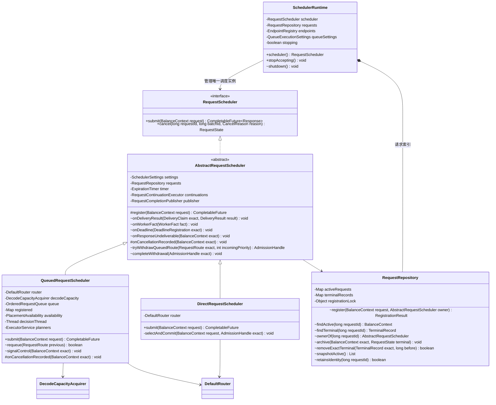
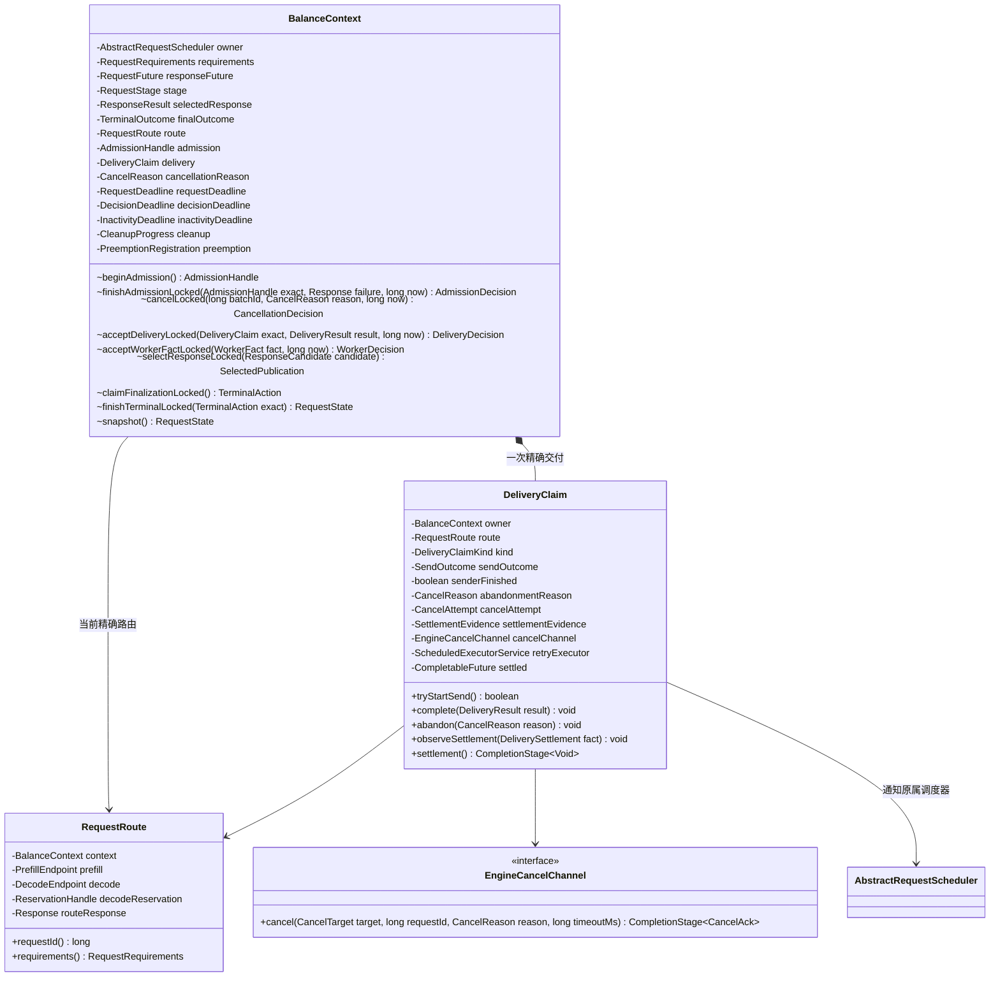

# FlexLB 请求调度与交付责任：落地类图、成员、API 和实现约束

更新：2026-10-08。状态：本文方案的代码迁移已落地；历史验证范围见第 11 节，抢占与 State 收敛见第 12 节。

本文替代此前请求职责方案中 RequestLifecycle / RequestCoordinator、PlacementStrategy / DirectPlacementCoordinator / GlobalQueueCoordinator 的目标关系。保留已有 DirectRequestScheduler、QueuedRequestScheduler 和四方法 RequestScheduler 接口。其他专题中的资源算法、预测与成组规则，除本文明确修改的边界外，不因本轮重构改变。

## 1. 必须实现的结果

1. Scheduler 组织请求流程，具体模式实现自己的算法；不增加全局请求流程类。
2. Context 是请求状态和对外结果的唯一裁决者；Repository 管理身份与记录；Endpoint 管理资源账本。
3. 已发送或可能已发送到 Prefill，且已确定不会再 fetch 的请求，立即发起远端取消。失败响应、Future 完成、本地计数归零都不能豁免清理责任。
4. 谁接管请求，谁负责到底。配置切换只改变新请求的接管者；旧请求继续使用原调度器实例。
5. RequestLifecycle 最终删除，不改名保留。实现中不得出现承担同一职责的 RequestCoordinator 或兼容转调壳。

“调度器实例”指一次创建的 DIRECT 或 QUEUE 调度器。“Worker 实例”指一个带精确实例身份的 Endpoint；同地址重启后也是不同实例。二者的生命周期不能合并。

## 2. 阅读规则

- 图列核心成员和 API，省略日志、指标、普通 getter、现有算法内部细节。
- `+` 是对外或必要的跨包入口；`~` 是子系统协作入口，`#` 是子类扩展点，`-` 是私有成员。
- RequestScheduler 只公开提交和取消；其余事件入口是内部协议，不增加到这个接口。
- 下列新签名是目标 API 契约，参数类型的含义在正文定义；不是已经编译的 Java 接口集合。
- 不可变配置值、事件、返回值可以作为嵌套 record；不据此建立新的服务类、线程池或通用事件总线。
- 未列出的 Endpoint、Router、预测、容量能力、组批算法 API 原则上保留。

## 3. 调度、身份与实例管理

### 3.1 接管与结束契约

| API | 约束 |
| --- | --- |
| `submit` | 返回最终调度结果，不能返回入队确认。注册成功后始终返回原请求 Future；重复 ID、停收和输入错误不得伪装成已接管 |
| `cancel` | 向原属调度器提出取消；不承诺调用返回时远端资源已经释放。保留当前 batchId 校验和未找到返回 null 的契约 |
| `SchedulerRuntime.stopAccepting` | 幂等，只拒绝后续新接管；旧请求选路、内部重新入队、取消和结算继续推进 |
| `SchedulerRuntime.shutdown` | Spring 停服时同步执行停收、等待结算和设施关闭；完成后返回，未结清资源或内部清理异常必须抛出 |
| `onCancellationRecorded` | 仅是模式专属队列控制事件。DIRECT 默认无需队列动作；QUEUE 清理/唤醒自己的队列。不再增加一串细碎模板流程钩子 |

基类不读取 `isQueue/isDirect`、队列排序、组批窗口或抢占配置来分派模式。DIRECT 和 QUEUE 的 submit 仍各自完整表达算法。公共请求协议可以存在基类，策略分支不能迁进基类。

### 3.2 Repository 的注册与归档

`RegistrationResult` 仅区分已注册、重复 ID、Context 已绑定等身份结果；不判断超时、路由或远端完成。Context 的响应通道由 Scheduler 在注册前准备，成功注册时才激活；失败不得留下活动状态或责任计数。

实现优先迁移现有注册互斥机制和两张索引，不顺便改为新的存储体系。注册成功必须一次性绑定 owner 并建立对应责任，或者完整回退；不得暴露索引已发布而 owner 尚未设置的 Context。Repository 注册不执行用户回调、RPC、Endpoint 操作或计时器操作。

归档必须与精确 Context 匹配，终态记录保留原 owner。发布终态记录与移除活动记录之间不得出现同 ID 可被新请求接管的空窗。查询只能通过 Repository 公开的内部操作，不暴露可修改的 Map。终态清理使用精确记录身份，不能只按 requestId 删除。

本地未发送请求的 ID 复用可以继续受精确对象保护；进入远端执行的 ID 遵守第 7 节的远端协议约束。

### 3.3 配置快照

Runtime 启动时创建一个 DIRECT 或 QUEUE 调度器，运行中不切换调度实例。请求注册时冻结所需配置，调度和资源结算继续使用该请求的快照。

Runtime 统一负责停机；BalanceContext 原子记录单请求事实、选择响应和终态，Scheduler 执行结束与资源结算。submit 不持有覆盖整个方法的提交锁，也不增加通用 retain/release 计数。注册入口使用原有互斥机制与 shutdown 关闭注册入口协调；已经登记的准入操作仍由原有 admission gate 保证资源操作结束后才能关闭共享设施。

QUEUE 启动时配置共享 Endpoint 的 QueueExecutionSettings。排序、组批和 dispatcher 类型的运行中切换不在当前范围内。

## 4. 单请求与交付责任

### 4.1 状态只有一个负责人

- Context 唯一持有请求阶段、取消首因、对外响应选择和最终结果。Scheduler 根据返回结果执行，不重写这些规则。
- DeliveryClaim 唯一持有本次发送结果、发送是否退出、消费放弃和远端取消进度。Context 可以记录 ACK 时间用于观测，不能另外维护可独立变化的发送状态机。
- Endpoint 唯一持有真实容量/预留账本。DeliveryClaim 保存精确身份和结算证据，不建立第二份资源计数。
- `AdmissionDecision/CancellationDecision/DeliveryDecision/WorkerDecision` 是各操作的不可变返回值，使用现有 TerminalAction、DeliveryPublication、CleanupPass 等表达要执行的结果。Worker 事实既可能确认交付，也可能推动终态，不能把返回值限制成 TerminalAction。它们没有执行方法、线程或独立状态机；不引入通用事件解释器。
- 一次操作可能同时需要失败响应和远端取消。返回值必须保留两项责任，不能只返回 Response 丢失清理动作。
- 仅将已有低层判断组合为这些业务入口；实现后把不再需要被外部调用的细粒度状态方法改为 private，删除重复字段和别名。

### 4.2 DeliveryClaim 的 API 契约

现有 DeliveryClaim 是 BalanceContext 的嵌套类型，本轮优先继续作为嵌套类型演进；图中单列不要求新增顶层服务。

| API / 成员 | 具体契约 |
| --- | --- |
| `tryStartSend` | 与请求取消、过期、精确身份检查处于同一请求同步边界。成功后表示远端可能接收，不表示 ACK。禁止先返回许可、长期挂起后不检查就发送 |
| `complete` | 消费 Dispatcher 的精确发送结果；保留重复完成检测。晚到结果不得恢复已经放弃的消费路径 |
| `abandon` | 原子记录不可逆的消费放弃。尚未发送则禁止发送；可能已发送则立即认领一次 Cancel 尝试，锁外执行。失败响应不能早于取消责任的建立 |
| `senderFinished` | 独立于 Cancel ACK，表示本次发送操作已退出，不再有本地待发送工作。提前到达的取消证明不能抹掉在途发送责任 |
| `cancelAttempt` | 只允许一个当前有效尝试，重复事件合并；失败重试使用共享执行设施，具有退避、次数/时间预算和可观测结果；不能每请求创建线程 |
| `observeSettlement` | 只接受精确路由、Worker 实例和资源身份匹配的有效证据。普通 Prefill 阶段完成不能自动等价于待 fetch 上下文已清理 |
| `settlement` | 不可由调用方完成。发送操作退出、该交付承担的清理责任结清后完成；失败不得正常完成。结果 Future 完成不触发该条件 |

`SendOutcome` 至少区分未开始、发送中、确定未发送、明确 Prefill 拒绝、已确认接收、结果未知。复用现有 DeliveryResult 的四种结果；尤其 `PREFILL_REJECTED` 可能伴随 Decode 已占有资源，不能转换成 NOT_SENT。

cancelChannel 和 retryExecutor 均为借用的共享设施，由现有 Runtime/装配层管理；DeliveryClaim 只持有自身尝试和重试任务的责任，不能关闭线程池。abandonmentReason 记录交付为何不再消费；Context 的 cancellationReason 记录请求取消首因，两者不得互相覆盖。例如响应发送失败可以需要远端清理，而此前已经选定的成功响应仍保持不变。

`DeliverySettlement` 是精确路由和资源清理证据的不可变值；`SettlementEvidence` 只记录已验证的发送退出、Prefill 清理、Decode 清理等必要事实。证据来源必须由 Endpoint 或 Engine 协议定义，不允许任意调用者传入一个 boolean 宣称远端已释放。

批量发送时，tryStartSend 拒绝的成员必须从实际 RPC payload 中移除，并按确定未发送结算。若 payload 已构造，则重新构造有效成员列表；不能只从本地观察列表删掉，却仍发送原 payload。所有成员都被拒绝时不发 RPC。成功跨过发送边界的成员随后被取消，按可能已发送处理，不能无依据改成 NOT_SENT。

NON_BATCH 路由交付不伪造 Enqueue 发送责任。RouteDeliveryStrategy 未代前端发送请求时，放弃路由首先结算本地交付责任；BATCH 交付可能已发送时才使用 Prefill Cancel 协议。这里按交付事实决定动作，不按 DIRECT/QUEUE 模式推断远端是否存在请求。

### 4.3 三个完成边界

| 边界 | 可以说明什么 | 不能推出什么 |
| --- | --- | --- |
| `submit().future` 完成 | 对外调度响应确定 | 远端执行完成、取消完成、资源释放 |
| `delivery.settlement()` 完成 | 本次交付的发送与清理责任结束 | 整个调度器已经排空 |
| `runtime.shutdown()` 正常返回 | 停服时请求、共享资源和执行设施已关闭 | 仅停收或仅响应 Future 完成就能推出退出完成 |

仍保留 ACK 到达、选定对外响应、执行 Future 回调三个时刻。ACK 到达但尚未选定响应时，终态可使候选成功失效；响应已经选定后不可改写，但 API 交付失败仍可启动远端清理。

## 5. 交付、资源和外围 API

| 现有类 | 核心成员 / API 变化 | 明确禁止 |
| --- | --- | --- |
| DefaultRouter | 保留多角色选择、ProvisionalRoute 返回；两种 Scheduler 在同一层使用它 | 管理队列、取消、Future、全局请求记录 |
| ProvisionalRoute / RequestRoute | 前者持有未提交能力，后者表达精确已选路身份；createRequestRoute 静态构造迁入 RequestRoute 工厂 | 用一个可变对象混淆候选与已提交资源所有权 |
| DeliveryStrategy | 保留 prepare / Transaction / 投影能力；通过精确请求所属 Scheduler 完成准备和本地资源交接，返回 DeliveryClaim | 依赖一个全局 RequestLifecycle 代理全部请求 |
| DefaultBatchDispatcher | 保留发送许可、RPC、回调排空；真实 RPC 边界接入 claim.tryStartSend，按成员反馈结果 | 把调用后的异常标为 NOT_SENT；取消单个成员时无差别取消整批 |
| PrefillEndpoint | offerPinned 显式接收已验证队列执行配置；精确事实直接回到 route.ctx.owner | 从首个请求读取完整 config 来决定共享队列规则 |
| DecodeEndpoint | 保留原子账本；仅为只有预留身份的事实查询 Repository，再把精确事实送回 owner 复核 | 查到同 ID 就假设属于当前请求 |
| WorkerBatcher | 保留队列、组批、容量等待和交付；控制事件指向精确 route / 原 owner | 注册新请求，决定最终响应或复制全局调度流程 |
| DecodeCapacityAcquirer | 统一组织选定 Decode generation 的本地替换和多 victim Engine 抢占；通过 victim 原 owner 操作单请求，最终预留交回原路由提交 | 自行改变请求状态；把 ACK 当作释放证明；让普通取消依赖抢占开关 |
| ExpirationTimer | 保留精确 deadline 注册；回调精确 Context 的原 owner；共享关闭由 Runtime 管理 | 自行裁决超时结果、按当前配置找新调度器 |
| RequestContinuationExecutor | 维持单请求串行与跨请求并行，责任关联原 owner | 改变请求状态规则；通过迟到回调重开已结束实例 |
| RequestCompletionPublisher | 仅发布 Context 已选定的结果，负责发布任务排空 | 自行选择响应、判断取消是否获胜、隐式负责请求归档 |
| FlexlbServiceImpl | 使用一次 SchedulerBinding；响应发送失败反馈精确 Context 的 owner.onResponseUndeliverable | 用 future.isDone 判断无需清理；只发本地取消而丢失远端义务 |

Prefill 事实携带 RequestRoute 时直接路由回原 owner；Decode 等只有预留身份的事实用 Repository 只读查找。owner 的公共事件入口必须再次核验精确身份。Java 跨包可见性可以使 AbstractRequestScheduler 或必要方法 public，但这些属于子系统内部协议，不扩展四方法 RequestScheduler 的外部契约。

`RequestDeliveryControl` 的调用全部迁移到精确 owner 后删除；不让基类实现一组新的 Control 接口，不保留仅转调原 Lifecycle 的适配层。WorkerFact 是 Prefill/Decode/Worker 退出事实的语义总称，优先复用现有类型和有类型的重载，不建立 Object payload 事件总线。

## 6. 实现约束

### 6.1 锁与生效点

1. Context 和其 DeliveryClaim 的关联状态使用同一个请求同步边界；不引入互相嵌套的第二套请求锁。
2. 交付资格检查、截止时间重检、本地资源交接和交付认领必须保留现有原子边界。不能改为分离的 check 然后 transfer。已有局部同步资源操作只允许按照验证过的锁顺序执行。
3. RPC、用户 Future 回调、队列发布、耗时清理不在 Context 锁内执行。Endpoint 先提交账本，释放资源锁后再投递请求事实；不得在 Endpoint 锁内回调 owner 获取 Context 锁。
4. 注册锁不得与 Context 锁形成反向获取。归档时先在请求锁内冻结精确终态，锁外调用 Repository 的精确归档操作；此时 Context 处于不可重开的结束状态，索引尚在即可继续挡住重复 ID。
5. 发送、取消、发布动作先取得一次性的责任/许可，再执行锁外动作。无论同步异常、线程池拒绝还是重入回调，都必须结清对应许可或显式记录未结清失败。
6. 不用 future.isDone 代替“仍持有远端清理责任”的判断。清理异常不能无条件吞掉并让 shutdown 正常返回。

### 6.2 模式与事件归属

- Context 注册成功后 owner 不变；重新入队不是重新 submit，不创建新 Future，也不刷新绝对截止时间。
- 已停收的 QUEUE 仍允许自己的旧请求重新入队。只有真正关闭执行设施或请求已经结束才拒绝内部继续推进。
- 普通事件直接关联原请求或其精确句柄。只有外部按 ID 查询的取消入口才通过 Repository 找 owner。
- Scheduling deadline、请求 inactivity 和远端清理重试预算分开。保留当前调度截止时间与交付认领竞争的语义；本次不能把每个“超时”都改成同一种立即失败。
- 只要某种有效结束事件已决定不再 fetch，远端取消责任就必须建立；不能等 inactivity 或 Engine TTL 才第一次发送 Cancel。

### 6.3 失败与关闭

- 初次取消及时发送；后续失败重试与用户 RPC 的生命周期脱钩，用户断开不能连带取消清理 RPC。
- 请求即使已经返回失败，也保留足以继续取消的目标、精确身份和责任；不得归档后把这些信息丢失。
- 停机先关闭新接管，再停止/排空生产者，保持取消及事实通道可用，最后排空续接和发布设施。
- 超过服务停机预算可报告失败和未结清清单，但不能宣称 shutdown 正常完成，不能把 Engine TTL 当作已经收到的清理证明。进程崩溃仍需 Engine 自身超时兜底，不能宣称内存对象提供崩溃后的可靠重试。
- Callback 已归档或过期时应无害；旧取消尝试不能改写新尝试结果。保留已有重复完成检查、精确清理和实例责任计数，不以删类为由删除它们。

## 7. Engine 协议前置工作

### 7.1 普通取消与抢占取消

现有 CancelRequestPB 只有 request_id，Engine 路径按优先级抢占处理。新增可区分 CLIENT_CANCELLED、DEADLINE_EXCEEDED、SHUTDOWN、PRIORITY_PREEMPTED 的取消原因；沿用项目 Proto 枚举兼容方式，未指定原因保留旧语义。Java EngineCancelChannel 同步增加 reason；传输能力判断不能继续依赖 Decode 抢占策略是否开启。

必须先部署支持普通清理语义的 Engine，再启用新清理路径，或使用明确能力校验；不能在不支持的 Engine 上静默假装取消成功。协议变更必须覆盖终态原因、错误码、P→D 传播和重复取消。

### 7.2 乱序与清理证据

- ACCEPTED：安装取消意图，不是资源释放证明。
- NOT_FOUND：不能证明在途 Enqueue 以后不会到达。
- REQUEST_FENCED：在有效保护范围内证明迟到 Enqueue 会被拒绝；必须同时结清发送侧责任。保护有效期与最大在途发送/重试窗口必须匹配。
- 早到取消证明不能忽略仍在进行的发送；晚到 ACK 如证明远端接受，必须继续清理，不能重新发布成功。
- 远端终态证据必须发生在执行资源及待 fetch 上下文确实被释放/可靠接管之后。仅看到 Prefill 计算结束不足以结清责任。
- 当前协议只有 request_id，Engine 现有契约不支持远端 ID 复用。若产品要求复用，需要将执行身份同步带入 Enqueue、Cancel、Fetch 和事实回报；本地 reservationToken 不能隔离网络中的迟到 Cancel。

## 8. 场景推演与验收矩阵

下表是目标行为验收要求，不是声称新实现已经运行通过。每项验证除响应之外，还要观察必要的队列、资源和远端责任。

| 场景与事件顺序 | 必须得到的结果 | 对设计的约束 |
| --- | --- | --- |
| 接管→排队→取消，未交付 | 移除精确队列项并释放本地预留；不发 Engine Cancel | 原 QUEUE 推进控制，Context 裁决 |
| 选路中→取消→选路成功 | 不交付，释放本次选路能力，原 Future 结束 | AdmissionHandle 结束前不能丢失责任 |
| 取消先于真实发送边界 | tryStartSend 拒绝，无 Enqueue | 不能只在入队时检查取消 |
| 发送边界之后→放弃 fetch→发送仍在途 | 立即 Cancel，同时保留发送责任 | 取消和发送可乱序；等待两个责任都可结算 |
| Cancel 先到→Enqueue 后到 | 后者可靠拒绝，或再次清理最终释放 | NOT_FOUND 不够；fence 有效期必须覆盖竞争窗口 |
| ACK→尚未选定响应→有效超时使 fetch 放弃 | 失败响应并及时取消；清理未完不归档 | ACK 不等于对外响应已选定 |
| 成功响应已选定→API 发送失败 | 原响应不可改写，但启动远端清理 | 响应 Future 完成不豁免 abandon |
| Enqueue UNKNOWN→放弃 fetch | 发 Cancel，不重发 Enqueue | UNKNOWN 不转换成 NOT_SENT |
| PREFILL_REJECTED→Decode 已占资源 | 按真实责任清理两端，不能仅本地撤销 | 保留该独立结果分支 |
| Cancel ACCEPTED→资源仍占有 | 继续跟踪，不报告清理完成 | 释放证据来自真实资源协议 |
| Cancel 超时→ACK/清理事实迟到 | 幂等合并、受控重试，迟到 ACK 不恢复消费 | 放弃不可逆；只认当前精确尝试 |
| 成功响应已发送→暂未观察 fetch | 不误判已永久放弃 | API 写成功不等于 fetch 已发生，缺失观测不等于终止事实 |
| batch 内部分请求放弃 | 仅取消对应成员，其他成员正常 | 请求取消不等于取消整批 RPC |
| 多 victim 撤回→后一个冲突 | 释放前面许可，未提交的原资源继续可用 | DecodeCapacityAcquirer 统一提交 |
| 资源转移已提交→victim 取消 | 不重新入队，不恢复旧预留 | 提交前回滚与提交后补偿分开 |
| QUEUE 停收→DIRECT 接管新请求→旧 victim 重入队 | 回原 QUEUE，原身份/顺序/截止时间不变 | 新接管与内部推进分开 |
| 同一 Worker 地址重启→旧回调 | 不影响新 Worker 资源 | 识别 Worker 实例，不能只按地址 |
| 失败响应已返回→Cancel 未结清→停机 | 继续清理，不能正常报告全部结束 | 取消通道最后阶段仍需可用 |
| 归档→迟到旧回调/旧清理 | 不重开请求、不删新记录、不重复释放 | Context/route/reservation/record 精确身份保护 |
| 重入 Future 回调调用 stopAccepting | 只停收；停服线程的 shutdown 等待发布回调退出 | 不在请求锁内执行用户代码 |

## 9. 方法迁移与删除清单

| 当前内容 | 目标位置 |
| --- | --- |
| Lifecycle 的 activeRequests / terminalRecords / registrationLock、查找和归档 | RequestRepository |
| settleAdmissionLocked、decideInactivityLocked、processRequestEndLocked 中的单请求规则 | BalanceContext 的领域入口；执行动作仍锁外 |
| register / cancel / claimAdmission / claimDelivery 的公共流程及最终结算 | AbstractRequestScheduler；模式队列动作落子类 |
| replaceQueuedDecodeReservations 的多 victim 事务 | DecodeCapacityAcquirer；单 victim 的完成操作通过其原 Scheduler |
| createRequestRoute 工厂 | RequestRoute |
| DeliveryClaim 的一次回调协议 | 扩展为本次交付责任；发送状态和取消尝试集中于此 |
| Lifecycle 里的 Timer、续接、发布设施装配和最终关闭 | SchedulerRuntime/现有配置装配；各 Scheduler 借用，不能关闭共享实例 |
| Lifecycle.onPrefillStatus / onDecodeStatus / 实例退出事实入口 | 精确请求原 owner；需要时经 Repository 只读定位 |
| Lifecycle.selectPublication 及 Publisher 内结果选择回调 | Context 做唯一选择，Scheduler 提交已选结果给 Publisher |
| Future 外部 complete/cancel 的代理入口 | 原 owner 的公共请求协议，保留当前受控 Future 语义 |

迁移完成后删除 RequestLifecycle、RequestDeliveryControl 的无用残留、全局请求代理、旧构造参数和只验证转调的测试。不得删除仍验证身份、锁、生效点、补偿和排空的行为测试。旧文档中协调器/流程接口不是恢复旧类的依据。

## 10. 实施批次与交付条件

1. 先建立 Engine 普通取消契约及真实 Prefill 的无 fetch 清理测试；验证取消原因、P→D 清理、待 fetch 上下文与 inflight 释放、Cancel/Enqueue 乱序。
2. 扩展 DeliveryClaim 并打通 API 放弃消费到远端取消链路；模拟同步异常、发送 UNKNOWN、取消失败、晚到 ACK、线程池拒绝和停机。仅 mock Cancel 返回 ACCEPTED 的测试不足以验收。
3. 收敛 Context 状态规则，将公共请求流程迁入基类；每迁一组入口便移除旧入口，不长期保留双重裁决。
4. 提取 Repository、迁移抢占事务、切换 Endpoint/Timer/交付回调到原 owner，补充真实新旧调度器与共享 Endpoint 的组合测试。
5. 删除 Lifecycle/旧协作端口/别名/测试装配残留；核对模式切换、队列进度、资源一致性及性能，无隐藏 fallback 和重复状态。

验收应覆盖：对外响应最多一次；本地/远端责任不早释放；无 fetch 时及时取消；最终远端执行及待 fetch 上下文释放；晚到事件不污染新身份；旧调度器可继续推进并最终结束。

上一轮运行的 152 项 Java 测试覆盖既有请求协议和若干竞争，不覆盖本轮新增通用 Cancel 和完整无 fetch 清理协议。本文没有宣称已运行本目标版本的 Java/C++/跨进程验收；实现提交必须附其自身的证据。

## 11. 本轮实现与验证记录（2026-10-03）

已删除 `RequestLifecycle` / `RequestDeliveryControl`，公共请求协议落到原属 Scheduler，单请求裁决落到 Context，身份目录与终态记录落到 Repository。模式切换使用冻结的 Binding；旧实例继续处理自己的请求。DeliveryClaim 跟踪实际发送退出及两端清理证据，API 放弃消费、未知发送结果与停机均保留取消责任。批量发送在真实 RPC 边界剔除已取消成员；普通取消与优先级抢占使用独立原因。旧构造参数、测试装配与性能工具中的失效入口已同步移除。

验证记录：

- 完整 Maven reactor 已执行，结合最终模块回归共 2218 项：2216 通过、1 项原有跳过、1 项下述既有吞吐断言失败。取消、身份竞争、配置切换、组批、抢占、资源账本和 API 测试通过；62 秒混合流量验证处理 3368 个请求，Engine 接收的 3288 个请求全部完成，未发现资源泄漏。
- `ProductionCaliberDecodeTest.lowBatchDrainRateMatchesProductionAnchor` 的墙钟吞吐断言未通过。使用本轮修改前的 `JavaMockEngineCluster.java` 与当前版本分别执行同一测试，结果为 404 / 401 tok/s，均低于 519 ±15% 的阈值。该断言保留，未放宽或跳过。
- 普通取消补充客户端取消、截止超时、停机三种原因及重复取消首因保持测试；失败的 generation 在最后一项责任结清后仍关闭自己的执行设施，新增回归覆盖该边界。
- 性能工具通过独立 `javac` 编译；投影差分覆盖 2000 组选择、2000 个 readiness plan、4000 个 candidate，快照工具验证成员变更后的精确成员数。
- C++ 协议、Prefill 无 fetch 清理、Decode 未入队资源释放及对应 UT 已修改，但当前 macOS 环境没有 Bazel/CUDA 构建环境，未执行 C++ UT 或真实 Java↔C++ 跨进程验收。Java Mock Engine 结果不代替这部分验证。

复现 Java 全量回归：`./rtp_llm/flexlb/mvnw -q -f rtp_llm/flexlb/pom.xml test`。

## 12. 抢占与 State 的职责收敛（2026-10-08）

| 对象 | 持有的事实 / 执行职责 | 边界 |
| --- | --- | --- |
| BalanceContext.PreemptionRegistration | 精确 attempt、Cancel 阶段、暂存终态、暂存投递确认 | 嵌套于 Context；业务字段的写方法私有，且要求持有原 Context 锁 |
| BalanceContext | 原子推进上述请求事实、响应选择和终态选择 | 不调用 Endpoint，不构造 Scheduler 执行任务；返回既有 TerminalAction |
| AbstractRequestScheduler | 接收精确事件、操作资源账本、使用现有结束/清理/发布流程 | Endpoint 结算后由 Context 一次应用请求侧变更；容量通知、清理和 resolution 回调保持锁外 |
| DecodeCapacityAcquirer | 选定 generation 的本地替换或 Engine Cancel 多 victim 事务 | 原 Manager 与 Coordinator 已删除；保留独立 ACK/完成窗口和迟到事实观察器 |
| QueuedRequestScheduler | 普通预留、本地替换和远端结果共用 commit / submitRoute | 删除 finishPreemption 独立提交入口；迟到预留仍按精确能力回滚 |
| EvictionPlanner | Prefill 候选优先级过滤与排序、Decode 受害者选择 | 纯计算；不决定请求响应、不改账本、不增加锁 |
| PrefillState | 队列身份、席位和资源事实，锁内复验及原子替换 | 向 Planner 提供未提交候选；保留无分配的 advisory 判断和等待协议 |
| DecodeState | 实际预留、历史结算、抢占资源 claim、发送额度及增量视图 | 各事实生命周期不同，不能因请求侧 resolution 已完成而一并释放 |

`VictimResolution.Outcome.REQUEST_END` 表示请求已选定结束；`DELIVERY_RESUMED` 表示投递已恢复。两者都结束请求侧抢占参与，但都不证明 Decode 已释放。资源是否足够仍由 Decode 的精确账本事务判断。原通知时点保留；前端响应选择、Cancel ACK、资源终态和请求归档继续分别表达。

此次调整保持既有锁顺序。预留、释放、回队列、响应竞争、终态先于 ACK、NOT_FOUND、清理期间新事实和迟到回调沿原事件序列验证。没有新增事件总线、动作解释器、流程转发服务或通用 Coordinator。验证数字与远端性能见 `evidence/capacity-convergence-2026-10-08.json`。

远端 Java 回归执行 2158 项，0 失败、0 错误、1 项原有跳过。750P/750D、64g 堆、BATCH/NON_BATCH、3000/10000 QPS 的倒序对照复测均通过，最新客户端 P99 最大 41.078ms。首轮最新版本的吞吐及选路停顿超限仍保留在证据中；后续 JFR 与相同源码复测未复现该选路停顿，其根因尚未确认。
