# 原有线程链路与时序图（完整保留，供逐项审查）

状态：**先前的 15 张图和完整文字按原样保留**，便于对照实际调用链、Future 创建点、等待条件、线程寿命和转发链路。它记录的是复审前的目标草案，**不是已实现行为，也不是当前推荐的控制事件线程协议**；当前方案见[最终方案](final-design.md)。保留旧图不是认可其中的错误，具体冲突如下。

| 旧稿位置 | 保留它用于看什么 | 已发现的问题 |
| --- | --- | --- |
| §1、§4、§5 | DIRECT/QUEUE/BATCH 从注册到响应、Future 与线程交接 | 主路径事实仍有价值，但相同交接多次重复；物理线程数量不能仅靠删图减少 |
| §2 的精确撤队图、§7 timer/cancel 图 | 原先设想的“共享继续执行器跨进全局/本地队列撤队” | 会引入跨队列阶段执行权，与在途 planner、队列 owner 竞争；当前目标改为**各队列 owner 优先处理精确 control inbox**。旧图不能作为实现顺序 |
| §6 Future 图、§8 `Future.cancel()` 图 | Future 创建/完成线程与同步 API 特例 | §8 未先在 RequestSlot 冻结兼容的取消结果就同步取消 Future，可能改变 delivery claim 已赢时的现有语义；以主文的同步仲裁规则为准 |
| §3、§9 | 各线程的创建/寿命，以及从节点转发 | 作为实现索引保留；§3 中“共享继续执行器处理排队停止”的旧职责已经废弃 |

以下内容除标题外保持旧稿原貌，故图中的旧路径与上表问题同时存在，便于 review 时逐边比对。

每张图内不同线程所有者使用不同颜色；跨图的同类角色尽量沿用相同色系。灰色表示 RequestSlot、Future 等**没有专属线程的对象**。时序图中实线是当前线程调用，虚线可表示返回、任务交接、异步完成或唤醒；**只有标注“转到某线程”的箭头才表示换线程**。`RequestStage` 是请求责任区间，不是线程；请求等待容量、RPC 或 Engine 事实时没有专属线程。

颜色索引：蓝=gRPC 入口，黄=全局决策，浅橙=planner，青=WorkerBatcher，紫=Batch 派发，天蓝=Engine gRPC 回调，粉=Batch/转发完成回调，绿=共享继续执行器，靛=Publisher，珊瑚=timer，杏=cancel 调用者，灰=无专属线程的对象。图内同时写出线程名称，颜色不是唯一识别方式。

## 1. 总览：主链路与控制事件分开看

**主链路（成功投递）：请求在哪里执行，何时返回客户端。**

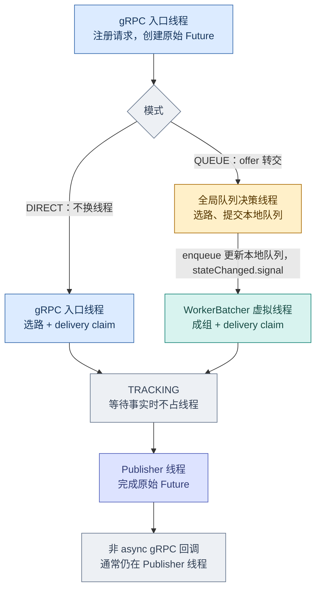

`delivery claim` 是一次同步仲裁，不是一条线程。BATCH 的 EnqueueBatch 由 BatchDispatcher 派发池发出，完成池记录结果后再唤醒 TRACKING；见下文 QUEUE 时序图。成功响应返回后，TRACKING 仍可等待 Engine 终态。

控制事件的具体唤醒边见下一节。正常 SCHEDULING/DELIVERY 由入口调用栈、全局队列或 WorkerBatcher 推进；**排队中请求的取消/超时**由 RequestRegistry 持有的共享继续执行器取得该请求的阶段执行权后，按身份精确撤队。TRACKING/FINALIZING 无活动执行者时也由此执行器接手。每次只推进到下一等待点，同一请求最多排一个待处理唤醒，不为每个请求创建线程。

## 2. 谁在等、谁改变等待条件、谁唤醒

箭头在这里表示**生产条件或提交任务 → 唤醒正在等待的线程**。`Condition.signal()` 只提示重新检查条件，不转移请求所有权，也不保证被唤醒的请求立即执行。唤醒必须与队列/版本/容量事实的更新配套；等待者在同一把锁下循环重读条件，不能把一次 signal 当成事实本身。

**全局队列：决策线程等新请求、plan 结果或可用容量。** 下图是当前源码中的正常调度信号边。决策线程执行 `awaitIfNoWork()`：仅在没有可消费 plan、没有可推进的请求（或 planner 槽位不可用）时等待 `changed`，醒来后重新检查队列、plan 和容量。队尾取消不靠这次扫描，精确撤队见下图。

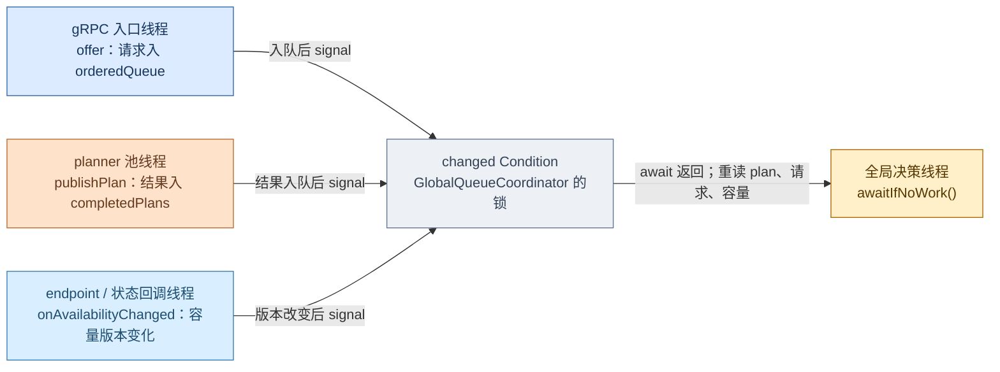

**本地队列：WorkerBatcher 虚拟线程等的条件随停靠点而变。** `waitForNonEmpty()` 等 `activeIndex` 非空；`awaitBlockedHeadCapacity()` 等**同一个队头**依赖的容量变化或队头/停止状态变化；`awaitSchedulingChange()` 等队列版本、调度输入版本变化，或本地 batch 窗口/绝对期限到时。后两处使用限时 `awaitNanos()`，到时可自行醒来，不需要再造一条 timer 线程专门给窗口发信号。

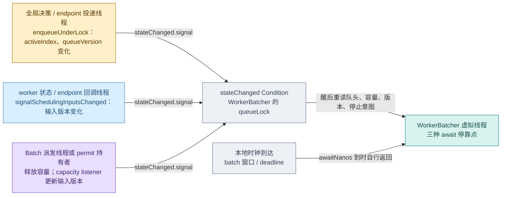

**排队请求取消/超时：按精确身份继续，不等正常排队位置。** timer/cancel 线程只写事实并提交一次按请求合并的短任务。共享继续执行器认领阶段执行权后，调用队列的精确撤回入口；队列的 Condition 随之唤醒原线程处理**剩余请求**。全局队列已有可按 entry 撤 `orderedQueue`/`waitingRequests` 索引的能力，WorkerBatcher 已有 `removeQueued`；将控制事件交给共享执行器并统一阶段仲裁仍属目标设计。不能只发 `changed`/`stateChanged`，因为队尾请求可能长期不被正常扫描。

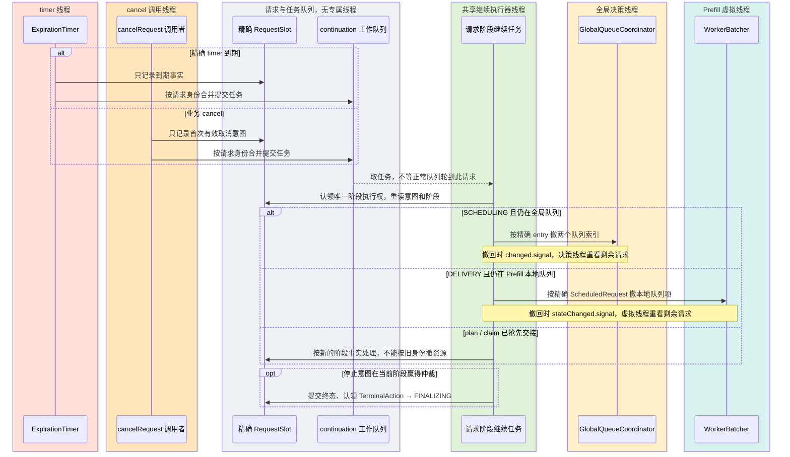

若 planner 正在计算但 route 未提交，停止先赢时可撤精确队列项，晚到 plan 只能关闭它持有的临时能力；route 提交先赢则重读 DELIVERY/TRACKING。若原队列线程已在推进同一请求，继续任务不能并行收尾，必须等原子阶段执行权交接并保留待处理唤醒。

**permit 的真实等待链：没有线程阻塞在 Semaphore 上。** `DefaultBatchDispatcher.tryPrepareSubmission()` 用 `tryAcquire()` 试探；失败时返回不可用的容量边界，WorkerBatcher 为这个**精确容量来源**注册 listener，之后等自己的 `stateChanged`。permit 通常由派发池线程在派发步骤结束时释放；未提交的 reservation 也可由其持有线程关闭释放。释放触发 listener，再唤醒 WorkerBatcher 重试。RPC 完成池不承担这次 permit 释放。

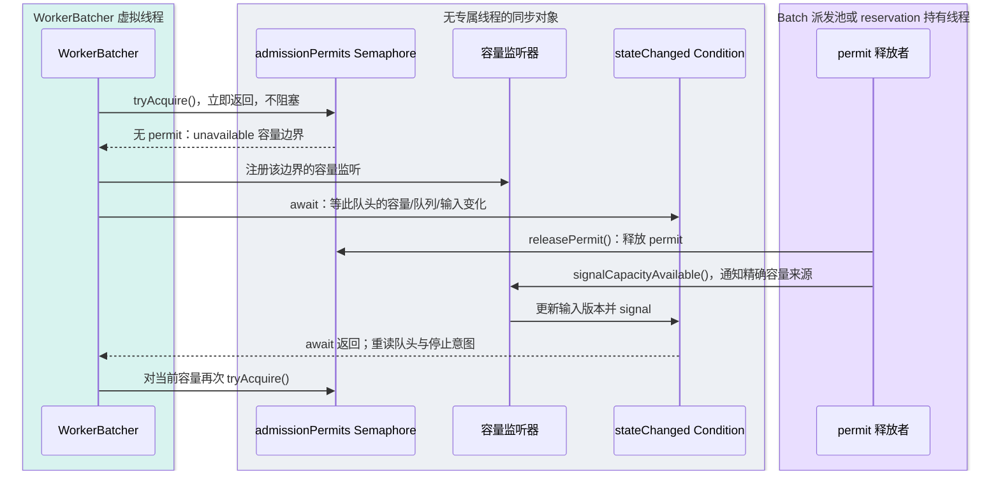

**线程池交接：提交任务的线程与取任务的线程也通过队列相连。** 每条边上的队列就是接收线程空闲时所等的东西；请求在队列里没有专属线程。`ExpirationTimer` 的延迟队列等的是最近期限；期限到时由定时线程取任务，即使没有其他线程来 signal。

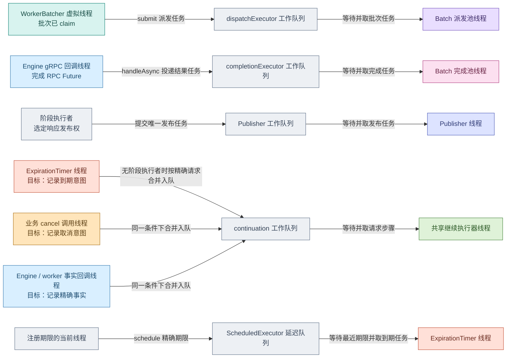

timer/cancel 的目标路由由**请求当前停靠点与执行权**决定：SCHEDULING/DELIVERY 的 QUEUE 请求若仍排队且无人推进，合并提交精确继续任务，不等排队位置；任务撤队后分别 signal `changed` 或 `stateChanged`，让正常队列线程重读剩余工作。TRACKING/FINALIZING 无活动执行者时也提交继续任务。DIRECT 入口仍在执行时只写意图，入口在 claim 前重读。所有路径共用 RequestSlot 的一次执行权仲裁，不能让继续执行器和正常队列线程同时推进同一请求。

## 3. 每组线程的状态、创建者与寿命

下图的状态是**执行器的逻辑状态**，不是另一个请求枚举，也不要求 Java `Thread.State` 恰好同名。线程池通常在构造时建立，实际工作线程可在第一次任务到来时才启动。一次请求结束只让线程回到空闲，不销毁共享池。下表的创建和现有关停入口依据当前源码；“工作”列写目标职责，timer/cancel 的当前回调仍有待迁移的副作用。

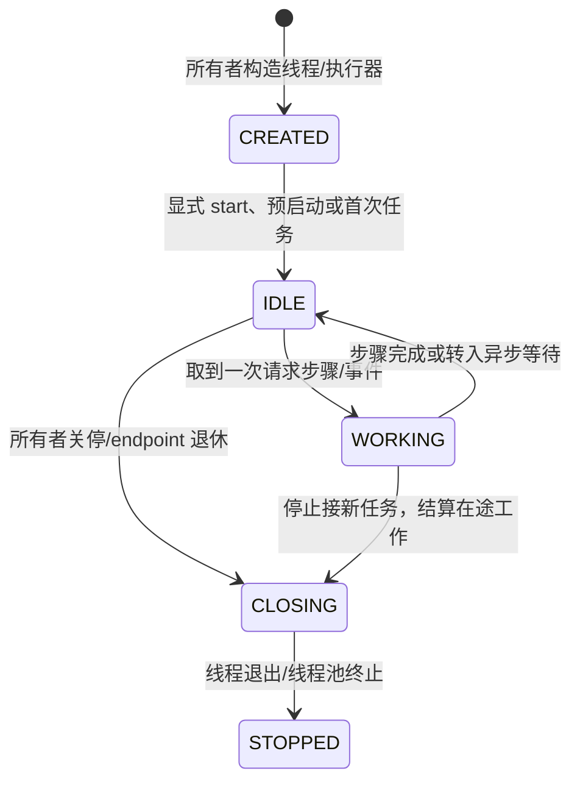

| 线程或线程组 | 谁创建、何时启动 | 工作 / 空闲状态 | 何时结束 |
| --- | --- | --- | --- |
| gRPC 服务端 Netty boss / worker event loop | `FlexlbGrpcServer.start()` 建 **1 条 boss**；`ChannelConfiguration` 按配置建 worker group，服务启动使用 | 工作时收发网络数据；空闲时等 I/O。**不运行请求阶段** | `FlexlbGrpcServer.shutdown()` 在 drain 后关闭 event loop |
| gRPC 业务线程 `flexlb-grpc-executor` | `FlexlbGrpcServer.start()` 建有界 `ThreadPoolExecutor`；线程按任务懒启动 | 执行 `schedule`、业务 cancel、DIRECT 准入；空闲时等池任务。超过 core 的空闲线程可在 60 秒后退出 | gRPC drain 完已接受 RPC 后，server shutdown 关闭线程池；与单个请求寿命无关 |
| 全局队列决策线程 `flexlb-global-decision` | QUEUE 启动配置下，`RequestScheduler` 创建 `GlobalQueueCoordinator` 并立即启动 **1 条** daemon 线程；DIRECT 无此线程 | 工作时维护顺序、提交/收取 plan；空闲时等队列或容量信号 | `RequestScheduler.closePlacement()` 唤醒并等待退出；寿命随 QUEUE scheduler |
| planner 池 `flexlb-global-planner-*` | 同一个 `GlobalQueueCoordinator` 建固定池；线程首次 plan 时启动 | 工作时计算候选，不持有等待中的请求线程；空闲时等 plan 任务 | 全局队列关闭后停止接新 plan，已提交 plan 结算后退出 |
| Prefill `WorkerBatcher` 虚拟线程 | `PrefillEndpoint` 为每个 **QUEUE endpoint generation** 构造 1 条未启动虚拟线程，`EndpointRegistry` 发布前 `startGeneration()` 启动；DIRECT 不建线程 | 工作时本地排队、成组、claim/投递；空闲时等队列、窗口或容量信号 | 该 generation 退休或 `EndpointRegistry.close()` 时 `stopAndAwait()`；寿命随 endpoint generation |
| BATCH 派发池 `flexlb-dispatch-executor-*` | `DefaultBatchDispatcher` 构造时建固定池，线程按提交任务启动 | 工作时发一次 EnqueueBatch；空闲时等批次任务，不等待 RPC/Engine 终态 | `shutdown()` 停止新提交，已接收派发和 permit 结算后关闭 |
| BATCH 完成池 `flexlb-dispatch-completion-*` | 同一个 `DefaultBatchDispatcher` 构造时建固定池，线程按完成任务启动 | 工作时处理 RPC 返回/异常并记录每成员事实；空闲时等完成任务 | 与派发池同属 Dispatcher；待完成回调数归零后关闭 |
| Engine gRPC 网络/回调线程 | `ChannelConfiguration` 建 `managedChannelEventLoopGroup` 和 `managedChannelThreadPoolExecutor`，`EngineGrpcClient` 共享使用 | event loop 做 I/O；client executor 执行 gRPC 回调；空闲时等 I/O/任务。回调只提交精确事实 | 共享 channel/容器生命周期，不随单个 RPC 或请求结束 |
| worker 状态同步线程 | `MasterEngineSynchronizer` 建 **5 线程定时池**、按配置定长的 `engine-sync-executor` 和 `status-checker-executor`；构造后开始周期调度 | 定时池触发轮询；engine-sync 池展开 worker；status-check 池发查询并运行 `handleAsync` 状态回调；空闲时等周期或池任务 | `MasterEngineSynchronizer.destroy()` 关闭这三个池；与请求寿命无关 |
| `request-scheduler-expiration` | `RequestRegistry` 构造 `ExpirationTimer` 时建 **1 线程** ScheduledExecutor；首次 timer 任务时启动 | 到期时只校验身份、记事实、提交精确继续任务；空闲时等最近期限，绝不等清理/RPC/Future | RequestRegistry 关闭期限注册、取消句柄后 `closeExpiration()` 退出；没有每请求 timer 线程 |
| **目标新增** `request-continuation-*` | `RequestRegistry` 建一个服务级固定线程池；首次无活动 owner 的唤醒时启动 worker | 工作时对一个 RequestSlot 推进一步；可处理 SCHEDULING/DELIVERY 排队请求的精确停止，也处理 TRACKING/FINALIZING 继续；空闲时等合并后的请求任务；每请求最多一个待执行项 | 停止新注册后仍保持运行，直到在途阶段与 endpoint 退休回调交接完；排空后关闭，早于 Publisher |
| `request-completion-publisher-*` | `RequestRegistry` 构造 `RequestCompletionPublisher`，**预启动**配置数量的线程 | 工作时锁外完成已选 Future；空闲时等发布任务，非 async gRPC 回调可能在此线程运行 | 所有已认领发布完成后 `closePublisher()` 等待池终止；若回调内重入关闭，会临时建 `request-completion-publisher-close` 线程，关完即退出 |
| endpoint 退休辅助池 `flexlb-endpoint-retirement-*` | `WorkerEndpoint` 静态建固定 **4 线程** daemon 池，按退休任务启动 | 仅在 generation 需要异步退休时执行清理；平时等任务 | 进程级共享辅助池，当前没有显式 shutdown，随 JVM 结束；不能代替请求阶段 owner |
| 从节点转发回调池 `flexlb-forwarder-channel-executor` | `ChannelConfiguration` 创建固定 **16 线程**池，`FlexlbGrpcForwarder` 的 channel 共用 | 工作时处理转发 RPC 回调，空闲时等任务；已完成 Future 的非 async 回调也可能在注册线程执行；不创建本地调度 RequestSlot | 随转发 channel/容器生命周期，单个转发请求完成不关池 |

业务 cancel 的 gRPC/Context 回调、外部 `RequestFuture.cancel()` 和 Future 的非 async 回调**不创建自己的线程**：分别借用 gRPC/触发取消的线程、调用 `cancel()` 的线程、完成 Future 的线程（若已完成则借用注册回调的线程）。`FlexlbServiceImpl.routeAndComplete` 在本地请求注册后安装 Context 取消监听，路由 Future 回调完成时移除；监听本身只活到这次路由返回。从节点转发回调池还共用 managed-channel event loop，单次转发结束不销毁它们。

一个请求完成后各组线程的去向，以及目标关停顺序：

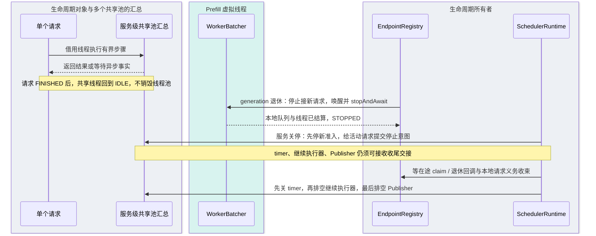

最后几步是**目标关停契约**。当前 `SchedulerRuntime.shutdown()` 的顺序是关全局队列、关准入、终止未完请求、关 timer、关 endpoint、关 Publisher；新增继续执行器后必须保证 endpoint 退休期间的唤醒仍可投递，并在关闭 Publisher 前排空继续任务，不能直接照搬旧顺序。

## 4. DIRECT：入口线程做完本地交接

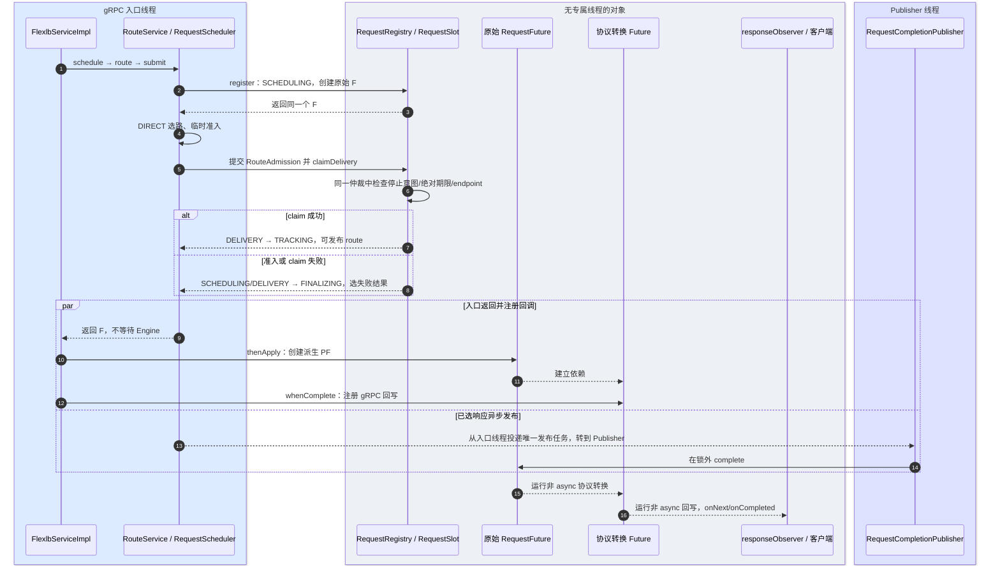

成功响应可以在 TRACKING 中先返回，后续 Engine 终态仍由请求继续跟踪。若 F 在回调注册前已完成，非 async 回调会在注册线程运行；否则通常在 Publisher 完成 F 的线程运行。两种情况都不能持有 RequestSlot、队列或 endpoint 锁。

## 5. QUEUE：入口线程只入队，后续按事件交接

**公共路径：原始 Future 在入口线程创建，offer 后转给队列线程。**

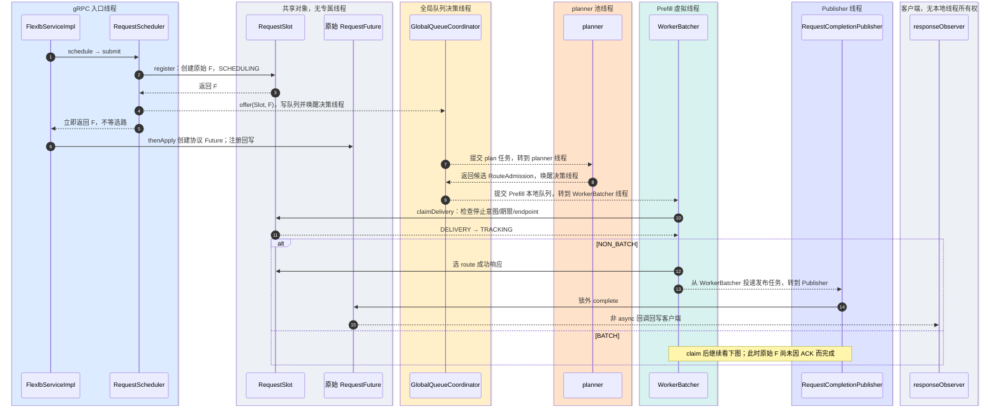

**BATCH 扩展：RPC Future 在派发线程取得，`handleAsync` 才转到完成池。**

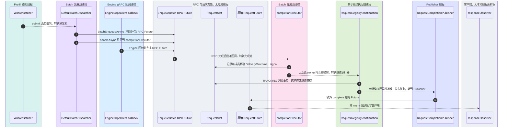

QUEUE 的 `offer`、plan 和 Prefill 本地队列跨线程传递的是**同一个原始 Future 的引用**及精确请求句柄，不会逐阶段创建新的 `RequestFuture`；响应发布权始终由 RequestSlot 仲裁。上图画正常异步 RPC 返回；发起调用同步失败时 RPC Future 也可能在派发线程完成，但 `handleAsync` 的结果处理仍交给完成池。全局容量、本地 batch 窗口和 RPC 等待都不占每请求线程。Planner、WorkerBatcher 和派发池完成本次有界步骤即交出执行权；RPC/worker 回调先更新精确 endpoint generation 账本，再通知请求。客户端响应与 Engine 终态没有固定先后。

## 6. Future：每个 Future 只代表一件事

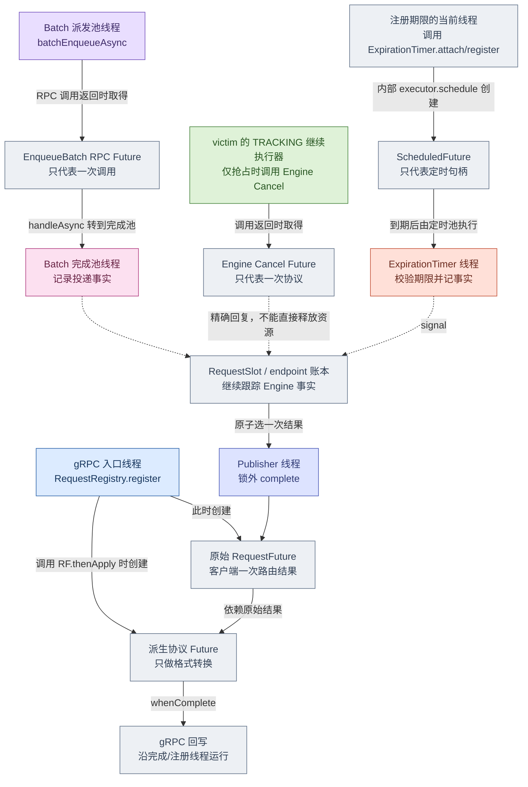

`RequestFuture` 完成表示客户端的**路由/投递结果**，不表示 Engine 已结束或资源已释放。阶段之间用 RequestSlot 状态转移和唤醒交接，不串联每阶段一个 Future。已选响应可能还在 Publisher 队列中，因此不能用 `Future.isDone()` 判断终态是否还能覆盖响应。注册前校验失败可在入口线程直接返回已完成 Future，不创建 RequestSlot。

| Future | 创建时刻与线程 | 后续换线程的点 |
| --- | --- | --- |
| 原始 `RequestFuture<Response>` | 入口线程调用 `RequestRegistry.register()`，`RequestSlot` 构造时创建一次 | QUEUE 的 offer/plan/本地队列只传**同一个引用**；RequestSlot 选响应后把发布任务交给 Publisher，由 Publisher `complete`。外部 `Future.cancel()` 是调用者线程的同步特例 |
| 协议转换 Future | 本地 `routeLocally()` 在入口线程调用原始 Future 的 `thenApply` 时创建 | 原始 Future 完成时执行非 async 转换和回写；通常在 Publisher 线程，若注册时已完成则在入口线程 |
| EnqueueBatch RPC Future | Batch 派发池线程调用 `EngineGrpcClient.batchEnqueueAsync()` 时取得 | gRPC 完成线程完成它；`handleAsync(..., completionExecutor)` 把投递结果处理转到 Batch 完成池 |
| Engine Cancel Future | 精确 victim 的 TRACKING 执行者发起抢占协议时取得 | gRPC 回复只产生协议事实，再唤醒 victim 阶段；Future 完成不直接释放 Engine 资源 |
| `ScheduledFuture` | 当前阶段线程调用 ExpirationTimer 的精确期限 `attach/register` 入口时，由其内部 `executor.schedule()` 创建并持有 | 到期任务在 timer 单线程执行，只记事实并唤醒阶段；句柄取消不完成客户端 Future |
| 转发的两个 Future | 从节点入口线程调用 `stub.schedule()` 得到 gRPC `ListenableFuture`，再建 `CompletableFuture<MasterForwardResult>` | gRPC Future 完成线程用 `Runnable::run` 完成结果 Future；非 async 回写通常同线程，若已完成则在注册线程 |

## 7. timer、业务 cancel 与投递竞争

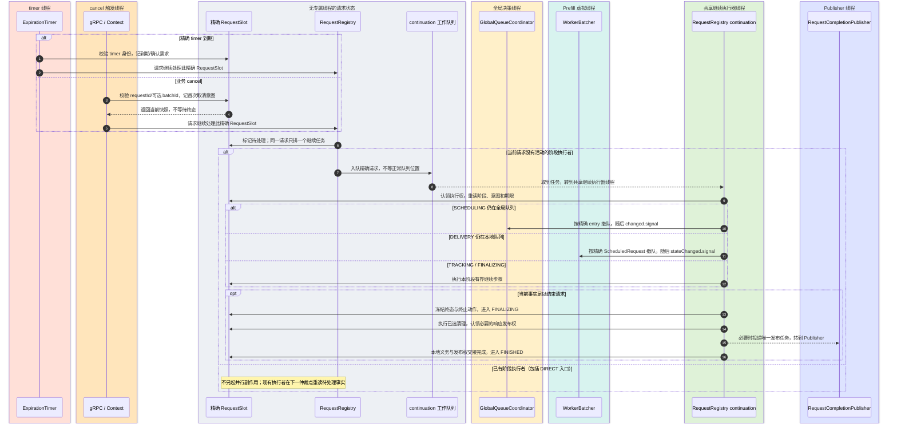

这里没有单独的“唤醒路由”组件。`RequestRegistry` 只负责把精确 RequestSlot 标为待处理，并在无人执行时向共享工作队列提交一次任务；哪个阶段该做什么，由取到任务的执行者**重读 RequestStage 后**决定。若事件与阶段交接竞争，执行者退出前重查待处理标记，必要时再提交一次任务；不能只 signal 已离开的旧等待者，也不能等队尾请求自然轮到。`claimDelivery` 把停止意图、当前绝对时间和 endpoint 身份放在**同一个原子仲裁点**：停止先赢则不发送，claim 先赢则 TRACKING 按远端可能可见处理。timer 即使延迟运行，也不能让过期请求越过该点。请求调度期限只阻止交接前的新投递；决策可见性 timer 只触发确认；inactivity timer 重读最后活动时间后才请求结束本地跟踪。旧 timer 不改变 FINALIZING/FINISHED 的结果。

timer、业务 cancel、抢占发起方都不能直接撤队、释放资源、发送 Engine Cancel 或完成客户端 Future。它们先留下可重读事实，再按精确请求提交继续任务；跨阶段交接时由新 owner 重读，不能丢唤醒。普通客户端取消不主动发 Engine Cancel；只有 DECODE_ENGINE_OWNED 抢占由 victim 的 TRACKING 阶段推进原协议。

## 8. `Future.cancel()` 是单独的 Java API 入口

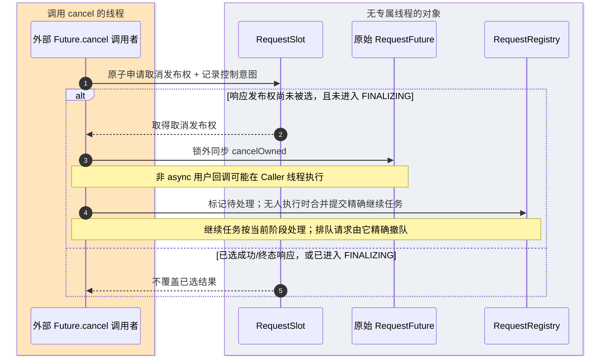

业务 `cancelRequest(requestId, expectedBatchId, reason)` 走上面的 timer/cancel 图，返回“已接受/当前快照”，不承诺 Future 当场取消；`Future.cancel()` 保留 Java Future 的同步可观察语义，也不表示远端 Engine 已停止。

当前全局队列在原始 Future 上注册了 `whenComplete` 精确撤队回调；`Future.cancel()` 若同步完成 Future，会在调用者线程执行这个非 async 回调。迁移到“事件线程只写事实并提交继续任务”时，须把该撤队动作移到阶段继续任务，或让回调只提交任务，避免 `Future.cancel()` 经由回调暗中在调用者线程清理队列。

## 9. 转发到 master 的线程边界

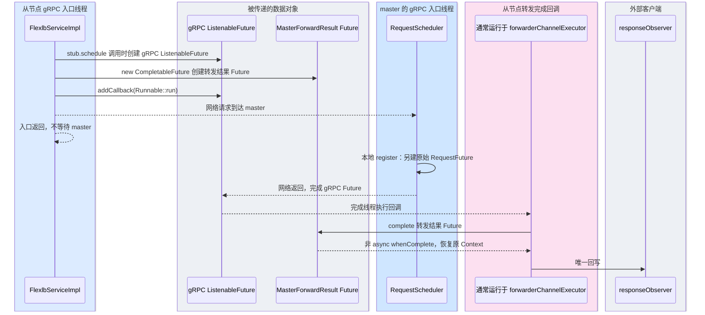

从节点不创建该请求的调度 RequestSlot；其 `ListenableFuture` 回调用 `Runnable::run`，在完成该 Future 的线程执行，再完成转发结果 Future。若结果 Future 在 `whenComplete` 注册前已完成，回写可能在从节点入口线程运行。取消后的核对发给拥有请求的 master，不能在从节点释放 master 的资源。

## 审查时固定的三个边界

1. **入口与事件线程只做短步骤**：DIRECT 可同步准入；QUEUE 入口只入队；timer/cancel/事实回调只记精确事实并按请求提交有界继续任务。
2. **阶段执行者做副作用**：同一请求同一时刻只有一个副作用执行权；共享继续执行器还负责排队中的 SCHEDULING/DELIVERY 精确停止，不能与 Publisher 混用。
3. **发布与关停可收束**：FINALIZING 后决策固定；Publisher 在锁外完成 Future；关停先停止新准入，再结算在途 claim、已选终止动作与响应发布，最后关闭 timer、继续执行器和 Publisher。

当前代码中 ExpirationTimer、`RequestSlot.cancelRequest` 和部分抢占入口仍可能直接做清理；以上是迁移目标，不代表这些线程边界已经实现。实现时先保持现有返回语义和精确资源账本，再迁移副作用所有权。
