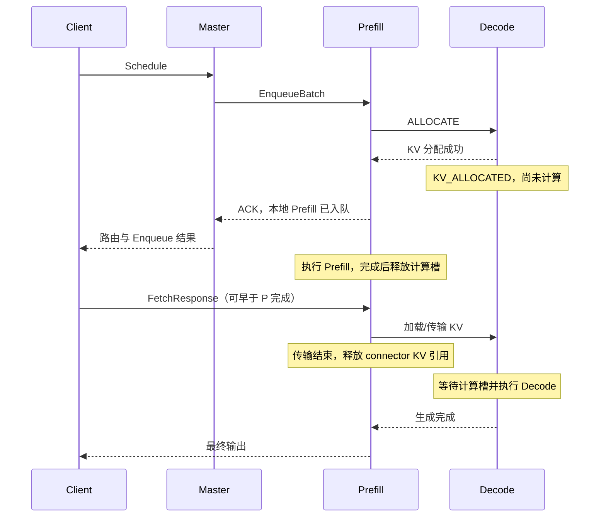

# Mock Engine 的 P/D 与 Fetch 生命周期

## 真实引擎的顺序

`PrefillRpcServer::prepareAllocateResource()` 在本地 `enqueueRequest()` 之前调用 `remoteAllocateResource()`。P 通过 `RemoteGenerate(stage=ALLOCATE)` 通知选中的 D，并等待分配结果。D 此时已经持有 KV，可以上报已分配状态，但还没有进入 Decode 计算。

D 的 KV 分配失败会先在 ALLOCATE 窗口内重试；最终失败时，D 上报终态，P 的准备阶段失败，不能继续把请求作为正常 Prefill 接受。P 对外的 Decode 分配失败码是 `8211`；底层内存分配失败码是 `602`。**Decode 计算槽满与 KV 不够是两个条件**：KV 能分配时，可以先预留资源，再等待计算槽。

BATCH 模式的 `EnqueueBatch` 只完成准备和本地入队。`FetchResponse` 从 deferred context map 中取出上下文，调用 `finishStream()`，推进远端加载 KV 和 Decode 生成。Fetch 可以在 P 算完之前到达；这时它等待 P 的计算结果。它也可以稍后到达。

## 资源不是同一个计数

| 资源/状态 | 获取时机 | 没有 Fetch 时 | 释放时机 |
|---|---|---|---|
| P 本地计算槽 | Prefill 入队/执行 | P 仍会执行并完成 | P 本地计算结束 |
| P deferred RPC 上下文 | 准备与入队 | 保留，不能当作计算槽 | Fetch 接续、取消、超时或关停 |
| P connector 的 KV 引用 | P/D 请求持有的 KV | P 算完后仍需保留 | KV 传输结束或上下文清理 |
| D KV | ALLOCATE | 已占用并上报，不能运行 Decode | 取消/超时，或正常 Decode 终态 |
| D 计算槽 | KV 就绪后获准执行 | 不占用 | Decode 终态 |
| Master 调度记账 | 调度/ACK | 按上报和 master 自己的规则更新 | 与引擎上下文 TTL 分属不同机制 |

真实 BATCH 的 Fetch 附着 TTL 从成功入队、准备发布 ACK 时开始，默认 600 秒；请求里的 `fetch_attach_timeout_ms` 或剩余请求超时可缩短它。不能把“没有 Fetch”理解成“P 计算槽一直不释放”。

## Mock 的对应实现

`MockPrefillSession` 保存一次请求的附着、P 完成、继续执行、关闭状态。只有“P 已完成，并且 Fetch 已附着或明确启用 auto-fetch”才能取得一次继续执行权。提前和延迟 Fetch 进入同一条状态流转。注入 Fetch 错误时也先取得上下文所有权并清理 P/D，不能把已报错的请求留到缺失 Fetch TTL。

D 在准备阶段就创建 `KV_ALLOCATED` 状态、记录 KV 和请求所有权；继续执行时把这份预留交给 Decode，不能再扣一次 KV。准备状态不占计算槽，取消它也不能减掉其他请求的计算槽。

P 的计算完成事件继续按原来的时间发布。`retainComputed()` 将已计算的缓存块原子地转成仍有引用的缓存键，避免先释放再重新获取造成驱逐窗口。正常传输、取消、缺失 Fetch 超时和关停都要释放相应的 P/D 资源。

Mock 用一次状态转换模拟 KV 传输，不模拟网络搬运耗时、分块传输和真实 GPU；状态观察可以验证协议顺序，不能拿它测真实 KV 网络带宽。`prefill_contexts` 统计尚未接续的 deferred context；D 开始后，取消传播由 P/D ownership 关系继续维护，不能把这个计数当作 C++ 的全部 RPC onflight。

请求期限有一个未模拟到逐点一致的边界：若准备阶段已耗尽请求期限，真实引擎在发布 ACK 时同步拒绝；当前 Mock 将剩余期限下限设为 1 ms，再异步清理。Fetch 附着期限和请求剩余期限需要分别验证。

## 两种启动模式

| 配置 | 默认 | 含义 |
|---|---:|---|
| Java `--auto-fetch` / YAML `environment.mock_auto_fetch` | `false` | BATCH 必须收到客户端 Fetch 才继续 P→D |
| Java `--fetch-attach-timeout-ms` / YAML `environment.mock_fetch_attach_timeout_ms` | `600000` | 测试侧缺失 Fetch 的默认上下文期限；单个 Enqueue 的显式期限优先 |
| 压测 `FETCH_OUTPUT_STREAM` | `1` | 为 `0/false` 时，启动脚本同时给 Mock 传 `--auto-fetch true` |

直接运行 JavaLoadClient 时，也必须同步配置 Mock。只让客户端跳过 Fetch，却仍让 Mock 保持严格模式，就应该观察到 D 等待 KV，而不是悄悄完成。

NON_BATCH 的 `GenerateStreamCall` 本身已经建立客户端输出流，不存在独立的 Fetch 附着过程。它自然推进 P/D，不需要打开 BATCH 的省网络开关。

`no_respond` 只表示服务端 RPC 黑洞，不再承担“客户端没有 Fetch”的含义。

## 状态取证

Decode 计算门禁以 `active_decode_requests` 为准。`running` 和 worker running-task 集合包含
`KV_ALLOCATED`，其中的请求可能只持有 KV 而未开始计算，不能用它证明计算槽已经占满。
测试应分别记录 P 计算槽、deferred context、connector KV 引用、D KV 与 D 计算状态。

D 提前分配后，P 入队拒绝会清理 D 的准备状态。Master 可能先收到 D 的取消终态，
再收到 P 的拒绝 ACK；应分别核对客户端错误、引擎终态和调度记账。

## 缓存容量与所有权

可驱逐的空闲缓存与在途请求引用的 KV 是两种占用。缓存中有键不表示它不可回收；
引用尚未释放的块不能计入可驱逐空间。容量测试先确认单请求能够准入，再以跨请求的
工作集超过容量构造驱逐，避免把超大请求的准入拒绝误当缓存淘汰。

多 Master 共用引擎时，引擎上报的负载可能来自其他 Master。Scheduler 请求数、
Prefill ownership、Decode reservation/dispatch permit 和引擎负载应分别核账；
单个 Master 无客户端流量不意味着共享引擎空闲。完整流量排空后再验证全局收尾。

## 引擎成员与代际

瞬时失联、永久故障、有序缩容是不同操作。有序缩容需要先撤销发现入口，确认 Master
不再向旧地址/旧代引擎投递，再排空已接纳请求并关进程。Mock 本地 `drained=true`
只能证明采样时本地没有在途请求，不能证明 Master 已退出路由。

收敛预算根据实际状态保留时间、清理周期及在途状态 RPC 推导，保存配置与观测时间。
不能只靠固定睡眠或总引擎数判断某个地址/代际已经退出。故障后的恢复请求须独立发送，
不能用故障前晚完成的请求填充恢复样本；同地址重用必须区分代际。

源码入口：真实协议在 `rtp_llm/cpp/model_rpc/`；Mock 状态机在
`flexlb-mock-engine/src/main/java/org/flexlb/mockengine/` 的 `MockPrefillSession`、
`JavaMockEngineCluster` 和 `MockLruBlockCache`。
