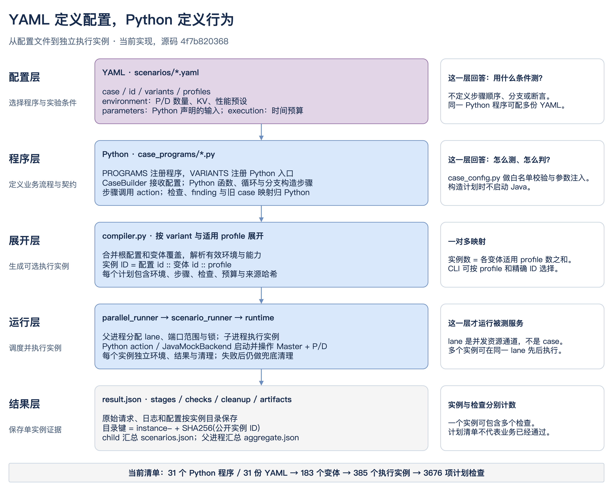
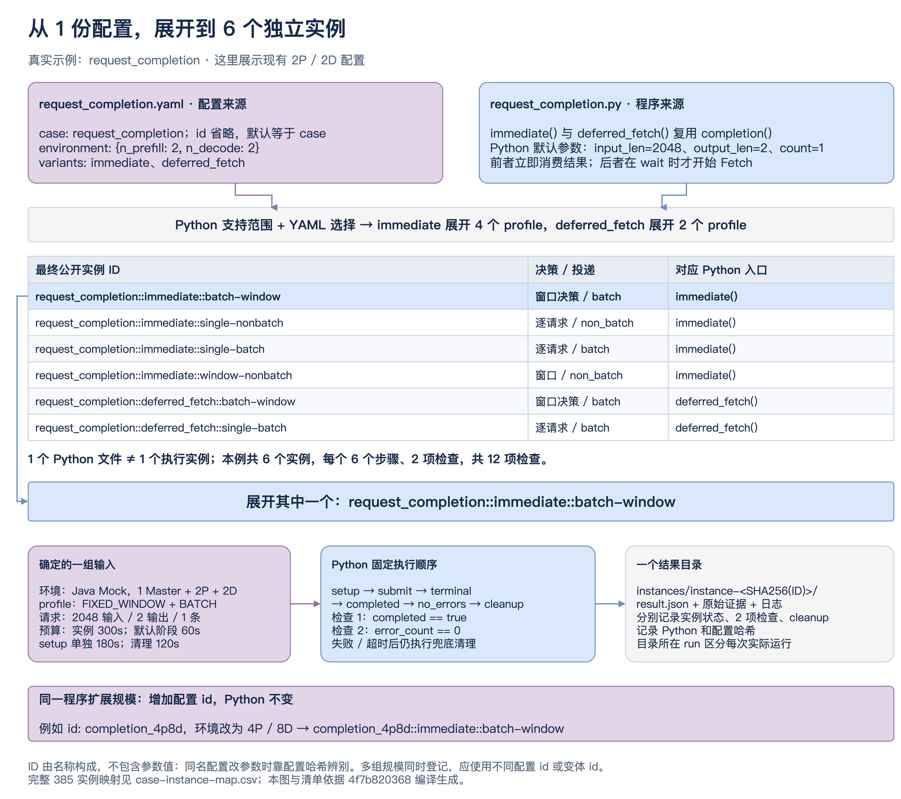
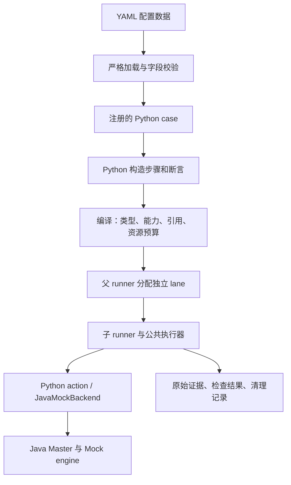

# FlexLB case 框架设计

框架采用 **YAML 配置 → Python case → 公共执行器 → Java Master / Mock engine**。
YAML 保存全部用例配置：P/D 规模、profile、输入数据、时间预算、元数据、断言阈值和参数约束。Python 保留步骤顺序、分支、循环、结果绑定和判定算法，不提供用例配置默认值。
添加配置或新逻辑的具体步骤见 [添加新 case](adding-cases.md)。
压测与 case 的共享能力及依赖边界见 [公共测试底座](shared-test-runtime.md)。

框架现在分为 **functional 功能合同**与 **workload 复杂场景／持续负载**两类，运行策略、入口和迁移说明见 [两类测试](test-suites.md)。

## 1. 术语解释

### 配置与用例

| 术语 | 含义 | 例子 |
|---|---|---|
| case / program（用例 / 程序） | Python 定义的业务测试流程。配置中的 `case` 只能选择显式注册的程序。 | `case: request_completion` 对应 `case_programs/request_completion.py`。 |
| contract（契约） | 通过证据判断的行为要求，归 Python 所有。 | 所有请求到达业务终态，且流错误数为零。 |
| configuration（配置） | 传给 Python case 的数据；没有流程控制功能。 | 一份 YAML 描述 2P/4D、输入长度与适用 profile。 |
| scenario_id / id | 一份配置的公开名称。默认等于 `case`；可用 `id` 为同一程序增加另一组配置。 | `id: completion_4p8d`。 |
| variant（变体） | Python 已定义的一个测试入口，加上本行配置数据。YAML 不能创造新的执行流程。 | `immediate` 与 `deferred_fetch` 是两个 Python 函数。 |
| program | 选择注册模块中的公开 Python 执行函数。省略时等于该行 `id`。 | `id: large_pd, program: immediate`。 |
| instance（运行实例） | 配置名称、变体名称与 profile 的组合。每个实例独立记录结果与清理。 | `request_completion::immediate::single-batch`。 |
| profile（运行形态） | 调度决策与请求投递路径的命名组合。 | `single-batch` 是逐请求决策、batch 投递。 |
| environment / env（环境） | Master、P/D worker 数量、KV 容量、性能预设等环境描述。运行后的 `ctx.env` 是环境对象。 | `environment: {backend: java_mock, n_prefill: 2, n_decode: 4}`。 |
| parameters（用例参数） | YAML 提供、Python 读取的数据；缺少被读取的参数会报错。 | completion 支持 `input_len`、`output_len`、`count`。 |
| config_overrides | `environment` 内受类型检查的 Master 配置项。 | 调度 ordering、decision、dispatcher、配额等。 |
| schema_version | scenario YAML 格式版本，当前为整数 `2`；Master 的 `FLEXLB_CONFIG.schemaVersion` 为 `3`，两者独立。 | 旧版带 stages 的 YAML 会在启动前报错。 |
| grade（断言档位） | `normal/strict/loose`；只有明确支持分档的检查才按档位取阈值。 | `--grade normal` 不改变 profile。 |
| category / tags | YAML metadata中的业务类别、标签，用于分类。 | `category: status`、`tags: [smoke]`，不执行检查。 |
| capability / requires | 实际环境提供的能力及 YAML 声明的能力要求。启动前校验。 | deferred Fetch 要求 `enqueue_batch`。 |

操作系统环境变量与 `environment` 是不同概念。例如 `FLEXLB_FT_PARALLEL_MASTER_BASE`
是 runner 的端口输入，不是 YAML 的 worker 配置。

### Python 编排与扩展

| 术语 | 含义 |
|---|---|
| CaseBuilder | Python case 的计划构造器。通过 `case.value()` 读取数据、`case.number()` 按 YAML 约束校验数值、`case.params()` 绑定运行结果，通过 `case.step()` 添加操作。构造计划时不启动进程。 |
| stage / step（阶段 / 步骤） | 一次具名操作，包含自己的输入与时间预算；步骤按 Python 构造的顺序执行。 |
| action（操作） | 可复用的 Python 执行能力。如 `request` 提交请求、`wait` 等待、`check` 比较结果。多个步骤可调用同一 action。 |
| params | Python 给某次 action 的输入；与 YAML 顶层 `parameters` 不同。 |
| output（输出） | action 公开给后续步骤的有类型数据。Python `output("submit", "requests")` 引用之前步骤的请求集合。 |
| check / assertion（检查 / 断言） | 对实际值、期望值与原始证据进行判定。基础 `check` 支持 `eq/le/ge`。 |
| handler / StageHandler | 扩展 action 的声明：名称、参数校验、执行函数、输出类型与检查 ID 集合。 |
| catalog / HANDLERS | action 的显式注册目录；与选择 Python case 的 `PROGRAMS` 注册表分开。 |
| PlanContext | 编译阶段上下文，提供环境、profile、引用类型与资源预算。此时没有 Java 进程。 |
| RuntimeContext / ctx | 执行阶段上下文，保存环境、输出、资源句柄和清理回调。 |
| StageOutput / CheckResult | action 返回的输出、检查及制品；每项检查记录 ID、状态、实际值、期望值和证据。 |
| resource handle / epoch | 活动资源的受控引用及环境代次。环境重建后，旧活动句柄不能操作新环境。 |
| finding（已知问题） | YAML metadata中明确列出的 `stage_id.check_id`。只承接该检查的普通 FAIL，不能吞掉异常、超时或清理失败。 |

步骤引用在内部计划中仍编码成 `$ref`，这是执行器的数据协议。
**YAML 不接受 `stages`、`stage_overrides`、`steps`、`action`、`$ref`、`needs` 或 `when`。**
比较运算和阈值属于 YAML 数据；Python 决定检查顺序与实际值来源。finding 在 YAML metadata 中声明，任意模块路径不能由 YAML 指定。

### 运行与证据

| 术语 | 含义 |
|---|---|
| Master / Prefill / Decode | Master 是被测调度服务；P 处理输入上下文，D 生成后续 token。`n_prefill/n_decode` 分别是两类 worker 数量。 |
| token / KV / block | 输入输出的计量单位、注意力缓存及缓存管理单元。Mock 模拟长度、容量和状态，不加载模型。 |
| backend / java_mock | 环境执行实现。启动真实 Java Master 与 Java Mock 进程，不占 GPU。 |
| Schedule / ACK | 请求调度与调用确认，均不等于业务完成。 |
| Fetch / GenerateStreamCall | batch 与 non_batch 两条结果消费路径。 |
| consume / consumer / FINISHED | 消费模式、读取流的客户端和业务终态。消费者退出、流结束、业务完成分别记录。 |
| setup / teardown / cleanup | 创建环境、显式清理操作，以及失败/超时后的兜底收尾。 |
| execution / timeout / deadline | 实例和阶段的时间预算与运行时截止时间；清理有独立预算。 |
| runner / parent / child | 执行入口、负责选择分配汇总的父进程、执行实例的子进程。 |
| lane / shard / lease | 独立端口通道、分片方式与资源范围声明。父入口用 `--shard case`。 |
| plan / compile / dry-run | Python 生成并校验的计划、生成计划的过程、父进程资源分配预览。均不代表业务运行通过。 |
| resource budget | 初始/重建 worker 峰值与累计动态新增尝试上限，用于提前预留端口与资源。 |
| observation / snapshot / window | 观测、某一时刻的状态快照及采样区间。每项检查必须定义采样起点与窗口。 |
| evidence / artifact | 判定依据及保存这些依据、日志、配置和结果的文件。 |
| fixture / fake backend | 使用可控返回值验证框架行为的测试准备，不代表真实 Java 业务通过。 |
| legacy / migration / baseline | 历史实现、迁移过程及冻结的对照基线；旧用例目录已删除，不是当前可选执行入口。 |

### 两类测试与观测完整性

| 术语 | 含义 |
|---|---|
| functional | 有限请求和可控前置条件下的功能合同；操作失败后依赖步骤停止。 |
| workload | 多窗口、持续发射或多轮故障/恢复场景；独立观测可以继续，前置操作失败仍阻断依赖。 |
| suite | 按测试目的选择的集合，由 `suites.yaml` 登记；与业务 category、运行 profile 独立。 |
| collector / shared sample | 每个环境的采集器；Mock 的破坏性计数只由一个采集器读取，断言和报告共用同一序列。 |
| collection gap | 采集失败或采样间隔超预算。非预期缺口使运行证据 INVALID。动态标签暂时没有值属于指标缺值，曲线保留断点。 |
| runtime validity | 证据是否完整，与业务断言是否通过独立。INVALID 不能产生 PASS 或有效探针裁决，原裁决保留在 `prior_status`。 |
| attempt | 一次实际 Schedule RPC，包括目标、时间、传输结果；同一请求重试保留多次 attempt。 |
| master incarnation / engine incarnation | 测试侧观察到的进程代次。与产品维护的 endpoint generation 分开；未观测到的值保持空，不用猜测值补齐。 |
| preconditioning | 为构造缓存等前置状态而发出的请求；保留请求及引擎关联，单独统计，不混入正式测量的 master 调度计数。 |

## 2. 分层与执行路径

下面的 DrawIO 分两页：第一张说明各层职责，第二张把真实 `request_completion` 配置展开到单个执行实例。
[可编辑 DrawIO](diagrams/yaml-python-instance.drawio) · [完整实例映射 CSV](diagrams/case-instance-map.csv) · [示例编译计划](diagrams/request-completion-plans.json)。
映射清单固定于源码 `4f7b820368`，是静态展开结果；代码或配置变更后需要重新生成，不代表执行通过。





公开实例 ID 为 `配置 id::变体 id::profile`。本例一份 YAML 选择两个 Python 入口：
`immediate` 支持四种 profile，`deferred_fetch` 支持两种，共展开六个独立实例。
每个实例包含六个步骤、两项检查；不是一个文件执行一次，也不是每项检查都单独启动环境。
修改同名配置的参数不会改变公开 ID，程序和配置哈希用于辨别内容；多组规模同时登记应使用不同的配置或变体 ID。



| 位置 | 职责 |
|---|---|
| `scenarios/` | 数据配置：P/D、profile、预设、Python 变体选择与参数 |
| `flexlb_test_framework/case_config.py` | 配置白名单、参数注入、Python 注册入口调用与来源哈希 |
| `flexlb_test_framework/case_programs/` | 流程、分支、循环、结果绑定与计算 |
| `flexlb_test_framework/scenario/compiler.py` | 编译内部计划并检查类型、能力、有效配置、预算 |
| `flexlb_test_framework/scenario/actions/` | 复用的请求、故障、观测及专用判定能力 |
| `flexlb_test_framework/scenario/runtime.py` | 统一执行、超时、结果和资源清理 |
| `parallel_runner.py` / `scenario_runner.py` | 父进程资源分配、子进程执行与汇总 |

`case.step()` 是 Python API，允许复用函数和 Python 循环；YAML 不解释控制流。
编译器内部 schema 1 保留为 Python 计划协议，外部 YAML/JSON 只接受 schema 2。
底层继续复用 `flexlb_cfg`、`harness` 和 `EngineOps`，不按旧 case 函数名调用旧实现。

命令参数暂保留 `--source yaml` 兼容原父入口；此时运行的是 **Python case + YAML 配置**。
父入口现在默认选择 `yaml`，省略 `--case-dir` 时定位本工具目录的 `scenarios/`，不依赖当前工作目录。
结果包含 `implementation.language/program/path/sha256`
及 `configuration_sha256`，可同时核对程序和配置来源。

## 3. 配置展开与 profile

一个 Python 程序可以被多份 YAML 复用。配置根 `id` 默认等于 `case`。
每行 variant 的 `id` 是配置名称，`program` 默认等于该名称；各行按适用 profile 展开：

```text
配置 id::variant id::profile
```

| profile | decision | dispatcher |
|---|---|---|
| batch-window | fixed_window | batch |
| single-batch | single | batch |
| single-nonbatch | single | non_batch |
| window-nonbatch | fixed_window | non_batch |

`profiles` 必须显式配置；根列表约束整份配置的范围，variant 可从中选择或省略以继承。未设根列表时，各 variant 独立声明。Python 不维护重复的用例 profile 白名单，实际能力匹配由编译器验证。
环境是根 `environment` 加该行 `environment`；`config_overrides` 在这一层按字段合并。
用例参数和参数约束分别由根与变体的 `parameters`、`parameter_schema` 递归合并；列表和标量整体替换，每个 builder 得到独立副本。
必填参数缺失、参数越界或能力不匹配在启动前失败。共享配置节可以包含其他变体使用的数据。

新增别名配置仍需验证其参数与预期行为。
本次配置迁移保持原有 32 份配置、395 个实例；完整计划与迁移前逐项对照一致。

[缓存热点 Leader 饱和溢出测试](cache-hotspot-storm.md)在同一个程序内声明 P=2/3/4 变体，独立校准健康 band，并将已知问题的确认/恢复与构造失败分开裁决。

弹性扩容增加了 [Decode 扩容保护](decode-scale-out-protection.md)：旧 Decode 有负载时加入新实例，验证新实例的容量、持续完成请求和停流恢复。
检查数量随 Python 计划展开；用 `scenario_runner.py --source scenarios --list-json` 查看当前计划。
ABA 切换与 KV 淘汰的具体检查边界见 [HA 与 KV 检查说明](ha-kv-checkpoints.md)。文件收缩方案见 [收缩分析](case-consolidation-analysis.md)。

## 4. 配置边界与 Mock 语义

配置接受受校验的环境字段和 YAML 用例参数。重复键、非有限数、YAML anchor/alias/tag、
目录外符号链接及未知顶层字段均拒绝；不提供任意 Python import、表达式或环境变量注入。
Python 输出引用只能指向前序步骤且类型必须匹配；零检查不能产生 PASS。

Java debug API 由 `environment.debug_enabled: true` 显式启用，提供有界快照和请求查询；
`master_debug_log` 是另一项日志开关。诊断 API 本身不改变业务调度配置。

每个 Mock worker 拥有独立的可变性能覆盖项。针对一个 worker 的 set_perf 只影响该 worker；
动态新增或替换 worker 从启动模板创建独立性能模型，不继承其他 worker 的后续覆盖值。
各 worker 的 KV 池、请求状态和 drain 所有权也分别记录。历史报告中的“共享性能对象”
属于修改前版本，不能直接用于解释当前构造。

## 5. 执行和资源所有权

每个由配置展开的 Python 实例使用独立环境。父进程先分配 lane 的端口窗口与锁，子进程再校验租约、
worker 容量和端口环境变量，之后才能启动 Java。

`RuntimeContext` 保存当前环境、阶段输出、资源注册表和清理回调。
资源句柄包含 `kind/id/env_epoch`。环境重建后 epoch 改变，旧的活动句柄不可继续操作；
只有明确标为历史用途的资源才允许作为历史证据读取。

资源应在启动或取得后立即登记，使“启动了一半就失败”也能找到清理对象。
回调按登记的逆序执行。显式 `teardown` 和实例退出的兜底清理都使用同一套机制。
`environment_reconfigure` 必须先清理旧环境，再启动新环境，不是热更新参数。

动态添加 worker 的 action 声明 `max_dynamic_additions`，操作走受限的 `ctx.ops.add_engine`。
新增尝试本身也计入预算；不能自行分配端口。新环境峰值与累计新增量共同决定容量上界。

`master_layout: dual_standalone` 表示两个真实 standalone Master，不代表 ZK 选主 HA。

## 6. 请求生命周期与时间预算

请求至少区分以下事实：

| 事实 | 不能替代的结论 |
|---|---|
| Schedule 返回 | 不代表 Prefill/Decode 业务完成 |
| Fetch/Generate 已打开或消费者退出 | 不代表收到业务 FINISHED |
| 客户端 transport cancel | 不代表服务端收到 Cancel RPC 或释放资源 |
| 业务 FINISHED | 不代表 Master 台账、C++ onflight、KV 引用都已释放 |
| cleanup PASS | 不代表业务断言通过 |

请求记录分别保留 Schedule、流、业务终态、错误、取消与消费者退出信息。
`consume: deferred` 提交时不 Fetch，后续 `wait` 才消费流；`immediate` 则提交后开始消费。

时间预算有三个层次：

1. `execution.timeout_s`：实例执行总预算。
2. `execution.stage_timeout_s` 和阶段 `timeout_s`：阶段预算，仍受实例剩余时间限制。
3. `execution.cleanup_timeout_s`：失败或超时之后的独立清理预算。

实际 RPC、HTTP、轮询和线程等待都必须传递或遵守 `deadline.remaining()`。
只给外层 future 设置超时、让后台线程继续运行，不算实现了有界执行。
串行 N 次 RPC 的阶段必须容纳整个串行过程；并发阶段按真实收尾路径计算预算。
增加外层预算不能偷偷改变单次 RPC 或业务观察窗口。

部分旧 case 的“何时开始计时、FINISHED 后是否要求 EOF、取消前还是取消后冻结判定”
有专用适配，例如 [`observed.py`](../flexlb_test_framework/scenario/observed.py)。新增场景应明确这些语义，
不能用一个统一的 wait 抹掉原契约。

## 7. 检查、失败传播和结果

普通 FAIL、ERROR 或 TIMEOUT 会阻断后续阶段，后续行记录为 BLOCKED；兜底清理仍执行。
如果需要同时保留多个独立检查的证据，应先完成采样，再做最终判定。
同一 action 可返回多个 `CheckResult`，其 ID 集合必须与 handler 声明完全一致。

| 状态 | 含义 |
|---|---|
| `PASS` | 声明的检查通过，且清理成功 |
| `FAIL` | 业务或契约断言不满足 |
| `ERROR` | 执行、证据解析、协议或清理出现错误 |
| `TIMEOUT` | 执行/等待超出预算 |
| `BLOCKED` | 前序失败，当前阶段未执行 |
| `FINDING-CONFIRMED` | 明确声明的 finding 检查失败，确认该已知问题 |
| `FINDING-RESOLVED` | finding 检查通过，需要复核已知问题标记 |

finding 指向 `stage_id.check_id`。它只能承接指定检查的普通 FAIL，不能吞掉 ERROR、TIMEOUT、
缺失证据或清理失败。声明 finding 也不等于允许任意失败。finding 检查不会阻断后续独立检查。

child 写每个实例的 `result.json` 与证据，并汇总到 `scenarios.json`；父进程汇总到
`aggregate.json`。实例目录使用公开 ID 的哈希，避免冒号影响 JVM 参数。
父进程还校验返回实例是否缺失、重复或多出，不能只相信子进程退出码。

通常退出码 0 表示 PASS 或合法 finding 状态，1 表示执行/断言/清理失败，2 表示无效配置或选择。
最终结论必须同时读实例结果、检查和 cleanup，不能只看 rc。

## 8. 测试与执行证据

| 验证层 | 能证明什么 |
|---|---|
| 加载/编译/清单 | 语法、类型、能力、选择和预算是否合法 |
| Python fixture | 执行逻辑、失败边界和资源处理；部分 fixture 使用真实消费者线程 |
| Java mock 运行 | 指定源码、配置与实例在真实 Master/mock 进程上的结果 |

框架测试数量不是 Java 业务实例通过数量。修复必须追加新版本结果，不能覆盖冻结版本的原始失败。

关于 P/D 预留、Fetch、计算槽与 KV 引用的区别，以及省网络压测开关，见 [Mock P/D 与 Fetch 生命周期](mock-pd-fetch-lifecycle.md)。

摘机与瞬时失联的阶段边界、配置推导和各家族改造方案见 [摘机 case 契约](engine-removal-contract.md)。
