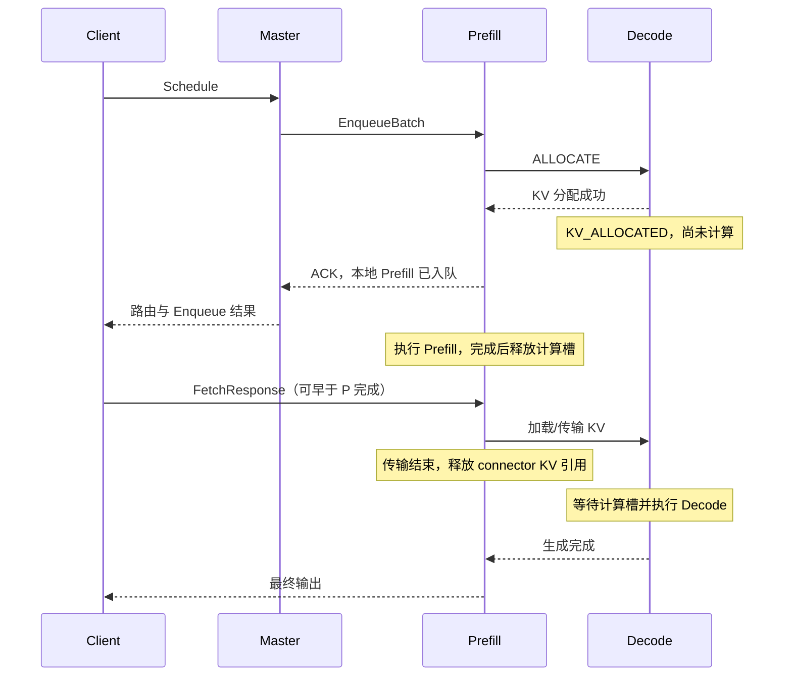

# Mock Engine 的 P/D 与 Fetch 生命周期

本次核对真实引擎的源码基线是 `a4744b35111b5123e43ba941e52dec7e215e4fc0`。修改范围是 Java Mock、测试启动配置和 case；没有修改 C++ 引擎或 Java master。

## 真实引擎的顺序

`PrefillRpcServer::prepareAllocateResource()` 在本地 `enqueueRequest()` 之前调用 `remoteAllocateResource()`。P 通过 `RemoteGenerate(stage=ALLOCATE)` 通知选中的 D，并等待分配结果。D 此时已经持有 KV，可以上报已分配状态，但还没有进入 Decode 计算。

D 的 KV 分配失败会先在 ALLOCATE 窗口内重试；最终失败时，D 上报终态，P 的准备阶段失败，不能继续把请求作为正常 Prefill 接受。P 对外的 Decode 分配失败码是 `8211`；底层内存分配失败码是 `602`。**Decode 计算槽满与 KV 不够是两个条件**：KV 能分配时，可以先预留资源，再等待计算槽。

BATCH 模式的 `EnqueueBatch` 只完成准备和本地入队。`FetchResponse` 从 deferred context map 中取出上下文，调用 `finishStream()`，推进远端加载 KV 和 Decode 生成。Fetch 可以在 P 算完之前到达；这时它等待 P 的计算结果。它也可以稍后到达。

## 资源不是同一个计数

| 资源/状态 | 获取时机 | 没有 Fetch 时 | 释放时机 |
|---|---|---|---|
| P 本地计算槽 | Prefill 入队/执行 | P 仍会执行并完成 | P 本地计算结束 |
| P deferred RPC 上下文 | 准备与入队 | 保留，不能当作计算槽 | Fetch 接续、取消、超时或关停 |
| P connector 的 KV 引用 | P/D 请求持有的 KV | P 算完后仍需保留 | KV 传输结束或上下文清理 |
| D KV | ALLOCATE | 已占用并上报，不能运行 Decode | 取消/超时，或正常 Decode 终态 |
| D 计算槽 | KV 就绪后获准执行 | 不占用 | Decode 终态 |
| Master 调度记账 | 调度/ACK | 按上报和 master 自己的规则更新 | 与引擎上下文 TTL 分属不同机制 |

真实 BATCH 的 Fetch 附着 TTL 从成功入队、准备发布 ACK 时开始，默认 600 秒；请求里的 `fetch_attach_timeout_ms` 或剩余请求超时可缩短它。不能把“没有 Fetch”理解成“P 计算槽一直不释放”。

## Mock 的对应实现

`MockPrefillSession` 保存一次请求的附着、P 完成、继续执行、关闭状态。只有“P 已完成，并且 Fetch 已附着或明确启用 auto-fetch”才能取得一次继续执行权。提前和延迟 Fetch 进入同一条状态流转。注入 Fetch 错误时也先取得上下文所有权并清理 P/D，不能把已报错的请求留到缺失 Fetch TTL。

D 在准备阶段就创建 `KV_ALLOCATED` 状态、记录 KV 和请求所有权；继续执行时把这份预留交给 Decode，不能再扣一次 KV。准备状态不占计算槽，取消它也不能减掉其他请求的计算槽。

P 的计算完成事件继续按原来的时间发布。`retainComputed()` 将已计算的缓存块原子地转成仍有引用的缓存键，避免先释放再重新获取造成驱逐窗口。正常传输、取消、缺失 Fetch 超时和关停都要释放相应的 P/D 资源。

Mock 用一次状态转换模拟 KV 传输，不模拟网络搬运耗时、分块传输和真实 GPU；状态观察可以验证协议顺序，不能拿它测真实 KV 网络带宽。`prefill_contexts` 统计尚未接续的 deferred context；D 开始后，取消传播由 P/D ownership 关系继续维护，不能把这个计数当作 C++ 的全部 RPC onflight。

请求期限有一个未模拟到逐点一致的边界：若准备阶段已耗尽请求期限，真实引擎在发布 ACK 时同步拒绝；当前 Mock 将剩余期限下限设为 1 ms，再异步清理。本次用例验证独立的 Fetch 附着期限，不覆盖该边界。

## 两种启动模式

| 配置 | 默认 | 含义 |
|---|---:|---|
| Java `--auto-fetch` / YAML `environment.mock_auto_fetch` | `false` | BATCH 必须收到客户端 Fetch 才继续 P→D |
| Java `--fetch-attach-timeout-ms` / YAML `environment.mock_fetch_attach_timeout_ms` | `600000` | 测试侧缺失 Fetch 的默认上下文期限；单个 Enqueue 的显式期限优先 |
| 压测 `FETCH_OUTPUT_STREAM` | `1` | 为 `0/false` 时，启动脚本同时给 Mock 传 `--auto-fetch true` |

直接运行 JavaLoadClient 时，也必须同步配置 Mock。只让客户端跳过 Fetch，却仍让 Mock 保持严格模式，就应该观察到 D 等待 KV，而不是悄悄完成。

NON_BATCH 的 `GenerateStreamCall` 本身已经建立客户端输出流，不存在独立的 Fetch 附着过程。它自然推进 P/D，不需要打开 BATCH 的省网络开关。

`no_respond` 只表示服务端 RPC 黑洞，不再承担“客户端没有 Fetch”的含义。

## 用例与证据

旧的 `engine_rpc_fault::no_respond` 四个实例删除。新用例为：

- `request_completion::client_no_fetch::batch-window`
- `request_completion::client_no_fetch::single-batch`

同一份 Python 程序依次测试延迟 Fetch、始终不 Fetch、重建为 auto-fetch 环境后三种行为。YAML 只声明拓扑、期限和 P 计算时长。每个阶段保存 `client-fetch-*.json`，包括请求 ID、P/D 落点、Fetch RPC 计数、计算状态、KV 引用和回收快照。

严格模式断言 D 提前出现且没有计算；P 算完后释放计算槽、保留上下文和 KV；不发 Fetch 的观察窗口内 D 不得完成。延迟 Fetch 应正常结束；始终没有 Fetch 时，期限到达后两侧资源必须清理，之后 Fetch 返回 `NOT_FOUND`。自动模式全程 Fetch 计数不增长，D 必须完成，资源同样清理。

源码入口：

- 真实引擎：`rtp_llm/cpp/model_rpc/PrefillRpcServer.cc`、`PrefillBatchRpcServer.cc`、`DecodeRpcServer.cc`。
- Mock：`flexlb-mock-engine/src/main/java/org/flexlb/mockengine/MockPrefillSession.java`、`JavaMockEngineCluster.java`、`MockLruBlockCache.java`。
- Python：`flexlb_test_framework/case_programs/request_completion.py`、`scenario/actions/client_fetch.py`。
- YAML：`scenarios/core/request_completion.yaml`。

## 旧用例迁移时需要区分的状态

测试 Decode 计算门禁时，必须先附着 Fetch，再读取 `active_decode_requests`。`running`/worker running-task 集合包含 `KV_ALLOCATED`，其中的请求可能只持有 KV 而从未开始计算；不能用它证明计算门禁已经填满。`engine_admission_gate::decode_hard_gate` 已按此调整，保持原有 280 请求、128 门禁、18 秒观察窗口和完成率断言。

D 提前分配后，P 的入队拒绝也会清理 D 的准备状态。Master 可能先收到 D 的取消终态，再收到 P 的拒绝 ACK；需分别核对客户端错误、引擎终态和调度记账，不能只靠错误消息文本推断是否触发了背压。
