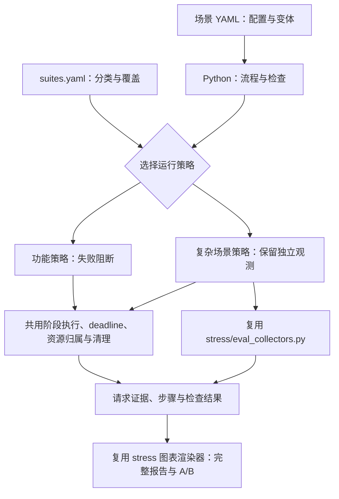

# 功能测试与复杂场景测试

case 分为两类，分类和迁移清单在 `suites.yaml`。分类不等于业务 category，也不等于 batch/non-batch profile。

| | functional：功能合同 | workload：复杂场景 / 持续负载 |
|---|---|---|
| 目的 | 返回码、协议、状态转换、精确竞态是否正确 | 系统在负载、拓扑变化与恢复过程中是否遵守合同 |
| 流程 | 少量可控请求与确定操作 | 持续流量、多个窗口、干预、恢复和排空 |
| 失败处理 | 前置或检查失败后阻断依赖步骤 | 独立观测 FAIL 后继续；操作失败、ERROR、TIMEOUT 仍阻断 |
| 证据 | 原有逐请求与逐步骤证据 | 同样的细粒度证据，加连续采样、阶段时间线和完整报告 |
| 结果 | 每项检查及原始 PASS/FAIL/ERROR/TIMEOUT | 保留原始裁决，另报运行有效性与性能评估状态 |

新增用例先判断目的。缓存风暴、负载迁移、带载扩缩容、故障恢复等主体流程属于 workload；取消幂等、错误透传、特殊 ID 等便宜而确定的合同仍保留 functional。ABA 是其中一个复杂场景，不是框架设计中心。

## 入口和配置

```bash
# 默认只选功能合同；执行仍需在有 MCP 租约的远端使用原有端口规划。
python3 test_runner.py --profile single-nonbatch --parallel 8

# 复杂场景。单独做延迟/吞吐基线比较时应独占资源，使用一条 lane。
python3 test_runner.py --suite workload --profile batch-window --parallel 1

# 两类完整回归，保持旧入口兼容。
python3 parallel_runner.py --suite all --profile batch-window --parallel 8

# 无服务地检查分类、规模和公开实例 ID。
python3 scenario_runner.py --source scenarios --suite workload --list-json
```

`test_runner.py` 默认 functional，旧 `parallel_runner.py` 和 `scenario_runner.py` 默认 all，以免旧全量调用静默少跑。`--instances` 仍要求属于当前选择范围的精确 ID。

`suites.yaml` 只负责分类、公共观测参数与等价覆盖映射，不描述步骤。每个 case 的 P/D 规模、请求形状、时长、干预和阈值仍由原场景 YAML 提供。扩大规模要核对构造是否仍成立并重新校准相应 band，不能直接倍乘所有用例的 P/D 数量。

## 两种运行策略，共用执行底座



复杂场景的连续采样由运行策略启动并登记到公共资源清理机制；每个环境 epoch 单独保存采样。双 master 分别采样，进程重启代数随步骤记录。原有 case 作者继续使用框架的流量 action，不需要在 Python case program 中创建监控线程。通用有界流量 worker 已放入 `online_eval/traffic.py`，旧导入保留兼容。

Python 明确区分安全的独立观测与前置条件：

```python
case.step("prepare", "setup", timeout_s=case.value("prepare_timeout_s"))
# ... 启动负载、干预、恢复、排空，均使用已有 action 与 YAML 参数 ...
case.observe("distribution", "balance_check", params=case.value("distribution"))
case.observe("completion", "balance_check", params=case.value("completion"))
case.step("cleanup", "teardown")
```

`observe` 只能用于失败后仍可安全执行后续步骤的检查。不要把注入成功、资源准入、恢复就绪等前置条件改成 observe 来消红。功能策略即使看到 observe，也维持失败阻断；workload 的独立 FAIL 保留在最终结果中，不会变成 PASS。

## 产物与比较

每个 workload 实例保留原 `result.json` 和 action 证据，并增加：

- `telemetry/<env_epoch>/`：直接复用压测采集格式的 mock、各 master 原始指标及采集日志。
- `workload-evidence.json`：时钟锚点、步骤事件、master 代数、资源身份与客户端记录。
- `workload-report.json`：全部独立检查、阶段与完整指标序列，供离线复算。
- `workload-report.html`：复用现有 Chart.js 渲染器的全指标曲线及逐项检查证据。

```bash
python3 -m flexlb_test_framework.workload.compare \
  --baseline /path/to/old/workload-report.json \
  --candidate /path/to/new/workload-report.json \
  --out /path/to/comparison
```

比较要求同一实例和同一声明配置，使用同名步骤相对时间对齐，输出双版本曲线与变化排序。排序目前按窗口内原始采样均值的相对变化；计数器也明确展示原始值，不把它冒充速率。缺失窗口标为 MISSING_DATA，零基线不计算相对变化。变化排序是定位线索，不是产品退化裁决。

运行有效、合同正确、性能健康是三个不同结论。缺少必需遥测会使 workload 产物报 ERROR/INVALID；原始状态保留。没有重新校准完整性能围栏时，综合性能状态保持 NOT_EVALUATED，不能从一轮功能 PASS 推导性能 PASS。现有 case 内具体 band 的原始判断仍逐项保留。

## 已落地的覆盖治理

基线为 `3eb8044340` 的 394 实例。当前 288 个 functional、97 个 workload，共 385 个实例。

`priority_queue` 的 `normalize_channels`、`normalize_default30`、`normalize_metrics`，原来各展开四个 profile，但覆盖配置后环境与全部步骤完全相同。各保留 `single-nonbatch` 一个真实匹配的执行，9 个旧实例记录在 `covered_instances`。没有把错误码、边界或其他不同前置条件的检查删除。

其余实例保持公开 ID、环境、时间预算和检查项；已审查的末尾独立检查改用 observe。未确认安全的检查仍按操作前置条件处理。不能为了减少执行数，强行把不同构造和不同故障时机塞成一条流程。
